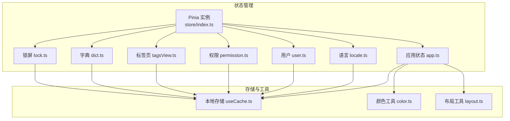
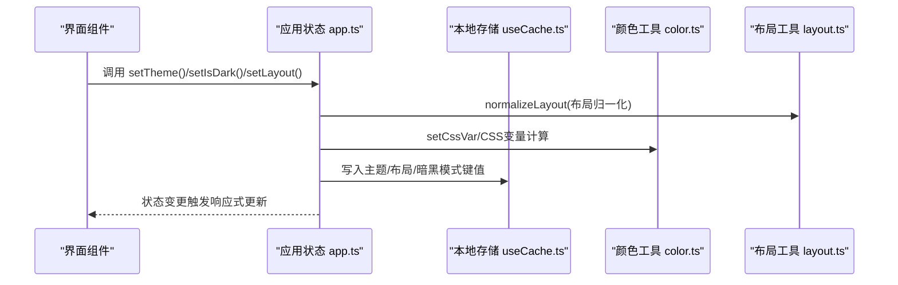
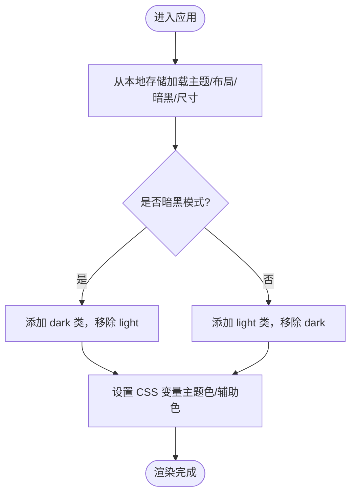
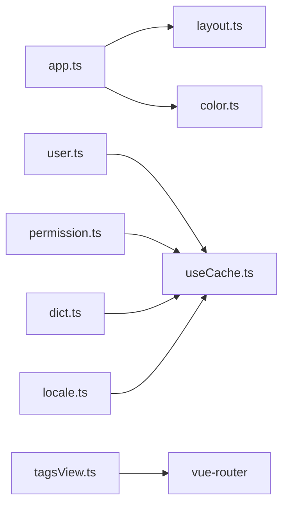

# 应用状态管理

<cite>
**本文引用的文件**
- [src/store/index.ts](file://yudao-ui-admin-vue3/src/store/index.ts)
- [src/store/modules/app.ts](file://yudao-ui-admin-vue3/src/store/modules/app.ts)
- [src/store/modules/locale.ts](file://yudao-ui-admin-vue3/src/store/modules/locale.ts)
- [src/store/modules/user.ts](file://yudao-ui-admin-vue3/src/store/modules/user.ts)
- [src/store/modules/permission.ts](file://yudao-ui-admin-vue3/src/store/modules/permission.ts)
- [src/store/modules/tagsView.ts](file://yudao-ui-admin-vue3/src/store/modules/tagsView.ts)
- [src/store/modules/dict.ts](file://yudao-ui-admin-vue3/src/store/modules/dict.ts)
- [src/store/modules/lock.ts](file://yudao-ui-admin-vue3/src/store/modules/lock.ts)
- [src/hooks/web/useCache.ts](file://yudao-ui-admin-vue3/src/hooks/web/useCache.ts)
- [src/utils/color.ts](file://yudao-ui-admin-vue3/src/utils/color.ts)
- [src/utils/layout.ts](file://yudao-ui-admin-vue3/src/utils/layout.ts)
</cite>

## 目录
1. [简介](#简介)
2. [项目结构](#项目结构)
3. [核心组件](#核心组件)
4. [架构总览](#架构总览)
5. [详细组件分析](#详细组件分析)
6. [依赖关系分析](#依赖关系分析)
7. [性能考虑](#性能考虑)
8. [故障排查指南](#故障排查指南)
9. [结论](#结论)
10. [附录](#附录)

## 简介
本文件面向前端 Vue3 应用的全局状态管理，聚焦以下目标：
- 设计并文档化应用级全局状态：主题、语言、侧边栏布局、标签页、用户与权限等。
- 说明配置的动态加载与热更新机制（主题色、暗黑模式、布局切换）。
- 解释应用状态与本地存储的同步策略（持久化键、过期策略、恢复流程）。
- 提供统一的管理接口：查询、更新、重置。
- 给出最佳实践：状态隔离、性能优化、可维护性建议。

## 项目结构
应用基于 Pinia 进行状态管理，并通过插件实现本地存储持久化；各模块职责清晰：
- store/index.ts：创建 Pinia 实例并启用持久化插件。
- modules/app.ts：应用级 UI 配置（主题、布局、暗黑模式、尺寸、移动端、固定菜单等）。
- modules/locale.ts：多语言当前语言与 Element Plus 语言包映射。
- modules/user.ts：登录态、用户信息、权限与角色。
- modules/permission.ts：动态路由生成与菜单路由集合。
- modules/tagsView.ts：标签页访问历史与缓存视图集合。
- modules/dict.ts：字典数据缓存与刷新。
- modules/lock.ts：锁屏状态（可选）。
- hooks/web/useCache.ts：封装 web-storage-cache，定义统一的本地存储键名。
- utils/color.ts：颜色工具（HEX/RGB 转换、对比度、CSS 变量读取）。
- utils/layout.ts：布局类型归一化与判断。

图表来源
- [src/store/index.ts:1-13](file://yudao-ui-admin-vue3/src/store/index.ts#L1-L13)
- [src/store/modules/app.ts:1-341](file://yudao-ui-admin-vue3/src/store/modules/app.ts#L1-L341)
- [src/store/modules/locale.ts:1-60](file://yudao-ui-admin-vue3/src/store/modules/locale.ts#L1-L60)
- [src/store/modules/user.ts:1-109](file://yudao-ui-admin-vue3/src/store/modules/user.ts#L1-L109)
- [src/store/modules/permission.ts:1-80](file://yudao-ui-admin-vue3/src/store/modules/permission.ts#L1-L80)
- [src/store/modules/tagsView.ts:1-184](file://yudao-ui-admin-vue3/src/store/modules/tagsView.ts#L1-L184)
- [src/store/modules/dict.ts:1-111](file://yudao-ui-admin-vue3/src/store/modules/dict.ts#L1-L111)
- [src/store/modules/lock.ts:1-49](file://yudao-ui-admin-vue3/src/store/modules/lock.ts#L1-L49)
- [src/hooks/web/useCache.ts:1-42](file://yudao-ui-admin-vue3/src/hooks/web/useCache.ts#L1-L42)
- [src/utils/color.ts:1-217](file://yudao-ui-admin-vue3/src/utils/color.ts#L1-L217)
- [src/utils/layout.ts:1-68](file://yudao-ui-admin-vue3/src/utils/layout.ts#L1-L68)

章节来源
- [src/store/index.ts:1-13](file://yudao-ui-admin-vue3/src/store/index.ts#L1-L13)

## 核心组件
- 应用状态（app）：集中管理主题、暗黑模式、布局、尺寸、移动端、固定菜单、标题、软电话开关等，并提供设置 CSS 变量的能力以驱动 UI 实时变化。
- 语言状态（locale）：维护当前语言与 Element Plus 语言包映射，支持切换并持久化。
- 用户状态（user）：维护登录态、用户信息、权限与角色，提供获取用户信息与登出清理。
- 权限状态（permission）：根据后端返回的菜单数据生成动态路由，并注入到路由系统中。
- 标签页状态（tagsView）：维护已访问页面与缓存视图集合，支持增删改查与批量操作。
- 字典状态（dict）：拉取并缓存字典数据，支持按类型查询与强制刷新。
- 锁屏状态（lock）：可选的锁屏功能状态管理。

章节来源
- [src/store/modules/app.ts:14-110](file://yudao-ui-admin-vue3/src/store/modules/app.ts#L14-L110)
- [src/store/modules/locale.ts:14-38](file://yudao-ui-admin-vue3/src/store/modules/locale.ts#L14-L38)
- [src/store/modules/user.ts:9-35](file://yudao-ui-admin-vue3/src/store/modules/user.ts#L9-L35)
- [src/store/modules/permission.ts:10-23](file://yudao-ui-admin-vue3/src/store/modules/permission.ts#L10-L23)
- [src/store/modules/tagsView.ts:9-20](file://yudao-ui-admin-vue3/src/store/modules/tagsView.ts#L9-L20)
- [src/store/modules/dict.ts:9-28](file://yudao-ui-admin-vue3/src/store/modules/dict.ts#L9-L28)
- [src/store/modules/lock.ts:4-20](file://yudao-ui-admin-vue3/src/store/modules/lock.ts#L4-L20)

## 架构总览
应用状态通过 Pinia 统一管理，结合本地存储实现跨会话持久化；UI 层通过 getters 读取状态，actions 触发变更；主题与布局变更通过 CSS 变量即时生效，无需刷新页面。

图表来源
- [src/store/modules/app.ts:287-327](file://yudao-ui-admin-vue3/src/store/modules/app.ts#L287-L327)
- [src/utils/layout.ts:23-35](file://yudao-ui-admin-vue3/src/utils/layout.ts#L23-L35)
- [src/utils/color.ts:205-216](file://yudao-ui-admin-vue3/src/utils/color.ts#L205-L216)
- [src/hooks/web/useCache.ts:25-33](file://yudao-ui-admin-vue3/src/hooks/web/useCache.ts#L25-L33)

## 详细组件分析

### 应用状态（app）
- 职责：管理主题、暗黑模式、布局、尺寸、移动端、固定菜单、标题、软电话等全局 UI 配置。
- 关键能力：
  - 主题色与辅助色的 RGB 变量计算与 CSS 变量注入，实现主题热更新。
  - 暗黑模式切换时自动在根节点切换 class，并重新计算主题色。
  - 布局切换时进行移动端限制校验与本地持久化。
  - 尺寸与固定菜单等偏好持久化。
- 数据流：
  - 初始化从本地存储恢复主题、布局、暗黑模式、尺寸等。
  - 变更通过 actions 写入本地存储并更新 DOM CSS 变量。
- 接口概览：
  - 查询：getTheme/getIsDark/getLayout/getCurrentSize/getFixedMenu 等。
  - 更新：setTheme/setIsDark/setLayout/setCurrentSize/setFixedMenu 等。
  - 重置：无显式 reset，可通过覆盖默认值或清空本地存储实现。

图表来源
- [src/store/modules/app.ts:299-327](file://yudao-ui-admin-vue3/src/store/modules/app.ts#L299-L327)
- [src/utils/color.ts:196-216](file://yudao-ui-admin-vue3/src/utils/color.ts#L196-L216)

章节来源
- [src/store/modules/app.ts:14-341](file://yudao-ui-admin-vue3/src/store/modules/app.ts#L14-L341)
- [src/utils/layout.ts:23-35](file://yudao-ui-admin-vue3/src/utils/layout.ts#L23-L35)
- [src/utils/color.ts:184-216](file://yudao-ui-admin-vue3/src/utils/color.ts#L184-L216)

### 语言状态（locale）
- 职责：维护当前语言与 Element Plus 语言包映射，支持切换并持久化。
- 关键能力：
  - 初始化从本地存储恢复当前语言。
  - 切换语言时更新 currentLocale.lang 与 elLocale，并持久化。
- 接口概览：
  - 查询：getCurrentLocale/getLocaleMap。
  - 更新：setCurrentLocale。
  - 重置：无显式 reset，可通过设置默认语言实现。

章节来源
- [src/store/modules/locale.ts:14-55](file://yudao-ui-admin-vue3/src/store/modules/locale.ts#L14-L55)

### 用户状态（user）
- 职责：维护登录态、用户信息、权限与角色，提供获取用户信息与登出清理。
- 关键能力：
  - 首次或缓存缺失时拉取用户信息，并缓存至本地存储。
  - 登出时清除 Token、删除用户相关缓存并重置状态。
- 接口概览：
  - 查询：getPermissions/getRoles/getUser。
  - 更新：setUserInfoAction/setUserAvatarAction/setUserNicknameAction。
  - 重置：resetState。

章节来源
- [src/store/modules/user.ts:9-109](file://yudao-ui-admin-vue3/src/store/modules/user.ts#L9-L109)

### 权限状态（permission）
- 职责：根据后端返回的菜单数据生成动态路由，并注入到路由系统。
- 关键能力：
  - 从本地存储读取角色路由，生成扁平化路由表，追加 404 路由。
  - 合并静态剩余路由与动态路由，供菜单渲染使用。
- 接口概览：
  - 查询：getRouters/getAddRouters/getMenuTabRouters/getMenuRootPath。
  - 更新：generateRoutes/setMenuTabRouters/setMenuRootPath。
  - 重置：无显式 reset，可通过重新生成路由实现。

章节来源
- [src/store/modules/permission.ts:10-80](file://yudao-ui-admin-vue3/src/store/modules/permission.ts#L10-L80)

### 标签页状态（tagsView）
- 职责：维护已访问页面与缓存视图集合，支持增删改查与批量操作。
- 关键能力：
  - 新增/删除访问记录与缓存视图，保持两者一致。
  - 支持删除其他、左侧、右侧、全部等操作。
  - 支持更新标题与选中标签。
- 接口概览：
  - 查询：getVisitedViews/getCachedViews/getSelectedTag。
  - 更新：addView/addVisitedView/addCachedView/delView/delVisitedView/delCachedView/delAllViews/delAllVisitedViews/delOthersViews/delOthersVisitedViews/delLeftViews/delRightViews/updateVisitedView/setSelectedTag/setTitle。
  - 重置：delAllVisitedViews。

章节来源
- [src/store/modules/tagsView.ts:9-184](file://yudao-ui-admin-vue3/src/store/modules/tagsView.ts#L9-L184)

### 字典状态（dict）
- 职责：拉取并缓存字典数据，支持按类型查询与强制刷新。
- 关键能力：
  - 优先从本地存储读取字典缓存，否则拉取并缓存（带过期时间）。
  - 支持强制刷新字典数据。
- 接口概览：
  - 查询：getDictMap/getIsSetDict/getDictByType。
  - 更新：setDictMap/resetDict。
  - 重置：resetDict。

章节来源
- [src/store/modules/dict.ts:9-111](file://yudao-ui-admin-vue3/src/store/modules/dict.ts#L9-L111)

### 锁屏状态（lock）
- 职责：可选的锁屏功能状态管理。
- 关键能力：
  - 设置/重置锁屏信息，解锁校验密码。
- 接口概览：
  - 查询：getLockInfo。
  - 更新：setLockInfo/unLock。
  - 重置：resetLockInfo。

章节来源
- [src/store/modules/lock.ts:4-49](file://yudao-ui-admin-vue3/src/store/modules/lock.ts#L4-L49)

## 依赖关系分析
- 模块耦合：
  - app 依赖 layout 与 color 工具，用于布局归一化与主题变量设置。
  - user 与 permission 依赖本地存储键（用户信息、角色路由）。
  - tagsView 依赖 router 与用户信息（保留固定标签）。
  - dict 依赖本地存储与 API 拉取字典数据。
- 外部依赖：
  - Pinia 与持久化插件用于状态管理与本地存储。
  - web-storage-cache 用于本地存储封装与过期策略。
  - Element Plus 语言包与主题变量。

图表来源
- [src/store/modules/app.ts:1-10](file://yudao-ui-admin-vue3/src/store/modules/app.ts#L1-L10)
- [src/store/modules/user.ts:1-7](file://yudao-ui-admin-vue3/src/store/modules/user.ts#L1-L7)
- [src/store/modules/permission.ts:1-8](file://yudao-ui-admin-vue3/src/store/modules/permission.ts#L1-L8)
- [src/store/modules/tagsView.ts:1-7](file://yudao-ui-admin-vue3/src/store/modules/tagsView.ts#L1-L7)
- [src/store/modules/dict.ts:1-8](file://yudao-ui-admin-vue3/src/store/modules/dict.ts#L1-L8)
- [src/store/modules/locale.ts:1-8](file://yudao-ui-admin-vue3/src/store/modules/locale.ts#L1-L8)

章节来源
- [src/store/modules/app.ts:1-10](file://yudao-ui-admin-vue3/src/store/modules/app.ts#L1-L10)
- [src/store/modules/user.ts:1-7](file://yudao-ui-admin-vue3/src/store/modules/user.ts#L1-L7)
- [src/store/modules/permission.ts:1-8](file://yudao-ui-admin-vue3/src/store/modules/permission.ts#L1-L8)
- [src/store/modules/tagsView.ts:1-7](file://yudao-ui-admin-vue3/src/store/modules/tagsView.ts#L1-L7)
- [src/store/modules/dict.ts:1-8](file://yudao-ui-admin-vue3/src/store/modules/dict.ts#L1-L8)
- [src/store/modules/locale.ts:1-8](file://yudao-ui-admin-vue3/src/store/modules/locale.ts#L1-L8)

## 性能考虑
- 避免重复渲染：
  - 主题与布局变更通过 CSS 变量一次性更新，减少重绘。
  - 标签页缓存视图集合去重与比较后再更新。
- 本地存储读写：
  - 字典数据设置短过期时间，降低频繁请求。
  - 用户信息在缓存存在时优先读取，失败不影响进入系统。
- 移动端限制：
  - 移动端不支持切换布局，避免无效操作与额外渲染。
- 懒加载：
  - 动态路由按需引入组件，减少首屏体积。

[本节为通用指导，不直接分析具体文件]

## 故障排查指南
- 主题未生效：
  - 检查是否正确调用 setTheme/setIsDark，并确保 CSS 变量设置成功。
  - 确认暗黑模式下根节点 class 切换正确。
- 布局切换异常：
  - 检查移动端模式下是否尝试切换非 sidebar-nav 布局。
  - 确认 normalizeLayout 返回值是否符合预期。
- 语言切换无效：
  - 检查 setCurrentLocale 是否更新了 currentLocale 与本地存储。
  - 确认 Element Plus 语言包映射是否存在。
- 用户信息丢失：
  - 检查 getAccessToken 是否为空，以及本地存储键是否被清理。
  - 登出后确认 deleteUserCache 是否执行。
- 标签页缓存不一致：
  - 检查 addCachedView 与 delCachedView 逻辑，确保与 visitedViews 同步。
- 字典数据过期：
  - 检查本地存储过期时间与刷新逻辑，必要时调用 resetDict。

章节来源
- [src/store/modules/app.ts:287-327](file://yudao-ui-admin-vue3/src/store/modules/app.ts#L287-L327)
- [src/store/modules/locale.ts:47-55](file://yudao-ui-admin-vue3/src/store/modules/locale.ts#L47-L55)
- [src/store/modules/user.ts:51-91](file://yudao-ui-admin-vue3/src/store/modules/user.ts#L51-L91)
- [src/store/modules/tagsView.ts:63-105](file://yudao-ui-admin-vue3/src/store/modules/tagsView.ts#L63-L105)
- [src/store/modules/dict.ts:42-104](file://yudao-ui-admin-vue3/src/store/modules/dict.ts#L42-L104)

## 结论
该应用采用 Pinia 进行全局状态管理，结合本地存储实现配置持久化与状态恢复。通过 CSS 变量与工具函数实现主题与布局的热更新，提升用户体验。各模块职责清晰、接口明确，便于扩展与维护。建议在后续开发中继续遵循状态隔离、最小化本地存储读写、合理缓存策略与错误兜底的最佳实践。

[本节为总结性内容，不直接分析具体文件]

## 附录
- 本地存储键约定（部分）：
  - 用户相关：USER、ROLE_ROUTERS、VisitTenantId
  - 系统设置：IS_DARK、LANG、THEME、LAYOUT、DICT_CACHE
  - 登录表单：LoginForm、TenantId
- 常用操作路径参考：
  - 主题设置与 CSS 变量注入：[src/store/modules/app.ts:198-327](file://yudao-ui-admin-vue3/src/store/modules/app.ts#L198-L327)
  - 暗黑模式切换：[src/store/modules/app.ts:299-310](file://yudao-ui-admin-vue3/src/store/modules/app.ts#L299-L310)
  - 布局归一化与校验：[src/utils/layout.ts:23-35](file://yudao-ui-admin-vue3/src/utils/layout.ts#L23-L35)
  - 颜色工具与 CSS 变量读取：[src/utils/color.ts:196-216](file://yudao-ui-admin-vue3/src/utils/color.ts#L196-L216)
  - 本地存储封装与键定义：[src/hooks/web/useCache.ts:9-33](file://yudao-ui-admin-vue3/src/hooks/web/useCache.ts#L9-L33)
  - 用户信息获取与缓存：[src/store/modules/user.ts:51-71](file://yudao-ui-admin-vue3/src/store/modules/user.ts#L51-L71)
  - 动态路由生成：[src/store/modules/permission.ts:39-65](file://yudao-ui-admin-vue3/src/store/modules/permission.ts#L39-L65)
  - 标签页缓存同步：[src/store/modules/tagsView.ts:33-77](file://yudao-ui-admin-vue3/src/store/modules/tagsView.ts#L33-L77)
  - 字典缓存与刷新：[src/store/modules/dict.ts:42-104](file://yudao-ui-admin-vue3/src/store/modules/dict.ts#L42-L104)

[本节为补充信息，不直接分析具体文件]