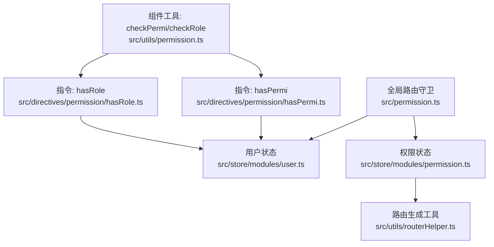
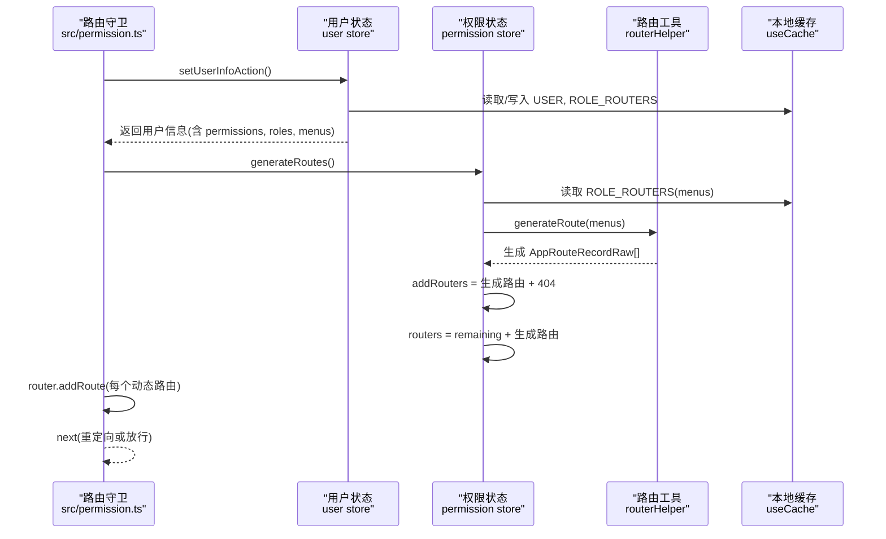
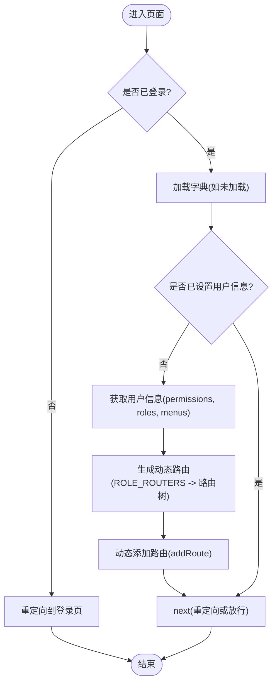
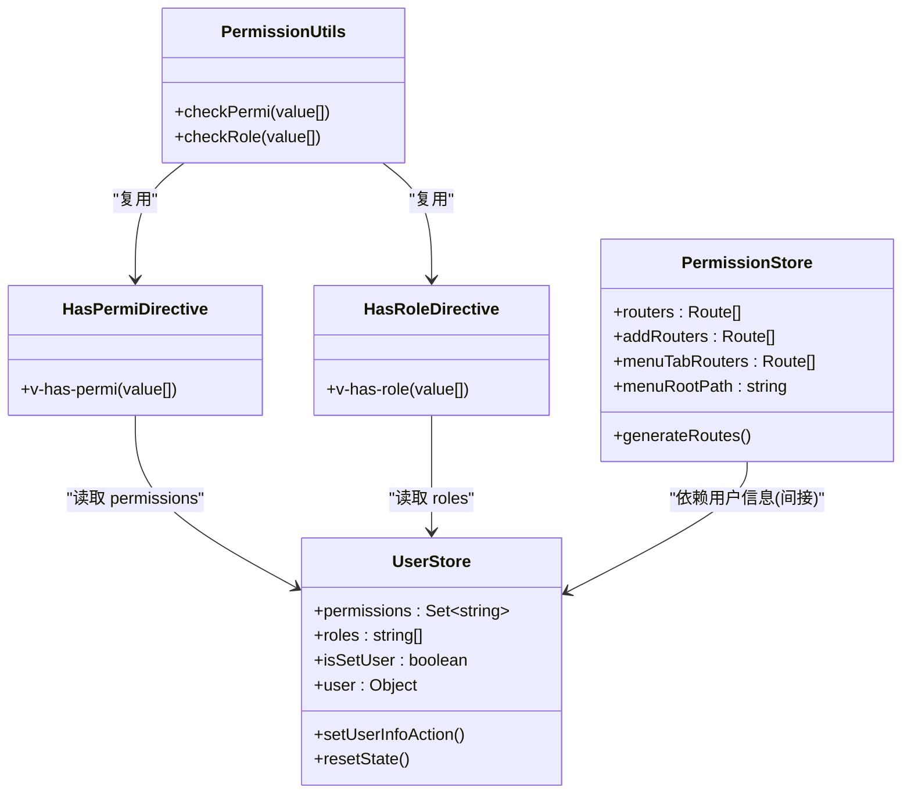
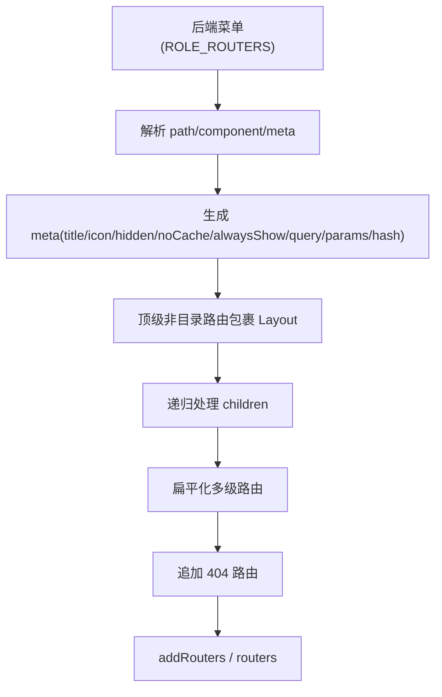
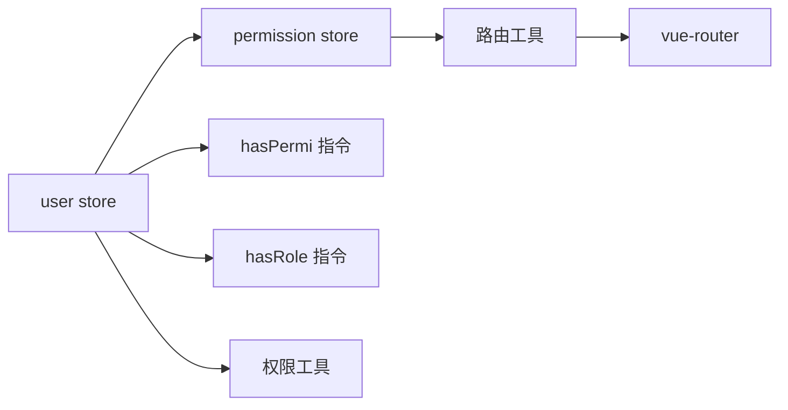

# 权限状态管理

<cite>
**本文引用的文件**
- [permission.ts](file://yudao-ui-admin-vue3/src/permission.ts)
- [permission store](file://yudao-ui-admin-vue3/src/store/modules/permission.ts)
- [user store](file://yudao-ui-admin-vue3/src/store/modules/user.ts)
- [hasPermi 指令](file://yudao-ui-admin-vue3/src/directives/permission/hasPermi.ts)
- [hasRole 指令](file://yudao-ui-admin-vue3/src/directives/permission/hasRole.ts)
- [路由工具](file://yudao-ui-admin-vue3/src/utils/routerHelper.ts)
- [权限工具](file://yudao-ui-admin-vue3/src/utils/permission.ts)
</cite>

## 目录
1. [简介](#简介)
2. [项目结构](#项目结构)
3. [核心组件](#核心组件)
4. [架构总览](#架构总览)
5. [详细组件分析](#详细组件分析)
6. [依赖关系分析](#依赖关系分析)
7. [性能考虑](#性能考虑)
8. [故障排查指南](#故障排查指南)
9. [结论](#结论)
10. [附录](#附录)

## 简介
本文件面向前端 Vue3 + Pinia 的权限状态管理，系统性说明：
- 权限数据结构与存储格式（路由、菜单、按钮）
- 权限加载与更新流程（动态路由生成、权限过滤）
- 权限状态与用户状态的关联及同步机制
- 权限验证实现（指令级与组件级）
- 最佳实践与性能优化建议

## 项目结构
权限相关代码主要分布在以下模块：
- 全局路由守卫与初始化：src/permission.ts
- 权限状态管理：src/store/modules/permission.ts
- 用户状态管理：src/store/modules/user.ts
- 指令级权限控制：src/directives/permission/hasPermi.ts、hasRole.ts
- 路由生成与扁平化：src/utils/routerHelper.ts
- 组件级权限校验工具：src/utils/permission.ts

图表来源
- [permission.ts:28-71](file://yudao-ui-admin-vue3/src/permission.ts#L28-L71)
- [user store:51-71](file://yudao-ui-admin-vue3/src/store/modules/user.ts#L51-L71)
- [permission store:39-65](file://yudao-ui-admin-vue3/src/store/modules/permission.ts#L39-L65)
- [路由工具:74-220](file://yudao-ui-admin-vue3/src/utils/routerHelper.ts#L74-L220)
- [hasPermi:7-31](file://yudao-ui-admin-vue3/src/directives/permission/hasPermi.ts#L7-L31)
- [hasRole:6-28](file://yudao-ui-admin-vue3/src/directives/permission/hasRole.ts#L6-L28)
- [权限工具:11-35](file://yudao-ui-admin-vue3/src/utils/permission.ts#L11-L35)

章节来源
- [permission.ts:28-71](file://yudao-ui-admin-vue3/src/permission.ts#L28-L71)
- [permission store:17-75](file://yudao-ui-admin-vue3/src/store/modules/permission.ts#L17-L75)
- [user store:24-103](file://yudao-ui-admin-vue3/src/store/modules/user.ts#L24-L103)
- [hasPermi:7-31](file://yudao-ui-admin-vue3/src/directives/permission/hasPermi.ts#L7-L31)
- [hasRole:6-28](file://yudao-ui-admin-vue3/src/directives/permission/hasRole.ts#L6-L28)
- [路由工具:74-220](file://yudao-ui-admin-vue3/src/utils/routerHelper.ts#L74-L220)
- [权限工具:11-35](file://yudao-ui-admin-vue3/src/utils/permission.ts#L11-L35)

## 核心组件
- 全局路由守卫：负责登录态判断、字典加载、用户信息获取、动态路由生成与注册。
- 用户状态（user store）：维护当前用户的权限集合、角色列表、用户基本信息，并缓存至本地存储。
- 权限状态（permission store）：维护静态路由、动态路由、标签页路由以及根路径；提供动态路由生成方法。
- 指令：hasPermi（按钮/元素级权限）、hasRole（角色级权限）。
- 路由工具：将后端返回的菜单数据转换为可渲染的路由树，支持外链、多级折叠、404兜底等。
- 组件工具：封装 checkPermi、checkRole，供业务组件直接调用。

章节来源
- [permission.ts:28-71](file://yudao-ui-admin-vue3/src/permission.ts#L28-L71)
- [user store:51-71](file://yudao-ui-admin-vue3/src/store/modules/user.ts#L51-L71)
- [permission store:39-65](file://yudao-ui-admin-vue3/src/store/modules/permission.ts#L39-L65)
- [hasPermi:7-31](file://yudao-ui-admin-vue3/src/directives/permission/hasPermi.ts#L7-L31)
- [hasRole:6-28](file://yudao-ui-admin-vue3/src/directives/permission/hasRole.ts#L6-L28)
- [路由工具:74-220](file://yudao-ui-admin-vue3/src/utils/routerHelper.ts#L74-L220)
- [权限工具:11-35](file://yudao-ui-admin-vue3/src/utils/permission.ts#L11-L35)

## 架构总览
下图展示从登录到动态路由生成的完整链路，以及权限在指令与组件中的使用方式。

图表来源
- [permission.ts:28-71](file://yudao-ui-admin-vue3/src/permission.ts#L28-L71)
- [user store:51-71](file://yudao-ui-admin-vue3/src/store/modules/user.ts#L51-L71)
- [permission store:39-65](file://yudao-ui-admin-vue3/src/store/modules/permission.ts#L39-L65)
- [路由工具:74-220](file://yudao-ui-admin-vue3/src/utils/routerHelper.ts#L74-L220)

## 详细组件分析

### 权限数据结构与存储格式
- 路由权限（菜单）
  - 来源：登录后用户信息中的 menus 字段，作为“后端菜单”数据。
  - 存储：持久化到本地缓存的 ROLE_ROUTERS，供权限状态读取并生成路由。
  - 转换：通过 generateRoute 将后端菜单转为前端路由树（AppRouteRecordRaw），并追加 404 兜底路由。
  - 渲染：最终合并到 routers 中，并通过 router.addRoute 动态注入。
- 按钮权限（指令/组件）
  - 来源：用户信息中的 permissions 集合。
  - 存储：以 Set<string> 形式保存在 user store，同时缓存到本地。
  - 校验：指令 hasPermi 与组件工具 checkPermi 基于该集合进行匹配；支持超级权限通配符。
- 角色权限
  - 来源：用户信息中的 roles 数组。
  - 存储：保存在 user store 与本地缓存。
  - 校验：指令 hasRole 与组件工具 checkRole 基于 roles 进行匹配；支持超级管理员角色。

章节来源
- [user store:51-71](file://yudao-ui-admin-vue3/src/store/modules/user.ts#L51-L71)
- [permission store:39-65](file://yudao-ui-admin-vue3/src/store/modules/permission.ts#L39-L65)
- [hasPermi:23-31](file://yudao-ui-admin-vue3/src/directives/permission/hasPermi.ts#L23-L31)
- [hasRole:6-28](file://yudao-ui-admin-vue3/src/directives/permission/hasRole.ts#L6-L28)
- [路由工具:74-220](file://yudao-ui-admin-vue3/src/utils/routerHelper.ts#L74-L220)
- [权限工具:11-35](file://yudao-ui-admin-vue3/src/utils/permission.ts#L11-L35)

### 权限加载与更新流程（动态路由生成与过滤）
- 入口：全局路由守卫在进入页面时触发。
- 步骤：
  1) 若已登录，先确保字典加载完成。
  2) 若尚未设置用户信息，则调用用户状态接口获取用户信息（包含 permissions、roles、menus）。
  3) 调用权限状态生成路由，内部从缓存读取 ROLE_ROUTERS，经 generateRoute 生成路由树，并追加 404。
  4) 将生成的动态路由逐一添加到路由器。
  5) 根据 redirect 参数进行重定向或放行。
- 更新时机：
  - 刷新后首次进入：由路由守卫触发一次。
  - 切换用户或权限变更：需重新执行 setUserInfoAction 与 generateRoutes，再重新 addRoute。

图表来源
- [permission.ts:28-71](file://yudao-ui-admin-vue3/src/permission.ts#L28-L71)
- [user store:51-71](file://yudao-ui-admin-vue3/src/store/modules/user.ts#L51-L71)
- [permission store:39-65](file://yudao-ui-admin-vue3/src/store/modules/permission.ts#L39-L65)
- [路由工具:74-220](file://yudao-ui-admin-vue3/src/utils/routerHelper.ts#L74-L220)

章节来源
- [permission.ts:28-71](file://yudao-ui-admin-vue3/src/permission.ts#L28-L71)
- [permission store:39-65](file://yudao-ui-admin-vue3/src/store/modules/permission.ts#L39-L65)

### 权限状态与用户状态的关联与同步
- 关联点：
  - user store 负责拉取并缓存用户信息（permissions、roles、menus），并在成功时标记 isSetUser。
  - permission store 依赖缓存中的 ROLE_ROUTERS 生成路由，并将结果保存到 routers/addRouters。
- 同步机制：
  - 首次进入：路由守卫触发 setUserInfoAction，随后 generateRoutes，保证两者一致。
  - 后续刷新：由于缓存存在，setUserInfoAction 会优先读缓存，必要时重试接口；generateRoutes 仍可从缓存读取菜单。
  - 退出登录：清除 token 与用户缓存，重置 user store 状态，避免脏数据影响。

章节来源
- [user store:51-103](file://yudao-ui-admin-vue3/src/store/modules/user.ts#L51-L103)
- [permission store:39-65](file://yudao-ui-admin-vue3/src/store/modules/permission.ts#L39-L65)
- [permission.ts:28-71](file://yudao-ui-admin-vue3/src/permission.ts#L28-L71)

### 权限验证实现（指令级与组件级）
- 指令级
  - v-has-permi：传入权限标识数组，内部基于 user store 的 permissions 集合进行匹配；支持超级权限通配符。不满足条件时移除 DOM 节点。
  - v-has-role：传入角色数组，基于本地缓存的用户 roles 进行匹配；支持超级管理员角色。不满足条件时移除 DOM 节点。
- 组件级
  - checkPermi：封装 hasPermission，用于在逻辑中判断按钮/操作是否可见或可用。
  - checkRole：封装角色判断，结合 super_admin 策略。

图表来源
- [user store:24-103](file://yudao-ui-admin-vue3/src/store/modules/user.ts#L24-L103)
- [permission store:17-75](file://yudao-ui-admin-vue3/src/store/modules/permission.ts#L17-L75)
- [hasPermi:7-31](file://yudao-ui-admin-vue3/src/directives/permission/hasPermi.ts#L7-L31)
- [hasRole:6-28](file://yudao-ui-admin-vue3/src/directives/permission/hasRole.ts#L6-L28)
- [权限工具:11-35](file://yudao-ui-admin-vue3/src/utils/permission.ts#L11-L35)

章节来源
- [hasPermi:7-31](file://yudao-ui-admin-vue3/src/directives/permission/hasPermi.ts#L7-L31)
- [hasRole:6-28](file://yudao-ui-admin-vue3/src/directives/permission/hasRole.ts#L6-L28)
- [权限工具:11-35](file://yudao-ui-admin-vue3/src/utils/permission.ts#L11-L35)

### 路由生成与过滤逻辑
- 输入：后端菜单（ROLE_ROUTERS），包含 path、component、visible、keepAlive、children 等。
- 处理：
  - 解析 component/path，支持外链与内嵌 iframe。
  - 生成 meta（title、icon、hidden、noCache、alwaysShow、query/params/hash）。
  - 处理顶级非目录路由，自动包裹 Layout。
  - 递归生成子路由，处理同名冲突与折叠。
  - 扁平化多级路由为二级，便于侧边栏渲染。
  - 追加 404 路由作为兜底。
- 输出：addRouters（动态路由）与 routers（静态+动态）。

图表来源
- [路由工具:74-220](file://yudao-ui-admin-vue3/src/utils/routerHelper.ts#L74-L220)
- [路由工具:294-337](file://yudao-ui-admin-vue3/src/utils/routerHelper.ts#L294-L337)
- [permission store:39-65](file://yudao-ui-admin-vue3/src/store/modules/permission.ts#L39-L65)

章节来源
- [路由工具:74-220](file://yudao-ui-admin-vue3/src/utils/routerHelper.ts#L74-L220)
- [路由工具:294-337](file://yudao-ui-admin-vue3/src/utils/routerHelper.ts#L294-L337)
- [permission store:39-65](file://yudao-ui-admin-vue3/src/store/modules/permission.ts#L39-L65)

## 依赖关系分析
- 低耦合高内聚：
  - user store 专注用户数据与缓存，不感知路由细节。
  - permission store 专注路由构建与状态，依赖缓存中的菜单数据。
  - 指令与工具函数仅依赖 user store 的权限/角色数据，职责单一。
- 外部依赖：
  - vue-router：动态注册路由、导航守卫。
  - pinia：状态管理与组合式 API。
  - lodash-es：深拷贝与对象操作。
  - 本地缓存：用于跨刷新保持权限与菜单一致性。

图表来源
- [user store:24-103](file://yudao-ui-admin-vue3/src/store/modules/user.ts#L24-L103)
- [permission store:17-75](file://yudao-ui-admin-vue3/src/store/modules/permission.ts#L17-L75)
- [hasPermi:7-31](file://yudao-ui-admin-vue3/src/directives/permission/hasPermi.ts#L7-L31)
- [hasRole:6-28](file://yudao-ui-admin-vue3/src/directives/permission/hasRole.ts#L6-L28)
- [路由工具:74-220](file://yudao-ui-admin-vue3/src/utils/routerHelper.ts#L74-L220)

章节来源
- [user store:24-103](file://yudao-ui-admin-vue3/src/store/modules/user.ts#L24-L103)
- [permission store:17-75](file://yudao-ui-admin-vue3/src/store/modules/permission.ts#L17-L75)
- [路由工具:74-220](file://yudao-ui-admin-vue3/src/utils/routerHelper.ts#L74-L220)

## 性能考虑
- 路由懒加载：组件通过异步 import 按需加载，减少首屏体积。
- 路由扁平化：将多级路由扁平为二级，降低侧边栏渲染复杂度。
- 缓存策略：
  - 用户信息与菜单缓存于本地，避免重复请求。
  - 刷新后优先读缓存，必要时静默重试接口，提升体验。
- 404 兜底：最后追加 404 路由，减少无效匹配开销。
- 最小化重绘：指令在权限不满足时直接移除 DOM，避免多余渲染。

[本节为通用性能建议，无需具体文件引用]

## 故障排查指南
- 动态路由未生效
  - 检查是否在路由守卫中调用了 generateRoutes 与 addRoute。
  - 确认缓存中是否存在 ROLE_ROUTERS。
- 按钮/菜单不显示
  - 检查 user store 的 permissions/roles 是否正确填充。
  - 检查指令传参是否为数组且非空。
- 刷新后权限丢失
  - 确认本地缓存是否被清理（如登出流程）。
  - 确认 setUserInfoAction 能正确写入缓存。
- 外链/iframe 异常
  - 检查菜单 path 是否为 URL，并确保路由工具正确识别外链分支。

章节来源
- [permission.ts:28-71](file://yudao-ui-admin-vue3/src/permission.ts#L28-L71)
- [user store:51-103](file://yudao-ui-admin-vue3/src/store/modules/user.ts#L51-L103)
- [hasPermi:7-31](file://yudao-ui-admin-vue3/src/directives/permission/hasPermi.ts#L7-L31)
- [hasRole:6-28](file://yudao-ui-admin-vue3/src/directives/permission/hasRole.ts#L6-L28)
- [路由工具:74-220](file://yudao-ui-admin-vue3/src/utils/routerHelper.ts#L74-L220)

## 结论
本项目采用“后端菜单驱动 + 前端动态路由”的模式，配合 Pinia 状态管理与本地缓存，实现了稳定的权限体系。通过指令与组件工具双重校验，既保证了界面可控性，也兼顾了开发便捷性。建议在权限变更后统一走 setUserInfoAction + generateRoutes 的流程，确保前后端权限一致。

[本节为总结性内容，无需具体文件引用]

## 附录
- 关键流程参考
  - 路由守卫与动态路由：[permission.ts:28-71](file://yudao-ui-admin-vue3/src/permission.ts#L28-L71)
  - 用户信息加载与缓存：[user store:51-71](file://yudao-ui-admin-vue3/src/store/modules/user.ts#L51-L71)
  - 动态路由生成与扁平化：[路由工具:74-220](file://yudao-ui-admin-vue3/src/utils/routerHelper.ts#L74-L220)、[路由工具:294-337](file://yudao-ui-admin-vue3/src/utils/routerHelper.ts#L294-L337)
  - 指令级权限校验：[hasPermi:7-31](file://yudao-ui-admin-vue3/src/directives/permission/hasPermi.ts#L7-L31)、[hasRole:6-28](file://yudao-ui-admin-vue3/src/directives/permission/hasRole.ts#L6-L28)
  - 组件级权限校验：[权限工具:11-35](file://yudao-ui-admin-vue3/src/utils/permission.ts#L11-L35)