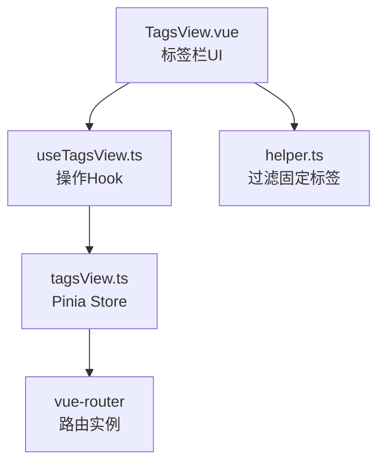
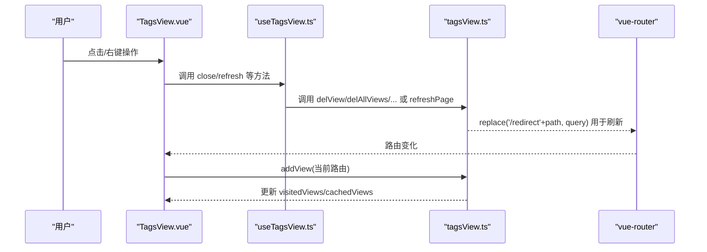
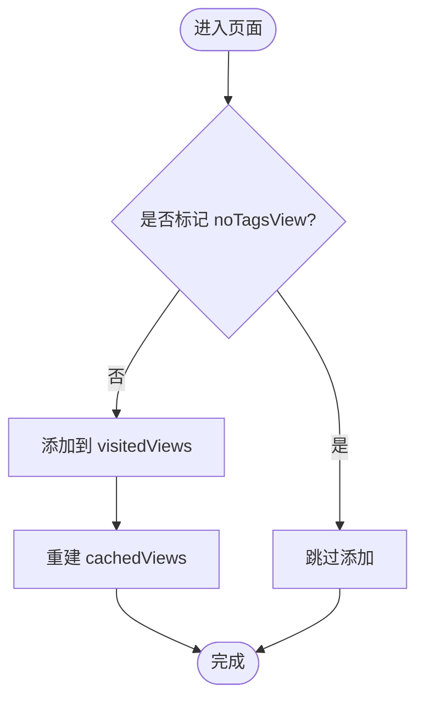
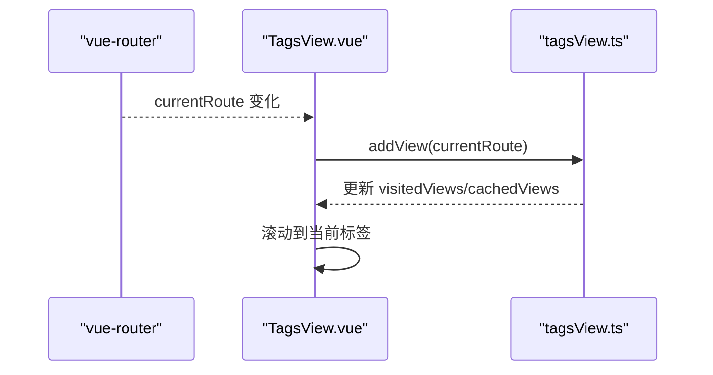
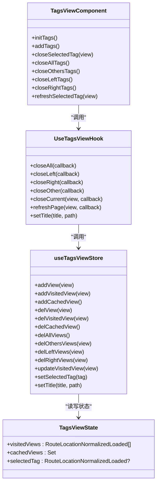
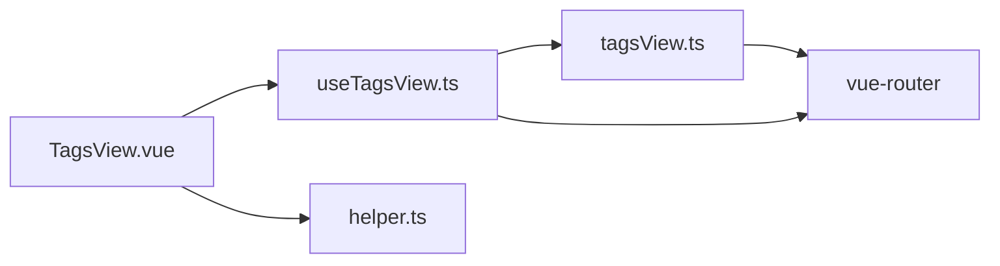

# 标签页状态管理

<cite>
**本文引用的文件**
- [tagsView.ts](file://yudao-ui-admin-vue3/src/store/modules/tagsView.ts)
- [TagsView.vue](file://yudao-ui-admin-vue3/src/layout/components/TagsView/src/TagsView.vue)
- [helper.ts](file://yudao-ui-admin-vue3/src/layout/components/TagsView/src/helper.ts)
- [useTagsView.ts](file://yudao-ui-admin-vue3/src/hooks/web/useTagsView.ts)
</cite>

## 目录
1. [简介](#简介)
2. [项目结构](#项目结构)
3. [核心组件](#核心组件)
4. [架构总览](#架构总览)
5. [详细组件分析](#详细组件分析)
6. [依赖关系分析](#依赖关系分析)
7. [性能考量](#性能考量)
8. [故障排查指南](#故障排查指南)
9. [结论](#结论)
10. [附录](#附录)

## 简介
本文件围绕“标签页状态管理”进行系统化说明，覆盖数据结构设计、生命周期管理（添加、关闭、刷新、排序）、与路由的同步机制、状态持久化策略、操作API（含批量与条件筛选），以及性能优化建议（虚拟滚动、内存管理等）。文档基于仓库中前端Vue3实现进行分析与归纳。

## 项目结构
标签页功能由以下关键部分组成：
- 状态存储：Pinia store 维护已访问标签、缓存视图集合、当前选中标签
- 视图层：标签栏组件渲染标签列表、提供交互（关闭、刷新、左右侧关闭等）
- Hook封装：对外暴露统一的操作API（关闭全部、左侧、右侧、其他、当前、刷新、设置标题）
- 辅助工具：从路由树过滤固定标签（affix）

**图表来源**
- [TagsView.vue:1-657](file://yudao-ui-admin-vue3/src/layout/components/TagsView/src/TagsView.vue#L1-L657)
- [useTagsView.ts:1-64](file://yudao-ui-admin-vue3/src/hooks/web/useTagsView.ts#L1-L64)
- [tagsView.ts:1-184](file://yudao-ui-admin-vue3/src/store/modules/tagsView.ts#L1-L184)
- [helper.ts:1-22](file://yudao-ui-admin-vue3/src/layout/components/TagsView/src/helper.ts#L1-L22)

**章节来源**
- [TagsView.vue:1-657](file://yudao-ui-admin-vue3/src/layout/components/TagsView/src/TagsView.vue#L1-L657)
- [useTagsView.ts:1-64](file://yudao-ui-admin-vue3/src/hooks/web/useTagsView.ts#L1-L64)
- [tagsView.ts:1-184](file://yudao-ui-admin-vue3/src/store/modules/tagsView.ts#L1-L184)
- [helper.ts:1-22](file://yudao-ui-admin-vue3/src/layout/components/TagsView/src/helper.ts#L1-L22)

## 核心组件
- 数据模型（store）
  - visitedViews：已访问标签数组，元素为路由对象，包含路径、标题、meta等
  - cachedViews：需要被 keep-alive 缓存的视图名称集合
  - selectedTag：当前选中的标签
- 视图组件（TagsView.vue）
  - 初始化固定标签（affix）并加入 visitedViews
  - 监听路由变化自动添加标签并滚动到当前标签
  - 提供右键菜单与工具栏按钮：刷新、关闭、关闭左侧/右侧/其他/全部
- Hook（useTagsView.ts）
  - 封装 closeAll/closeLeft/closeRight/closeOther/closeCurrent/refreshPage/setTitle
- 辅助函数（helper.ts）
  - filterAffixTags：从路由树递归收集 affix 标签

**章节来源**
- [tagsView.ts:9-179](file://yudao-ui-admin-vue3/src/store/modules/tagsView.ts#L9-L179)
- [TagsView.vue:52-125](file://yudao-ui-admin-vue3/src/layout/components/TagsView/src/TagsView.vue#L52-L125)
- [useTagsView.ts:5-63](file://yudao-ui-admin-vue3/src/hooks/web/useTagsView.ts#L5-L63)
- [helper.ts:4-21](file://yudao-ui-admin-vue3/src/layout/components/TagsView/src/helper.ts#L4-L21)

## 架构总览
标签页状态管理的整体流程如下：
- 路由导航触发后，视图层根据 currentRoute 调用 addView 将当前路由加入 visitedViews，并更新 cachedViews
- 用户通过右键或工具栏执行关闭/刷新等操作，Hook 调用 store 对应方法修改状态
- 刷新通过删除缓存并跳转到 /redirect + 原路径的方式强制重新加载页面
- 固定标签（affix）在应用启动时即被加入 visitedViews，且不会被普通关闭操作移除

**图表来源**
- [TagsView.vue:63-125](file://yudao-ui-admin-vue3/src/layout/components/TagsView/src/TagsView.vue#L63-L125)
- [useTagsView.ts:12-48](file://yudao-ui-admin-vue3/src/hooks/web/useTagsView.ts#L12-L48)
- [tagsView.ts:33-176](file://yudao-ui-admin-vue3/src/store/modules/tagsView.ts#L33-L176)

## 详细组件分析

### 数据结构与属性
- 已访问标签（visitedViews）
  - 字段：path/fullPath/title/meta（含 affix、noCache、noTagsView、titleSuffix 等）
  - 作用：驱动标签栏展示、控制可关闭性（affix 不可关闭）、去重与排序
- 缓存视图（cachedViews）
  - 字段：视图 name 集合
  - 作用：配合 keep-alive 缓存页面组件，减少重复渲染
- 选中标签（selectedTag）
  - 字段：当前激活的路由对象
  - 作用：用于上下文菜单禁用/启用判断、刷新目标定位

**章节来源**
- [tagsView.ts:9-31](file://yudao-ui-admin-vue3/src/store/modules/tagsView.ts#L9-L31)

### 生命周期管理
- 添加标签
  - 路由变化时自动添加；支持 noTagsView 跳过；相同 fullPath 去重；同路径同名标题追加序号后缀
  - 同时重建 cachedViews（排除 noCache）
- 关闭标签
  - 单个关闭：delView -> delVisitedView，并重建缓存
  - 关闭左侧/右侧/其他：按索引或 fullPath 过滤，保留 affix
  - 关闭全部：仅保留 affix 标签
- 刷新标签
  - 删除当前视图缓存，使用 /redirect 路由替换以触发页面重新加载
- 排序
  - 通过数组顺序体现；新增默认追加至末尾；删除/批量删除保持相对顺序

**图表来源**
- [tagsView.ts:33-77](file://yudao-ui-admin-vue3/src/store/modules/tagsView.ts#L33-L77)

**章节来源**
- [tagsView.ts:33-176](file://yudao-ui-admin-vue3/src/store/modules/tagsView.ts#L33-L176)
- [TagsView.vue:63-125](file://yudao-ui-admin-vue3/src/layout/components/TagsView/src/TagsView.vue#L63-L125)

### 与路由的同步机制
- 监听 currentRoute 变化，自动 addView 并滚动到当前标签
- 刷新通过 replace('/redirect' + path, query) 触发页面重载
- 固定标签（affix）在初始化时从路由树提取并加入 visitedViews

**图表来源**
- [TagsView.vue:262-273](file://yudao-ui-admin-vue3/src/layout/components/TagsView/src/TagsView.vue#L262-L273)
- [tagsView.ts:33-77](file://yudao-ui-admin-vue3/src/store/modules/tagsView.ts#L33-L77)

**章节来源**
- [TagsView.vue:262-273](file://yudao-ui-admin-vue3/src/layout/components/TagsView/src/TagsView.vue#L262-L273)
- [useTagsView.ts:39-48](file://yudao-ui-admin-vue3/src/hooks/web/useTagsView.ts#L39-L48)

### 状态持久化
- 当前 store 未开启持久化（persist: false），标签状态随页面刷新而重置
- 如需跨会话恢复，可在 store 配置持久化插件或在应用启动时从本地存储恢复 visitedViews

**章节来源**
- [tagsView.ts:178-179](file://yudao-ui-admin-vue3/src/store/modules/tagsView.ts#L178-L179)

### 操作API（含批量与条件筛选）
- 单标签操作
  - closeCurrent(view?)：关闭当前或指定标签（忽略 affix）
  - refreshPage(view?, callback)：刷新当前或指定标签
  - setTitle(title, path?)：动态更新标签标题
- 批量操作
  - closeAll(callback)：关闭所有非 affix 标签
  - closeLeft(callback)：关闭当前标签左侧所有非 affix 标签
  - closeRight(callback)：关闭当前标签右侧所有非 affix 标签
  - closeOther(callback)：关闭除当前外的所有非 affix 标签
- 条件筛选
  - 通过 meta.affix 保护固定标签不被关闭
  - 通过 meta.noTagsView 控制是否显示标签
  - 通过 meta.noCache 控制是否缓存页面

**章节来源**
- [useTagsView.ts:12-63](file://yudao-ui-admin-vue3/src/hooks/web/useTagsView.ts#L12-L63)
- [tagsView.ts:78-176](file://yudao-ui-admin-vue3/src/store/modules/tagsView.ts#L78-L176)

### 可视化：类图（代码级）

**图表来源**
- [tagsView.ts:9-179](file://yudao-ui-admin-vue3/src/store/modules/tagsView.ts#L9-L179)
- [TagsView.vue:52-125](file://yudao-ui-admin-vue3/src/layout/components/TagsView/src/TagsView.vue#L52-L125)
- [useTagsView.ts:5-63](file://yudao-ui-admin-vue3/src/hooks/web/useTagsView.ts#L5-L63)

## 依赖关系分析
- TagsView.vue 依赖：
  - Pinia store（tagsView.ts）
  - vue-router（currentRoute、push、replace）
  - 自定义 Hook（useTagsView.ts）
  - 辅助函数（helper.ts）
- useTagsView.ts 依赖：
  - tagsView.ts（状态变更）
  - vue-router（路由跳转）
- tagsView.ts 依赖：
  - vue-router（获取当前路由）
  - 工具函数（findIndex、getRawRoute）

**图表来源**
- [TagsView.vue:1-657](file://yudao-ui-admin-vue3/src/layout/components/TagsView/src/TagsView.vue#L1-L657)
- [useTagsView.ts:1-64](file://yudao-ui-admin-vue3/src/hooks/web/useTagsView.ts#L1-L64)
- [tagsView.ts:1-184](file://yudao-ui-admin-vue3/src/store/modules/tagsView.ts#L1-L184)
- [helper.ts:1-22](file://yudao-ui-admin-vue3/src/layout/components/TagsView/src/helper.ts#L1-L22)

**章节来源**
- [TagsView.vue:1-657](file://yudao-ui-admin-vue3/src/layout/components/TagsView/src/TagsView.vue#L1-L657)
- [useTagsView.ts:1-64](file://yudao-ui-admin-vue3/src/hooks/web/useTagsView.ts#L1-L64)
- [tagsView.ts:1-184](file://yudao-ui-admin-vue3/src/store/modules/tagsView.ts#L1-L184)
- [helper.ts:1-22](file://yudao-ui-admin-vue3/src/layout/components/TagsView/src/helper.ts#L1-L22)

## 性能考量
- 虚拟滚动
  - 当前标签栏使用 Element Plus 的 ElScrollbar 进行滚动，但未实现虚拟滚动
  - 建议在标签数量较大时引入虚拟滚动方案（如基于可视区域的只渲染可见标签），以降低DOM节点数量与重排开销
- 内存管理
  - 关闭标签时仅从 visitedViews 移除，未显式释放组件实例；keep-alive 缓存由 cachedViews 控制
  - 可通过限制 cachedViews 大小、及时清理不再需要的缓存来降低内存占用
- 计算与渲染
  - 每次增删改都会重建 cachedViews，注意避免频繁触发导致不必要的重渲染
  - 可使用防抖/节流合并高频操作（如快速切换多个标签）
- 路由跳转
  - 刷新采用 replace('/redirect' + path) 方式，确保页面重新加载；在高并发场景下注意避免重复刷新

[本节为通用性能建议，不直接分析具体文件]

## 故障排查指南
- 标签无法关闭
  - 检查 meta.affix 是否为 true（固定标签不可关闭）
  - 确认当前路由是否已被正确加入 visitedViews
- 刷新无效
  - 检查 delCachedView 是否正确删除当前视图缓存
  - 确认 replace('/redirect' + path, query) 是否被执行
- 标题不同步
  - 使用 setTitle 更新标题时需传入正确的 path 或依赖 selectedTag
- 固定标签丢失
  - 应用启动时是否调用了 initTags 并从路由树中提取 affix 标签

**章节来源**
- [TagsView.vue:52-125](file://yudao-ui-admin-vue3/src/layout/components/TagsView/src/TagsView.vue#L52-L125)
- [useTagsView.ts:32-48](file://yudao-ui-admin-vue3/src/hooks/web/useTagsView.ts#L32-L48)
- [tagsView.ts:107-119](file://yudao-ui-admin-vue3/src/store/modules/tagsView.ts#L107-L119)

## 结论
该标签页状态管理方案以 Pinia store 为核心，结合 Vue Router 的生命周期与 Hooks 封装，提供了完整的标签增删改查与批量操作能力。通过 affix/noTagsView/noCache 等元信息灵活控制标签行为。当前未启用持久化，若需跨会话恢复可引入持久化策略。针对大规模标签场景，建议引入虚拟滚动与缓存上限控制以提升性能。

## 附录
- 常用元信息约定
  - affix：固定标签，不可关闭
  - noTagsView：不在标签栏显示
  - noCache：不参与 keep-alive 缓存
  - titleSuffix：同路径同名时的序号后缀
- 典型操作流程
  - 打开新页面：路由变化 -> addView -> 更新缓存
  - 关闭标签：closeCurrent -> delView -> 重建缓存
  - 刷新标签：refreshPage -> 删除缓存 -> /redirect 跳转

[本节为概念性补充，不直接分析具体文件]