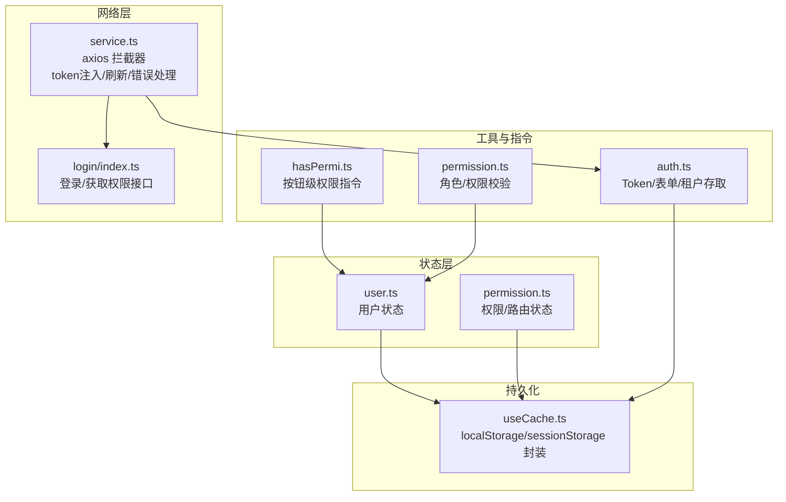
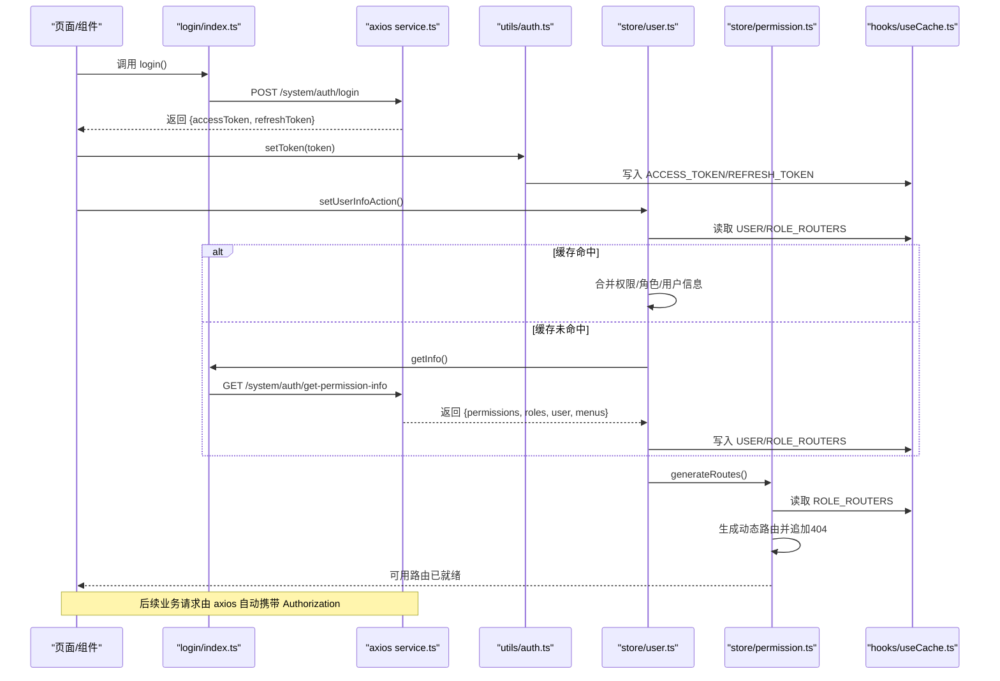
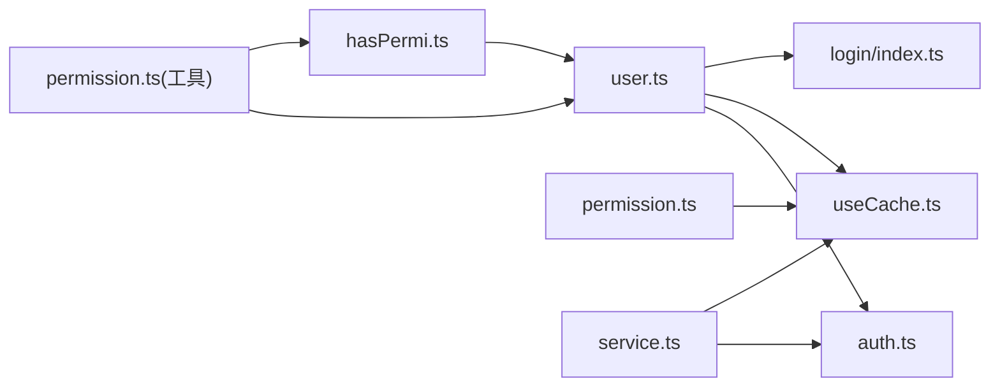
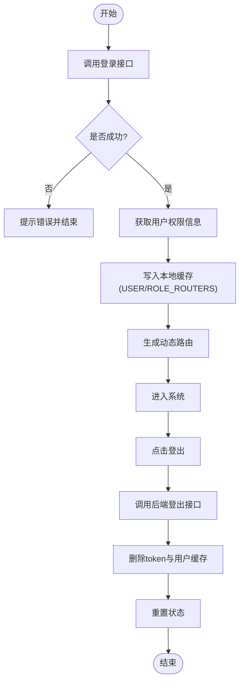
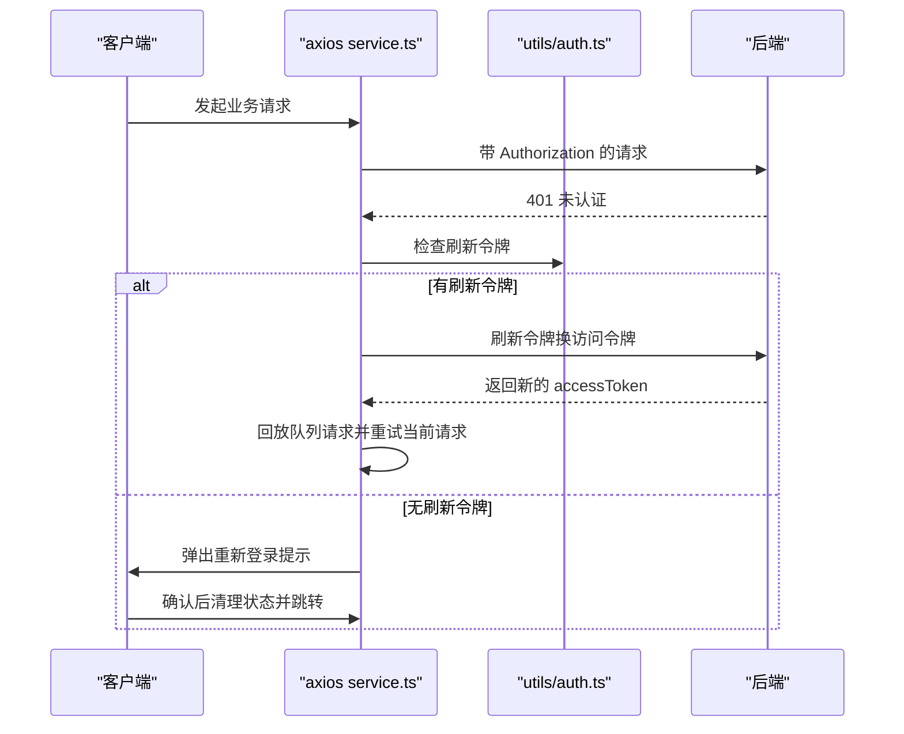
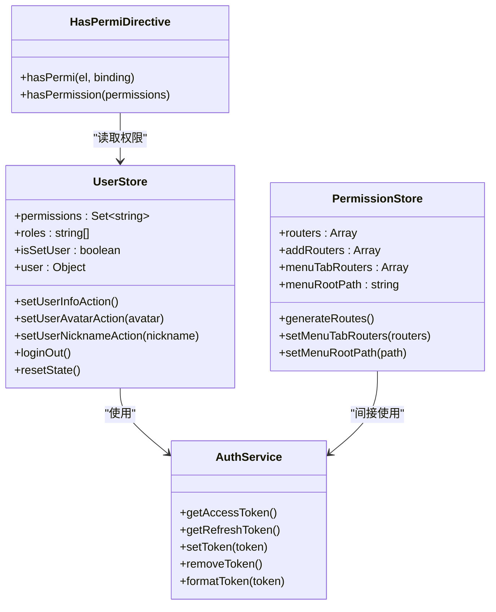

# 用户状态管理

<cite>
**本文引用的文件**
- [src/store/modules/user.ts](file://yudao-ui-admin-vue3/src/store/modules/user.ts)
- [src/store/modules/permission.ts](file://yudao-ui-admin-vue3/src/store/modules/permission.ts)
- [src/utils/auth.ts](file://yudao-ui-admin-vue3/src/utils/auth.ts)
- [src/config/axios/service.ts](file://yudao-ui-admin-vue3/src/config/axios/service.ts)
- [src/api/login/index.ts](file://yudao-ui-admin-vue3/src/api/login/index.ts)
- [src/hooks/web/useCache.ts](file://yudao-ui-admin-vue3/src/hooks/web/useCache.ts)
- [src/directives/permission/hasPermi.ts](file://yudao-ui-admin-vue3/src/directives/permission/hasPermi.ts)
- [src/utils/permission.ts](file://yudao-ui-admin-vue3/src/utils/permission.ts)
</cite>

## 目录
1. [简介](#简介)
2. [项目结构](#项目结构)
3. [核心组件](#核心组件)
4. [架构总览](#架构总览)
5. [详细组件分析](#详细组件分析)
6. [依赖关系分析](#依赖关系分析)
7. [性能考虑](#性能考虑)
8. [故障排查指南](#故障排查指南)
9. [结论](#结论)
10. [附录](#附录)

## 简介
本文件面向“用户状态管理”的完整实现，覆盖以下目标：
- 用户信息的存储结构：基本信息、权限数据、会话状态等。
- 登录/登出流程的状态变更与 token 管理，包括无感知刷新机制。
- 权限状态设计：菜单权限、按钮权限、数据权限的处理方式。
- 用户状态持久化：本地存储同步与状态恢复策略。
- 典型场景示例：用户信息更新、角色切换等状态处理。

## 项目结构
前端采用 Vue3 + Pinia 进行状态管理，结合 axios 拦截器实现统一的鉴权与 token 刷新；通过 web-storage-cache 将用户信息、路由、租户等关键数据持久化到浏览器本地存储。

图示来源
- [src/store/modules/user.ts:24-71](file://yudao-ui-admin-vue3/src/store/modules/user.ts#L24-L71)
- [src/store/modules/permission.ts:17-65](file://yudao-ui-admin-vue3/src/store/modules/permission.ts#L17-L65)
- [src/utils/auth.ts:11-37](file://yudao-ui-admin-vue3/src/utils/auth.ts#L11-L37)
- [src/config/axios/service.ts:49-106](file://yudao-ui-admin-vue3/src/config/axios/service.ts#L49-L106)
- [src/api/login/index.ts:14-48](file://yudao-ui-admin-vue3/src/api/login/index.ts#L14-L48)
- [src/hooks/web/useCache.ts:9-41](file://yudao-ui-admin-vue3/src/hooks/web/useCache.ts#L9-L41)
- [src/directives/permission/hasPermi.ts:6-31](file://yudao-ui-admin-vue3/src/directives/permission/hasPermi.ts#L6-L31)
- [src/utils/permission.ts:11-35](file://yudao-ui-admin-vue3/src/utils/permission.ts#L11-L35)

章节来源
- [src/store/modules/user.ts:24-71](file://yudao-ui-admin-vue3/src/store/modules/user.ts#L24-L71)
- [src/store/modules/permission.ts:17-65](file://yudao-ui-admin-vue3/src/store/modules/permission.ts#L17-L65)
- [src/utils/auth.ts:11-37](file://yudao-ui-admin-vue3/src/utils/auth.ts#L11-L37)
- [src/config/axios/service.ts:49-106](file://yudao-ui-admin-vue3/src/config/axios/service.ts#L49-L106)
- [src/api/login/index.ts:14-48](file://yudao-ui-admin-vue3/src/api/login/index.ts#L14-L48)
- [src/hooks/web/useCache.ts:9-41](file://yudao-ui-admin-vue3/src/hooks/web/useCache.ts#L9-L41)
- [src/directives/permission/hasPermi.ts:6-31](file://yudao-ui-admin-vue3/src/directives/permission/hasPermi.ts#L6-L31)
- [src/utils/permission.ts:11-35](file://yudao-ui-admin-vue3/src/utils/permission.ts#L11-L35)

## 核心组件
- 用户状态（Pinia）：维护用户基本信息、角色列表、权限集合、是否已设置用户标志，并提供设置头像/昵称、登出、重置等方法。
- 权限/路由状态：基于后端返回的菜单生成动态路由，并维护当前标签页路由与根路径。
- Token 工具：统一存取访问令牌、刷新令牌、登录表单、租户信息等。
- Axios 拦截器：请求时注入 Authorization 头与租户头，响应时处理加密/解密、错误码、401 无感知刷新与超时提示。
- 缓存封装：提供 localStorage/sessionStorage 的统一读写与过期控制，以及用户相关缓存清理。
- 权限指令与校验：按钮级权限（v-hasPermi）与角色/权限判断函数。

章节来源
- [src/store/modules/user.ts:24-103](file://yudao-ui-admin-vue3/src/store/modules/user.ts#L24-L103)
- [src/store/modules/permission.ts:17-74](file://yudao-ui-admin-vue3/src/store/modules/permission.ts#L17-L74)
- [src/utils/auth.ts:11-87](file://yudao-ui-admin-vue3/src/utils/auth.ts#L11-L87)
- [src/config/axios/service.ts:49-272](file://yudao-ui-admin-vue3/src/config/axios/service.ts#L49-L272)
- [src/hooks/web/useCache.ts:9-41](file://yudao-ui-admin-vue3/src/hooks/web/useCache.ts#L9-L41)
- [src/directives/permission/hasPermi.ts:6-31](file://yudao-ui-admin-vue3/src/directives/permission/hasPermi.ts#L6-L31)
- [src/utils/permission.ts:11-35](file://yudao-ui-admin-vue3/src/utils/permission.ts#L11-L35)

## 架构总览
下图展示了从登录到获取用户信息、构建路由、发起业务请求的完整链路，以及 401 时的无感知刷新流程。

图示来源
- [src/api/login/index.ts:14-48](file://yudao-ui-admin-vue3/src/api/login/index.ts#L14-L48)
- [src/config/axios/service.ts:49-106](file://yudao-ui-admin-vue3/src/config/axios/service.ts#L49-L106)
- [src/utils/auth.ts:22-37](file://yudao-ui-admin-vue3/src/utils/auth.ts#L22-L37)
- [src/store/modules/user.ts:51-71](file://yudao-ui-admin-vue3/src/store/modules/user.ts#L51-L71)
- [src/store/modules/permission.ts:39-65](file://yudao-ui-admin-vue3/src/store/modules/permission.ts#L39-L65)
- [src/hooks/web/useCache.ts:9-41](file://yudao-ui-admin-vue3/src/hooks/web/useCache.ts#L9-L41)

## 详细组件分析

### 用户状态（user.ts）
- 数据结构
  - 用户基本信息：id、avatar、nickname、deptId。
  - 权限数据：permissions（Set<string>）、roles（string[]）。
  - 会话状态：isSetUser（是否已完成用户信息初始化）。
- 关键行为
  - setUserInfoAction：优先使用本地缓存的用户信息；若存在则尝试拉取最新信息以兜底；最终写入权限、角色、用户对象，并持久化至本地缓存。
  - setUserAvatarAction/setUserNicknameAction：局部更新用户信息并同步到本地缓存。
  - loginOut：调用后端登出接口，清除本地 token 与用户缓存，重置状态。
  - resetState：清空权限、角色、用户信息与标志位。
- 复杂度与注意事项
  - Set 用于 O(1) 权限判定；角色为数组便于角色级校验。
  - 即使 getInfo 失败也不阻断进入系统，保证可用性。

章节来源
- [src/store/modules/user.ts:9-35](file://yudao-ui-admin-vue3/src/store/modules/user.ts#L9-L35)
- [src/store/modules/user.ts:51-103](file://yudao-ui-admin-vue3/src/store/modules/user.ts#L51-L103)

### 权限与路由（permission.ts）
- 数据结构
  - routers：静态+动态路由合并后的完整路由表。
  - addRouters：动态生成的路由（含 404）。
  - menuTabRouters：当前标签页可见路由。
  - menuRootPath：菜单根路径。
- 关键行为
  - generateRoutes：从本地缓存读取角色菜单，转换为路由，追加 404，并与静态路由合并。
- 复杂度与注意事项
  - 使用扁平化处理多级路由，确保渲染正确。
  - 404 路由始终置于末尾，避免误匹配。

章节来源
- [src/store/modules/permission.ts:10-23](file://yudao-ui-admin-vue3/src/store/modules/permission.ts#L10-L23)
- [src/store/modules/permission.ts:39-74](file://yudao-ui-admin-vue3/src/store/modules/permission.ts#L39-L74)

### Token 管理（auth.ts）
- 功能
  - 存取访问令牌与刷新令牌。
  - 格式化 Bearer 头。
  - 获取当前用户 ID。
  - 登录表单的加解密与过期时间控制。
  - 租户与访问租户的存取。
- 关键点
  - 统一通过 web-storage-cache 存取，支持过期策略。
  - 提供 removeToken 用于登出或强制退出。

章节来源
- [src/utils/auth.ts:11-87](file://yudao-ui-admin-vue3/src/utils/auth.ts#L11-L87)

### Axios 拦截器与无感知刷新（service.ts）
- 请求拦截
  - 自动注入 Authorization 头（Bearer token），白名单接口不注入。
  - 根据环境开启租户头 tenant-id 与 visit-tenant-id。
  - 对 GET 请求禁用缓存；对 form-urlencoded 进行序列化。
  - 可选的请求数据加密与响应数据解密。
- 响应拦截
  - 统一错误码处理：401 触发无感知刷新；500/901 等错误提示；其他非成功码提示并拒绝。
  - 无感知刷新：当 401 且未正在刷新时，使用刷新令牌换取新访问令牌，成功后回放队列中的请求并重试当前请求；刷新失败则引导重新登录。
  - 请求队列：并发 401 时排队等待刷新完成，避免重复刷新。
- 关键点
  - 忽略特定刷新失败消息，避免死循环。
  - 处理二进制下载与 JSON 异常情况的兼容。

章节来源
- [src/config/axios/service.ts:49-106](file://yudao-ui-admin-vue3/src/config/axios/service.ts#L49-L106)
- [src/config/axios/service.ts:108-239](file://yudao-ui-admin-vue3/src/config/axios/service.ts#L108-L239)
- [src/config/axios/service.ts:241-270](file://yudao-ui-admin-vue3/src/config/axios/service.ts#L241-L270)

### 本地缓存与持久化（useCache.ts）
- 能力
  - 统一封装 localStorage/sessionStorage。
  - 定义常用键名：用户信息、角色路由、租户、主题、语言、字典缓存、登录表单等。
  - 提供 deleteUserCache 清理用户相关缓存（保留登录表单以便快速重填）。
- 关键点
  - 配合 auth.ts 的过期策略，实现登录表单短期记忆。
  - 登出时清理用户与路由缓存，保障安全。

章节来源
- [src/hooks/web/useCache.ts:9-41](file://yudao-ui-admin-vue3/src/hooks/web/useCache.ts#L9-L41)

### 权限指令与校验（hasPermi.ts、permission.ts）
- 按钮级权限（v-hasPermi）
  - 基于用户 store 中的 permissions 集合进行判定，支持通配符 *:*:* 全量权限。
  - 无权限时移除 DOM 节点。
- 角色/权限校验函数
  - checkRole：支持超级管理员与指定角色匹配。
  - checkPermi：委托给 hasPermission 进行权限集合判定。
- 关键点
  - 指令与方法解耦，便于在模板与逻辑中复用。
  - 国际化错误提示，提升可维护性。

章节来源
- [src/directives/permission/hasPermi.ts:6-31](file://yudao-ui-admin-vue3/src/directives/permission/hasPermi.ts#L6-L31)
- [src/utils/permission.ts:11-35](file://yudao-ui-admin-vue3/src/utils/permission.ts#L11-L35)

## 依赖关系分析
- 模块耦合
  - user.ts 依赖 auth.ts、useCache.ts、api/login/index.ts。
  - permission.ts 依赖 useCache.ts、routerHelper（外部工具）。
  - service.ts 依赖 auth.ts、useCache.ts、api/login/types（类型）。
  - hasPermi.ts 依赖 user.ts。
  - permission.ts（工具）依赖 useCache.ts 与 hasPermi.ts。
- 外部依赖
  - axios 用于 HTTP 通信。
  - web-storage-cache 用于本地存储。
  - Element Plus 用于提示与确认框。
- 潜在风险
  - 若后端接口契约变化（如字段名），需同步更新 user.ts 与 permission.ts。
  - 刷新令牌失效时需确保 handleAuthorized 能正确跳转与清理状态。

图示来源
- [src/store/modules/user.ts:24-71](file://yudao-ui-admin-vue3/src/store/modules/user.ts#L24-L71)
- [src/store/modules/permission.ts:17-65](file://yudao-ui-admin-vue3/src/store/modules/permission.ts#L17-L65)
- [src/utils/auth.ts:11-37](file://yudao-ui-admin-vue3/src/utils/auth.ts#L11-L37)
- [src/config/axios/service.ts:49-106](file://yudao-ui-admin-vue3/src/config/axios/service.ts#L49-L106)
- [src/api/login/index.ts:14-48](file://yudao-ui-admin-vue3/src/api/login/index.ts#L14-L48)
- [src/hooks/web/useCache.ts:9-41](file://yudao-ui-admin-vue3/src/hooks/web/useCache.ts#L9-L41)
- [src/directives/permission/hasPermi.ts:6-31](file://yudao-ui-admin-vue3/src/directives/permission/hasPermi.ts#L6-L31)
- [src/utils/permission.ts:11-35](file://yudao-ui-admin-vue3/src/utils/permission.ts#L11-L35)

## 性能考虑
- 权限判定使用 Set，O(1) 查找，适合高频按钮级权限检查。
- 路由生成仅在登录后执行一次，避免重复计算。
- 本地缓存减少重复网络请求，提升首屏与交互速度。
- 请求队列避免并发 401 导致的多次刷新，降低服务端压力。
- GET 请求禁用缓存防止陈旧数据影响。

[本节为通用指导，无需具体文件引用]

## 故障排查指南
- 401 频繁出现
  - 检查刷新令牌是否存在与有效；确认 service.ts 的刷新逻辑与白名单配置。
  - 关注 ignoreMsgs 中忽略的消息，避免误判。
- 登录后仍无法访问菜单
  - 确认 setUserInfoAction 是否正确写入 USER 与 ROLE_ROUTERS。
  - 检查 generateRoutes 是否成功生成动态路由并追加 404。
- 按钮权限无效
  - 检查 v-hasPermi 传入的权限字符串是否与后端返回一致。
  - 确认用户 store 中 permissions 集合是否包含对应权限或通配符。
- 登出不彻底
  - 确认 loginOut 是否调用后端登出接口、删除 token、清理用户缓存并重置状态。
  - 确认 service.ts 的 handleAuthorized 是否正确清理路由与缓存。

章节来源
- [src/config/axios/service.ts:149-239](file://yudao-ui-admin-vue3/src/config/axios/service.ts#L149-L239)
- [src/store/modules/user.ts:86-103](file://yudao-ui-admin-vue3/src/store/modules/user.ts#L86-L103)
- [src/store/modules/permission.ts:39-65](file://yudao-ui-admin-vue3/src/store/modules/permission.ts#L39-L65)
- [src/directives/permission/hasPermi.ts:6-31](file://yudao-ui-admin-vue3/src/directives/permission/hasPermi.ts#L6-L31)

## 结论
该用户状态管理方案通过 Pinia 集中管理用户与权限状态，结合 axios 拦截器实现统一的鉴权与无感知刷新，利用本地缓存提升性能与用户体验。权限体系覆盖菜单、按钮与数据维度，具备可扩展性与可维护性。建议在生产环境中严格校验后端接口契约，完善错误提示与监控，持续优化刷新与缓存策略。

[本节为总结性内容，无需具体文件引用]

## 附录

### 登录/登出流程图

图示来源
- [src/api/login/index.ts:14-48](file://yudao-ui-admin-vue3/src/api/login/index.ts#L14-L48)
- [src/store/modules/user.ts:51-91](file://yudao-ui-admin-vue3/src/store/modules/user.ts#L51-L91)
- [src/store/modules/permission.ts:39-65](file://yudao-ui-admin-vue3/src/store/modules/permission.ts#L39-L65)
- [src/utils/auth.ts:22-37](file://yudao-ui-admin-vue3/src/utils/auth.ts#L22-L37)
- [src/hooks/web/useCache.ts:35-41](file://yudao-ui-admin-vue3/src/hooks/web/useCache.ts#L35-L41)

### 无感知刷新时序图

图示来源
- [src/config/axios/service.ts:149-239](file://yudao-ui-admin-vue3/src/config/axios/service.ts#L149-L239)
- [src/utils/auth.ts:17-37](file://yudao-ui-admin-vue3/src/utils/auth.ts#L17-L37)

### 权限模型类图

图示来源
- [src/store/modules/user.ts:24-103](file://yudao-ui-admin-vue3/src/store/modules/user.ts#L24-L103)
- [src/store/modules/permission.ts:17-74](file://yudao-ui-admin-vue3/src/store/modules/permission.ts#L17-L74)
- [src/utils/auth.ts:11-37](file://yudao-ui-admin-vue3/src/utils/auth.ts#L11-L37)
- [src/directives/permission/hasPermi.ts:6-31](file://yudao-ui-admin-vue3/src/directives/permission/hasPermi.ts#L6-L31)

### 典型场景示例
- 用户信息更新（头像/昵称）
  - 调用 setUserAvatarAction/setUserNicknameAction，更新内存状态并同步本地缓存。
  - 参考路径：[src/store/modules/user.ts:72-85](file://yudao-ui-admin-vue3/src/store/modules/user.ts#L72-L85)
- 角色切换
  - 切换角色后重新调用 setUserInfoAction 获取最新权限与菜单，再执行 generateRoutes 重建路由。
  - 参考路径：[src/store/modules/user.ts:51-71](file://yudao-ui-admin-vue3/src/store/modules/user.ts#L51-L71)、[src/store/modules/permission.ts:39-65](file://yudao-ui-admin-vue3/src/store/modules/permission.ts#L39-L65)
- 按钮权限控制
  - 模板中使用 v-hasPermi="['xxx:yyy:zzz']"，内部依据 permissions 集合判定显示/隐藏。
  - 参考路径：[src/directives/permission/hasPermi.ts:6-31](file://yudao-ui-admin-vue3/src/directives/permission/hasPermi.ts#L6-L31)
- 数据权限
  - 数据权限通常由后端基于角色/部门/数据范围过滤；前端通过权限标识控制入口与操作项，确保最小暴露面。
  - 参考路径：[src/utils/permission.ts:11-35](file://yudao-ui-admin-vue3/src/utils/permission.ts#L11-L35)