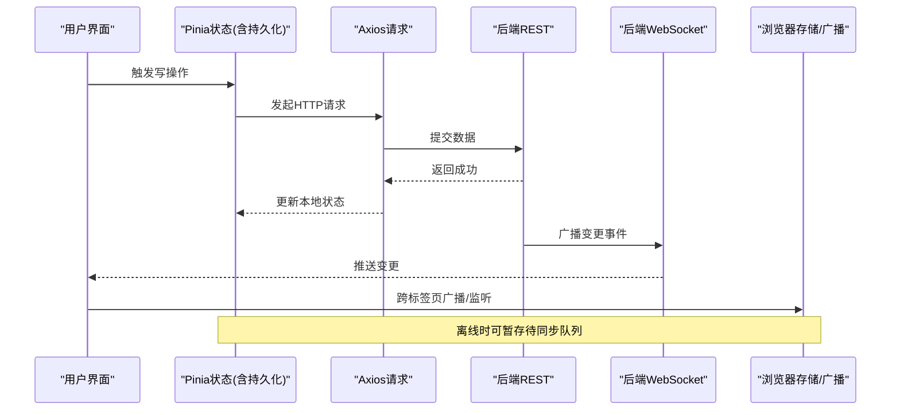
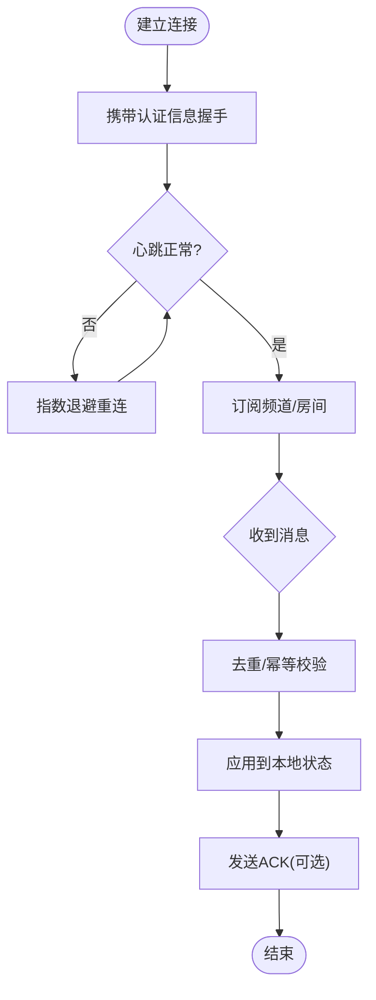
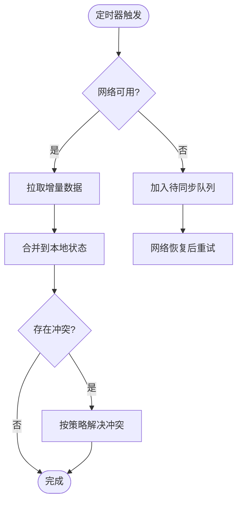
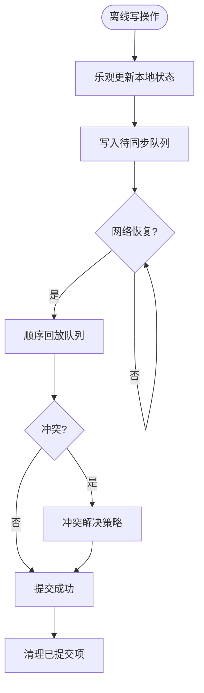
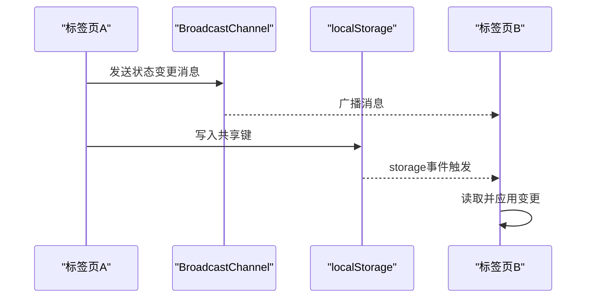
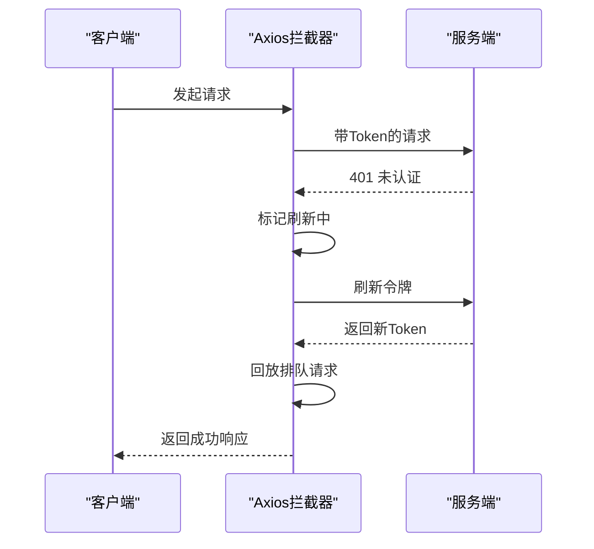
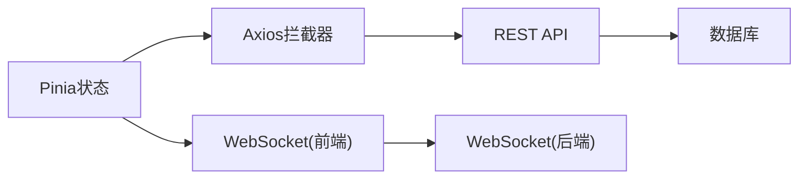

# 数据同步机制

<cite>
**本文引用的文件**
- [yudao-ui-admin-vue3/src/store/index.ts](file://yudao-ui-admin-vue3/src/store/index.ts)
- [yudao-ui-admin-vue3/src/store/modules/user.ts](file://yudao-ui-admin-vue3/src/store/modules/user.ts)
- [yudao-ui-admin-vue3/src/config/axios/service.ts](file://yudao-ui-admin-vue3/src/config/axios/service.ts)
- [yudao-ui-admin-vue3/src/config/axios/index.ts](file://yudao-ui-admin-vue3/src/config/axios/index.ts)
- [yudao-framework/yudao-spring-boot-starter-websocket/pom.xml](file://yudao-framework/yudao-spring-boot-starter-websocket/pom.xml)
</cite>

## 目录
1. [简介](#简介)
2. [项目结构](#项目结构)
3. [核心组件](#核心组件)
4. [架构总览](#架构总览)
5. [详细组件分析](#详细组件分析)
6. [依赖关系分析](#依赖关系分析)
7. [性能考虑](#性能考虑)
8. [故障排查指南](#故障排查指南)
9. [结论](#结论)
10. [附录](#附录)

## 简介
本文件面向前后端数据同步机制，覆盖实时与定时同步策略、WebSocket连接与消息处理、离线数据处理（暂存、冲突解决、自动同步）、多标签页同步（BroadcastChannel与localStorage事件监听）、数据一致性保证与错误恢复策略，以及网络异常处理与重试机制。文档基于仓库中前端Vue3工程与服务端WebSocket能力进行说明，并结合通用工程实践给出可落地的实现方案。

## 项目结构
本项目采用前后端分离架构：
- 前端：Vue3 + Pinia状态管理 + Axios请求封装；通过持久化插件将关键状态落盘，提供离线可用性与跨标签页共享能力。
- 后端：Spring Boot微服务架构，包含WebSocket Starter模块，用于支撑实时推送与双向通信。

```mermaid
graph TB
subgraph "前端"
UI["页面组件"]
Store["Pinia 状态<br/>持久化插件"]
HTTP["Axios 拦截器<br/>令牌刷新/错误处理"]
end
subgraph "后端"
WS["WebSocket 服务"]
API["REST API"]
DB["数据库"]
end
UI --> Store
UI --> HTTP
HTTP --> API
Store --> |本地缓存/跨标签广播| UI
API --> DB
WS <- --> UI
```

图表来源
- [yudao-ui-admin-vue3/src/store/index.ts:1-13](file://yudao-ui-admin-vue3/src/store/index.ts#L1-L13)
- [yudao-ui-admin-vue3/src/config/axios/service.ts:39-106](file://yudao-ui-admin-vue3/src/config/axios/service.ts#L39-L106)
- [yudao-framework/yudao-spring-boot-starter-websocket/pom.xml](file://yudao-framework/yudao-spring-boot-starter-websocket/pom.xml)

章节来源
- [yudao-ui-admin-vue3/src/store/index.ts:1-13](file://yudao-ui-admin-vue3/src/store/index.ts#L1-L13)
- [yudao-ui-admin-vue3/src/config/axios/service.ts:39-106](file://yudao-ui-admin-vue3/src/config/axios/service.ts#L39-L106)
- [yudao-framework/yudao-spring-boot-starter-websocket/pom.xml](file://yudao-framework/yudao-spring-boot-starter-websocket/pom.xml)

## 核心组件
- 状态与持久化：使用Pinia管理应用状态，并通过持久化插件将用户信息、权限等关键数据落盘，保障离线可用与快速恢复。
- 请求与鉴权：Axios统一封装请求，内置请求头注入、租户上下文、API加解密、响应解密、无感知刷新令牌、错误提示与登出流程。
- WebSocket能力：服务端提供WebSocket Starter，可用于实时消息推送、在线状态、即时通知等场景。

章节来源
- [yudao-ui-admin-vue3/src/store/index.ts:1-13](file://yudao-ui-admin-vue3/src/store/index.ts#L1-L13)
- [yudao-ui-admin-vue3/src/store/modules/user.ts:24-104](file://yudao-ui-admin-vue3/src/store/modules/user.ts#L24-L104)
- [yudao-ui-admin-vue3/src/config/axios/service.ts:49-238](file://yudao-ui-admin-vue3/src/config/axios/service.ts#L49-L238)
- [yudao-framework/yudao-spring-boot-starter-websocket/pom.xml](file://yudao-framework/yudao-spring-boot-starter-websocket/pom.xml)

## 架构总览
前后端数据同步由“HTTP+WebSocket”双通道协同完成：
- 强一致与写路径：通过HTTP接口写入，服务端落库后，通过WebSocket向相关客户端广播变更，确保多端一致。
- 读路径与容灾：前端优先读取本地缓存（Pinia持久化），必要时拉取远端最新数据；断网时仍可操作，联网后自动补发。
- 多标签页同步：借助BroadcastChannel与localStorage事件，实现同浏览器多标签页间状态一致。



图表来源
- [yudao-ui-admin-vue3/src/store/modules/user.ts:50-71](file://yudao-ui-admin-vue3/src/store/modules/user.ts#L50-L71)
- [yudao-ui-admin-vue3/src/config/axios/service.ts:49-238](file://yudao-ui-admin-vue3/src/config/axios/service.ts#L49-L238)
- [yudao-framework/yudao-spring-boot-starter-websocket/pom.xml](file://yudao-framework/yudao-spring-boot-starter-websocket/pom.xml)

## 详细组件分析

### 实时同步（WebSocket）
- 连接管理
  - 建立连接：在应用启动或进入需要实时能力的页面时建立WebSocket连接，携带认证信息（如token）。
  - 心跳保活：定期发送心跳，检测连接健康；超时未响应则尝试重连。
  - 断线重连：指数退避重连，避免雪崩；记录重连次数与最近一次时间戳。
  - 会话绑定：按用户/租户维度建立会话，确保消息定向投递。
- 消息处理
  - 消息类型：区分增量更新、全量替换、删除、状态变更等。
  - 幂等性：为每条消息分配唯一ID，前端去重处理，避免重复渲染。
  - 优先级：高优消息（如告警）立即渲染，低优批量合并渲染。
  - 失败重试：对关键消息设置ACK/NACK，服务端未收到确认则重试。
- 与HTTP协同
  - 写路径仍走HTTP，确保事务与审计；写成功后由服务端广播变更。
  - 读路径优先本地缓存，必要时主动拉取增量。



图表来源
- [yudao-framework/yudao-spring-boot-starter-websocket/pom.xml](file://yudao-framework/yudao-spring-boot-starter-websocket/pom.xml)

章节来源
- [yudao-framework/yudao-spring-boot-starter-websocket/pom.xml](file://yudao-framework/yudao-spring-boot-starter-websocket/pom.xml)

### 定时同步
- 触发方式
  - 页面级定时器：在特定页面活跃时，周期性拉取增量数据。
  - 后台任务：利用Service Worker或后台脚本（若支持）在后台周期同步。
  - 事件驱动：结合系统事件（如网络恢复、页面可见性变化）触发同步。
- 策略
  - 增量同步：基于时间戳或版本号拉取变更。
  - 合并策略：本地修改与远端变更合并，冲突时以策略决定（如服务端为准或用户选择）。
  - 节流防抖：高频操作下合并请求，减少带宽消耗。



[本节为概念性流程图，不直接映射具体源码]

### 离线数据处理
- 数据暂存
  - 本地队列：将写操作序列化入队，等待网络恢复后顺序执行。
  - 乐观更新：先更新UI与本地状态，再异步提交；失败时回滚并提示。
  - 版本控制：为每条记录维护版本号或时间戳，便于冲突检测。
- 冲突解决
  - 服务端优先：默认以服务端数据为准，前端仅做提示。
  - 字段级合并：非冲突字段合并，冲突字段提示用户选择。
  - 撤销/重做：提供撤销最近本地变更的能力。
- 自动同步
  - 网络监听：监听online/offline事件，恢复后立即回放队列。
  - 可见性变化：页面从隐藏变为显示时触发一次增量同步。



[本节为概念性流程图，不直接映射具体源码]

### 多标签页同步（BroadcastChannel与localStorage）
- BroadcastChannel
  - 用途：同一浏览器不同标签页之间实时广播状态变更。
  - 适用：轻量级、同域下的跨标签页消息传递。
- localStorage事件监听
  - 用途：当某个标签页修改了key，其他标签页可通过storage事件感知变更。
  - 适用：简单键值同步，适合配置、开关类数据。
- 组合策略
  - 主从模式：指定一个标签为主节点，负责轮询与广播；其余为从节点。
  - 去重与幂等：为消息附加ID，避免重复处理。



[本节为概念性流程图，不直接映射具体源码]

### 数据一致性保证
- 最终一致性
  - 写路径强一致（事务落库），读路径允许短暂不一致（本地缓存）。
  - 通过WebSocket广播与定时同步收敛至一致。
- 幂等与去重
  - 所有写操作附带唯一ID，服务端与前端均做幂等处理。
- 补偿机制
  - 对失败操作进行重试与补偿，确保最终一致。

### 错误恢复与网络异常处理
- 令牌无感知刷新
  - 遇到401时，尝试刷新访问令牌；刷新期间排队后续请求，成功后统一回放。
- 错误分类与提示
  - 网络错误、超时、业务错误分别处理，并给出友好提示。
- 重试与退避
  - 对临时性错误采用指数退避重试，限制最大重试次数。
- 降级与兜底
  - 网络不可用时启用离线模式，展示本地缓存数据并提供手动同步入口。



图表来源
- [yudao-ui-admin-vue3/src/config/axios/service.ts:152-194](file://yudao-ui-admin-vue3/src/config/axios/service.ts#L152-L194)

章节来源
- [yudao-ui-admin-vue3/src/config/axios/service.ts:152-194](file://yudao-ui-admin-vue3/src/config/axios/service.ts#L152-L194)

## 依赖关系分析
- 前端依赖
  - Pinia + 持久化插件：提供状态管理与本地持久化能力。
  - Axios拦截器：统一处理鉴权、加密、错误与重试。
- 后端依赖
  - WebSocket Starter：提供WebSocket基础能力，用于实时推送。
- 耦合与内聚
  - 前端状态与请求解耦：状态层专注数据模型，请求层专注网络细节。
  - 实时与HTTP职责清晰：写路径HTTP保证一致性，读路径WebSocket提升时效性。



图表来源
- [yudao-ui-admin-vue3/src/store/index.ts:1-13](file://yudao-ui-admin-vue3/src/store/index.ts#L1-L13)
- [yudao-ui-admin-vue3/src/config/axios/service.ts:39-106](file://yudao-ui-admin-vue3/src/config/axios/service.ts#L39-L106)
- [yudao-framework/yudao-spring-boot-starter-websocket/pom.xml](file://yudao-framework/yudao-spring-boot-starter-websocket/pom.xml)

章节来源
- [yudao-ui-admin-vue3/src/store/index.ts:1-13](file://yudao-ui-admin-vue3/src/store/index.ts#L1-L13)
- [yudao-ui-admin-vue3/src/config/axios/service.ts:39-106](file://yudao-ui-admin-vue3/src/config/axios/service.ts#L39-L106)
- [yudao-framework/yudao-spring-boot-starter-websocket/pom.xml](file://yudao-framework/yudao-spring-boot-starter-websocket/pom.xml)

## 性能考虑
- 请求合并与节流：对高频操作进行合并，减少网络开销。
- 增量同步：基于时间戳或版本号拉取变更，降低带宽占用。
- 本地缓存：优先读取本地缓存，必要时再拉取远端数据。
- WebSocket批处理：服务端对短时间内的大量变更进行聚合推送。
- 资源释放：页面离开时关闭WebSocket连接，避免内存泄漏。

## 故障排查指南
- 常见问题
  - 401频繁出现：检查令牌刷新逻辑与队列回放是否正确。
  - WebSocket频繁断开：检查心跳间隔、服务器负载与网络质量。
  - 数据不一致：核对本地版本号与远端是否对齐，检查冲突解决策略。
  - 多标签页不同步：确认BroadcastChannel与localStorage事件是否正常触发。
- 定位方法
  - 查看Axios拦截器的错误日志与提示。
  - 检查本地持久化数据与待同步队列。
  - 监控WebSocket连接状态与消息收发。
- 修复建议
  - 调整重试次数与退避策略。
  - 优化冲突解决策略，提供更明确的用户提示。
  - 增加监控与告警，及时发现异常。

章节来源
- [yudao-ui-admin-vue3/src/config/axios/service.ts:195-238](file://yudao-ui-admin-vue3/src/config/axios/service.ts#L195-L238)

## 结论
本方案通过HTTP与WebSocket双通道、本地持久化与多标签页广播，构建了稳定、高效、可恢复的数据同步体系。写路径保证强一致，读路径兼顾时效与可用性；离线场景下具备自愈能力，网络恢复后自动补齐。结合令牌无感知刷新、错误分类与重试机制，整体具备良好的鲁棒性与用户体验。

## 附录
- 术语
  - 最终一致性：系统在一段时间后达到一致状态。
  - 幂等性：多次执行相同操作结果一致。
  - 乐观更新：先更新UI，再异步提交，失败时回滚。
- 参考实现位置
  - 状态与持久化：[store/index.ts:1-13](file://yudao-ui-admin-vue3/src/store/index.ts#L1-L13)、[store/modules/user.ts:24-104](file://yudao-ui-admin-vue3/src/store/modules/user.ts#L24-L104)
  - 请求与鉴权：[config/axios/service.ts:49-238](file://yudao-ui-admin-vue3/src/config/axios/service.ts#L49-L238)
  - WebSocket能力：[websocket starter pom](file://yudao-framework/yudao-spring-boot-starter-websocket/pom.xml)