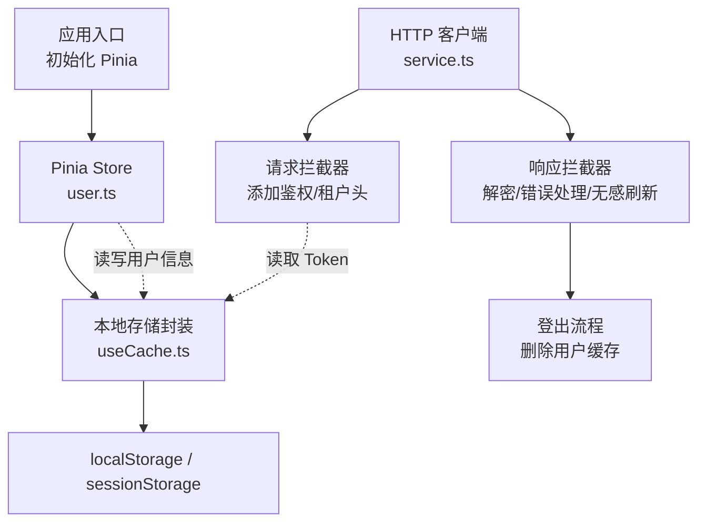
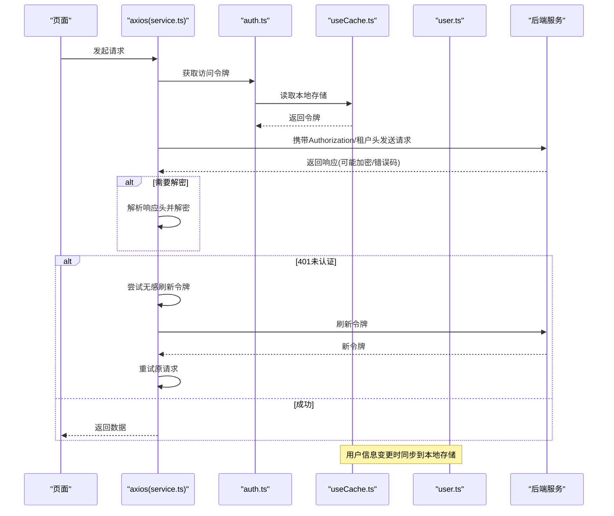
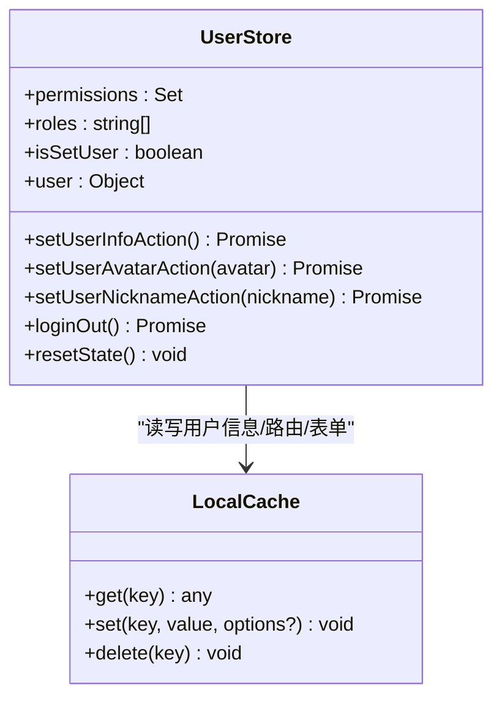
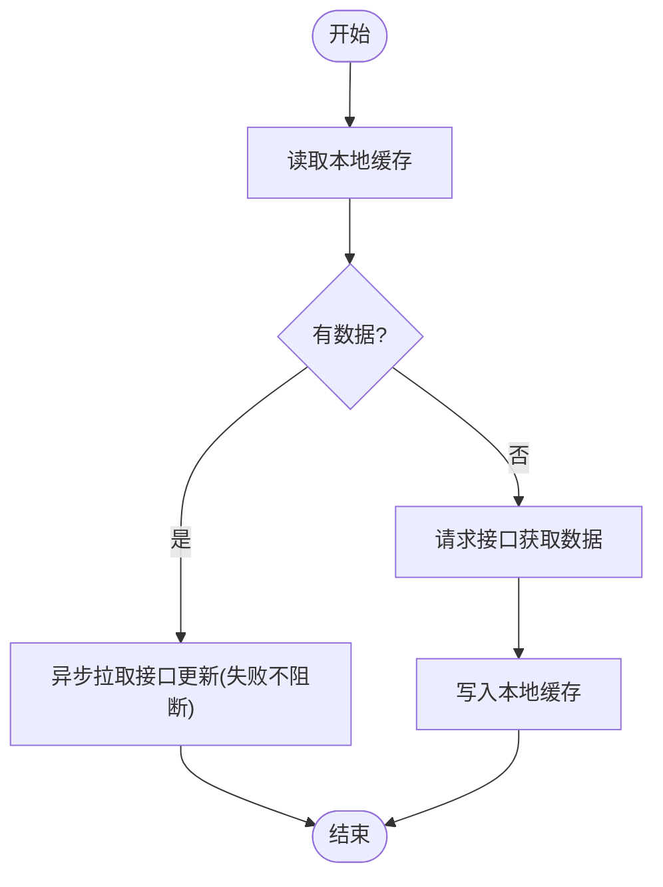
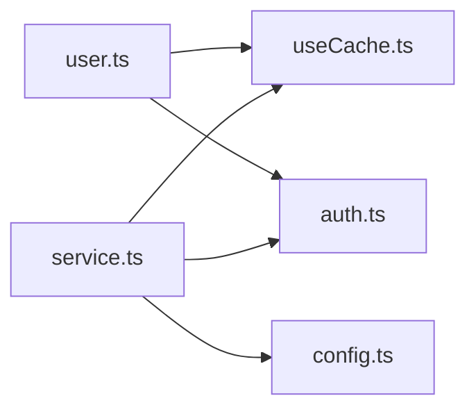

# 数据缓存策略

<cite>
**本文引用的文件**
- [src/store/index.ts](file://yudao-ui-admin-vue3/src/store/index.ts)
- [src/hooks/web/useCache.ts](file://yudao-ui-admin-vue3/src/hooks/web/useCache.ts)
- [src/utils/auth.ts](file://yudao-ui-admin-vue3/src/utils/auth.ts)
- [src/config/axios/service.ts](file://yudao-ui-admin-vue3/src/config/axios/service.ts)
- [src/config/axios/config.ts](file://yudao-ui-admin-vue3/src/config/axios/config.ts)
- [src/store/modules/user.ts](file://yudao-ui-admin-vue3/src/store/modules/user.ts)
</cite>

## 目录
1. [简介](#简介)
2. [项目结构](#项目结构)
3. [核心组件](#核心组件)
4. [架构总览](#架构总览)
5. [详细组件分析](#详细组件分析)
6. [依赖关系分析](#依赖关系分析)
7. [性能考量](#性能考量)
8. [故障排查指南](#故障排查指南)
9. [结论](#结论)
10. [附录](#附录)

## 简介
本文件面向前端工程，系统化梳理数据缓存策略与实现：涵盖本地存储（localStorage、sessionStorage）的选择与应用；基于 Pinia 的状态管理设计与持久化；缓存失效策略（时间过期、条件刷新、手动清理）；数据预加载与懒加载；缓存冲突解决；以及大列表分页、图片资源与接口响应的缓存最佳实践。同时提供监控与调试建议，帮助在复杂业务中稳定高效地管理数据。

## 项目结构
本项目采用 Vue3 + Pinia 的前端架构，结合 axios 拦截器统一处理请求与响应，使用 web-storage-cache 封装浏览器本地存储能力，并通过 store 模块组织用户等关键状态。

图表来源
- [src/store/index.ts:1-13](file://yudao-ui-admin-vue3/src/store/index.ts#L1-L13)
- [src/store/modules/user.ts:1-109](file://yudao-ui-admin-vue3/src/store/modules/user.ts#L1-L109)
- [src/hooks/web/useCache.ts:1-42](file://yudao-ui-admin-vue3/src/hooks/web/useCache.ts#L1-L42)
- [src/config/axios/service.ts:1-272](file://yudao-ui-admin-vue3/src/config/axios/service.ts#L1-L272)

章节来源
- [src/store/index.ts:1-13](file://yudao-ui-admin-vue3/src/store/index.ts#L1-L13)
- [src/config/axios/config.ts:1-29](file://yudao-ui-admin-vue3/src/config/axios/config.ts#L1-L29)

## 核心组件
- 本地存储封装：通过 web-storage-cache 提供统一的 get/set/delete 能力，支持 localStorage 与 sessionStorage 两种模式，并内置键名管理与过期控制。
- 认证与令牌：将访问令牌与刷新令牌持久化到本地存储，并在请求时自动注入 Authorization 头，支持无感知刷新。
- 用户状态：Pinia store 负责用户信息、权限、角色与路由的集中管理，并与本地存储双向同步。
- HTTP 客户端：axios 实例统一配置基础路径、超时、加密、国际化提示与错误码处理，并在 GET 请求上禁用浏览器缓存。

章节来源
- [src/hooks/web/useCache.ts:1-42](file://yudao-ui-admin-vue3/src/hooks/web/useCache.ts#L1-L42)
- [src/utils/auth.ts:1-87](file://yudao-ui-admin-vue3/src/utils/auth.ts#L1-L87)
- [src/store/modules/user.ts:1-109](file://yudao-ui-admin-vue3/src/store/modules/user.ts#L1-L109)
- [src/config/axios/service.ts:1-272](file://yudao-ui-admin-vue3/src/config/axios/service.ts#L1-L272)
- [src/config/axios/config.ts:1-29](file://yudao-ui-admin-vue3/src/config/axios/config.ts#L1-L29)

## 架构总览
下图展示从页面发起请求到本地存储与状态管理的完整链路，包括鉴权注入、响应解密、错误处理与登出时的缓存清理。

图表来源
- [src/config/axios/service.ts:49-239](file://yudao-ui-admin-vue3/src/config/axios/service.ts#L49-L239)
- [src/utils/auth.ts:11-32](file://yudao-ui-admin-vue3/src/utils/auth.ts#L11-L32)
- [src/hooks/web/useCache.ts:25-41](file://yudao-ui-admin-vue3/src/hooks/web/useCache.ts#L25-L41)
- [src/store/modules/user.ts:50-90](file://yudao-ui-admin-vue3/src/store/modules/user.ts#L50-L90)

## 详细组件分析

### 本地存储方案与选择
- 存储类型
  - localStorage：适合长期保存的用户偏好、登录态、字典缓存等。
  - sessionStorage：适合会话级临时数据，如表单草稿、一次性校验结果。
- 封装方式
  - 通过 useCache 统一创建 WebStorageCache 实例，屏蔽底层差异，并提供一致的 API。
  - 集中定义 CACHE_KEY 常量，避免硬编码键名带来的维护成本。
- 典型用法
  - 用户信息与菜单路由：登录后写入本地存储，后续进入系统优先读取，失败再拉取接口兜底。
  - 登录表单：可设置过期时间，提升用户体验同时兼顾安全。
  - 登出：调用 deleteUserCache 清理敏感数据。

章节来源
- [src/hooks/web/useCache.ts:9-41](file://yudao-ui-admin-vue3/src/hooks/web/useCache.ts#L9-L41)
- [src/store/modules/user.ts:50-90](file://yudao-ui-admin-vue3/src/store/modules/user.ts#L50-L90)
- [src/utils/auth.ts:53-68](file://yudao-ui-admin-vue3/src/utils/auth.ts#L53-L68)

### Vuex/Pinia 状态管理实现
- 技术选型：项目使用 Pinia 作为状态管理库，并通过 pinia-plugin-persistedstate 插件启用持久化能力。
- 状态设计：以 user store 为例，包含权限集合、角色数组、用户基本信息与“是否已设置用户”标志位，便于渲染与路由守卫判断。
- 数据持久化：store 层通过 useCache 与本地存储双向同步，保证刷新后状态不丢失。
- 状态同步机制：
  - 首次进入：若本地存在用户信息则先渲染，后台异步拉取接口更新，失败不影响进入系统。
  - 修改头像/昵称：同步更新 store 与本地存储，确保一致性。
  - 登出：清除本地存储并重置 store 状态。

图表来源
- [src/store/modules/user.ts:24-103](file://yudao-ui-admin-vue3/src/store/modules/user.ts#L24-L103)
- [src/hooks/web/useCache.ts:25-41](file://yudao-ui-admin-vue3/src/hooks/web/useCache.ts#L25-L41)

章节来源
- [src/store/index.ts:1-13](file://yudao-ui-admin-vue3/src/store/index.ts#L1-L13)
- [src/store/modules/user.ts:1-109](file://yudao-ui-admin-vue3/src/store/modules/user.ts#L1-L109)

### 缓存失效策略
- 时间过期
  - 登录表单等敏感或临时数据可通过设置过期时间实现自动失效。
- 条件刷新
  - 用户信息：优先读本地缓存，随后异步拉取接口更新；即使拉取失败也不阻断进入系统。
  - 令牌：当收到 401 时触发无感刷新流程，刷新成功后重试原请求。
- 手动清理
  - 登出时调用 deleteUserCache 清理用户相关缓存；也可在特定场景下按需清理。

图表来源
- [src/store/modules/user.ts:50-71](file://yudao-ui-admin-vue3/src/store/modules/user.ts#L50-L71)
- [src/config/axios/service.ts:152-194](file://yudao-ui-admin-vue3/src/config/axios/service.ts#L152-L194)
- [src/utils/auth.ts:53-68](file://yudao-ui-admin-vue3/src/utils/auth.ts#L53-L68)

章节来源
- [src/store/modules/user.ts:50-90](file://yudao-ui-admin-vue3/src/store/modules/user.ts#L50-L90)
- [src/config/axios/service.ts:152-194](file://yudao-ui-admin-vue3/src/config/axios/service.ts#L152-L194)
- [src/utils/auth.ts:53-68](file://yudao-ui-admin-vue3/src/utils/auth.ts#L53-L68)

### 数据预加载与懒加载
- 预加载
  - 应用启动或进入首页时，优先从本地存储恢复用户信息与菜单路由，减少白屏与等待时间。
- 懒加载
  - 非首屏数据可在路由进入或组件挂载时按需拉取；对大列表采用分页加载，仅缓存当前页与必要元数据。
- 建议
  - 对高频只读数据（字典、配置）进行本地缓存；对频繁变化的数据采用短 TTL 或条件刷新。

章节来源
- [src/store/modules/user.ts:50-71](file://yudao-ui-admin-vue3/src/store/modules/user.ts#L50-L71)

### 缓存冲突解决策略
- 多标签页/多窗口
  - 使用 localStorage 可实现跨标签页共享；如需隔离可使用 sessionStorage。
- 版本兼容
  - 对本地存储键增加版本号前缀，迁移旧数据时按版本策略升级。
- 并发写保护
  - 对关键数据（如用户信息）在写之前加锁或合并多次写入，避免竞态导致的数据覆盖。
- 网络与本地一致性
  - 本地为“最终一致”，网络成功则覆盖本地；网络失败保留本地有效数据，必要时降级显示。

[本节为通用策略说明，不直接引用具体文件]

### 大列表分页缓存、图片资源缓存与接口响应缓存
- 大列表分页缓存
  - 以“查询参数指纹”为键缓存每页数据；滚动加载时命中即渲染，未命中再请求。
  - 限制缓存条目数量与单条大小，避免内存膨胀。
- 图片资源缓存
  - 小图使用 data URL 或内存 Map 缓存；大图使用 IndexedDB 或 CDN 缓存。
  - 结合文件名哈希与版本号，避免脏缓存。
- 接口响应缓存
  - 对幂等 GET 请求可按需缓存；对 POST/PUT/DELETE 写操作后主动失效相关缓存。
  - 注意：本项目已在 GET 请求上强制禁用浏览器缓存，避免中间层缓存干扰。

[本节为通用最佳实践说明，不直接引用具体文件]

## 依赖关系分析
- 组件耦合
  - user store 依赖 useCache 与 auth 工具；axios 拦截器依赖 auth 与 useCache 完成鉴权与登出清理。
- 外部依赖
  - web-storage-cache：统一本地存储封装。
  - pinia-plugin-persistedstate：启用 Pinia 持久化能力。
  - axios：HTTP 客户端与拦截器。

图表来源
- [src/store/modules/user.ts:1-109](file://yudao-ui-admin-vue3/src/store/modules/user.ts#L1-L109)
- [src/hooks/web/useCache.ts:1-42](file://yudao-ui-admin-vue3/src/hooks/web/useCache.ts#L1-L42)
- [src/utils/auth.ts:1-87](file://yudao-ui-admin-vue3/src/utils/auth.ts#L1-L87)
- [src/config/axios/service.ts:1-272](file://yudao-ui-admin-vue3/src/config/axios/service.ts#L1-L272)
- [src/config/axios/config.ts:1-29](file://yudao-ui-admin-vue3/src/config/axios/config.ts#L1-L29)

章节来源
- [src/store/modules/user.ts:1-109](file://yudao-ui-admin-vue3/src/store/modules/user.ts#L1-L109)
- [src/config/axios/service.ts:1-272](file://yudao-ui-admin-vue3/src/config/axios/service.ts#L1-L272)

## 性能考量
- 减少重复请求
  - 利用本地缓存与条件刷新降低网络开销。
- 控制缓存体积
  - 对大对象与列表进行分页与限流，避免占用过多存储空间。
- 避免阻塞主线程
  - 异步拉取用户信息，失败不阻断进入系统，保障首屏体验。
- 禁用不必要的浏览器缓存
  - GET 请求强制 no-cache，确保数据新鲜度。

[本节为通用指导，不直接引用具体文件]

## 故障排查指南
- 常见问题
  - 401 未认证：检查本地存储中的令牌是否存在且有效；确认无感刷新逻辑是否被触发。
  - 数据不同步：检查 store 写入与 useCache 写入是否成对出现；确认是否有异常中断。
  - 缓存未生效：确认 key 命名一致；检查是否被其他逻辑误删。
- 定位方法
  - 在拦截器与 store 的关键路径添加日志，观察请求头、响应体与本地存储变化。
  - 使用浏览器开发者工具的 Application 面板查看 localStorage/sessionStorage 内容。
  - 登出后确认 deleteUserCache 是否执行，验证敏感数据是否被清理。

章节来源
- [src/config/axios/service.ts:152-239](file://yudao-ui-admin-vue3/src/config/axios/service.ts#L152-L239)
- [src/store/modules/user.ts:86-103](file://yudao-ui-admin-vue3/src/store/modules/user.ts#L86-L103)
- [src/hooks/web/useCache.ts:35-41](file://yudao-ui-admin-vue3/src/hooks/web/useCache.ts#L35-L41)

## 结论
本项目通过 Pinia + web-storage-cache + axios 拦截器构建了清晰、可扩展的缓存体系：以本地存储为基础，结合状态管理与网络层拦截，实现了用户态持久化、无感刷新与健壮的错误处理。配合合理的失效策略与最佳实践，可在保证数据一致性的同时显著提升用户体验与系统性能。

## 附录
- 关键配置项
  - 基础路径与超时：在 axios 配置中集中管理。
  - 默认请求头：统一设置 Content-Type。
- 扩展建议
  - 引入 IndexedDB 用于超大列表与图片缓存。
  - 为缓存键增加版本与租户维度，增强隔离性。
  - 增加缓存命中率与大小的埋点统计，辅助容量规划。

[本节为补充说明，不直接引用具体文件]