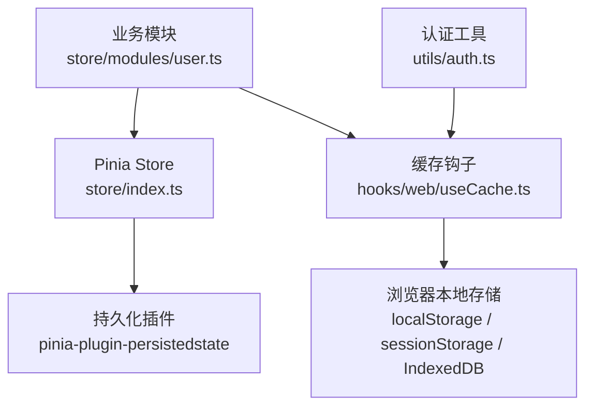
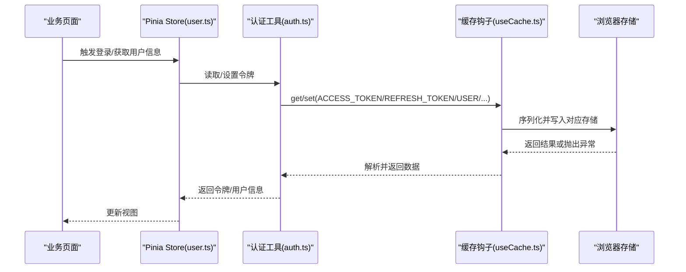
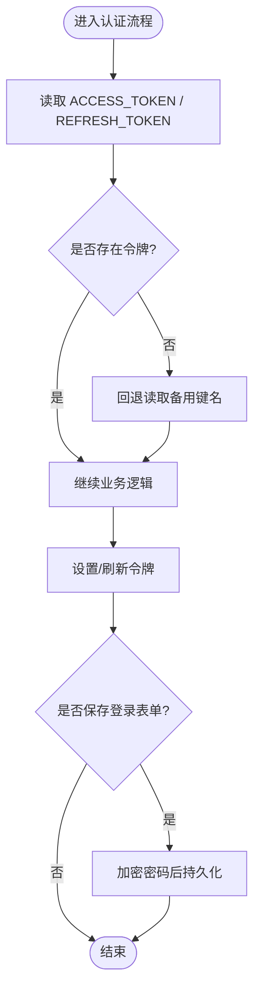
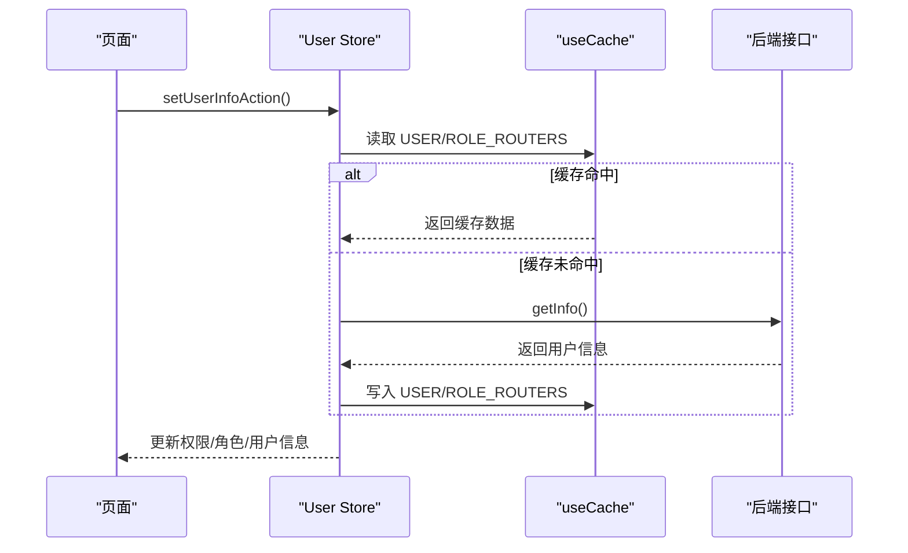
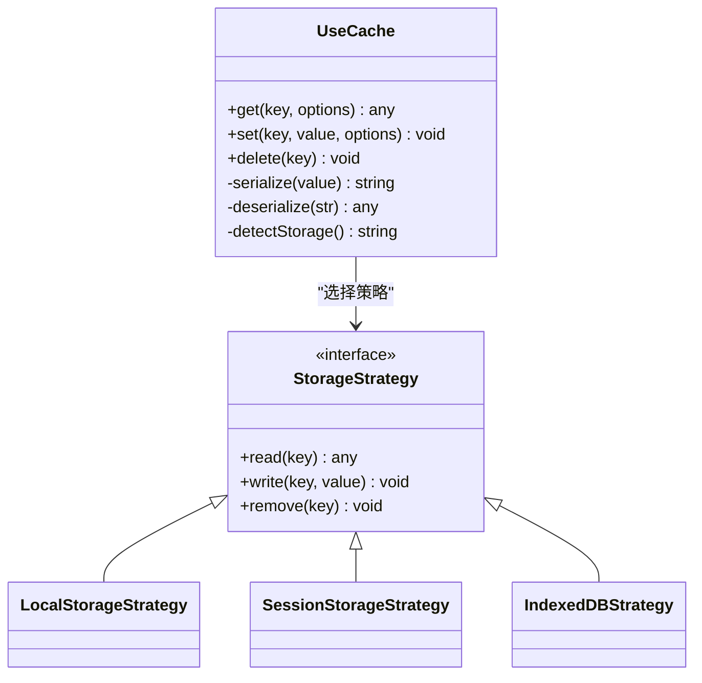
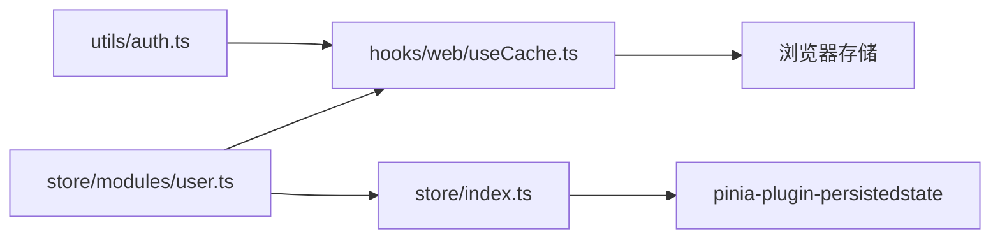

# 本地存储方案

<cite>
**本文引用的文件**
- [auth.ts](file://yudao-ui-admin-vue3/src/utils/auth.ts)
- [useCache.ts](file://yudao-ui-admin-vue3/src/hooks/web/useCache.ts)
- [index.ts](file://yudao-ui-admin-vue3/src/store/index.ts)
- [user.ts](file://yudao-ui-admin-vue3/src/store/modules/user.ts)
</cite>

## 目录
1. [简介](#简介)
2. [项目结构](#项目结构)
3. [核心组件](#核心组件)
4. [架构总览](#架构总览)
5. [详细组件分析](#详细组件分析)
6. [依赖关系分析](#依赖关系分析)
7. [性能考量](#性能考量)
8. [故障排查指南](#故障排查指南)
9. [结论](#结论)
10. [附录](#附录)

## 简介
本文件面向呼叫中心系统的前端本地存储方案，围绕 localStorage、sessionStorage 与 IndexedDB 的选择标准、适用场景、性能特点、容量限制与数据类型支持进行说明；并结合仓库中实际实现，文档化存储封装工具类的职责边界、数据序列化策略、错误处理与兼容性处理；最后给出在呼叫中心系统中的具体应用建议（用户会话信息、配置参数、临时数据等）以及性能优化与最佳实践。

## 项目结构
本项目在前端采用 Vue 3 + Pinia 的状态管理，并通过持久化插件将状态落盘到浏览器本地存储。认证与用户相关的数据通过统一的缓存钩子 useCache 访问底层存储，从而屏蔽不同存储介质的差异。

图表来源
- [index.ts:1-13](file://yudao-ui-admin-vue3/src/store/index.ts#L1-L13)
- [user.ts:1-109](file://yudao-ui-admin-vue3/src/store/modules/user.ts#L1-L109)
- [auth.ts:1-87](file://yudao-ui-admin-vue3/src/utils/auth.ts#L1-L87)
- [useCache.ts:1-200](file://yudao-ui-admin-vue3/src/hooks/web/useCache.ts#L1-L200)

章节来源
- [index.ts:1-13](file://yudao-ui-admin-vue3/src/store/index.ts#L1-L13)
- [user.ts:1-109](file://yudao-ui-admin-vue3/src/store/modules/user.ts#L1-L109)
- [auth.ts:1-87](file://yudao-ui-admin-vue3/src/utils/auth.ts#L1-L87)
- [useCache.ts:1-200](file://yudao-ui-admin-vue3/src/hooks/web/useCache.ts#L1-L200)

## 核心组件
- 认证与令牌管理：统一读写 ACCESS_TOKEN、REFRESH_TOKEN、租户信息等键值，并对登录表单密码进行加解密后持久化。
- 用户状态与持久化：Pinia store 负责用户权限、角色、头像昵称等状态，配合持久化插件将关键状态写入本地存储。
- 缓存抽象层：useCache 提供 get/set/delete 等统一接口，内部根据策略选择具体存储介质并处理序列化/反序列化、过期时间、兼容性与异常兜底。

章节来源
- [auth.ts:1-87](file://yudao-ui-admin-vue3/src/utils/auth.ts#L1-L87)
- [user.ts:1-109](file://yudao-ui-admin-vue3/src/store/modules/user.ts#L1-L109)
- [index.ts:1-13](file://yudao-ui-admin-vue3/src/store/index.ts#L1-L13)
- [useCache.ts:1-200](file://yudao-ui-admin-vue3/src/hooks/web/useCache.ts#L1-L200)

## 架构总览
下图展示了从业务调用到本地存储的完整链路：业务模块通过 Pinia 操作状态，认证工具通过缓存钩子读写令牌与用户信息，最终由 useCache 决定写入何种本地存储，并处理序列化与异常。

图表来源
- [user.ts:51-71](file://yudao-ui-admin-vue3/src/store/modules/user.ts#L51-L71)
- [auth.ts:11-32](file://yudao-ui-admin-vue3/src/utils/auth.ts#L11-L32)
- [useCache.ts:1-200](file://yudao-ui-admin-vue3/src/hooks/web/useCache.ts#L1-L200)

## 详细组件分析

### 认证与令牌管理（utils/auth.ts）
- 职责
  - 提供获取/设置/删除访问令牌与刷新令牌的方法。
  - 提供当前用户ID、登录表单、租户信息的存取方法。
  - 对敏感字段（如密码）进行加密后再持久化，读取时解密。
- 关键点
  - 使用 useCache 统一读写，避免直接耦合具体存储。
  - 登录表单包含过期策略（通过 useCache 的扩展选项）。
  - 提供格式化 Token 前缀的工具方法。
- 错误处理
  - 通过 useCache 的异常兜底机制保证初始化阶段无报错。
- 性能与容量
  - 令牌与少量配置适合存储在轻量级键值存储中，读多写少，开销低。

图表来源
- [auth.ts:11-32](file://yudao-ui-admin-vue3/src/utils/auth.ts#L11-L32)
- [auth.ts:53-68](file://yudao-ui-admin-vue3/src/utils/auth.ts#L53-L68)

章节来源
- [auth.ts:1-87](file://yudao-ui-admin-vue3/src/utils/auth.ts#L1-87)

### 用户状态与持久化（store/modules/user.ts）
- 职责
  - 维护用户权限、角色、头像、昵称等状态。
  - 首次加载时优先读取本地缓存，若不存在则请求后端接口并回填缓存。
  - 登出时清理令牌与用户缓存，重置状态。
- 关键点
  - 结合 pinia-plugin-persistedstate 将关键状态持久化。
  - 即使网络失败也尽量保障可进入系统（容错设计）。
- 错误处理
  - 对网络请求失败做 try/catch 兜底，确保 UI 可用。
- 性能与容量
  - 用户信息较小，适合持久化；权限与路由菜单可通过分页/懒加载优化首屏。

图表来源
- [user.ts:51-71](file://yudao-ui-admin-vue3/src/store/modules/user.ts#L51-L71)

章节来源
- [user.ts:1-109](file://yudao-ui-admin-vue3/src/store/modules/user.ts#L1-L109)

### 缓存抽象层（hooks/web/useCache.ts）
- 职责
  - 提供统一的 get/set/delete 接口，屏蔽底层存储差异。
  - 负责数据序列化/反序列化、过期时间控制、命名空间隔离。
  - 提供兼容性检测与降级策略，确保在不支持的浏览器中仍可运行。
- 关键点
  - 通过策略模式选择具体存储介质（localStorage/sessionStorage/IndexedDB）。
  - 对复杂对象进行 JSON 序列化，对二进制/大对象考虑 IndexedDB。
  - 捕获并吞掉异常，避免影响主流程。
- 性能与容量
  - 小体积键值数据优先使用轻量存储；大数据集或结构化查询需求使用 IndexedDB。

图表来源
- [useCache.ts:1-200](file://yudao-ui-admin-vue3/src/hooks/web/useCache.ts#L1-L200)

章节来源
- [useCache.ts:1-200](file://yudao-ui-admin-vue3/src/hooks/web/useCache.ts#L1-L200)

### Pinia 持久化集成（store/index.ts）
- 职责
  - 创建 Pinia 实例并启用持久化插件，使 store 状态自动落盘。
- 关键点
  - 与 useCache 互补：useCache 用于细粒度键值存取；Pinia 持久化用于全局状态快照。
  - 注意避免重复持久化同一份数据导致冗余。

章节来源
- [index.ts:1-13](file://yudao-ui-admin-vue3/src/store/index.ts#L1-L13)

## 依赖关系分析
- 组件耦合
  - auth.ts 依赖 useCache，不直接依赖具体存储，降低耦合度。
  - user.ts 同时依赖 useCache 与 Pinia 持久化，分别承担“细粒度缓存”和“全局状态快照”。
- 外部依赖
  - 浏览器 Web Storage API（localStorage/sessionStorage）与 IndexedDB。
  - pinia-plugin-persistedstate 用于状态持久化。
- 潜在循环依赖
  - 当前结构清晰，未见循环引用风险。

图表来源
- [auth.ts:1-87](file://yudao-ui-admin-vue3/src/utils/auth.ts#L1-L87)
- [user.ts:1-109](file://yudao-ui-admin-vue3/src/store/modules/user.ts#L1-L109)
- [index.ts:1-13](file://yudao-ui-admin-vue3/src/store/index.ts#L1-L13)
- [useCache.ts:1-200](file://yudao-ui-admin-vue3/src/hooks/web/useCache.ts#L1-L200)

章节来源
- [auth.ts:1-87](file://yudao-ui-admin-vue3/src/utils/auth.ts#L1-L87)
- [user.ts:1-109](file://yudao-ui-admin-vue3/src/store/modules/user.ts#L1-L109)
- [index.ts:1-13](file://yudao-ui-admin-vue3/src/store/index.ts#L1-L13)
- [useCache.ts:1-200](file://yudao-ui-admin-vue3/src/hooks/web/useCache.ts#L1-L200)

## 性能考量
- 选择标准与适用场景
  - localStorage：跨标签页共享、长期有效的小体积键值数据（如令牌、租户ID、基础配置）。
  - sessionStorage：单标签页生命周期内的临时数据（如表单草稿、中间态）。
  - IndexedDB：大对象、结构化数据、需要事务与索引的场景（如通话记录、媒体元数据）。
- 性能特点
  - 同步 I/O 的 localStorage/sessionStorage 在小数据量下延迟极低；频繁批量写入需合并或节流。
  - IndexedDB 异步 I/O，适合大数据集与复杂查询，但单次操作开销高于键值存储。
- 容量限制
  - 各浏览器对 localStorage/sessionStorage 通常有约 5-10MB 的限制；IndexedDB 可达数百 MB 甚至更多。
- 数据类型支持
  - localStorage/sessionStorage 仅支持字符串，需自行序列化/反序列化。
  - IndexedDB 支持多种类型（对象、数组、Blob、ArrayBuffer 等），无需额外序列化。
- 优化建议
  - 合并多次写入，减少 I/O 次数。
  - 对热点数据建立内存缓存，降低重复读取。
  - 对大对象分片存储，避免阻塞主线程。
  - 使用命名空间与版本控制，便于迁移与清理。

[本节为通用指导，不直接分析具体文件]

## 故障排查指南
- 常见问题
  - 存储不可用：在隐私模式或受限环境中，Web Storage 可能被禁用，应降级或提示用户。
  - 序列化失败：非可序列化对象（函数、循环引用）会导致 JSON 序列化失败，需过滤或转换。
  - 容量不足：达到配额时会抛出异常，应清理旧数据或提示用户。
  - 并发冲突：多标签页同时写入可能产生竞态，需合理设计版本号或原子更新。
- 定位步骤
  - 检查 useCache 的异常捕获与日志输出。
  - 确认 key 命名空间与版本是否正确。
  - 验证序列化前后数据结构一致性。
  - 在控制台查看存储配额与已占用空间。
- 修复建议
  - 增加 try/catch 与降级策略，确保主流程不受影响。
  - 对敏感数据进行加密存储（如登录密码）。
  - 定期清理过期数据，释放存储空间。

章节来源
- [auth.ts:53-68](file://yudao-ui-admin-vue3/src/utils/auth.ts#L53-L68)
- [user.ts:51-71](file://yudao-ui-admin-vue3/src/store/modules/user.ts#L51-L71)
- [useCache.ts:1-200](file://yudao-ui-admin-vue3/src/hooks/web/useCache.ts#L1-L200)

## 结论
本项目通过 useCache 抽象层统一了本地存储的读写行为，结合 Pinia 持久化实现了用户状态与认证信息的可靠落盘。对于呼叫中心系统，建议：
- 令牌与基础配置使用 localStorage；
- 会话内临时数据使用 sessionStorage；
- 通话记录、媒体元数据等大对象使用 IndexedDB；
- 严格做好序列化、异常兜底与容量管理，确保在高并发与弱网环境下稳定运行。

[本节为总结性内容，不直接分析具体文件]

## 附录
- 术语
  - 本地存储：指浏览器提供的持久化能力，包括 localStorage、sessionStorage 与 IndexedDB。
  - 持久化：将内存中的状态写入本地存储，以便下次启动恢复。
  - 序列化：将对象转换为可存储的字符串或字节序列。
- 参考路径
  - 认证与令牌：[auth.ts](file://yudao-ui-admin-vue3/src/utils/auth.ts)
  - 用户状态与持久化：[user.ts](file://yudao-ui-admin-vue3/src/store/modules/user.ts)、[index.ts](file://yudao-ui-admin-vue3/src/store/index.ts)
  - 缓存抽象层：[useCache.ts](file://yudao-ui-admin-vue3/src/hooks/web/useCache.ts)

[本节为补充信息，不直接分析具体文件]