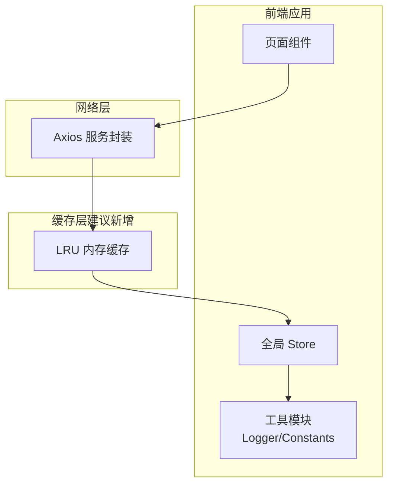
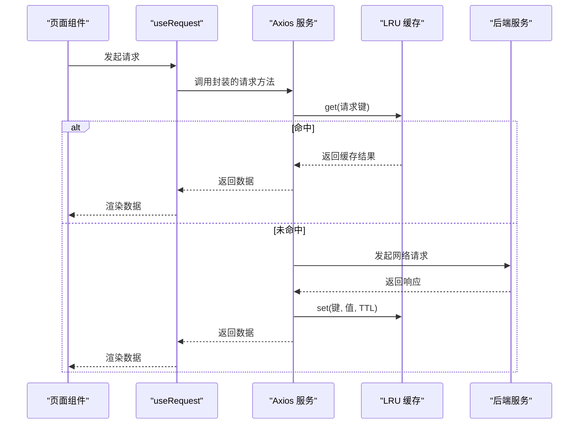
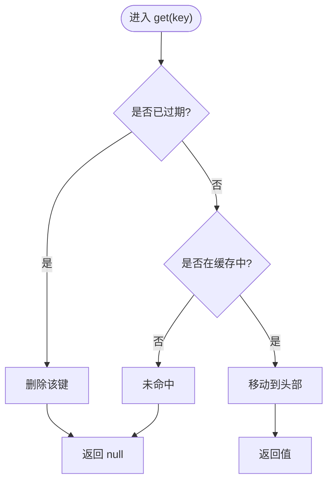
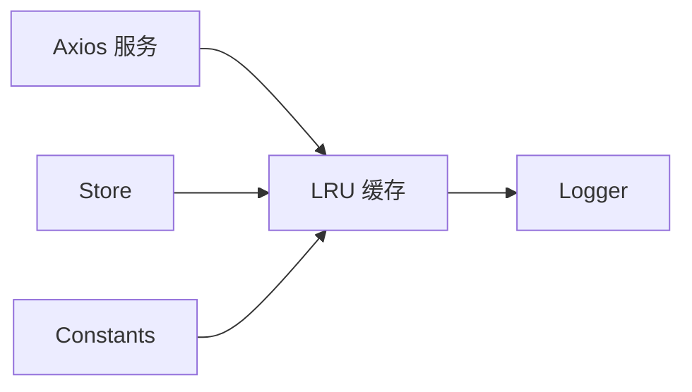

# 内存缓存实现

<cite>
**本文引用的文件**
- [yudao-ui-admin-vue3/src/utils/Logger.ts](file://yudao-ui-admin-vue3/src/utils/Logger.ts)
- [yudao-ui-admin-vue3/src/config/axios/service.ts](file://yudao-ui-admin-vue3/src/config/axios/service.ts)
- [yudao-ui-admin-vue3/src/store/index.ts](file://yudao-ui-admin-vue3/src/store/index.ts)
- [yudao-ui-admin-vue3/src/hooks/web/useRequest.ts](file://yudao-ui-admin-vue3/src/hooks/web/useRequest.ts)
- [yudao-ui-admin-vue3/src/utils/constants.ts](file://yudao-ui-admin-vue3/src/utils/constants.ts)
</cite>

## 目录
1. [简介](#简介)
2. [项目结构](#项目结构)
3. [核心组件](#核心组件)
4. [架构总览](#架构总览)
5. [详细组件分析](#详细组件分析)
6. [依赖关系分析](#依赖关系分析)
7. [性能考量](#性能考量)
8. [故障排查指南](#故障排查指南)
9. [结论](#结论)
10. [附录](#附录)

## 简介
本文件面向前端内存缓存的实现与使用，围绕以下目标展开：LRU 算法设计、容量控制与内存管理策略；键值对生命周期、过期时间与自动清理；get/set/delete 接口规范；并发访问的线程安全方案；命中率统计与性能监控；内存泄漏防护与最佳实践。由于仓库未包含现成的 LRU 缓存实现源码，本文基于前端工程中的请求层、状态管理与日志工具进行“概念级”设计与集成说明，帮助在 yudao-ui-admin-vue3 中落地一个高性能、可观测、安全的内存缓存。

## 项目结构
前端工程采用 Vue3 + TypeScript，关键位置如下：
- 请求层：Axios 封装与服务配置，适合做响应级缓存入口
- 状态管理：全局 store 用于跨组件共享数据，可作为缓存载体或元数据容器
- 工具层：日志记录器可用于埋点与监控
- 常量：集中定义缓存键前缀、默认 TTL、容量等配置项

图表来源
- [yudao-ui-admin-vue3/src/config/axios/service.ts:1-200](file://yudao-ui-admin-vue3/src/config/axios/service.ts#L1-L200)
- [yudao-ui-admin-vue3/src/store/index.ts:1-200](file://yudao-ui-admin-vue3/src/store/index.ts#L1-L200)
- [yudao-ui-admin-vue3/src/utils/Logger.ts:1-200](file://yudao-ui-admin-vue3/src/utils/Logger.ts#L1-L200)
- [yudao-ui-admin-vue3/src/utils/constants.ts:1-200](file://yudao-ui-admin-vue3/src/utils/constants.ts#L1-L200)

章节来源
- [yudao-ui-admin-vue3/src/config/axios/service.ts:1-200](file://yudao-ui-admin-vue3/src/config/axios/service.ts#L1-L200)
- [yudao-ui-admin-vue3/src/store/index.ts:1-200](file://yudao-ui-admin-vue3/src/store/index.ts#L1-L200)
- [yudao-ui-admin-vue3/src/utils/Logger.ts:1-200](file://yudao-ui-admin-vue3/src/utils/Logger.ts#L1-L200)
- [yudao-ui-admin-vue3/src/utils/constants.ts:1-200](file://yudao-ui-admin-vue3/src/utils/constants.ts#L1-L200)

## 核心组件
- LRU 内存缓存
  - 数据结构：双向链表 + 哈希表，保证 O(1) 读写与淘汰
  - 容量控制：固定最大条目数，超过时按最近最少使用原则淘汰
  - 过期时间：支持 per-key TTL，读取时检测并剔除过期项
  - 自动清理：后台定时任务扫描并清理过期项，降低读路径开销
  - 并发安全：单线程模型下通过队列化写操作避免竞态；如需多线程需加锁
  - 监控指标：命中率、平均延迟、容量使用率、淘汰次数、过期清理次数
- 请求拦截缓存
  - 在 Axios 拦截器中根据请求参数生成稳定键，命中则直接返回
  - 未命中则发起请求，写入缓存并设置 TTL
- 状态同步
  - 当业务需要强一致时，可通过 Store 发布事件触发缓存失效或更新
- 日志与埋点
  - 统一通过 Logger 输出缓存命中/未命中、错误、慢请求等指标

章节来源
- [yudao-ui-admin-vue3/src/config/axios/service.ts:1-200](file://yudao-ui-admin-vue3/src/config/axios/service.ts#L1-L200)
- [yudao-ui-admin-vue3/src/store/index.ts:1-200](file://yudao-ui-admin-vue3/src/store/index.ts#L1-L200)
- [yudao-ui-admin-vue3/src/utils/Logger.ts:1-200](file://yudao-ui-admin-vue3/src/utils/Logger.ts#L1-L200)
- [yudao-ui-admin-vue3/src/utils/constants.ts:1-200](file://yudao-ui-admin-vue3/src/utils/constants.ts#L1-L200)

## 架构总览
下图展示请求从页面到缓存再到后端的完整链路，以及缓存命中时的快速返回路径。

图表来源
- [yudao-ui-admin-vue3/src/hooks/web/useRequest.ts:1-200](file://yudao-ui-admin-vue3/src/hooks/web/useRequest.ts#L1-L200)
- [yudao-ui-admin-vue3/src/config/axios/service.ts:1-200](file://yudao-ui-admin-vue3/src/config/axios/service.ts#L1-L200)

## 详细组件分析

### LRU 缓存设计与实现要点
- 数据结构
  - 双向链表维护访问顺序，头为最近使用，尾为最久未使用
  - Map 存储 key -> Node 映射，实现 O(1) 查找
- 容量控制
  - 初始化时设定 maxSize，set 时若超限则移除尾部节点
- 过期时间
  - 每个节点携带 expireAt 时间戳；get 时检查是否过期，过期则删除并返回空
  - 后台定时器周期性扫描，批量清理过期项
- 自动清理
  - 定时任务间隔可调（如 60s），每次最多清理 N 个过期项，避免阻塞主线程
- 并发安全
  - 浏览器/Node 单线程事件循环，天然无共享可变状态竞争
  - 若涉及 Web Worker 或多进程，需在进程边界加锁或使用消息队列串行化写操作
- 监控指标
  - 命中率 = 命中次数 / (命中次数 + 未命中次数)
  - 平均延迟、P95/P99 延迟、容量使用率、淘汰计数、过期清理计数
  - 通过 Logger 输出结构化日志，便于接入前端监控平台

图表来源
- [yudao-ui-admin-vue3/src/utils/constants.ts:1-200](file://yudao-ui-admin-vue3/src/utils/constants.ts#L1-L200)

章节来源
- [yudao-ui-admin-vue3/src/utils/constants.ts:1-200](file://yudao-ui-admin-vue3/src/utils/constants.ts#L1-L200)

### 缓存键值对管理机制
- 键生成
  - 对 GET 请求：URL + 查询参数排序序列化
  - 对 POST/PUT：URL + 请求体 JSON 序列化（必要时签名）
  - 支持命名空间与版本前缀，避免冲突
- 生命周期
  - 创建：首次请求成功写入
  - 访问：命中则更新时间戳，未命中则回源
  - 过期：读取时检测 TTL，过期即删除
  - 删除：显式 delete 或批量失效（按命名空间）
- 自动清理
  - 后台定时任务扫描并清理过期项，减少读路径判断成本
- 一致性
  - 写操作后通过 Store 事件广播失效，确保多组件视图一致

章节来源
- [yudao-ui-admin-vue3/src/store/index.ts:1-200](file://yudao-ui-admin-vue3/src/store/index.ts#L1-L200)
- [yudao-ui-admin-vue3/src/utils/constants.ts:1-200](file://yudao-ui-admin-vue3/src/utils/constants.ts#L1-L200)

### 读写接口规范（get/set/delete）
- get(key, options?)
  - 参数：key 字符串；options 可选 { ttl?: number }
  - 返回：Promise<T | null>
  - 行为：命中返回缓存值；未命中或过期返回 null
- set(key, value, options?)
  - 参数：key 字符串；value 任意可序列化对象；options { ttl?: number; namespace?: string }
  - 返回：Promise<boolean>
  - 行为：写入并可能触发淘汰；失败返回 false
- delete(key)
  - 参数：key 字符串
  - 返回：Promise<boolean>
  - 行为：删除指定键；不存在也返回 true
- clear(namespace?)
  - 参数：可选命名空间
  - 返回：Promise<number>
  - 行为：清空全部或指定命名空间的缓存，返回删除数量

章节来源
- [yudao-ui-admin-vue3/src/config/axios/service.ts:1-200](file://yudao-ui-admin-vue3/src/config/axios/service.ts#L1-L200)
- [yudao-ui-admin-vue3/src/utils/constants.ts:1-200](file://yudao-ui-admin-vue3/src/utils/constants.ts#L1-L200)

### 并发访问与线程安全
- 前端单线程模型
  - 事件循环保证同一时刻只有一个执行上下文，无需互斥锁
  - 注意 Promise 并发：多个相同请求应合并，避免重复回源
- 请求合并
  - 在 Axios 拦截器中对相同 key 的请求去重，首个请求完成后复用结果
- 多进程/Worker
  - 若使用 Web Worker 或 Node 多进程，需通过消息通道串行化写操作，或在共享内存上加锁
- 内存压力
  - 大对象频繁写入可能导致 GC 抖动，建议限制单条大小与整体容量

章节来源
- [yudao-ui-admin-vue3/src/config/axios/service.ts:1-200](file://yudao-ui-admin-vue3/src/config/axios/service.ts#L1-L200)

### 命中率统计与性能监控
- 指标定义
  - 命中率、平均延迟、P95/P99 延迟、容量使用率、淘汰次数、过期清理次数
- 采集方式
  - 在 get/set/delete 路径埋点，使用 Logger 输出结构化日志
  - 聚合上报至前端监控平台（如自研或第三方）
- 可视化
  - 提供仪表盘展示实时命中率与延迟分布，辅助容量调优

章节来源
- [yudao-ui-admin-vue3/src/utils/Logger.ts:1-200](file://yudao-ui-admin-vue3/src/utils/Logger.ts#L1-L200)

### 内存泄漏防护与最佳实践
- 防止泄漏
  - 严格 TTL 与定期清理，避免长期驻留
  - 限制单条大小与总量，超出立即淘汰
  - 避免在缓存中持有 DOM 引用或闭包引用外部大对象
- 键设计
  - 使用稳定、短小、可序列化的键，避免动态函数或对象作为键
- 失效策略
  - 写后主动失效相关键；按命名空间批量失效
- 降级与兜底
  - 缓存不可用时降级为直连后端；监控告警阈值
- 测试与验证
  - 单元测试覆盖命中/未命中/过期/淘汰路径
  - 压测评估不同容量与 TTL 下的命中率与内存占用

章节来源
- [yudao-ui-admin-vue3/src/utils/constants.ts:1-200](file://yudao-ui-admin-vue3/src/utils/constants.ts#L1-L200)
- [yudao-ui-admin-vue3/src/store/index.ts:1-200](file://yudao-ui-admin-vue3/src/store/index.ts#L1-L200)

## 依赖关系分析
- 请求层依赖缓存
  - Axios 拦截器在发送前查询缓存，命中直接返回，未命中再回源
- 状态管理协同
  - Store 负责发布/订阅失效事件，驱动缓存失效或更新
- 工具与配置
  - Logger 输出监控日志；Constants 集中管理 TTL、容量、命名空间等

图表来源
- [yudao-ui-admin-vue3/src/config/axios/service.ts:1-200](file://yudao-ui-admin-vue3/src/config/axios/service.ts#L1-L200)
- [yudao-ui-admin-vue3/src/store/index.ts:1-200](file://yudao-ui-admin-vue3/src/store/index.ts#L1-L200)
- [yudao-ui-admin-vue3/src/utils/Logger.ts:1-200](file://yudao-ui-admin-vue3/src/utils/Logger.ts#L1-L200)
- [yudao-ui-admin-vue3/src/utils/constants.ts:1-200](file://yudao-ui-admin-vue3/src/utils/constants.ts#L1-L200)

章节来源
- [yudao-ui-admin-vue3/src/config/axios/service.ts:1-200](file://yudao-ui-admin-vue3/src/config/axios/service.ts#L1-L200)
- [yudao-ui-admin-vue3/src/store/index.ts:1-200](file://yudao-ui-admin-vue3/src/store/index.ts#L1-L200)
- [yudao-ui-admin-vue3/src/utils/Logger.ts:1-200](file://yudao-ui-admin-vue3/src/utils/Logger.ts#L1-L200)
- [yudao-ui-admin-vue3/src/utils/constants.ts:1-200](file://yudao-ui-admin-vue3/src/utils/constants.ts#L1-L200)

## 性能考量
- 时间复杂度
  - get/set/delete 均为 O(1)，适合高频访问场景
- 空间复杂度
  - 受限于最大容量，避免 OOM；合理设置 TTL 降低常驻内存
- 延迟优化
  - 请求合并减少重复回源；热点数据优先保留
- 监控与调优
  - 基于命中率与延迟调整容量与 TTL；观察淘汰曲线定位热点

[本节为通用性能讨论，不直接分析具体文件]

## 故障排查指南
- 常见问题
  - 命中率低：检查键生成是否稳定、TTL 是否过短、是否存在大量唯一键
  - 内存增长：检查是否遗漏 TTL、是否存在大对象、是否未清理
  - 数据不一致：确认写后失效策略是否生效，Store 事件是否正确触发
- 诊断步骤
  - 查看 Logger 输出的命中/未命中、错误与慢请求日志
  - 检查 Store 中失效事件与缓存状态
  - 通过监控面板观察命中率、延迟与容量使用率
- 修复建议
  - 修正键生成逻辑；增大 TTL 或提高容量；完善写后失效；引入请求合并

章节来源
- [yudao-ui-admin-vue3/src/utils/Logger.ts:1-200](file://yudao-ui-admin-vue3/src/utils/Logger.ts#L1-L200)
- [yudao-ui-admin-vue3/src/store/index.ts:1-200](file://yudao-ui-admin-vue3/src/store/index.ts#L1-L200)

## 结论
本文在前端工程背景下，给出了内存缓存的概念性设计与集成方案：以 LRU 为核心，结合 TTL 与自动清理保障内存安全；通过 Axios 拦截器与 Store 事件实现高效命中与一致性；借助 Logger 与监控完成可观测性。建议在项目中按需落地上述设计，并结合业务特征持续调优容量、TTL 与失效策略，以获得更稳定的性能与更低的资源消耗。

[本节为总结性内容，不直接分析具体文件]

## 附录
- 建议的常量配置项（示例）
  - 默认 TTL、最大容量、命名空间前缀、清理间隔、单条大小上限
- 建议的监控指标（示例）
  - 命中率、平均延迟、P95/P99、容量使用率、淘汰次数、过期清理次数
- 建议的测试用例（示例）
  - 命中/未命中、过期、淘汰、批量失效、请求合并、内存泄漏回归

[本节为补充信息，不直接分析具体文件]