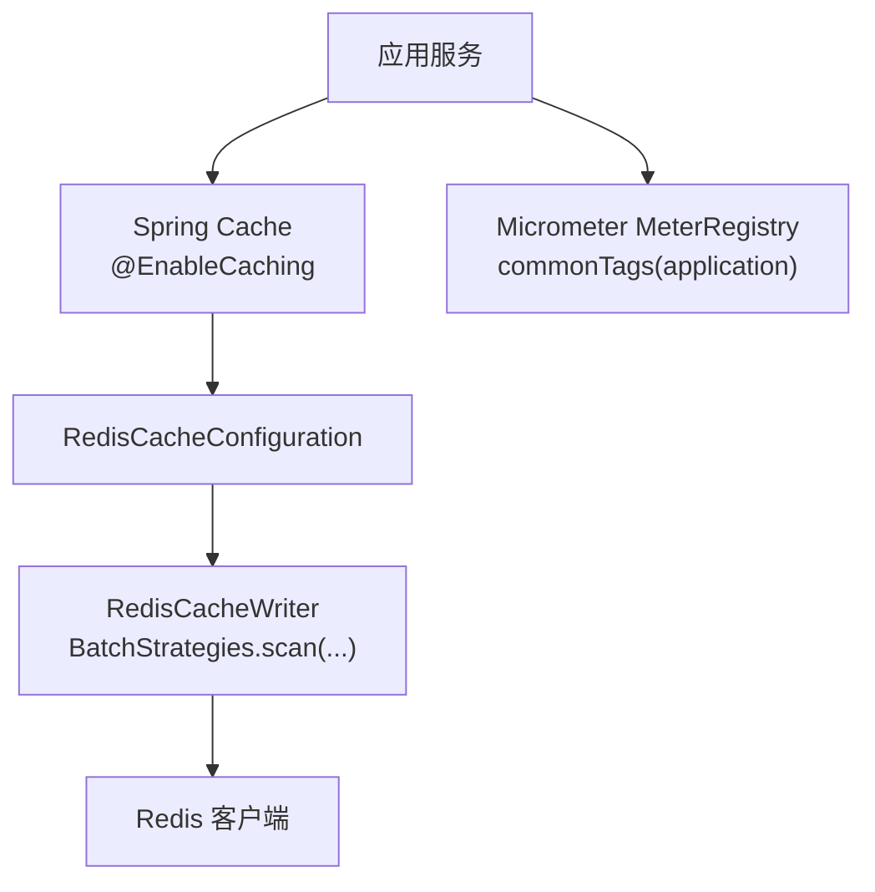
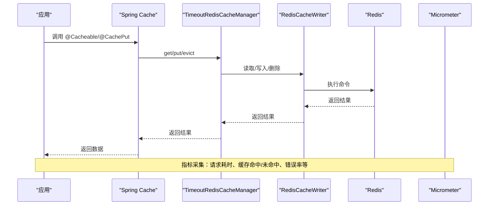
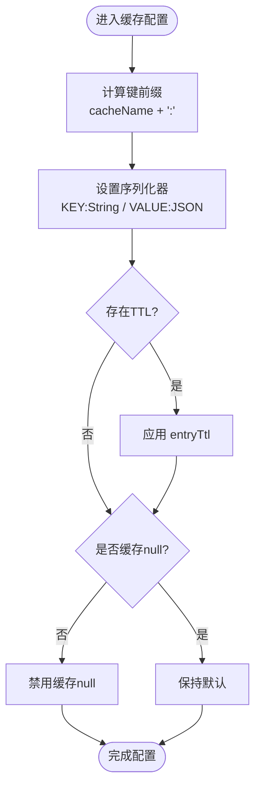
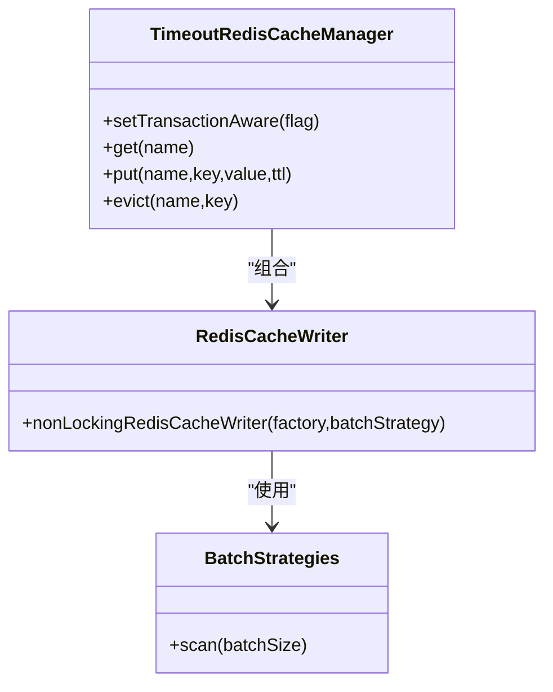
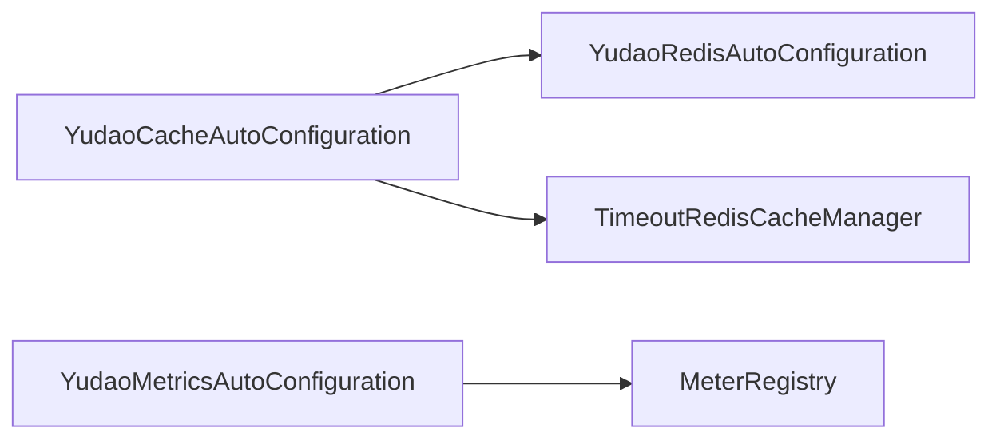

# 性能优化与监控

<cite>
**本文引用的文件**
- [YudaoCacheAutoConfiguration.java](file://yudao-cloud/yudao-framework/yudao-spring-boot-starter-redis/src/main/java/cn/iocoder/yudao/framework/redis/config/YudaoCacheAutoConfiguration.java)
- [YudaoRedisAutoConfiguration.java](file://yudao-cloud/yudao-framework/yudao-spring-boot-starter-redis/src/main/java/cn/iocoder/yudao/framework/redis/config/YudaoRedisAutoConfiguration.java)
- [TimeoutRedisCacheManager.java](file://yudao-cloud/yudao-framework/yudao-spring-boot-starter-redis/src/main/java/cn/iocoder/yudao/framework/redis/core/TimeoutRedisCacheManager.java)
- [YudaoMetricsAutoConfiguration.java](file://yudao-cloud/yudao-framework/yudao-spring-boot-starter-monitor/src/main/java/cn/iocoder/yudao/framework/tracer/config/YudaoMetricsAutoConfiguration.java)
</cite>

## 目录
1. [简介](#简介)
2. [项目结构](#项目结构)
3. [核心组件](#核心组件)
4. [架构总览](#架构总览)
5. [详细组件分析](#详细组件分析)
6. [依赖关系分析](#依赖关系分析)
7. [性能考量](#性能考量)
8. [故障排查指南](#故障排查指南)
9. [结论](#结论)
10. [附录](#附录)

## 简介
本文件面向缓存性能优化与监控，围绕命中率、响应时间、内存使用量等关键指标的定义与测量方法展开，结合项目中基于 Redis 的缓存实现与 Micrometer 指标体系，给出可落地的优化手段（缓存预热、批量操作、连接池优化、内存管理）、问题诊断方法（瓶颈定位、内存泄漏检测）、压测与基准测试方案，以及生产环境的监控告警与故障恢复策略。

## 项目结构
本项目在 yudao-framework 中提供两个与缓存和监控密切相关的 starter：
- yudao-spring-boot-starter-redis：封装 Redis 与 Spring Cache 配置，统一序列化、键前缀、TTL 与事务感知行为，并暴露自定义 CacheManager。
- yudao-spring-boot-starter-monitor：通过 Micrometer 暴露通用指标标签，便于接入 Prometheus/Grafana 等观测系统。

图表来源
- [YudaoCacheAutoConfiguration.java:27-84](file://yudao-cloud/yudao-framework/yudao-spring-boot-starter-redis/src/main/java/cn/iocoder/yudao/framework/redis/config/YudaoCacheAutoConfiguration.java#L27-L84)
- [YudaoMetricsAutoConfiguration.java:17-26](file://yudao-cloud/yudao-framework/yudao-spring-boot-starter-monitor/src/main/java/cn/iocoder/yudao/framework/tracer/config/YudaoMetricsAutoConfiguration.java#L17-L26)

章节来源
- [YudaoCacheAutoConfiguration.java:27-84](file://yudao-cloud/yudao-framework/yudao-spring-boot-starter-redis/src/main/java/cn/iocoder/yudao/framework/redis/config/YudaoCacheAutoConfiguration.java#L27-L84)
- [YudaoRedisAutoConfiguration.java:16-44](file://yudao-cloud/yudao-framework/yudao-spring-boot-starter-redis/src/main/java/cn/iocoder/yudao/framework/redis/config/YudaoRedisAutoConfiguration.java#L16-L44)
- [YudaoMetricsAutoConfiguration.java:17-26](file://yudao-cloud/yudao-framework/yudao-spring-boot-starter-monitor/src/main/java/cn/iocoder/yudao/framework/tracer/config/YudaoMetricsAutoConfiguration.java#L17-L26)

## 核心组件
- 缓存自动装配：启用 @EnableCaching，构建统一的 RedisCacheConfiguration（键前缀、JSON 序列化、TTL、是否缓存 null）。
- 缓存管理器：基于 RedisCacheWriter 与 BatchStrategies.scan 创建非锁式写入器，并通过自定义 TimeoutRedisCacheManager 增强超时控制；开启事务感知以延迟清缓存到 afterCommit。
- Redis 模板：统一 KEY/VALUE 序列化策略，注册 JavaTimeModule 支持 LocalDateTime。
- 指标体系：为所有指标附加 application 公共标签，便于多实例聚合与区分。

章节来源
- [YudaoCacheAutoConfiguration.java:37-84](file://yudao-cloud/yudao-framework/yudao-spring-boot-starter-redis/src/main/java/cn/iocoder/yudao/framework/redis/config/YudaoCacheAutoConfiguration.java#L37-L84)
- [YudaoRedisAutoConfiguration.java:22-44](file://yudao-cloud/yudao-framework/yudao-spring-boot-starter-redis/src/main/java/cn/iocoder/yudao/framework/redis/config/YudaoRedisAutoConfiguration.java#L22-L44)
- [YudaoMetricsAutoConfiguration.java:22-26](file://yudao-cloud/yudao-framework/yudao-spring-boot-starter-monitor/src/main/java/cn/iocoder/yudao/framework/tracer/config/YudaoMetricsAutoConfiguration.java#L22-L26)

## 架构总览
下图展示一次带缓存的请求从应用层到 Redis 的关键路径，以及指标采集点。

图表来源
- [YudaoCacheAutoConfiguration.java:70-84](file://yudao-cloud/yudao-framework/yudao-spring-boot-starter-redis/src/main/java/cn/iocoder/yudao/framework/redis/config/YudaoCacheAutoConfiguration.java#L70-L84)
- [YudaoMetricsAutoConfiguration.java:22-26](file://yudao-cloud/yudao-framework/yudao-spring-boot-starter-monitor/src/main/java/cn/iocoder/yudao/framework/tracer/config/YudaoMetricsAutoConfiguration.java#L22-L26)

## 详细组件分析

### 组件A：Redis 缓存自动装配与序列化
- 键前缀策略：根据配置生成 cacheName: 形式的键前缀，避免多余空格导致的管理工具显示问题。
- 序列化：统一 JSON 序列化 VALUE，KEY/HashKey 使用 String 序列化，提升可读性与兼容性。
- TTL 与空值：遵循 CacheProperties.Redis 的 TTL 与是否缓存 null 的配置。
- 事务感知：开启事务感知后，@Transactional 内的 @CacheEvict/@CachePut 延迟至 afterCommit 执行，避免脏读。

图表来源
- [YudaoCacheAutoConfiguration.java:37-68](file://yudao-cloud/yudao-framework/yudao-spring-boot-starter-redis/src/main/java/cn/iocoder/yudao/framework/redis/config/YudaoCacheAutoConfiguration.java#L37-L68)
- [YudaoRedisAutoConfiguration.java:22-44](file://yudao-cloud/yudao-framework/yudao-spring-boot-starter-redis/src/main/java/cn/iocoder/yudao/framework/redis/config/YudaoRedisAutoConfiguration.java#L22-L44)

章节来源
- [YudaoCacheAutoConfiguration.java:37-68](file://yudao-cloud/yudao-framework/yudao-spring-boot-starter-redis/src/main/java/cn/iocoder/yudao/framework/redis/config/YudaoCacheAutoConfiguration.java#L37-L68)
- [YudaoRedisAutoConfiguration.java:22-44](file://yudao-cloud/yudao-framework/yudao-spring-boot-starter-redis/src/main/java/cn/iocoder/yudao/framework/redis/config/YudaoRedisAutoConfiguration.java#L22-L44)

### 组件B：缓存管理器与批量扫描
- 非锁式写入器：使用 RedisCacheWriter.nonLockingRedisCacheWriter，降低写放大与锁竞争。
- 批量扫描：通过 BatchStrategies.scan(批大小) 控制 scan 批次，平衡 CPU 与网络开销。
- 事务感知：setTransactionAware(true)，确保一致性。

图表来源
- [YudaoCacheAutoConfiguration.java:70-84](file://yudao-cloud/yudao-framework/yudao-spring-boot-starter-redis/src/main/java/cn/iocoder/yudao/framework/redis/config/YudaoCacheAutoConfiguration.java#L70-L84)
- [TimeoutRedisCacheManager.java:1-200](file://yudao-cloud/yudao-framework/yudao-spring-boot-starter-redis/src/main/java/cn/iocoder/yudao/framework/redis/core/TimeoutRedisCacheManager.java#L1-L200)

章节来源
- [YudaoCacheAutoConfiguration.java:70-84](file://yudao-cloud/yudao-framework/yudao-spring-boot-starter-redis/src/main/java/cn/iocoder/yudao/framework/redis/config/YudaoCacheAutoConfiguration.java#L70-L84)
- [TimeoutRedisCacheManager.java:1-200](file://yudao-cloud/yudao-framework/yudao-spring-boot-starter-redis/src/main/java/cn/iocoder/yudao/framework/redis/core/TimeoutRedisCacheManager.java#L1-L200)

### 组件C：指标与监控
- 公共标签：为所有指标附加 application 标签，便于按应用维度聚合。
- 开关：可通过 yudao.metrics.enable=false 关闭指标采集。

章节来源
- [YudaoMetricsAutoConfiguration.java:17-26](file://yudao-cloud/yudao-framework/yudao-spring-boot-starter-monitor/src/main/java/cn/iocoder/yudao/framework/tracer/config/YudaoMetricsAutoConfiguration.java#L17-L26)

## 依赖关系分析
- 缓存模块依赖 Spring Boot Cache 抽象与 Redis 客户端，通过 AutoConfiguration 注入 Bean。
- 监控模块依赖 Micrometer，为应用暴露标准指标端点（如 /actuator/metrics），并与外部监控系统对接。

图表来源
- [YudaoCacheAutoConfiguration.java:27-84](file://yudao-cloud/yudao-framework/yudao-spring-boot-starter-redis/src/main/java/cn/iocoder/yudao/framework/redis/config/YudaoCacheAutoConfiguration.java#L27-L84)
- [YudaoRedisAutoConfiguration.java:16-44](file://yudao-cloud/yudao-framework/yudao-spring-boot-starter-redis/src/main/java/cn/iocoder/yudao/framework/redis/config/YudaoRedisAutoConfiguration.java#L16-L44)
- [YudaoMetricsAutoConfiguration.java:17-26](file://yudao-cloud/yudao-framework/yudao-spring-boot-starter-monitor/src/main/java/cn/iocoder/yudao/framework/tracer/config/YudaoMetricsAutoConfiguration.java#L17-L26)

章节来源
- [YudaoCacheAutoConfiguration.java:27-84](file://yudao-cloud/yudao-framework/yudao-spring-boot-starter-redis/src/main/java/cn/iocoder/yudao/framework/redis/config/YudaoCacheAutoConfiguration.java#L27-L84)
- [YudaoRedisAutoConfiguration.java:16-44](file://yudao-cloud/yudao-framework/yudao-spring-boot-starter-redis/src/main/java/cn/iocoder/yudao/framework/redis/config/YudaoRedisAutoConfiguration.java#L16-L44)
- [YudaoMetricsAutoConfiguration.java:17-26](file://yudao-cloud/yudao-framework/yudao-spring-boot-starter-monitor/src/main/java/cn/iocoder/yudao/framework/tracer/config/YudaoMetricsAutoConfiguration.java#L17-L26)

## 性能考量
- 命中率与响应时间
  - 定义：命中率 = 命中次数 / (命中次数 + 未命中次数)；响应时间包括缓存读取/写入时延与业务处理时延。
  - 测量：通过 Micrometer 统计缓存相关计时器与计数器，结合应用日志与链路追踪进行关联分析。
- 内存使用量
  - 关注 JVM 堆与非堆内存、对象分配速率、GC 停顿；同时关注 Redis 内存占用与碎片率。
- 连接池与网络
  - 合理设置连接池大小、超时与重试策略，避免连接耗尽或频繁握手。
- 批量与扫描
  - 使用 BatchStrategies.scan 控制扫描批次，避免单次扫描过大导致阻塞。
- 序列化与键设计
  - 统一 JSON 序列化减少兼容性问题；合理的键前缀与命名空间隔离不同业务缓存。

[本节为通用性能指导，不直接分析具体文件]

## 故障排查指南
- 性能瓶颈定位
  - 观察慢查询与高 P95/P99 响应时间，结合链路追踪定位热点接口与缓存访问路径。
  - 检查缓存未命中率异常升高原因：键冲突、过期策略不当、数据源变更未同步。
- 内存泄漏检测
  - 使用 JFR/JMC 或 Arthas 分析对象分配热点与 GC 行为；检查是否存在大对象常驻或集合无界增长。
  - 检查 Redis 侧是否存在大 Key、热 Key 或内存碎片过高。
- 事务一致性问题
  - 确认已开启事务感知，避免事务回滚但缓存已更新的“写穿”问题。
- 常见问题清单
  - 键前缀不一致导致缓存污染；序列化版本不兼容；TTL 过短造成抖动；扫描批次过大引发卡顿。

章节来源
- [YudaoCacheAutoConfiguration.java:70-84](file://yudao-cloud/yudao-framework/yudao-spring-boot-starter-redis/src/main/java/cn/iocoder/yudao/framework/redis/config/YudaoCacheAutoConfiguration.java#L70-L84)
- [YudaoRedisAutoConfiguration.java:22-44](file://yudao-cloud/yudao-framework/yudao-spring-boot-starter-redis/src/main/java/cn/iocoder/yudao/framework/redis/config/YudaoRedisAutoConfiguration.java#L22-L44)

## 结论
本项目通过统一的 Redis 缓存装配与 Micrometer 指标体系，为缓存性能优化与监控提供了良好基础。建议在此基础上完善缓存指标埋点、建立压测基线、制定告警阈值与应急预案，持续迭代优化命中率与稳定性。

[本节为总结性内容，不直接分析具体文件]

## 附录

### 指标定义与测量方法
- 命中率
  - 定义：命中次数 / (命中次数 + 未命中次数)
  - 测量：统计缓存读操作的命中与未命中计数，结合业务维度打标签。
- 响应时间
  - 定义：缓存读/写端到端耗时
  - 测量：使用计时器记录关键路径耗时，输出分位值（P50/P90/P99）。
- 内存使用量
  - 定义：JVM 堆/非堆内存与 Redis 内存占用
  - 测量：通过运行时指标与外部监控采集，结合 GC 日志分析。

[本节为概念说明，不直接分析具体文件]

### 监控工具与平台
- 前端性能监控
  - 使用浏览器开发者工具与 Web Vitals 指标评估首屏与交互性能。
- 后端性能分析
  - 使用 Micrometer + Prometheus/Grafana 采集与应用指标；结合链路追踪（如 SkyWalking）进行全链路分析。

[本节为概念说明，不直接分析具体文件]

### 优化技术手段
- 缓存预热
  - 启动或低峰期预加载热点数据，降低冷启动冲击。
- 批量操作
  - 合并多次读写为批量命令，减少网络往返与序列化开销。
- 连接池优化
  - 调整连接池大小、超时与重试策略，避免资源争用。
- 内存管理
  - 控制缓存项大小与数量，避免大 Key；定期清理过期与无效数据。

[本节为概念说明，不直接分析具体文件]

### 压测与基准测试方案
- 目标
  - 验证缓存命中率、吞吐、延迟与资源利用率是否满足 SLA。
- 场景
  - 热点读、热点写、混合读写、突发流量。
- 指标
  - QPS、RT、命中率、错误率、CPU/内存/IO、Redis 连接数与内存。
- 工具
  - 使用压测工具模拟并发，结合监控面板观察趋势与拐点。

[本节为概念说明，不直接分析具体文件]

### 生产监控告警与故障恢复
- 告警
  - 命中率骤降、RT 飙升、错误率上升、内存/连接池耗尽、Redis 异常。
- 恢复
  - 快速降级（旁路缓存/只读模式）、限流与熔断、滚动重启与扩容、数据回滚与重建。

[本节为概念说明，不直接分析具体文件]