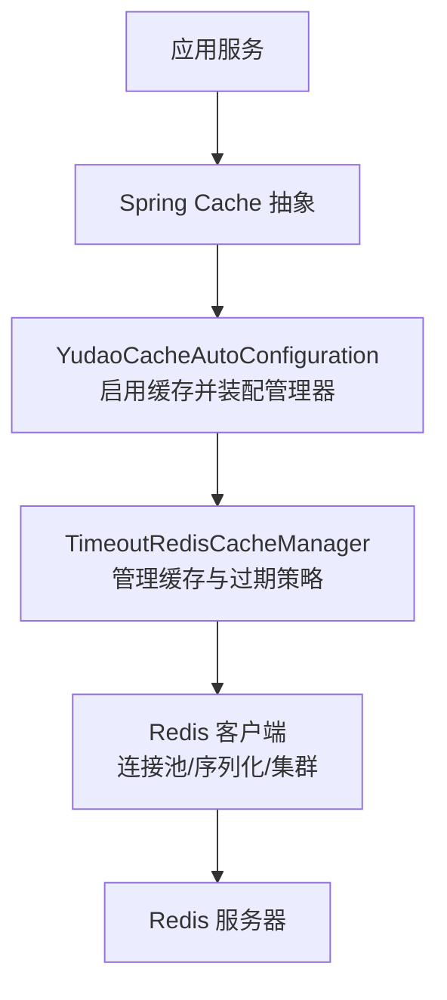
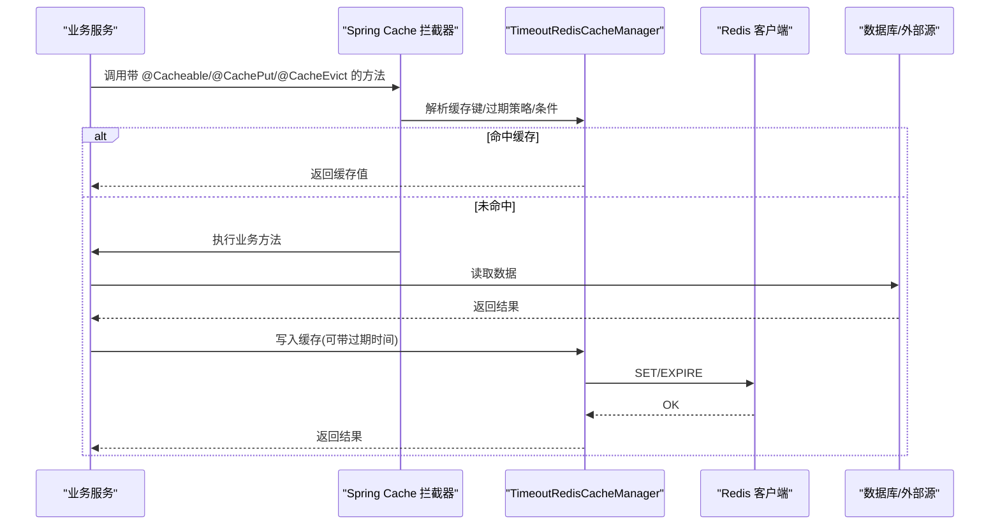
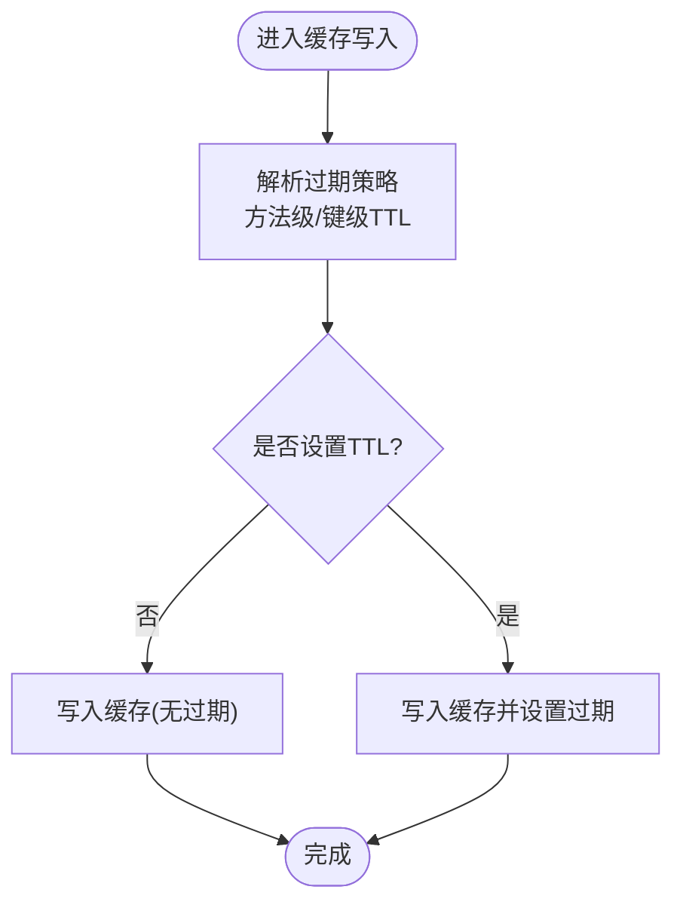
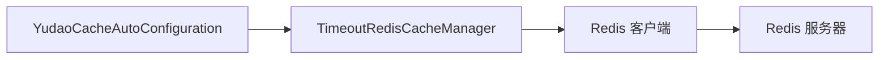

# 服务器端缓存

<cite>
**本文引用的文件**
- [yudao-spring-boot-starter-redis/pom.xml](file://yudao-cloud/yudao-framework/yudao-spring-boot-starter-redis/pom.xml)
- [YudaoRedisAutoConfiguration.java](file://yudao-cloud/yudao-framework/yudao-spring-boot-starter-redis/src/main/java/cn/iocoder/yudao/framework/redis/config/YudaoRedisAutoConfiguration.java)
- [YudaoCacheAutoConfiguration.java](file://yudao-cloud/yudao-framework/yudao-spring-boot-starter-redis/src/main/java/cn/iocoder/yudao/framework/redis/config/YudaoCacheAutoConfiguration.java)
- [YudaoCacheProperties.java](file://yudao-cloud/yudao-framework/yudao-spring-boot-starter-redis/src/main/java/cn/iocoder/yudao/framework/redis/config/YudaoCacheProperties.java)
- [TimeoutRedisCacheManager.java](file://yudao-cloud/yudao-framework/yudao-spring-boot-starter-redis/src/main/java/cn/iocoder/yudao/framework/redis/core/TimeoutRedisCacheManager.java)
- [《芋道 Spring Boot Redis 入门》.md](file://yudao-cloud/yudao-framework/yudao-spring-boot-starter-redis/《芋道 Spring Boot Redis 入门》.md)
- [《芋道 Spring Boot Cache 入门》.md](file://yudao-cloud/yudao-framework/yudao-spring-boot-starter-redis/《芋道 Spring Boot Cache 入门》.md)
</cite>

## 目录
1. [简介](#简介)
2. [项目结构](#项目结构)
3. [核心组件](#核心组件)
4. [架构总览](#架构总览)
5. [详细组件分析](#详细组件分析)
6. [依赖关系分析](#依赖关系分析)
7. [性能考量](#性能考量)
8. [故障排查指南](#故障排查指南)
9. [结论](#结论)
10. [附录](#附录)

## 简介
本章节面向服务端缓存，聚焦于基于 Redis 的分布式缓存能力。文档覆盖以下主题：
- Redis 连接池配置、序列化策略与集群模式设置
- 缓存注解使用（@Cacheable、@CacheEvict、@CachePut）的参数与用法
- 分布式一致性保障：缓存穿透、缓存雪崩、缓存击穿防护
- 热点数据预加载与预热机制
- 缓存监控与性能调优
- 缓存失效策略与批量操作最佳实践

## 项目结构
本项目在 yudao-framework 中提供 Redis 与 Spring Cache 的自动装配 starter，关键目录如下：
- 配置类：YudaoRedisAutoConfiguration、YudaoCacheAutoConfiguration、YudaoCacheProperties
- 核心实现：TimeoutRedisCacheManager（支持自定义过期时间）
- 文档：《芋道 Spring Boot Redis 入门》.md、《芋道 Spring Boot Cache 入门》.md

图表来源
- [YudaoCacheAutoConfiguration.java](file://yudao-cloud/yudao-framework/yudao-spring-boot-starter-redis/src/main/java/cn/iocoder/yudao/framework/redis/config/YudaoCacheAutoConfiguration.java)
- [TimeoutRedisCacheManager.java](file://yudao-cloud/yudao-framework/yudao-spring-boot-starter-redis/src/main/java/cn/iocoder/yudao/framework/redis/core/TimeoutRedisCacheManager.java)
- [YudaoRedisAutoConfiguration.java](file://yudao-cloud/yudao-framework/yudao-spring-boot-starter-redis/src/main/java/cn/iocoder/yudao/framework/redis/config/YudaoRedisAutoConfiguration.java)

章节来源
- [yudao-spring-boot-starter-redis/pom.xml](file://yudao-cloud/yudao-framework/yudao-spring-boot-starter-redis/pom.xml)
- [YudaoRedisAutoConfiguration.java](file://yudao-cloud/yudao-framework/yudao-spring-boot-starter-redis/src/main/java/cn/iocoder/yudao/framework/redis/config/YudaoRedisAutoConfiguration.java)
- [YudaoCacheAutoConfiguration.java](file://yudao-cloud/yudao-framework/yudao-spring-boot-starter-redis/src/main/java/cn/iocoder/yudao/framework/redis/config/YudaoCacheAutoConfiguration.java)
- [TimeoutRedisCacheManager.java](file://yudao-cloud/yudao-framework/yudao-spring-boot-starter-redis/src/main/java/cn/iocoder/yudao/framework/redis/core/TimeoutRedisCacheManager.java)

## 核心组件
- Redis 自动装配：负责创建 Redis 连接工厂、序列化器、连接池等基础设施
- Cache 自动装配：启用 Spring Cache 并装配自定义缓存管理器
- 超时缓存管理器：在标准缓存语义基础上，支持按 key 或方法维度设置过期时间
- 缓存属性：集中管理缓存相关默认值与开关

章节来源
- [YudaoRedisAutoConfiguration.java](file://yudao-cloud/yudao-framework/yudao-spring-boot-starter-redis/src/main/java/cn/iocoder/yudao/framework/redis/config/YudaoRedisAutoConfiguration.java)
- [YudaoCacheAutoConfiguration.java](file://yudao-cloud/yudao-framework/yudao-spring-boot-starter-redis/src/main/java/cn/iocoder/yudao/framework/redis/config/YudaoCacheAutoConfiguration.java)
- [YudaoCacheProperties.java](file://yudao-cloud/yudao-framework/yudao-spring-boot-starter-redis/src/main/java/cn/iocoder/yudao/framework/redis/config/YudaoCacheProperties.java)
- [TimeoutRedisCacheManager.java](file://yudao-cloud/yudao-framework/yudao-spring-boot-starter-redis/src/main/java/cn/iocoder/yudao/framework/redis/core/TimeoutRedisCacheManager.java)

## 架构总览
下图展示了从业务方法到 Redis 的完整调用链路，以及注解驱动的数据流。

图表来源
- [YudaoCacheAutoConfiguration.java](file://yudao-cloud/yudao-framework/yudao-spring-boot-starter-redis/src/main/java/cn/iocoder/yudao/framework/redis/config/YudaoCacheAutoConfiguration.java)
- [TimeoutRedisCacheManager.java](file://yudao-cloud/yudao-framework/yudao-spring-boot-starter-redis/src/main/java/cn/iocoder/yudao/framework/redis/core/TimeoutRedisCacheManager.java)
- [YudaoRedisAutoConfiguration.java](file://yudao-cloud/yudao-framework/yudao-spring-boot-starter-redis/src/main/java/cn/iocoder/yudao/framework/redis/config/YudaoRedisAutoConfiguration.java)

## 详细组件分析

### Redis 自动装配与连接池
- 职责：装配 RedisConnectionFactory、序列化器、连接池参数、集群/哨兵配置等
- 关键点：
  - 连接池：通过 Redis 客户端提供的连接池配置项控制最大连接数、空闲连接、超时等
  - 序列化：统一序列化策略，确保跨语言/多实例一致性与兼容性
  - 集群：支持集群节点列表、密码、槽位映射等；根据部署拓扑选择单机/哨兵/集群模式

章节来源
- [YudaoRedisAutoConfiguration.java](file://yudao-cloud/yudao-framework/yudao-spring-boot-starter-redis/src/main/java/cn/iocoder/yudao/framework/redis/config/YudaoRedisAutoConfiguration.java)
- [《芋道 Spring Boot Redis 入门》.md](file://yudao-cloud/yudao-framework/yudao-spring-boot-starter-redis/《芋道 Spring Boot Redis 入门》.md)

### Cache 自动装配与注解驱动
- 职责：启用 Spring Cache 并注入自定义缓存管理器
- 注解说明：
  - @Cacheable：读路径优先查缓存，未命中则执行方法并将结果写入缓存；支持 key 表达式、条件、过期时间
  - @CachePut：每次调用都更新缓存，适合写后同步场景
  - @CacheEvict：删除一个或多个缓存条目，支持 allEntries 清空指定缓存名
- 建议：
  - 合理设计 key 避免冲突
  - 为高频只读数据设置较短 TTL，降低内存占用
  - 对强一致要求高的数据，谨慎使用缓存或采用“先删后写+延迟双删”策略

章节来源
- [YudaoCacheAutoConfiguration.java](file://yudao-cloud/yudao-framework/yudao-spring-boot-starter-redis/src/main/java/cn/iocoder/yudao/framework/redis/config/YudaoCacheAutoConfiguration.java)
- [《芋道 Spring Boot Cache 入门》.md](file://yudao-cloud/yudao-framework/yudao-spring-boot-starter-redis/《芋道 Spring Boot Cache 入门》.md)

### 超时缓存管理器（TimeoutRedisCacheManager）
- 职责：在标准缓存语义上扩展过期时间控制，支持方法级/键级 TTL
- 典型流程：
  - 解析注解中的过期时间
  - 计算最终 TTL（方法级与键级取最小值或策略决定）
  - 写入缓存时附带过期策略
  - 读取时遵循标准缓存命中逻辑

图表来源
- [TimeoutRedisCacheManager.java](file://yudao-cloud/yudao-framework/yudao-spring-boot-starter-redis/src/main/java/cn/iocoder/yudao/framework/redis/core/TimeoutRedisCacheManager.java)

章节来源
- [TimeoutRedisCacheManager.java](file://yudao-cloud/yudao-framework/yudao-spring-boot-starter-redis/src/main/java/cn/iocoder/yudao/framework/redis/core/TimeoutRedisCacheManager.java)

### 序列化策略
- 目标：保证对象序列化的稳定性、兼容性与可读性
- 建议：
  - 使用稳定且高效的序列化方案（如 JSON），避免 Java 原生序列化带来的版本兼容问题
  - 对大对象进行压缩或拆分存储
  - 统一命名空间前缀，避免不同环境/租户间键冲突

章节来源
- [《芋道 Spring Boot Redis 入门》.md](file://yudao-cloud/yudao-framework/yudao-spring-boot-starter-redis/《芋道 Spring Boot Redis 入门》.md)

### 集群模式设置
- 适用场景：高可用、水平扩展、跨机房部署
- 要点：
  - 配置集群节点列表、认证信息、超时与重试策略
  - 关注槽位分布与网络分区下的可用性
  - 结合业务读写比例调整连接池大小与并发度

章节来源
- [YudaoRedisAutoConfiguration.java](file://yudao-cloud/yudao-framework/yudao-spring-boot-starter-redis/src/main/java/cn/iocoder/yudao/framework/redis/config/YudaoRedisAutoConfiguration.java)
- [《芋道 Spring Boot Redis 入门》.md](file://yudao-cloud/yudao-framework/yudao-spring-boot-starter-redis/《芋道 Spring Boot Redis 入门》.md)

## 依赖关系分析
- 模块内依赖：
  - YudaoCacheAutoConfiguration 依赖 TimeoutRedisCacheManager 提供缓存管理能力
  - TimeoutRedisCacheManager 依赖 Redis 客户端（由 YudaoRedisAutoConfiguration 装配）
- 外部依赖：
  - Spring Cache 抽象
  - Redis 客户端库（连接池、序列化、集群）

图表来源
- [YudaoCacheAutoConfiguration.java](file://yudao-cloud/yudao-framework/yudao-spring-boot-starter-redis/src/main/java/cn/iocoder/yudao/framework/redis/config/YudaoCacheAutoConfiguration.java)
- [TimeoutRedisCacheManager.java](file://yudao-cloud/yudao-framework/yudao-spring-boot-starter-redis/src/main/java/cn/iocoder/yudao/framework/redis/core/TimeoutRedisCacheManager.java)
- [YudaoRedisAutoConfiguration.java](file://yudao-cloud/yudao-framework/yudao-spring-boot-starter-redis/src/main/java/cn/iocoder/yudao/framework/redis/config/YudaoRedisAutoConfiguration.java)

章节来源
- [yudao-spring-boot-starter-redis/pom.xml](file://yudao-cloud/yudao-framework/yudao-spring-boot-starter-redis/pom.xml)

## 性能考量
- 连接池调优：
  - 根据 QPS 与平均 RT 估算连接数，避免过小导致排队、过大造成资源争用
  - 合理设置空闲连接回收与超时，防止连接泄漏
- 序列化优化：
  - 选择轻量序列化格式，减少 CPU 与带宽消耗
  - 对热点大对象考虑分片或压缩
- 缓存粒度：
  - 细粒度缓存提升命中率但增加维护成本；粗粒度反之
  - 结合业务访问特征选择合适粒度
- 过期策略：
  - 热点数据短 TTL + 主动刷新；低频数据长 TTL 或永不过期
  - 避免大量 key 同时过期引发雪崩

[本节为通用指导，不直接分析具体文件]

## 故障排查指南
- 常见问题定位：
  - 连接失败：检查 Redis 地址、端口、密码、集群拓扑与防火墙
  - 序列化异常：确认两端序列化策略一致，字段变更保持兼容
  - 缓存未命中：核对 key 生成规则、命名空间、过期时间
  - 性能抖动：观察连接池使用率、RT 分布、慢查询日志
- 建议手段：
  - 开启 Redis 慢查询与监控指标
  - 使用压测工具验证峰值场景
  - 结合业务埋点统计命中率与淘汰率

[本节为通用指导，不直接分析具体文件]

## 结论
本项目通过 Redis 自动装配与自定义超时缓存管理器，提供了开箱即用的分布式缓存能力。配合合理的连接池、序列化与集群配置，以及规范的注解使用与一致性策略，可在高并发场景下显著提升系统吞吐与响应速度。建议在上线前完成容量规划、压测与监控告警建设，持续迭代优化。

[本节为总结性内容，不直接分析具体文件]

## 附录

### 缓存注解使用要点
- @Cacheable：
  - 用于读路径，优先返回缓存；未命中则执行方法并回填
  - 常用参数：value/cacheNames、key、condition、unless、expire（若管理器支持）
- @CachePut：
  - 每次调用均更新缓存，适用于写后同步
  - 常用参数：value/cacheNames、key、condition
- @CacheEvict：
  - 删除缓存条目，支持 allEntries 清空
  - 常用参数：value/cacheNames、key、allEntries、beforeInvocation

章节来源
- [《芋道 Spring Boot Cache 入门》.md](file://yudao-cloud/yudao-framework/yudao-spring-boot-starter-redis/《芋道 Spring Boot Cache 入门》.md)

### 一致性保障与防护策略
- 缓存穿透：
  - 布隆过滤器拦截非法 key
  - 对空结果也缓存短 TTL，避免重复落库
- 缓存雪崩：
  - 过期时间加随机抖动
  - 限流降级与熔断保护
- 缓存击穿：
  - 热点 key 互斥重建（分布式锁）
  - 逻辑过期 + 后台异步刷新

[本节为通用指导，不直接分析具体文件]

### 热点数据预热与批量操作
- 预热：
  - 启动时或定时任务将热点数据加载至缓存
  - 结合灰度发布逐步放量
- 批量操作：
  - 使用 pipeline/事务批量读写，降低网络往返
  - 注意原子性与错误回滚策略

[本节为通用指导，不直接分析具体文件]

### 监控与调优
- 指标：
  - 命中率、QPS、RT、P99/P999、内存使用、连接池利用率
- 工具：
  - Redis 监控（INFO、LATENCY、SLOWLOG）
  - 应用侧埋点与链路追踪
- 调优：
  - 根据指标动态调整连接池、TTL、序列化策略与缓存粒度

[本节为通用指导，不直接分析具体文件]