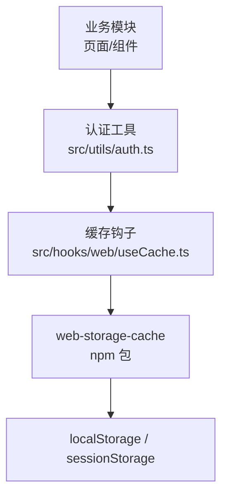
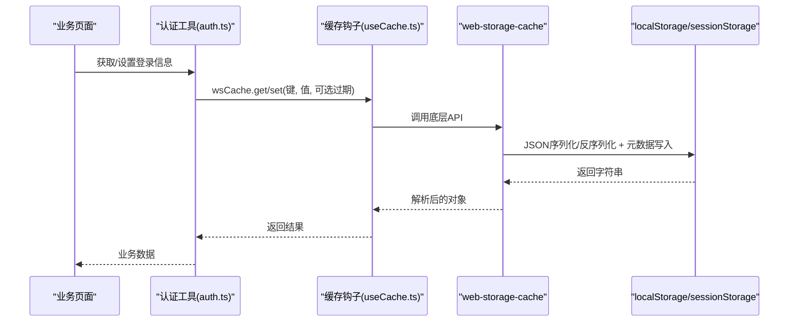
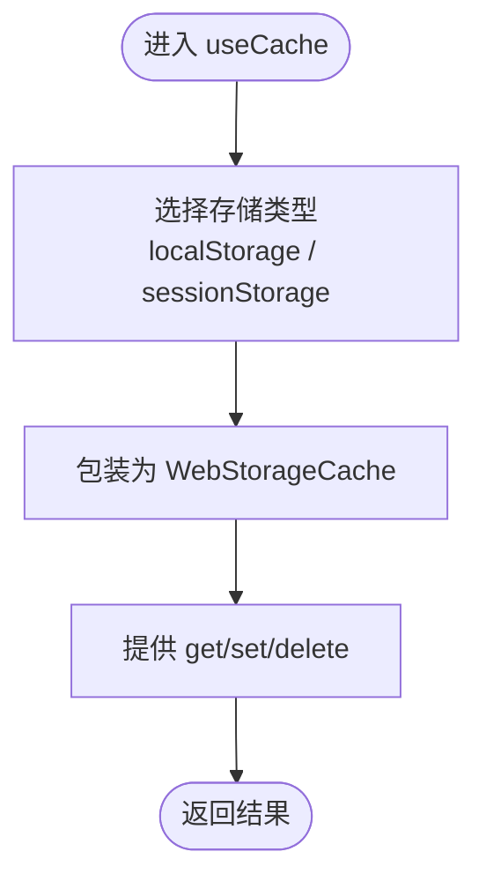
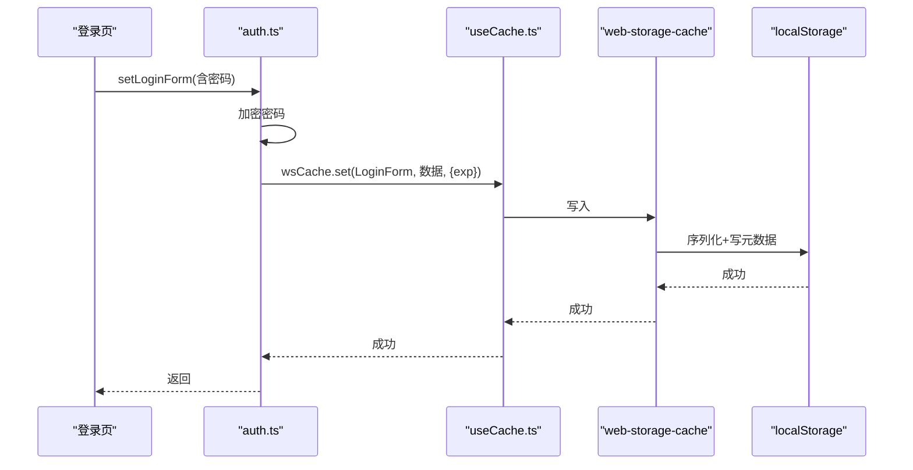
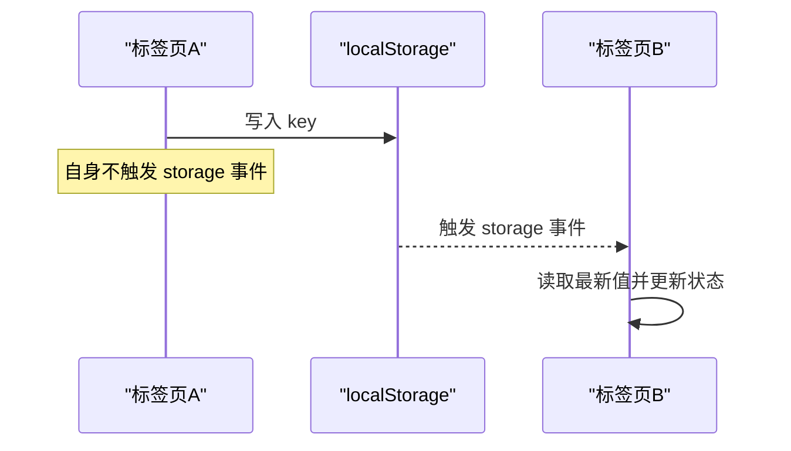
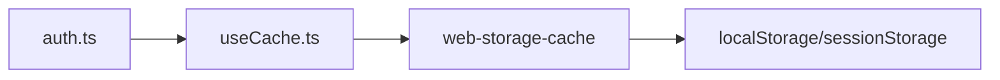

# 本地存储缓存

<cite>
**本文引用的文件**
- [useCache.ts](file://yudao-ui-admin-vue3/src/hooks/web/useCache.ts)
- [auth.ts](file://yudao-ui-admin-vue3/src/utils/auth.ts)
- [package.json](file://yudao-ui-admin-vue3/package.json)
</cite>

## 目录
1. [简介](#简介)
2. [项目结构](#项目结构)
3. [核心组件](#核心组件)
4. [架构总览](#架构总览)
5. [详细组件分析](#详细组件分析)
6. [依赖分析](#依赖分析)
7. [性能考虑](#性能考虑)
8. [故障排查指南](#故障排查指南)
9. [结论](#结论)
10. [附录](#附录)

## 简介
本文件面向前端本地存储缓存，围绕 localStorage 与 sessionStorage 的使用场景、持久化策略、存储空间限制展开，并结合项目在 Vue3 中的实际实现（基于 web-storage-cache）说明序列化机制、键名规范、数据版本管理、跨标签页共享方案、大对象分片与压缩策略，以及异常处理与数据迁移最佳实践。文档同时提供可落地的流程图与时序图，帮助读者快速理解并扩展本地存储能力。

## 项目结构
本项目在前端层通过一个统一的缓存钩子封装浏览器本地存储，对外暴露一致的 get/set/delete API，并在认证模块中集中使用。关键路径如下：
- 缓存抽象与键定义：src/hooks/web/useCache.ts
- 认证与用户相关本地存储读写：src/utils/auth.ts
- 依赖声明（web-storage-cache）：package.json

图表来源
- [useCache.ts:1-42](file://yudao-ui-admin-vue3/src/hooks/web/useCache.ts#L1-L42)
- [auth.ts:1-87](file://yudao-ui-admin-vue3/src/utils/auth.ts#L1-L87)
- [package.json:90](file://yudao-ui-admin-vue3/package.json#L90)

章节来源
- [useCache.ts:1-42](file://yudao-ui-admin-vue3/src/hooks/web/useCache.ts#L1-L42)
- [auth.ts:1-87](file://yudao-ui-admin-vue3/src/utils/auth.ts#L1-L87)
- [package.json:90](file://yudao-ui-admin-vue3/package.json#L90)

## 核心组件
- 缓存钩子 useCache
  - 职责：统一封装 localStorage/sessionStorage 的存取操作，支持直接存储对象数组；提供删除用户相关缓存的方法。
  - 关键点：默认使用 localStorage；可通过参数切换为 sessionStorage；集中维护 CACHE_KEY 常量。
- 认证工具 auth
  - 职责：封装访问令牌、刷新令牌、登录表单、租户信息等敏感或会话级数据的存取；对密码字段进行加解密后再落库。
  - 关键点：所有读写均通过 useCache 提供的 wsCache 完成；登录表单设置过期时间（由底层库支持）。

章节来源
- [useCache.ts:1-42](file://yudao-ui-admin-vue3/src/hooks/web/useCache.ts#L1-L42)
- [auth.ts:1-87](file://yudao-ui-admin-vue3/src/utils/auth.ts#L1-L87)

## 架构总览
下图展示从业务到本地存储的调用链路，包括序列化、加密与过期策略。

图表来源
- [auth.ts:10-68](file://yudao-ui-admin-vue3/src/utils/auth.ts#L10-L68)
- [useCache.ts:25-41](file://yudao-ui-admin-vue3/src/hooks/web/useCache.ts#L25-L41)

## 详细组件分析

### 组件A：缓存钩子 useCache
- 设计要点
  - 通过 new WebStorageCache({ storage }) 选择存储类型，默认 localStorage。
  - 集中定义 CACHE_KEY，便于统一管理键名与命名空间。
  - 提供 deleteUserCache 清理用户相关键，避免残留。
- 数据结构与复杂度
  - 键名集合：O(1) 查找。
  - 存取操作：底层库负责 JSON 序列化/反序列化，时间复杂度 O(n)（n 为对象大小）。
- 错误处理
  - 建议外层捕获 StorageQuotaExceededError、SecurityError 等异常，降级至内存缓存或提示用户。
- 优化建议
  - 对大对象采用分片存储（见“大对象存储策略”）。
  - 对频繁读写的热点键做内存缓存，减少 I/O。

图表来源
- [useCache.ts:5-33](file://yudao-ui-admin-vue3/src/hooks/web/useCache.ts#L5-L33)

章节来源
- [useCache.ts:1-42](file://yudao-ui-admin-vue3/src/hooks/web/useCache.ts#L1-L42)

### 组件B：认证工具 auth
- 设计要点
  - 统一维护 ACCESS_TOKEN、REFRESH_TOKEN、LoginForm、TenantId、VisitTenantId 等键。
  - 登录表单密码在写入前加密、读取后解密，保障安全。
  - 登录表单设置过期时间（例如 30 天），由底层库管理 TTL。
- 数据流
  - 设置令牌：setToken -> wsCache.set
  - 读取令牌：getAccessToken/getRefreshToken -> wsCache.get
  - 清理令牌：removeToken -> wsCache.delete
- 异常处理
  - 建议在调用处捕获存储异常，必要时回退到内存态或引导用户清理缓存。

图表来源
- [auth.ts:53-68](file://yudao-ui-admin-vue3/src/utils/auth.ts#L53-L68)
- [useCache.ts:25-33](file://yudao-ui-admin-vue3/src/hooks/web/useCache.ts#L25-L33)

章节来源
- [auth.ts:1-87](file://yudao-ui-admin-vue3/src/utils/auth.ts#L1-L87)

### 序列化机制与数据版本管理
- 序列化机制
  - 通过 web-storage-cache 自动完成对象的 JSON 序列化与反序列化，支持直接存储对象与数组。
  - 支持过期时间（TTL），用于如登录表单等临时数据。
- 键名规范
  - 使用统一的 CACHE_KEY 常量集中管理键名，避免硬编码导致的冲突与维护成本。
  - 建议命名约定：模块前缀_资源_字段（例如：user_info、tenant_id），当前已按语义分组。
- 数据版本管理
  - 建议在存储值中包含 version 字段，读取时根据版本进行兼容转换。
  - 对于破坏性变更，提供迁移脚本在应用启动时执行，将旧格式数据迁移为新格式。

章节来源
- [useCache.ts:9-23](file://yudao-ui-admin-vue3/src/hooks/web/useCache.ts#L9-L23)
- [auth.ts:53-68](file://yudao-ui-admin-vue3/src/utils/auth.ts#L53-L68)

### 跨标签页共享与同步
- 现状
  - 当前实现未显式监听 storage 事件，跨标签页的数据一致性依赖各自独立读取本地存储。
- 推荐方案
  - 在需要实时同步的模块（如主题、语言、布局）增加 window.addEventListener('storage', ...) 监听器。
  - 当其他标签页修改了 key，触发更新当前标签页状态，保证多标签一致性。
  - 注意：storage 事件不会由触发修改的标签页自身收到，需结合内存状态或自定义事件处理自身变更。

[此图为概念流程，无需代码映射]

### 大对象存储的分片与压缩
- 分片策略
  - 当对象体积接近或超过单键限制（通常约 5MB）时，按固定大小切分为多个片段，分别以 key_index 形式存储。
  - 读取时按顺序拼接还原。
- 压缩方案
  - 对文本型大对象（如 JSON）可在写入前进行压缩（如 zlib/gzip 的浏览器实现），降低体积。
  - 注意压缩带来的 CPU 开销，权衡读写频率与体积。
- 实施建议
  - 在 useCache 上层封装 splitStore/getSplitStore，屏蔽分片细节。
  - 对非热数据优先压缩；热数据保持原样以提升读取速度。

[本节为通用策略，不直接映射具体文件]

### 存储异常处理与数据迁移最佳实践
- 异常处理
  - 捕获 StorageQuotaExceededError：提示用户清理缓存或降级到内存缓存。
  - 捕获 SecurityError：检查是否处于受限环境（如私有模式），给出友好提示。
  - 捕获 JSON.parse 异常：清理损坏键或执行修复逻辑。
- 数据迁移
  - 应用启动时检测存储版本，若低于目标版本则执行迁移任务。
  - 迁移过程幂等，失败可重试；迁移完成后更新版本号。
  - 对敏感数据（如密码）确保迁移前后一致加密。

章节来源
- [auth.ts:53-68](file://yudao-ui-admin-vue3/src/utils/auth.ts#L53-L68)
- [useCache.ts:35-41](file://yudao-ui-admin-vue3/src/hooks/web/useCache.ts#L35-L41)

## 依赖分析
- 外部依赖
  - web-storage-cache：提供 localStorage/sessionStorage 的统一封装，支持对象存取与过期时间。
- 内部依赖
  - auth.ts 依赖 useCache.ts 提供的 wsCache。
  - 多处业务模块通过 auth.ts 间接使用本地存储。

图表来源
- [auth.ts:1-87](file://yudao-ui-admin-vue3/src/utils/auth.ts#L1-L87)
- [useCache.ts:1-42](file://yudao-ui-admin-vue3/src/hooks/web/useCache.ts#L1-L42)
- [package.json:90](file://yudao-ui-admin-vue3/package.json#L90)

章节来源
- [package.json:90](file://yudao-ui-admin-vue3/package.json#L90)
- [auth.ts:1-87](file://yudao-ui-admin-vue3/src/utils/auth.ts#L1-L87)
- [useCache.ts:1-42](file://yudao-ui-admin-vue3/src/hooks/web/useCache.ts#L1-L42)

## 性能考虑
- 读写频率
  - 高频读取的键（如主题、语言）建议配合内存缓存，减少 I/O。
- 序列化成本
  - 大对象序列化/反序列化有 CPU 开销，必要时进行压缩或分片。
- 过期策略
  - 合理设置 TTL，避免长期占用存储空间。
- 容量管理
  - 监控存储空间使用率，达到阈值时主动清理冷数据或提示用户。

[本节为通用指导，不直接映射具体文件]

## 故障排查指南
- 常见问题
  - 存储已满：捕获 StorageQuotaExceededError，清理过期或冷数据。
  - 私有模式下不可用：捕获 SecurityError，提示用户关闭私有模式或改用内存缓存。
  - 数据损坏：捕获 JSON 解析异常，清理对应键并重新初始化。
- 定位步骤
  - 检查键名是否正确（参考 CACHE_KEY）。
  - 确认是否设置了正确的存储类型（localStorage vs sessionStorage）。
  - 查看是否有跨标签页同步需求，必要时添加 storage 事件监听。
- 恢复措施
  - 提供一键清理用户缓存入口（参考 deleteUserCache）。
  - 应用启动时执行数据迁移与校验，修复不一致状态。

章节来源
- [useCache.ts:35-41](file://yudao-ui-admin-vue3/src/hooks/web/useCache.ts#L35-L41)
- [auth.ts:28-32](file://yudao-ui-admin-vue3/src/utils/auth.ts#L28-L32)

## 结论
本项目通过 useCache 统一封装本地存储，auth 模块集中管理认证相关数据，形成清晰的前端缓存分层。结合键名规范、序列化机制、过期策略与异常处理，能够满足大多数业务场景。针对跨标签页同步与大对象存储，可按本文建议扩展 storage 事件监听与分片压缩能力，进一步提升一致性与性能。

## 附录
- 键名清单（来自 CACHE_KEY）
  - 用户相关：roleRouters、user、visitTenantId
  - 系统设置：isDark、lang、theme、layout、dictCache
  - 登录表单：loginForm、tenantId
- 建议新增键名规范
  - 模块前缀_资源_字段，如：app_theme、sys_lang、user_profile
- 建议的版本字段
  - 在存储值中加入 version 字段，便于迁移与兼容处理

章节来源
- [useCache.ts:9-23](file://yudao-ui-admin-vue3/src/hooks/web/useCache.ts#L9-L23)