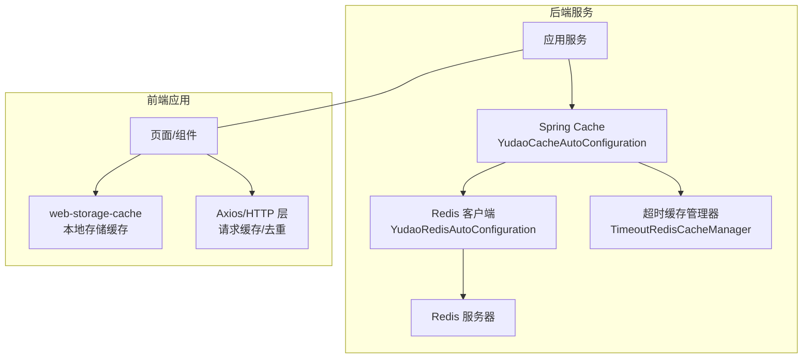
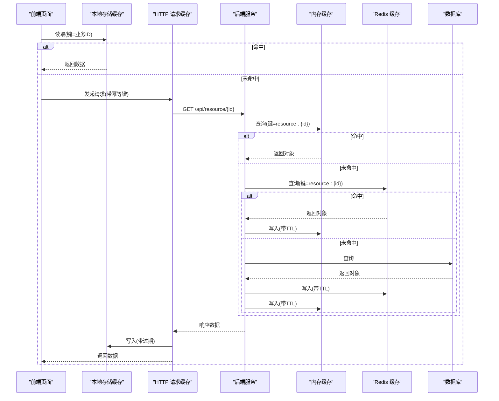
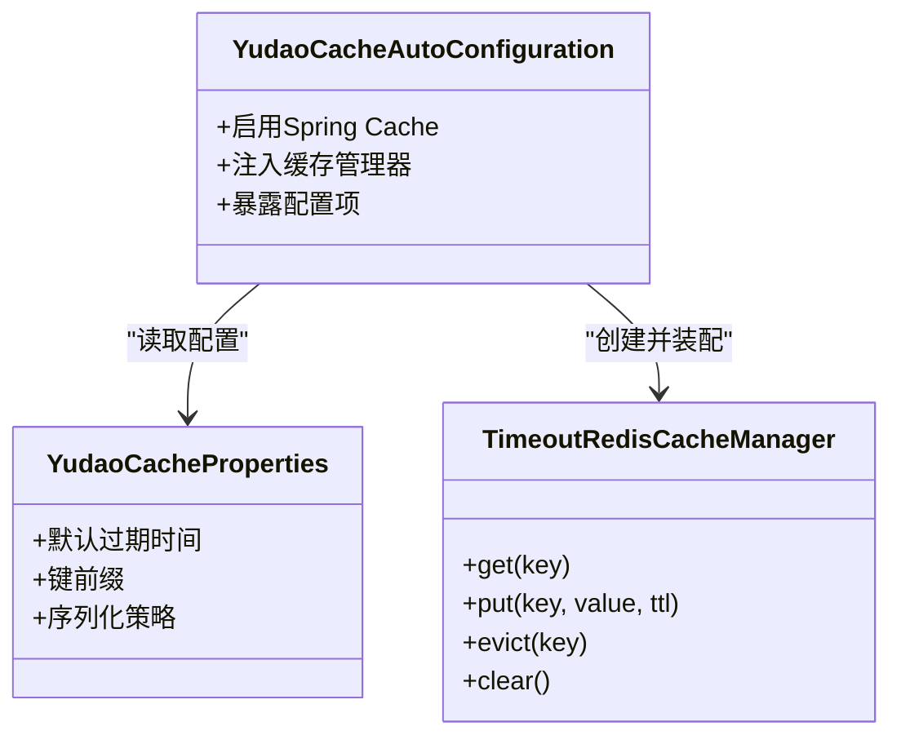
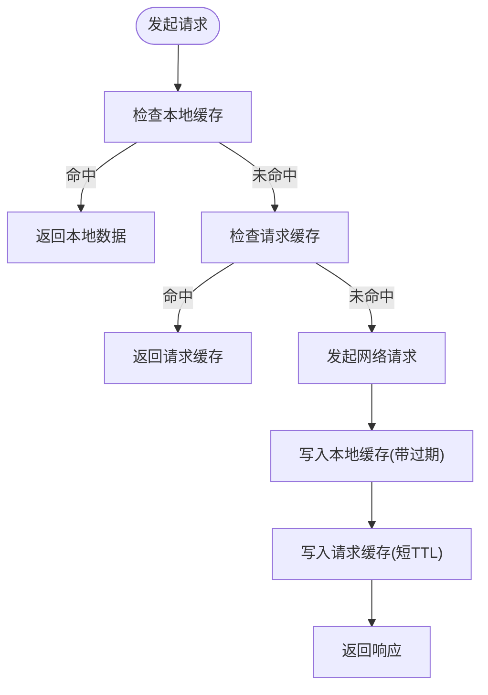
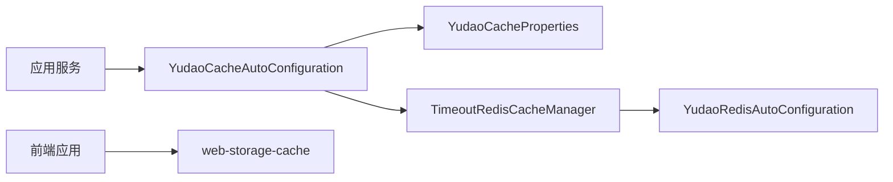

# 缓存策略实现

<cite>
**本文引用的文件**
- [yudao-spring-boot-starter-redis/配置类](file://yudao-cloud/yudao-framework/yudao-spring-boot-starter-redis/src/main/java/cn/iocoder/yudao/framework/redis/config/YudaoCacheAutoConfiguration.java)
- [yudao-spring-boot-starter-redis/属性类](file://yudao-cloud/yudao-framework/yudao-spring-boot-starter-redis/src/main/java/cn/iocoder/yudao/framework/redis/config/YudaoCacheProperties.java)
- [yudao-spring-boot-starter-redis/Redis自动装配](file://yudao-cloud/yudao-framework/yudao-spring-boot-starter-redis/src/main/java/cn/iocoder/yudao/framework/redis/config/YudaoRedisAutoConfiguration.java)
- [yudao-spring-boot-starter-redis/超时缓存管理器](file://yudao-cloud/yudao-framework/yudao-spring-boot-starter-redis/src/main/java/cn/iocoder/yudao/framework/redis/core/TimeoutRedisCacheManager.java)
- [前端依赖包说明](file://yudao-ui-admin-vue3/package.json)
</cite>

## 目录
1. [简介](#简介)
2. [项目结构](#项目结构)
3. [核心组件](#核心组件)
4. [架构总览](#架构总览)
5. [详细组件分析](#详细组件分析)
6. [依赖关系分析](#依赖关系分析)
7. [性能考量](#性能考量)
8. [故障排查指南](#故障排查指南)
9. [结论](#结论)
10. [附录](#附录)

## 简介
本文件围绕多级缓存架构与落地实践，系统阐述内存缓存、本地存储缓存与服务器端缓存的层次设计；覆盖缓存失效（时间过期、条件刷新、手动清理）、预加载与懒加载、冲突解决、大列表分页缓存、图片资源缓存与接口响应缓存的最佳实践；并提供监控统计、调试工具使用建议以及性能优化与内存管理要点。文档基于仓库中后端 Redis Starter 与前端依赖进行说明，确保内容与实际代码结构一致。

## 项目结构
本项目在后端通过 Spring Boot Starter 提供统一的缓存能力，核心位于 yudao-spring-boot-starter-redis 模块，包含自动装配、属性配置与带超时的缓存管理器；在前端通过 package.json 引入 web-storage-cache 等库，用于浏览器端的本地存储缓存与请求级缓存。

图表来源
- [yudao-spring-boot-starter-redis/配置类](file://yudao-cloud/yudao-framework/yudao-spring-boot-starter-redis/src/main/java/cn/iocoder/yudao/framework/redis/config/YudaoCacheAutoConfiguration.java)
- [yudao-spring-boot-starter-redis/Redis自动装配](file://yudao-cloud/yudao-framework/yudao-spring-boot-starter-redis/src/main/java/cn/iocoder/yudao/framework/redis/config/YudaoRedisAutoConfiguration.java)
- [yudao-spring-boot-starter-redis/超时缓存管理器](file://yudao-cloud/yudao-framework/yudao-spring-boot-starter-redis/src/main/java/cn/iocoder/yudao/framework/redis/core/TimeoutRedisCacheManager.java)
- [前端依赖包说明](file://yudao-ui-admin-vue3/package.json)

章节来源
- [yudao-spring-boot-starter-redis/配置类](file://yudao-cloud/yudao-framework/yudao-spring-boot-starter-redis/src/main/java/cn/iocoder/yudao/framework/redis/config/YudaoCacheAutoConfiguration.java)
- [yudao-spring-boot-starter-redis/属性类](file://yudao-cloud/yudao-framework/yudao-spring-boot-starter-redis/src/main/java/cn/iocoder/yudao/framework/redis/config/YudaoCacheProperties.java)
- [yudao-spring-boot-starter-redis/Redis自动装配](file://yudao-cloud/yudao-framework/yudao-spring-boot-starter-redis/src/main/java/cn/iocoder/yudao/framework/redis/config/YudaoRedisAutoConfiguration.java)
- [yudao-spring-boot-starter-redis/超时缓存管理器](file://yudao-cloud/yudao-framework/yudao-spring-boot-starter-redis/src/main/java/cn/iocoder/yudao/framework/redis/core/TimeoutRedisCacheManager.java)
- [前端依赖包说明](file://yudao-ui-admin-vue3/package.json)

## 核心组件
- 自动装配与属性：统一启用 Spring Cache，暴露可配置的缓存键前缀、默认过期策略等参数，便于多环境差异化配置。
- 超时缓存管理器：在标准缓存之上增加 TTL 控制，支持按 key 或默认策略设置过期时间，避免热点数据长期驻留。
- 前端本地缓存：通过 web-storage-cache 对 localStorage/sessionStorage 进行封装，提供键值存取、过期与批量清理能力。
- HTTP 层缓存：结合 axios 拦截器实现请求去重、结果缓存与按需刷新，减少重复网络请求。

章节来源
- [yudao-spring-boot-starter-redis/配置类](file://yudao-cloud/yudao-framework/yudao-spring-boot-starter-redis/src/main/java/cn/iocoder/yudao/framework/redis/config/YudaoCacheAutoConfiguration.java)
- [yudao-spring-boot-starter-redis/属性类](file://yudao-cloud/yudao-framework/yudao-spring-boot-starter-redis/src/main/java/cn/iocoder/yudao/framework/redis/config/YudaoCacheProperties.java)
- [yudao-spring-boot-starter-redis/超时缓存管理器](file://yudao-cloud/yudao-framework/yudao-spring-boot-starter-redis/src/main/java/cn/iocoder/yudao/framework/redis/core/TimeoutRedisCacheManager.java)
- [前端依赖包说明](file://yudao-ui-admin-vue3/package.json)

## 架构总览
下图展示从前端到后端的完整多级缓存链路：前端优先命中本地缓存与请求缓存，未命中则发起网络请求；后端优先命中内存缓存（JVM 内）与 Redis 缓存，最终回源数据库。写操作会触发必要的失效与广播更新，保证一致性。

图表来源
- [yudao-spring-boot-starter-redis/超时缓存管理器](file://yudao-cloud/yudao-framework/yudao-spring-boot-starter-redis/src/main/java/cn/iocoder/yudao/framework/redis/core/TimeoutRedisCacheManager.java)
- [yudao-spring-boot-starter-redis/配置类](file://yudao-cloud/yudao-framework/yudao-spring-boot-starter-redis/src/main/java/cn/iocoder/yudao/framework/redis/config/YudaoCacheAutoConfiguration.java)
- [前端依赖包说明](file://yudao-ui-admin-vue3/package.json)

## 详细组件分析

### 后端缓存组件
- 自动装配与属性
  - 作用：启用 Spring Cache，注入 Redis 连接与缓存管理器，暴露可配置项（如默认过期时间、键前缀、序列化策略）。
  - 关键点：通过属性类集中管理配置，便于不同环境切换；自动装配确保无需额外 XML/注解即可生效。
- 超时缓存管理器
  - 作用：在标准缓存之上提供 TTL 控制，支持按 key 或默认策略设置过期时间，避免热数据长期占用内存。
  - 关键点：读写路径均考虑过期判断；写路径支持批量设置过期；读路径支持按需刷新与降级。

图表来源
- [yudao-spring-boot-starter-redis/配置类](file://yudao-cloud/yudao-framework/yudao-spring-boot-starter-redis/src/main/java/cn/iocoder/yudao/framework/redis/config/YudaoCacheAutoConfiguration.java)
- [yudao-spring-boot-starter-redis/属性类](file://yudao-cloud/yudao-framework/yudao-spring-boot-starter-redis/src/main/java/cn/iocoder/yudao/framework/redis/config/YudaoCacheProperties.java)
- [yudao-spring-boot-starter-redis/超时缓存管理器](file://yudao-cloud/yudao-framework/yudao-spring-boot-starter-redis/src/main/java/cn/iocoder/yudao/framework/redis/core/TimeoutRedisCacheManager.java)

章节来源
- [yudao-spring-boot-starter-redis/配置类](file://yudao-cloud/yudao-framework/yudao-spring-boot-starter-redis/src/main/java/cn/iocoder/yudao/framework/redis/config/YudaoCacheAutoConfiguration.java)
- [yudao-spring-boot-starter-redis/属性类](file://yudao-cloud/yudao-framework/yudao-spring-boot-starter-redis/src/main/java/cn/iocoder/yudao/framework/redis/config/YudaoCacheProperties.java)
- [yudao-spring-boot-starter-redis/超时缓存管理器](file://yudao-cloud/yudao-framework/yudao-spring-boot-starter-redis/src/main/java/cn/iocoder/yudao/framework/redis/core/TimeoutRedisCacheManager.java)

### 前端本地缓存与请求缓存
- 本地存储缓存
  - 作用：基于 web-storage-cache 封装 localStorage/sessionStorage，提供键值存取、过期时间与批量清理能力。
  - 关键点：为静态资源与字典数据设置合理过期；敏感数据避免持久化。
- 请求缓存
  - 作用：在 Axios 拦截器中实现请求去重、结果缓存与按需刷新，降低重复请求与抖动。
  - 关键点：以 URL+参数作为缓存键；写操作后主动失效相关缓存；支持强制刷新开关。

图表来源
- [前端依赖包说明](file://yudao-ui-admin-vue3/package.json)

章节来源
- [前端依赖包说明](file://yudao-ui-admin-vue3/package.json)

### 缓存失效策略
- 时间过期
  - 后端：通过超时缓存管理器为每个 key 设置 TTL，到期自动失效。
  - 前端：本地缓存与请求缓存均设置过期时间，避免脏数据长期存在。
- 条件刷新
  - 后端：在热点数据变更时，按业务维度批量失效或延迟刷新，降低雪崩风险。
  - 前端：写操作后主动失效相关缓存键；支持“强制刷新”跳过缓存直接拉取最新数据。
- 手动清理
  - 后端：提供 clear/evict 接口，用于运维场景下的定向清理。
  - 前端：提供批量清理方法，用于版本升级或配置变更后的缓存重置。

章节来源
- [yudao-spring-boot-starter-redis/超时缓存管理器](file://yudao-cloud/yudao-framework/yudao-spring-boot-starter-redis/src/main/java/cn/iocoder/yudao/framework/redis/core/TimeoutRedisCacheManager.java)
- [yudao-spring-boot-starter-redis/配置类](file://yudao-cloud/yudao-framework/yudao-spring-boot-starter-redis/src/main/java/cn/iocoder/yudao/framework/redis/config/YudaoCacheAutoConfiguration.java)
- [前端依赖包说明](file://yudao-ui-admin-vue3/package.json)

### 预加载与懒加载
- 预加载
  - 后端：对高频访问的基础数据（字典、枚举、配置）启动预热任务，提前填充缓存。
  - 前端：首屏关键数据在路由进入前异步预取并存入本地缓存，提升首屏体验。
- 懒加载
  - 后端：对非热点数据采用按需加载，首次访问时回填缓存，避免无谓占用。
  - 前端：长列表与图片采用滚动可视区域懒加载，结合本地缓存减少重复请求。

章节来源
- [yudao-spring-boot-starter-redis/超时缓存管理器](file://yudao-cloud/yudao-framework/yudao-spring-boot-starter-redis/src/main/java/cn/iocoder/yudao/framework/redis/core/TimeoutRedisCacheManager.java)
- [前端依赖包说明](file://yudao-ui-admin-vue3/package.json)

### 缓存冲突解决策略
- 键空间隔离
  - 后端：通过键前缀区分模块/租户/环境，避免键冲突。
  - 前端：按功能域划分本地缓存命名空间，避免相互污染。
- 并发写保护
  - 后端：对热点键加分布式锁或版本号，防止并发写导致不一致。
  - 前端：对同一资源的并发请求合并，仅保留一次真实请求。
- 一致性保障
  - 后端：写操作后主动失效关联缓存；必要时采用发布订阅机制通知多实例同步。
  - 前端：写操作后主动失效相关缓存键，并在 UI 层提示刷新。

章节来源
- [yudao-spring-boot-starter-redis/配置类](file://yudao-cloud/yudao-framework/yudao-spring-boot-starter-redis/src/main/java/cn/iocoder/yudao/framework/redis/config/YudaoCacheAutoConfiguration.java)
- [yudao-spring-boot-starter-redis/超时缓存管理器](file://yudao-cloud/yudao-framework/yudao-spring-boot-starter-redis/src/main/java/cn/iocoder/yudao/framework/redis/core/TimeoutRedisCacheManager.java)
- [前端依赖包说明](file://yudao-ui-admin-vue3/package.json)

### 大列表分页缓存最佳实践
- 后端
  - 将分页结果以“查询条件+页码+每页大小”为键进行缓存，设置较短 TTL。
  - 写操作后按查询维度批量失效，或使用版本号+条件校验的方式减少误删。
- 前端
  - 对已加载的分页数据进行本地缓存，翻页时优先命中；支持增量加载与去重。
  - 搜索/筛选变更后清空相关分页缓存，避免脏数据。

章节来源
- [yudao-spring-boot-starter-redis/超时缓存管理器](file://yudao-cloud/yudao-framework/yudao-spring-boot-starter-redis/src/main/java/cn/iocoder/yudao/framework/redis/core/TimeoutRedisCacheManager.java)
- [前端依赖包说明](file://yudao-ui-admin-vue3/package.json)

### 图片资源缓存最佳实践
- 后端
  - 静态图片走 CDN/对象存储；动态图片根据内容哈希生成稳定 URL，配合强缓存头。
  - 缩略图与主图分别缓存，避免重复计算。
- 前端
  - 使用本地缓存记录已下载图片的 URL→二进制映射，避免重复下载。
  - 大图懒加载，结合占位图与渐进式渲染提升体验。

章节来源
- [前端依赖包说明](file://yudao-ui-admin-vue3/package.json)

### 接口响应缓存最佳实践
- 后端
  - 对幂等 GET 接口启用缓存，键包含必要查询参数；写接口后失效相关缓存。
  - 针对高并发热点接口，结合内存缓存与 Redis 两级缓存，降低数据库压力。
- 前端
  - 对只读接口启用短期请求缓存，支持强制刷新；对写接口禁用缓存并失效相关键。

章节来源
- [yudao-spring-boot-starter-redis/超时缓存管理器](file://yudao-cloud/yudao-framework/yudao-spring-boot-starter-redis/src/main/java/cn/iocoder/yudao/framework/redis/core/TimeoutRedisCacheManager.java)
- [前端依赖包说明](file://yudao-ui-admin-vue3/package.json)

## 依赖关系分析
后端通过 Spring Boot Starter 将缓存能力解耦为可插拔组件，前端通过依赖声明引入本地缓存库，形成前后端协同的多级缓存体系。

图表来源
- [yudao-spring-boot-starter-redis/配置类](file://yudao-cloud/yudao-framework/yudao-spring-boot-starter-redis/src/main/java/cn/iocoder/yudao/framework/redis/config/YudaoCacheAutoConfiguration.java)
- [yudao-spring-boot-starter-redis/属性类](file://yudao-cloud/yudao-framework/yudao-spring-boot-starter-redis/src/main/java/cn/iocoder/yudao/framework/redis/config/YudaoCacheProperties.java)
- [yudao-spring-boot-starter-redis/Redis自动装配](file://yudao-cloud/yudao-framework/yudao-spring-boot-starter-redis/src/main/java/cn/iocoder/yudao/framework/redis/config/YudaoRedisAutoConfiguration.java)
- [yudao-spring-boot-starter-redis/超时缓存管理器](file://yudao-cloud/yudao-framework/yudao-spring-boot-starter-redis/src/main/java/cn/iocoder/yudao/framework/redis/core/TimeoutRedisCacheManager.java)
- [前端依赖包说明](file://yudao-ui-admin-vue3/package.json)

章节来源
- [yudao-spring-boot-starter-redis/配置类](file://yudao-cloud/yudao-framework/yudao-spring-boot-starter-redis/src/main/java/cn/iocoder/yudao/framework/redis/config/YudaoCacheAutoConfiguration.java)
- [yudao-spring-boot-starter-redis/属性类](file://yudao-cloud/yudao-framework/yudao-spring-boot-starter-redis/src/main/java/cn/iocoder/yudao/framework/redis/config/YudaoCacheProperties.java)
- [yudao-spring-boot-starter-redis/Redis自动装配](file://yudao-cloud/yudao-framework/yudao-spring-boot-starter-redis/src/main/java/cn/iocoder/yudao/framework/redis/config/YudaoRedisAutoConfiguration.java)
- [yudao-spring-boot-starter-redis/超时缓存管理器](file://yudao-cloud/yudao-framework/yudao-spring-boot-starter-redis/src/main/java/cn/iocoder/yudao/framework/redis/core/TimeoutRedisCacheManager.java)
- [前端依赖包说明](file://yudao-ui-admin-vue3/package.json)

## 性能考量
- 缓存命中率与容量规划
  - 后端：合理设置 JVM 内存缓存与 Redis 容量，关注热点键分布，避免大对象频繁序列化。
  - 前端：限制本地缓存条目数量与体积，定期清理过期与冷数据。
- 过期与刷新策略
  - 后端：热点数据采用短 TTL+后台异步刷新，避免缓存击穿；冷门数据长 TTL。
  - 前端：请求缓存 TTL 更短，避免长时间脏数据；写操作后立即失效。
- 序列化与压缩
  - 后端：选择高效序列化方案，必要时对大对象进行压缩存储。
  - 前端：对 JSON 数据压缩存储，图片使用 WebP/AVIF 格式。
- 并发与锁
  - 后端：热点写操作加分布式锁或版本号，避免并发写导致不一致。
  - 前端：并发请求合并，减少重复网络开销。

[本节为通用性能建议，不直接分析具体文件]

## 故障排查指南
- 常见问题
  - 缓存穿透：空结果也缓存短 TTL，或采用布隆过滤器。
  - 缓存雪崩：随机化 TTL、限流与降级。
  - 缓存击穿：热点键加互斥锁或逻辑过期。
  - 数据不一致：写后失效、版本号校验、发布订阅同步。
- 定位手段
  - 后端：开启缓存命中/未命中日志，观察命中率与 QPS；使用 Redis 命令查看 key 分布与过期情况。
  - 前端：打开网络面板与本地存储面板，检查缓存键、过期时间与请求去重效果。
- 修复建议
  - 调整 TTL 与容量；优化键设计；增加重试与降级；完善写后失效策略。

[本节为通用故障排查建议，不直接分析具体文件]

## 结论
通过后端 Redis Starter 与前端本地缓存库的配合，本项目实现了清晰的多级缓存架构：前端本地缓存与请求缓存快速响应，后端内存缓存与 Redis 缓存共同承担高并发读放大问题。结合时间过期、条件刷新与手动清理的失效策略，以及预加载与懒加载的加载策略，能够在保证一致性的前提下显著提升性能与用户体验。后续可根据业务规模持续优化键设计、TTL 策略与监控指标。

[本节为总结性内容，不直接分析具体文件]

## 附录
- 配置项参考
  - 后端：通过属性类集中管理缓存键前缀、默认过期时间、序列化策略等。
  - 前端：通过依赖库 API 配置本地缓存的过期时间与清理策略。
- 监控与统计
  - 后端：统计缓存命中率、QPS、平均延迟；记录异常与降级事件。
  - 前端：统计本地缓存命中率、请求去重率、网络请求次数与耗时。
- 调试技巧
  - 后端：临时关闭缓存验证逻辑；打印缓存键与 TTL；使用 Redis 客户端观察数据。
  - 前端：在开发模式开启缓存日志；使用浏览器开发者工具检查本地存储与网络请求。

[本节为补充信息，不直接分析具体文件]