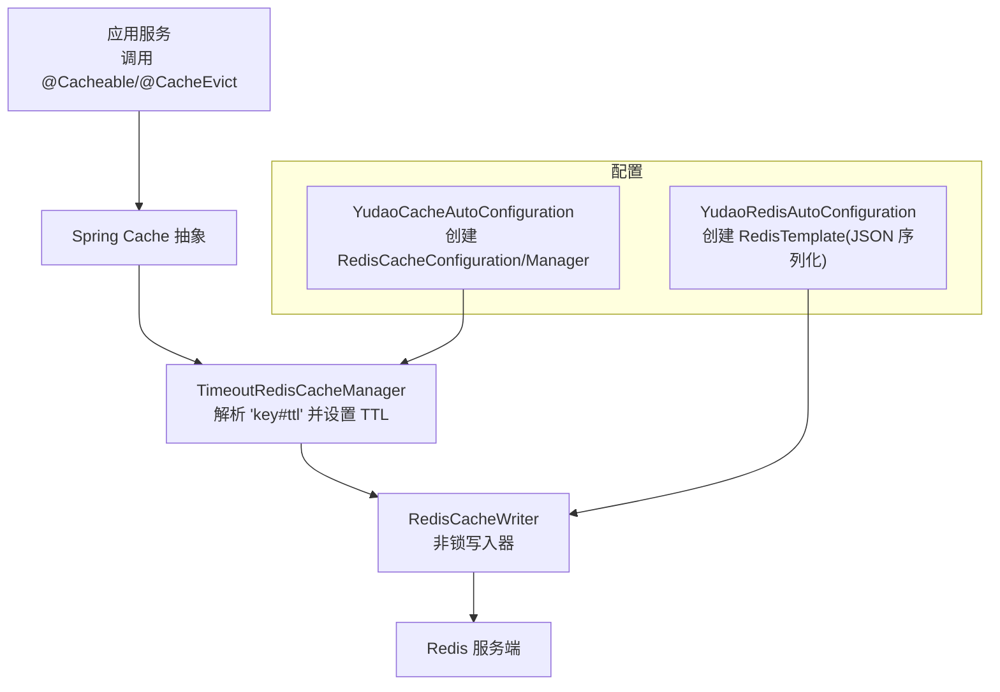
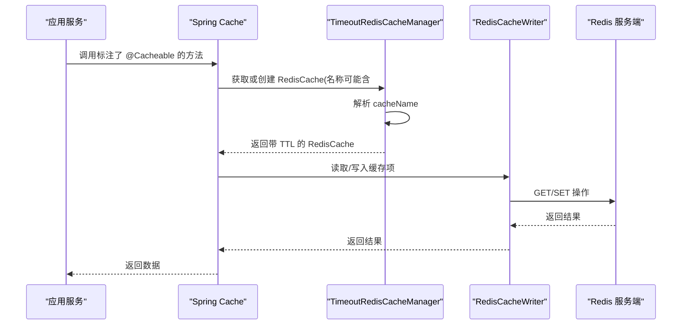
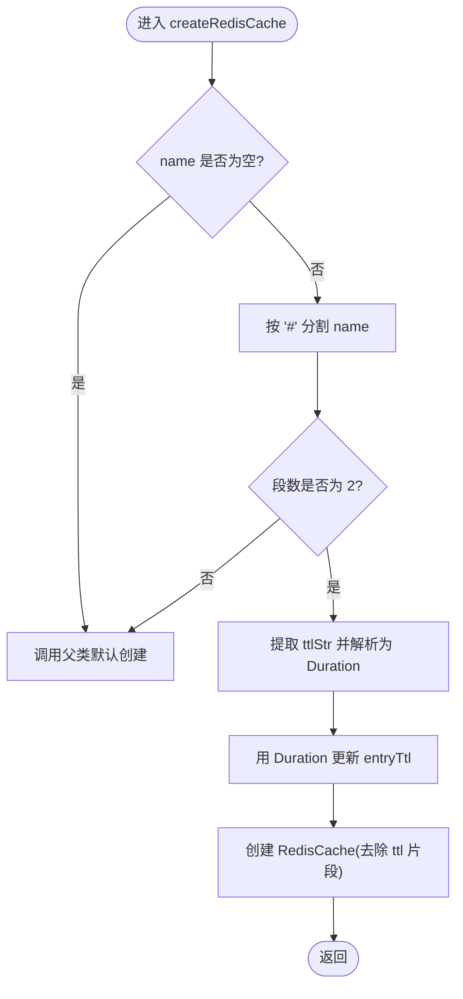
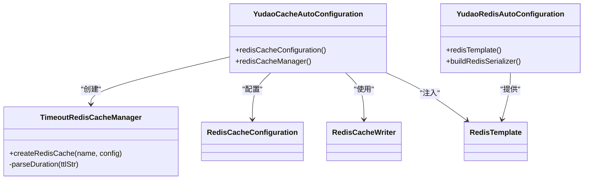

# 缓存策略设计

<cite>
**本文引用的文件**
- [YudaoCacheAutoConfiguration.java](file://yudao-cloud/yudao-framework/yudao-spring-boot-starter-redis/src/main/java/cn/iocoder/yudao/framework/redis/config/YudaoCacheAutoConfiguration.java)
- [YudaoRedisAutoConfiguration.java](file://yudao-cloud/yudao-framework/yudao-spring-boot-starter-redis/src/main/java/cn/iocoder/yudao/framework/redis/config/YudaoRedisAutoConfiguration.java)
- [TimeoutRedisCacheManager.java](file://yudao-cloud/yudao-framework/yudao-spring-boot-starter-redis/src/main/java/cn/iocoder/yudao/framework/redis/core/TimeoutRedisCacheManager.java)
</cite>

## 目录
1. [简介](#简介)
2. [项目结构](#项目结构)
3. [核心组件](#核心组件)
4. [架构总览](#架构总览)
5. [详细组件分析](#详细组件分析)
6. [依赖关系分析](#依赖关系分析)
7. [性能考量](#性能考量)
8. [故障排查指南](#故障排查指南)
9. [结论](#结论)
10. [附录](#附录)

## 简介
本文件围绕多级缓存架构与策略进行系统化说明，覆盖内存缓存、本地存储缓存与服务器缓存的层次划分与职责；阐述缓存失效策略（TTL、条件刷新、手动清理、被动删除）；给出预加载与懒加载的实现思路；解释缓存冲突解决策略（版本号控制、时间戳比较、一致性哈希）；并结合不同业务场景提供策略选择与优化建议。文档基于仓库中 Redis 缓存自动装配与自定义过期时间的实现进行分析与扩展。

## 项目结构
本项目在 yudao-framework 下提供了 Redis 缓存能力：
- 自动装配层：通过 Spring Boot 自动配置启用缓存与 Redis 连接、序列化等基础能力
- 管理器层：自定义 RedisCacheManager，支持按缓存名动态设置 TTL
- 数据访问层：通过 RedisTemplate 统一读写 Redis，使用 JSON 序列化并兼容 Java 时间类型

图表来源
- [YudaoCacheAutoConfiguration.java:27-83](file://yudao-cloud/yudao-framework/yudao-spring-boot-starter-redis/src/main/java/cn/iocoder/yudao/framework/redis/config/YudaoCacheAutoConfiguration.java#L27-L83)
- [YudaoRedisAutoConfiguration.java:16-44](file://yudao-cloud/yudao-framework/yudao-spring-boot-starter-redis/src/main/java/cn/iocoder/yudao/framework/redis/config/YudaoRedisAutoConfiguration.java#L16-L44)
- [TimeoutRedisCacheManager.java:21-52](file://yudao-cloud/yudao-framework/yudao-spring-boot-starter-redis/src/main/java/cn/iocoder/yudao/framework/redis/core/TimeoutRedisCacheManager.java#L21-L52)

章节来源
- [YudaoCacheAutoConfiguration.java:27-83](file://yudao-cloud/yudao-framework/yudao-spring-boot-starter-redis/src/main/java/cn/iocoder/yudao/framework/redis/config/YudaoCacheAutoConfiguration.java#L27-L83)
- [YudaoRedisAutoConfiguration.java:16-44](file://yudao-cloud/yudao-framework/yudao-spring-boot-starter-redis/src/main/java/cn/iocoder/yudao/framework/redis/config/YudaoRedisAutoConfiguration.java#L16-L44)
- [TimeoutRedisCacheManager.java:21-52](file://yudao-cloud/yudao-framework/yudao-spring-boot-starter-redis/src/main/java/cn/iocoder/yudao/framework/redis/core/TimeoutRedisCacheManager.java#L21-L52)

## 核心组件
- 自动装配与配置
  - 启用缓存注解与属性绑定，构建 RedisCacheConfiguration，设置键前缀、JSON 序列化、默认 TTL、是否缓存空值、是否使用 Key 前缀等
  - 创建 RedisCacheManager 并开启事务感知，使 @CacheEvict/@CachePut 在事务提交后延迟生效，避免并发写穿导致脏读
- 自定义过期时间管理
  - 支持以 “cacheName#ttl” 形式为单个缓存维度设置过期时间，单位支持 d/h/m/s，默认秒
- Redis 模板与序列化
  - 统一使用 String 序列化 Key，JSON 序列化 Value，注册 JavaTimeModule 以正确处理时间类型

章节来源
- [YudaoCacheAutoConfiguration.java:37-83](file://yudao-cloud/yudao-framework/yudao-spring-boot-starter-redis/src/main/java/cn/iocoder/yudao/framework/redis/config/YudaoCacheAutoConfiguration.java#L37-L83)
- [TimeoutRedisCacheManager.java:29-52](file://yudao-cloud/yudao-framework/yudao-spring-boot-starter-redis/src/main/java/cn/iocoder/yudao/framework/redis/core/TimeoutRedisCacheManager.java#L29-L52)
- [YudaoRedisAutoConfiguration.java:22-44](file://yudao-cloud/yudao-framework/yudao-spring-boot-starter-redis/src/main/java/cn/iocoder/yudao/framework/redis/config/YudaoRedisAutoConfiguration.java#L22-L44)

## 架构总览
下图展示从应用调用到 Redis 的完整链路，以及自定义 TTL 解析过程。

图表来源
- [YudaoCacheAutoConfiguration.java:70-83](file://yudao-cloud/yudao-framework/yudao-spring-boot-starter-redis/src/main/java/cn/iocoder/yudao/framework/redis/config/YudaoCacheAutoConfiguration.java#L70-L83)
- [TimeoutRedisCacheManager.java:29-52](file://yudao-cloud/yudao-framework/yudao-spring-boot-starter-redis/src/main/java/cn/iocoder/yudao/framework/redis/core/TimeoutRedisCacheManager.java#L29-L52)

## 详细组件分析

### 组件A：超时感知缓存管理器（TimeoutRedisCacheManager）
- 功能要点
  - 重写 createRedisCache，当缓存名为 “key#ttl” 时，解析 ttl 字符串并转换为 Duration，覆盖默认配置中的 entryTtl
  - 支持单位 d/h/m/s，未指定单位时按秒处理
  - 将解析后的 TTL 应用到 RedisCacheConfiguration，再创建具体缓存实例
- 复杂度与影响
  - 解析逻辑为常量级开销，对热点路径影响可忽略
  - 通过 per-cache TTL 提升灵活性，便于不同数据采用差异化过期策略

图表来源
- [TimeoutRedisCacheManager.java:29-52](file://yudao-cloud/yudao-framework/yudao-spring-boot-starter-redis/src/main/java/cn/iocoder/yudao/framework/redis/core/TimeoutRedisCacheManager.java#L29-L52)
- [TimeoutRedisCacheManager.java:60-84](file://yudao-cloud/yudao-framework/yudao-spring-boot-starter-redis/src/main/java/cn/iocoder/yudao/framework/redis/core/TimeoutRedisCacheManager.java#L60-L84)

章节来源
- [TimeoutRedisCacheManager.java:21-84](file://yudao-cloud/yudao-framework/yudao-spring-boot-starter-redis/src/main/java/cn/iocoder/yudao/framework/redis/core/TimeoutRedisCacheManager.java#L21-L84)

### 组件B：缓存自动装配（YudaoCacheAutoConfiguration）
- 功能要点
  - 启用 @EnableCaching，绑定 CacheProperties 与自定义属性
  - 构建 RedisCacheConfiguration：设置键前缀、JSON 序列化、默认 TTL、是否缓存空值、是否禁用 Key 前缀
  - 创建 RedisCacheManager：基于非锁写入器与批量扫描大小，开启事务感知
- 设计权衡
  - 非锁写入器提升吞吐但需业务侧保证幂等与一致性
  - 事务感知避免“先清缓存后事务回滚”导致的脏读

章节来源
- [YudaoCacheAutoConfiguration.java:27-83](file://yudao-cloud/yudao-framework/yudao-spring-boot-starter-redis/src/main/java/cn/iocoder/yudao/framework/redis/config/YudaoCacheAutoConfiguration.java#L27-L83)

### 组件C：Redis 模板与序列化（YudaoRedisAutoConfiguration）
- 功能要点
  - 创建 RedisTemplate：Key 使用 String 序列化，Value 使用 JSON 序列化
  - 注册 JavaTimeModule，确保 LocalDateTime 等时间类型正确序列化/反序列化
- 设计权衡
  - JSON 可读性好、跨语言友好，但体积略大于二进制序列化；结合压缩与合理 TTL 可平衡空间与性能

章节来源
- [YudaoRedisAutoConfiguration.java:16-44](file://yudao-cloud/yudao-framework/yudao-spring-boot-starter-redis/src/main/java/cn/iocoder/yudao/framework/redis/config/YudaoRedisAutoConfiguration.java#L16-L44)

## 依赖关系分析
- 组件耦合
  - TimeoutRedisCacheManager 依赖 RedisCacheWriter 与 RedisCacheConfiguration
  - YudaoCacheAutoConfiguration 负责装配上述两者，并注入 RedisTemplate
  - YudaoRedisAutoConfiguration 提供 RedisTemplate 及序列化策略
- 外部依赖
  - Spring Cache 抽象、Spring Data Redis、Jackson 时间模块

图表来源
- [YudaoCacheAutoConfiguration.java:37-83](file://yudao-cloud/yudao-framework/yudao-spring-boot-starter-redis/src/main/java/cn/iocoder/yudao/framework/redis/config/YudaoCacheAutoConfiguration.java#L37-L83)
- [TimeoutRedisCacheManager.java:21-52](file://yudao-cloud/yudao-framework/yudao-spring-boot-starter-redis/src/main/java/cn/iocoder/yudao/framework/redis/core/TimeoutRedisCacheManager.java#L21-L52)
- [YudaoRedisAutoConfiguration.java:22-44](file://yudao-cloud/yudao-framework/yudao-spring-boot-starter-redis/src/main/java/cn/iocoder/yudao/framework/redis/config/YudaoRedisAutoConfiguration.java#L22-L44)

章节来源
- [YudaoCacheAutoConfiguration.java:37-83](file://yudao-cloud/yudao-framework/yudao-spring-boot-starter-redis/src/main/java/cn/iocoder/yudao/framework/redis/config/YudaoCacheAutoConfiguration.java#L37-L83)
- [TimeoutRedisCacheManager.java:21-52](file://yudao-cloud/yudao-framework/yudao-spring-boot-starter-redis/src/main/java/cn/iocoder/yudao/framework/redis/core/TimeoutRedisCacheManager.java#L21-L52)
- [YudaoRedisAutoConfiguration.java:22-44](file://yudao-cloud/yudao-framework/yudao-spring-boot-starter-redis/src/main/java/cn/iocoder/yudao/framework/redis/config/YudaoRedisAutoConfiguration.java#L22-L44)

## 性能考量
- 序列化成本
  - JSON 序列化可读性强但体积较大，建议对大对象启用压缩或拆分字段
- 网络往返
  - 热点数据优先命中内存缓存（如方法级局部缓存或进程内 Map），降低 Redis 压力
- 过期粒度
  - 使用 “key#ttl” 精细控制不同维度的过期时间，减少全量刷新带来的抖动
- 事务感知
  - 开启事务感知避免写穿透，但需注意事务边界与缓存更新的时序

[本节为通用指导，不直接分析具体文件]

## 故障排查指南
- 缓存未命中
  - 检查缓存名是否包含非法字符或分隔符错误
  - 确认 Redis 键前缀与命名空间是否正确
- 数据不一致
  - 若未开启事务感知，可能出现写后读不一致；建议开启事务感知或在业务侧保证幂等
- 序列化异常
  - 确认实体类包含无参构造与可序列化字段；检查时间类型是否已注册 JavaTimeModule
- 过期异常
  - 校验 “key#ttl” 格式与单位；确认解析逻辑未被覆盖

章节来源
- [YudaoCacheAutoConfiguration.java:56-67](file://yudao-cloud/yudao-framework/yudao-spring-boot-starter-redis/src/main/java/cn/iocoder/yudao/framework/redis/config/YudaoCacheAutoConfiguration.java#L56-L67)
- [YudaoRedisAutoConfiguration.java:38-44](file://yudao-cloud/yudao-framework/yudao-spring-boot-starter-redis/src/main/java/cn/iocoder/yudao/framework/redis/config/YudaoRedisAutoConfiguration.java#L38-L44)
- [TimeoutRedisCacheManager.java:60-84](file://yudao-cloud/yudao-framework/yudao-spring-boot-starter-redis/src/main/java/cn/iocoder/yudao/framework/redis/core/TimeoutRedisCacheManager.java#L60-L84)

## 结论
本项目通过自动装配与自定义管理器实现了灵活、可扩展的 Redis 缓存能力：统一的序列化、可配置的键前缀与默认 TTL、以及按缓存维度动态设置过期时间。结合事务感知，可在多数业务场景中提供一致性与高性能的缓存体验。对于更复杂的多级缓存需求，可在该基础上叠加本地内存缓存与客户端缓存层。

[本节为总结性内容，不直接分析具体文件]

## 附录

### 多级缓存架构设计与职责划分
- 层级与职责
  - 内存缓存（进程内）：最小延迟，适合热点小数据；需关注线程安全与容量限制
  - 本地存储缓存（磁盘/浏览器/移动端）：持久化与离线可用；注意版本与同步策略
  - 服务器缓存（Redis）：共享与高可用；作为二级/三级缓存的核心枢纽
- 典型流程
  - 读：内存 -> 本地 -> 服务器 -> 数据库
  - 写：数据库 -> 失效/更新服务器缓存 -> 可选地通知其他节点/客户端失效

[本节为概念性说明，不直接分析具体文件]

### 缓存失效策略
- TTL 时间过期
  - 使用 “key#ttl” 为不同缓存维度设置差异化过期时间，单位支持 d/h/m/s，默认秒
- 条件刷新
  - 基于版本号或时间戳判断是否需要刷新；建议在业务侧维护 version/timestamp 并与缓存键关联
- 手动清理
  - 通过 @CacheEvict 或管理接口主动清理；结合事务感知确保一致性
- 被动删除
  - 利用 Redis 过期机制与扫描策略，定期清理无效键；注意扫描批大小对性能的影响

章节来源
- [TimeoutRedisCacheManager.java:29-52](file://yudao-cloud/yudao-framework/yudao-spring-boot-starter-redis/src/main/java/cn/iocoder/yudao/framework/redis/core/TimeoutRedisCacheManager.java#L29-L52)
- [YudaoCacheAutoConfiguration.java:70-83](file://yudao-cloud/yudao-framework/yudao-spring-boot-starter-redis/src/main/java/cn/iocoder/yudao/framework/redis/config/YudaoCacheAutoConfiguration.java#L70-L83)

### 预加载与懒加载
- 预测性加载（预加载）
  - 在用户行为可预测时提前加载相关数据至内存/本地缓存，降低首屏或关键路径延迟
- 按需加载（懒加载）
  - 首次访问时加载并缓存，后续命中；适用于长尾数据与低频访问场景
- 策略选择
  - 高频热点数据：预加载 + 短 TTL
  - 低频长尾数据：懒加载 + 较长 TTL
  - 强一致性要求：避免预加载，采用懒加载并配合版本号控制

[本节为概念性说明，不直接分析具体文件]

### 缓存冲突解决策略
- 版本号控制
  - 为资源维护递增版本号，缓存键包含版本号；更新时变更版本，旧缓存自然失效
- 时间戳比较
  - 缓存项附带更新时间戳，读取时与服务端最新时间戳对比，必要时刷新
- 一致性哈希
  - 用于分布式缓存节点映射，减少扩容时的数据迁移；结合虚拟节点提升均衡性

[本节为概念性说明，不直接分析具体文件]

### 业务场景下的策略选择与优化建议
- 商品详情（读多写少）
  - 内存缓存短 TTL + Redis 中 TTL + 懒加载；热点 SKU 预加载
- 订单列表（分页查询）
  - 按查询条件生成缓存键，短 TTL；写操作后按范围清理
- 配置字典（读多极少写）
  - 启动时预加载到内存，变更时广播失效并重建
- 实时统计（高并发写）
  - 写路径旁路落盘/聚合，读路径走近线计算；缓存仅做短期聚合窗口

[本节为概念性说明，不直接分析具体文件]