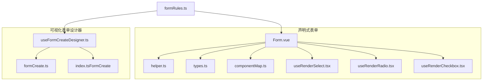
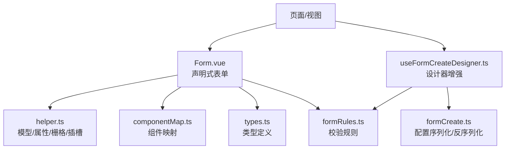
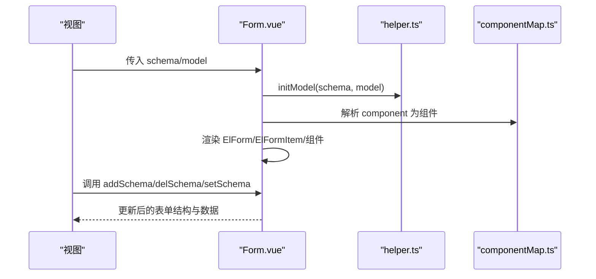
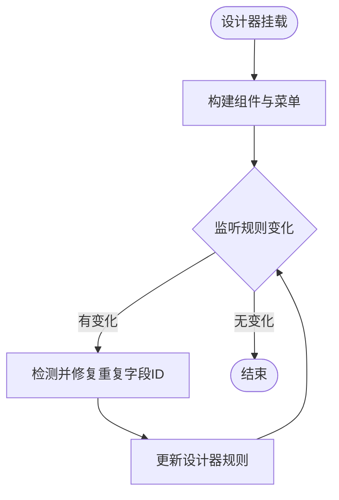
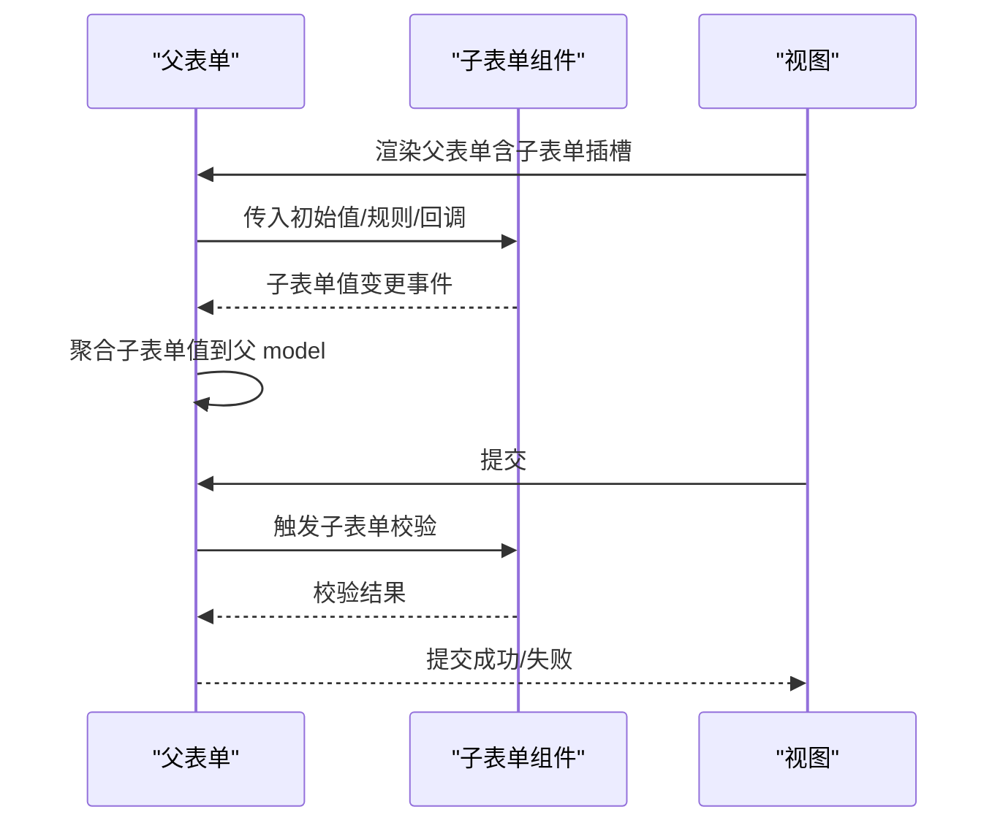
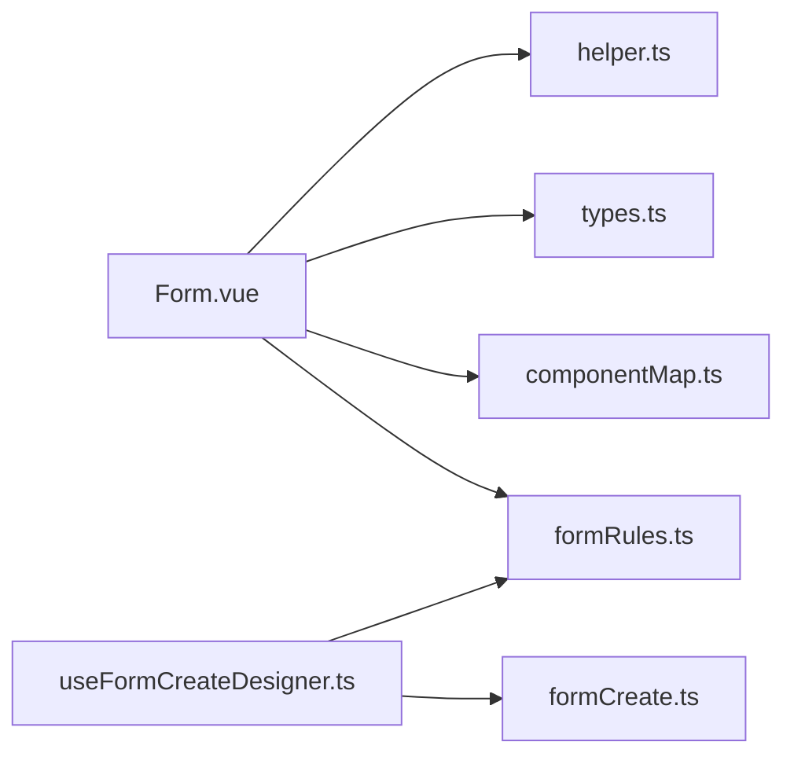

# 复杂表单处理

<cite>
**本文引用的文件**
- [Form.vue](file://yudao-ui-admin-vue3/src/components/Form/src/Form.vue)
- [helper.ts](file://yudao-ui-admin-vue3/src/components/Form/src/helper.ts)
- [types.ts](file://yudao-ui-admin-vue3/src/components/Form/src/types.ts)
- [componentMap.ts](file://yudao-ui-admin-vue3/src/components/Form/src/componentMap.ts)
- [useRenderSelect.tsx](file://yudao-ui-admin-vue3/src/components/Form/src/components/useRenderSelect.tsx)
- [useRenderRadio.tsx](file://yudao-ui-admin-vue3/src/components/Form/src/components/useRenderRadio.tsx)
- [useRenderCheckbox.tsx](file://yudao-ui-admin-vue3/src/components/Form/src/components/useRenderCheckbox.tsx)
- [formCreate.ts](file://yudao-ui-admin-vue3/src/utils/formCreate.ts)
- [useFormCreateDesigner.ts](file://yudao-ui-admin-vue3/src/components/FormCreate/src/useFormCreateDesigner.ts)
- [index.ts（FormCreate）](file://yudao-ui-admin-vue3/src/components/FormCreate/index.ts)
- [formRules.ts](file://yudao-ui-admin-vue3/src/utils/formRules.ts)
</cite>

## 目录
1. [简介](#简介)
2. [项目结构](#项目结构)
3. [核心组件](#核心组件)
4. [架构总览](#架构总览)
5. [详细组件分析](#详细组件分析)
6. [依赖关系分析](#依赖关系分析)
7. [性能考虑](#性能考虑)
8. [故障排查指南](#故障排查指南)
9. [结论](#结论)
10. [附录](#附录)

## 简介
本文件面向复杂业务场景下的前端表单实现，围绕以下目标展开：
- 动态表单：根据条件动态生成表单项、动态验证规则与动态布局调整。
- 嵌套表单：父子表单的数据传递、验证联动与提交协调。
- 表单集成：第三方表单组件的集成、复用与组合模式。
- 大型表单优化：虚拟滚动、懒加载与内存管理策略。
- 设计模式与最佳实践：在复杂业务中如何组织表单代码与数据流。
- 实战示例：通过仓库中的实际实现路径展示关键能力。

本项目在前端采用两种主要方案：
- 基于 schema 的声明式表单组件 Form，适合“配置驱动”的动态表单。
- 基于 form-create 的设计器增强 Hook，适合可视化拖拽构建复杂表单并持久化配置。

## 项目结构
与复杂表单相关的核心目录与文件如下：
- 声明式表单封装：src/components/Form
  - 入口与渲染：Form.vue
  - 辅助工具：helper.ts（占位符、栅格、组件属性合并、模型初始化等）
  - 类型定义：types.ts（FormSchema、FormItemProps 等）
  - 组件映射：componentMap.ts（将字符串组件名映射到具体组件）
  - 选项渲染：components/useRenderSelect.tsx、useRenderRadio.tsx、useRenderCheckbox.tsx
- 可视化表单设计器增强：src/components/FormCreate
  - 设计器 Hook：useFormCreateDesigner.ts（扩展上传、富文本、字典/用户/部门选择、API 下拉等）
  - 导出：index.ts（暴露设计器 Hook 与 API 选择器）
- 通用工具：src/utils
  - formCreate.ts（序列化/反序列化 form-create 配置与字段）
  - formRules.ts（统一校验规则，如必填）

图表来源
- [Form.vue:1-307](file://yudao-ui-admin-vue3/src/components/Form/src/Form.vue#L1-L307)
- [helper.ts:1-149](file://yudao-ui-admin-vue3/src/components/Form/src/helper.ts#L1-L149)
- [types.ts:1-45](file://yudao-ui-admin-vue3/src/components/Form/src/types.ts#L1-L45)
- [useFormCreateDesigner.ts:1-191](file://yudao-ui-admin-vue3/src/components/FormCreate/src/useFormCreateDesigner.ts#L1-L191)
- [formCreate.ts:1-69](file://yudao-ui-admin-vue3/src/utils/formCreate.ts#L1-L69)
- [formRules.ts:1-8](file://yudao-ui-admin-vue3/src/utils/formRules.ts#L1-L8)

章节来源
- [Form.vue:1-307](file://yudao-ui-admin-vue3/src/components/Form/src/Form.vue#L1-L307)
- [helper.ts:1-149](file://yudao-ui-admin-vue3/src/components/Form/src/helper.ts#L1-L149)
- [types.ts:1-45](file://yudao-ui-admin-vue3/src/components/Form/src/types.ts#L1-L45)
- [useFormCreateDesigner.ts:1-191](file://yudao-ui-admin-vue3/src/components/FormCreate/src/useFormCreateDesigner.ts#L1-L191)
- [formCreate.ts:1-69](file://yudao-ui-admin-vue3/src/utils/formCreate.ts#L1-L69)
- [formRules.ts:1-8](file://yudao-ui-admin-vue3/src/utils/formRules.ts#L1-L8)

## 核心组件
- 声明式表单 Form
  - 通过 schema 数组描述表单项，支持栅格布局、自动 placeholder、插槽定制、动态增删改 schema、值绑定与表单实例暴露。
  - 提供 setValues、addSchema、delSchema、setSchema、getElFormRef 等方法，便于运行时动态调整表单结构与数据。
- 可视化表单设计器增强 Hook
  - 扩展 form-create 设计器的菜单与组件，内置上传、富文本、区域选择、字典/用户/部门选择、API 下拉等。
  - 自动修复重复字段 ID，保障设计器操作稳定性。
- 工具函数
  - formCreate.ts：序列化/反序列化 form-create 的配置与字段，支持设计器与运行时双向转换。
  - helper.ts：初始化 model、合并组件属性、设置栅格、占位符、插槽映射等。
  - formRules.ts：统一校验规则（如必填）。

章节来源
- [Form.vue:1-307](file://yudao-ui-admin-vue3/src/components/Form/src/Form.vue#L1-L307)
- [useFormCreateDesigner.ts:1-191](file://yudao-ui-admin-vue3/src/components/FormCreate/src/useFormCreateDesigner.ts#L1-L191)
- [formCreate.ts:1-69](file://yudao-ui-admin-vue3/src/utils/formCreate.ts#L1-L69)
- [helper.ts:1-149](file://yudao-ui-admin-vue3/src/components/Form/src/helper.ts#L1-L149)
- [formRules.ts:1-8](file://yudao-ui-admin-vue3/src/utils/formRules.ts#L1-L8)

## 架构总览
下图展示了声明式表单与设计器增强 Hook 的整体交互关系，以及它们与工具模块的依赖。

图表来源
- [Form.vue:1-307](file://yudao-ui-admin-vue3/src/components/Form/src/Form.vue#L1-L307)
- [useFormCreateDesigner.ts:1-191](file://yudao-ui-admin-vue3/src/components/FormCreate/src/useFormCreateDesigner.ts#L1-L191)
- [helper.ts:1-149](file://yudao-ui-admin-vue3/src/components/Form/src/helper.ts#L1-L149)
- [formCreate.ts:1-69](file://yudao-ui-admin-vue3/src/utils/formCreate.ts#L1-L69)
- [formRules.ts:1-8](file://yudao-ui-admin-vue3/src/utils/formRules.ts#L1-L8)

## 详细组件分析

### 声明式表单 Form（schema 驱动）
- 动态生成表单项
  - 通过 schema 数组驱动渲染，支持 hidden 控制显隐、colProps 控制栅格布局、componentProps 控制组件行为。
  - 运行时可通过 addSchema/delSchema/setSchema 动态调整结构。
- 动态验证规则
  - 每个表单项可携带 formItemProps.rules，结合 formRules.ts 的公共规则（如必填），实现集中化管理。
- 动态布局调整
  - isCol 开关决定是否使用栅格；setGridProp 默认响应式栅格，支持覆盖。
- 数据绑定与模型初始化
  - initModel 根据 schema 初始化 formModel，保留已有值，避免覆盖用户输入。
- 插槽与自定义内容
  - 支持 field 级插槽与组件插槽，labelMessage 自动渲染提示图标与内容。

图表来源
- [Form.vue:1-307](file://yudao-ui-admin-vue3/src/components/Form/src/Form.vue#L1-L307)
- [helper.ts:1-149](file://yudao-ui-admin-vue3/src/components/Form/src/helper.ts#L1-L149)
- [componentMap.ts](file://yudao-ui-admin-vue3/src/components/Form/src/componentMap.ts)

章节来源
- [Form.vue:1-307](file://yudao-ui-admin-vue3/src/components/Form/src/Form.vue#L1-L307)
- [helper.ts:1-149](file://yudao-ui-admin-vue3/src/components/Form/src/helper.ts#L1-L149)
- [types.ts:1-45](file://yudao-ui-admin-vue3/src/components/Form/src/types.ts#L1-L45)

### 可视化表单设计器增强 Hook（form-create）
- 扩展组件与菜单
  - 移除默认上传与富文本，替换为增强版规则；新增区域选择、iframe、用户/部门/字典/API 选择器等系统字段。
- 重复字段 ID 修复
  - 监听设计器规则变化，检测并修复重复 field，保障后续操作稳定。
- 配置序列化/反序列化
  - 通过 formCreate.ts 提供的 encodeConf/decodeConf、encodeFields/decodeFields，实现设计器与运行时的配置互通。

图表来源
- [useFormCreateDesigner.ts:1-191](file://yudao-ui-admin-vue3/src/components/FormCreate/src/useFormCreateDesigner.ts#L1-L191)
- [formCreate.ts:1-69](file://yudao-ui-admin-vue3/src/utils/formCreate.ts#L1-L69)

章节来源
- [useFormCreateDesigner.ts:1-191](file://yudao-ui-admin-vue3/src/components/FormCreate/src/useFormCreateDesigner.ts#L1-L191)
- [formCreate.ts:1-69](file://yudao-ui-admin-vue3/src/utils/formCreate.ts#L1-L69)
- [index.ts（FormCreate）:1-5](file://yudao-ui-admin-vue3/src/components/FormCreate/index.ts#L1-L5)

### 嵌套表单的处理方式
- 父子表单数据传递
  - 父表单通过 schema 或设计器生成的 rule/conf 包含子表单字段；子表单以独立组件形式嵌入父表单的某个字段插槽中。
  - 使用 Form.vue 的插槽机制（field 级插槽）将子表单作为自定义内容注入。
- 验证联动
  - 子表单内部维护自身 model 与 rules；父表单通过 setSchema 或外部逻辑触发子表单校验，并在需要时汇总错误信息。
- 提交协调
  - 父表单提交前，先收集各子表单的值与校验结果，再组装为最终 payload；或使用 form-create 的批量序列化能力统一获取。

[此图为概念流程，不直接对应具体源码文件]

### 表单集成的实现模式
- 第三方组件集成
  - 通过 componentMap 将字符串组件名映射到具体组件，便于统一管理。
  - 借助 helper.ts 的 setComponentProps 与 setTextPlaceholder，统一注入默认行为与提示。
- 表单复用
  - 将常用表单项抽取为 schema 片段或子表单组件，通过组合模式拼装复杂表单。
- 组合模式
  - 父表单持有多个子表单实例，通过暴露的方法（如 getElFormRef）进行校验与取值。

章节来源
- [componentMap.ts](file://yudao-ui-admin-vue3/src/components/Form/src/componentMap.ts)
- [helper.ts:1-149](file://yudao-ui-admin-vue3/src/components/Form/src/helper.ts#L1-L149)
- [Form.vue:1-307](file://yudao-ui-admin-vue3/src/components/Form/src/Form.vue#L1-L307)

## 依赖关系分析
- 组件耦合与内聚
  - Form.vue 高内聚于 schema 渲染与实例方法；helper.ts 提供纯函数工具，降低耦合。
  - useFormCreateDesigner.ts 依赖 formCreate.ts 完成配置序列化，保持设计器与运行时解耦。
- 直接/间接依赖
  - Form.vue 依赖 helper.ts、componentMap.ts、types.ts；间接依赖 formRules.ts。
  - useFormCreateDesigner.ts 依赖 formCreate.ts 与若干选择器规则。
- 循环依赖
  - 当前结构未发现循环依赖迹象。
- 外部依赖
  - Element Plus（UI）、form-create（可视化设计器）、lodash-es（数据处理）。

图表来源
- [Form.vue:1-307](file://yudao-ui-admin-vue3/src/components/Form/src/Form.vue#L1-L307)
- [helper.ts:1-149](file://yudao-ui-admin-vue3/src/components/Form/src/helper.ts#L1-L149)
- [types.ts:1-45](file://yudao-ui-admin-vue3/src/components/Form/src/types.ts#L1-L45)
- [useFormCreateDesigner.ts:1-191](file://yudao-ui-admin-vue3/src/components/FormCreate/src/useFormCreateDesigner.ts#L1-L191)
- [formCreate.ts:1-69](file://yudao-ui-admin-vue3/src/utils/formCreate.ts#L1-L69)
- [formRules.ts:1-8](file://yudao-ui-admin-vue3/src/utils/formRules.ts#L1-L8)

章节来源
- [Form.vue:1-307](file://yudao-ui-admin-vue3/src/components/Form/src/Form.vue#L1-L307)
- [useFormCreateDesigner.ts:1-191](file://yudao-ui-admin-vue3/src/components/FormCreate/src/useFormCreateDesigner.ts#L1-L191)
- [formCreate.ts:1-69](file://yudao-ui-admin-vue3/src/utils/formCreate.ts#L1-L69)

## 性能考虑
- 虚拟滚动
  - 对于超长列表型表单（如大量行编辑），建议对表格或列表项启用虚拟滚动，减少 DOM 节点数量。
- 懒加载
  - 下拉选项、远程数据按需加载；利用 schema 的 api 字段或设计器的接口选择器，延迟请求直至用户交互。
- 内存管理
  - 及时销毁不必要的监听与定时器；避免在 schema 中创建过大的静态对象；合理使用 computed/watch 的依赖范围。
- 渲染优化
  - 使用 isCol=false 减少不必要的栅格包裹；hidden 字段不参与渲染；options 大列表使用 SelectV2 等高性能组件。
- 校验优化
  - 将公共规则抽离至 formRules.ts，减少重复计算；仅在必要时触发深层校验。

[本节为通用指导，不直接分析具体文件]

## 故障排查指南
- 重复字段 ID
  - 现象：复制组件后出现重复 field，导致数据绑定异常。
  - 解决：useFormCreateDesigner.ts 已内置重复字段检测与修复逻辑，确保每次规则变更后自动修正。
- 占位符未显示
  - 现象：部分组件未显示 placeholder。
  - 解决：检查 setTextPlaceholder 是否匹配组件类型；确认 autoSetPlaceholder 为 true。
- 栅格布局错乱
  - 现象：列宽不符合预期。
  - 解决：检查 colProps 与 setGridProp 的默认值；必要时覆盖 span 等属性。
- 校验不生效
  - 现象：提交未触发校验或错误未显示。
  - 解决：确认 formItemProps.rules 正确配置；必要时调用 getElFormRef().validate()。

章节来源
- [useFormCreateDesigner.ts:134-168](file://yudao-ui-admin-vue3/src/components/FormCreate/src/useFormCreateDesigner.ts#L134-L168)
- [helper.ts:13-42](file://yudao-ui-admin-vue3/src/components/Form/src/helper.ts#L13-L42)
- [Form.vue:116-128](file://yudao-ui-admin-vue3/src/components/Form/src/Form.vue#L116-L128)

## 结论
- 本项目提供了两套互补的表单方案：声明式 schema 表单与可视化设计器增强 Hook，能够覆盖从简单到复杂的各类业务场景。
- 通过统一的工具层（helper.ts、formCreate.ts、formRules.ts）实现了配置、渲染与校验的解耦，提升了可维护性与复用性。
- 针对大型表单，建议在列表项、远程数据与校验方面采取虚拟滚动、懒加载与按需校验等优化策略。
- 在实际工程中，推荐优先使用 schema 表单进行快速开发，复杂场景结合设计器进行可视化编排与持久化。

[本节为总结，不直接分析具体文件]

## 附录
- 关键实现路径参考
  - 声明式表单核心：Form.vue、helper.ts、types.ts、componentMap.ts
  - 设计器增强：useFormCreateDesigner.ts、formCreate.ts
  - 校验规则：formRules.ts
- 典型用法路径
  - 动态增删字段：Form.vue 的 addSchema/delSchema/setSchema
  - 设计器配置序列化：formCreate.ts 的 encodeConf/decodeConf、encodeFields/decodeFields
  - 系统字段扩展：useFormCreateDesigner.ts 的用户/部门/字典/API 选择器

[本节为索引，不直接分析具体文件]