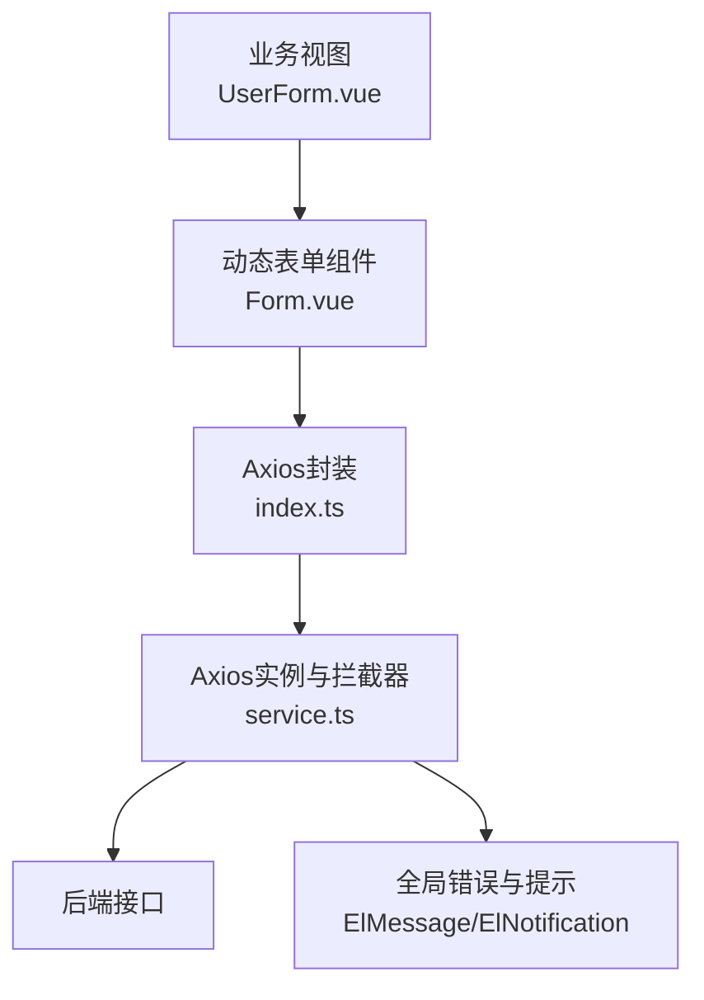
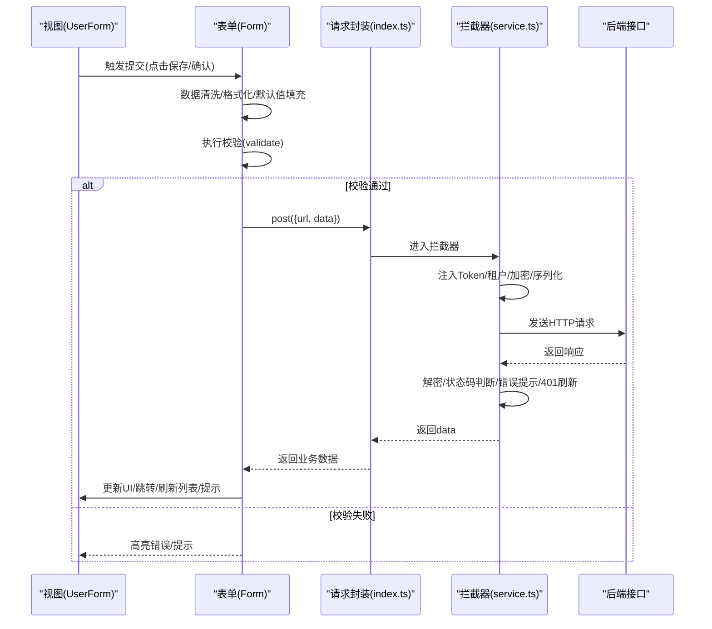
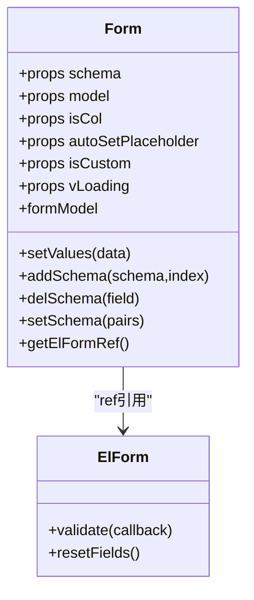
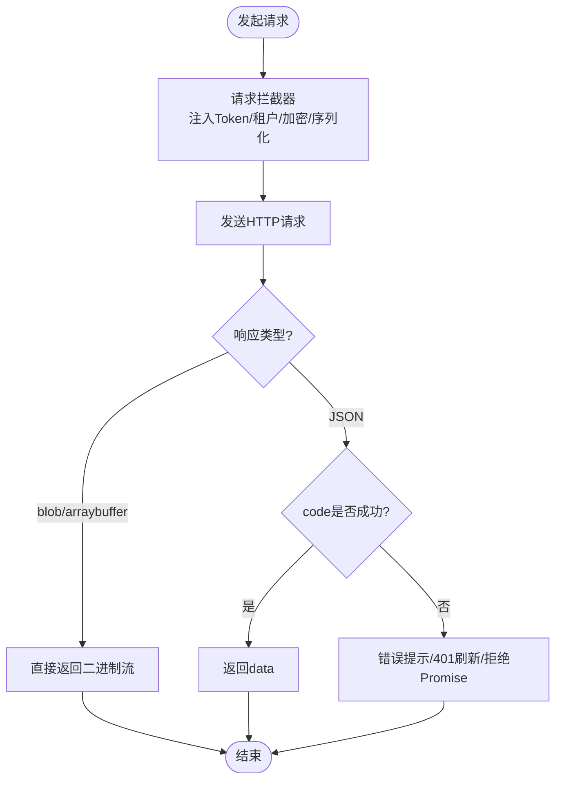
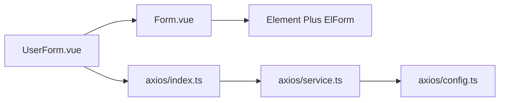

# 表单提交流程

<cite>
**本文引用的文件**
- [service.ts](file://yudao-ui-admin-vue3/src/config/axios/service.ts)
- [index.ts](file://yudao-ui-admin-vue3/src/config/axios/index.ts)
- [config.ts](file://yudao-ui-admin-vue3/src/config/axios/config.ts)
- [Form.vue](file://yudao-ui-admin-vue3/src/components/Form/src/Form.vue)
- [index.ts（组件导出）](file://yudao-ui-admin-vue3/src/components/Form/index.ts)
- [UserForm.vue](file://yudao-ui-admin-vue3/src/views/system/user/UserForm.vue)
</cite>

## 目录
1. [简介](#简介)
2. [项目结构](#项目结构)
3. [核心组件](#核心组件)
4. [架构总览](#架构总览)
5. [详细组件分析](#详细组件分析)
6. [依赖关系分析](#依赖关系分析)
7. [性能考虑](#性能考虑)
8. [故障排查指南](#故障排查指南)
9. [结论](#结论)
10. [附录：提交场景与最佳实践](#附录：提交场景与最佳实践)

## 简介
本文件围绕前端表单提交流程，系统化说明从数据准备、校验触发、API调用到响应处理的全链路机制。重点覆盖：
- 提交前数据准备：清洗、格式转换、默认值填充
- 异步提交：loading状态管理、错误处理、重试机制
- 批量与分步提交：实现方案与注意事项
- 提交成功后的状态处理：页面跳转、数据刷新、用户反馈
- 结合仓库中的通用Axios封装与动态表单组件，给出可落地的最佳实践

## 项目结构
本项目采用“通用能力下沉 + 业务视图拼装”的架构：
- 网络层：统一的Axios实例与拦截器，负责鉴权、租户、加密、错误提示、无感知刷新令牌等
- 表单层：基于Element Plus的动态表单组件，通过schema驱动渲染、双向绑定、字段级校验
- 业务层：各模块views下的具体表单页面，组合表单组件、调用API、处理结果

图表来源
- [Form.vue:1-307](file://yudao-ui-admin-vue3/src/components/Form/src/Form.vue#L1-L307)
- [index.ts:1-48](file://yudao-ui-admin-vue3/src/config/axios/index.ts#L1-L48)
- [service.ts:1-272](file://yudao-ui-admin-vue3/src/config/axios/service.ts#L1-L272)

章节来源
- [Form.vue:1-307](file://yudao-ui-admin-vue3/src/components/Form/src/Form.vue#L1-L307)
- [index.ts:1-48](file://yudao-ui-admin-vue3/src/config/axios/index.ts#L1-L48)
- [service.ts:1-272](file://yudao-ui-admin-vue3/src/config/axios/service.ts#L1-L272)

## 核心组件
- 动态表单组件 Form.vue
  - 通过 schema 驱动渲染，支持栅格布局、自定义插槽、label提示、选项渲染等
  - 暴露 setValues/setProps/addSchema/delSchema/setSchema/getElFormRef 等方法，便于外部控制
  - 内部维护 formModel，监听 schema 变化自动初始化模型
- Axios 封装
  - index.ts：统一 get/post/delete/put/download/upload 方法，设置默认Content-Type
  - service.ts：请求/响应拦截器，处理鉴权、租户、加密、下载流、错误提示、401无感知刷新令牌
  - config.ts：基础URL、超时、默认头、成功码等配置

章节来源
- [Form.vue:1-307](file://yudao-ui-admin-vue3/src/components/Form/src/Form.vue#L1-L307)
- [index.ts:1-48](file://yudao-ui-admin-vue3/src/config/axios/index.ts#L1-L48)
- [service.ts:1-272](file://yudao-ui-admin-vue3/src/config/axios/service.ts#L1-L272)
- [config.ts:1-29](file://yudao-ui-admin-vue3/src/config/axios/config.ts#L1-L29)

## 架构总览
表单提交流程的关键阶段：
- 数据准备：在提交前对表单数据进行清洗、格式化、默认值填充
- 校验触发：使用 Element Plus 的 validate 或自定义校验逻辑
- API调用：通过封装的 request 发起请求，携带token、租户、加密等
- 响应处理：根据返回码进行成功/失败分支，展示消息、刷新列表、跳转页面
- 异常与重试：网络错误、超时、401等由拦截器统一处理；业务侧可按需实现重试

图表来源
- [Form.vue:1-307](file://yudao-ui-admin-vue3/src/components/Form/src/Form.vue#L1-L307)
- [index.ts:1-48](file://yudao-ui-admin-vue3/src/config/axios/index.ts#L1-L48)
- [service.ts:1-272](file://yudao-ui-admin-vue3/src/config/axios/service.ts#L1-L272)

## 详细组件分析

### 动态表单组件（Form.vue）
- 数据模型与双向绑定
  - 内部维护 formModel，监听 schema 变化时初始化模型，保证字段与模型一致
  - 通过 v-model 将输入与 formModel 绑定，天然支持后续提交取值
- 渲染与插槽
  - 支持栅格布局、Divider、Select/Radio/Checkbox 选项渲染
  - 支持 labelMessage 提示、自定义插槽扩展
- 暴露能力
  - setValues：批量赋值
  - addSchema/delSchema/setSchema：动态调整表单项
  - getElFormRef：获取底层 ElForm 实例，用于调用 validate/resetFields 等
- 与校验集成
  - 通过 getElFormRef() 获取 ElForm 实例后，可在提交前调用 validate 完成字段级校验
  - 校验通过后，再组装数据并发起提交

图表来源
- [Form.vue:1-307](file://yudao-ui-admin-vue3/src/components/Form/src/Form.vue#L1-L307)

章节来源
- [Form.vue:1-307](file://yudao-ui-admin-vue3/src/components/Form/src/Form.vue#L1-L307)

### Axios 封装与拦截器（index.ts / service.ts / config.ts）
- 请求封装（index.ts）
  - 提供 get/post/delete/put/download/upload 等方法，统一设置 Content-Type
  - 所有方法最终委托给 service 实例
- 拦截器（service.ts）
  - 请求拦截：注入 Authorization、租户ID、访问租户ID、GET缓存控制、x-www-form-urlencoded序列化、可选的数据加密
  - 响应拦截：二进制流直返、响应解密、统一错误提示、401无感知刷新令牌、队列重试
  - 错误处理：网络错误、超时、HTTP状态码错误统一提示
- 配置（config.ts）
  - base_url、result_code、request_timeout、default_headers

图表来源
- [service.ts:1-272](file://yudao-ui-admin-vue3/src/config/axios/service.ts#L1-L272)
- [index.ts:1-48](file://yudao-ui-admin-vue3/src/config/axios/index.ts#L1-L48)
- [config.ts:1-29](file://yudao-ui-admin-vue3/src/config/axios/config.ts#L1-L29)

章节来源
- [service.ts:1-272](file://yudao-ui-admin-vue3/src/config/axios/service.ts#L1-L272)
- [index.ts:1-48](file://yudao-ui-admin-vue3/src/config/axios/index.ts#L1-L48)
- [config.ts:1-29](file://yudao-ui-admin-vue3/src/config/axios/config.ts#L1-L29)

### 业务视图示例（UserForm.vue）
- 作为典型表单页面，通常包含：
  - 引入并使用动态表单组件
  - 定义 schema、初始值、校验规则
  - 在提交回调中：先校验，再组装数据，调用API，最后处理结果（提示、刷新、跳转）
- 由于该文件为业务视图，具体实现以实际代码为准；建议遵循以下模式：
  - 使用 getElFormRef().validate() 做前置校验
  - 使用 loading 状态包裹提交过程
  - 成功后提示并刷新列表或跳转
  - 失败时保留错误信息并允许重试

章节来源
- [UserForm.vue](file://yudao-ui-admin-vue3/src/views/system/user/UserForm.vue)

## 依赖关系分析
- 视图层依赖表单组件，表单组件依赖 Element Plus 的 ElForm
- 表单组件通过 ref 获取 ElForm 实例，从而调用校验与重置
- 业务视图通过封装的 axios 模块发起请求，统一经过拦截器处理
- 拦截器依赖配置项与环境变量，决定基础路径、超时、默认头等

图表来源
- [Form.vue:1-307](file://yudao-ui-admin-vue3/src/components/Form/src/Form.vue#L1-L307)
- [index.ts:1-48](file://yudao-ui-admin-vue3/src/config/axios/index.ts#L1-L48)
- [service.ts:1-272](file://yudao-ui-admin-vue3/src/config/axios/service.ts#L1-L272)
- [config.ts:1-29](file://yudao-ui-admin-vue3/src/config/axios/config.ts#L1-L29)

章节来源
- [Form.vue:1-307](file://yudao-ui-admin-vue3/src/components/Form/src/Form.vue#L1-L307)
- [index.ts:1-48](file://yudao-ui-admin-vue3/src/config/axios/index.ts#L1-L48)
- [service.ts:1-272](file://yudao-ui-admin-vue3/src/config/axios/service.ts#L1-L272)
- [config.ts:1-29](file://yudao-ui-admin-vue3/src/config/axios/config.ts#L1-L29)

## 性能考虑
- 减少不必要的重渲染：避免在 schema 或 formModel 上频繁深拷贝；按需更新字段
- 校验优化：仅在提交或关键字段变更时触发校验；复杂校验可延迟到失焦
- 请求节流与防抖：对高频操作（如搜索、分页）进行节流；提交按钮防重复点击
- 大表单拆分：将长表单拆分为多步骤，降低单次渲染与校验成本
- 网络层复用：利用拦截器的无感知刷新令牌机制，减少并发401导致的重复刷新

[本节为通用指导，不直接分析具体文件]

## 故障排查指南
- 401未认证
  - 拦截器会尝试无感知刷新令牌；若刷新失败则提示重新登录
  - 检查本地 token、刷新 token、白名单配置
- 网络错误/超时
  - 统一提示“网络错误/超时”，检查后端服务与网络环境
- 响应解密失败
  - 检查是否开启加密、前后端加解密策略是否一致
- 表单校验不生效
  - 确认已正确获取 ElForm 实例并调用 validate
  - 检查字段 prop 与 rules 是否匹配
- 批量提交失败
  - 优先定位失败的子任务；记录日志；必要时降级为逐个提交

章节来源
- [service.ts:152-238](file://yudao-ui-admin-vue3/src/config/axios/service.ts#L152-L238)

## 结论
本项目通过“动态表单 + 统一Axios封装”的组合，提供了稳定、可扩展的表单提交流程。借助拦截器与表单组件的能力，可实现：
- 标准化的数据准备与校验
- 健壮的鉴权、租户、加密与错误处理
- 良好的用户体验（loading、提示、跳转、刷新）
建议在业务视图中遵循本文的最佳实践，确保一致性、可维护性与可观测性。

[本节为总结，不直接分析具体文件]

## 附录：提交场景与最佳实践

### 单条数据提交
- 数据准备
  - 从 formModel 取值，进行必要清洗与格式转换（日期、枚举、金额等）
  - 填充默认值（如创建人、时间戳等可由后端生成）
- 校验
  - 使用 ElForm.validate() 进行字段级校验
- 提交
  - 开启 loading，调用封装的 post 方法
  - 成功后提示并刷新列表或跳转
  - 失败时保留错误并允许重试

章节来源
- [Form.vue:1-307](file://yudao-ui-admin-vue3/src/components/Form/src/Form.vue#L1-L307)
- [index.ts:1-48](file://yudao-ui-admin-vue3/src/config/axios/index.ts#L1-L48)
- [service.ts:1-272](file://yudao-ui-admin-vue3/src/config/axios/service.ts#L1-L272)

### 批量提交
- 方案一：后端批量接口
  - 前端聚合多条数据，一次性提交
  - 注意大数组的性能与内存占用
- 方案二：前端串行/并行提交
  - 串行：依次提交，简单可靠但耗时
  - 并行：使用 Promise.all 并发提交，配合进度与错误汇总
- 错误处理
  - 记录失败项，支持部分成功
  - 提供重试入口

章节来源
- [index.ts:1-48](file://yudao-ui-admin-vue3/src/config/axios/index.ts#L1-L48)
- [service.ts:1-272](file://yudao-ui-admin-vue3/src/config/axios/service.ts#L1-L272)

### 分步提交（向导式表单）
- 将长表单拆分为多个步骤，每步独立校验与提交
- 使用动态 schema 切换步骤，暂存中间态数据
- 最终合并数据提交或分步持久化

章节来源
- [Form.vue:1-307](file://yudao-ui-admin-vue3/src/components/Form/src/Form.vue#L1-L307)

### 异步提交与重试
- loading 管理
  - 提交前开启，成功/失败后关闭
- 错误处理
  - 网络错误、超时、业务错误分别处理
- 重试机制
  - 针对幂等接口，可设计有限次数的指数退避重试
  - 非幂等接口谨慎重试，避免重复提交

章节来源
- [service.ts:152-238](file://yudao-ui-admin-vue3/src/config/axios/service.ts#L152-L238)

### 提交成功后的状态处理
- 用户反馈：成功提示、操作日志
- 数据刷新：局部刷新或全量刷新列表
- 页面跳转：返回列表或详情
- 清理状态：重置表单、清空临时数据

章节来源
- [Form.vue:1-307](file://yudao-ui-admin-vue3/src/components/Form/src/Form.vue#L1-L307)
- [service.ts:1-272](file://yudao-ui-admin-vue3/src/config/axios/service.ts#L1-L272)