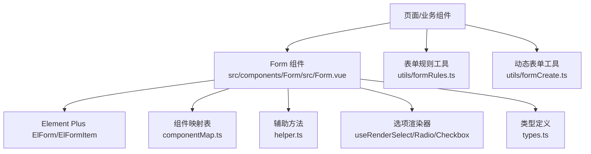
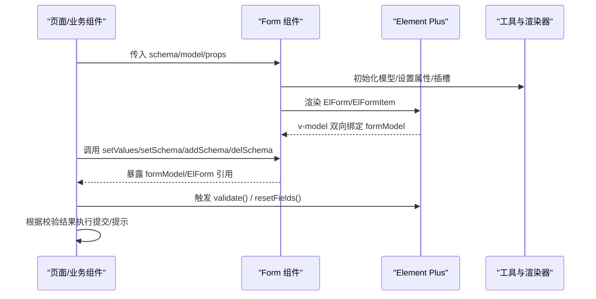
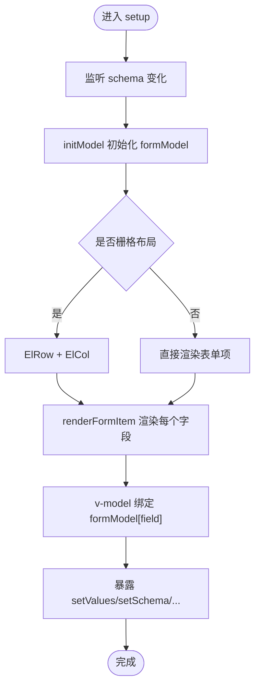
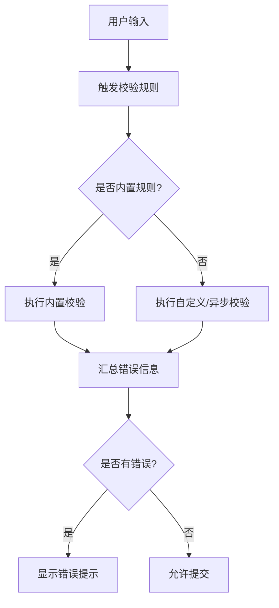
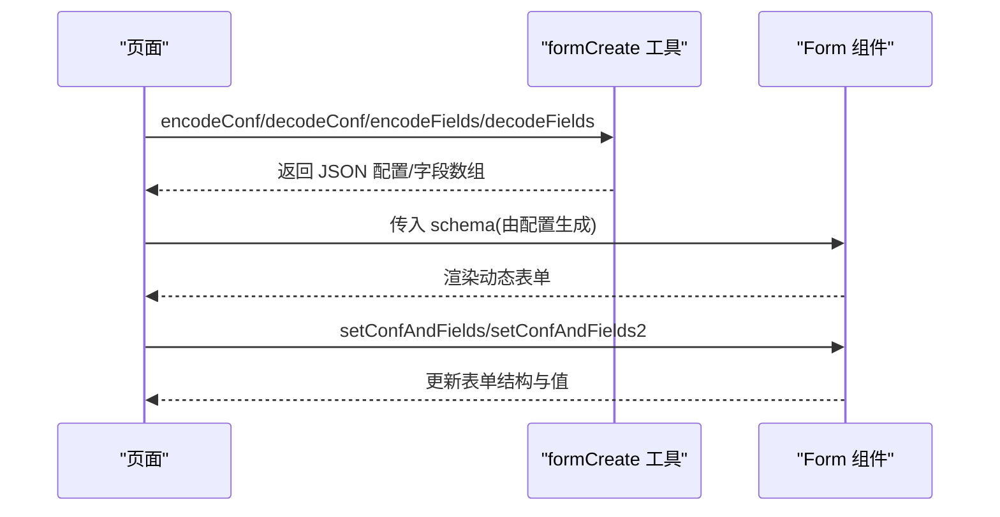
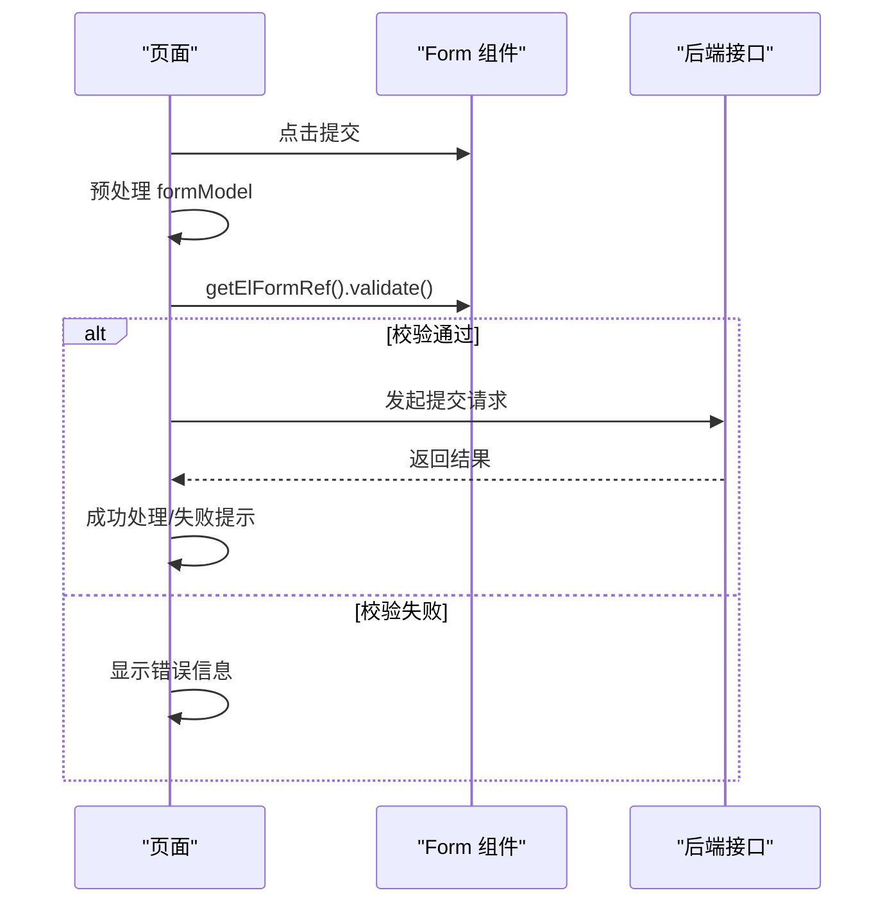
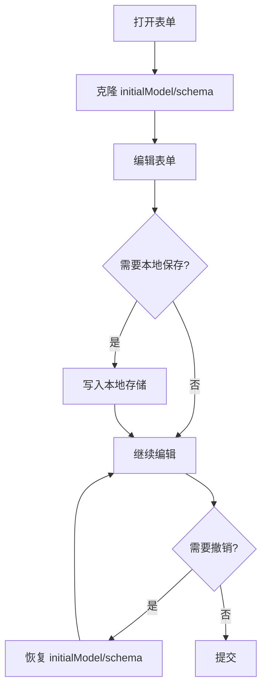
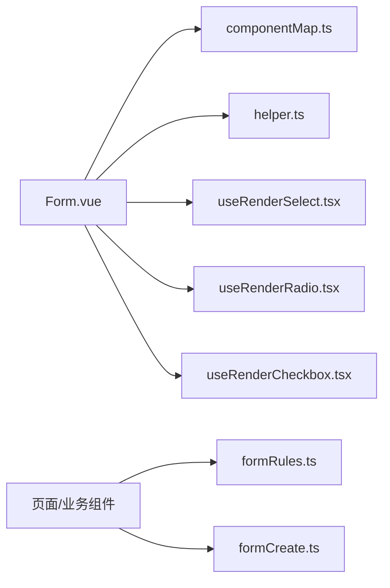

# 表单数据处理

<cite>
**本文引用的文件**
- [Form.vue](file://yudao-ui-admin-vue3/src/components/Form/src/Form.vue)
- [types.ts](file://yudao-ui-admin-vue3/src/components/Form/src/types.ts)
- [formRules.ts](file://yudao-ui-admin-vue3/src/utils/formRules.ts)
- [formCreate.ts](file://yudao-ui-admin-vue3/src/utils/formCreate.ts)
- [componentMap.ts](file://yudao-ui-admin-vue3/src/components/Form/src/componentMap.ts)
- [helper.ts](file://yudao-ui-admin-vue3/src/components/Form/src/helper.ts)
- [useRenderSelect.tsx](file://yudao-ui-admin-vue3/src/components/Form/src/components/useRenderSelect.tsx)
- [useRenderRadio.tsx](file://yudao-ui-admin-vue3/src/components/Form/src/components/useRenderRadio.tsx)
- [useRenderCheckbox.tsx](file://yudao-ui-admin-vue3/src/components/Form/src/components/useRenderCheckbox.tsx)
</cite>

## 目录
1. [简介](#简介)
2. [项目结构](#项目结构)
3. [核心组件](#核心组件)
4. [架构总览](#架构总览)
5. [详细组件分析](#详细组件分析)
6. [依赖关系分析](#依赖关系分析)
7. [性能考虑](#性能考虑)
8. [故障排查指南](#故障排查指南)
9. [结论](#结论)
10. [附录](#附录)

## 简介
本文件面向前端 Vue3 管理后台的“表单数据处理”能力，系统化说明：
- 表单验证规则的定义与实现（内置、自定义、异步）
- 表单数据绑定与同步（双向绑定、状态管理、格式化）
- 复杂表单处理方案（动态表单、嵌套表单、表单集成）
- 提交流程（预处理、校验、提交后状态）
- 撤销/恢复与本地保存恢复机制
- 组件使用示例与最佳实践

## 项目结构
本项目在 yudao-ui-admin-vue3 中提供了一套基于 Element Plus 的可配置表单组件 Form，并通过工具函数与渲染器扩展能力，支撑动态字段、选项渲染、栅格布局等常见场景。

图表来源
- [Form.vue:1-307](file://yudao-ui-admin-vue3/src/components/Form/src/Form.vue#L1-L307)
- [componentMap.ts](file://yudao-ui-admin-vue3/src/components/Form/src/componentMap.ts)
- [helper.ts](file://yudao-ui-admin-vue3/src/components/Form/src/helper.ts)
- [useRenderSelect.tsx](file://yudao-ui-admin-vue3/src/components/Form/src/components/useRenderSelect.tsx)
- [useRenderRadio.tsx](file://yudao-ui-admin-vue3/src/components/Form/src/components/useRenderRadio.tsx)
- [useRenderCheckbox.tsx](file://yudao-ui-admin-vue3/src/components/Form/src/components/useRenderCheckbox.tsx)
- [types.ts:1-18](file://yudao-ui-admin-vue3/src/components/Form/src/types.ts#L1-L18)
- [formRules.ts:1-8](file://yudao-ui-admin-vue3/src/utils/formRules.ts#L1-L8)
- [formCreate.ts:1-69](file://yudao-ui-admin-vue3/src/utils/formCreate.ts#L1-L69)

章节来源
- [Form.vue:1-307](file://yudao-ui-admin-vue3/src/components/Form/src/Form.vue#L1-L307)
- [types.ts:1-18](file://yudao-ui-admin-vue3/src/components/Form/src/types.ts#L1-L18)

## 核心组件
- Form 组件：基于 schema 驱动渲染，支持栅格布局、自动 placeholder、插槽定制、动态增删改 schema、对外暴露 formModel 与 ElForm 实例引用。
- 组件映射表 componentMap：将字符串组件名映射到具体 UI 组件，便于 schema 驱动渲染。
- 辅助方法 helper：初始化模型、设置组件属性、设置表单项插槽、栅格属性、占位符文本等。
- 选项渲染器 useRenderSelect/Radio/Checkbox：统一处理 Select/Radio/Checkbox 的 options 渲染逻辑。
- 类型定义 types：FormProps 与 PlaceholderModel 等类型约束。
- 表单规则 formRules：提供国际化必填规则等常用校验规则。
- 动态表单 formCreate：封装 form-create 的编解码与配置注入能力，用于可视化设计器或运行时动态生成表单。

章节来源
- [Form.vue:1-307](file://yudao-ui-admin-vue3/src/components/Form/src/Form.vue#L1-L307)
- [types.ts:1-18](file://yudao-ui-admin-vue3/src/components/Form/src/types.ts#L1-L18)
- [formRules.ts:1-8](file://yudao-ui-admin-vue3/src/utils/formRules.ts#L1-L8)
- [formCreate.ts:1-69](file://yudao-ui-admin-vue3/src/utils/formCreate.ts#L1-L69)

## 架构总览
下图展示了从页面到表单渲染、数据绑定、校验与提交的完整流程。

图表来源
- [Form.vue:55-140](file://yudao-ui-admin-vue3/src/components/Form/src/Form.vue#L55-L140)
- [Form.vue:175-245](file://yudao-ui-admin-vue3/src/components/Form/src/Form.vue#L175-L245)
- [Form.vue:280-296](file://yudao-ui-admin-vue3/src/components/Form/src/Form.vue#L280-L296)

## 详细组件分析

### Form 组件（schema 驱动表单）
- 数据绑定
  - 内部维护 formModel，监听 schema 变化时通过 initModel 重建模型，保证字段与值一致。
  - 支持 isCustom 模式直接绑定外部 model，否则使用内部 formModel。
  - 暴露 setValues 批量赋值、getElFormRef 获取底层 ElForm 实例。
- 动态结构
  - addSchema/delSchema/setSchema 支持运行时动态增删改字段及属性。
  - 支持 labelMessage 自动渲染带提示的 label。
- 渲染策略
  - 通过 componentMap 解析组件并渲染；对 SelectV2/Cascader/Transfer 等特殊组件单独处理 options。
  - 通过 useRenderSelect/Radio/Checkbox 统一渲染选项。
  - 支持栅格布局 with ElRow/ElCol。
- 校验与交互
  - 通过 getElFormRef().validate()/resetFields() 完成校验与重置。
  - 支持 v-loading 控制加载态。

图表来源
- [Form.vue:130-140](file://yudao-ui-admin-vue3/src/components/Form/src/Form.vue#L130-L140)
- [Form.vue:142-173](file://yudao-ui-admin-vue3/src/components/Form/src/Form.vue#L142-L173)
- [Form.vue:175-245](file://yudao-ui-admin-vue3/src/components/Form/src/Form.vue#L175-L245)
- [Form.vue:120-128](file://yudao-ui-admin-vue3/src/components/Form/src/Form.vue#L120-L128)

章节来源
- [Form.vue:55-140](file://yudao-ui-admin-vue3/src/components/Form/src/Form.vue#L55-L140)
- [Form.vue:142-245](file://yudao-ui-admin-vue3/src/components/Form/src/Form.vue#L142-L245)
- [Form.vue:280-296](file://yudao-ui-admin-vue3/src/components/Form/src/Form.vue#L280-L296)

### 表单验证规则（内置、自定义、异步）
- 内置规则
  - 使用 Element Plus 的 rules 机制，可在 schema 的每个字段上配置 required/message 等。
  - 项目中提供统一的必填规则常量，便于复用与国际化。
- 自定义规则
  - 可在 schema 的 field 级别添加自定义 validator，或在父组件中对 ElForm 实例调用 validateField。
- 异步验证
  - 在自定义 validator 中返回 Promise，结合 loading 与错误提示，实现远程校验（如唯一性检查）。

图表来源
- [formRules.ts:1-8](file://yudao-ui-admin-vue3/src/utils/formRules.ts#L1-L8)
- [Form.vue:214-245](file://yudao-ui-admin-vue3/src/components/Form/src/Form.vue#L214-L245)

章节来源
- [formRules.ts:1-8](file://yudao-ui-admin-vue3/src/utils/formRules.ts#L1-L8)
- [Form.vue:214-245](file://yudao-ui-admin-vue3/src/components/Form/src/Form.vue#L214-L245)

### 数据绑定与同步（双向绑定、状态管理、格式化）
- 双向绑定
  - 通过 v-model 将 formModel[field] 与具体组件值绑定，schema 变更时自动重建模型。
- 状态管理
  - 通过 setValues 批量更新、setSchema 动态修改字段属性、addSchema/delSchema 动态调整结构。
  - 暴露 ElForm 实例，便于调用 validate/resetFields/scrollToField 等方法。
- 格式化
  - 可在组件 props 中配置 formatter/unformatter（如日期、金额），或在提交前对 formModel 进行转换。

章节来源
- [Form.vue:70-140](file://yudao-ui-admin-vue3/src/components/Form/src/Form.vue#L70-L140)
- [Form.vue:175-245](file://yudao-ui-admin-vue3/src/components/Form/src/Form.vue#L175-L245)

### 复杂表单（动态表单、嵌套表单、表单集成）
- 动态表单
  - 通过 addSchema/delSchema/setSchema 在运行时动态构建表单结构。
  - 借助 formCreate 工具，可将可视化设计器的配置编码/解码为 JSON，并在运行时注入。
- 嵌套表单
  - 通过 schema 中的子组件或插槽，组合多个子表单；或使用 formCreate 的嵌套规则。
- 表单集成
  - 通过 getElFormRef 获取底层 ElForm，与其他表单库或第三方组件联动。

图表来源
- [formCreate.ts:1-69](file://yudao-ui-admin-vue3/src/utils/formCreate.ts#L1-L69)
- [Form.vue:96-114](file://yudao-ui-admin-vue3/src/components/Form/src/Form.vue#L96-L114)

章节来源
- [formCreate.ts:1-69](file://yudao-ui-admin-vue3/src/utils/formCreate.ts#L1-L69)
- [Form.vue:96-114](file://yudao-ui-admin-vue3/src/components/Form/src/Form.vue#L96-L114)

### 提交流程（预处理、校验、提交后状态）
- 预处理
  - 在提交前可对 formModel 做清洗、格式化、默认值填充。
- 校验
  - 通过 getElFormRef().validate() 执行校验，阻止非法提交。
- 提交后
  - 成功：关闭弹窗/跳转/刷新列表；失败：展示错误提示。
  - 可结合 v-loading 控制提交态。

图表来源
- [Form.vue:116-128](file://yudao-ui-admin-vue3/src/components/Form/src/Form.vue#L116-L128)
- [Form.vue:280-296](file://yudao-ui-admin-vue3/src/components/Form/src/Form.vue#L280-L296)

章节来源
- [Form.vue:116-128](file://yudao-ui-admin-vue3/src/components/Form/src/Form.vue#L116-L128)
- [Form.vue:280-296](file://yudao-ui-admin-vue3/src/components/Form/src/Form.vue#L280-L296)

### 撤销与恢复、本地保存与恢复
- 撤销/恢复
  - 在打开表单时克隆一份初始快照（initialModel），撤销时恢复该快照。
  - 对于动态表单，可同时备份 schema 快照，以便恢复结构。
- 本地保存与恢复
  - 使用 localStorage/sessionStorage 缓存当前 formModel 与 schema，下次进入时恢复。
  - 注意敏感数据避免持久化，必要时加密存储。

[此图为概念流程图，不直接对应具体源码文件]

### 选项渲染器（Select/Radio/Checkbox）
- 统一通过 useRenderSelect/useRenderRadio/useRenderCheckbox 处理 options 渲染，屏蔽不同组件的差异。
- 支持插槽覆盖默认选项渲染，满足复杂展示需求。

章节来源
- [useRenderSelect.tsx](file://yudao-ui-admin-vue3/src/components/Form/src/components/useRenderSelect.tsx)
- [useRenderRadio.tsx](file://yudao-ui-admin-vue3/src/components/Form/src/components/useRenderRadio.tsx)
- [useRenderCheckbox.tsx](file://yudao-ui-admin-vue3/src/components/Form/src/components/useRenderCheckbox.tsx)
- [Form.vue:247-265](file://yudao-ui-admin-vue3/src/components/Form/src/Form.vue#L247-L265)

## 依赖关系分析
- Form 组件依赖 Element Plus 的表单能力，并通过 componentMap 解耦具体 UI 组件。
- helper.ts 提供模型初始化与属性设置，降低耦合。
- formCreate.ts 作为桥接层，连接可视化设计器与运行时表单。
- formRules.ts 提供统一校验规则入口，便于全局维护。

图表来源
- [Form.vue:1-307](file://yudao-ui-admin-vue3/src/components/Form/src/Form.vue#L1-L307)
- [formRules.ts:1-8](file://yudao-ui-admin-vue3/src/utils/formRules.ts#L1-L8)
- [formCreate.ts:1-69](file://yudao-ui-admin-vue3/src/utils/formCreate.ts#L1-L69)

章节来源
- [Form.vue:1-307](file://yudao-ui-admin-vue3/src/components/Form/src/Form.vue#L1-L307)
- [formRules.ts:1-8](file://yudao-ui-admin-vue3/src/utils/formRules.ts#L1-L8)
- [formCreate.ts:1-69](file://yudao-ui-admin-vue3/src/utils/formCreate.ts#L1-L69)

## 性能考虑
- 大表单优化
  - 按需渲染：通过 hidden 或条件 schema 减少 DOM 节点。
  - 虚拟滚动：对超长下拉列表使用 SelectV2 等虚拟化组件。
- 校验性能
  - 将耗时校验改为异步并防抖，避免阻塞主线程。
- 渲染性能
  - 避免在 schema 中频繁创建新对象，尽量复用配置。
  - 合理使用 watch 深度监听，仅在必要时启用。

[本节为通用建议，不直接分析具体文件]

## 故障排查指南
- 表单未绑定值
  - 确认 schema.field 与 formModel 键一致；检查 autoSetPlaceholder 与组件 props 是否覆盖。
- 动态字段不生效
  - 检查 addSchema/delSchema/setSchema 调用时机与参数；确保 schema 响应式更新。
- 校验不触发
  - 确认 ElFormItem 的 prop 已正确绑定；必要时调用 validate/validateField。
- 选项不渲染
  - 检查 useRenderSelect/Radio/Checkbox 的 options 数据结构是否符合预期。
- 动态表单配置无效
  - 使用 encodeConf/decodeConf 核对 JSON；通过 setConfAndFields2 注入 value 观察差异。

章节来源
- [Form.vue:130-140](file://yudao-ui-admin-vue3/src/components/Form/src/Form.vue#L130-L140)
- [Form.vue:175-245](file://yudao-ui-admin-vue3/src/components/Form/src/Form.vue#L175-L245)
- [formCreate.ts:1-69](file://yudao-ui-admin-vue3/src/utils/formCreate.ts#L1-L69)

## 结论
本方案以 schema 为核心，结合 Element Plus 与 form-create，提供了高内聚、可扩展的表单处理能力。通过统一的规则工具、选项渲染器与动态配置能力，可满足从简单到复杂的各类表单场景，并具备良好的可维护性与扩展性。

## 附录
- 使用示例与最佳实践
  - 基础用法：在页面中引入 Form，传入 schema 与 model，调用 getElFormRef().validate() 完成校验与提交。
  - 动态表单：通过 formCreate 将设计器配置转换为 schema，并使用 setConfAndFields2 注入值。
  - 校验规则：优先复用 formRules 中的内置规则，复杂规则采用自定义 validator。
  - 本地持久化：在合适时机保存 formModel 与 schema，进入页面时恢复。
  - 性能优化：对长列表使用虚拟化组件；对异步校验加防抖；避免不必要的深度监听。

[本节为实践建议，不直接分析具体文件]