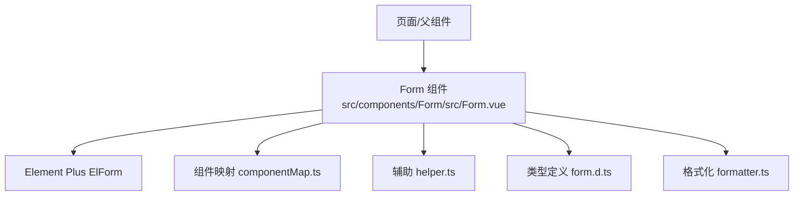
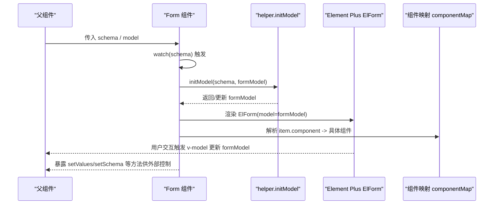
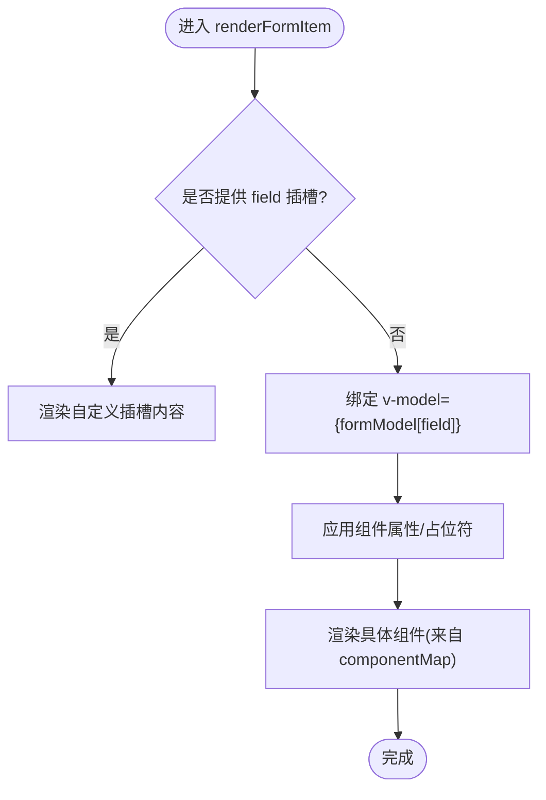
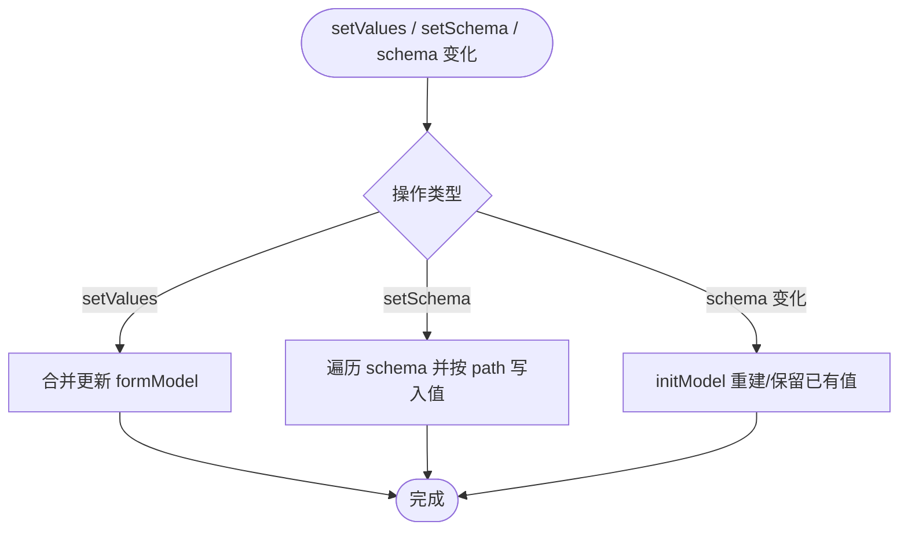
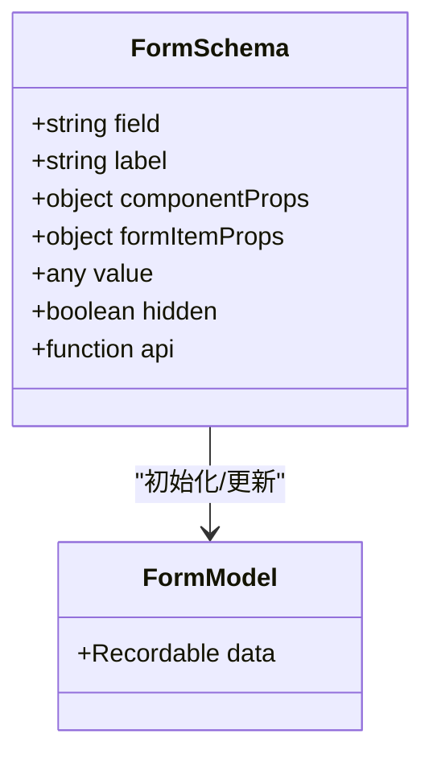
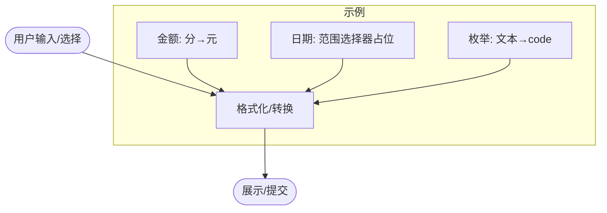
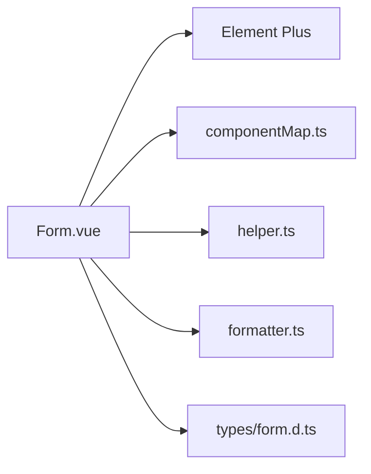

# 表单数据绑定

<cite>
**本文引用的文件**
- [Form/index.ts](file://yudao-ui-admin-vue3/src/components/Form/index.ts)
- [Form.vue](file://yudao-ui-admin-vue3/src/components/Form/src/Form.vue)
- [helper.ts](file://yudao-ui-admin-vue3/src/components/Form/src/helper.ts)
- [form.d.ts](file://yudao-ui-admin-vue3/src/types/form.d.ts)
- [formatter.ts](file://yudao-ui-admin-vue3/src/utils/formatter.ts)
- [componentMap.ts](file://yudao-ui-admin-vue3/src/components/Form/src/componentMap.ts)
</cite>

## 目录
1. [简介](#简介)
2. [项目结构](#项目结构)
3. [核心组件](#核心组件)
4. [架构总览](#架构总览)
5. [详细组件分析](#详细组件分析)
6. [依赖关系分析](#依赖关系分析)
7. [性能考量](#性能考量)
8. [故障排查指南](#故障排查指南)
9. [结论](#结论)
10. [附录：常见绑定场景与最佳实践](#附录：常见绑定场景与最佳实践)

## 简介
本文件围绕前端表单数据绑定能力，系统化说明双向数据绑定的实现机制、表单状态管理（初始化/更新/重置）、复杂数据类型绑定（对象、数组、嵌套结构）、数据格式化（日期、数字、枚举值转换）以及表单组件与业务数据的集成模式与最佳实践。文档基于仓库中的通用 Form 组件及其辅助工具进行解读，并结合实际使用方式给出可操作的指导。

## 项目结构
本项目采用“配置化表单”的架构：通过 schema 描述表单项，由 Form 组件动态渲染并维护内部 formModel，借助 v-model 完成视图与模型的双向绑定。关键文件职责如下：
- 类型定义：统一 schema、属性、值的类型约束
- 表单容器：Form.vue 负责渲染、监听 schema、维护 formModel、暴露操作 API
- 辅助函数：helper.ts 提供占位符、栅格、组件属性合并、model 初始化等
- 组件映射：componentMap.ts 将字符串组件名映射到真实组件
- 格式化：formatter.ts 提供金额等常用格式化方法

图表来源
- [Form.vue:29-297](file://yudao-ui-admin-vue3/src/components/Form/src/Form.vue#L29-L297)
- [componentMap.ts](file://yudao-ui-admin-vue3/src/components/Form/src/componentMap.ts)
- [helper.ts:13-128](file://yudao-ui-admin-vue3/src/components/Form/src/helper.ts#L13-L128)
- [form.d.ts:5-44](file://yudao-ui-admin-vue3/src/types/form.d.ts#L5-L44)
- [formatter.ts:1-8](file://yudao-ui-admin-vue3/src/utils/formatter.ts#L1-L8)

章节来源
- [Form.vue:29-297](file://yudao-ui-admin-vue3/src/components/Form/src/Form.vue#L29-L297)
- [form.d.ts:5-44](file://yudao-ui-admin-vue3/src/types/form.d.ts#L5-L44)

## 核心组件
- 表单容器 Form.vue
  - 接收 schema、model、isCol、autoSetPlaceholder、isCustom、labelWidth、vLoading 等 props
  - 内部维护 formModel，watch schema 变化时调用 initModel 重建或保留已有值
  - 通过 v-model={formModel.value[item.field]} 实现字段级双向绑定
  - 暴露 setValues/setProps/delSchema/addSchema/setSchema/getElFormRef 等方法
- 类型与配置
  - FormSchema 描述每个表单项：field、label、component、value、hidden、componentProps、formItemProps、api 等
  - FormValueType 限定基础值类型；FormSetPropsType 支持按路径设置 schema 属性
- 辅助逻辑
  - setTextPlaceholder 自动为输入/选择类组件生成占位提示
  - setGridProp 合并栅格布局默认值
  - setComponentProps 为多数组件注入 clearable，并剔除 slots 透传
  - initModel 根据 schema 初始化 formModel，尊重已有值与 hidden 字段
  - setFormItemSlots/setItemComponentSlots 处理插槽映射

章节来源
- [Form.vue:31-128](file://yudao-ui-admin-vue3/src/components/Form/src/Form.vue#L31-L128)
- [helper.ts:13-128](file://yudao-ui-admin-vue3/src/components/Form/src/helper.ts#L13-L128)
- [form.d.ts:5-44](file://yudao-ui-admin-vue3/src/types/form.d.ts#L5-L44)

## 架构总览
下图展示从父组件到表单渲染、再到 Element Plus 的完整流程，以及 schema 变更时的响应式重建过程。

图表来源
- [Form.vue:130-140](file://yudao-ui-admin-vue3/src/components/Form/src/Form.vue#L130-L140)
- [Form.vue:175-244](file://yudao-ui-admin-vue3/src/components/Form/src/Form.vue#L175-L244)
- [helper.ts:115-128](file://yudao-ui-admin-vue3/src/components/Form/src/helper.ts#L115-L128)
- [componentMap.ts](file://yudao-ui-admin-vue3/src/components/Form/src/componentMap.ts)

## 详细组件分析

### 双向数据绑定机制（v-model）
- 绑定位置：在渲染每个表单项时，通过 v-model={formModel.value[item.field]} 将组件值与 formModel 对应字段绑定
- 数据来源：formModel 由 initModel 根据 schema 初始化；当 schema 变化时，watch 会重新初始化或保留已有值
- 自定义模型：当 isCustom=true 时，直接使用传入的 model 作为 ElForm 的 model，便于与外部状态管理（如 Pinia/Vuex）集成

图表来源
- [Form.vue:175-244](file://yudao-ui-admin-vue3/src/components/Form/src/Form.vue#L175-L244)
- [helper.ts:13-83](file://yudao-ui-admin-vue3/src/components/Form/src/helper.ts#L13-L83)

章节来源
- [Form.vue:175-244](file://yudao-ui-admin-vue3/src/components/Form/src/Form.vue#L175-L244)
- [helper.ts:13-83](file://yudao-ui-admin-vue3/src/components/Form/src/helper.ts#L13-L83)

### 表单状态管理（初始化/更新/重置）
- 初始化
  - 通过 watch(schema) 调用 initModel，依据 schema 生成/合并 formModel
  - 若字段已存在值则保留，避免覆盖用户编辑结果
- 更新
  - setValues(data)：合并更新 formModel
  - setSchema(schemaProps[])：按 path 动态修改 schema 中某字段的属性（例如 options、disabled）
  - addSchema/delSchema：动态增删表单项
- 重置
  - 可通过 setValues({}) 清空；或再次传入初始 schema 让 initModel 恢复默认值
  - 对于需要深拷贝的场景，建议在父层保存一份原始 schema/model 以便重置

图表来源
- [Form.vue:77-114](file://yudao-ui-admin-vue3/src/components/Form/src/Form.vue#L77-L114)
- [helper.ts:115-128](file://yudao-ui-admin-vue3/src/components/Form/src/helper.ts#L115-L128)

章节来源
- [Form.vue:77-114](file://yudao-ui-admin-vue3/src/components/Form/src/Form.vue#L77-L114)
- [helper.ts:115-128](file://yudao-ui-admin-vue3/src/components/Form/src/helper.ts#L115-L128)

### 复杂数据类型的数据绑定
- 对象与嵌套结构
  - 通过 schema 的 field 指定路径（如 user.name），配合 set(v, path, value) 可实现对嵌套对象的赋值
  - 建议保持 formModel 结构与后端 DTO 一致，减少转换成本
- 数组与多选
  - Select/Checkbox 等多选组件默认绑定数组类型；组件选项可通过 componentProps.options 或远程 api 加载
  - 范围选择器（daterange/datetimerange）会自动设置起止占位与分隔符
- 隐藏字段
  - hidden=true 的字段不会渲染，且 initModel 会删除对应值，适合用于提交时携带但无需展示的字段

图表来源
- [form.d.ts:23-44](file://yudao-ui-admin-vue3/src/types/form.d.ts#L23-L44)
- [Form.vue:105-114](file://yudao-ui-admin-vue3/src/components/Form/src/Form.vue#L105-L114)
- [helper.ts:115-128](file://yudao-ui-admin-vue3/src/components/Form/src/helper.ts#L115-L128)

章节来源
- [form.d.ts:23-44](file://yudao-ui-admin-vue3/src/types/form.d.ts#L23-L44)
- [Form.vue:105-114](file://yudao-ui-admin-vue3/src/components/Form/src/Form.vue#L105-L114)
- [helper.ts:115-128](file://yudao-ui-admin-vue3/src/components/Form/src/helper.ts#L115-L128)

### 数据格式化（日期/数字/枚举）
- 数字/金额
  - 使用 fenToYuanFormat 将“分”转换为“元”并以货币格式展示
  - 可在表格列或只读展示处复用该格式化器
- 日期/时间
  - 通过 setTextPlaceholder 为日期/时间范围选择器设置起止占位与分隔符
  - 显示层可使用 el-date-picker 的 format/value-format 与后端约定保持一致
- 枚举值
  - 下拉项可通过 componentProps.options 静态配置，或通过 api 远程加载
  - 提交前可将显示文本转为后端期望的 code/id 值

图表来源
- [formatter.ts:1-8](file://yudao-ui-admin-vue3/src/utils/formatter.ts#L1-L8)
- [helper.ts:13-42](file://yudao-ui-admin-vue3/src/components/Form/src/helper.ts#L13-L42)

章节来源
- [formatter.ts:1-8](file://yudao-ui-admin-vue3/src/utils/formatter.ts#L1-L8)
- [helper.ts:13-42](file://yudao-ui-admin-vue3/src/components/Form/src/helper.ts#L13-L42)

### 表单组件与业务数据的集成模式
- 直连本地状态
  - 使用默认 formModel 即可满足大多数场景；通过 setValues 更新、setSchema 动态调整
- 接入全局状态（Pinia/Vuex）
  - 设置 isCustom=true，并将外部 store 中的 model 直接传给 Form 的 model prop
  - 通过 getElFormRef() 获取底层 ElForm 引用，执行 validate/resetFields 等操作
- 远程数据联动
  - 在 schema 中使用 api 字段异步加载下拉选项，结合 useRenderSelect/useRenderRadio/useRenderCheckbox 渲染
- 校验与提交
  - 通过 getElFormRef().validate() 触发表单校验，成功后将 formModel 或外部 model 提交至后端

章节来源
- [Form.vue:267-297](file://yudao-ui-admin-vue3/src/components/Form/src/Form.vue#L267-L297)
- [Form/index.ts:5-13](file://yudao-ui-admin-vue3/src/components/Form/index.ts#L5-L13)

## 依赖关系分析
- 组件依赖
  - Form.vue 依赖 Element Plus 的 ElForm/ElFormItem/ElRow/ElCol/ElTooltip
  - 通过 componentMap 将字符串组件名映射到具体组件，便于扩展
- 工具依赖
  - lodash-es 的 set 用于按路径写入嵌套属性
  - 国际化 useI18n 用于占位符文案
- 类型依赖
  - 所有 schema、props、值类型集中在 form.d.ts 中定义，保证一致性

图表来源
- [Form.vue:1-24](file://yudao-ui-admin-vue3/src/components/Form/src/Form.vue#L1-L24)
- [componentMap.ts](file://yudao-ui-admin-vue3/src/components/Form/src/componentMap.ts)
- [helper.ts:1-6](file://yudao-ui-admin-vue3/src/components/Form/src/helper.ts#L1-L6)
- [formatter.ts:1-2](file://yudao-ui-admin-vue3/src/utils/formatter.ts#L1-L2)
- [form.d.ts:1-4](file://yudao-ui-admin-vue3/src/types/form.d.ts#L1-L4)

章节来源
- [Form.vue:1-24](file://yudao-ui-admin-vue3/src/components/Form/src/Form.vue#L1-L24)
- [helper.ts:1-6](file://yudao-ui-admin-vue3/src/components/Form/src/helper.ts#L1-L6)
- [form.d.ts:1-4](file://yudao-ui-admin-vue3/src/types/form.d.ts#L1-L4)

## 性能考量
- 避免不必要的重渲染
  - 谨慎使用 deep watch schema；仅在必要时开启深度监听
  - 将稳定的 options 缓存，避免每次渲染都创建新引用
- 大列表优化
  - 下拉选项较多时优先使用虚拟滚动组件（如 SelectV2）以减少 DOM 压力
- 计算与格式化
  - 将昂贵的格式化逻辑放入计算属性或记忆化函数，减少重复计算
- 懒加载
  - 使用 api 延迟加载下拉项，按需请求，降低首屏开销

[本节为通用性能建议，不直接分析具体代码文件]

## 故障排查指南
- 字段未更新
  - 检查是否在 schema 中正确声明 field，且与 formModel 路径一致
  - 确认未将字段设置为 hidden 导致被清理
- 嵌套赋值无效
  - 使用 setSchema 时确保 path 正确；必要时用 lodash set 或等价方式写入
- 占位符不生效
  - 确认 autoSetPlaceholder=true，且组件类型属于内置识别范围
- 远程选项未加载
  - 检查 schema.api 是否正确返回数据，并确保 useRenderSelect 能消费返回值
- 校验失败
  - 通过 getElFormRef().validate() 定位错误；必要时在 formItemProps.rules 中补充规则

章节来源
- [Form.vue:77-114](file://yudao-ui-admin-vue3/src/components/Form/src/Form.vue#L77-L114)
- [helper.ts:13-42](file://yudao-ui-admin-vue3/src/components/Form/src/helper.ts#L13-L42)

## 结论
本项目的表单数据绑定以“schema 驱动 + v-model 双向绑定”为核心，提供了灵活的初始化、更新、重置能力，并通过辅助函数与组件映射简化了复杂场景的实现。结合统一的类型定义与格式化能力，能够高效支撑多类型数据绑定与业务集成。推荐在复杂场景中优先使用 setSchema 与 isCustom 模式，以获得更好的可维护性与扩展性。

[本节为总结性内容，不直接分析具体代码文件]

## 附录：常见绑定场景与最佳实践
- 基础输入与选择
  - 使用 schema 的 field、label、component、value 快速搭建表单
  - 通过 componentProps 配置 placeholder、clearable、options 等
- 日期范围
  - 使用 DatePicker/TimePicker 的 range 类型，自动获得起止占位与分隔符
- 金额展示
  - 使用 fenToYuanFormat 将后端“分”单位转换为“元”展示
- 枚举下拉
  - 静态：componentProps.options
  - 动态：schema.api 异步加载
- 嵌套对象
  - 使用点语法 field（如 address.city）并在 setSchema 中按 path 写入
- 与全局状态集成
  - isCustom=true 时，将外部 model 直接绑定到 ElForm，通过 getElFormRef 调用校验/重置

章节来源
- [Form.vue:175-244](file://yudao-ui-admin-vue3/src/components/Form/src/Form.vue#L175-L244)
- [helper.ts:13-42](file://yudao-ui-admin-vue3/src/components/Form/src/helper.ts#L13-L42)
- [formatter.ts:1-8](file://yudao-ui-admin-vue3/src/utils/formatter.ts#L1-L8)
- [form.d.ts:23-44](file://yudao-ui-admin-vue3/src/types/form.d.ts#L23-L44)