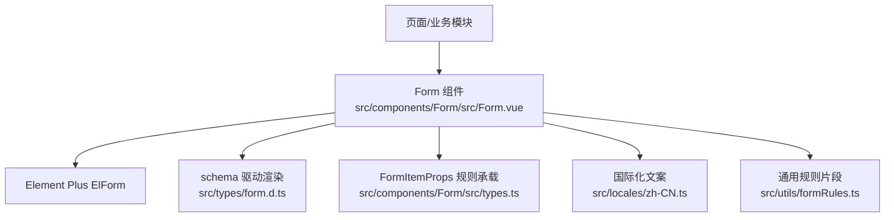
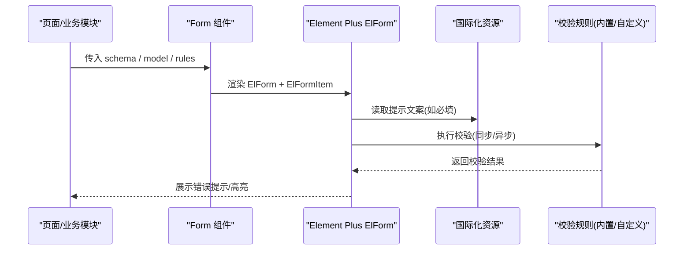
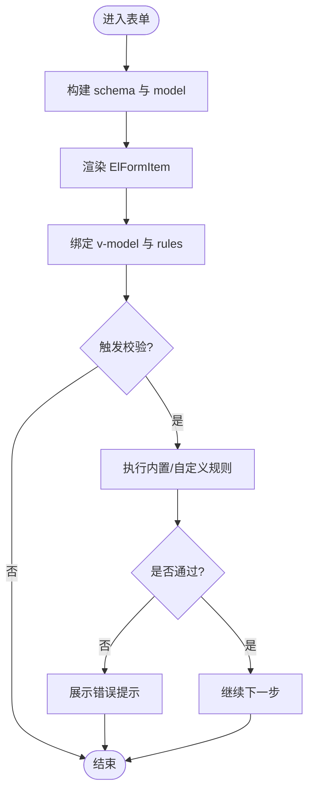
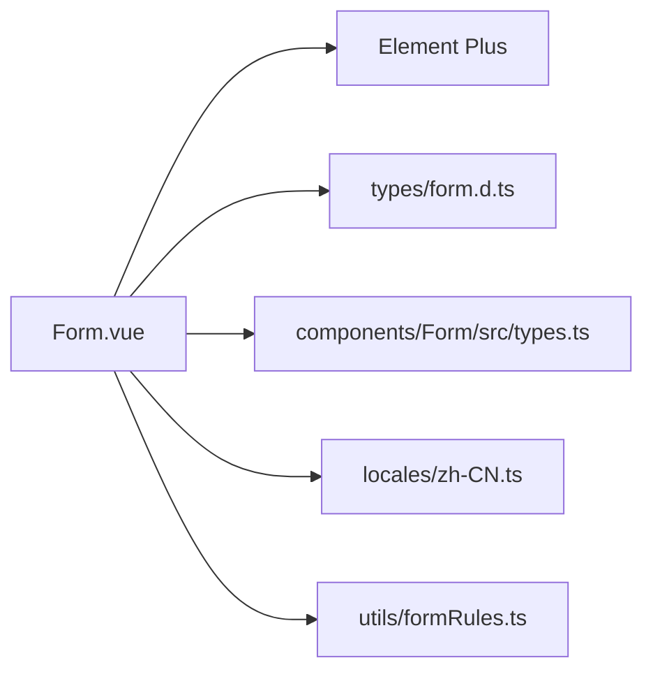

# 表单验证规则

<cite>
**本文引用的文件**
- [formRules.ts](file://yudao-ui-admin-vue3/src/utils/formRules.ts)
- [Form.vue](file://yudao-ui-admin-vue3/src/components/Form/src/Form.vue)
- [types.ts](file://yudao-ui-admin-vue3/src/components/Form/src/types.ts)
- [form.d.ts](file://yudao-ui-admin-vue3/src/types/form.d.ts)
- [zh-CN.ts](file://yudao-ui-admin-vue3/src/locales/zh-CN.ts)
</cite>

## 目录
1. [简介](#简介)
2. [项目结构](#项目结构)
3. [核心组件](#核心组件)
4. [架构总览](#架构总览)
5. [详细组件分析](#详细组件分析)
6. [依赖关系分析](#依赖关系分析)
7. [性能考虑](#性能考虑)
8. [故障排查指南](#故障排查指南)
9. [结论](#结论)
10. [附录：常用验证场景与最佳实践](#附录常用验证场景与最佳实践)

## 简介
本文件面向使用本项目前端表单能力的开发者，系统化说明如何基于 Element Plus 的 ElForm 实现表单验证。内容覆盖：
- 内置验证器的使用方法（必填、格式、范围等）
- 自定义验证器（同步与异步）的实现模式
- 国际化验证消息的配置与使用
- 复杂验证逻辑（条件验证、跨字段验证、动态规则生成）
- 错误提示定制与样式配置
- 结合项目现有 Form 组件与类型定义的最佳实践示例路径

## 项目结构
围绕表单验证的关键代码集中在以下位置：
- 表单渲染与校验入口：Form 组件封装了 Element Plus 的 ElForm，并通过 schema 驱动渲染与数据绑定
- 表单数据结构与规则承载：通过 FormSchema 与 FormItemProps 描述字段、组件属性、校验规则等
- 国际化文案：统一在 locales 中维护，表单默认提示可复用
- 通用规则片段：提供如“必填”等常用规则的复用对象

图表来源
- [Form.vue:1-307](file://yudao-ui-admin-vue3/src/components/Form/src/Form.vue#L1-L307)
- [form.d.ts:1-45](file://yudao-ui-admin-vue3/src/types/form.d.ts#L1-L45)
- [types.ts:1-18](file://yudao-ui-admin-vue3/src/components/Form/src/types.ts#L1-L18)
- [zh-CN.ts:1-466](file://yudao-ui-admin-vue3/src/locales/zh-CN.ts#L1-L466)
- [formRules.ts:1-8](file://yudao-ui-admin-vue3/src/utils/formRules.ts#L1-L8)

章节来源
- [Form.vue:1-307](file://yudao-ui-admin-vue3/src/components/Form/src/Form.vue#L1-L307)
- [form.d.ts:1-45](file://yudao-ui-admin-vue3/src/types/form.d.ts#L1-L45)
- [types.ts:1-18](file://yudao-ui-admin-vue3/src/components/Form/src/types.ts#L1-L18)
- [zh-CN.ts:1-466](file://yudao-ui-admin-vue3/src/locales/zh-CN.ts#L1-L466)
- [formRules.ts:1-8](file://yudao-ui-admin-vue3/src/utils/formRules.ts#L1-L8)

## 核心组件
- Form 组件
  - 基于 ElForm 封装，通过 schema 数组驱动字段渲染与数据绑定
  - 暴露 setValues、setSchema、addSchema、delSchema、getElFormRef 等方法，便于运行时修改结构与值
  - 支持栅格布局、自动 placeholder、loading 等能力
- 类型定义
  - FormSchema：描述字段名、标签、组件、初始值、隐藏、远程选项、组件属性等
  - FormItemProps：承载 labelWidth、required、rules、error、showMessage、inlineMessage、style 等校验相关属性
- 国际化
  - 通过 i18n 的 t('common.required') 等方式获取文案，保证多语言一致性
- 通用规则
  - 提供 required 等常用规则对象，便于在 schema 中复用

章节来源
- [Form.vue:1-307](file://yudao-ui-admin-vue3/src/components/Form/src/Form.vue#L1-L307)
- [form.d.ts:1-45](file://yudao-ui-admin-vue3/src/types/form.d.ts#L1-L45)
- [types.ts:1-18](file://yudao-ui-admin-vue3/src/components/Form/src/types.ts#L1-L18)
- [formRules.ts:1-8](file://yudao-ui-admin-vue3/src/utils/formRules.ts#L1-L8)
- [zh-CN.ts:1-466](file://yudao-ui-admin-vue3/src/locales/zh-CN.ts#L1-L466)

## 架构总览
下图展示了从页面到表单校验的调用链路与数据流向：

图表来源
- [Form.vue:1-307](file://yudao-ui-admin-vue3/src/components/Form/src/Form.vue#L1-L307)
- [zh-CN.ts:1-466](file://yudao-ui-admin-vue3/src/locales/zh-CN.ts#L1-L466)

## 详细组件分析

### 表单渲染与校验流程
- 渲染流程
  - 根据 schema 过滤 hidden 字段并逐项渲染为 ElFormItem
  - 通过 componentMap 解析具体组件，并注入 v-model 绑定 formModel
  - 支持 labelMessage 插槽以显示帮助信息
- 校验流程
  - ElFormItem 的 prop 指向 field，配合 rules 完成校验
  - 可通过 setSchema 动态更新某字段的 rules、required 等
  - 通过 getElFormRef 获取底层 ElForm 实例，调用 validate/validateField/resetFields 等方法

图表来源
- [Form.vue:1-307](file://yudao-ui-admin-vue3/src/components/Form/src/Form.vue#L1-L307)
- [form.d.ts:1-45](file://yudao-ui-admin-vue3/src/types/form.d.ts#L1-L45)
- [types.ts:1-18](file://yudao-ui-admin-vue3/src/components/Form/src/types.ts#L1-L18)

章节来源
- [Form.vue:1-307](file://yudao-ui-admin-vue3/src/components/Form/src/Form.vue#L1-L307)
- [form.d.ts:1-45](file://yudao-ui-admin-vue3/src/types/form.d.ts#L1-L45)
- [types.ts:1-18](file://yudao-ui-admin-vue3/src/components/Form/src/types.ts#L1-L18)

### 类型与数据模型
- FormSchema
  - field：字段唯一标识，用于 v-model 与 rules 绑定
  - component：渲染的组件名称
  - componentProps：组件属性，包含 slots、options 等
  - formItemProps：承载 rules、required、error、showMessage、inlineMessage、style 等
  - value：初始值；hidden：是否隐藏；api：远程加载下拉项
- FormItemProps
  - rules：校验规则集合（可包含内置与自定义规则）
  - required：是否必填（可与 rules 中的 required 协同）
  - error/showMessage/inlineMessage/style：控制错误信息与样式

章节来源
- [form.d.ts:1-45](file://yudao-ui-admin-vue3/src/types/form.d.ts#L1-L45)
- [types.ts:1-18](file://yudao-ui-admin-vue3/src/components/Form/src/types.ts#L1-L18)

### 国际化验证消息
- 默认必填提示通过 i18n 的 common.required 获取，确保多语言一致
- 可在 locales 中扩展更多表单相关文案，并在 schema 或 rules 中引用

章节来源
- [formRules.ts:1-8](file://yudao-ui-admin-vue3/src/utils/formRules.ts#L1-L8)
- [zh-CN.ts:1-466](file://yudao-ui-admin-vue3/src/locales/zh-CN.ts#L1-L466)

## 依赖关系分析
- Form 组件依赖 Element Plus 的 ElForm/ElFormItem
- 依赖 types/form.d.ts 与 components/Form/src/types.ts 提供的类型约束
- 依赖 locales 提供国际化文案
- 依赖 utils/formRules.ts 提供常用规则片段

图表来源
- [Form.vue:1-307](file://yudao-ui-admin-vue3/src/components/Form/src/Form.vue#L1-L307)
- [form.d.ts:1-45](file://yudao-ui-admin-vue3/src/types/form.d.ts#L1-L45)
- [types.ts:1-18](file://yudao-ui-admin-vue3/src/components/Form/src/types.ts#L1-L18)
- [zh-CN.ts:1-466](file://yudao-ui-admin-vue3/src/locales/zh-CN.ts#L1-L466)
- [formRules.ts:1-8](file://yudao-ui-admin-vue3/src/utils/formRules.ts#L1-L8)

章节来源
- [Form.vue:1-307](file://yudao-ui-admin-vue3/src/components/Form/src/Form.vue#L1-L307)
- [form.d.ts:1-45](file://yudao-ui-admin-vue3/src/types/form.d.ts#L1-L45)
- [types.ts:1-18](file://yudao-ui-admin-vue3/src/components/Form/src/types.ts#L1-L18)
- [zh-CN.ts:1-466](file://yudao-ui-admin-vue3/src/locales/zh-CN.ts#L1-L466)
- [formRules.ts:1-8](file://yudao-ui-admin-vue3/src/utils/formRules.ts#L1-L8)

## 性能考虑
- 避免在 schema 中定义过深的嵌套规则，减少校验计算量
- 对大列表或动态字段较多的场景，按需渲染与懒加载 options
- 将耗时校验（如远程校验）改为防抖或延迟触发，避免频繁请求
- 合理使用 required 与 rules.required，避免重复校验

## 故障排查指南
- 校验不生效
  - 确认 ElFormItem 的 prop 与 schema.field 一致
  - 检查 rules 是否正确挂载到对应字段的 formItemProps.rules
- 国际化文案未显示
  - 确认 i18n 已正确引入且 key 存在
- 动态规则未更新
  - 使用 setSchema 更新 rules 后，确保字段值变化触发重新校验
- 错误样式异常
  - 通过 formItemProps.style 或全局样式覆盖，注意优先级

章节来源
- [Form.vue:1-307](file://yudao-ui-admin-vue3/src/components/Form/src/Form.vue#L1-L307)
- [form.d.ts:1-45](file://yudao-ui-admin-vue3/src/types/form.d.ts#L1-L45)
- [types.ts:1-18](file://yudao-ui-admin-vue3/src/components/Form/src/types.ts#L1-L18)

## 结论
本项目通过 Form 组件与类型化 schema 实现了声明式表单与校验的统一管理。借助 Element Plus 的校验能力、i18n 的文案管理与灵活的规则挂载方式，可满足从简单到复杂的各类验证需求。推荐在业务中优先使用 schema 驱动的声明式写法，并将复杂逻辑下沉至自定义规则与工具函数，保持页面简洁与可维护性。

## 附录：常用验证场景与最佳实践

- 必填验证
  - 使用 formRules.required 或在 formItemProps.rules 中添加 required
  - 参考路径：[formRules.ts:1-8](file://yudao-ui-admin-vue3/src/utils/formRules.ts#L1-L8)
- 格式验证（邮箱、手机号、URL、正则等）
  - 在 rules 中使用 Element Plus 内置规则或自定义同步校验函数
  - 参考路径：[form.d.ts:13-21](file://yudao-ui-admin-vue3/src/types/form.d.ts#L13-L21)
- 范围验证（数值区间、日期范围、长度限制）
  - 使用 min/max/length 等内置规则，或通过自定义规则实现
  - 参考路径：[form.d.ts:13-21](file://yudao-ui-admin-vue3/src/types/form.d.ts#L13-L21)
- 自定义同步验证
  - 在 rules 中定义校验函数，返回 true/false 或抛出错误
  - 参考路径：[form.d.ts:13-21](file://yudao-ui-admin-vue3/src/types/form.d.ts#L13-L21)
- 自定义异步验证（如用户名是否存在）
  - 在 rules 中返回 Promise，resolve(true/false) 或 reject(error)
  - 参考路径：[form.d.ts:13-21](file://yudao-ui-admin-vue3/src/types/form.d.ts#L13-L21)
- 条件验证（根据其他字段值决定是否校验）
  - 在自定义规则中读取当前表单值，按条件返回校验结果
  - 参考路径：[form.d.ts:23-44](file://yudao-ui-admin-vue3/src/types/form.d.ts#L23-L44)
- 跨字段验证（如两次密码一致）
  - 在自定义规则中访问父级表单值进行对比
  - 参考路径：[form.d.ts:23-44](file://yudao-ui-admin-vue3/src/types/form.d.ts#L23-L44)
- 动态规则生成
  - 使用 setSchema 动态更新 rules、required、disabled 等
  - 参考路径：[Form.vue:105-114](file://yudao-ui-admin-vue3/src/components/Form/src/Form.vue#L105-L114)
- 国际化验证消息
  - 通过 i18n 的 t('common.required') 获取默认文案，可扩展更多 key
  - 参考路径：[formRules.ts:1-8](file://yudao-ui-admin-vue3/src/utils/formRules.ts#L1-L8)、[zh-CN.ts:1-466](file://yudao-ui-admin-vue3/src/locales/zh-CN.ts#L1-L466)
- 错误提示定制与样式
  - 通过 formItemProps.error/showMessage/inlineMessage/style 控制
  - 参考路径：[form.d.ts:13-21](file://yudao-ui-admin-vue3/src/types/form.d.ts#L13-L21)