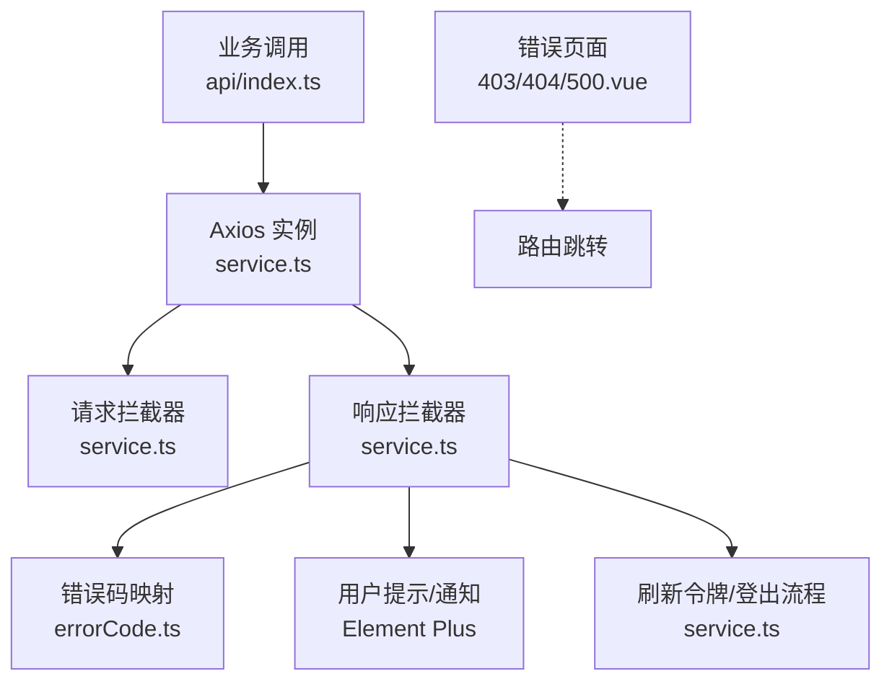
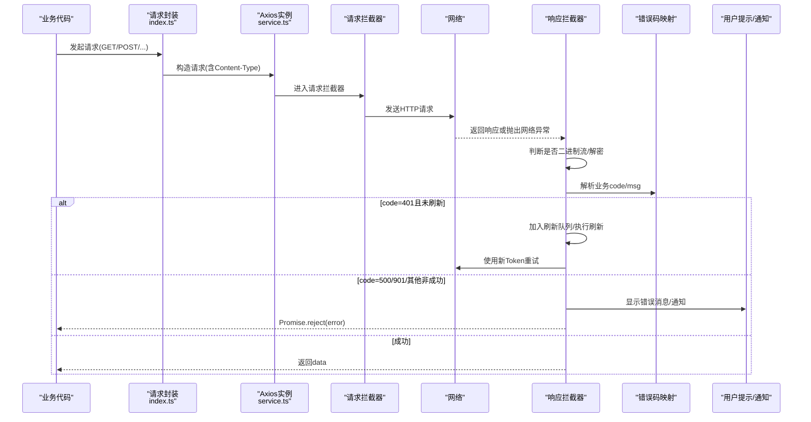
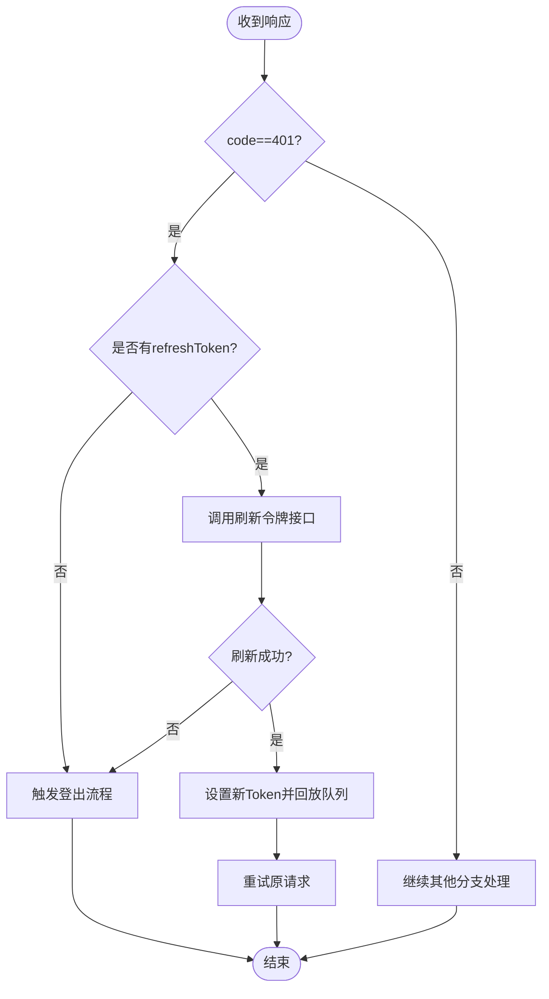
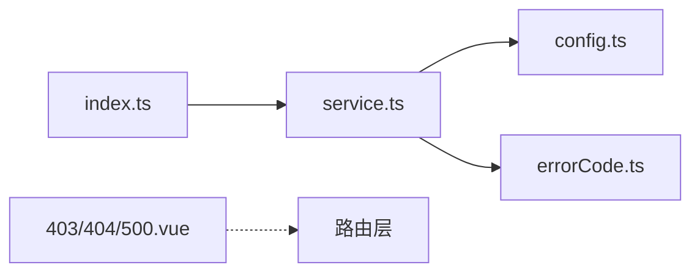

# 错误处理机制

<cite>
**本文引用的文件**
- [service.ts](file://yudao-ui-admin-vue3/src/config/axios/service.ts)
- [config.ts](file://yudao-ui-admin-vue3/src/config/axios/config.ts)
- [index.ts](file://yudao-ui-admin-vue3/src/config/axios/index.ts)
- [errorCode.ts](file://yudao-ui-admin-vue3/src/config/axios/errorCode.ts)
- [403.vue](file://yudao-ui-admin-vue3/src/views/Error/403.vue)
- [404.vue](file://yudao-ui-admin-vue3/src/views/Error/404.vue)
- [500.vue](file://yudao-ui-admin-vue3/src/views/Error/500.vue)
</cite>

## 目录
1. [简介](#简介)
2. [项目结构](#项目结构)
3. [核心组件](#核心组件)
4. [架构总览](#架构总览)
5. [详细组件分析](#详细组件分析)
6. [依赖关系分析](#依赖关系分析)
7. [性能考虑](#性能考虑)
8. [故障排查指南](#故障排查指南)
9. [结论](#结论)
10. [附录](#附录)

## 简介
本文件系统化梳理前端（Vue3 + Axios）的错误处理机制，覆盖网络错误分类与处理、业务错误码映射与提示、全局异常捕获、用户反馈（提示、日志、上报）、重试策略（指数退避与最大重试次数控制），以及开发环境下的调试诊断方法。目标是帮助开发者快速定位问题、统一错误体验并提升系统稳定性。

## 项目结构
本项目的前端错误处理主要围绕 Axios 封装展开，包括请求拦截器、响应拦截器、错误码映射、配置项与通用请求封装；同时提供 4xx/5xx 页面用于路由级错误展示。

图表来源
- [service.ts:38-106](file://yudao-ui-admin-vue3/src/config/axios/service.ts#L38-L106)
- [service.ts:108-239](file://yudao-ui-admin-vue3/src/config/axios/service.ts#L108-L239)
- [errorCode.ts:1-7](file://yudao-ui-admin-vue3/src/config/axios/errorCode.ts#L1-L7)
- [403.vue:1-9](file://yudao-ui-admin-vue3/src/views/Error/403.vue#L1-L9)
- [404.vue:1-8](file://yudao-ui-admin-vue3/src/views/Error/404.vue#L1-L8)
- [500.vue:1-8](file://yudao-ui-admin-vue3/src/views/Error/500.vue#L1-L8)

章节来源
- [service.ts:38-239](file://yudao-ui-admin-vue3/src/config/axios/service.ts#L38-L239)
- [config.ts:1-29](file://yudao-ui-admin-vue3/src/config/axios/config.ts#L1-L29)
- [index.ts:1-48](file://yudao-ui-admin-vue3/src/config/axios/index.ts#L1-L48)
- [errorCode.ts:1-7](file://yudao-ui-admin-vue3/src/config/axios/errorCode.ts#L1-L7)
- [403.vue:1-9](file://yudao-ui-admin-vue3/src/views/Error/403.vue#L1-L9)
- [404.vue:1-8](file://yudao-ui-admin-vue3/src/views/Error/404.vue#L1-L8)
- [500.vue:1-8](file://yudao-ui-admin-vue3/src/views/Error/500.vue#L1-L8)

## 核心组件
- Axios 实例与超时配置：集中管理 base URL、默认请求头、请求超时时间等。
- 请求拦截器：注入 Token、租户信息、防缓存头、表单序列化、可选的 API 加密。
- 响应拦截器：统一解析业务状态码、二进制流处理、错误码映射、国际化提示、无感知刷新令牌、登出流程。
- 错误码映射：HTTP 状态码到用户友好文案的映射表。
- 通用请求封装：对 GET/POST/PUT/DELETE/下载/上传的统一入口，便于统一错误处理。
- 错误页面：403/404/500 路由级错误展示页。

章节来源
- [config.ts:1-29](file://yudao-ui-admin-vue3/src/config/axios/config.ts#L1-L29)
- [service.ts:38-106](file://yudao-ui-admin-vue3/src/config/axios/service.ts#L38-L106)
- [service.ts:108-239](file://yudao-ui-admin-vue3/src/config/axios/service.ts#L108-L239)
- [index.ts:1-48](file://yudao-ui-admin-vue3/src/config/axios/index.ts#L1-L48)
- [errorCode.ts:1-7](file://yudao-ui-admin-vue3/src/config/axios/errorCode.ts#L1-L7)
- [403.vue:1-9](file://yudao-ui-admin-vue3/src/views/Error/403.vue#L1-L9)
- [404.vue:1-8](file://yudao-ui-admin-vue3/src/views/Error/404.vue#L1-L8)
- [500.vue:1-8](file://yudao-ui-admin-vue3/src/views/Error/500.vue#L1-L8)

## 架构总览
下图展示了从业务调用到网络层、再到错误处理的完整链路，包括认证失败时的刷新令牌与队列回放机制。

图表来源
- [index.ts:7-46](file://yudao-ui-admin-vue3/src/config/axios/index.ts#L7-L46)
- [service.ts:38-106](file://yudao-ui-admin-vue3/src/config/axios/service.ts#L38-L106)
- [service.ts:108-239](file://yudao-ui-admin-vue3/src/config/axios/service.ts#L108-L239)
- [errorCode.ts:1-7](file://yudao-ui-admin-vue3/src/config/axios/errorCode.ts#L1-L7)

## 详细组件分析

### 网络错误分类与处理策略
- 网络连接失败（Network Error）：在响应拦截器的错误分支中识别并转换为本地化提示。
- 超时错误（timeout）：根据包含关键字的 message 进行本地化提示。
- HTTP 状态码错误（Request failed with status code XXX）：拼接状态码并提示。
- 二进制响应（blob/arraybuffer）：优先按二进制流处理；若为 JSON 则视为失败并走错误分支。

章节来源
- [service.ts:225-238](file://yudao-ui-admin-vue3/src/config/axios/service.ts#L225-L238)
- [service.ts:133-145](file://yudao-ui-admin-vue3/src/config/axios/service.ts#L133-L145)

### 业务逻辑错误处理（错误码定义、映射与提示）
- 错误码映射：通过 errorCode 将常见 HTTP 状态码映射为用户可读文案。
- 业务状态码：响应体中的 code 字段参与分支判断，如 401、500、901 与非 0/200 的情况分别处理。
- 国际化提示：结合 i18n 的 key 输出多语言错误消息。
- 特殊错误：901 会附带引导链接提示，便于本地环境搭建排障。

章节来源
- [errorCode.ts:1-7](file://yudao-ui-admin-vue3/src/config/axios/errorCode.ts#L1-L7)
- [service.ts:146-223](file://yudao-ui-admin-vue3/src/config/axios/service.ts#L146-L223)

### 全局错误捕获机制
- Axios 响应错误分支：统一捕获网络异常并进行本地化提示后 reject。
- 业务错误分支：对特定 code 进行差异化处理（如 500、901）。
- 路由级错误页面：403/404/500 页面作为兜底展示，支持点击返回首页。
- 注意：当前仓库未实现 Vue 错误边界（errorCaptured/errorBoundary），如需全局 UI 级捕获可在应用根组件或框架层补充。

章节来源
- [service.ts:225-238](file://yudao-ui-admin-vue3/src/config/axios/service.ts#L225-L238)
- [service.ts:195-223](file://yudao-ui-admin-vue3/src/config/axios/service.ts#L195-L223)
- [403.vue:1-9](file://yudao-ui-admin-vue3/src/views/Error/403.vue#L1-L9)
- [404.vue:1-8](file://yudao-ui-admin-vue3/src/views/Error/404.vue#L1-L8)
- [500.vue:1-8](file://yudao-ui-admin-vue3/src/views/Error/500.vue#L1-L8)

### 用户反馈机制（提示、日志、上报）
- 提示：使用 Element Plus 的消息/通知组件对用户可见错误进行即时反馈。
- 日志：控制台输出用于开发与调试（请求/响应错误分支均有 console 输出）。
- 上报：当前仓库未集成统一的错误上报通道；可在响应拦截器错误分支扩展上报逻辑（例如聚合上报 SDK）。

章节来源
- [service.ts:195-223](file://yudao-ui-admin-vue3/src/config/axios/service.ts#L195-L223)
- [service.ts:225-238](file://yudao-ui-admin-vue3/src/config/axios/service.ts#L225-L238)

### 重试机制（指数退避与最大重试次数）
- 当前实现：针对 401 场景实现了“无感知刷新令牌”的重试（刷新成功后回放队列并重试当前请求）。
- 建议扩展：对于幂等 GET 请求或可重试的业务接口，可在上层封装中添加指数退避重试（初始延迟、倍增系数、最大重试次数、仅重试网络/超时错误），避免对写操作造成副作用。

章节来源
- [service.ts:152-194](file://yudao-ui-admin-vue3/src/config/axios/service.ts#L152-L194)

### 认证与令牌刷新流程
- 白名单：登录与刷新令牌接口不携带 Token。
- 刷新策略：首次遇到 401 时尝试刷新令牌；成功则更新 Token 并回放等待队列与当前请求；失败则触发登出流程。
- 队列机制：刷新期间将后续请求挂起，待刷新完成后统一重试。

图表来源
- [service.ts:152-194](file://yudao-ui-admin-vue3/src/config/axios/service.ts#L152-L194)
- [service.ts:245-270](file://yudao-ui-admin-vue3/src/config/axios/service.ts#L245-L270)

## 依赖关系分析
- index.ts 依赖 service.ts 提供的 axios 实例，并对方法进行统一封装。
- service.ts 依赖 config.ts 的基础配置（base_url、超时、默认头）。
- service.ts 依赖 errorCode.ts 进行错误码映射。
- 错误页面 403/404/500 通过路由挂载，独立于网络层但共同构成错误体验闭环。

图表来源
- [index.ts:1-48](file://yudao-ui-admin-vue3/src/config/axios/index.ts#L1-L48)
- [service.ts:38-239](file://yudao-ui-admin-vue3/src/config/axios/service.ts#L38-L239)
- [config.ts:1-29](file://yudao-ui-admin-vue3/src/config/axios/config.ts#L1-L29)
- [errorCode.ts:1-7](file://yudao-ui-admin-vue3/src/config/axios/errorCode.ts#L1-L7)
- [403.vue:1-9](file://yudao-ui-admin-vue3/src/views/Error/403.vue#L1-L9)
- [404.vue:1-8](file://yudao-ui-admin-vue3/src/views/Error/404.vue#L1-L8)
- [500.vue:1-8](file://yudao-ui-admin-vue3/src/views/Error/500.vue#L1-L8)

章节来源
- [index.ts:1-48](file://yudao-ui-admin-vue3/src/config/axios/index.ts#L1-L48)
- [service.ts:38-239](file://yudao-ui-admin-vue3/src/config/axios/service.ts#L38-L239)
- [config.ts:1-29](file://yudao-ui-admin-vue3/src/config/axios/config.ts#L1-L29)
- [errorCode.ts:1-7](file://yudao-ui-admin-vue3/src/config/axios/errorCode.ts#L1-L7)
- [403.vue:1-9](file://yudao-ui-admin-vue3/src/views/Error/403.vue#L1-L9)
- [404.vue:1-8](file://yudao-ui-admin-vue3/src/views/Error/404.vue#L1-L8)
- [500.vue:1-8](file://yudao-ui-admin-vue3/src/views/Error/500.vue#L1-L8)

## 性能考虑
- 请求超时：默认 30 秒，可根据业务调整以平衡用户体验与资源占用。
- 并发刷新：通过请求队列避免重复刷新令牌，减少不必要的网络开销。
- 二进制流：直接返回 blob/arraybuffer，避免额外解析成本；仅在检测到 JSON 时才转为错误路径。
- 建议：对高频查询增加缓存策略（如内存缓存/浏览器缓存），降低重复请求带来的错误概率与负载。

章节来源
- [config.ts:10-19](file://yudao-ui-admin-vue3/src/config/axios/config.ts#L10-L19)
- [service.ts:133-145](file://yudao-ui-admin-vue3/src/config/axios/service.ts#L133-L145)
- [service.ts:152-194](file://yudao-ui-admin-vue3/src/config/axios/service.ts#L152-L194)

## 故障排查指南
- 网络错误
  - 现象：提示“网络错误”或“请求失败”。
  - 排查：检查代理/跨域/网关可达性；确认 baseURL 与端口；查看浏览器网络面板。
- 超时错误
  - 现象：提示“请求超时”。
  - 排查：增大 request_timeout；检查后端耗时；必要时拆分请求或引入分页。
- 认证失败（401）
  - 现象：弹出重新登录提示或直接跳转登录。
  - 排查：确认 refreshToken 是否存在；检查刷新接口连通性；观察是否被忽略消息命中导致无法恢复。
- 业务错误（500/901/其他）
  - 现象：弹窗或通知提示具体错误信息。
  - 排查：查看后端日志；核对入参；关注 901 的本地环境搭建指引。
- 二进制下载失败
  - 现象：下载内容为 JSON 而非文件。
  - 排查：确认后端返回类型；检查响应头 Content-Type；确保未误判为 JSON 错误分支。

章节来源
- [service.ts:225-238](file://yudao-ui-admin-vue3/src/config/axios/service.ts#L225-L238)
- [service.ts:195-223](file://yudao-ui-admin-vue3/src/config/axios/service.ts#L195-L223)
- [service.ts:133-145](file://yudao-ui-admin-vue3/src/config/axios/service.ts#L133-L145)
- [config.ts:10-19](file://yudao-ui-admin-vue3/src/config/axios/config.ts#L10-L19)

## 结论
该前端错误处理方案以 Axios 为中心，覆盖了网络异常、业务错误码、认证刷新与登出、用户提示与日志记录等关键环节。建议在现有基础上：
- 在上层封装中补充通用的指数退避重试（限幂等请求）。
- 接入统一错误上报通道，形成线上可观测闭环。
- 在应用层补充 Vue 错误边界，完善 UI 级全局异常捕获。
- 持续优化错误文案与国际化，提升多语言用户体验。

## 附录
- 关键配置项说明
  - base_url：API 基础路径，由环境变量拼接而成。
  - result_code：接口成功状态码（默认 200）。
  - request_timeout：请求超时时间（毫秒）。
  - default_headers：默认请求内容类型（application/json）。
- 错误码映射示例
  - 401：认证失败，无法访问系统资源
  - 403：当前操作没有权限
  - 404：访问资源不存在
  - 默认：系统未知错误，请反馈给管理员

章节来源
- [config.ts:1-29](file://yudao-ui-admin-vue3/src/config/axios/config.ts#L1-L29)
- [errorCode.ts:1-7](file://yudao-ui-admin-vue3/src/config/axios/errorCode.ts#L1-L7)