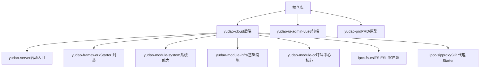
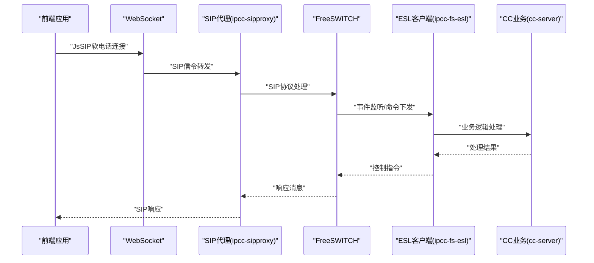
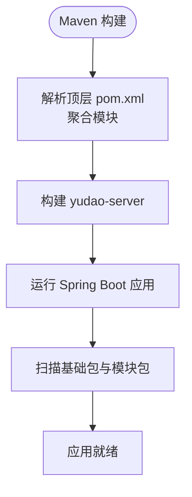
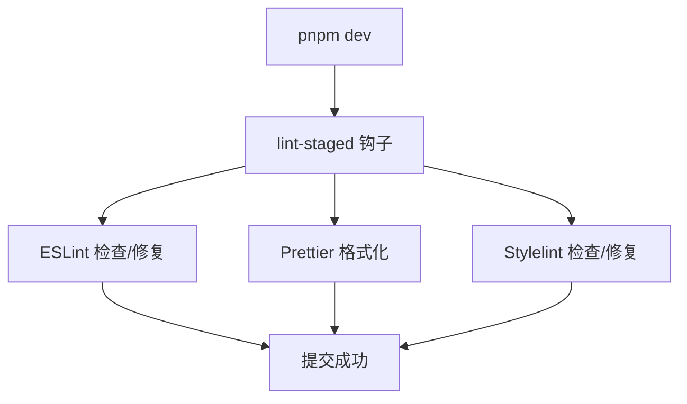
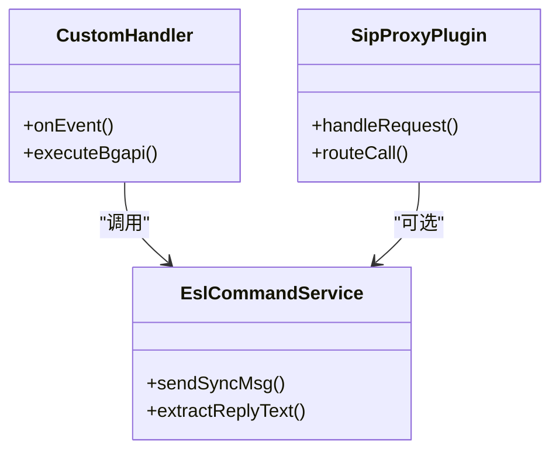
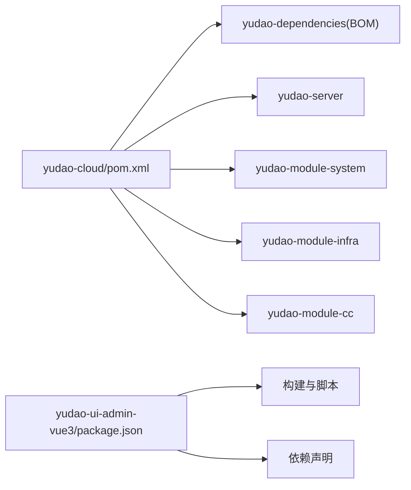
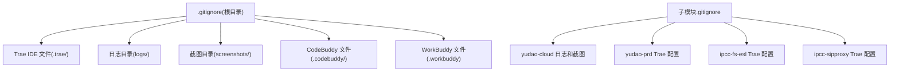

# 开发指南

<cite>
**本文引用的文件**
- [AGENTS.md](file://AGENTS.md)
- [README.md](file://README.md)
- [pom.xml](file://yudao-cloud/pom.xml)
- [yudao-dependencies/pom.xml](file://yudao-cloud/yudao-dependencies/pom.xml)
- [package.json](file://yudao-ui-admin-vue3/package.json)
- [eslint.config.mjs](file://yudao-ui-admin-vue3/eslint.config.mjs)
- [lint-staged.config.mjs](file://yudao-ui-admin-vue3/lint-staged.config.mjs)
- [.gitignore](file://.gitignore)
- [yudao-cloud/.gitignore](file://yudao-cloud/.gitignore)
- [yudao-prd/.gitignore](file://yudao-prd/.gitignore)
- [yudao-cloud/yudao-module-cc/ipcc-fs-esl/AGENTS.md](file://yudao-cloud/yudao-module-cc/ipcc-fs-esl/AGENTS.md)
- [yudao-cloud/yudao-module-cc/ipcc-sipproxy/AGENTS.md](file://yudao-cloud/yudao-module-cc/ipcc-sipproxy/AGENTS.md)
- [yudao-prd/AGENTS.md](file://yudao-prd/AGENTS.md)
</cite>

## 更新摘要
**变更内容**
- 技术栈从 Java 17 + Spring Boot 3.5 升级到 JDK 25 + Spring Boot 4.1
- 更新了 Maven 编译器插件配置以支持 JDK 22+ 的注解处理器要求
- 调整了依赖管理版本以兼容 Spring Boot 4.x
- 增强了编译参数配置以解决 JDK 25 的兼容性要求
- 更新了相关工具和框架的版本信息

## 目录
1. [简介](#简介)
2. [项目结构](#项目结构)
3. [核心组件](#核心组件)
4. [架构总览](#架构总览)
5. [详细组件分析](#详细组件分析)
6. [依赖分析](#依赖分析)
7. [性能考虑](#性能考虑)
8. [故障排查指南](#故障排查指南)
9. [结论](#结论)
10. [附录](#附录)

## 简介

本指南面向呼叫中心（CC）二次开发团队，基于 yudao-cloud 框架进行后端、前端与产品文档的协同开发。项目采用单体启动模式，核心业务集中在
yudao-module-cc；前端为 Vue 3.5 + Vite 8 + Element Plus + TypeScript；产品需求文档与原型以纯 HTML 形式维护。 **重要更新**
：项目已升级至 JDK 25 + Spring Boot
4.1，需要相应的开发环境适配。本文档覆盖开发规范、提交与分支策略、扩展开发方法（自定义处理器/插件/第三方集成）、工具链配置与调试、代码审查标准、质量保证流程、持续集成建议、新功能开发与版本升级注意事项，以及团队协作最佳实践。

## 项目结构
仓库由三个 Git 子模块组成，各自独立提交与分支：

| 目录                   | 说明                                                 | 技术栈                                                            |
|------------------------|------------------------------------------------------|-------------------------------------------------------------------|
| `yudao-cloud/`         | 后端微服务（含自定义呼叫中心模块 `yudao-module-cc`） | **JDK 25 + Spring Boot 4.1 + Spring Cloud 2025.1 + Maven 多模块** |
| `yudao-ui-admin-vue3/` | 管理后台前端                                         | Vue 3.5 + TypeScript + Vite 8 + Element Plus + pnpm               |
| `yudao-prd/`           | 产品需求文档静态站点（纯 HTML，无构建）              | Vue 3 CDN + Element Plus                                          |

首次拉取需执行 `git submodule update --init --recursive`。子模块内已有更详细的 AGENTS.md，进入对应目录工作前先阅读。

**图表来源**
- [AGENTS.md:5-15](file://AGENTS.md#L5-L15)

**章节来源**
- [AGENTS.md:5-15](file://AGENTS.md#L5-L15)
- [AGENTS.md:17-47](file://AGENTS.md#L17-L47)

## 核心组件
- 后端启动与模块装配
  - `yudao-server` 是聚合启动容器（dev 环境端口 48080），业务模块以 Maven 依赖方式聚合。
  - Nacos 注册发现与配置中心默认禁用，配置以本地 YAML 为主。
  - 当前仅启用 system、infra、ai、cc 四个业务模块。
- 核心业务模块
  - yudao-module-cc：包含 autocall/call/esl/flow/fs/sipproxy/sys 等子域，提供呼叫中心核心能力。
  - ipcc-fs-esl：基于 Netty 的 FreeSWITCH ESL 客户端，负责监控、拦截、指标与路由。
  - ipcc-sipproxy：SIP 代理 Starter，支持 SPI 扩展。
- 前端工程
  - 使用 Vite 构建，API 基地址与环境变量在 .env.* 中配置，页面与接口按模块组织。

**章节来源**
- [AGENTS.md:48-67](file://AGENTS.md#L48-L67)
- [pom.xml:10-33](file://yudao-cloud/pom.xml#L10-L33)

## 架构总览
整体采用"单体服务 + 多模块"的后端架构，前端独立工程通过 HTTP API 与后端交互。关键数据流如下：
- 前端发起请求 → 网关/直连后端 Controller → Service 层处理 → Mapper/MyBatis Plus 访问数据库 → 缓存/消息队列（按需）→ 返回结果。
- 呼叫中心信令链路：JsSIP 软电话（前端）→ 浏览器 WebSocket → SIP 代理（ipcc-sipproxy）→ FreeSWITCH（媒体与拨号）→ ESL 客户端（ipcc-fs-esl）→ cc-server 业务编排。

**图表来源**
- [AGENTS.md:60-67](file://AGENTS.md#L60-L67)

## 详细组件分析

### 后端模块与启动装配
- 启动入口与模块聚合
    - 顶层 pom.xml 定义模块列表与统一版本管理，当前启用 system、infra、ai、cc。
  - 通过注解处理器与编译参数确保 Lombok + MapStruct 正常工作。
    - **重要更新**：已配置 `<proc>full</proc>` 以支持 JDK 22+ 的注解处理器要求。
- 关键约定
  - 启动类扫描指定包路径，加载业务模块。
  - 禁用 Nacos，本地通过 application-local.yaml 配置数据库与 Redis。

**图表来源**
- [pom.xml:10-33](file://yudao-cloud/pom.xml#L10-L33)
- [pom.xml:67-116](file://yudao-cloud/pom.xml#L67-L116)

**章节来源**
- [pom.xml:10-33](file://yudao-cloud/pom.xml#L10-L33)
- [pom.xml:67-116](file://yudao-cloud/pom.xml#L67-L116)

### 前端工程与质量保障
- 构建与脚本
  - 使用 pnpm 管理依赖，提供 dev/build/lint 等脚本，支持多环境构建。
- 代码质量
  - ESLint + Prettier + Stylelint 组合，配合 lint-staged 在提交前自动修复。
  - TypeScript 类型检查与 UnoCSS 原子化样式。

**图表来源**
- [package.json:7-29](file://yudao-ui-admin-vue3/package.json#L7-L29)
- [eslint.config.mjs:1-118](file://yudao-ui-admin-vue3/eslint.config.mjs#L1-L118)
- [lint-staged.config.mjs:1-13](file://yudao-ui-admin-vue3/lint-staged.config.mjs#L1-L13)

**章节来源**
- [package.json:7-29](file://yudao-ui-admin-vue3/package.json#L7-L29)
- [eslint.config.mjs:1-118](file://yudao-ui-admin-vue3/eslint.config.mjs#L1-L118)
- [lint-staged.config.mjs:1-13](file://yudao-ui-admin-vue3/lint-staged.config.mjs#L1-L13)

### 扩展开发：自定义处理器与插件
- 自定义 ESL 处理器
  - 在 cc 模块的 esl/ 目录下实现节点处理器，遵循既有工厂与事件模型，复用 EslCommandService 发送命令。
  - 使用 sendSyncMsg + extractReplyText 执行 bgapi 命令，避免阻塞主线程。
- SIP 代理插件
  - 基于 ipcc-sipproxy 的 SPI 机制扩展 SIP 行为，保持常量集中管理，不重复定义。
- 第三方集成
  - 通过 REST/ESL/Redis/MQ 等方式对接外部系统，注意异常捕获与资源释放。

**图表来源**
- [AGENTS.md:39-40](file://AGENTS.md#L39-L40)
- [AGENTS.md:133-138](file://AGENTS.md#L133-L138)

**章节来源**
- [AGENTS.md:39-40](file://AGENTS.md#L39-L40)
- [AGENTS.md:133-138](file://AGENTS.md#L133-L138)

### IVR 流程引擎
`cc-server` 的 `ivr/` 包实现状态机驱动的 IVR 流程引擎：`handler/node/` 下每个节点类型一个处理器（start / condition / playback / receive / transfer / end / hangup / satisfaction / method），节点间通过 `dto/` 流转输出值，流程状态持久化到 Redis（`config/` + `properties/`）。

**章节来源**
- [AGENTS.md:64-67](file://AGENTS.md#L64-L67)

## 依赖分析
- 后端依赖管理
  - 顶层 pom.xml 引入 yudao-dependencies BOM，统一管理版本；启用 maven-surefire-plugin、maven-compiler-plugin，配置注解处理器。
  - **重要更新**：Spring Boot 版本已升级至 4.1.0，Java 版本升级至 25。
- 前端依赖管理
  - package.json 定义运行时与开发时依赖，scripts 提供构建与质量检查命令。

**图表来源**
- [pom.xml:10-33](file://yudao-cloud/pom.xml#L10-L33)
- [pom.xml:55-65](file://yudao-cloud/pom.xml#L55-L65)
- [pom.xml:67-116](file://yudao-cloud/pom.xml#L67-L116)
- [package.json:31-143](file://yudao-ui-admin-vue3/package.json#L31-L143)

**章节来源**
- [pom.xml:10-33](file://yudao-cloud/pom.xml#L10-L33)
- [pom.xml:55-65](file://yudao-cloud/pom.xml#L55-L65)
- [pom.xml:67-116](file://yudao-cloud/pom.xml#L67-L116)
- [package.json:31-143](file://yudao-ui-admin-vue3/package.json#L31-L143)

## 性能考虑
- 后端
  - 使用线程池替代 new Thread；Netty Channel、数据库连接、文件流等资源必须正确关闭；Redis key 设置 TTL。
  - 异步任务异常需独立捕获，避免影响主流程。
- 前端
  - 合理使用懒加载与虚拟滚动；避免大对象频繁创建；网络请求合并与重试策略优化。
- 通用
  - 日志分级与采样；热点接口加缓存；慢查询分析与索引优化。

**章节来源**
- [AGENTS.md:73-79](file://AGENTS.md#L73-L79)

## 故障排查指南
- 常见问题定位
  - 后端：通过 ij-debugger 技能获取变量、调用栈、线程状态与异常信息；关注外部调用（ESL/HTTP/Redis）异常是否中断主流程。
  - 前端：浏览器真实操作验证页面修改；检查环境变量与 API 基地址；查看网络请求与错误码。
- 数据库与初始化
  - 优先使用 MySQL MCP 执行 SQL；确认系统表与 cc 业务表已初始化。
- 配置问题
  - 检查 application-local.yaml 与 .env.* 配置；确认多租户忽略规则与加密密钥。
- 关键约束检查
  - 软电话心跳：sipproxy WebSocket 空闲超时与 JsSIP 客户端 OPTIONS 心跳间隔必须匹配。
  - fs-esl 约束：仅支持 Inbound 模式；事件订阅与命令必须异步。
  - WebSocket sender-type 一致性：分布式环境下 CC 消息跨节点投递配置。
- **新增**：JDK 25 兼容性检查
    - 确保所有模块都配置了正确的注解处理器路径
    - 检查 Lombok 生成的 getter/setter 方法是否正确生成
    - 验证 Spring Boot 4.x 的配置属性变化

**章节来源**
- [AGENTS.md:73-86](file://AGENTS.md#L73-L86)

## 结论

本项目以 yudao-cloud 为基础，聚焦呼叫中心场景，采用单体启动与多模块架构，前后端分离，强调代码质量与可维护性。 **重要更新**
：项目已成功升级至 JDK 25 + Spring Boot 4.1，提供了更好的性能和现代 Java
特性支持。通过严格的代码规范、自动化质量检查与清晰的扩展点设计，团队可高效开展新功能开发与系统集成。建议在迭代中持续完善测试覆盖率、性能基准与监控告警，保障系统稳定演进。

## 附录

### 开发环境与工具
- 后端
    - **重要更新**：构建环境要求 **JDK 25**（根 pom `java.version=25`、revision `2026.07-jdk25-SNAPSHOT`；JDK 17
      无法编译当前分支，旧环境线见 `master-jdk17-cc` 分支）。
  - 命令：mvn clean install / mvn spring-boot:run 本地启动；单测命令参考 AGENTS.md。
  - 调试：ij-debugger 技能用于运行/调试/编译与抓取调试数据。
- 前端
  - 命令：pnpm install / pnpm dev / pnpm build:* / pnpm lint:*。
  - 质量：ESLint、Prettier、Stylelint 与 lint-staged 提交前检查。

**章节来源**
- [AGENTS.md:17-47](file://AGENTS.md#L17-L47)
- [package.json:7-29](file://yudao-ui-admin-vue3/package.json#L7-L29)
- [eslint.config.mjs:1-118](file://yudao-ui-admin-vue3/eslint.config.mjs#L1-L118)
- [lint-staged.config.mjs:1-13](file://yudao-ui-admin-vue3/lint-staged.config.mjs#L1-L13)

### 代码规范与提交规范
- 代码规范
  - 后端：分层架构、常量类、import 顺序、工具类、注释、异常处理、资源管理、命名规范。
  - 前端：魔法值处理、枚举一致性、字典使用、TypeScript 严格模式。
- 提交规范
  - 使用 commitlint 与 lint-staged 在提交前执行 ESLint/Prettier/Stylelint 自动修复。
- 分支管理策略（建议）
  - main：受保护的生产分支，仅允许合并经过评审的代码。
  - develop：集成分支，日常功能开发在此合并。
  - feature/*：功能分支，从 develop 切出，完成后提 PR 到 develop。
  - hotfix/*：紧急修复分支，从 main 切出，完成后合并至 main 与 develop。
  - 所有变更需通过代码审查与自动化检查。

**章节来源**
- [AGENTS.md:81-86](file://AGENTS.md#L81-L86)
- [package.json:98-143](file://yudao-ui-admin-vue3/package.json#L98-L143)

### 版本控制配置与管理

#### Git 忽略规则配置
项目采用多层级 .gitignore 配置，确保不同环境和工具的临时文件不被提交：

**根目录配置**
- 新增 Trae IDE 相关文件忽略：`.trae/`
- 新增日志目录忽略：`logs/`
- 新增截图目录忽略：`screenshots/`
- 新增 CodeBuddy 相关忽略：`.codebuddy/`
- **新增 WorkBuddy 相关忽略：`.workbuddy`**
- 保留原有的 IDE、构建产物、依赖管理等忽略规则

**子模块配置**
- `yudao-cloud/.gitignore`：新增 `logs/` 和 `screenshots/` 忽略规则
- `yudao-prd/.gitignore`：新增 Trae IDE 相关忽略规则（`.trae/specs/`、`.trae/documents/`）
- `ipcc-fs-esl/.gitignore`：新增 Trae IDE 相关忽略规则
- `ipcc-sipproxy/.gitignore`：新增 Trae IDE 规则和 Python 相关忽略

**图表来源**
- [.gitignore:81-86](file://.gitignore#L81-L86)
- [yudao-cloud/.gitignore:58-59](file://yudao-cloud/.gitignore#L58-L59)
- [yudao-prd/.gitignore:77-79](file://yudao-prd/.gitignore#L77-L79)
- [yudao-cloud/yudao-module-cc/ipcc-fs-esl/.gitignore:80-82](file://yudao-cloud/yudao-module-cc/ipcc-fs-esl/.gitignore#L80-L82)
- [yudao-cloud/yudao-module-cc/ipcc-sipproxy/.gitignore:80-82](file://yudao-cloud/yudao-module-cc/ipcc-sipproxy/.gitignore#L80-L82)

**章节来源**
- [.gitignore:81-86](file://.gitignore#L81-L86)
- [yudao-cloud/.gitignore:58-59](file://yudao-cloud/.gitignore#L58-L59)
- [yudao-prd/.gitignore:77-79](file://yudao-prd/.gitignore#L77-L79)
- [yudao-cloud/yudao-module-cc/ipcc-fs-esl/.gitignore:80-82](file://yudao-cloud/yudao-module-cc/ipcc-fs-esl/.gitignore#L80-L82)
- [yudao-cloud/yudao-module-cc/ipcc-sipproxy/.gitignore:80-82](file://yudao-cloud/yudao-module-cc/ipcc-sipproxy/.gitignore#L80-L82)

### 扩展开发方法
- 自定义处理器
  - 在 cc 模块的 esl/ 下新增处理器，遵循工厂注册与事件模型，复用 EslCommandService。
- 插件开发
  - 基于 ipcc-sipproxy 的 SPI 扩展 SIP 行为，保持常量集中管理。
- 第三方集成
  - 通过 REST/ESL/Redis/MQ 对接外部系统，注意异常捕获与资源释放。

**章节来源**
- [AGENTS.md:39-40](file://AGENTS.md#L39-L40)
- [AGENTS.md:133-138](file://AGENTS.md#L133-L138)

### 代码审查标准与质量保证
- 审查清单
  - 魔法值、枚举一致、类型完整、常量类、Service 注释、import 规范、无用代码、字段命名、业务校验、ESL 命令、模块边界、异常处理、资源管理、并发安全。
- 质量保证流程
  - 本地自检：pnpm lint / mvn test。
  - 提交前检查：lint-staged 自动修复。
  - 合并前审查：至少一名负责人审核通过。

**章节来源**
- [AGENTS.md:114-132](file://AGENTS.md#L114-L132)
- [package.json:22-29](file://yudao-ui-admin-vue3/package.json#L22-L29)

### 持续集成配置（建议）
- 后端
  - 流水线步骤：检出代码 → 安装依赖 → 编译 → 单元测试 → 打包产物。
  - 报告与归档：生成测试报告与制品归档。
- 前端
  - 流水线步骤：安装依赖 → 类型检查 → 代码质量检查 → 构建产物。
  - 部署：将静态资源发布至 CDN 或对象存储。

[本节为通用建议，未直接引用具体文件]

### 新功能开发与现有功能修改
- 新功能
  - 明确需求与边界，设计接口与数据模型，编写单测与文档。
  - 后端：Controller → Service → Mapper，添加必要校验与异常处理。
  - 前端：新增页面与 API，遵循目录约定与类型定义。
- 现有功能修改
  - 评估影响范围，更新相关接口与文档，回归测试覆盖。
  - 如涉及 ACL/ESL/SIP，需按约束下发配置重载与命令。

**章节来源**
- [AGENTS.md:133-138](file://AGENTS.md#L133-L138)

### 版本升级注意事项
- **重要更新**：后端已从 Java 17 + Spring Boot 3.5 升级到 **JDK 25 + Spring Boot 4.1**
    - 关注 Spring Boot 4.1 的新特性和废弃 API
    - 检查注解处理器配置，确保 JDK 22+ 兼容性
    - 验证所有依赖库的兼容性
- 前端
  - 关注 Vue 3.5、Vite 8、Element Plus、TypeScript 版本升级；检查构建脚本与依赖兼容性。
- 数据库
  - 升级前备份，执行迁移脚本，验证数据完整性。

**章节来源**
- [pom.xml:42-52](file://yudao-cloud/pom.xml#L42-L52)
- [package.json:154-157](file://yudao-ui-admin-vue3/package.json#L154-L157)

### 团队协作与沟通规范
- 协作
  - 使用分支与 PR 管理变更；提交信息清晰描述变更内容；代码审查必过。
- 沟通
  - 需求变更及时同步；问题定位共享日志与截图；重要决策记录在文档或 Wiki。
- 工具
  - 使用 ij-debugger 与 MySQL MCP 提升效率；前端页面修改后通过浏览器真实操作验证。
- **更新** 新增 Trae IDE 和 WorkBuddy 工具支持，团队成员可使用这些 AI 辅助开发工具，相关配置文件已纳入版本控制管理。

**章节来源**
- [AGENTS.md:81-86](file://AGENTS.md#L81-L86)

### 关键约束与陷阱
- **软电话心跳**：sipproxy WebSocket 空闲超时与 JsSIP 客户端 OPTIONS 心跳间隔必须匹配，否则坐席注册后会被僵尸会话清理，导致来话失败。
- **fs-esl 约束**：仅支持 Inbound 模式；事件订阅与命令必须异步（Netty IO 线程内阻塞会死锁）；API 命令必须带 api 前缀，bgapi 是平级独立命令。
- **WebSocket sender-type 一致性**：cc.websocket.sender-type 必须与 yudao.websocket.sender-type 一致，否则分布式环境下 CC 消息无法跨节点投递。
- **编译要求（JDK 25）**：根 pom 已配置 Lombok + MapStruct 注解处理器、`-parameters` 编译参数与显式 `<proc>full</proc>`（JDK
  22+ 默认禁用 classpath 隐式注解处理，独立 POM 模块升级 JDK 时最容易踩 Lombok 找不到符号的坑，需同步补
  annotationProcessorPaths）；JAIN-SIP 版本必须统一为 1.2.1.4，避免跨版本 AbstractMethodError。
- **Spring Boot 4 约束**：`spring.autoconfigure.exclude` 配置在 `application.yaml`（含 `spring.profiles.active`
  的文档）中不生效，必须放在 `application-{profile}.yaml`；spring-ai-alibaba 2.0.0-M1.1 的 `AutoConfiguration.imports` 注册了
  JAR 中不存在的类（如 DashScopeMultimodalEmbeddingAutoConfiguration），需在 profile 配置中排除，遇 "Unable to read
  meta-data for class X" 先用 `unzip -l` 核对类是否真实存在。
- **提交注意**：三个子仓库各自独立提交推送，需在对应目录内执行 git 操作；`yudao-cloud` 双分支并行维护（当前工作线
  `master-jdk25-cc`，旧环境线 `master-jdk17-cc`），提交前确认分支与推送目标一致。

**章节来源**
- [AGENTS.md:73-79](file://AGENTS.md#L73-L79)

### PRD 项目特殊规范
- **无构建工具**：PRD 项目为纯 HTML 静态站点，浏览器直接打开 index.html 即可使用。
- **双编码体系**：PRD 文档页面与产品原型页面有独立的编码规范，需严格区分。
- **需求标注系统**：产品原型页面包含完整的需求标注功能，包含悬浮面板、数字编号徽章和需求数据 JSON。
- **禁止事项**：禁止引入构建工具、禁止创建 .md 文档文件、禁止直接复制其他项目的 JS/CSS 文件。

**章节来源**
- [yudao-prd/AGENTS.md:1-719](file://yudao-prd/AGENTS.md#L1-L719)

### 技术栈版本详情

#### 后端技术栈
- **JDK 25**：最新 LTS 版本，提供更好的性能和内存管理，支持现代 Java 特性
- **Spring Boot 4.1.0**：最新稳定版本，支持现代 Java 特性和云原生开发
- **Spring Cloud 2025.1.2**：微服务生态的最新版本
- **Maven 多模块架构**：统一的依赖管理和构建流程
- **核心组件**：
    - ipcc-fs-esl：基于 Netty 4.2.15 的 FreeSWITCH ESL 客户端
  - ipcc-sipproxy：SIP over WebSocket B2BUA 代理服务
  - yudao-module-cc：呼叫中心核心业务模块

#### 前端技术栈
- **Vue 3.5.34**：最新 Vue 3 版本，提供更好的响应式系统和性能
- **Vite 8.1.4**：现代化构建工具，更快的开发体验
- **Element Plus 2.13.7**：Vue 3 组件库
- **TypeScript 6.0.3**：类型安全的 JavaScript 超集
- **开发工具**：pnpm、ESLint、Prettier、Stylelint

**章节来源**
- [pom.xml:42-52](file://yudao-cloud/pom.xml#L42-L52)
- [yudao-dependencies/pom.xml:20-22](file://yudao-cloud/yudao-dependencies/pom.xml#L20-L22)
- [package.json:82-138](file://yudao-ui-admin-vue3/package.json#L82-L138)
- [yudao-cloud/yudao-module-cc/ipcc-fs-esl/AGENTS.md:7-9](file://yudao-cloud/yudao-module-cc/ipcc-fs-esl/AGENTS.md#L7-L9)
- [yudao-cloud/yudao-module-cc/ipcc-sipproxy/AGENTS.md:7-14](file://yudao-cloud/yudao-module-cc/ipcc-sipproxy/AGENTS.md#L7-L14)

### JDK 25 和 Spring Boot 4.1 迁移指南

#### 主要变更内容
- **Java 版本升级**：从 Java 17 升级到 JDK 25
- **Spring Boot 版本升级**：从 Spring Boot 3.5 升级到 Spring Boot 4.1
- **Maven 编译器配置**：添加了 `<proc>full</proc>` 以支持 JDK 22+ 的注解处理器要求
- **依赖版本更新**：所有相关依赖都已更新到兼容 Spring Boot 4.1 的版本

#### 开发环境要求
- **必需 JDK 25**：项目现在要求使用 JDK 25 进行编译和运行
- **IDE 配置**：确保 IDE 使用 JDK 25 作为项目 SDK
- **Maven 配置**：确保 Maven 使用 JDK 25

#### 兼容性注意事项
- **注解处理器**：JDK 22+ 默认禁用了 classpath 隐式注解处理，需要显式配置
- **Spring Boot 4.x 变更**：某些配置属性和 API 可能有所变化
- **第三方库兼容性**：确保所有第三方库都支持 Spring Boot 4.1

**章节来源**
- [pom.xml:42-52](file://yudao-cloud/pom.xml#L42-L52)
- [pom.xml:110-112](file://yudao-cloud/pom.xml#L110-L112)
- [AGENTS.md:21-22](file://AGENTS.md#L21-L22)
- [AGENTS.md:88-90](file://AGENTS.md#L88-L90)