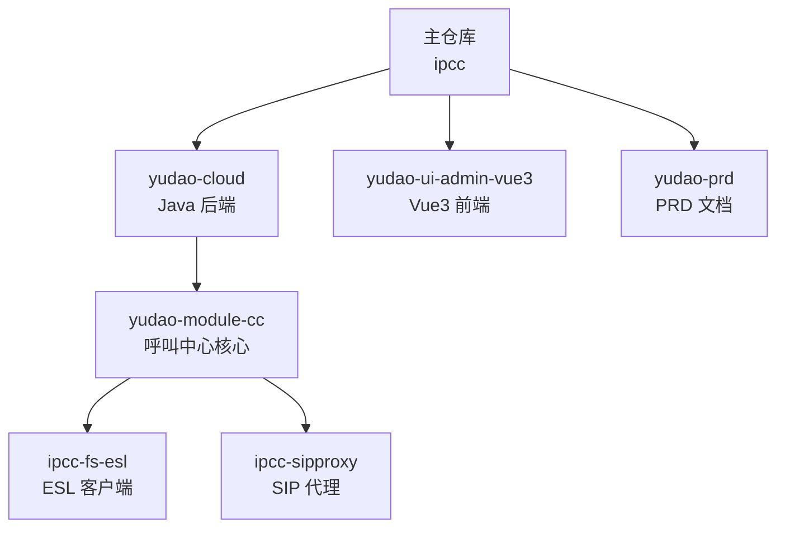
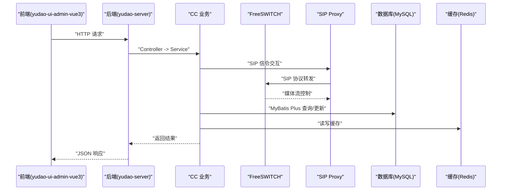
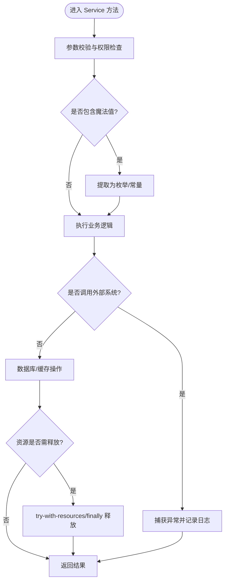
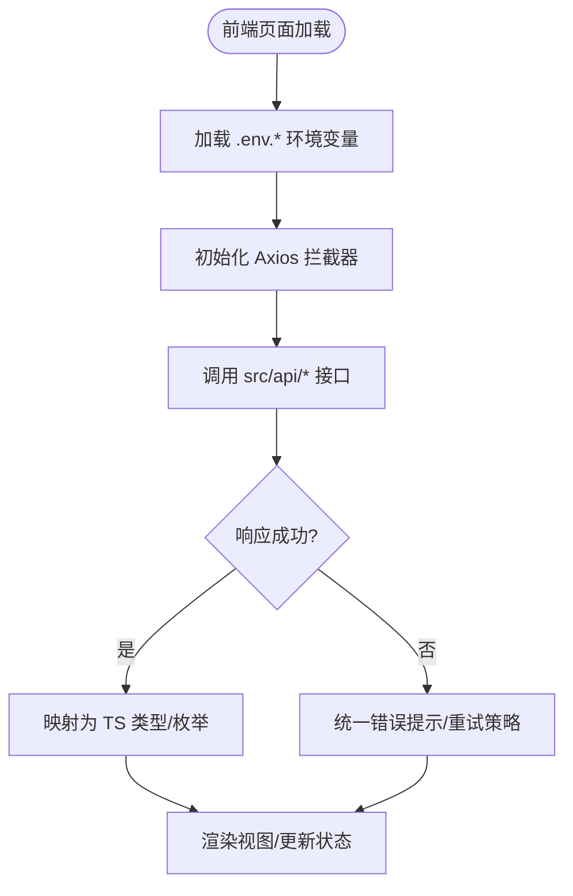
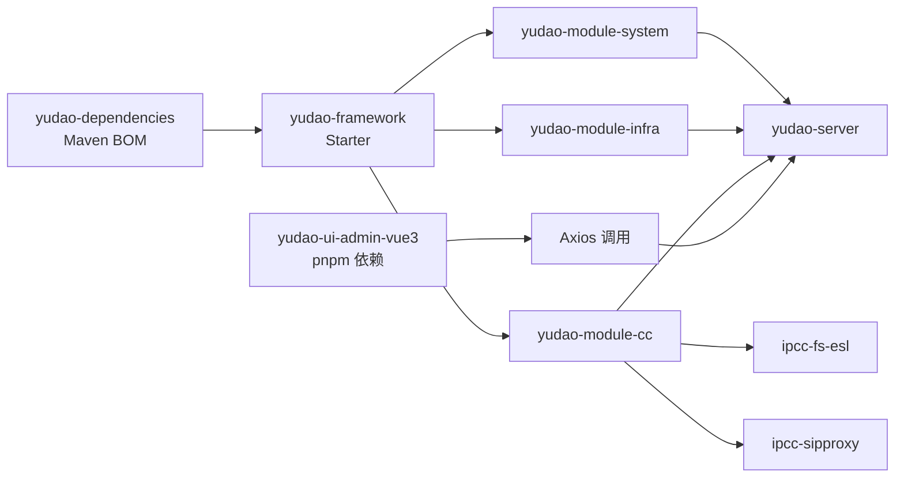

# 开发规范

<cite>
**本文引用的文件**
- [AGENTS.md](file://AGENTS.md)
- [yudao-cloud/pom.xml](file://yudao-cloud/pom.xml)
- [yudao-ui-admin-vue3/package.json](file://yudao-ui-admin-vue3/package.json)
- [yudao-cloud/yudao-module-cc/ipcc-fs-esl/AGENTS.md](file://yudao-cloud/yudao-module-cc/ipcc-fs-esl/AGENTS.md)
- [yudao-cloud/yudao-module-cc/ipcc-sipproxy/AGENTS.md](file://yudao-cloud/yudao-module-cc/ipcc-sipproxy/AGENTS.md)
- [CallDisplaySaveReqVO.java](file://yudao-cloud/yudao-module-cc/yudao-module-cc-server/src/main/java/cn/iocoder/yudao/module/cc/controller/admin/call/vo/CallDisplaySaveReqVO.java)
- [FlowAgentGroupRouteHandler.java](file://yudao-cloud/yudao-module-cc/yudao-module-cc-server/src/main/java/cn/iocoder/yudao/module/cc/ivr/handler/route/FlowAgentGroupRouteHandler.java)
</cite>

## 更新摘要
**变更内容**
- 新增AI辅助开发规则和最佳实践章节，包含详细的代码注释规范和方法级文档要求
- 更新技术栈版本信息至Java 17 + Spring Boot 3.5和Vue 3.5 + Vite 8
- 增强代码规范要求，包括业务逻辑注解和质量标准
- 补充呼叫中心核心功能实现规范，包括号码管理、坐席登录、IVR流程等
- 完善分布式组件（FS ESL、SIP Proxy）的技术规范和约束

## 目录
1. [引言](#引言)
2. [项目结构](#项目结构)
3. [核心组件](#核心组件)
4. [架构总览](#架构总览)
5. [详细组件分析](#详细组件分析)
6. [依赖分析](#依赖分析)
7. [性能考虑](#性能考虑)
8. [故障排查指南](#故障排查指南)
9. [结论](#结论)
10. [附录](#附录)

## 引言
本规范面向基于 yudao-cloud 二次开发的呼叫中心系统（CC），覆盖 Java 后端、Vue3 前端、Git 协作与代码审查、AI 辅助开发、工程结构与依赖管理、安全与性能、错误处理最佳实践等。项目采用去中心化的文档管理策略，每个模块维护独立的技术规范，确保团队协作高效、稳定上线。

**更新** 新增AI辅助开发规则，包含详细的代码注释要求、方法级文档规范、业务逻辑注解要求、质量标准和开发工作流指导。

## 项目结构
项目由三个独立的 Git 子模块组成，各自拥有独立的提交历史和分支管理：

| 目录 | 说明 | 技术栈 | 文档位置 |
|---|---|---|---|
| `yudao-cloud/` | 后端微服务（含自定义呼叫中心模块 `yudao-module-cc`） | Java 17 + Spring Boot 3.5 + Maven 多模块 | `yudao-cloud/README.md` |
| `yudao-ui-admin-vue3/` | 管理后台前端 | Vue 3.5 + TypeScript + Vite 8 + Element Plus + pnpm | `yudao-ui-admin-vue3/README.md` |
| `yudao-prd/` | 产品需求文档静态站点（纯 HTML，无构建） | Vue 3 CDN + Element Plus | `yudao-prd/README.md` |

### 子模块特定文档
- **ipcc-fs-esl**: FreeSWITCH ESL 客户端组件，详见 `yudao-cloud/yudao-module-cc/ipcc-fs-esl/AGENTS.md`
- **ipcc-sipproxy**: SIP 代理服务组件，详见 `yudao-cloud/yudao-module-cc/ipcc-sipproxy/AGENTS.md`

**章节来源**
- [AGENTS.md:5-15](file://AGENTS.md#L5-L15)

## 核心组件
### 后端架构
- **分层设计**: Controller → Service → Mapper；DO 继承 BaseDO/TenantBaseDO；使用 MyBatis Plus、MapStruct、枚举管理魔法值
- **框架扩展**: yudao-framework 提供 common/web/security/mybatis/redis/mq/job 等 Starter
- **业务域**: yudao-module-cc 包含 autocall/call/esl/flow/fs/sipproxy/sys 等子域
- **分布式组件**: 
  - ipcc-fs-esl: Netty 重写的 FreeSWITCH ESL 客户端（传输层，不含业务）
  - ipcc-sipproxy: SIP over WebSocket B2BUA 代理组件（13 个扩展点接口）

### 前端架构
- **技术栈**: Vue 3.5 + Vite 8 + Element Plus + TypeScript + Pinia + SCSS + UnoCSS + Axios
- **目录约定**: src/api/ 按模块组织；src/views/ 对应页面；src/components/ 通用组件
- **环境配置**: .env.local/.env.dev/.env.prod 环境变量管理
- **构建工具**: pnpm 包管理器，支持多环境构建脚本

**更新** 技术栈版本已更新至最新稳定版本，提供更好的性能和兼容性。

**章节来源**
- [AGENTS.md:48-78](file://AGENTS.md#L48-L78)
- [yudao-cloud/pom.xml:42-52](file://yudao-cloud/pom.xml#L42-L52)
- [yudao-ui-admin-vue3/package.json:82-138](file://yudao-ui-admin-vue3/package.json#L82-L138)

## 架构总览
系统采用 Spring Cloud 微服务基础能力，当前以单体模式运行，便于本地开发与调试。核心链路包括：前端通过 Axios 调用后端 REST API，后端 Controller 路由到 Service 层，Service 通过 Mapper 操作数据库，必要时调用 Redis、消息队列或外部系统（如 FreeSWITCH/ESL、SIP Proxy）。

**图表来源**
- [AGENTS.md:60-67](file://AGENTS.md#L60-L67)

## 详细组件分析

### AI辅助开发规则与最佳实践
#### 代码注释规范
**核心原则**：注释解释设计意图、业务背景、边界约束，不复述代码字面逻辑；代码新增/修改时，对应注释必须同步更新，保持一致。

**强制注释场景**：
- **方法级注释**：所有自定义方法生成对应语言标准文档注释；公开方法需包含功能、入参约束、返回规则、异常场景、前置条件
- **业务逻辑注释**：标注需求背景、预期结果、核心处理逻辑、异常分支的业务含义
- **复杂逻辑注释**：算法、并发、状态流转、多层循环，说明设计思路、执行流程、边界条件
- **数据计算注释**：标注字段映射、公式来源、精度舍入规则、异常值处理策略
- **特殊项注释**：魔数、容错降级、第三方依赖/兼容逻辑，说明取值依据与约束

**豁免范围**：
- Java DO/VO/DTO等纯数据载体类（仅字段+get/set），无特殊业务约束时无需类定义注释
- 命名完全自解释的单行极简方法、命名清晰的测试用例，可简化行内注释

**质量要求**：禁止复述代码的无效注释；关键逻辑块统一注释，避免逐行冗余；表述精准，使用通用术语

**语言规范**：遵循对应语言官方注释标准（JavaDoc、JSDoc、GoDoc 等）

#### 开发工作流规范
- **需求实现**：先完整分析并理解需求，主动补全遗漏的边界条件、异常场景与隐含逻辑；涉及路由需同步补充权限、传参与兜底规则，涉及命令需补充参数校验与错误处理规范
- **验证要求**：需求实现后必须启动本地服务充分验证全场景功能：前端页面必须通过浏览器真实操作验证，接口/命令必须真实运行验证，路由变更必须验证跳转与权限
- **调试优先**：启动服务，编译、代码运行、服务重启、调试排查优先调用 ij-debugger 技能，可获取变量值、方法调用栈、线程状态、异常信息等调试数据
- **数据库操作**：优先检测匹配的数据库类 MCP（如 MySQL MCP,ij-debugger），自动调用执行 SQL 操作；无适配 MCP 时，降级使用原生能力执行

#### AI工具使用约束
- AI 生成内容须清理元数据标签；遵守后端 Java 与前端 TypeScript 的命名、注释、异常与资源管理规范
- 严禁跨模块直引 Mapper/Service/DO；通过 XxxApi 进行模块间通信
- 分布式组件修改需特别注意异步处理和资源管理
- 非qoder编程工具需主动检索根目录.qoder/repowiki下的知识库文件

**章节来源**
- [AGENTS.md:87-119](file://AGENTS.md#L87-L119)

### 后端代码规范（Java）
#### 通用规范
- **分层与数据模型**: Controller → Service → Mapper；DO 继承 BaseDO/TenantBaseDO；逻辑删除；MapStruct 转换对象；魔法值用枚举（实现 ArrayValuable<Integer>）
- **常量与工具类**: 常量类 final class + private 构造；修饰符统一 public static final；工具类静态方法优先
- **注释规范**: 方法级 JavaDoc；业务注释说明背景、预期、边界与异常分支；禁止无效注释
- **异常处理**: 业务异常使用 ServiceException + ErrorCodeConstants；外部调用异常捕获并记录日志
- **资源管理**: 禁止 new Thread()；Netty Channel、数据库连接、文件流必须关闭；Redis key 设置 TTL
- **命名规范**: 类 UpperCamelCase；方法/变量 lowerCamelCase；常量 UPPER_SNAKE_CASE

#### 分布式组件规范
- **ipcc-fs-esl 约束**: 
  - 仅支持 Inbound 模式；事件订阅与命令必须异步（Netty IO 线程内阻塞会死锁）
  - API 命令必须带 `api ` 前缀，bgapi 是平级独立命令
  - 配置前缀 `ipcc.fs.esl.*`，monitor-enabled 默认 true
- **ipcc-sipproxy 约束**:
  - 不直连 FreeSWITCH ESL；REFER 转接通过 SipMessageInterceptor 扩展点委托
  - 不做呼叫决策；所有 INVITE 统一 park 到 FS
  - JAIN-SIP 版本必须统一为 1.2.1.4，避免跨版本 AbstractMethodError

**章节来源**
- [AGENTS.md:73-79](file://AGENTS.md#L73-L79)
- [yudao-cloud/yudao-module-cc/ipcc-fs-esl/AGENTS.md:26-32](file://yudao-cloud/yudao-module-cc/ipcc-fs-esl/AGENTS.md#L26-L32)
- [yudao-cloud/yudao-module-cc/ipcc-sipproxy/AGENTS.md:54-62](file://yudao-cloud/yudao-module-cc/ipcc-sipproxy/AGENTS.md#L54-L62)

### 前端代码规范（Vue3 + TypeScript）
#### 技术栈与构建
- **核心技术**: Vue 3.5 + Vite 8 + Element Plus + TypeScript + Pinia + SCSS + UnoCSS + Axios
- **包管理**: pnpm 包管理器；依赖集中在 package.json；构建脚本与 lint/format 工具链在根目录配置
- **环境配置**: .env.local/.env.dev/.env.prod 环境变量管理；VITE_ 前缀变量注入浏览器

#### 编码规范
- **目录约定**: src/api/ 按模块组织（cc 业务在 src/api/cc/）；src/views/ 对应页面；src/components/ 通用组件
- **编码风格**: Composition API + <script setup lang="ts">；严格 TypeScript，避免 any；统一错误处理在 HTTP 拦截器
- **样式规范**: 优先使用 UnoCSS 原子化类名；SCSS 用于复杂样式逻辑
- **魔法值处理**: 禁止直接使用数字/字符串字面量表示业务状态/类型/字典值；统一放在 src/utils/ 下

**章节来源**
- [yudao-ui-admin-vue3/package.json:7-22](file://yudao-ui-admin-vue3/package.json#L7-L22)

### 呼叫中心核心功能规范
#### 号码管理功能

- **输入验证**：支持数字、#、-、 (、) 字符，使用正则表达式 `^[0-9#\-\\(\\)]+$` 进行格式校验
- **前端处理**：在 el-input 上添加 @input 事件过滤非法字符，实时提示用户
- **后端验证**：使用 @Pattern 注解进行服务端验证，确保数据安全

#### 坐席软电话唯一登录逻辑
- **会话管理**：通过 SipSessionManager 检查活跃会话，防止重复登录
- **强制下线**：向旧会话发送 FORCE_LOGOUT_REQUEST WebSocket 消息，等待确认后清理注册信息
- **超时处理**：设置30秒超时机制，确保系统稳定性

#### IVR溢出策略

- **转IVR逻辑**：当 overflowType == 1 时，从 sysAgentGroup.getOverflowValue () 获取目标IVR流程ID
- **流程切换**：结束当前流程并通过 flowNoticeService.notice 启动新的IVR流程
- **降级处理**：如果 overflowValue 为空，降级为挂机处理

**章节来源**
- [CallDisplaySaveReqVO.java:15-18](file://yudao-cloud/yudao-module-cc/yudao-module-cc-server/src/main/java/cn/iocoder/yudao/module/cc/controller/admin/call/vo/CallDisplaySaveReqVO.java#L15-L18)
- [FlowAgentGroupRouteHandler.java:253-282](file://yudao-cloud/yudao-module-cc/yudao-module-cc-server/src/main/java/cn/iocoder/yudao/module/cc/ivr/handler/route/FlowAgentGroupRouteHandler.java#L253-L282)

### Git 提交规范与分支管理
#### 多仓库管理
由于项目采用三个独立 Git 子模块，每个仓库有独立的提交历史和分支管理：
- **主仓库**: 负责子模块引用和整体协调
- **yudao-cloud**: 后端微服务，独立分支策略
- **yudao-ui-admin-vue3**: 前端应用，独立分支策略  
- **yudao-prd**: PRD 文档，独立分支策略

#### 提交信息格式
建议遵循 Conventional Commits（feat/fix/docs/style/refactor/perf/test/chore/build/ci/revert），以便自动生成变更日志与版本发布。

#### 代码审查流程
Pull Request 必须经过至少一名 reviewer 审核；检查清单参考各模块 AGENTS.md；合并前通过自动化检查（lint、test、build）。

### 工程约束与模块边界
#### 模块调用规范
- 通过 XxxApi（定义于 B 的 -api，实现于 B 的 api/，A pom 依赖 xxx-api）进行模块间通信
- 禁止跨模块直引 Mapper/Service/DO
- 常量共享：ipcc-fs-esl/ipcc-sipproxy 的常量在上层模块引用而非重复定义

#### 业务约束
- ACL CRUD 后必须通过 ESL 命令向所有已连接 FS 实例异步下发配置重载
- ESL bgapi 命令使用 sendSyncMsg + extractReplyText
- WebSocket sender-type 一致性：cc.websocket.sender-type 必须与 yudao.websocket.sender-type 一致

**章节来源**
- [AGENTS.md:73-79](file://AGENTS.md#L73-L79)

## 依赖分析
### 后端依赖管理
- **Maven BOM**: yudao-dependencies 统一管理版本；yudao-framework 提供各 Starter
- **业务模块**: 通过 -api/-server 拆分；根 pom 仅启用 system、infra、cc 三个业务模块
- **编译配置**: Lombok + MapStruct 注解处理器；-parameters 编译参数（Spring Boot 3.2+ 参数名发现依赖）

### 前端依赖管理
- **包管理器**: pnpm；依赖集中在 package.json
- **构建工具**: Vite 8；支持多环境构建（local/dev/test/stage/prod）
- **代码质量**: ESLint + Stylelint + Prettier + TypeScript 类型检查

### 运行时依赖
- **数据库**: MySQL、可选其他数据库（Oracle、PostgreSQL、SQL Server 等）
- **缓存**: Redis（StringRedisTemplate，会话与注册信息存储）
- **消息队列**: 可选 MQ（RocketMQ/Kafka/RabbitMQ）
- **注册中心**: Nacos（当前禁用，配置以本地 YAML 为主）

**图表来源**
- [yudao-cloud/pom.xml:10-33](file://yudao-cloud/pom.xml#L10-L33)
- [yudao-ui-admin-vue3/package.json:1-158](file://yudao-ui-admin-vue3/package.json#L1-L158)

**章节来源**
- [yudao-cloud/pom.xml:39-65](file://yudao-cloud/pom.xml#L39-L65)
- [yudao-ui-admin-vue3/package.json:97-143](file://yudao-ui-admin-vue3/package.json#L97-L143)

## 性能考虑
### 后端性能优化
- **缓存策略**: 合理使用 Redis（key 设置 TTL）；避免全表扫描与 N+1 查询
- **异步处理**: 批量操作与分页查询；异步任务使用线程池/@Async
- **外部调用**: 超时与重试策略；连接池配置优化
- **分布式组件**: 
  - FS ESL: 避免 Netty IO 线程阻塞；合理配置连接池
  - SIP Proxy: 会话状态依赖 Redis（SessionInfo TTL=120s，注册信息 TTL=3600s）

### 前端性能优化
- **按需加载**: 路由与组件懒加载；列表虚拟滚动
- **资源优化**: 图片懒加载；减少不必要的重渲染
- **状态管理**: 合理使用 Pinia 状态；避免大对象频繁序列化
- **网络优化**: 接口合并与去抖/节流；错误重试与降级

### 网络与通信优化
- **WebSocket**: 心跳机制（sipproxy.heartbeat.idle-timeout=90s，JsSIP 客户端 OPTIONS 心跳间隔 < 90s）
- **HTTP 优化**: 合理设置超时与熔断；Gzip 压缩
- **CDN 加速**: 静态资源 CDN 部署

## 故障排查指南
### 常见问题定位
- **日志分析**: 查看 API 日志与错误日志；使用链路追踪（SkyWalking）定位慢调用
- **连接问题**: 检查 Redis/MQ 连接与队列堆积；WebSocket 连接状态监控
- **分布式问题**: 监听权竞争失败；节点间通信异常

### 调试技巧
- **后端调试**: 使用 ij-debugger 获取变量、调用栈、线程状态与异常信息
- **前端调试**: 通过浏览器 Network/Console 检查请求与响应；Vue DevTools 调试
- **网络调试**: Wireshark 抓包分析 SIP 信令；ESL 事件监控

### 常见错误与解决方案
- **跨模块直引**: 导致编译失败；改用 XxxApi 通信
- **魔法值未提取**: 导致维护困难；统一使用枚举管理
- **资源泄漏**: 未释放资源导致内存泄漏；使用 try-with-resources
- **异步死锁**: Netty IO 线程阻塞；确保异步非阻塞处理
- **版本冲突**: JAIN-SIP 版本不一致导致 AbstractMethodError；统一版本管理

**章节来源**
- [AGENTS.md:73-79](file://AGENTS.md#L73-L79)
- [yudao-cloud/yudao-module-cc/ipcc-fs-esl/AGENTS.md:26-32](file://yudao-cloud/yudao-module-cc/ipcc-fs-esl/AGENTS.md#L26-L32)
- [yudao-cloud/yudao-module-cc/ipcc-sipproxy/AGENTS.md:54-62](file://yudao-cloud/yudao-module-cc/ipcc-sipproxy/AGENTS.md#L54-L62)

## 结论
本规围绕工程结构、代码风格、命名与注释、Git 协作、AI 辅助、性能与安全、错误处理等方面形成统一标准。通过严格执行与持续改进，可显著提升团队协作效率与系统稳定性。建议在 CI/CD 中集成自动化检查（lint、test、build），并在 PR 阶段强化代码审查。

项目采用去中心化的文档管理策略，每个模块维护独立的技术规范，确保文档与代码同步更新，提高维护性和可读性。

**更新** 新增的AI辅助开发规则将显著提升代码质量和开发效率，通过标准化的注释规范和严格的验证流程，确保系统的稳定性和可维护性。

## 附录

### 快速开始指南
#### 环境准备
- **后端**: JDK 17 + Maven + MySQL + Redis
- **前端**: Node.js >= 20.19.0 + pnpm >= 8.6.0
- **IDE**: IntelliJ IDEA（安装 Multi-Project Workspace 插件）

#### 启动步骤
1. **克隆子模块**: `git submodule update --init --recursive`
2. **后端启动**: `cd yudao-cloud && mvn clean install -DskipTests`
3. **前端启动**: `cd yudao-ui-admin-vue3 && pnpm install && pnpm dev`
4. **访问地址**: 前端 http://localhost:80，后端 http://localhost:48080

### 代码示例与反模式对照
#### 正确做法
- **后端**: 枚举管理魔法值、Service 方法 JavaDoc、异常捕获与日志记录、资源释放 try-with-resources
- **前端**: TS 类型完整、统一错误处理在 Axios 拦截器、UnoCSS 原子化类名、枚举集中管理
- **分布式**: 异步非阻塞处理、连接池配置、心跳机制

#### 反模式避免
- **后端**: new Thread()、通配符 import、魔法值散落、catch 空处理、跨模块直引
- **前端**: any 类型滥用、硬编码状态码/字典值、未释放监听器/定时器
- **分布式**: 同步阻塞调用、忽略超时处理、资源泄漏

### 配置文件参考
#### 后端配置
- **application.yaml**: 默认配置
- **application-{env}.yaml**: 环境覆盖配置
- **敏感信息**: 使用 ${ENV_VAR:default} 注入

#### 前端配置
- **.env.local**: 本地开发环境
- **.env.dev/test/stage/prod**: 不同环境配置
- **环境变量**: VITE_BASE_URL、VITE_API_URL 等

**章节来源**
- [AGENTS.md:17-46](file://AGENTS.md#L17-L46)
- [yudao-cloud/pom.xml:42-52](file://yudao-cloud/pom.xml#L42-L52)
- [yudao-ui-admin-vue3/package.json:154-157](file://yudao-ui-admin-vue3/package.json#L154-L157)