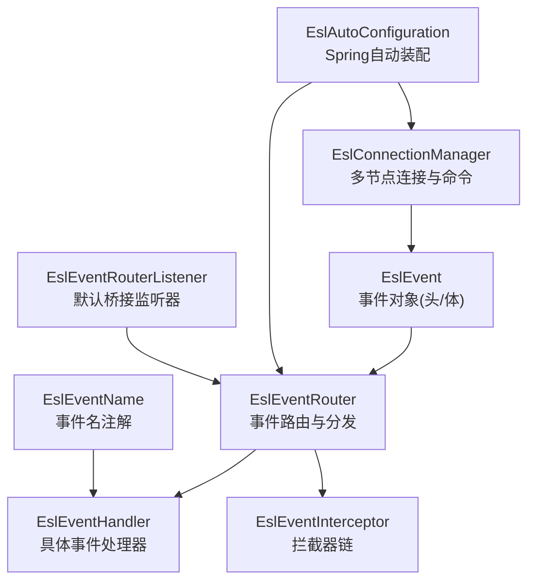
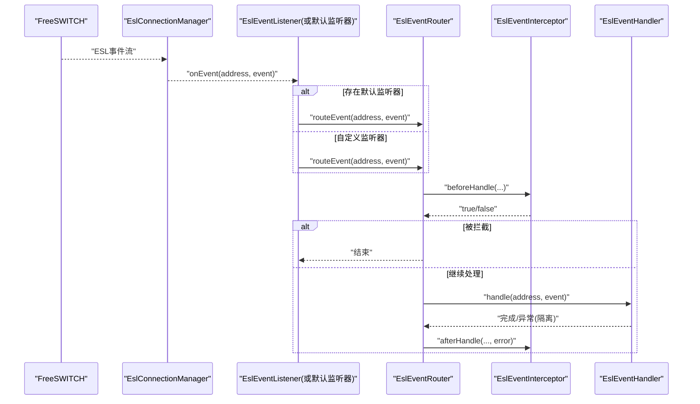
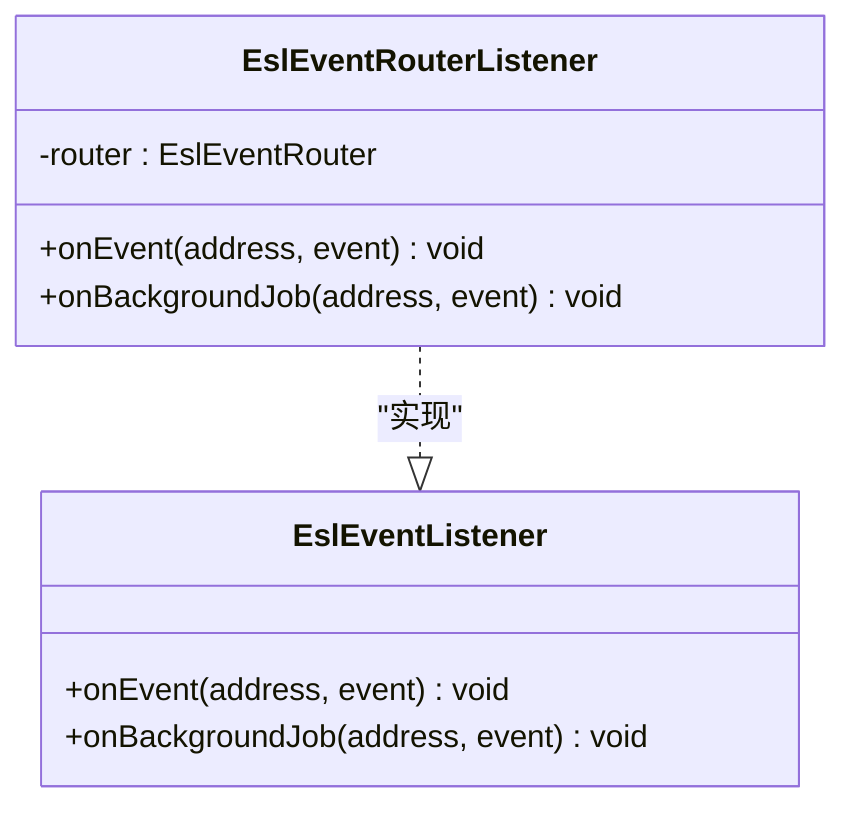
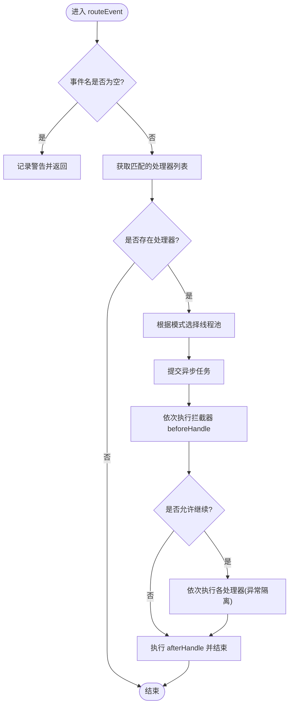
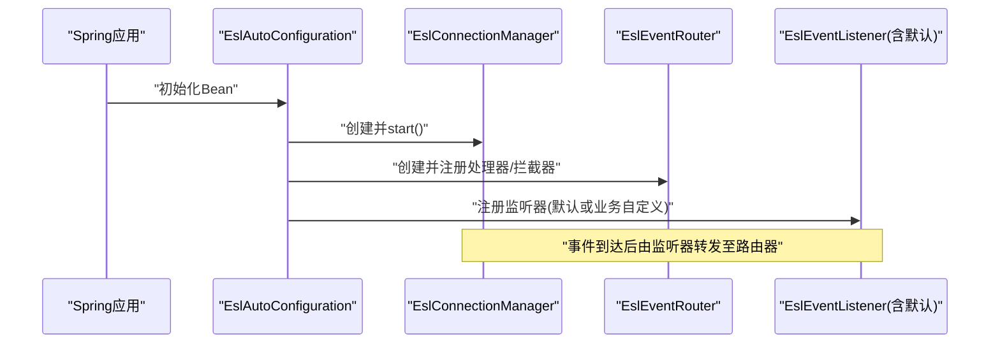
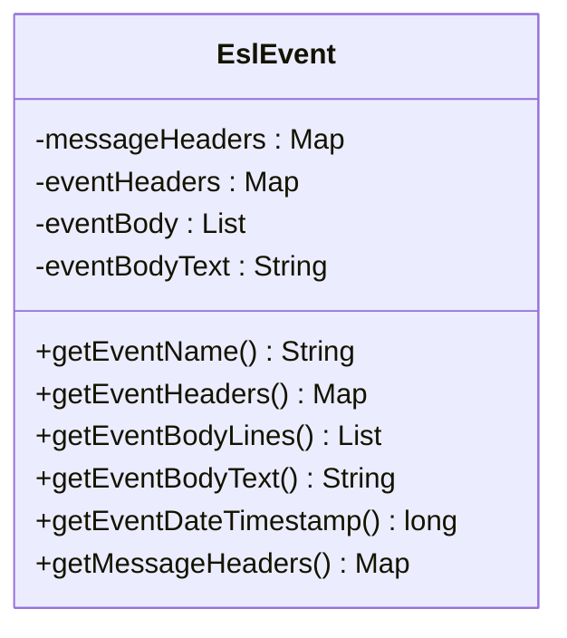
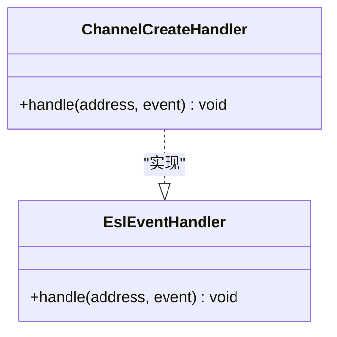
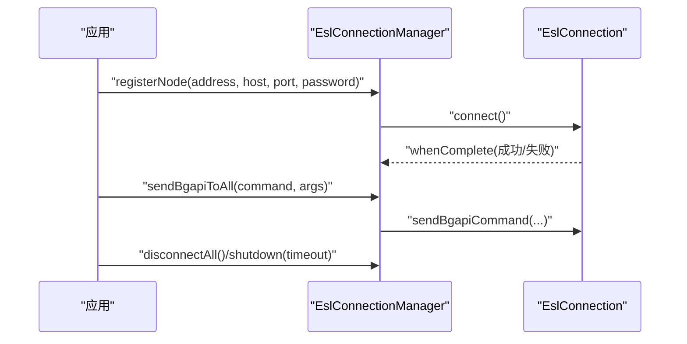
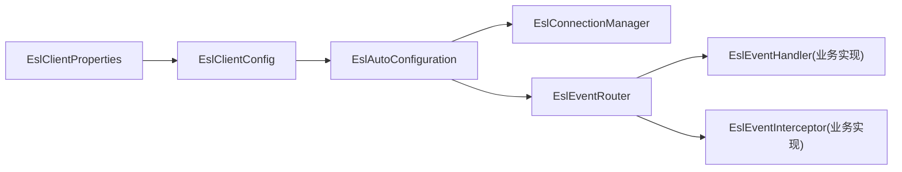

# ESL事件处理器

<cite>
**本文引用的文件**
- [EslEventListener.java](file://yudao-cloud/yudao-module-cc/ipcc-fs-esl/src/main/java/cn/ipcc/fs/esl/listener/EslEventListener.java)
- [EslEventRouter.java](file://yudao-cloud/yudao-module-cc/ipcc-fs-esl/src/main/java/cn/ipcc/fs/esl/router/EslEventRouter.java)
- [EslAutoConfiguration.java](file://yudao-cloud/yudao-module-cc/ipcc-fs-esl/src/main/java/cn/ipcc/fs/esl/spring/EslAutoConfiguration.java)
- [EslEventName.java](file://yudao-cloud/yudao-module-cc/ipcc-fs-esl/src/main/java/cn/ipcc/fs/esl/annotation/EslEventName.java)
- [EslEventHandler.java](file://yudao-cloud/yudao-module-cc/ipcc-fs-esl/src/main/java/cn/ipcc/fs/esl/router/EslEventHandler.java)
- [EslEvent.java](file://yudao-cloud/yudao-module-cc/ipcc-fs-esl/src/main/java/cn/ipcc/fs/esl/transport/EslEvent.java)
- [EslEventRouterListener.java](file://yudao-cloud/yudao-module-cc/ipcc-fs-esl/src/main/java/cn/ipcc/fs/esl/spring/EslEventRouterListener.java)
- [EslConnectionManager.java](file://yudao-cloud/yudao-module-cc/ipcc-fs-esl/src/main/java/cn/ipcc/fs/esl/EslConnectionManager.java)
- [EslClientProperties.java](file://yudao-cloud/yudao-module-cc/ipcc-fs-esl/src/main/java/cn/ipcc/fs/esl/spring/EslClientProperties.java)
- [ChannelCreateHandler.java](file://yudao-cloud/yudao-module-cc/ipcc-fs-esl/example/example-java/src/main/java/cn/ipcc/fs/esl/example/handler/ChannelCreateHandler.java)
- [ExampleEventListener.java](file://yudao-cloud/yudao-module-cc/ipcc-fs-esl/example/example-java/src/main/java/cn/ipcc/fs/esl/example/listener/ExampleEventListener.java)
- [application.yml](file://yudao-cloud/yudao-module-cc/ipcc-fs-esl/example/example-java/src/main/resources/application.yml)
- [TraceLoggingInterceptor.java](file://yudao-cloud/yudao-module-cc/ipcc-fs-esl/example/example-java/src/main/java/cn/ipcc/fs/esl/example/interceptor/TraceLoggingInterceptor.java)
</cite>

## 目录
1. [简介](#简介)
2. [项目结构](#项目结构)
3. [核心组件](#核心组件)
4. [架构总览](#架构总览)
5. [详细组件分析](#详细组件分析)
6. [依赖关系分析](#依赖关系分析)
7. [性能考虑](#性能考虑)
8. [故障排查指南](#故障排查指南)
9. [结论](#结论)
10. [附录](#附录)

## 简介
本文件面向FreeSWITCH ESL事件处理器的开发与集成，聚焦于如何开发自定义ESL事件监听器、实现事件路由与分发、管理连接生命周期，以及通过Spring自动装配完成注册与配置。文档覆盖事件类型过滤、优先级排序、并发执行模型、异常隔离、最佳实践、性能调优与故障恢复策略，并提供完整示例路径以便快速上手。

## 项目结构
该模块围绕“连接管理—事件解析—路由分发—处理器执行”的链路组织：
- 连接层：EslConnectionManager负责多节点管理与批量命令发送。
- 传输层：EslEvent封装FS事件头与体，提供统一访问API。
- 路由层：EslEventRouter按事件名匹配处理器，支持拦截器链与多种线程执行模式。
- 适配层：EslAutoConfiguration将Spring Bean、注解与配置绑定到运行时组件。
- 示例：example-java提供事件处理器、拦截器、监听器与配置文件样例。

图表来源
- [EslConnectionManager.java:19-29](file://yudao-cloud/yudao-module-cc/ipcc-fs-esl/src/main/java/cn/ipcc/fs/esl/EslConnectionManager.java#L19-L29)
- [EslEvent.java:10-17](file://yudao-cloud/yudao-module-cc/ipcc-fs-esl/src/main/java/cn/ipcc/fs/esl/transport/EslEvent.java#L10-L17)
- [EslEventRouter.java:14-31](file://yudao-cloud/yudao-module-cc/ipcc-fs-esl/src/main/java/cn/ipcc/fs/esl/router/EslEventRouter.java#L14-L31)
- [EslAutoConfiguration.java:34-49](file://yudao-cloud/yudao-module-cc/ipcc-fs-esl/src/main/java/cn/ipcc/fs/esl/spring/EslAutoConfiguration.java#L34-L49)
- [EslEventName.java:5-9](file://yudao-cloud/yudao-module-cc/ipcc-fs-esl/src/main/java/cn/ipcc/fs/esl/annotation/EslEventName.java#L5-L9)
- [EslEventRouterListener.java:7-16](file://yudao-cloud/yudao-module-cc/ipcc-fs-esl/src/main/java/cn/ipcc/fs/esl/spring/EslEventRouterListener.java#L7-L16)

章节来源
- [EslConnectionManager.java:19-29](file://yudao-cloud/yudao-module-cc/ipcc-fs-esl/src/main/java/cn/ipcc/fs/esl/EslConnectionManager.java#L19-L29)
- [EslEventRouter.java:14-31](file://yudao-cloud/yudao-module-cc/ipcc-fs-esl/src/main/java/cn/ipcc/fs/esl/router/EslEventRouter.java#L14-L31)
- [EslAutoConfiguration.java:34-49](file://yudao-cloud/yudao-module-cc/ipcc-fs-esl/src/main/java/cn/ipcc/fs/esl/spring/EslAutoConfiguration.java#L34-L49)

## 核心组件
- EslEventListener：定义事件接收接口，支持普通事件与BACKGROUND_JOB事件回调。
- EslEventRouter：事件路由器，负责事件名匹配、拦截器链执行、线程池调度与异常隔离。
- EslAutoConfiguration：Spring Boot自动配置，扫描并注册处理器、拦截器、监听器，创建路由器和连接管理器。
- EslEvent：事件数据载体，包含事件名、事件头、事件体及时间戳等。
- EslEventName：用于标注处理器所响应的事件名。
- EslEventHandler：事件处理器接口，业务实现类需标注@EslEventName。
- EslEventRouterListener：默认监听器，当未自定义EslEventListener时，将事件转发至路由器。
- EslConnectionManager：多节点连接管理，提供节点注册、选择、批量命令发送与状态聚合。
- EslClientProperties：配置属性映射，绑定ipcc.fs.esl.*配置项。

章节来源
- [EslEventListener.java:5-28](file://yudao-cloud/yudao-module-cc/ipcc-fs-esl/src/main/java/cn/ipcc/fs/esl/listener/EslEventListener.java#L5-L28)
- [EslEventRouter.java:14-31](file://yudao-cloud/yudao-module-cc/ipcc-fs-esl/src/main/java/cn/ipcc/fs/esl/router/EslEventRouter.java#L14-L31)
- [EslAutoConfiguration.java:34-49](file://yudao-cloud/yudao-module-cc/ipcc-fs-esl/src/main/java/cn/ipcc/fs/esl/spring/EslAutoConfiguration.java#L34-L49)
- [EslEvent.java:10-17](file://yudao-cloud/yudao-module-cc/ipcc-fs-esl/src/main/java/cn/ipcc/fs/esl/transport/EslEvent.java#L10-L17)
- [EslEventName.java:5-9](file://yudao-cloud/yudao-module-cc/ipcc-fs-esl/src/main/java/cn/ipcc/fs/esl/annotation/EslEventName.java#L5-L9)
- [EslEventHandler.java:5-19](file://yudao-cloud/yudao-module-cc/ipcc-fs-esl/src/main/java/cn/ipcc/fs/esl/router/EslEventHandler.java#L5-L19)
- [EslEventRouterListener.java:7-16](file://yudao-cloud/yudao-module-cc/ipcc-fs-esl/src/main/java/cn/ipcc/fs/esl/spring/EslEventRouterListener.java#L7-L16)
- [EslConnectionManager.java:19-29](file://yudao-cloud/yudao-module-cc/ipcc-fs-esl/src/main/java/cn/ipcc/fs/esl/EslConnectionManager.java#L19-L29)
- [EslClientProperties.java:9-15](file://yudao-cloud/yudao-module-cc/ipcc-fs-esl/src/main/java/cn/ipcc/fs/esl/spring/EslClientProperties.java#L9-L15)

## 架构总览
下图展示从FreeSWITCH事件到达、解析、路由到处理器执行的端到端流程，以及Spring自动装配在其中的作用。

图表来源
- [EslConnectionManager.java:207-217](file://yudao-cloud/yudao-module-cc/ipcc-fs-esl/src/main/java/cn/ipcc/fs/esl/EslConnectionManager.java#L207-L217)
- [EslEventRouterListener.java:25-46](file://yudao-cloud/yudao-module-cc/ipcc-fs-esl/src/main/java/cn/ipcc/fs/esl/spring/EslEventRouterListener.java#L25-L46)
- [EslEventRouter.java:90-153](file://yudao-cloud/yudao-module-cc/ipcc-fs-esl/src/main/java/cn/ipcc/fs/esl/router/EslEventRouter.java#L90-L153)

章节来源
- [EslEventRouter.java:90-153](file://yudao-cloud/yudao-module-cc/ipcc-fs-esl/src/main/java/cn/ipcc/fs/esl/router/EslEventRouter.java#L90-L153)
- [EslEventRouterListener.java:25-46](file://yudao-cloud/yudao-module-cc/ipcc-fs-esl/src/main/java/cn/ipcc/fs/esl/spring/EslEventRouterListener.java#L25-L46)
- [EslConnectionManager.java:207-217](file://yudao-cloud/yudao-module-cc/ipcc-fs-esl/src/main/java/cn/ipcc/fs/esl/EslConnectionManager.java#L207-L217)

## 详细组件分析

### 事件监听接口与默认桥接
- EslEventListener定义了onEvent与onBackgroundJob两个回调，便于区分普通事件与bgapi异步结果。
- 当容器中没有自定义EslEventListener时，EslAutoConfiguration会注册默认监听器EslEventRouterListener，将事件转发给EslEventRouter进行分发。

图表来源
- [EslEventListener.java:10-28](file://yudao-cloud/yudao-module-cc/ipcc-fs-esl/src/main/java/cn/ipcc/fs/esl/listener/EslEventListener.java#L10-L28)
- [EslEventRouterListener.java:17-46](file://yudao-cloud/yudao-module-cc/ipcc-fs-esl/src/main/java/cn/ipcc/fs/esl/spring/EslEventRouterListener.java#L17-L46)

章节来源
- [EslEventListener.java:10-28](file://yudao-cloud/yudao-module-cc/ipcc-fs-esl/src/main/java/cn/ipcc/fs/esl/listener/EslEventListener.java#L10-L28)
- [EslEventRouterListener.java:17-46](file://yudao-cloud/yudao-module-cc/ipcc-fs-esl/src/main/java/cn/ipcc/fs/esl/spring/EslEventRouterListener.java#L17-L46)

### 事件路由与并发模型
- 事件路由职责包括：事件名匹配处理器、拦截器链执行、线程池调度、异常隔离。
- 三种执行模式：
  - CHANNEL_HASH：按Unique-ID哈希分配到固定单线程池，保证同一通道事件顺序（推荐）。
  - SINGLE_THREAD：所有事件单线程串行。
  - FULL_CONCURRENT：全并发线程池。
- BACKGROUND_JOB事件使用独立线程池，避免与普通事件互相阻塞。
- 拒绝策略可配置为CALLER_RUNS、ABORT、DISCARD。

图表来源
- [EslEventRouter.java:90-153](file://yudao-cloud/yudao-module-cc/ipcc-fs-esl/src/main/java/cn/ipcc/fs/esl/router/EslEventRouter.java#L90-L153)
- [EslEventRouter.java:155-186](file://yudao-cloud/yudao-module-cc/ipcc-fs-esl/src/main/java/cn/ipcc/fs/esl/router/EslEventRouter.java#L155-L186)

章节来源
- [EslEventRouter.java:90-153](file://yudao-cloud/yudao-module-cc/ipcc-fs-esl/src/main/java/cn/ipcc/fs/esl/router/EslEventRouter.java#L90-L153)
- [EslEventRouter.java:155-186](file://yudao-cloud/yudao-module-cc/ipcc-fs-esl/src/main/java/cn/ipcc/fs/esl/router/EslEventRouter.java#L155-L186)

### Spring自动装配与注册
- EslAutoConfiguration负责：
  - 将EslClientProperties转换为EslClientConfig。
  - 创建EslConnectionManager并启动连接。
  - 收集并注册EslEventListener、EslConnectionListener、EslMonitorListener。
  - 创建EslEventRouter，扫描@EslEventName标注的处理器并按@Order排序注册；收集拦截器并注册。
  - 在无自定义EslEventListener时注册默认监听器EslEventRouterListener。
  - 条件性创建分布式协调器并在ApplicationReady后启动竞争任务。

图表来源
- [EslAutoConfiguration.java:56-86](file://yudao-cloud/yudao-module-cc/ipcc-fs-esl/src/main/java/cn/ipcc/fs/esl/spring/EslAutoConfiguration.java#L56-L86)
- [EslAutoConfiguration.java:98-127](file://yudao-cloud/yudao-module-cc/ipcc-fs-esl/src/main/java/cn/ipcc/fs/esl/spring/EslAutoConfiguration.java#L98-L127)
- [EslAutoConfiguration.java:181-214](file://yudao-cloud/yudao-module-cc/ipcc-fs-esl/src/main/java/cn/ipcc/fs/esl/spring/EslAutoConfiguration.java#L181-L214)
- [EslAutoConfiguration.java:236-246](file://yudao-cloud/yudao-module-cc/ipcc-fs-esl/src/main/java/cn/ipcc/fs/esl/spring/EslAutoConfiguration.java#L236-L246)

章节来源
- [EslAutoConfiguration.java:56-86](file://yudao-cloud/yudao-module-cc/ipcc-fs-esl/src/main/java/cn/ipcc/fs/esl/spring/EslAutoConfiguration.java#L56-L86)
- [EslAutoConfiguration.java:98-127](file://yudao-cloud/yudao-module-cc/ipcc-fs-esl/src/main/java/cn/ipcc/fs/esl/spring/EslAutoConfiguration.java#L98-L127)
- [EslAutoConfiguration.java:181-214](file://yudao-cloud/yudao-module-cc/ipcc-fs-esl/src/main/java/cn/ipcc/fs/esl/spring/EslAutoConfiguration.java#L181-L214)
- [EslAutoConfiguration.java:236-246](file://yudao-cloud/yudao-module-cc/ipcc-fs-esl/src/main/java/cn/ipcc/fs/esl/spring/EslAutoConfiguration.java#L236-L246)

### 事件数据模型
- EslEvent封装了事件头、事件体、原始消息头与时间戳，提供getEventName/getEventHeaders/getEventBodyLines/getEventBodyText/getEventDateTimestamp等方法。
- 事件头值经过URL解码，解析失败时降级保留原始值，确保事件不丢失。

图表来源
- [EslEvent.java:18-135](file://yudao-cloud/yudao-module-cc/ipcc-fs-esl/src/main/java/cn/ipcc/fs/esl/transport/EslEvent.java#L18-L135)

章节来源
- [EslEvent.java:18-135](file://yudao-cloud/yudao-module-cc/ipcc-fs-esl/src/main/java/cn/ipcc/fs/esl/transport/EslEvent.java#L18-L135)

### 事件处理器与注解
- EslEventHandler定义handle方法，业务实现类需标注@EslEventName指定事件名。
- 同一事件名可注册多个处理器，按Spring @Order排序执行。

图表来源
- [EslEventHandler.java:5-19](file://yudao-cloud/yudao-module-cc/ipcc-fs-esl/src/main/java/cn/ipcc/fs/esl/router/EslEventHandler.java#L5-L19)
- [ChannelCreateHandler.java:13-33](file://yudao-cloud/yudao-module-cc/ipcc-fs-esl/example/example-java/src/main/java/cn/ipcc/fs/esl/example/handler/ChannelCreateHandler.java#L13-L33)

章节来源
- [EslEventHandler.java:5-19](file://yudao-cloud/yudao-module-cc/ipcc-fs-esl/src/main/java/cn/ipcc/fs/esl/router/EslEventHandler.java#L5-L19)
- [ChannelCreateHandler.java:13-33](file://yudao-cloud/yudao-module-cc/ipcc-fs-esl/example/example-java/src/main/java/cn/ipcc/fs/esl/example/handler/ChannelCreateHandler.java#L13-L33)

### 连接管理与生命周期
- EslConnectionManager负责多节点注册、移除、同步、随机选择、批量bgapi发送、消息发送与优雅关闭。
- 通过addEventListener/addConnectionListener向所有现有与后续节点广播监听器。

图表来源
- [EslConnectionManager.java:47-68](file://yudao-cloud/yudao-module-cc/ipcc-fs-esl/src/main/java/cn/ipcc/fs/esl/EslConnectionManager.java#L47-L68)
- [EslConnectionManager.java:141-165](file://yudao-cloud/yudao-module-cc/ipcc-fs-esl/src/main/java/cn/ipcc/fs/esl/EslConnectionManager.java#L141-L165)
- [EslConnectionManager.java:219-232](file://yudao-cloud/yudao-module-cc/ipcc-fs-esl/src/main/java/cn/ipcc/fs/esl/EslConnectionManager.java#L219-L232)

章节来源
- [EslConnectionManager.java:47-68](file://yudao-cloud/yudao-module-cc/ipcc-fs-esl/src/main/java/cn/ipcc/fs/esl/EslConnectionManager.java#L47-L68)
- [EslConnectionManager.java:141-165](file://yudao-cloud/yudao-module-cc/ipcc-fs-esl/src/main/java/cn/ipcc/fs/esl/EslConnectionManager.java#L141-L165)
- [EslConnectionManager.java:219-232](file://yudao-cloud/yudao-module-cc/ipcc-fs-esl/src/main/java/cn/ipcc/fs/esl/EslConnectionManager.java#L219-L232)

### 配置与示例
- 配置前缀ipcc.fs.esl.*，涵盖连接超时、协议参数、重连策略、健康检查、事件执行器、分布式协调与静态节点。
- 示例应用展示了：
  - 事件处理器：ChannelCreateHandler处理CHANNEL_CREATE事件。
  - 事件监听器：ExampleEventListener将事件转发到路由器。
  - 拦截器：TraceLoggingInterceptor实现traceId透传与耗时统计。
  - 配置文件：application.yml设置事件执行模式与线程池大小等。

章节来源
- [EslClientProperties.java:20-84](file://yudao-cloud/yudao-module-cc/ipcc-fs-esl/src/main/java/cn/ipcc/fs/esl/spring/EslClientProperties.java#L20-L84)
- [ChannelCreateHandler.java:13-33](file://yudao-cloud/yudao-module-cc/ipcc-fs-esl/example/example-java/src/main/java/cn/ipcc/fs/esl/example/handler/ChannelCreateHandler.java#L13-L33)
- [ExampleEventListener.java:10-34](file://yudao-cloud/yudao-module-cc/ipcc-fs-esl/example/example-java/src/main/java/cn/ipcc/fs/esl/example/listener/ExampleEventListener.java#L10-L34)
- [TraceLoggingInterceptor.java:11-53](file://yudao-cloud/yudao-module-cc/ipcc-fs-esl/example/example-java/src/main/java/cn/ipcc/fs/esl/example/interceptor/TraceLoggingInterceptor.java#L11-L53)
- [application.yml:10-40](file://yudao-cloud/yudao-module-cc/ipcc-fs-esl/example/example-java/src/main/resources/application.yml#L10-L40)

## 依赖关系分析
- EslAutoConfiguration依赖EslClientProperties与EslClientConfig，负责装配核心组件。
- EslEventRouter依赖EslClientConfig中的事件执行器配置，并维护处理器与拦截器集合。
- EslConnectionManager依赖EslClientConfig，管理EslConnection实例与监听器集合。
- 示例处理器与拦截器通过Spring容器发现并注册到路由器。

图表来源
- [EslAutoConfiguration.java:56-86](file://yudao-cloud/yudao-module-cc/ipcc-fs-esl/src/main/java/cn/ipcc/fs/esl/spring/EslAutoConfiguration.java#L56-L86)
- [EslEventRouter.java:43-74](file://yudao-cloud/yudao-module-cc/ipcc-fs-esl/src/main/java/cn/ipcc/fs/esl/router/EslEventRouter.java#L43-L74)
- [EslConnectionManager.java:31-45](file://yudao-cloud/yudao-module-cc/ipcc-fs-esl/src/main/java/cn/ipcc/fs/esl/EslConnectionManager.java#L31-L45)

章节来源
- [EslAutoConfiguration.java:56-86](file://yudao-cloud/yudao-module-cc/ipcc-fs-esl/src/main/java/cn/ipcc/fs/esl/spring/EslAutoConfiguration.java#L56-L86)
- [EslEventRouter.java:43-74](file://yudao-cloud/yudao-module-cc/ipcc-fs-esl/src/main/java/cn/ipcc/fs/esl/router/EslEventRouter.java#L43-L74)
- [EslConnectionManager.java:31-45](file://yudao-cloud/yudao-module-cc/ipcc-fs-esl/src/main/java/cn/ipcc/fs/esl/EslConnectionManager.java#L31-L45)

## 性能考虑
- 事件执行模式选择：
  - CHANNEL_HASH：推荐，按通道唯一ID哈希分配固定线程，保证同通道事件顺序，降低乱序风险。
  - SINGLE_THREAD：低并发场景简单可靠。
  - FULL_CONCURRENT：事件无关联且高吞吐时使用。
- 线程池与队列：
  - event-thread-pool-size：CHANNEL_HASH模式下为哈希桶数量，影响并发度与顺序粒度。
  - event-queue-capacity：控制背压，结合拒绝策略避免OOM。
  - event-rejected-policy：CALLER_RUNS适合保护系统；ABORT/DISCARD适合快速失败。
- 独立后台作业线程池：BACKGROUND_JOB事件走独立线程池，避免与普通事件互相阻塞。
- 拦截器开销：尽量轻量，避免阻塞；ThreadLocal使用需在finally清理。
- 连接与健康检查：合理设置health-check-interval与failure-threshold，及时剔除不可用节点。

[本节为通用指导，无需特定文件引用]

## 故障排查指南
- 事件名缺失：
  - 现象：路由日志提示事件名缺失并跳过。
  - 排查：确认事件解析是否正确，检查EslEvent.getEventName()返回值。
  - 参考：[EslEventRouter.java:106-115](file://yudao-cloud/yudao-module-cc/ipcc-fs-esl/src/main/java/cn/ipcc/fs/esl/router/EslEventRouter.java#L106-L115)
- 处理器异常隔离：
  - 现象：单个处理器异常不影响其他处理器。
  - 排查：查看路由日志中处理器异常堆栈，定位具体handler。
  - 参考：[EslEventRouter.java:131-139](file://yudao-cloud/yudao-module-cc/ipcc-fs-esl/src/main/java/cn/ipcc/fs/esl/router/EslEventRouter.java#L131-L139)
- 拦截器提前终止：
  - 现象：beforeHandle返回false导致跳过处理器但仍执行afterHandle。
  - 排查：确认拦截器逻辑与资源清理。
  - 参考：[EslEventRouter.java:122-130](file://yudao-cloud/yudao-module-cc/ipcc-fs-esl/src/main/java/cn/ipcc/fs/esl/router/EslEventRouter.java#L122-L130)
- 节点不可用：
  - 现象：sendBgapi/sendSyncCommand返回null或警告。
  - 排查：检查canSend状态与节点注册情况。
  - 参考：[EslConnectionManager.java:167-175](file://yudao-cloud/yudao-module-cc/ipcc-fs-esl/src/main/java/cn/ipcc/fs/esl/EslConnectionManager.java#L167-L175)
- 默认监听器未生效：
  - 现象：自定义EslEventListener存在时，默认监听器不会注册。
  - 排查：确认是否已自行调用router.routeEvent。
  - 参考：[EslAutoConfiguration.java:236-246](file://yudao-cloud/yudao-module-cc/ipcc-fs-esl/src/main/java/cn/ipcc/fs/esl/spring/EslAutoConfiguration.java#L236-L246)

章节来源
- [EslEventRouter.java:106-115](file://yudao-cloud/yudao-module-cc/ipcc-fs-esl/src/main/java/cn/ipcc/fs/esl/router/EslEventRouter.java#L106-L115)
- [EslEventRouter.java:131-139](file://yudao-cloud/yudao-module-cc/ipcc-fs-esl/src/main/java/cn/ipcc/fs/esl/router/EslEventRouter.java#L131-L139)
- [EslEventRouter.java:122-130](file://yudao-cloud/yudao-module-cc/ipcc-fs-esl/src/main/java/cn/ipcc/fs/esl/router/EslEventRouter.java#L122-L130)
- [EslConnectionManager.java:167-175](file://yudao-cloud/yudao-module-cc/ipcc-fs-esl/src/main/java/cn/ipcc/fs/esl/EslConnectionManager.java#L167-L175)
- [EslAutoConfiguration.java:236-246](file://yudao-cloud/yudao-module-cc/ipcc-fs-esl/src/main/java/cn/ipcc/fs/esl/spring/EslAutoConfiguration.java#L236-L246)

## 结论
本模块提供了完整的FreeSWITCH ESL事件处理体系：通过Spring自动装配简化注册与配置，以EslEventRouter为核心实现事件路由、拦截器链与并发调度，配合EslConnectionManager管理多节点连接与生命周期。开发者只需实现EslEventHandler并标注@EslEventName，即可接入事件处理；如需自定义监听行为，可实现EslEventListener并将事件转发至路由器。通过合理的执行模式与线程池配置，可在保证事件顺序与稳定性的同时获得良好吞吐。建议在生产环境启用监控与指标采集，并结合健康检查与重连策略提升鲁棒性。

[本节为总结性内容，无需特定文件引用]

## 附录
- 快速开始步骤（基于示例）：
  - 在application.yml中配置ipcc.fs.esl.*参数，如事件执行模式、线程池大小、Redis协调等。
  - 实现EslEventHandler并标注@EslEventName，编写事件处理逻辑。
  - 可选：实现EslEventInterceptor进行链路追踪与耗时统计。
  - 可选：实现EslEventListener并注入EslEventRouter，手动转发事件。
  - 运行示例应用，观察日志输出与事件处理效果。

章节来源
- [application.yml:10-40](file://yudao-cloud/yudao-module-cc/ipcc-fs-esl/example/example-java/src/main/resources/application.yml#L10-L40)
- [ChannelCreateHandler.java:13-33](file://yudao-cloud/yudao-module-cc/ipcc-fs-esl/example/example-java/src/main/java/cn/ipcc/fs/esl/example/handler/ChannelCreateHandler.java#L13-L33)
- [TraceLoggingInterceptor.java:11-53](file://yudao-cloud/yudao-module-cc/ipcc-fs-esl/example/example-java/src/main/java/cn/ipcc/fs/esl/example/interceptor/TraceLoggingInterceptor.java#L11-L53)
- [ExampleEventListener.java:10-34](file://yudao-cloud/yudao-module-cc/ipcc-fs-esl/example/example-java/src/main/java/cn/ipcc/fs/esl/example/listener/ExampleEventListener.java#L10-L34)