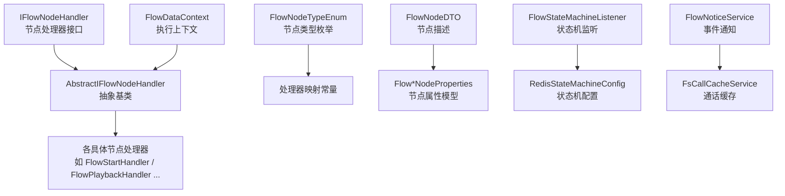
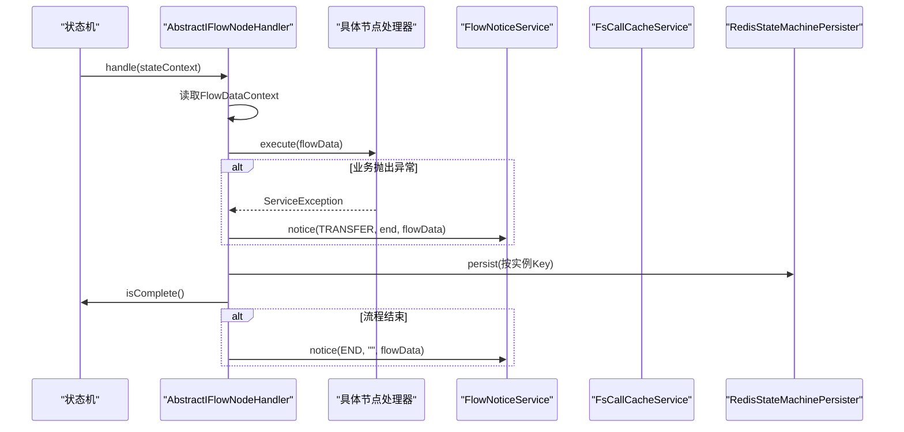
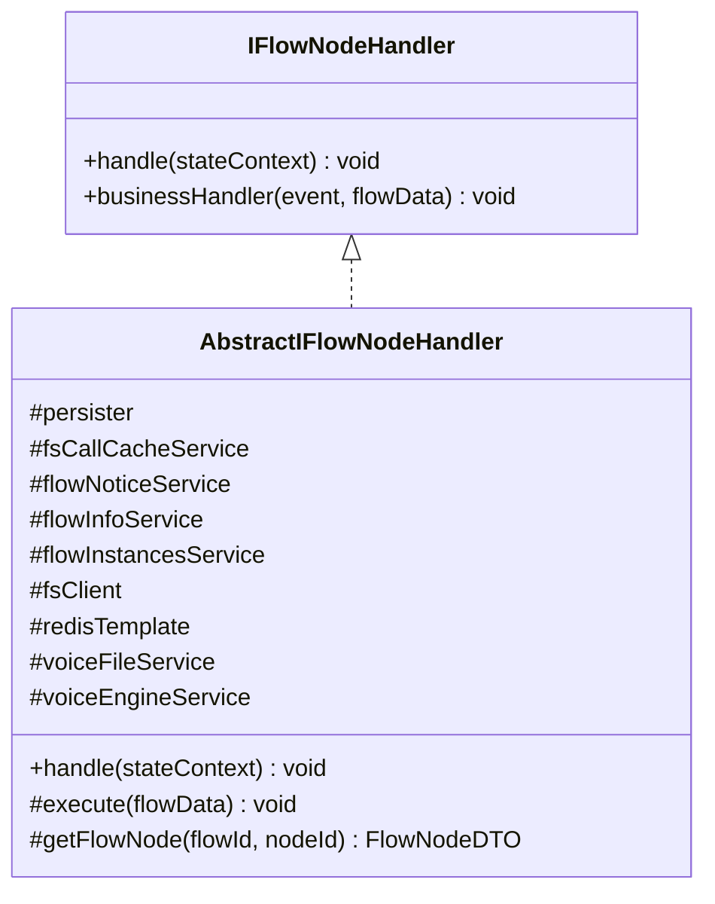
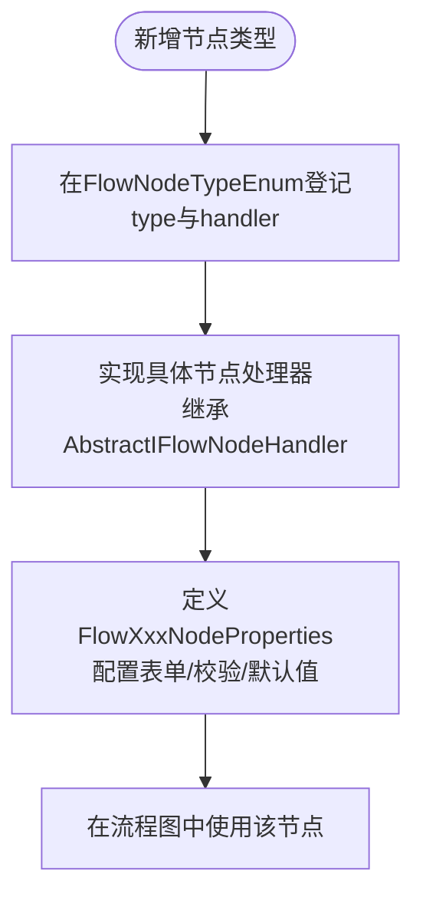
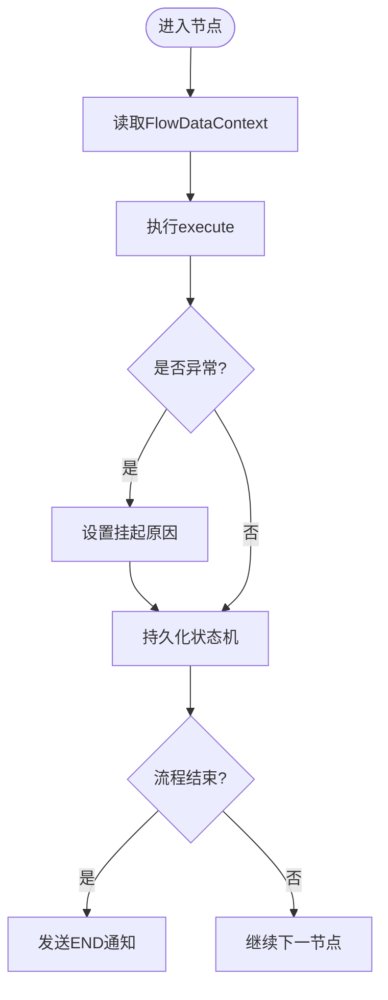
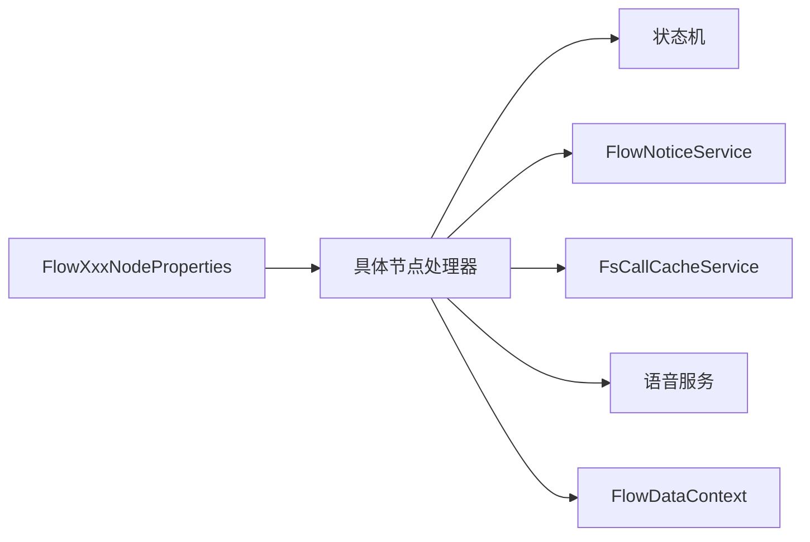

# IVR节点扩展

<cite>
**本文引用的文件**
- [AbstractIFlowNodeHandler.java](file://yudao-cloud/yudao-module-cc/yudao-module-cc-server/src/main/java/cn/iocoder/yudao/module/cc/ivr/handler/node/AbstractIFlowNodeHandler.java)
- [IFlowNodeHandler.java](file://yudao-cloud/yudao-module-cc/yudao-module-cc-server/src/main/java/cn/iocoder/yudao/module/cc/ivr/handler/node/IFlowNodeHandler.java)
- [FlowNodeTypeEnum.java](file://yudao-cloud/yudao-module-cc/yudao-module-cc-server/src/main/java/cn/iocoder/yudao/module/cc/ivr/enums/FlowNodeTypeEnum.java)
- [FlowNodeDTO.java](file://yudao-cloud/yudao-module-cc/yudao-module-cc-server/src/main/java/cn/iocoder/yudao/module/cc/ivr/dto/FlowNodeDTO.java)
- [FlowStartNodeProperties.java](file://yudao-cloud/yudao-module-cc/yudao-module-cc-server/src/main/java/cn/iocoder/yudao/module/cc/ivr/properties/FlowStartNodeProperties.java)
- [FlowEndNodeProperties.java](file://yudao-cloud/yudao-module-cc/yudao-module-cc-server/src/main/java/cn/iocoder/yudao/module/cc/ivr/properties/FlowEndNodeProperties.java)
- [FlowPlaybackNodeProperties.java](file://yudao-cloud/yudao-module-cc/yudao-module-cc-server/src/main/java/cn/iocoder/yudao/module/cc/ivr/properties/FlowPlaybackNodeProperties.java)
- [FlowMenuNodeProperties.java](file://yudao-cloud/yudao-module-cc/yudao-module-cc-server/src/main/java/cn/iocoder/yudao/module/cc/ivr/properties/FlowMenuNodeProperties.java)
- [FlowReceiveNodeProperties.java](file://yudao-cloud/yudao-module-cc/yudao-module-cc-server/src/main/java/cn/iocoder/yudao/module/cc/ivr/properties/FlowReceiveNodeProperties.java)
- [FlowTransferNodeProperties.java](file://yudao-cloud/yudao-module-cc/yudao-module-cc-server/src/main/java/cn/iocoder/yudao/module/cc/ivr/properties/FlowTransferNodeProperties.java)
- [FlowMethodNodeProperties.java](file://yudao-cloud/yudao-module-cc/yudao-module-cc-server/src/main/java/cn/iocoder/yudao/module/cc/ivr/properties/FlowMethodNodeProperties.java)
- [FlowHttpNodeProperties.java](file://yudao-cloud/yudao-module-cc/yudao-module-cc-server/src/main/java/cn/iocoder/yudao/module/cc/ivr/properties/FlowHttpNodeProperties.java)
- [FlowConditionNodeProperties.java](file://yudao-cloud/yudao-module-cc/yudao-module-cc-server/src/main/java/cn/iocoder/yudao/module/cc/ivr/properties/FlowConditionNodeProperties.java)
- [FlowStartHandler.java](file://yudao-cloud/yudao-module-cc/yudao-module-cc-server/src/main/java/cn/iocoder/yudao/module/cc/ivr/handler/node/FlowStartHandler.java)
- [FlowEndHandler.java](file://yudao-cloud/yudao-module-cc/yudao-module-cc-server/src/main/java/cn/iocoder/yudao/module/cc/ivr/handler/node/FlowEndHandler.java)
- [FlowPlaybackHandler.java](file://yudao-cloud/yudao-module-cc/yudao-module-cc-server/src/main/java/cn/iocoder/yudao/module/cc/ivr/handler/node/FlowPlaybackHandler.java)
- [FlowMenuHandler.java](file://yudao-cloud/yudao-module-cc/yudao-module-cc-server/src/main/java/cn/iocoder/yudao/module/cc/ivr/handler/node/FlowMenuHandler.java)
- [FlowReceiveHandler.java](file://yudao-cloud/yudao-module-cc/yudao-module-cc-server/src/main/java/cn/iocoder/yudao/module/cc/ivr/handler/node/FlowReceiveHandler.java)
- [FlowTransferHandler.java](file://yudao-cloud/yudao-module-cc/yudao-module-cc-server/src/main/java/cn/iocoder/yudao/module/cc/ivr/handler/node/FlowTransferHandler.java)
- [FlowMethodHandler.java](file://yudao-cloud/yudao-module-cc/yudao-module-cc-server/src/main/java/cn/iocoder/yudao/module/cc/ivr/handler/node/FlowMethodHandler.java)
- [FlowConditionHandler.java](file://yudao-cloud/yudao-module-cc/yudao-module-cc-server/src/main/java/cn/iocoder/yudao/module/cc/ivr/handler/node/FlowConditionHandler.java)
- [FlowNoticeService.java](file://yudao-cloud/yudao-module-cc/yudao-module-cc-server/src/main/java/cn/iocoder/yudao/module/cc/esl/service/FlowNoticeService.java)
- [FsCallCacheService.java](file://yudao-cloud/yudao-module-cc/yudao-module-cc-server/src/main/java/cn/iocoder/yudao/module/cc/esl/service/FsCallCacheService.java)
- [FlowDataContext.java](file://yudao-cloud/yudao-module-cc/yudao-module-cc-server/src/main/java/cn/iocoder/yudao/module/cc/esl/dto/FlowDataContext.java)
- [FlowEvent.java](file://yudao-cloud/yudao-module-cc/yudao-module-cc-server/src/main/java/cn/iocoder/yudao/module/cc/ivr/event/FlowEvent.java)
- [FlowStateMachineListener.java](file://yudao-cloud/yudao-module-cc/yudao-module-cc-server/src/main/java/cn/iocoder/yudao/module/cc/ivr/listener/FlowStateMachineListener.java)
- [RedisStateMachineConfig.java](file://yudao-cloud/yudao-module-cc/yudao-module-cc-server/src/main/java/cn/iocoder/yudao/module/cc/ivr/config/RedisStateMachineConfig.java)
- [FlowInfoService.java](file://yudao-cloud/yudao-module-cc/yudao-module-cc-server/src/main/java/cn/iocoder/yudao/module/cc/service/flow/FlowInfoService.java)
- [FlowInstancesService.java](file://yudao-cloud/yudao-module-cc/yudao-module-cc-server/src/main/java/cn/iocoder/yudao/module/cc/service/flow/FlowInstancesService.java)
</cite>

## 目录
1. [简介](#简介)
2. [项目结构](#项目结构)
3. [核心组件](#核心组件)
4. [架构总览](#架构总览)
5. [详细组件分析](#详细组件分析)
6. [依赖关系分析](#依赖关系分析)
7. [性能考虑](#性能考虑)
8. [故障排查指南](#故障排查指南)
9. [结论](#结论)
10. [附录](#附录)

## 简介
本文件面向希望在现有IVR流程中扩展自定义节点类型的开发者，系统说明如何基于抽象基类实现新的IVR节点、如何配置节点属性（表单生成、数据校验、默认值）、如何管理执行上下文（变量传递、状态保持、错误处理），并提供业务逻辑节点、API调用节点和数据转换节点的完整示例思路。同时给出测试方法、调试技巧与性能优化建议，帮助快速落地并稳定运行。

## 项目结构
IVR节点扩展位于CC模块的ivr子包中，采用“处理器+属性模型+枚举注册”的分层设计：
- 处理器接口与抽象基类：定义统一的handle生命周期与execute扩展点
- 节点类型枚举：集中声明所有节点类型及其对应的处理器标识
- 节点属性模型：每个节点类型对应独立的Properties类，承载可视化表单字段、校验规则与默认值
- 具体节点处理器：继承抽象基类，实现execute完成业务逻辑
- 状态机与持久化：通过Spring StateMachine + Redis持久化，保证跨请求的状态恢复
- 通知服务：在关键事件（转移、结束等）触发通知，便于联调与监控

图表来源
- [AbstractIFlowNodeHandler.java:24-79](file://yudao-cloud/yudao-module-cc/yudao-module-cc-server/src/main/java/cn/iocoder/yudao/module/cc/ivr/handler/node/AbstractIFlowNodeHandler.java#L24-L79)
- [IFlowNodeHandler.java:8-15](file://yudao-cloud/yudao-module-cc/yudao-module-cc-server/src/main/java/cn/iocoder/yudao/module/cc/ivr/handler/node/IFlowNodeHandler.java#L8-L15)
- [FlowNodeTypeEnum.java:8-49](file://yudao-cloud/yudao-module-cc/yudao-module-cc-server/src/main/java/cn/iocoder/yudao/module/cc/ivr/enums/FlowNodeTypeEnum.java#L8-L49)
- [FlowNodeDTO.java:5-23](file://yudao-cloud/yudao-module-cc/yudao-module-cc-server/src/main/java/cn/iocoder/yudao/module/cc/ivr/dto/FlowNodeDTO.java#L5-L23)

章节来源
- [AbstractIFlowNodeHandler.java:24-79](file://yudao-cloud/yudao-module-cc/yudao-module-cc-server/src/main/java/cn/iocoder/yudao/module/cc/ivr/handler/node/AbstractIFlowNodeHandler.java#L24-L79)
- [FlowNodeTypeEnum.java:8-49](file://yudao-cloud/yudao-module-cc/yudao-module-cc-server/src/main/java/cn/iocoder/yudao/module/cc/ivr/enums/FlowNodeTypeEnum.java#L8-L49)
- [FlowNodeDTO.java:5-23](file://yudao-cloud/yudao-module-cc/yudao-module-cc-server/src/main/java/cn/iocoder/yudao/module/cc/ivr/dto/FlowNodeDTO.java#L5-L23)

## 核心组件
- 节点处理器接口与抽象基类
  - IFlowNodeHandler：定义handle入口与可选的businessHandler扩展点
  - AbstractIFlowNodeHandler：统一封装状态机上下文获取、异常处理、状态持久化、结束通知等通用流程；子类只需实现execute
- 节点类型枚举
  - FlowNodeTypeEnum：集中维护前端type与后端handler的映射，新增节点需在此登记
- 节点属性模型
  - 每个节点类型对应一个FlowXxxNodeProperties，用于承载可视化表单字段、校验规则与默认值
- 执行上下文
  - FlowDataContext：贯穿整个IVR流程的数据载体，包含实例ID、通道信息、结果变量等
- 状态机与持久化
  - 通过Spring StateMachine + Redis持久化，确保长时流程可恢复
- 通知服务
  - FlowNoticeService：在关键事件（如转移、结束）发送通知，便于联调与监控

章节来源
- [IFlowNodeHandler.java:8-15](file://yudao-cloud/yudao-module-cc/yudao-module-cc-server/src/main/java/cn/iocoder/yudao/module/cc/ivr/handler/node/IFlowNodeHandler.java#L8-L15)
- [AbstractIFlowNodeHandler.java:24-79](file://yudao-cloud/yudao-module-cc/yudao-module-cc-server/src/main/java/cn/iocoder/yudao/module/cc/ivr/handler/node/AbstractIFlowNodeHandler.java#L24-L79)
- [FlowNodeTypeEnum.java:8-49](file://yudao-cloud/yudao-module-cc/yudao-module-cc-server/src/main/java/cn/iocoder/yudao/module/cc/ivr/enums/FlowNodeTypeEnum.java#L8-L49)
- [FlowNodeDTO.java:5-23](file://yudao-cloud/yudao-module-cc/yudao-module-cc-server/src/main/java/cn/iocoder/yudao/module/cc/ivr/dto/FlowNodeDTO.java#L5-L23)
- [FlowNoticeService.java](file://yudao-cloud/yudao-module-cc/yudao-module-cc-server/src/main/java/cn/iocoder/yudao/module/cc/esl/service/FlowNoticeService.java)
- [FsCallCacheService.java](file://yudao-cloud/yudao-module-cc/yudao-module-cc-server/src/main/java/cn/iocoder/yudao/module/cc/esl/service/FsCallCacheService.java)
- [FlowDataContext.java](file://yudao-cloud/yudao-module-cc/yudao-module-cc-server/src/main/java/cn/iocoder/yudao/module/cc/esl/dto/FlowDataContext.java)

## 架构总览
下图展示了从状态机触发到具体节点执行的端到端流程，以及上下文、持久化与通知的交互。

图表来源
- [AbstractIFlowNodeHandler.java:50-72](file://yudao-cloud/yudao-module-cc/yudao-module-cc-server/src/main/java/cn/iocoder/yudao/module/cc/ivr/handler/node/AbstractIFlowNodeHandler.java#L50-L72)
- [FlowNoticeService.java](file://yudao-cloud/yudao-module-cc/yudao-module-cc-server/src/main/java/cn/iocoder/yudao/module/cc/esl/service/FlowNoticeService.java)
- [FsCallCacheService.java](file://yudao-cloud/yudao-module-cc/yudao-module-cc-server/src/main/java/cn/iocoder/yudao/module/cc/esl/service/FsCallCacheService.java)

## 详细组件分析

### 抽象基类与处理器接口
- IFlowNodeHandler
  - handle：由状态机调度，统一入口
  - businessHandler：可选的业务钩子，未实现将返回“未实现”错误码
- AbstractIFlowNodeHandler
  - handle：提取FlowDataContext，调用execute，捕获ServiceException并设置挂起原因，持久化状态机，若流程结束则发送END通知
  - execute：抽象方法，子类必须实现
  - getFlowNode：从Redis中按flowId和nodeId取节点描述，便于动态读取属性

图表来源
- [IFlowNodeHandler.java:8-15](file://yudao-cloud/yudao-module-cc/yudao-module-cc-server/src/main/java/cn/iocoder/yudao/module/cc/ivr/handler/node/IFlowNodeHandler.java#L8-L15)
- [AbstractIFlowNodeHandler.java:24-79](file://yudao-cloud/yudao-module-cc/yudao-module-cc-server/src/main/java/cn/iocoder/yudao/module/cc/ivr/handler/node/AbstractIFlowNodeHandler.java#L24-L79)

章节来源
- [IFlowNodeHandler.java:8-15](file://yudao-cloud/yudao-module-cc/yudao-module-cc-server/src/main/java/cn/iocoder/yudao/module/cc/ivr/handler/node/IFlowNodeHandler.java#L8-L15)
- [AbstractIFlowNodeHandler.java:24-79](file://yudao-cloud/yudao-module-cc/yudao-module-cc-server/src/main/java/cn/iocoder/yudao/module/cc/ivr/handler/node/AbstractIFlowNodeHandler.java#L24-L79)

### 节点类型与处理器映射
- FlowNodeTypeEnum：集中声明所有节点类型（开始、结束、放音、菜单、收号、转接、挂机、满意度、判断器、方法调用等），并提供根据type获取handler的静态方法
- 新增节点类型需在枚举中登记type与handler，并在前端保持一致

图表来源
- [FlowNodeTypeEnum.java:8-49](file://yudao-cloud/yudao-module-cc/yudao-module-cc-server/src/main/java/cn/iocoder/yudao/module/cc/ivr/enums/FlowNodeTypeEnum.java#L8-L49)

章节来源
- [FlowNodeTypeEnum.java:8-49](file://yudao-cloud/yudao-module-cc/yudao-module-cc-server/src/main/java/cn/iocoder/yudao/module/cc/ivr/enums/FlowNodeTypeEnum.java#L8-L49)

### 节点属性配置（表单、校验、默认值）
- 每个节点类型对应一个FlowXxxNodeProperties，用于承载：
  - 表单字段：供可视化编排器渲染输入控件
  - 校验规则：必填、格式、范围等
  - 默认值：未填写时的回退值
- 常见属性模型包括：开始、结束、放音、菜单、收号、转接、方法调用、HTTP调用、条件分支等
- 建议在Properties中明确字段命名与类型，便于前后端一致解析

章节来源
- [FlowStartNodeProperties.java](file://yudao-cloud/yudao-module-cc/yudao-module-cc-server/src/main/java/cn/iocoder/yudao/module/cc/ivr/properties/FlowStartNodeProperties.java)
- [FlowEndNodeProperties.java](file://yudao-cloud/yudao-module-cc/yudao-module-cc-server/src/main/java/cn/iocoder/yudao/module/cc/ivr/properties/FlowEndNodeProperties.java)
- [FlowPlaybackNodeProperties.java](file://yudao-cloud/yudao-module-cc/yudao-module-cc-server/src/main/java/cn/iocoder/yudao/module/cc/ivr/properties/FlowPlaybackNodeProperties.java)
- [FlowMenuNodeProperties.java](file://yudao-cloud/yudao-module-cc/yudao-module-cc-server/src/main/java/cn/iocoder/yudao/module/cc/ivr/properties/FlowMenuNodeProperties.java)
- [FlowReceiveNodeProperties.java](file://yudao-cloud/yudao-module-cc/yudao-module-cc-server/src/main/java/cn/iocoder/yudao/module/cc/ivr/properties/FlowReceiveNodeProperties.java)
- [FlowTransferNodeProperties.java](file://yudao-cloud/yudao-module-cc/yudao-module-cc-server/src/main/java/cn/iocoder/yudao/module/cc/ivr/properties/FlowTransferNodeProperties.java)
- [FlowMethodNodeProperties.java](file://yudao-cloud/yudao-module-cc/yudao-module-cc-server/src/main/java/cn/iocoder/yudao/module/cc/ivr/properties/FlowMethodNodeProperties.java)
- [FlowHttpNodeProperties.java](file://yudao-cloud/yudao-module-cc/yudao-module-cc-server/src/main/java/cn/iocoder/yudao/module/cc/ivr/properties/FlowHttpNodeProperties.java)
- [FlowConditionNodeProperties.java](file://yudao-cloud/yudao-module-cc/yudao-module-cc-server/src/main/java/cn/iocoder/yudao/module/cc/ivr/properties/FlowConditionNodeProperties.java)

### 执行上下文管理（变量传递、状态保持、错误处理）
- 变量传递
  - FlowDataContext作为上下文对象，贯穿整个流程，节点可在其中读写变量（如主叫号码、按键结果、业务结果等）
- 状态保持
  - 使用Spring StateMachine + Redis持久化，节点执行后自动保存状态机快照，支持中断恢复
- 错误处理
  - 在AbstractIFlowNodeHandler.handle中统一捕获ServiceException，设置挂起原因并通过通知上报；若流程已结束则发送END通知
  - 建议在execute中尽量抛出ServiceException以走统一错误路径

图表来源
- [AbstractIFlowNodeHandler.java:50-72](file://yudao-cloud/yudao-module-cc/yudao-module-cc-server/src/main/java/cn/iocoder/yudao/module/cc/ivr/handler/node/AbstractIFlowNodeHandler.java#L50-L72)

章节来源
- [AbstractIFlowNodeHandler.java:50-72](file://yudao-cloud/yudao-module-cc/yudao-module-cc-server/src/main/java/cn/iocoder/yudao/module/cc/ivr/handler/node/AbstractIFlowNodeHandler.java#L50-L72)
- [FlowDataContext.java](file://yudao-cloud/yudao-module-cc/yudao-module-cc-server/src/main/java/cn/iocoder/yudao/module/cc/esl/dto/FlowDataContext.java)

### 内置节点处理器概览
- 开始/结束：流程起点与终点控制
- 放音：播放音频或TTS
- 菜单：展示菜单并收集按键
- 收号：接收用户按键输入
- 转接：转接至坐席或外部号码
- 方法调用：调用后端方法（可用于业务逻辑节点）
- 条件判断：根据条件选择分支

章节来源
- [FlowStartHandler.java](file://yudao-cloud/yudao-module-cc/yudao-module-cc-server/src/main/java/cn/iocoder/yudao/module/cc/ivr/handler/node/FlowStartHandler.java)
- [FlowEndHandler.java](file://yudao-cloud/yudao-module-cc/yudao-module-cc-server/src/main/java/cn/iocoder/yudao/module/cc/ivr/handler/node/FlowEndHandler.java)
- [FlowPlaybackHandler.java](file://yudao-cloud/yudao-module-cc/yudao-module-cc-server/src/main/java/cn/iocoder/yudao/module/cc/ivr/handler/node/FlowPlaybackHandler.java)
- [FlowMenuHandler.java](file://yudao-cloud/yudao-module-cc/yudao-module-cc-server/src/main/java/cn/iocoder/yudao/module/cc/ivr/handler/node/FlowMenuHandler.java)
- [FlowReceiveHandler.java](file://yudao-cloud/yudao-module-cc/yudao-module-cc-server/src/main/java/cn/iocoder/yudao/module/cc/ivr/handler/node/FlowReceiveHandler.java)
- [FlowTransferHandler.java](file://yudao-cloud/yudao-module-cc/yudao-module-cc-server/src/main/java/cn/iocoder/yudao/module/cc/ivr/handler/node/FlowTransferHandler.java)
- [FlowMethodHandler.java](file://yudao-cloud/yudao-module-cc/yudao-module-cc-server/src/main/java/cn/iocoder/yudao/module/cc/ivr/handler/node/FlowMethodHandler.java)
- [FlowConditionHandler.java](file://yudao-cloud/yudao-module-cc/yudao-module-cc-server/src/main/java/cn/iocoder/yudao/module/cc/ivr/handler/node/FlowConditionHandler.java)

### 自定义节点开发步骤（含示例）
- 步骤
  1) 在FlowNodeTypeEnum中登记新节点type与handler
  2) 新建FlowXxxNodeProperties，定义表单字段、校验规则与默认值
  3) 新建XxxNodeHandler继承AbstractIFlowNodeHandler，实现execute
  4) 在execute中读取/写入FlowDataContext，执行业务逻辑
  5) 如需对外部系统进行交互，优先通过已有服务或HTTP客户端进行调用
  6) 在流程图中添加该节点，并配置属性
- 示例一：业务逻辑节点（方法调用）
  - 使用FlowMethodNodeProperties定义参数
  - 在execute中调用业务服务，将结果写入FlowDataContext
- 示例二：API调用节点（HTTP）
  - 使用FlowHttpNodeProperties定义URL、方法、头、体
  - 在execute中发起HTTP请求，解析响应并写入上下文
- 示例三：数据转换节点
  - 在execute中对FlowDataContext中的数据进行清洗、格式化、聚合
  - 输出标准化结果供后续节点使用

章节来源
- [FlowNodeTypeEnum.java:8-49](file://yudao-cloud/yudao-module-cc/yudao-module-cc-server/src/main/java/cn/iocoder/yudao/module/cc/ivr/enums/FlowNodeTypeEnum.java#L8-L49)
- [FlowMethodNodeProperties.java](file://yudao-cloud/yudao-module-cc/yudao-module-cc-server/src/main/java/cn/iocoder/yudao/module/cc/ivr/properties/FlowMethodNodeProperties.java)
- [FlowHttpNodeProperties.java](file://yudao-cloud/yudao-module-cc/yudao-module-cc-server/src/main/java/cn/iocoder/yudao/module/cc/ivr/properties/FlowHttpNodeProperties.java)
- [FlowMethodHandler.java](file://yudao-cloud/yudao-module-cc/yudao-module-cc-server/src/main/java/cn/iocoder/yudao/module/cc/ivr/handler/node/FlowMethodHandler.java)

### 节点测试方法
- 单元测试
  - 构造FlowDataContext与StateContext，直接调用execute验证逻辑
  - 断言FlowDataContext中预期变量的写入是否正确
- 集成测试
  - 启动状态机，触发节点执行，验证状态机持久化与通知事件
  - 检查Redis中状态机快照与通话缓存
- 端到端测试
  - 通过FS事件或模拟呼叫驱动流程，验证节点行为与分支跳转

章节来源
- [FlowEvent.java](file://yudao-cloud/yudao-module-cc/yudao-module-cc-server/src/main/java/cn/iocoder/yudao/module/cc/ivr/event/FlowEvent.java)
- [FlowStateMachineListener.java](file://yudao-cloud/yudao-module-cc/yudao-module-cc-server/src/main/java/cn/iocoder/yudao/module/cc/ivr/listener/FlowStateMachineListener.java)
- [RedisStateMachineConfig.java](file://yudao-cloud/yudao-module-cc/yudao-module-cc-server/src/main/java/cn/iocoder/yudao/module/cc/ivr/config/RedisStateMachineConfig.java)

### 调试技巧
- 日志定位
  - 在execute中记录关键变量与耗时，便于问题定位
- 状态机快照
  - 查看Redis中状态机持久化数据，确认当前状态与上下文
- 通知事件
  - 关注FlowNoticeService发出的事件，确认流程流转是否符合预期
- 断点与回放
  - 结合FS事件与状态机快照，复现问题场景

章节来源
- [AbstractIFlowNodeHandler.java:50-72](file://yudao-cloud/yudao-module-cc/yudao-module-cc-server/src/main/java/cn/iocoder/yudao/module/cc/ivr/handler/node/AbstractIFlowNodeHandler.java#L50-L72)
- [FlowNoticeService.java](file://yudao-cloud/yudao-module-cc/yudao-module-cc-server/src/main/java/cn/iocoder/yudao/module/cc/esl/service/FlowNoticeService.java)
- [FsCallCacheService.java](file://yudao-cloud/yudao-module-cc/yudao-module-cc-server/src/main/java/cn/iocoder/yudao/module/cc/esl/service/FsCallCacheService.java)

### 性能优化建议
- 减少阻塞IO
  - 对HTTP或远程调用使用超时与重试策略，避免阻塞线程
- 缓存热点数据
  - 对频繁访问的配置或字典数据使用本地或分布式缓存
- 精简上下文
  - 仅保留必要变量，避免FlowDataContext过大导致序列化开销
- 批量操作
  - 对数据库或外部系统的写操作尽量合并为批量
- 监控与限流
  - 对关键节点增加耗时统计与限流保护

[本节为通用指导，不直接分析具体文件]

## 依赖关系分析
- 组件耦合
  - 节点处理器依赖状态机、通知服务、通话缓存与语音服务
  - 属性模型与处理器解耦，通过FlowNodeDTO在流程中传递
- 外部依赖
  - Spring StateMachine + Redis持久化
  - FS客户端用于电话侧控制
  - 通知服务用于事件上报

图表来源
- [AbstractIFlowNodeHandler.java:24-79](file://yudao-cloud/yudao-module-cc/yudao-module-cc-server/src/main/java/cn/iocoder/yudao/module/cc/ivr/handler/node/AbstractIFlowNodeHandler.java#L24-L79)
- [FlowNodeDTO.java:5-23](file://yudao-cloud/yudao-module-cc/yudao-module-cc-server/src/main/java/cn/iocoder/yudao/module/cc/ivr/dto/FlowNodeDTO.java#L5-L23)

章节来源
- [AbstractIFlowNodeHandler.java:24-79](file://yudao-cloud/yudao-module-cc/yudao-module-cc-server/src/main/java/cn/iocoder/yudao/module/cc/ivr/handler/node/AbstractIFlowNodeHandler.java#L24-L79)
- [FlowNodeDTO.java:5-23](file://yudao-cloud/yudao-module-cc/yudao-module-cc-server/src/main/java/cn/iocoder/yudao/module/cc/ivr/dto/FlowNodeDTO.java#L5-L23)

## 性能考虑
- 节点执行应尽量无状态或轻量状态，复杂状态放入FlowDataContext并合理序列化
- 对外部系统调用需设置超时与熔断，避免级联雪崩
- 合理使用Redis持久化频率，避免频繁写盘
- 对高频读数据采用缓存，降低DB压力
- 监控关键指标：节点耗时、失败率、上下文大小

[本节为通用指导，不直接分析具体文件]

## 故障排查指南
- 常见问题
  - 节点未生效：检查FlowNodeTypeEnum是否登记，前端type是否一致
  - 上下文变量为空：检查上游节点是否正确写入FlowDataContext
  - 状态机无法恢复：检查Redis连接与持久化Key是否正确
  - 异常未上报：检查是否在execute中抛出ServiceException
- 排查步骤
  - 查看节点日志与FlowNoticeService事件
  - 检查Redis中状态机快照与通话缓存
  - 使用单测与集成测试复现场景

章节来源
- [AbstractIFlowNodeHandler.java:50-72](file://yudao-cloud/yudao-module-cc/yudao-module-cc-server/src/main/java/cn/iocoder/yudao/module/cc/ivr/handler/node/AbstractIFlowNodeHandler.java#L50-L72)
- [FlowNoticeService.java](file://yudao-cloud/yudao-module-cc/yudao-module-cc-server/src/main/java/cn/iocoder/yudao/module/cc/esl/service/FlowNoticeService.java)
- [FsCallCacheService.java](file://yudao-cloud/yudao-module-cc/yudao-module-cc-server/src/main/java/cn/iocoder/yudao/module/cc/esl/service/FsCallCacheService.java)

## 结论
通过抽象基类与属性模型的解耦设计，IVR节点扩展具备高内聚、低耦合、易扩展的特点。开发者只需关注execute中的业务逻辑与FlowDataContext的变量管理，即可快速实现业务逻辑节点、API调用节点与数据转换节点。配合状态机持久化与通知机制，可实现稳定可靠的IVR流程编排与运维。

[本节为总结性内容，不直接分析具体文件]

## 附录
- 相关服务与工具
  - FlowInfoService：流程信息查询
  - FlowInstancesService：流程实例管理
  - FlowStateMachineListener：状态机事件监听
  - RedisStateMachineConfig：状态机持久化配置

章节来源
- [FlowInfoService.java](file://yudao-cloud/yudao-module-cc/yudao-module-cc-server/src/main/java/cn/iocoder/yudao/module/cc/service/flow/FlowInfoService.java)
- [FlowInstancesService.java](file://yudao-cloud/yudao-module-cc/yudao-module-cc-server/src/main/java/cn/iocoder/yudao/module/cc/service/flow/FlowInstancesService.java)
- [FlowStateMachineListener.java](file://yudao-cloud/yudao-module-cc/yudao-module-cc-server/src/main/java/cn/iocoder/yudao/module/cc/ivr/listener/FlowStateMachineListener.java)
- [RedisStateMachineConfig.java](file://yudao-cloud/yudao-module-cc/yudao-module-cc-server/src/main/java/cn/iocoder/yudao/module/cc/ivr/config/RedisStateMachineConfig.java)