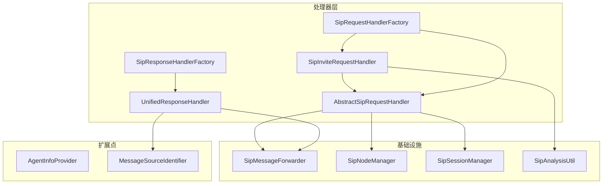
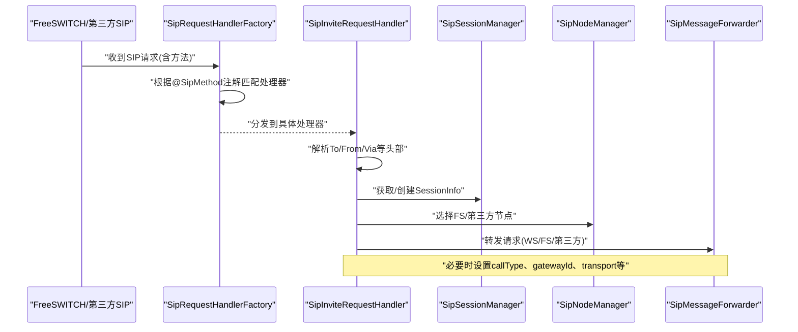
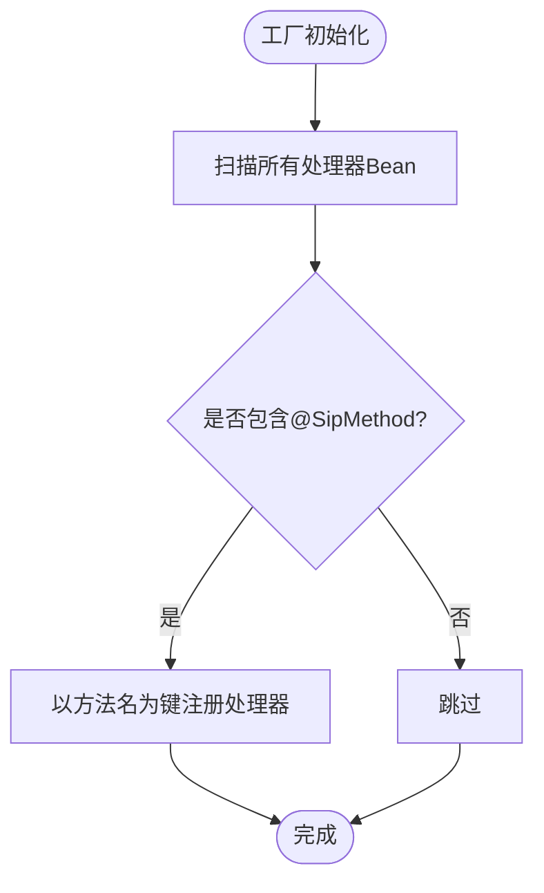
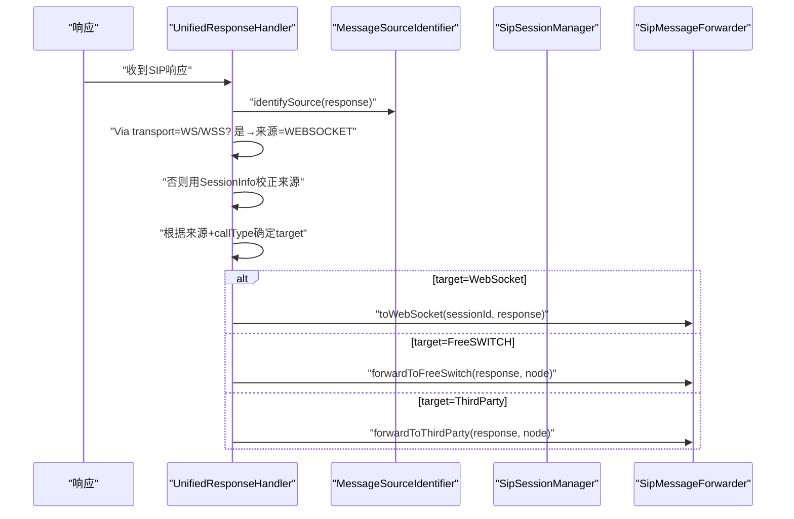
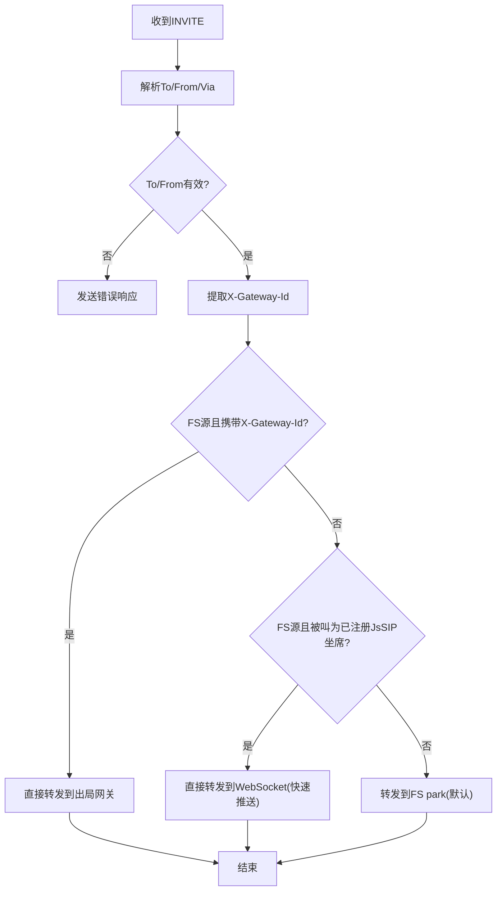
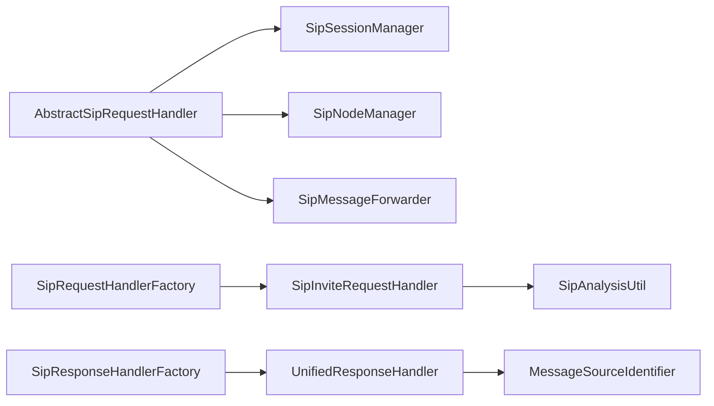

# SIP处理器扩展

<cite>
**本文引用的文件**
- [AbstractSipHandler.java](file://yudao-cloud/yudao-module-cc/ipcc-sipproxy/src/main/java/cn/ipcc/sipproxy/core/handler/AbstractSipHandler.java)
- [AbstractSipRequestHandler.java](file://yudao-cloud/yudao-module-cc/ipcc-sipproxy/src/main/java/cn/ipcc/sipproxy/core/handler/request/sip/AbstractSipRequestHandler.java)
- [SipInviteRequestHandler.java](file://yudao-cloud/yudao-module-cc/ipcc-sipproxy/src/main/java/cn/ipcc/sipproxy/core/handler/request/sip/SipInviteRequestHandler.java)
- [SipRequestHandlerFactory.java](file://yudao-cloud/yudao-module-cc/ipcc-sipproxy/src/main/java/cn/ipcc/sipproxy/core/handler/request/sip/SipRequestHandlerFactory.java)
- [SipResponseHandlerFactory.java](file://yudao-cloud/yudao-module-cc/ipcc-sipproxy/src/main/java/cn/ipcc/sipproxy/core/handler/response/SipResponseHandlerFactory.java)
- [UnifiedResponseHandler.java](file://yudao-cloud/yudao-module-cc/ipcc-sipproxy/core/handler/response/UnifiedResponseHandler.java)
- [SipProxyConstants.java](file://yudao-cloud/yudao-module-cc/ipcc-sipproxy/src/main/java/cn/ipcc/sipproxy/support/SipProxyConstants.java)
- [SipAnalysisUtil.java](file://yudao-cloud/yudao-module-cc/ipcc-sipproxy/src/main/java/cn/ipcc/sipproxy/core/utils/SipAnalysisUtil.java)
- [SipSessionManager.java](file://yudao-cloud/yudao-module-cc/ipcc-sipproxy/src/main/java/cn/ipcc/sipproxy/core/session/SipSessionManager.java)
- [SipMessageForwarder.java](file://yudao-cloud/yudao-module-cc/ipcc-sipproxy/src/main/java/cn/ipcc/sipproxy/core/forwarder/SipMessageForwarder.java)
- [SipNodeManager.java](file://yudao-cloud/yudao-module-cc/ipcc-sipproxy/src/main/java/cn/ipcc/sipproxy/core/node/SipNodeManager.java)
- [AgentInfoProvider.java](file://yudao-cloud/yudao-module-cc/ipcc-sipproxy/src/main/java/cn/ipcc/sipproxy/api/agent/AgentInfoProvider.java)
- [MessageSourceIdentifier.java](file://yudao-cloud/yudao-module-cc/ipcc-sipproxy/src/main/java/cn/ipcc/sipproxy/api/gateway/MessageSourceIdentifier.java)
</cite>

## 目录
1. [简介](#简介)
2. [项目结构](#项目结构)
3. [核心组件](#核心组件)
4. [架构总览](#架构总览)
5. [详细组件分析](#详细组件分析)
6. [依赖关系分析](#依赖关系分析)
7. [性能与优化](#性能与优化)
8. [故障排查指南](#故障排查指南)
9. [结论](#结论)
10. [附录：最佳实践与调试技巧](#附录：最佳实践与调试技巧)

## 简介
本文档面向需要在现有SIP代理模块中扩展自定义SIP方法处理器的开发者，系统讲解如何基于抽象基类实现自定义处理器、如何处理SIP消息头与会话状态、如何通过工厂机制注册并动态选择处理器、如何开发请求/响应拦截器与错误处理策略，并提供完整的INVITE处理示例。同时给出协议扩展的最佳实践、性能优化建议与调试排障要点。

## 项目结构
该SIP代理模块采用分层与职责分离设计：
- 基础能力层：提供通用会话管理、节点选择、消息转发、SIP解析工具等
- 处理器层：按请求/响应维度组织，支持注解驱动的处理器自动注册与选择
- 扩展点层：通过接口暴露认证、网关、媒体、安全、追踪、传输等扩展点
- 默认实现层：提供开箱即用的默认实现，便于快速集成

图表来源
- [SipRequestHandlerFactory.java:1-96](file://yudao-cloud/yudao-module-cc/ipcc-sipproxy/src/main/java/cn/ipcc/sipproxy/core/handler/request/sip/SipRequestHandlerFactory.java#L1-L96)
- [SipInviteRequestHandler.java:1-293](file://yudao-cloud/yudao-module-cc/ipcc-sipproxy/src/main/java/cn/ipcc/sipproxy/core/handler/request/sip/SipInviteRequestHandler.java#L1-L293)
- [UnifiedResponseHandler.java:1-218](file://yudao-cloud/yudao-module-cc/ipcc-sipproxy/core/handler/response/UnifiedResponseHandler.java#L1-L218)
- [SipResponseHandlerFactory.java:1-33](file://yudao-cloud/yudao-module-cc/ipcc-sipproxy/src/main/java/cn/ipcc/sipproxy/core/handler/response/SipResponseHandlerFactory.java#L1-L33)

章节来源
- [SipRequestHandlerFactory.java:1-96](file://yudao-cloud/yudao-module-cc/ipcc-sipproxy/src/main/java/cn/ipcc/sipproxy/core/handler/request/sip/SipRequestHandlerFactory.java#L1-L96)
- [SipInviteRequestHandler.java:1-293](file://yudao-cloud/yudao-module-cc/ipcc-sipproxy/src/main/java/cn/ipcc/sipproxy/core/handler/request/sip/SipInviteRequestHandler.java#L1-L293)
- [UnifiedResponseHandler.java:1-218](file://yudao-cloud/yudao-module-cc/ipcc-sipproxy/core/handler/response/UnifiedResponseHandler.java#L1-L218)

## 核心组件
- 抽象处理器基类：提供通用能力（坐席在线/注册判断、错误响应构造、按注册状态转发等）
- 请求处理器：针对具体SIP方法（如INVITE）的业务逻辑
- 响应处理器：统一处理各类响应，依据来源与呼叫类型决定转发目标
- 处理器工厂：基于注解自动扫描并注册处理器，提供默认处理器兜底
- 会话管理器：维护Call-ID到会话上下文（节点、传输、网关ID、调用类型等）
- 消息转发器：封装向WebSocket、FreeSWITCH、第三方SIP的转发细节
- 节点管理器：选择FreeSWITCH或第三方网关节点
- 扩展点：坐席信息、消息来源识别、跟踪上下文等

章节来源
- [AbstractSipHandler.java:1-74](file://yudao-cloud/yudao-module-cc/ipcc-sipproxy/src/main/java/cn/ipcc/sipproxy/core/handler/AbstractSipHandler.java#L1-L74)
- [AbstractSipRequestHandler.java:1-112](file://yudao-cloud/yudao-module-cc/ipcc-sipproxy/src/main/java/cn/ipcc/sipproxy/core/handler/request/sip/AbstractSipRequestHandler.java#L1-L112)
- [SipInviteRequestHandler.java:1-293](file://yudao-cloud/yudao-module-cc/ipcc-sipproxy/src/main/java/cn/ipcc/sipproxy/core/handler/request/sip/SipInviteRequestHandler.java#L1-L293)
- [SipRequestHandlerFactory.java:1-96](file://yudao-cloud/yudao-module-cc/ipcc-sipproxy/src/main/java/cn/ipcc/sipproxy/core/handler/request/sip/SipRequestHandlerFactory.java#L1-L96)
- [UnifiedResponseHandler.java:1-218](file://yudao-cloud/yudao-module-cc/ipcc-sipproxy/core/handler/response/UnifiedResponseHandler.java#L1-L218)
- [SipResponseHandlerFactory.java:1-33](file://yudao-cloud/yudao-module-cc/ipcc-sipproxy/core/handler/response/SipResponseHandlerFactory.java#L1-L33)

## 架构总览
SIP请求进入后，由请求处理器工厂根据方法名选择具体处理器；处理器负责解析头部、校验参数、创建/复用会话上下文、选择目标节点并转发。响应返回时，统一响应处理器根据来源识别与会话上下文校正，再按策略转发至WebSocket、FreeSWITCH或第三方SIP。

图表来源
- [SipRequestHandlerFactory.java:64-85](file://yudao-cloud/yudao-module-cc/ipcc-sipproxy/src/main/java/cn/ipcc/sipproxy/core/handler/request/sip/SipRequestHandlerFactory.java#L64-L85)
- [SipInviteRequestHandler.java:71-233](file://yudao-cloud/yudao-module-cc/ipcc-sipproxy/core/handler/request/sip/SipInviteRequestHandler.java#L71-L233)

## 详细组件分析

### 继承AbstractSipHandler开发自定义SIP方法处理器
- 基类职责
  - 提供坐席注册与在线判断能力，避免直接耦合上层服务
  - 提供错误响应构造与发送能力，确保响应携带必要头部与会话关联
  - 提供按注册状态转发的通用逻辑（已注册走WebSocket，未注册走第三方）
- 自定义步骤
  - 新建类继承AbstractSipRequestHandler，实现handle(Request, callId, source)
  - 使用SipAnalysisUtil解析头部（To/From/Via等），进行参数校验
  - 通过SipSessionManager缓存/读取SessionInfo，维护会话上下文
  - 通过SipNodeManager选择目标节点，通过SipMessageForwarder转发
  - 在异常路径调用sendErrorResponse发送标准错误响应
- 关键注意事项
  - 保持线程安全：避免共享可变状态，尽量使用局部变量
  - 明确callType：区分内部、入局、出局，影响后续响应转发方向
  - 正确设置传输协议：从Via提取transport，保证响应回送一致性

章节来源
- [AbstractSipHandler.java:20-72](file://yudao-cloud/yudao-module-cc/ipcc-sipproxy/src/main/java/cn/ipcc/sipproxy/core/handler/AbstractSipHandler.java#L20-L72)
- [AbstractSipRequestHandler.java:38-110](file://yudao-cloud/yudao-module-cc/ipcc-sipproxy/src/main/java/cn/ipcc/sipproxy/core/handler/request/sip/AbstractSipRequestHandler.java#L38-L110)

### 处理器工厂的注册机制（优先级、条件匹配、动态加载）
- 自动注册
  - 处理器通过@SipMethod注解声明支持的方法名
  - 工厂启动时扫描所有处理器Bean，将注解值作为键注册到内存Map
- 选择与兜底
  - 根据请求方法精确匹配处理器；若未命中则使用默认处理器
  - 可通过registerHandler动态注入额外处理器
- 扩展点注入
  - HeaderFactory注入到各处理器，用于构造响应头
  - 可结合业务条件在初始化阶段完成更复杂的注册策略

图表来源
- [SipRequestHandlerFactory.java:64-85](file://yudao-cloud/yudao-module-cc/ipcc-sipproxy/src/main/java/cn/ipcc/sipproxy/core/handler/request/sip/SipRequestHandlerFactory.java#L64-L85)

章节来源
- [SipRequestHandlerFactory.java:1-96](file://yudao-cloud/yudao-module-cc/ipcc-sipproxy/src/main/java/cn/ipcc/sipproxy/core/handler/request/sip/SipRequestHandlerFactory.java#L1-L96)

### 响应处理与来源识别
- 统一响应处理器
  - 先通过扩展点识别响应来源（WebSocket/FreeSWITCH/第三方）
  - 当Via transport为WS/WSS时，直接判定来源为WebSocket，跳过上下文校正
  - 否则基于SessionInfo进行二次校正，解决UA相同导致的误识别问题
  - 根据来源与callType选择转发目标（WebSocket/FS/第三方）
- 转发策略
  - 通过SipMessageForwarder分别转发到对应目标
  - 对WebSocket响应进行必要的代理头部修改

图表来源
- [UnifiedResponseHandler.java:31-64](file://yudao-cloud/yudao-module-cc/ipcc-sipproxy/core/handler/response/UnifiedResponseHandler.java#L31-L64)
- [UnifiedResponseHandler.java:153-216](file://yudao-cloud/yudao-module-cc/ipcc-sipproxy/core/handler/response/UnifiedResponseHandler.java#L153-L216)

章节来源
- [UnifiedResponseHandler.java:1-218](file://yudao-cloud/yudao-module-cc/ipcc-sipproxy/core/handler/response/UnifiedResponseHandler.java#L1-L218)
- [SipResponseHandlerFactory.java:1-33](file://yudao-cloud/yudao-module-cc/ipcc-sipproxy/core/handler/response/SipResponseHandlerFactory.java#L1-L33)

### 完整自定义INVITE处理器示例（呼叫建立、媒体协商、会话管理）
- 入口流程
  - 设置链路追踪ID（优先复用Call-ID）
  - 解析To/From/Via等头部，校验必填字段
  - 提取X-Gateway-Id（用于后续IVR覆盖或快速出局豁免）
- 会话上下文
  - 首次INVITE创建SessionInfo，记录transport、callType、freeSwitchNode/thirdPartyNode、gatewayId
  - 后续同Call-ID请求复用已有会话
- 路由决策
  - 豁免场景：FS源且携带X-Gateway-Id → 直接转发到指定出局网关
  - 快速推送：FS源且被叫为已注册JsSIP坐席 → 直接转发到WebSocket（避免FS park死循环）
  - 默认场景：转发到FS park，由ESL执行号码路由与IVR流程
- 媒体协商
  - 通过FS park锚定媒体，SDP协商由FS侧完成
  - 注意WebRTC SDP（RTP/SAVPF+DTLS-SRTP+ICE）在Fs originate到JsSIP时的直接转发优势
- 会话管理
  - 将WebSocket sessionId回写到SessionInfo，确保ACK/BYE等后续请求能正确转发
  - 根据来源与节点选择，设置callType以指导响应转发方向

图表来源
- [SipInviteRequestHandler.java:71-233](file://yudao-cloud/yudao-module-cc/ipcc-sipproxy/core/handler/request/sip/SipInviteRequestHandler.java#L71-L233)

章节来源
- [SipInviteRequestHandler.java:1-293](file://yudao-cloud/yudao-module-cc/ipcc-sipproxy/core/handler/request/sip/SipInviteRequestHandler.java#L1-L293)

### 请求/响应拦截器开发方法
- 现状说明
  - 当前仓库中拦截器包为空目录，表示尚未提供内置拦截器实现
- 建议方案
  - 在请求到达处理器前，通过AOP或过滤器对Request进行预处理（如鉴权、限流、审计）
  - 在响应离开处理器后，对Response进行后处理（如添加追踪头、脱敏）
  - 错误处理：在拦截器捕获异常并转换为标准SIP错误响应
- 与现有组件协作
  - 利用SipAnalysisUtil解析头部，结合SipSessionManager记录上下文
  - 借助SipMessageForwarder统一转发，避免重复实现

[本节为概念性内容，不直接分析具体文件]

## 依赖关系分析
- 处理器与基础设施
  - AbstractSipRequestHandler依赖SipSessionManager、SipNodeManager、SipMessageForwarder
  - SipInviteRequestHandler依赖SipAnalysisUtil进行头部解析
- 工厂与处理器
  - SipRequestHandlerFactory通过@SipMethod注解自动注册处理器
  - SipResponseHandlerFactory统一返回UnifiedResponseHandler
- 响应来源识别
  - UnifiedResponseHandler依赖MessageSourceIdentifier进行来源识别，并结合SessionInfo校正

图表来源
- [AbstractSipRequestHandler.java:27-36](file://yudao-cloud/yudao-module-cc/ipcc-sipproxy/src/main/java/cn/ipcc/sipproxy/core/handler/request/sip/AbstractSipRequestHandler.java#L27-L36)
- [SipInviteRequestHandler.java:7-14](file://yudao-cloud/yudao-module-cc/ipcc-sipproxy/core/handler/request/sip/SipInviteRequestHandler.java#L7-L14)
- [SipRequestHandlerFactory.java:24-33](file://yudao-cloud/yudao-module-cc/ipcc-sipproxy/src/main/java/cn/ipcc/sipproxy/core/handler/request/sip/SipRequestHandlerFactory.java#L24-L33)
- [UnifiedResponseHandler.java:25-29](file://yudao-cloud/yudao-module-cc/ipcc-sipproxy/core/handler/response/UnifiedResponseHandler.java#L25-L29)
- [SipResponseHandlerFactory.java:19-20](file://yudao-cloud/yudao-module-cc/ipcc-sipproxy/core/handler/response/SipResponseHandlerFactory.java#L19-L20)

章节来源
- [SipRequestHandlerFactory.java:1-96](file://yudao-cloud/yudao-module-cc/ipcc-sipproxy/src/main/java/cn/ipcc/sipproxy/core/handler/request/sip/SipRequestHandlerFactory.java#L1-L96)
- [UnifiedResponseHandler.java:1-218](file://yudao-cloud/yudao-module-cc/ipcc-sipproxy/core/handler/response/UnifiedResponseHandler.java#L1-L218)

## 性能与优化
- 减少不必要的FS往返
  - 对于Fs originate到JsSIP坐席的第二段呼叫，优先走WebSocket直推，避免FS park死循环
- 精准来源识别
  - 利用Via transport与SessionInfo双重校验，降低误识别导致的重传与超时
- 会话上下文复用
  - 同一Call-ID的请求应复用SessionInfo，避免重复节点选择与网络开销
- 日志与追踪
  - 使用链路追踪ID串联全链路日志，便于定位瓶颈与问题
- 资源释放
  - 在finally块清理线程级上下文，防止线程池复用导致的状态污染

[本节为通用性能建议，不直接分析具体文件]

## 故障排查指南
- 常见问题
  - 坐席收不到来电：检查快速推送路径是否正确回写WebSocket sessionId
  - 响应错发：确认callType与来源识别是否正确，尤其是第三方网关也是FS部署的场景
  - No ACK超时挂断：确保200 OK正确转发到发起方（WebSocket/FS/第三方）
- 排查步骤
  - 查看INVITE处理日志，确认callType、节点选择、转发目标
  - 检查SessionInfo中freeSwitchNode/thirdPartyNode/gatewayId是否合理
  - 验证Via transport与来源识别结果是否一致
- 常用工具
  - 使用SipAnalysisUtil提取头部信息
  - 通过SipSessionManager查询会话上下文
  - 借助SipMessageForwarder日志观察实际转发行为

章节来源
- [SipInviteRequestHandler.java:142-233](file://yudao-cloud/yudao-module-cc/ipcc-sipproxy/core/handler/request/sip/SipInviteRequestHandler.java#L142-L233)
- [UnifiedResponseHandler.java:31-64](file://yudao-cloud/yudao-module-cc/ipcc-sipproxy/core/handler/response/UnifiedResponseHandler.java#L31-L64)

## 结论
通过继承AbstractSipHandler/AbstractSipRequestHandler并配合注解驱动的处理器工厂，可以快速扩展新的SIP方法处理器。结合统一的响应处理与来源识别机制，能够稳定处理复杂的多端点、多协议场景。遵循本文的最佳实践与优化建议，可在保证可扩展性的同时提升系统性能与可观测性。

[本节为总结性内容，不直接分析具体文件]

## 附录：最佳实践与调试技巧
- 协议扩展最佳实践
  - 严格遵循SIP规范，确保头部完整性与顺序
  - 对非标准头（如X-Gateway-Id）进行健壮解析与容错
  - 明确callType语义，避免响应转发歧义
- 调试技巧
  - 开启详细日志，关注callId、source、callType、target关键字段
  - 使用抓包工具对比SIP报文与转发目标
  - 在关键分支插入断点，验证SessionInfo状态变化
- 测试建议
  - 覆盖豁免场景、快速推送、默认场景三类路径
  - 模拟第三方网关与FS UA相同的情况，验证来源校正逻辑
  - 验证WebSocket WS/WSS场景下的响应转发正确性

[本节为通用指导，不直接分析具体文件]