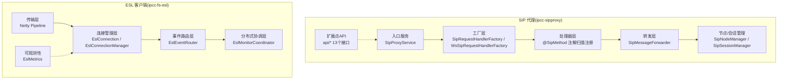
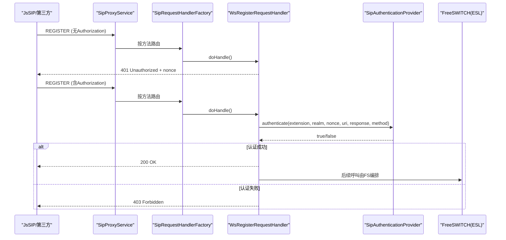
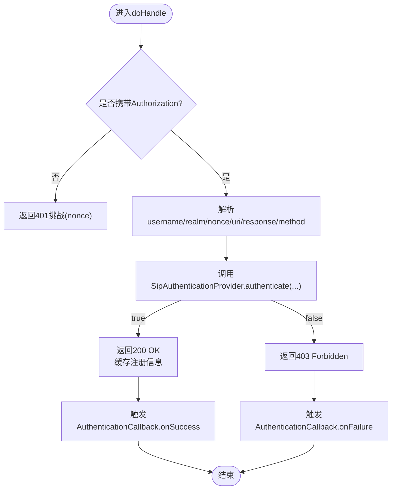
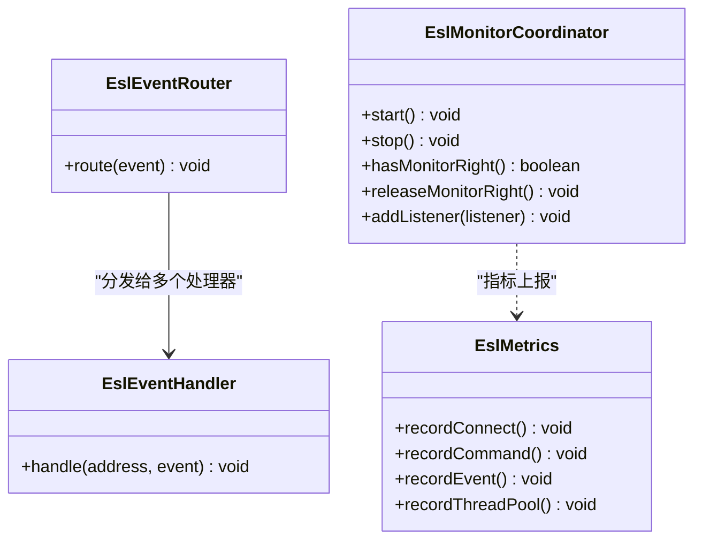
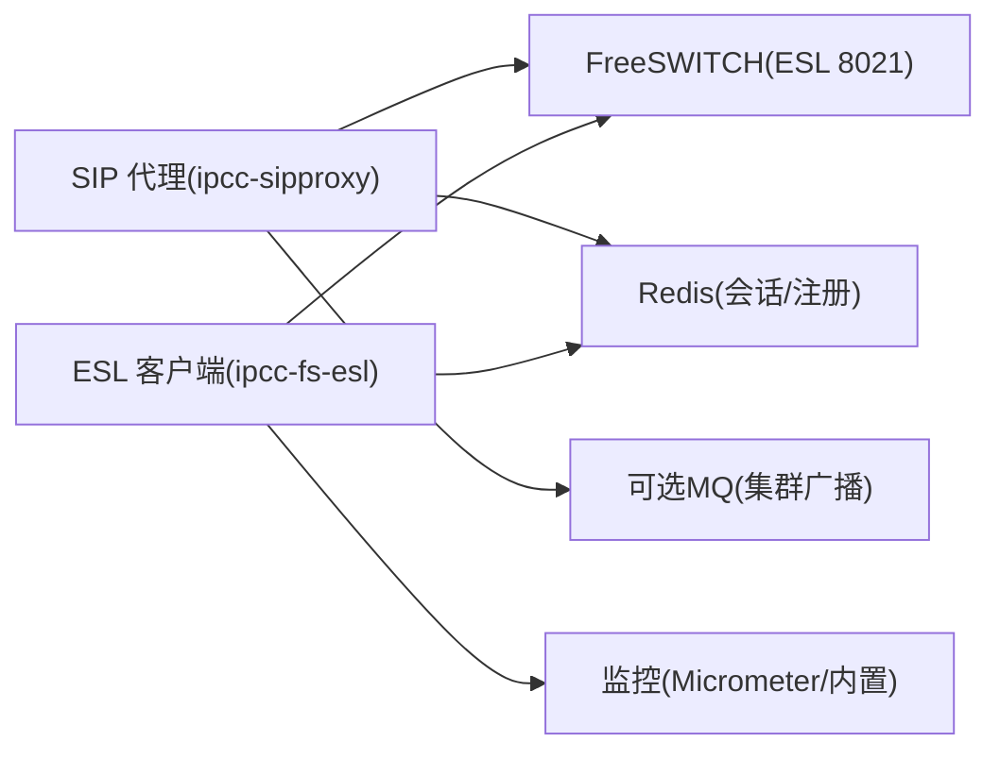

# 插件开发指南

<cite>
**本文引用的文件**
- [README.md](file://yudao-cloud/README.md)
- [ipcc-sipproxy/README.md](file://yudao-cloud/yudao-module-cc/ipcc-sipproxy/README.md)
- [ipcc-fs-esl/README.md](file://yudao-cloud/yudao-module-cc/ipcc-fs-esl/README.md)
- [AgentInfoProvider.java](file://yudao-cloud/yudao-module-cc/ipcc-sipproxy/src/main/java/cn/ipcc/sipproxy/api/agent/AgentInfoProvider.java)
- [SipAuthenticationProvider.java](file://yudao-cloud/yudao-module-cc/ipcc-sipproxy/src/main/java/cn/ipcc/sipproxy/api/authentication/SipAuthenticationProvider.java)
- [EslEventHandler.java](file://yudao-cloud/yudao-module-cc/ipcc-fs-esl/src/main/java/cn/ipcc/fs/esl/router/EslEventHandler.java)
- [EslMonitorCoordinator.java](file://yudao-cloud/yudao-module-cc/ipcc-fs-esl/src/main/java/cn/ipcc/fs/esl/coordinator/EslMonitorCoordinator.java)
- [WsRegisterRequestHandler.java](file://yudao-cloud/yudao-module-cc/ipcc-sipproxy/src/main/java/cn/ipcc/sipproxy/core/handler/request/ws/WsRegisterRequestHandler.java)
</cite>

## 目录
1. [简介](#简介)
2. [项目结构](#项目结构)
3. [核心组件](#核心组件)
4. [架构总览](#架构总览)
5. [详细组件分析](#详细组件分析)
6. [依赖关系分析](#依赖关系分析)
7. [性能与可观测性](#性能与可观测性)
8. [开发与调试指南](#开发与调试指南)
9. [常见问题排查](#常见问题排查)
10. [结论](#结论)
11. [附录：示例与最佳实践](#附录示例与最佳实践)

## 简介
本指南面向需要在呼叫中心/IPPBX 场景中扩展 SIP 代理与 FreeSWITCH ESL 能力的开发者，提供从环境搭建、项目初始化、接口实现到部署上线的完整流程。重点覆盖以下能力：
- 基于 ipcc-sipproxy 的 SIP B2BUA 插件：SIP 消息处理器、WebSocket 接入、会话管理、集群广播与扩展点机制
- 基于 ipcc-fs-esl 的 ESL 事件插件：ESL 事件处理器、分布式监听权协调、连接管理与指标监控
- 业务逻辑处理器：通过扩展点将路由规则、呼叫控制、数据统计等能力注入到系统

## 项目结构
整体采用“协议接入层 + 核心处理层 + 扩展点 API + 基础设施”的分层设计，两个关键子模块职责清晰：
- ipcc-sipproxy：SIP 代理服务（B2BUA），负责 SIP over WebSocket/UDP/TCP 接入、请求路由、转发、会话与节点管理，并通过 13 个扩展点与父程序解耦
- ipcc-fs-esl：FreeSWITCH ESL 客户端库，负责连接管理、事件路由、分布式监听权协调与可观测性

图表来源
- [ipcc-sipproxy/README.md:72-127](file://yudao-cloud/yudao-module-cc/ipcc-sipproxy/README.md#L72-L127)
- [ipcc-fs-esl/README.md:50-98](file://yudao-cloud/yudao-module-cc/ipcc-fs-esl/README.md#L50-L98)

章节来源
- [ipcc-sipproxy/README.md:301-338](file://yudao-cloud/yudao-module-cc/ipcc-sipproxy/README.md#L301-L338)
- [ipcc-fs-esl/README.md:78-98](file://yudao-cloud/yudao-module-cc/ipcc-fs-esl/README.md#L78-L98)

## 核心组件
- SIP 代理扩展点
  - 坐席信息查询：AgentInfoProvider
  - SIP Digest 认证：SipAuthenticationProvider
  - 其他扩展点（网关、SDP、限流、追踪、传输等）详见模块文档
- ESL 事件与协调
  - ESL 事件处理器：EslEventHandler（注解驱动路由）
  - 分布式监听权协调：EslMonitorCoordinator（多实例竞争、心跳续期、切换回调）
- 典型处理器
  - WebSocket REGISTER 处理器：WsRegisterRequestHandler（401 挑战 → 校验 → 200 OK/403）

章节来源
- [AgentInfoProvider.java:1-23](file://yudao-cloud/yudao-module-cc/ipcc-sipproxy/src/main/java/cn/ipcc/sipproxy/api/agent/AgentInfoProvider.java#L1-L23)
- [SipAuthenticationProvider.java:1-44](file://yudao-cloud/yudao-module-cc/ipcc-sipproxy/src/main/java/cn/ipcc/sipproxy/api/authentication/SipAuthenticationProvider.java#L1-L44)
- [EslEventHandler.java:1-20](file://yudao-cloud/yudao-module-cc/ipcc-fs-esl/src/main/java/cn/ipcc/fs/esl/router/EslEventHandler.java#L1-L20)
- [EslMonitorCoordinator.java:1-33](file://yudao-cloud/yudao-module-cc/ipcc-fs-esl/src/main/java/cn/ipcc/fs/esl/coordinator/EslMonitorCoordinator.java#L1-L33)
- [WsRegisterRequestHandler.java:1-228](file://yudao-cloud/yudao-module-cc/ipcc-sipproxy/src/main/java/cn/ipcc/sipproxy/core/handler/request/ws/WsRegisterRequestHandler.java#L1-L228)

## 架构总览
SIP 代理采用五层架构：入口层 → 工厂层 → 处理器层 → 转发层 → 节点/会话管理层；辅以 WebSocket 接入、集群广播与扩展点 API。ESL 客户端自底向上为：传输层 → 连接层 → 事件路由层 → 分布式协调层，并提供可观测性。

图表来源
- [WsRegisterRequestHandler.java:78-141](file://yudao-cloud/yudao-module-cc/ipcc-sipproxy/src/main/java/cn/ipcc/sipproxy/core/handler/request/ws/WsRegisterRequestHandler.java#L78-L141)
- [SipAuthenticationProvider.java:24-42](file://yudao-cloud/yudao-module-cc/ipcc-sipproxy/src/main/java/cn/ipcc/sipproxy/api/authentication/SipAuthenticationProvider.java#L24-L42)

章节来源
- [ipcc-sipproxy/README.md:72-127](file://yudao-cloud/yudao-module-cc/ipcc-sipproxy/README.md#L72-L127)

## 详细组件分析

### SIP 代理插件开发（SIP 消息处理器）
- 新增处理器
  - 在 core/handler/request/{sip,ws}/ 下创建类并标注 @SipMethod("XXX")，工厂自动扫描注册
  - 继承 AbstractSipHandler/AbstractWsSipRequestHandler，实现 doHandle 逻辑
- 认证与回调
  - 默认通过 AgentInfoProvider 获取密码并本地计算 Digest；父程序可实现 SipAuthenticationProvider 完全接管
  - 可选实现 AuthenticationCallback 以记录审计或更新状态
- 转发与会话
  - 使用 SipMessageForwarder 进行转发（FS/第三方/WebSocket/出局网关）
  - 会话状态由 SipSessionManager 维护，TTL 配置见模块配置项

图表来源
- [WsRegisterRequestHandler.java:78-171](file://yudao-cloud/yudao-module-cc/ipcc-sipproxy/src/main/java/cn/ipcc/sipproxy/core/handler/request/ws/WsRegisterRequestHandler.java#L78-L171)

章节来源
- [ipcc-sipproxy/README.md:201-218](file://yudao-cloud/yudao-module-cc/ipcc-sipproxy/README.md#L201-L218)
- [WsRegisterRequestHandler.java:1-228](file://yudao-cloud/yudao-module-cc/ipcc-sipproxy/src/main/java/cn/ipcc/sipproxy/core/handler/request/ws/WsRegisterRequestHandler.java#L1-L228)

### ESL 事件插件开发（ESL 事件处理器）
- 事件处理器
  - 实现 EslEventHandler，标注 @EslEventName 指定事件名，支持多处理器与顺序控制
  - 事件经 EslEventRouter 分发，通道一致性哈希保证同通道事件顺序
- 分布式监听权
  - 实现 EslMonitorCoordinator 的协调策略（默认 Redis 实现），多实例竞争持权，心跳续期，切换回调
- 可观测性
  - 通过 EslMetrics 暴露连接、命令、事件、线程池四类指标，可替换为 Micrometer 等

图表来源
- [EslEventHandler.java:1-20](file://yudao-cloud/yudao-module-cc/ipcc-fs-esl/src/main/java/cn/ipcc/fs/esl/router/EslEventHandler.java#L1-L20)
- [EslMonitorCoordinator.java:1-33](file://yudao-cloud/yudao-module-cc/ipcc-fs-esl/src/main/java/cn/ipcc/fs/esl/coordinator/EslMonitorCoordinator.java#L1-L33)
- [ipcc-fs-esl/README.md:181-258](file://yudao-cloud/yudao-module-cc/ipcc-fs-esl/README.md#L181-L258)

章节来源
- [ipcc-fs-esl/README.md:181-258](file://yudao-cloud/yudao-module-cc/ipcc-fs-esl/README.md#L181-L258)

### 业务逻辑处理器（路由规则/呼叫控制/数据统计）
- 路由规则
  - 在 sipproxy 中不直接做呼叫决策，统一 park 到 FS，号码路由/IVR/bridge 由 ESL 层完成；可在 ESL 事件处理器中根据业务规则调整路由
- 呼叫控制
  - 通过 ESL 事件处理器对呼叫生命周期事件进行处理（如桥接、播放、转接），结合 EslMonitorCoordinator 确保多实例一致性
- 数据统计
  - 利用 EslMetrics 与拦截器链记录事件计数、耗时、错误率，对接监控系统

章节来源
- [ipcc-sipproxy/README.md:340-349](file://yudao-cloud/yudao-module-cc/ipcc-sipproxy/README.md#L340-L349)
- [ipcc-fs-esl/README.md:40-48](file://yudao-cloud/yudao-module-cc/ipcc-fs-esl/README.md#L40-L48)

## 依赖关系分析
- 模块内依赖
  - sipproxy：JAIN-SIP、Spring Boot、Redis、可选 MQ（集群广播）
  - fs-esl：Netty 4.x、Spring Boot、Redis（分布式协调）、可选监控后端
- 外部依赖
  - FreeSWITCH（开启 ESL 8021 端口）
  - Redis（会话/注册信息存储、监听权协调）
  - 可选 MQ（Kafka/RabbitMQ/RocketMQ）用于集群广播

图表来源
- [ipcc-sipproxy/README.md:61-69](file://yudao-cloud/yudao-module-cc/ipcc-sipproxy/README.md#L61-L69)
- [ipcc-fs-esl/README.md:153-178](file://yudao-cloud/yudao-module-cc/ipcc-fs-esl/README.md#L153-L178)

章节来源
- [ipcc-sipproxy/README.md:61-69](file://yudao-cloud/yudao-module-cc/ipcc-sipproxy/README.md#L61-L69)
- [ipcc-fs-esl/README.md:153-178](file://yudao-cloud/yudao-module-cc/ipcc-fs-esl/README.md#L153-L178)

## 性能与可观测性
- 性能要点
  - Netty 4.x 高性能编解码，避免阻塞 IO
  - 事件执行策略 CHANNEL_HASH/SINGLE_THREAD/FULL_CONCURRENT 可按场景选择
  - 最大帧大小、头行数限制防止 OOM 与放大攻击
- 可观测性
  - 连接、命令、事件、线程池四类指标
  - 事件拦截器链支持链路追踪、过滤、审计
  - 建议接入 Micrometer 与集中式日志平台

章节来源
- [ipcc-fs-esl/README.md:40-48](file://yudao-cloud/yudao-module-cc/ipcc-fs-esl/README.md#L40-L48)
- [ipcc-fs-esl/README.md:153-178](file://yudao-cloud/yudao-module-cc/ipcc-fs-esl/README.md#L153-L178)

## 开发与调试指南
- 环境搭建
  - JDK 17+、Maven 3.8+、Redis、FreeSWITCH（ESL 8021）
  - 引入对应模块依赖，启用自动配置
- 最小化集成
  - sipproxy：添加 sipproxy.* 配置，启动后自动装配
  - fs-esl：添加 ipcc.fs.esl.* 配置，自动创建连接管理器与事件路由器
- 调试技巧
  - 使用示例工程验证注册与基础呼叫流程
  - 通过事件拦截器与指标观察事件流转与性能瓶颈
  - 关注 WebSocket 握手 token 认证与 SIP Digest 认证流程

章节来源
- [ipcc-sipproxy/README.md:129-177](file://yudao-cloud/yudao-module-cc/ipcc-sipproxy/README.md#L129-L177)
- [ipcc-fs-esl/README.md:102-151](file://yudao-cloud/yudao-module-cc/ipcc-fs-esl/README.md#L102-L151)

## 常见问题排查
- 认证失败
  - 检查 Authorization 头字段是否正确，确认 SipAuthenticationProvider 实现逻辑
  - 查看 401/403 响应与日志定位原因
- 事件未处理
  - 确认 @EslEventName 注解与事件名匹配
  - 检查事件执行策略与线程池容量，避免队列溢出
- 连接不稳定
  - 调整健康检查间隔与阈值，关注重连策略
  - 分布式协调模式下确认 Redis 可用性与锁过期时间

章节来源
- [WsRegisterRequestHandler.java:173-201](file://yudao-cloud/yudao-module-cc/ipcc-sipproxy/src/main/java/cn/ipcc/sipproxy/core/handler/request/ws/WsRegisterRequestHandler.java#L173-L201)
- [ipcc-fs-esl/README.md:153-178](file://yudao-cloud/yudao-module-cc/ipcc-fs-esl/README.md#L153-L178)

## 结论
通过 ipcc-sipproxy 与 ipcc-fs-esl 的组合，可以在不侵入业务代码的前提下，以扩展点方式灵活实现 SIP 代理与 ESL 事件处理。遵循模块约束与最佳实践，可快速构建高可用的呼叫中心/IPPBX 插件体系。

## 附录：示例与最佳实践
- 示例工程
  - sipproxy：example-1-java（默认实现 + H2）、example-2-java（全扩展点覆盖）、example-jssip（前端测试）
  - fs-esl：example/example-java（完整集成示例）
- 最佳实践
  - 保持模块独立性与 B2BUA 语义一致性
  - 不在 sipproxy 中做呼叫决策，交由 FS 编排
  - 使用扩展点解耦父程序依赖，便于替换与升级
  - 合理配置 TTL、超时与线程池参数，保障稳定性与性能

章节来源
- [ipcc-sipproxy/README.md:248-300](file://yudao-cloud/yudao-module-cc/ipcc-sipproxy/README.md#L248-L300)
- [ipcc-fs-esl/README.md:264-280](file://yudao-cloud/yudao-module-cc/ipcc-fs-esl/README.md#L264-L280)