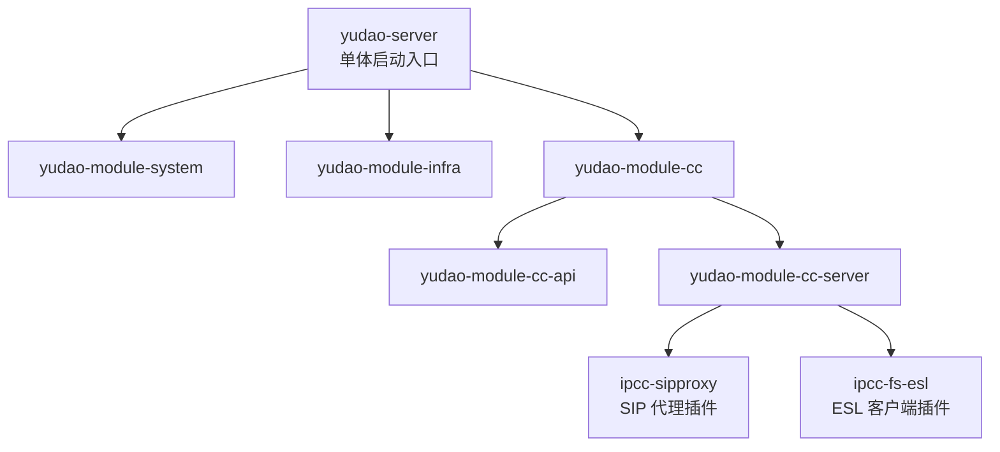
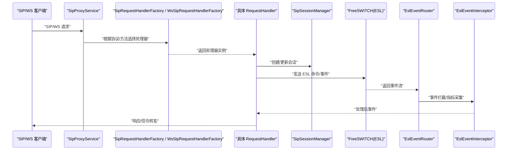
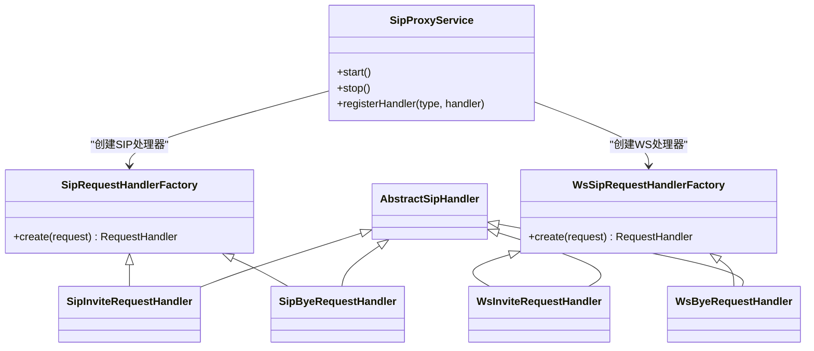
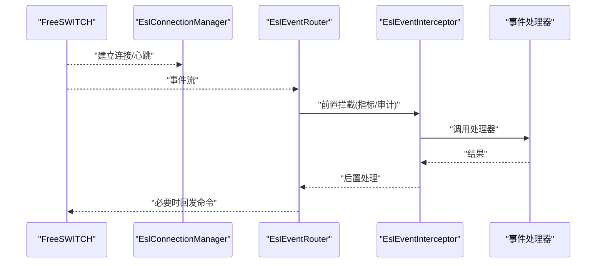
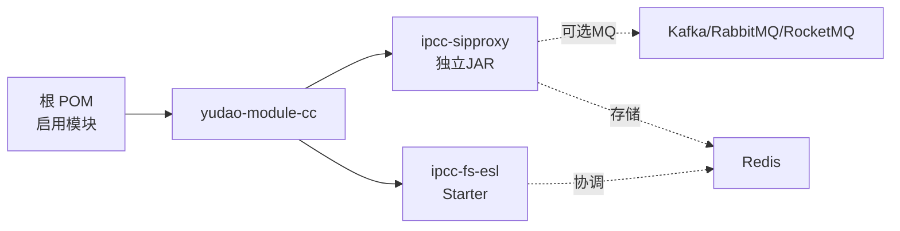

# 插件开发框架

<cite>
**本文引用的文件**
- [README.md](file://README.md)
- [agents.md](file://agents.md)
- [pom.xml（根）](file://yudao-cloud/pom.xml)
- [ipcc-sipproxy/pom.xml](file://yudao-cloud/yudao-module-cc/ipcc-sipproxy/pom.xml)
- [SipProxyService.java](file://yudao-cloud/yudao-module-cc/ipcc-sipproxy/src/main/java/cn/ipcc/sipproxy/core/SipProxyService.java)
- [SipRequestHandlerFactory.java](file://yudao-cloud/yudao-module-cc/ipcc-sipproxy/src/main/java/cn/ipcc/sipproxy/core/handler/request/sip/SipRequestHandlerFactory.java)
- [WsSipRequestHandlerFactory.java](file://yudao-cloud/yudao-module-cc/ipcc-sipproxy/src/main/java/cn/ipcc/sipproxy/core/handler/request/ws/WsSipRequestHandlerFactory.java)
- [EslAutoConfiguration.java](file://yudao-cloud/yudao-module-cc/ipcc-fs-esl/src/main/java/cn/ipcc/fs/esl/spring/EslAutoConfiguration.java)
- [EslConnectionManager.java](file://yudao-cloud/yudao-module-cc/ipcc-fs-esl/src/main/java/cn/ipcc/fs/esl/EslConnectionManager.java)
- [EslEventRouter.java](file://yudao-cloud/yudao-module-cc/ipcc-fs-esl/src/main/java/cn/ipcc/fs/esl/router/EslEventRouter.java)
- [EslEventInterceptor.java](file://yudao-cloud/yudao-module-cc/ipcc-fs-esl/src/main/java/cn/ipcc/fs/esl/interceptor/EslEventInterceptor.java)
- [RedisEslMonitorCoordinator.java](file://yudao-cloud/yudao-module-cc/ipcc-fs-esl/src/main/java/cn/ipcc/fs/esl/coordinator/redis/RedisEslMonitorCoordinator.java)
- [EslClientProperties.java](file://yudao-cloud/yudao-module-cc/ipcc-fs-esl/src/main/java/cn/ipcc/fs/esl/spring/EslClientProperties.java)
</cite>

## 目录
1. [简介](#简介)
2. [项目结构](#项目结构)
3. [核心组件](#核心组件)
4. [架构总览](#架构总览)
5. [详细组件分析](#详细组件分析)
6. [依赖关系分析](#依赖关系分析)
7. [性能与可观测性](#性能与可观测性)
8. [故障排查指南](#故障排查指南)
9. [结论](#结论)
10. [附录：插件开发与部署规范](#附录：插件开发与部署规范)

## 简介
本仓库基于 yudao-cloud 构建呼叫中心系统，采用“单体启动 + 多模块”的后端组织方式。其中 ipcc-sipproxy 与 ipcc-fs-esl 两个子模块具备“可插拔、可扩展”的插件化能力：前者提供 SIP 代理与 WebSocket 接入、会话管理与集群广播；后者提供 FreeSWITCH ESL 客户端、事件路由、拦截器与指标采集。通过 Spring Boot Starter 与 SPI 扩展点，业务方可以以“插件”形式接入 SIP 处理链路与 ESL 事件处理链路，实现热插拔式的能力扩展。

## 项目结构
- 后端以单体模式运行，唯一启动入口为 yudao-server，启用 system、infra、cc 三个业务模块。
- cc 模块为核心业务域，包含：
  - yudao-module-cc-api：对外 API、DTO、枚举常量。
  - yudao-module-cc-server：autocall、call、esl、flow、fs、sipproxy、sys 等子域实现。
  - ipcc-sipproxy：独立 SIP 代理服务（可被任意 Spring Boot 工程复用）。
  - ipcc-fs-esl：FreeSWITCH ESL 客户端（Netty），提供连接管理、事件路由、拦截器、指标与协调器。

图表来源
- [pom.xml（根）:10-33](file://yudao-cloud/pom.xml#L10-L33)
- [agents.md:15-37](file://agents.md#L15-L37)

章节来源
- [agents.md:15-37](file://agents.md#L15-L37)
- [pom.xml（根）:10-33](file://yudao-cloud/pom.xml#L10-L33)

## 核心组件
- SIP 代理插件（ipcc-sipproxy）
  - 请求处理工厂：按协议/方法分派到具体处理器（SIP/WS）。
  - 会话管理：维护 SIP 会话状态，支持 Redis 持久化。
  - 集群广播：可选 Kafka/RabbitMQ/RocketMQ 进行跨节点消息广播。
- ESL 客户端插件（ipcc-fs-esl）
  - 连接管理：连接池、重连、健康检查。
  - 事件路由：将 FreeSWITCH 事件分发到处理器。
  - 拦截器：统一埋点、指标采集、审计。
  - 协调器：基于 Redis 的监控与协调。

章节来源
- [SipProxyService.java](file://yudao-cloud/yudao-module-cc/ipcc-sipproxy/src/main/java/cn/ipcc/sipproxy/core/SipProxyService.java)
- [SipRequestHandlerFactory.java](file://yudao-cloud/yudao-module-cc/ipcc-sipproxy/src/main/java/cn/ipcc/sipproxy/core/handler/request/sip/SipRequestHandlerFactory.java)
- [WsSipRequestHandlerFactory.java](file://yudao-cloud/yudao-module-cc/ipcc-sipproxy/src/main/java/cn/ipcc/sipproxy/core/handler/request/ws/WsSipRequestHandlerFactory.java)
- [EslAutoConfiguration.java](file://yudao-cloud/yudao-module-cc/ipcc-fs-esl/src/main/java/cn/ipcc/fs/esl/spring/EslAutoConfiguration.java)
- [EslConnectionManager.java](file://yudao-cloud/yudao-module-cc/ipcc-fs-esl/src/main/java/cn/ipcc/fs/esl/EslConnectionManager.java)
- [EslEventRouter.java](file://yudao-cloud/yudao-module-cc/ipcc-fs-esl/src/main/java/cn/ipcc/fs/esl/router/EslEventRouter.java)
- [EslEventInterceptor.java](file://yudao-cloud/yudao-module-cc/ipcc-fs-esl/src/main/java/cn/ipcc/fs/esl/interceptor/EslEventInterceptor.java)
- [RedisEslMonitorCoordinator.java](file://yudao-cloud/yudao-module-cc/ipcc-fs-esl/src/main/java/cn/ipcc/fs/esl/coordinator/redis/RedisEslMonitorCoordinator.java)

## 架构总览
下图展示了“SIP 请求进入 → 协议解析 → 处理器分派 → 会话管理 → 外部 FS 交互 → 事件回传”的整体流程，以及“ESL 事件路由 → 拦截器 → 指标上报”的处理链路。

图表来源
- [SipProxyService.java](file://yudao-cloud/yudao-module-cc/ipcc-sipproxy/src/main/java/cn/ipcc/sipproxy/core/SipProxyService.java)
- [SipRequestHandlerFactory.java](file://yudao-cloud/yudao-module-cc/ipcc-sipproxy/src/main/java/cn/ipcc/sipproxy/core/handler/request/sip/SipRequestHandlerFactory.java)
- [WsSipRequestHandlerFactory.java](file://yudao-cloud/yudao-module-cc/ipcc-sipproxy/src/main/java/cn/ipcc/sipproxy/core/handler/request/ws/WsSipRequestHandlerFactory.java)
- [EslEventRouter.java](file://yudao-cloud/yudao-module-cc/ipcc-fs-esl/src/main/java/cn/ipcc/fs/esl/router/EslEventRouter.java)
- [EslEventInterceptor.java](file://yudao-cloud/yudao-module-cc/ipcc-fs-esl/src/main/java/cn/ipcc/fs/esl/interceptor/EslEventInterceptor.java)

## 详细组件分析

### SIP 代理插件（ipcc-sipproxy）
- 设计要点
  - 无父 POM 继承，完全独立可发布 jar，避免与宿主工程版本冲突。
  - 通过 Spring Boot Starter 自动装配，暴露扩展点供上层注入自定义处理器。
  - 使用 JAIN-SIP 作为协议栈，WebSocket 接入由 Spring WebSocket 提供。
  - 会话状态可落盘 Redis，支持集群广播（Kafka/RabbitMQ/RocketMQ 可选）。
- 关键类与职责
  - SipProxyService：服务编排与生命周期管理。
  - SipRequestHandlerFactory / WsSipRequestHandlerFactory：按协议与方法分派处理器。
  - 各具体 RequestHandler：实现 Invite/Bye/Options/Refer/Register 等逻辑。
  - SessionManager：会话生命周期与状态同步。

图表来源
- [SipProxyService.java](file://yudao-cloud/yudao-module-cc/ipcc-sipproxy/src/main/java/cn/ipcc/sipproxy/core/SipProxyService.java)
- [SipRequestHandlerFactory.java](file://yudao-cloud/yudao-module-cc/ipcc-sipproxy/src/main/java/cn/ipcc/sipproxy/core/handler/request/sip/SipRequestHandlerFactory.java)
- [WsSipRequestHandlerFactory.java](file://yudao-cloud/yudao-module-cc/ipcc-sipproxy/src/main/java/cn/ipcc/sipproxy/core/handler/request/ws/WsSipRequestHandlerFactory.java)

章节来源
- [ipcc-sipproxy/pom.xml:5-20](file://yudao-cloud/yudao-module-cc/ipcc-sipproxy/pom.xml#L5-L20)
- [ipcc-sipproxy/pom.xml:58-158](file://yudao-cloud/yudao-module-cc/ipcc-sipproxy/pom.xml#L58-L158)
- [SipProxyService.java](file://yudao-cloud/yudao-module-cc/ipcc-sipproxy/src/main/java/cn/ipcc/sipproxy/core/SipProxyService.java)
- [SipRequestHandlerFactory.java](file://yudao-cloud/yudao-module-cc/ipcc-sipproxy/src/main/java/cn/ipcc/sipproxy/core/handler/request/sip/SipRequestHandlerFactory.java)
- [WsSipRequestHandlerFactory.java](file://yudao-cloud/yudao-module-cc/ipcc-sipproxy/src/main/java/cn/ipcc/sipproxy/core/handler/request/ws/WsSipRequestHandlerFactory.java)

### ESL 客户端插件（ipcc-fs-esl）
- 设计要点
  - 基于 Netty 的高性能传输层，封装 ESL 帧编解码。
  - 事件路由：按事件名路由到处理器，支持拦截器链。
  - 连接管理：连接池、心跳、断线重连、健康检查。
  - 指标与监控：默认指标实现，Redis 协调器用于集群监控。
- 关键类与职责
  - EslAutoConfiguration：自动装配与属性绑定。
  - EslConnectionManager：连接生命周期管理。
  - EslEventRouter：事件分发。
  - EslEventInterceptor：拦截器（指标、审计等）。
  - RedisEslMonitorCoordinator：基于 Redis 的集群协调。

图表来源
- [EslAutoConfiguration.java](file://yudao-cloud/yudao-module-cc/ipcc-fs-esl/src/main/java/cn/ipcc/fs/esl/spring/EslAutoConfiguration.java)
- [EslConnectionManager.java](file://yudao-cloud/yudao-module-cc/ipcc-fs-esl/src/main/java/cn/ipcc/fs/esl/EslConnectionManager.java)
- [EslEventRouter.java](file://yudao-cloud/yudao-module-cc/ipcc-fs-esl/src/main/java/cn/ipcc/fs/esl/router/EslEventRouter.java)
- [EslEventInterceptor.java](file://yudao-cloud/yudao-module-cc/ipcc-fs-esl/src/main/java/cn/ipcc/fs/esl/interceptor/EslEventInterceptor.java)
- [RedisEslMonitorCoordinator.java](file://yudao-cloud/yudao-module-cc/ipcc-fs-esl/src/main/java/cn/ipcc/fs/esl/coordinator/redis/RedisEslMonitorCoordinator.java)

章节来源
- [EslAutoConfiguration.java](file://yudao-cloud/yudao-module-cc/ipcc-fs-esl/src/main/java/cn/ipcc/fs/esl/spring/EslAutoConfiguration.java)
- [EslConnectionManager.java](file://yudao-cloud/yudao-module-cc/ipcc-fs-esl/src/main/java/cn/ipcc/fs/esl/EslConnectionManager.java)
- [EslEventRouter.java](file://yudao-cloud/yudao-module-cc/ipcc-fs-esl/src/main/java/cn/ipcc/fs/esl/router/EslEventRouter.java)
- [EslEventInterceptor.java](file://yudao-cloud/yudao-module-cc/ipcc-fs-esl/src/main/java/cn/ipcc/fs/esl/interceptor/EslEventInterceptor.java)
- [RedisEslMonitorCoordinator.java](file://yudao-cloud/yudao-module-cc/ipcc-fs-esl/src/main/java/cn/ipcc/fs/esl/coordinator/redis/RedisEslMonitorCoordinator.java)

## 依赖关系分析
- 顶层聚合 POM 仅启用 system、infra、cc 模块，便于快速构建与运行。
- ipcc-sipproxy 不继承任何父 POM，所有依赖显式声明，确保独立可发布。
- ipcc-fs-esl 通过 Spring Boot Starter 机制向宿主应用暴露配置与自动装配。

图表来源
- [pom.xml（根）:10-33](file://yudao-cloud/pom.xml#L10-L33)
- [ipcc-sipproxy/pom.xml:80-97](file://yudao-cloud/yudao-module-cc/ipcc-sipproxy/pom.xml#L80-L97)

章节来源
- [pom.xml（根）:10-33](file://yudao-cloud/pom.xml#L10-L33)
- [ipcc-sipproxy/pom.xml:80-97](file://yudao-cloud/yudao-module-cc/ipcc-sipproxy/pom.xml#L80-L97)

## 性能与可观测性
- 高吞吐
  - ESL 基于 Netty 异步 I/O，事件路由与拦截器链轻量高效。
  - SIP 处理通过工厂分派，避免条件分支膨胀。
- 可观测性
  - 内置指标采集（EslMetrics），可通过拦截器统一上报。
  - 集群监控通过 Redis 协调器实现节点状态共享。
- 资源管理
  - 连接池与 Channel 生命周期由管理器统一控制，避免泄漏。
  - 会话状态可持久化至 Redis，提升容错与水平扩展能力。

[本节为通用性能讨论，不直接分析具体文件]

## 故障排查指南
- 常见问题定位
  - 连接异常：检查 EslConnectionManager 的重连策略与超时配置。
  - 事件丢失：确认 EslEventRouter 的路由规则与拦截器是否吞掉异常。
  - 会话不一致：核对 SipSessionManager 的状态机与 Redis 同步逻辑。
- 调试建议
  - 开启 ESL 事件拦截器日志，观察事件流转。
  - 使用集群协调器查看节点健康与负载分布。
  - 对 SIP 处理器增加入参校验与边界条件日志。

章节来源
- [EslConnectionManager.java](file://yudao-cloud/yudao-module-cc/ipcc-fs-esl/src/main/java/cn/ipcc/fs/esl/EslConnectionManager.java)
- [EslEventRouter.java](file://yudao-cloud/yudao-module-cc/ipcc-fs-esl/src/main/java/cn/ipcc/fs/esl/router/EslEventRouter.java)
- [EslEventInterceptor.java](file://yudao-cloud/yudao-module-cc/ipcc-fs-esl/src/main/java/cn/ipcc/fs/esl/interceptor/EslEventInterceptor.java)
- [RedisEslMonitorCoordinator.java](file://yudao-cloud/yudao-module-cc/ipcc-fs-esl/src/main/java/cn/ipcc/fs/esl/coordinator/redis/RedisEslMonitorCoordinator.java)

## 结论
本项目在 yudao-cloud 基础上，通过 ipcc-sipproxy 与 ipcc-fs-esl 实现了“可插拔、可扩展”的插件化架构。SIP 代理与 ESL 客户端分别以独立 Jar 与 Starter 形式提供，配合工厂分派、事件路由、拦截器与协调器，形成完整的插件生命周期管理与扩展点体系。结合 Redis 与可选 MQ，满足高可用与水平扩展需求。

[本节为总结性内容，不直接分析具体文件]

## 附录：插件开发与部署规范

### 插件接口定义与生命周期
- 插件接口
  - SIP 处理器：通过工厂注册不同协议/方法的处理器，实现特定信令处理逻辑。
  - ESL 事件处理器：订阅事件并实现处理逻辑，可通过拦截器统一埋点。
- 生命周期
  - 启动：自动装配加载配置，初始化连接与会话。
  - 运行：接收请求/事件，执行处理器逻辑，维护状态。
  - 停止：优雅关闭连接、释放资源、保存状态。

章节来源
- [SipRequestHandlerFactory.java](file://yudao-cloud/yudao-module-cc/ipcc-sipproxy/src/main/java/cn/ipcc/sipproxy/core/handler/request/sip/SipRequestHandlerFactory.java)
- [WsSipRequestHandlerFactory.java](file://yudao-cloud/yudao-module-cc/ipcc-sipproxy/src/main/java/cn/ipcc/sipproxy/core/handler/request/ws/WsSipRequestHandlerFactory.java)
- [EslAutoConfiguration.java](file://yudao-cloud/yudao-module-cc/ipcc-fs-esl/src/main/java/cn/ipcc/fs/esl/spring/EslAutoConfiguration.java)
- [EslConnectionManager.java](file://yudao-cloud/yudao-module-cc/ipcc-fs-esl/src/main/java/cn/ipcc/fs/esl/EslConnectionManager.java)

### 依赖注入机制
- 通过 Spring Boot Starter 自动装配，暴露配置项与 Bean。
- 使用工厂模式与 SPI 扩展点，将处理器与事件处理器以插件形式注入。
- 可选 MQ 与 Redis 作为横向扩展与状态共享的基础设施。

章节来源
- [ipcc-sipproxy/pom.xml:80-97](file://yudao-cloud/yudao-module-cc/ipcc-sipproxy/pom.xml#L80-L97)
- [EslAutoConfiguration.java](file://yudao-cloud/yudao-module-cc/ipcc-fs-esl/src/main/java/cn/ipcc/fs/esl/spring/EslAutoConfiguration.java)
- [EslClientProperties.java](file://yudao-cloud/yudao-module-cc/ipcc-fs-esl/src/main/java/cn/ipcc/fs/esl/spring/EslClientProperties.java)

### 项目结构与包命名约定
- 后端
  - 模块划分：system、infra、cc（核心）、gateway（未启用）。
  - cc 模块：api 与 server 分离，内部按子域组织。
  - 插件模块：ipcc-sipproxy、ipcc-fs-esl 独立打包。
- 前端
  - 按模块组织 API 与页面，遵循路径别名与类型约束。

章节来源
- [agents.md:15-37](file://agents.md#L15-L37)
- [agents.md:80-86](file://agents.md#L80-L86)

### 配置文件格式
- 后端
  - application.yaml：禁用 Nacos，开启多租户与加解密。
  - 本地环境：数据库、Redis 连接配置。
  - 插件配置：ESL 客户端属性、SIP 代理相关参数。
- 前端
  - 环境变量：VITE_BASE_URL、VITE_API_URL。

章节来源
- [agents.md:64-71](file://agents.md#L64-L71)
- [EslClientProperties.java](file://yudao-cloud/yudao-module-cc/ipcc-fs-esl/src/main/java/cn/ipcc/fs/esl/spring/EslClientProperties.java)

### 打包、部署与热更新
- 打包
  - 后端：mvn clean package -pl yudao-server -am -DskipTests。
  - 插件：ipcc-sipproxy 独立 mvn package 生成 jar；ipcc-fs-esl 作为依赖引入。
- 部署
  - 单体运行：yudao-server 启动，自动装配插件。
  - 集群：结合 Redis 与可选 MQ 实现会话与事件广播。
- 热更新
  - 通过动态注册处理器与事件处理器实现功能热插拔。
  - 会话与状态持久化，保证重启后一致性。

章节来源
- [agents.md:41-60](file://agents.md#L41-L60)
- [ipcc-sipproxy/pom.xml:160-173](file://yudao-cloud/yudao-module-cc/ipcc-sipproxy/pom.xml#L160-L173)

### 完整插件开发示例（端到端）
- 目标：新增一个 SIP Invite 处理器与对应的 ESL 事件处理器。
- 步骤
  - 在 ipcc-sipproxy 中实现 Invite 处理器，并通过工厂注册。
  - 在 ipcc-fs-esl 中实现对应事件处理器，订阅事件并处理。
  - 配置连接与会话参数，启动验证。
- 验证
  - 发起 SIP 呼叫，观察事件流转与指标上报。
  - 检查会话状态与 Redis 同步情况。

章节来源
- [SipRequestHandlerFactory.java](file://yudao-cloud/yudao-module-cc/ipcc-sipproxy/src/main/java/cn/ipcc/sipproxy/core/handler/request/sip/SipRequestHandlerFactory.java)
- [EslEventRouter.java](file://yudao-cloud/yudao-module-cc/ipcc-fs-esl/src/main/java/cn/ipcc/fs/esl/router/EslEventRouter.java)
- [EslEventInterceptor.java](file://yudao-cloud/yudao-module-cc/ipcc-fs-esl/src/main/java/cn/ipcc/fs/esl/interceptor/EslEventInterceptor.java)

### 测试方法与调试工具
- 单元测试：使用 Maven Surefire 运行单测。
- 集成测试：利用 test-all 脚本与 ESL/Redis 辅助工具。
- 调试：ij-debugger 技能获取变量、调用栈、线程状态与异常信息。

章节来源
- [agents.md:41-62](file://agents.md#L41-L62)

### 插件市场机制、版本管理与兼容性检查
- 版本管理
  - 根 POM 统一管理版本，插件模块独立声明依赖版本，避免冲突。
  - ipcc-sipproxy 不继承父 POM，确保独立可发布。
- 兼容性检查
  - 通过 BOM 对齐 Spring 生态依赖。
  - 对第三方库（如 JAIN-SIP）锁定稳定版本，避免运行时异常。
- 市场机制（概念）
  - 插件以独立 jar/Starter 形式发布，宿主按需引入。
  - 通过 SPI 与工厂模式实现插件发现与加载。

章节来源
- [pom.xml（根）:55-65](file://yudao-cloud/pom.xml#L55-L65)
- [ipcc-sipproxy/pom.xml:5-20](file://yudao-cloud/yudao-module-cc/ipcc-sipproxy/pom.xml#L5-L20)
- [ipcc-sipproxy/pom.xml:28-56](file://yudao-cloud/yudao-module-cc/ipcc-sipproxy/pom.xml#L28-L56)