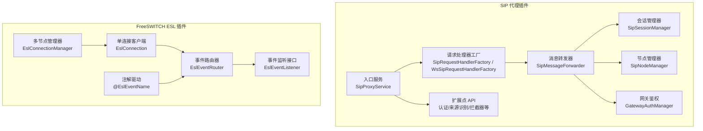
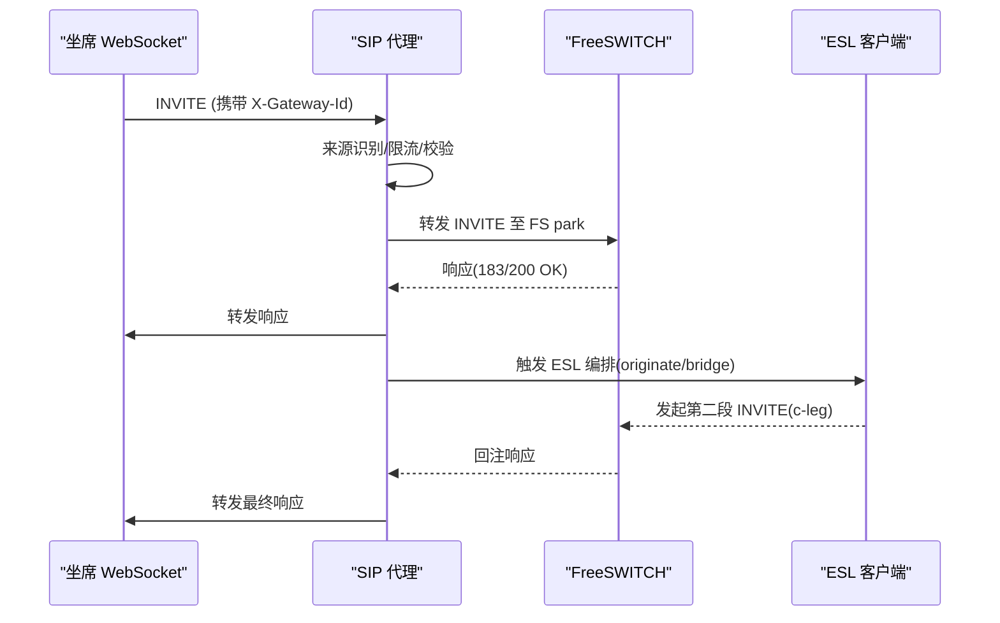
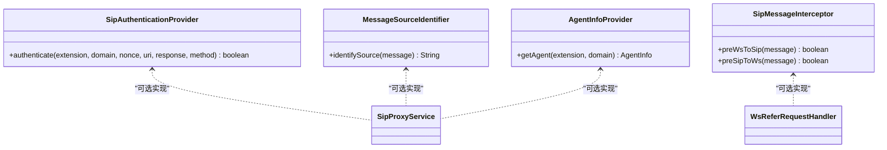
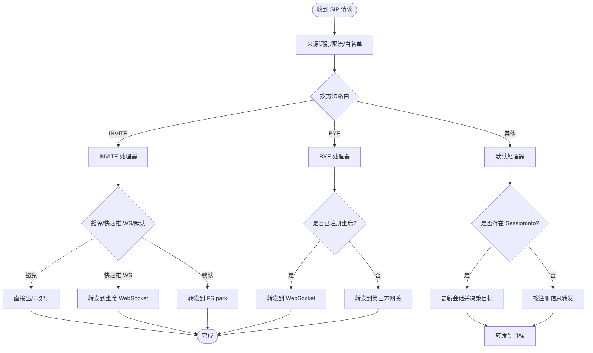
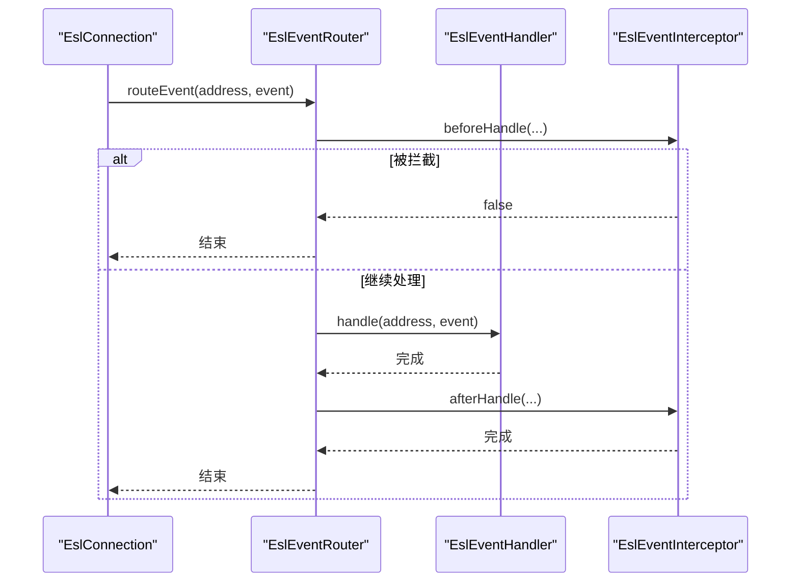
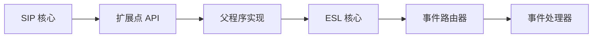

# 插件架构设计

<cite>
**本文引用的文件**
- [sipproxy组件架构设计.md](file://yudao-cloud/yudao-module-cc/ipcc-sipproxy/sipproxy组件架构设计.md)
- [fs-esl-client组件架构设计.md](file://yudao-cloud/yudao-module-cc/ipcc-fs-esl/fs-esl-client组件架构设计.md)
- [SipAuthenticationProvider.java](file://yudao-cloud/yudao-module-cc/ipcc-sipproxy/src/main/java/cn/ipcc/sipproxy/api/authentication/SipAuthenticationProvider.java)
- [MessageSourceIdentifier.java](file://yudao-cloud/yudao-module-cc/ipcc-sipproxy/src/main/java/cn/ipcc/sipproxy/api/gateway/MessageSourceIdentifier.java)
- [AgentInfoProvider.java](file://yudao-cloud/yudao-module-cc/ipcc-sipproxy/src/main/java/cn/ipcc/sipproxy/api/agent/AgentInfoProvider.java)
- [SipMessageInterceptor.java](file://yudao-cloud/yudao-module-cc/ipcc-sipproxy/src/main/java/cn/ipcc/sipproxy/api/interceptor/SipMessageInterceptor.java)
- [EslEventName.java](file://yudao-cloud/yudao-module-cc/ipcc-fs-esl/src/main/java/cn/ipcc/fs/esl/annotation/EslEventName.java)
- [EslEventRouter.java](file://yudao-cloud/yudao-module-cc/ipcc-fs-esl/src/main/java/cn/ipcc/fs/esl/router/EslEventRouter.java)
- [EslEventListener.java](file://yudao-cloud/yudao-module-cc/ipcc-fs-esl/src/main/java/cn/ipcc/fs/esl/listener/EslEventListener.java)
</cite>

## 目录
1. [引言](#引言)
2. [项目结构](#项目结构)
3. [核心组件](#核心组件)
4. [架构总览](#架构总览)
5. [详细组件分析](#详细组件分析)
6. [依赖关系分析](#依赖关系分析)
7. [性能与可扩展性](#性能与可扩展性)
8. [故障排查指南](#故障排查指南)
9. [结论](#结论)
10. [附录](#附录)

## 引言
本文件面向开发者，系统化阐述 SIP 代理插件架构与 FreeSWITCH ESL 插件架构的设计原理与实践。重点覆盖：
- 插件接口定义、生命周期管理、依赖注入与事件处理模型
- 插件加载机制、隔离策略与通信协议
- 插件与核心系统的交互模式（数据传递、状态同步、错误处理）
- 架构图表与组件关系图，帮助理解整体设计与技术选型原因

## 项目结构
本项目包含两个关键子系统：
- SIP 代理服务（B2BUA）：提供 SIP 信令接入、路由、转发与会话管理，并通过扩展点与父程序解耦
- FreeSWITCH ESL 客户端：基于 Netty 重构的 ESL 连接与事件框架，提供多节点管理、自动重连、事件路由与分布式协调

图表来源
- [sipproxy组件架构设计.md:45-147](file://yudao-cloud/yudao-module-cc/ipcc-sipproxy/sipproxy组件架构设计.md#L45-L147)
- [fs-esl-client组件架构设计.md:114-191](file://yudao-cloud/yudao-module-cc/ipcc-fs-esl/fs-esl-client组件架构设计.md#L114-L191)

章节来源
- [sipproxy组件架构设计.md:45-147](file://yudao-cloud/yudao-module-cc/ipcc-sipproxy/sipproxy组件架构设计.md#L45-L147)
- [fs-esl-client组件架构设计.md:114-191](file://yudao-cloud/yudao-module-cc/ipcc-fs-esl/fs-esl-client组件架构设计.md#L114-L191)

## 核心组件
- SIP 代理侧
  - 入口服务：统一初始化 SIP 栈、WebSocket 接入、请求/响应分发
  - 处理器工厂：按 SIP 方法自动注册并路由到具体处理器
  - 消息转发器：封装 FS/第三方/WS/出局网关四种目标，含头域改写与故障转移
  - 会话与节点管理：维护 Call-ID 级会话状态与 FS/第三方节点选择
  - 网关鉴权：处理 407 挑战与 Digest 重发
  - 扩展点 API：认证、来源识别、拦截器、媒体处理、安全限流等
- ESL 侧
  - 单连接与多节点管理：连接生命周期、自动重连、健康检查、批量操作
  - 事件路由：注解驱动的事件名路由、拦截器链、线程池策略
  - 监听接口：回调式事件接收与 BACKGROUND_JOB 分离处理

章节来源
- [sipproxy组件架构设计.md:149-183](file://yudao-cloud/yudao-module-cc/ipcc-sipproxy/sipproxy组件架构设计.md#L149-L183)
- [fs-esl-client组件架构设计.md:142-191](file://yudao-cloud/yudao-module-cc/ipcc-fs-esl/fs-esl-client组件架构设计.md#L142-L191)

## 架构总览
SIP 代理作为 B2BUA 居中转发两段独立对话；ESL 插件负责与 FreeSWITCH 的信令编排与事件处理。两者通过扩展点与事件机制松耦合协作。

图表来源
- [sipproxy组件架构设计.md:295-328](file://yudao-cloud/yudao-module-cc/ipcc-sipproxy/sipproxy组件架构设计.md#L295-L328)
- [fs-esl-client组件架构设计.md:114-191](file://yudao-cloud/yudao-module-cc/ipcc-fs-esl/fs-esl-client组件架构设计.md#L114-L191)

## 详细组件分析

### SIP 代理插件：扩展点与生命周期
- 扩展点体系
  - 认证扩展点：父程序可完全接管 Digest 认证流程
  - 来源识别扩展点：自定义区分 WEBSOCKET/FREESWITCH/THIRD_PARTY
  - 拦截器扩展点：在 WS→SIP 与 SIP→WS 转发前后插入业务逻辑（如 REFER 转接的 ESL 编排）
  - 其他扩展点：坐席信息、FS 节点、网关、媒体 SDP 处理、安全限流、传输抽象、链路追踪
- 生命周期管理
  - 启动：初始化 SIP 栈、WebSocket 接入、工厂与转发器装配
  - 运行：请求/响应分发、会话与节点缓存刷新、鉴权与转发
  - 关闭：清理注册映射、释放资源

图表来源
- [SipAuthenticationProvider.java:1-44](file://yudao-cloud/yudao-module-cc/ipcc-sipproxy/src/main/java/cn/ipcc/sipproxy/api/authentication/SipAuthenticationProvider.java#L1-L44)
- [MessageSourceIdentifier.java:1-23](file://yudao-cloud/yudao-module-cc/ipcc-sipproxy/src/main/java/cn/ipcc/sipproxy/api/gateway/MessageSourceIdentifier.java#L1-L23)
- [AgentInfoProvider.java:1-23](file://yudao-cloud/yudao-module-cc/ipcc-sipproxy/src/main/java/cn/ipcc/sipproxy/api/agent/AgentInfoProvider.java#L1-L23)
- [SipMessageInterceptor.java:1-45](file://yudao-cloud/yudao-module-cc/ipcc-sipproxy/src/main/java/cn/ipcc/sipproxy/api/interceptor/SipMessageInterceptor.java#L1-L45)

章节来源
- [sipproxy组件架构设计.md:137-147](file://yudao-cloud/yudao-module-cc/ipcc-sipproxy/sipproxy组件架构设计.md#L137-L147)
- [SipAuthenticationProvider.java:1-44](file://yudao-cloud/yudao-module-cc/ipcc-sipproxy/src/main/java/cn/ipcc/sipproxy/api/authentication/SipAuthenticationProvider.java#L1-L44)
- [MessageSourceIdentifier.java:1-23](file://yudao-cloud/yudao-module-cc/ipcc-sipproxy/src/main/java/cn/ipcc/sipproxy/api/gateway/MessageSourceIdentifier.java#L1-L23)
- [AgentInfoProvider.java:1-23](file://yudao-cloud/yudao-module-cc/ipcc-sipproxy/src/main/java/cn/ipcc/sipproxy/api/agent/AgentInfoProvider.java#L1-L23)
- [SipMessageInterceptor.java:1-45](file://yudao-cloud/yudao-module-cc/ipcc-sipproxy/src/main/java/cn/ipcc/sipproxy/api/interceptor/SipMessageInterceptor.java#L1-L45)

### SIP 代理插件：请求处理与转发流程
- 请求处理
  - UDP/TCP 进入后执行来源识别、限流、白名单校验，再按方法路由到处理器
  - INVITE/BYE/PRACK/UPDATE/INFO 等分别由对应处理器处理，必要时查 SessionInfo 决策转发目标
- 转发策略
  - 支持 FS/第三方/WS/出局网关四类目标
  - 头域改写保证 Contact/Via/Request-URI 正确指向代理公网或 WebSocket
  - 故障转移：同一会话尝试多个 FS 节点，避免单点失败
- 响应处理
  - 统一响应处理器根据来源与呼叫类型决定转发方向
  - 407 鉴权拦截：GatewayAuthManager 计算 Digest 并重发 INVITE

图表来源
- [sipproxy组件架构设计.md:257-361](file://yudao-cloud/yudao-module-cc/ipcc-sipproxy/sipproxy组件架构设计.md#L257-L361)
- [sipproxy组件架构设计.md:467-520](file://yudao-cloud/yudao-module-cc/ipcc-sipproxy/sipproxy组件架构设计.md#L467-L520)

章节来源
- [sipproxy组件架构设计.md:257-361](file://yudao-cloud/yudao-module-cc/ipcc-sipproxy/sipproxy组件架构设计.md#L257-L361)
- [sipproxy组件架构设计.md:467-520](file://yudao-cloud/yudao-module-cc/ipcc-sipproxy/sipproxy组件架构设计.md#L467-L520)

### FreeSWITCH ESL 插件：连接管理与事件路由
- 连接管理
  - 单连接：认证握手、自动重连、健康检查、生命周期回调
  - 多节点：注册/移除、批量命令、对账式同步、随机选择可用节点
- 事件路由
  - 注解驱动：@EslEventName 扫描处理器，建立事件名→处理器列表映射
  - 拦截器链：beforeHandle/afterHandle 在同一异步任务中执行，确保 ThreadLocal 上下文透传
  - 线程策略：SINGLE_THREAD/CHANNEL_HASH/FULL_CONCURRENT，BACKGROUND_JOB 独立线程池
- 监听接口
  - 回调式 onEvent/onBackgroundJob，便于业务层订阅事件与后台作业结果

图表来源
- [EslEventRouter.java:90-153](file://yudao-cloud/yudao-module-cc/ipcc-fs-esl/src/main/java/cn/ipcc/fs/esl/router/EslEventRouter.java#L90-L153)
- [EslEventName.java:1-17](file://yudao-cloud/yudao-module-cc/ipcc-fs-esl/src/main/java/cn/ipcc/fs/esl/annotation/EslEventName.java#L1-L17)
- [EslEventListener.java:1-29](file://yudao-cloud/yudao-module-cc/ipcc-fs-esl/src/main/java/cn/ipcc/fs/esl/listener/EslEventListener.java#L1-L29)

章节来源
- [fs-esl-client组件架构设计.md:489-791](file://yudao-cloud/yudao-module-cc/ipcc-fs-esl/fs-esl-client组件架构设计.md#L489-L791)
- [EslEventRouter.java:90-153](file://yudao-cloud/yudao-module-cc/ipcc-fs-esl/src/main/java/cn/ipcc/fs/esl/router/EslEventRouter.java#L90-L153)
- [EslEventName.java:1-17](file://yudao-cloud/yudao-module-cc/ipcc-fs-esl/src/main/java/cn/ipcc/fs/esl/annotation/EslEventName.java#L1-L17)
- [EslEventListener.java:1-29](file://yudao-cloud/yudao-module-cc/ipcc-fs-esl/src/main/java/cn/ipcc/fs/esl/listener/EslEventListener.java#L1-L29)

### 插件加载机制与隔离策略
- 加载机制
  - SIP 代理：Spring Boot 自动装配扩展点 Bean，@SipMethod 注解扫描注册处理器
  - ESL 插件：Spring 自动配置收集事件监听器与拦截器，构建路由器与连接管理器
- 隔离策略
  - 扩展点解耦：认证、来源识别、拦截器等以接口形式暴露，默认实现保证模块可独立运行
  - 职责边界清晰：SIP 代理专注信令转发，ESL 插件专注连接与事件，业务编排位于父程序
- 通信协议
  - SIP 代理使用 JAIN-SIP（UDP/TCP），WebSocket 接入 JsSIP 客户端
  - ESL 插件基于 Netty 4.x 实现 Inbound 模式，UTF-8 解码与帧大小保护

章节来源
- [sipproxy组件架构设计.md:137-147](file://yudao-cloud/yudao-module-cc/ipcc-sipproxy/sipproxy组件架构设计.md#L137-L147)
- [fs-esl-client组件架构设计.md:114-191](file://yudao-cloud/yudao-module-cc/ipcc-fs-esl/fs-esl-client组件架构设计.md#L114-L191)

### 与核心系统的交互模式
- 数据传递
  - SIP 代理通过 SessionInfo 缓存会话上下文（Call-ID、FS/第三方节点、callType、网关 ID 等）
  - ESL 插件通过 EslEvent 传递事件头与事件体，支持完整文本与时间戳
- 状态同步
  - 会话状态持久化到 Redis，TTL 设计保障活跃期一致性
  - 节点选择基于 Call-ID 哈希与 ViaPort 匹配，保证同会话一致性
- 错误处理
  - SIP 代理：统一异常与错误码，407 鉴权重发，故障转移尝试多节点
  - ESL 插件：命令超时、连接异常、事件处理异常隔离，健康检查与自动重连

章节来源
- [sipproxy组件架构设计.md:184-252](file://yudao-cloud/yudao-module-cc/ipcc-sipproxy/sipproxy组件架构设计.md#L184-L252)
- [sipproxy组件架构设计.md:563-667](file://yudao-cloud/yudao-module-cc/ipcc-sipproxy/sipproxy组件架构设计.md#L563-L667)
- [fs-esl-client组件架构设计.md:489-791](file://yudao-cloud/yudao-module-cc/ipcc-fs-esl/fs-esl-client组件架构设计.md#L489-L791)

## 依赖关系分析
- 组件耦合与内聚
  - SIP 代理内部高内聚：入口、工厂、处理器、转发器、会话/节点管理职责清晰
  - ESL 插件分层明确：传输层、连接层、事件路由层、分布式协调层
- 外部依赖
  - JAIN-SIP 用于 SIP 协议栈，Netty 4.x 用于 ESL 网络层
  - Spring Boot 自动装配与条件注册降低耦合
- 潜在循环依赖
  - 通过扩展点与接口解耦，避免直接类间强依赖

图表来源
- [sipproxy组件架构设计.md:137-147](file://yudao-cloud/yudao-module-cc/ipcc-sipproxy/sipproxy组件架构设计.md#L137-L147)
- [fs-esl-client组件架构设计.md:114-191](file://yudao-cloud/yudao-module-cc/ipcc-fs-esl/fs-esl-client组件架构设计.md#L114-L191)

章节来源
- [sipproxy组件架构设计.md:137-147](file://yudao-cloud/yudao-module-cc/ipcc-sipproxy/sipproxy组件架构设计.md#L137-L147)
- [fs-esl-client组件架构设计.md:114-191](file://yudao-cloud/yudao-module-cc/ipcc-fs-esl/fs-esl-client组件架构设计.md#L114-L191)

## 性能与可扩展性
- 性能特性
  - 事件路由支持三种线程策略，BACKGROUND_JOB 独立线程池，避免阻塞
  - 帧解码器限制最大帧大小与头行数，防止 OOM
  - 会话与节点缓存 TTL 合理，减少 Redis 压力
- 可扩展性
  - 扩展点丰富，父程序可按需替换认证、来源识别、拦截器等
  - 多节点管理与自动重连提升可用性
  - 注解驱动的事件路由简化开发，支持多处理器与顺序控制

章节来源
- [fs-esl-client组件架构设计.md:197-315](file://yudao-cloud/yudao-module-cc/ipcc-fs-esl/fs-esl-client组件架构设计.md#L197-L315)
- [sipproxy组件架构设计.md:235-252](file://yudao-cloud/yudao-module-cc/ipcc-sipproxy/sipproxy组件架构设计.md#L235-L252)

## 故障排查指南
- SIP 代理常见问题
  - 407 鉴权失败：检查 GatewayAuthManager 的 challengeCount、stale 与 nonce 更新逻辑
  - 转发失败：确认 SessionInfo 存在、节点在线、头域改写正确
  - WebSocket 连接问题：检查 SipWebSocketHandler 分片重组与僵尸会话清理
- ESL 插件常见问题
  - 连接断开：查看健康检查与自动重连日志，确认认证失败原因
  - 事件丢失：检查事件名是否为空、处理器是否注册、拦截器是否拒绝
  - 命令超时：调整 commandTimeoutSeconds，优先使用 bgapi 避免阻塞

章节来源
- [sipproxy组件架构设计.md:668-728](file://yudao-cloud/yudao-module-cc/ipcc-sipproxy/sipproxy组件架构设计.md#L668-L728)
- [fs-esl-client组件架构设计.md:489-791](file://yudao-cloud/yudao-module-cc/ipcc-fs-esl/fs-esl-client组件架构设计.md#L489-L791)

## 结论
本插件架构通过清晰的层次划分与丰富的扩展点，实现了 SIP 代理与 FreeSWITCH ESL 的松耦合协作。SIP 代理专注于信令转发与会话管理，ESL 插件专注于连接与事件处理，二者通过接口与事件机制协同工作，具备良好的可扩展性与可维护性。

## 附录
- 术语说明
  - B2BUA：背靠背用户代理，维持两段独立对话
  - ESL：FreeSWITCH 事件套接字协议，用于控制与事件通知
  - 扩展点：以接口形式暴露的可替换能力，默认实现保证模块独立运行