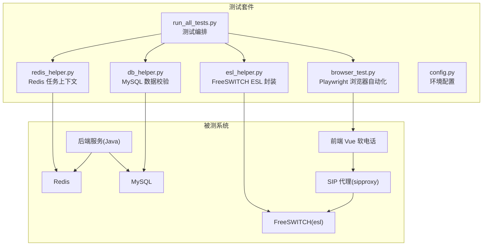
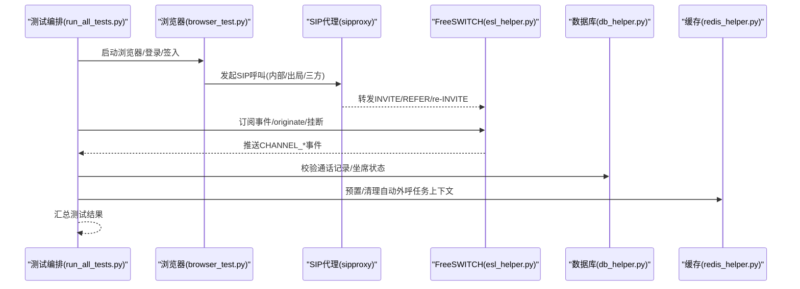
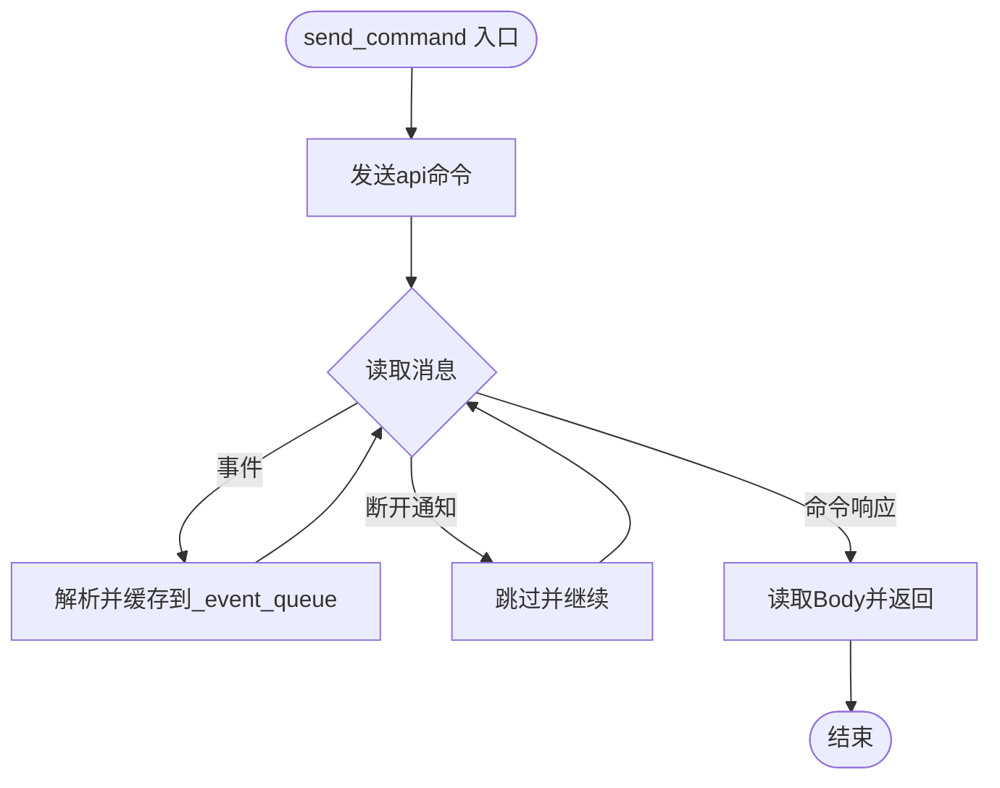
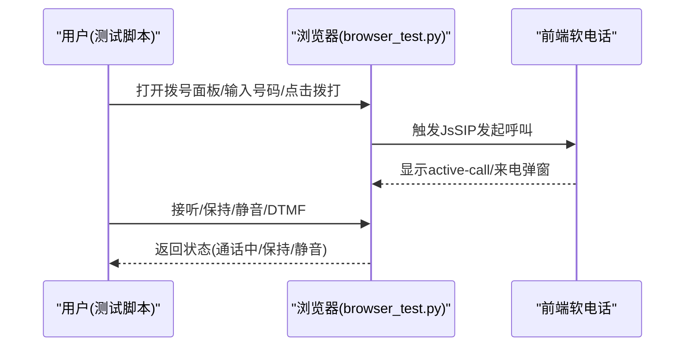
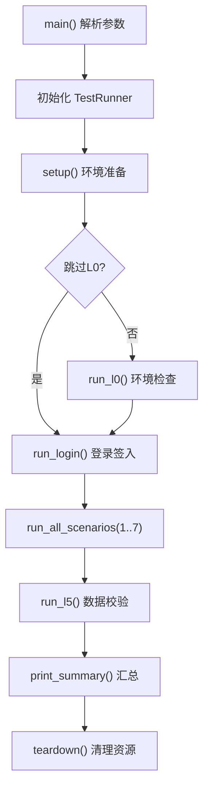
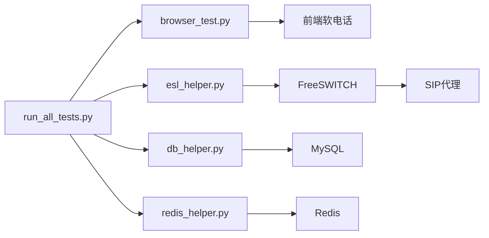

# 插件测试与调试

<cite>
**本文引用的文件**
- [全场景测试/AGENTS.md](file://yudao-cloud/yudao-module-cc/doc/test-all/全场景测试/AGENTS.md)
- [全场景测试/run_all_tests.py](file://yudao-cloud/yudao-module-cc/doc/test-all/全场景测试/run_all_tests.py)
- [全场景测试/esl_helper.py](file://yudao-cloud/yudao-module-cc/doc/test-all/全场景测试/esl_helper.py)
- [全场景测试/config.py](file://yudao-cloud/yudao-module-cc/doc/test-all/全场景测试/config.py)
- [全场景测试/browser_test.py](file://yudao-cloud/yudao-module-cc/doc/test-all/全场景测试/browser_test.py)
- [全场景测试/db_helper.py](file://yudao-cloud/yudao-module-cc/doc/test-all/全场景测试/db_helper.py)
- [全场景测试/redis_helper.py](file://yudao-cloud/yudao-module-cc/doc/test-all/全场景测试/redis_helper.py)
- [ipcc-fs-esl/README.md](file://yudao-cloud/yudao-module-cc/ipcc-fs-esl/README.md)
</cite>

## 目录
1. [简介](#简介)
2. [项目结构](#项目结构)
3. [核心组件](#核心组件)
4. [架构总览](#架构总览)
5. [详细组件分析](#详细组件分析)
6. [依赖关系分析](#依赖关系分析)
7. [性能考虑](#性能考虑)
8. [故障排查指南](#故障排查指南)
9. [结论](#结论)
10. [附录](#附录)

## 简介
本文件面向呼叫中心插件（FreeSWITCH ESL、SIP代理、前端软电话）的测试与调试，覆盖以下目标：
- 单元测试：如何模拟 SIP 消息、伪造 FreeSWITCH 事件、验证业务逻辑正确性。
- 集成测试：端到端测试场景设计、性能测试与压力测试实施方案。
- 调试工具：日志分析、断点调试、内存泄漏检测。
- 性能分析：CPU、内存、网络 I/O 监控方法。
- 常见问题诊断：连接超时、内存溢出、死锁等问题的定位与修复建议。

## 项目结构
端到端测试套件位于 yudao-module-cc/doc/test-all/全场景测试，围绕 Playwright 浏览器自动化、ESL 控制、MySQL/Redis 数据校验构建；Java 侧提供 ipcc-fs-esl 库用于连接管理、事件路由与分布式协调。



图表来源
- [全场景测试/run_all_tests.py:1-317](file://yudao-cloud/yudao-module-cc/doc/test-all/全场景测试/run_all_tests.py#L1-L317)
- [全场景测试/esl_helper.py:1-791](file://yudao-cloud/yudao-module-cc/doc/test-all/全场景测试/esl_helper.py#L1-L791)
- [全场景测试/browser_test.py:1-800](file://yudao-cloud/yudao-module-cc/doc/test-all/全场景测试/browser_test.py#L1-L800)
- [全场景测试/db_helper.py:1-454](file://yudao-cloud/yudao-module-cc/doc/test-all/全场景测试/db_helper.py#L1-L454)
- [全场景测试/redis_helper.py:1-246](file://yudao-cloud/yudao-module-cc/doc/test-all/全场景测试/redis_helper.py#L1-L246)
- [全场景测试/config.py:1-143](file://yudao-cloud/yudao-module-cc/doc/test-all/全场景测试/config.py#L1-L143)

章节来源
- [全场景测试/AGENTS.md:1-263](file://yudao-cloud/yudao-module-cc/doc/test-all/全场景测试/AGENTS.md#L1-L263)
- [全场景测试/run_all_tests.py:1-317](file://yudao-cloud/yudao-module-cc/doc/test-all/全场景测试/run_all_tests.py#L1-L317)

## 核心组件
- 测试编排器：统一入口，按 L0→L1+L2→L4(7场景)→L5 顺序执行，支持单场景重跑、轮次标记、结果汇总。
- 浏览器自动化：基于 Playwright 驱动前端软电话完成登录、签入、拨号、接听、挂断、保持/恢复、静音、DTMF 等操作。
- ESL 辅助：实现 FreeSWITCH ESL 协议，封装 connect/auth/send_command/wait_for_event/originate/hangup_all_channels 等能力，并缓存事件避免丢失。
- 数据库校验：查询通话记录、坐席状态、网关/路由配置，支撑 L5 数据一致性验证。
- Redis 辅助：为自动外呼场景预置任务上下文，确保 originate 携带 task_id/ivr_flow 时后端能正确驱动 IVR。
- 配置中心：集中管理后端/前端地址、FS 实例、MySQL/Redis、SIP 域、第三方网关、超时等常量。

章节来源
- [全场景测试/run_all_tests.py:81-257](file://yudao-cloud/yudao-module-cc/doc/test-all/全场景测试/run_all_tests.py#L81-L257)
- [全场景测试/browser_test.py:26-800](file://yudao-cloud/yudao-module-cc/doc/test-all/全场景测试/browser_test.py#L26-L800)
- [全场景测试/esl_helper.py:35-757](file://yudao-cloud/yudao-module-cc/doc/test-all/全场景测试/esl_helper.py#L35-L757)
- [全场景测试/db_helper.py:28-454](file://yudao-cloud/yudao-module-cc/doc/test-all/全场景测试/db_helper.py#L28-L454)
- [全场景测试/redis_helper.py:28-246](file://yudao-cloud/yudao-module-cc/doc/test-all/全场景测试/redis_helper.py#L28-L246)
- [全场景测试/config.py:12-143](file://yudao-cloud/yudao-module-cc/doc/test-all/全场景测试/config.py#L12-L143)

## 架构总览
端到端测试通过浏览器操作前端软电话触发 SIP 信令，经 sipproxy 转发至 FreeSWITCH；同时测试脚本通过 ESL 直接控制 FS（发起呼叫、订阅事件、通道清理），并通过 MySQL/Redis 校验业务数据与上下文。



图表来源
- [全场景测试/run_all_tests.py:259-312](file://yudao-cloud/yudao-module-cc/doc/test-all/全场景测试/run_all_tests.py#L259-L312)
- [全场景测试/esl_helper.py:184-257](file://yudao-cloud/yudao-module-cc/doc/test-all/全场景测试/esl_helper.py#L184-L257)
- [全场景测试/browser_test.py:485-549](file://yudao-cloud/yudao-module-cc/doc/test-all/全场景测试/browser_test.py#L485-L549)
- [全场景测试/db_helper.py:178-213](file://yudao-cloud/yudao-module-cc/doc/test-all/全场景测试/db_helper.py#L178-L213)
- [全场景测试/redis_helper.py:105-147](file://yudao-cloud/yudao-module-cc/doc/test-all/全场景测试/redis_helper.py#L105-L147)

## 详细组件分析

### ESL 事件处理与命令响应流程
- send_command 在发送 api 命令后循环读取消息，遇到事件(text/event-plain)会解析并缓存到 _event_queue，避免阻塞期间事件被丢弃。
- wait_for_event 优先从队列查找匹配事件，再回退到 socket 读取新事件，保证 originate 等阻塞命令期间的 CHANNEL_PARK/ANSWER 等事件不丢失。
- subscribe_events 先取消旧订阅(event plain off)，再订阅新事件，清空缓冲和队列，避免历史事件干扰。



图表来源
- [全场景测试/esl_helper.py:184-257](file://yudao-cloud/yudao-module-cc/doc/test-all/全场景测试/esl_helper.py#L184-L257)
- [全场景测试/esl_helper.py:669-757](file://yudao-cloud/yudao-module-cc/doc/test-all/全场景测试/esl_helper.py#L669-L757)

章节来源
- [全场景测试/esl_helper.py:184-257](file://yudao-cloud/yudao-module-cc/doc/test-all/全场景测试/esl_helper.py#L184-L257)
- [全场景测试/esl_helper.py:586-640](file://yudao-cloud/yudao-module-cc/doc/test-all/全场景测试/esl_helper.py#L586-L640)
- [全场景测试/esl_helper.py:669-757](file://yudao-cloud/yudao-module-cc/doc/test-all/全场景测试/esl_helper.py#L669-L757)

### 浏览器自动化与软电话交互
- 登录与签入：等待 SoftPhone 组件渲染，点击头像按钮触发 REGISTER，等待 .switch-wrap 出现确认在线。
- 拨号与接听：选择“内部呼叫/外呼”，填写号码，点击拨打；来电弹窗出现后点击接听。
- 通话控制：保持/恢复通过 re-INVITE 切换 SDP sendonly/sendrecv；静音/取消静音切换按钮状态；DTMF 按键在通话中拨号盘触发。
- 多会话：统计 .session-item 数量判断多通话；获取当前通话号码与时长。



图表来源
- [全场景测试/browser_test.py:148-303](file://yudao-cloud/yudao-module-cc/doc/test-all/全场景测试/browser_test.py#L148-L303)
- [全场景测试/browser_test.py:348-468](file://yudao-cloud/yudao-module-cc/doc/test-all/全场景测试/browser_test.py#L348-L468)
- [全场景测试/browser_test.py:485-746](file://yudao-cloud/yudao-module-cc/doc/test-all/全场景测试/browser_test.py#L485-L746)

章节来源
- [全场景测试/browser_test.py:148-303](file://yudao-cloud/yudao-module-cc/doc/test-all/全场景测试/browser_test.py#L148-L303)
- [全场景测试/browser_test.py:348-468](file://yudao-cloud/yudao-module-cc/doc/test-all/全场景测试/browser_test.py#L348-L468)
- [全场景测试/browser_test.py:485-746](file://yudao-cloud/yudao-module-cc/doc/test-all/全场景测试/browser_test.py#L485-L746)

### 数据校验与缓存上下文
- 通话记录：按时间范围或 call_id 查询 cc_call_record，校验 call_type/direction/主被叫等字段。
- 坐席状态：根据 SIP 号码查询 cc_sys_agent.online_status，验证在线/就绪/忙碌。
- 自动外呼：通过 redis_helper 写入 autocall:task:{taskId} 上下文，包含 ivrFlow、variables、tenantId，供后端事件线程恢复租户上下文。

```mermaid
classDiagram
class DbHelper {
+connect() bool
+query(sql, params) List
+count_call_records_since(start_time) int
+get_agent_online_status(sip_number) int
}
class RedisHelper {
+connect() bool
+save_autocall_task_context(task_id, ivr_flow, variables, status, tenant_id) bool
+get_autocall_task_context(task_id) dict
+delete_autocall_task_context(task_id) bool
}
DbHelper --> "使用" MySQL : "cc_call_record/cc_sys_agent"
RedisHelper --> "使用" Redis : "autocall : task : *"
```

图表来源
- [全场景测试/db_helper.py:28-213](file://yudao-cloud/yudao-module-cc/doc/test-all/全场景测试/db_helper.py#L28-L213)
- [全场景测试/redis_helper.py:28-147](file://yudao-cloud/yudao-module-cc/doc/test-all/全场景测试/redis_helper.py#L28-L147)

章节来源
- [全场景测试/db_helper.py:127-213](file://yudao-cloud/yudao-module-cc/doc/test-all/全场景测试/db_helper.py#L127-L213)
- [全场景测试/redis_helper.py:105-147](file://yudao-cloud/yudao-module-cc/doc/test-all/全场景测试/redis_helper.py#L105-L147)

### 测试编排与场景执行
- 运行器：TestRunner 负责 L0/L1+L2/L4/L5 阶段调度，支持 --scenarios 指定场景、--round 轮次、--headless 无头模式。
- 场景间清理：每个场景前调用 hangup_all_channels 清理残留通道，等待 2 秒确保状态稳定。
- 结果汇总：记录 PASS/FAIL/SKIP/ERROR 及耗时，最终输出统计并退出码指示是否全部通过。



图表来源
- [全场景测试/run_all_tests.py:259-312](file://yudao-cloud/yudao-module-cc/doc/test-all/全场景测试/run_all_tests.py#L259-L312)
- [全场景测试/run_all_tests.py:170-196](file://yudao-cloud/yudao-module-cc/doc/test-all/全场景测试/run_all_tests.py#L170-L196)

章节来源
- [全场景测试/run_all_tests.py:47-78](file://yudao-cloud/yudao-module-cc/doc/test-all/全场景测试/run_all_tests.py#L47-L78)
- [全场景测试/run_all_tests.py:170-196](file://yudao-cloud/yudao-module-cc/doc/test-all/全场景测试/run_all_tests.py#L170-L196)
- [全场景测试/run_all_tests.py:259-312](file://yudao-cloud/yudao-module-cc/doc/test-all/全场景测试/run_all_tests.py#L259-L312)

## 依赖关系分析
- 测试编排依赖浏览器自动化、ESL、数据库、缓存模块；浏览器自动化依赖前端软电话；ESL 依赖 FreeSWITCH；数据库/缓存依赖对应服务。
- Java 侧 ipcc-fs-esl 提供连接管理、事件路由、分布式协调，作为上层业务的基础设施层。



图表来源
- [全场景测试/run_all_tests.py:1-317](file://yudao-cloud/yudao-module-cc/doc/test-all/全场景测试/run_all_tests.py#L1-L317)
- [ipcc-fs-esl/README.md:50-98](file://yudao-cloud/yudao-module-cc/ipcc-fs-esl/README.md#L50-L98)

章节来源
- [ipcc-fs-esl/README.md:50-98](file://yudao-cloud/yudao-module-cc/ipcc-fs-esl/README.md#L50-L98)

## 性能考虑
- 事件处理与命令响应：ESL send_command 设置超时，避免 FS 无响应导致永久阻塞；wait_for_event 优先从缓存队列命中，减少 socket 读取开销。
- 批量挂断：hangup_all_channels 优先使用 hupall 一次性挂断所有通道，失败再 fallback 逐个 uuid_kill，提升清理效率。
- 浏览器操作：使用 domcontentloaded 替代 networkidle，避免 WebSocket 长连接导致加载状态无法达到；合理设置 PAGE_TIMEOUT/ELEMENT_TIMEOUT/CALL_TIMEOUT。
- 连接健康：ipcc-fs-esl 提供健康检查、自动重连、最大帧大小限制，防止 OOM 与假死连接。

章节来源
- [全场景测试/esl_helper.py:184-257](file://yudao-cloud/yudao-module-cc/doc/test-all/全场景测试/esl_helper.py#L184-L257)
- [全场景测试/esl_helper.py:547-581](file://yudao-cloud/yudao-module-cc/doc/test-all/全场景测试/esl_helper.py#L547-L581)
- [全场景测试/config.py:115-127](file://yudao-cloud/yudao-module-cc/doc/test-all/全场景测试/config.py#L115-L127)
- [ipcc-fs-esl/README.md:153-178](file://yudao-cloud/yudao-module-cc/ipcc-fs-esl/README.md#L153-L178)

## 故障排查指南
- 连接超时：ESL connect 设置 10 秒超时；send_command 设置命令超时；浏览器默认超时 30 秒。若失败，检查防火墙、端口、密码与服务状态。
- 内存溢出：ipcc-fs-esl 限制 max-frame-size 与 max-header-lines；测试脚本避免大对象常驻内存，及时关闭连接与上下文。
- 死锁：事件订阅必须异步，禁止在 Netty IO 线程 .get() 阻塞；测试脚本中 wait_for_event 使用超时与队列机制，避免无限等待。
- 常见错误：
  - ESL send_command 错误消费事件消息：通过事件缓存队列解决。
  - default context 拦截 CHANNEL_PARK：改用 loopback/public originate。
  - 第三方 FS originate 失败：通过 sipproxy 公网地址 bgapi 异步发起。
  - 自动外呼 originate 失败：预置 Redis 任务上下文。
  - Redis HELLO 命令不支持：强制 RESP2 协议。
  - 僵尸通道清理慢：优先 hupall，失败再逐个 uuid_kill。

章节来源
- [全场景测试/esl_helper.py:184-257](file://yudao-cloud/yudao-module-cc/doc/test-all/全场景测试/esl_helper.py#L184-L257)
- [全场景测试/esl_helper.py:547-581](file://yudao-cloud/yudao-module-cc/doc/test-all/全场景测试/esl_helper.py#L547-L581)
- [全场景测试/redis_helper.py:52-81](file://yudao-cloud/yudao-module-cc/doc/test-all/全场景测试/redis_helper.py#L52-L81)
- [全场景测试/AGENTS.md:172-239](file://yudao-cloud/yudao-module-cc/doc/test-all/全场景测试/AGENTS.md#L172-L239)
- [ipcc-fs-esl/README.md:282-287](file://yudao-cloud/yudao-module-cc/ipcc-fs-esl/README.md#L282-L287)

## 结论
本测试与调试体系以端到端场景为核心，结合浏览器自动化、ESL 控制与数据校验，覆盖 SIP 通信的关键路径。通过事件缓存、批量清理、超时控制与健康检查等手段，提升了稳定性与可维护性。建议在持续集成中启用无头模式与两轮幂等验证，配合日志与指标采集，形成闭环质量保障。

## 附录
- 运行方式：支持 --headless、--scenarios、--skip-l0、--round 等参数；独立场景可通过 run_scenario_6.py/run_scenario_7.py 执行。
- 环境依赖：本地后端/前端、sipproxy、CC FS1/FS2、第三方 FS、MySQL、Redis 的地址与账号密码集中在 config.py。
- 参考文档：ipcc-fs-esl README 提供连接管理、事件路由、分布式协调的配置与扩展点说明。

章节来源
- [全场景测试/AGENTS.md:48-74](file://yudao-cloud/yudao-module-cc/doc/test-all/全场景测试/AGENTS.md#L48-L74)
- [全场景测试/config.py:12-143](file://yudao-cloud/yudao-module-cc/doc/test-all/全场景测试/config.py#L12-L143)
- [ipcc-fs-esl/README.md:102-178](file://yudao-cloud/yudao-module-cc/ipcc-fs-esl/README.md#L102-L178)