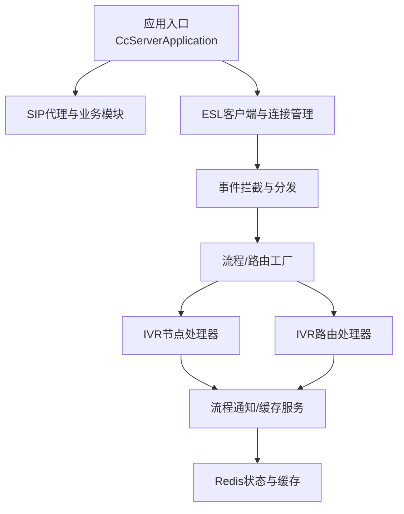
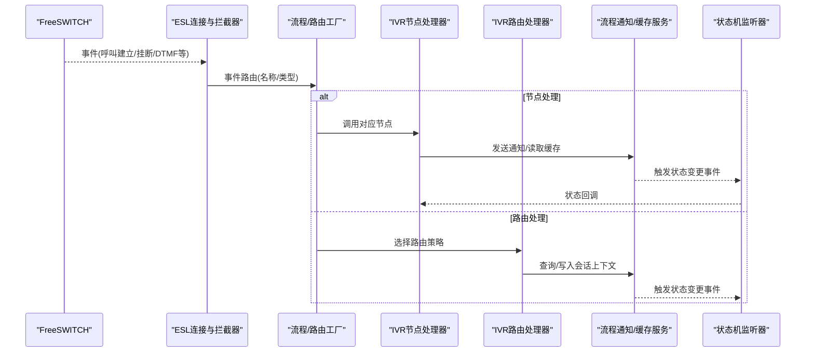
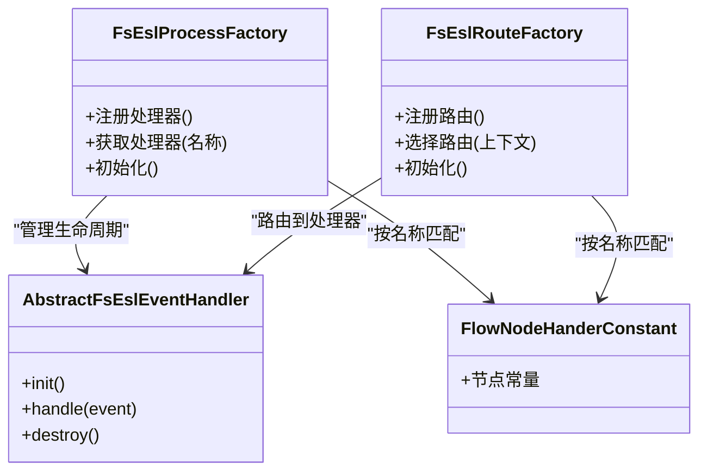
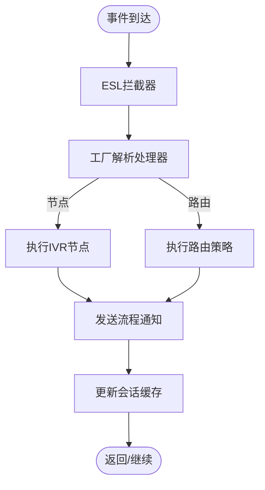
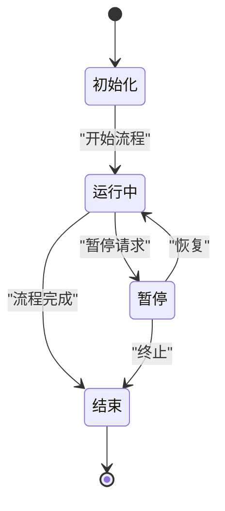
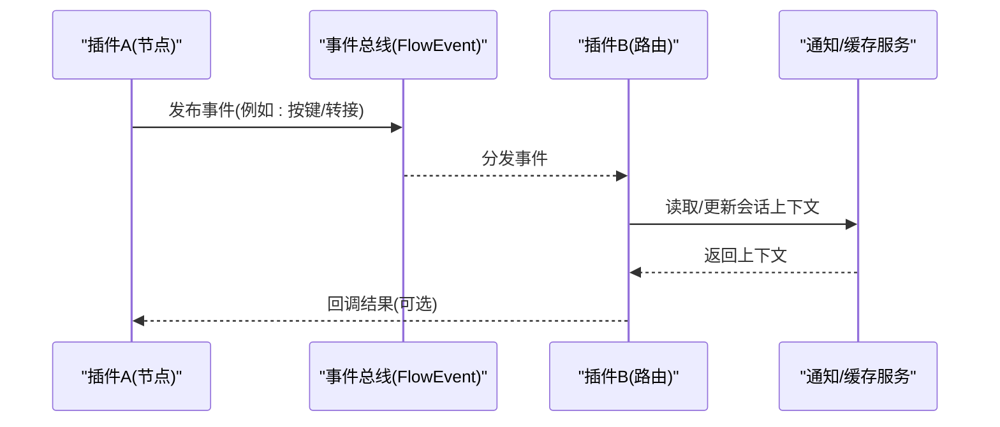
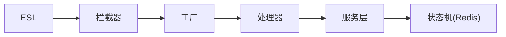

# 插件生命周期管理

<cite>
**本文引用的文件**
- [CcServerApplication.java](file://yudao-cloud/yudao-module-cc/yudao-module-cc-server/src/main/java/cn/iocoder/yudao/module/cc/CcServerApplication.java)
- [FsEslProcessFactory.java](file://yudao-cloud/yudao-module-cc/yudao-module-cc-server/src/main/java/cn/iocoder/yudao/module/cc/esl/factory/FsEslProcessFactory.java)
- [FsEslRouteFactory.java](file://yudao-cloud/yudao-module-cc/yudao-module-cc-server/src/main/java/cn/iocoder/yudao/module/cc/esl/factory/FsEslRouteFactory.java)
- [AbstractFsEslEventHandler.java](file://yudao-cloud/yudao-module-cc/yudao-module-cc-server/src/main/java/cn/iocoder/yudao/module/cc/esl/factory/AbstractFsEslEventHandler.java)
- [FlowEvent.java](file://yudao-cloud/yudao-module-cc/yudao-module-cc-server/src/main/java/cn/iocoder/yudao/module/cc/ivr/event/FlowEvent.java)
- [FlowEventListener.java](file://yudao-cloud/yudao-module-cc/yudao-module-cc-server/src/main/java/cn/iocoder/yudao/module/cc/ivr/listener/FlowEventListener.java)
- [FlowStateMachineListener.java](file://yudao-cloud/yudao-module-cc/yudao-module-cc-server/src/main/java/cn/iocoder/yudao/module/cc/ivr/listener/FlowStateMachineListener.java)
- [RedisStateMachineConfig.java](file://yudao-cloud/yudao-module-cc/yudao-module-cc-server/src/main/java/cn/iocoder/yudao/module/cc/ivr/config/RedisStateMachineConfig.java)
- [FlowNodeHanderConstant.java](file://yudao-cloud/yudao-module-cc/yudao-module-cc-server/src/main/java/cn/iocoder/yudao/module/cc/ivr/constant/FlowNodeHanderConstant.java)
- [FlowStartHandler.java](file://yudao-cloud/yudao-module-cc/yudao-module-cc-server/src/main/java/cn/iocoder/yudao/module/cc/ivr/handler/node/FlowStartHandler.java)
- [FlowEndHandler.java](file://yudao-cloud/yudao-module-cc/yudao-module-cc-server/src/main/java/cn/iocoder/yudao/module/cc/ivr/handler/node/FlowEndHandler.java)
- [FlowMenuHandler.java](file://yudao-cloud/yudao-module-cc/yudao-module-cc-server/src/main/java/cn/iocoder/yudao/module/cc/ivr/handler/node/FlowMenuHandler.java)
- [FlowPlaybackHandler.java](file://yudao-cloud/yudao-module-cc/yudao-module-cc-server/src/main/java/cn/iocoder/yudao/module/cc/ivr/handler/node/FlowPlaybackHandler.java)
- [FlowReceiveHandler.java](file://yudao-cloud/yudao-module-cc/yudao-module-cc-server/src/main/java/cn/iocoder/yudao/module/cc/ivr/handler/node/FlowReceiveHandler.java)
- [FlowTransferHandler.java](file://yudao-cloud/yudao-module-cc/yudao-module-cc-server/src/main/java/cn/iocoder/yudao/module/cc/ivr/handler/node/FlowTransferHandler.java)
- [FlowConditionEvaluator.java](file://yudao-cloud/yudao-module-cc/yudao-module-cc-server/src/main/java/cn/iocoder/yudao/module/cc/ivr/handler/node/FlowConditionEvaluator.java)
- [FlowCallOutRouteHandler.java](file://yudao-cloud/yudao-module-cc/yudao-module-cc-server/src/main/java/cn/iocoder/yudao/module/cc/ivr/handler/route/FlowCallOutRouteHandler.java)
- [FlowSipRouteHandler.java](file://yudao-cloud/yudao-module-cc/yudao-module-cc-server/src/main/java/cn/iocoder/yudao/module/cc/ivr/handler/route/FlowSipRouteHandler.java)
- [FlowAgentGroupRouteHandler.java](file://yudao-cloud/yudao-module-cc/yudao-module-cc-server/src/main/java/cn/iocoder/yudao/module/cc/ivr/handler/route/FlowAgentGroupRouteHandler.java)
- [FlowAgentRouteHandler.java](file://yudao-cloud/yudao-module-cc/yudao-module-cc-server/src/main/java/cn/iocoder/yudao/module/cc/ivr/handler/route/FlowAgentRouteHandler.java)
- [FlowNoticeService.java](file://yudao-cloud/yudao-module-cc/yudao-module-cc-server/src/main/java/cn/iocoder/yudao/module/cc/esl/service/FlowNoticeService.java)
- [FlowNoticeServiceImpl.java](file://yudao-cloud/yudao-module-cc/yudao-module-cc-server/src/main/java/cn/iocoder/yudao/module/cc/esl/service/FlowNoticeServiceImpl.java)
- [FsCallCacheService.java](file://yudao-cloud/yudao-module-cc/yudao-module-cc-server/src/main/java/cn/iocoder/yudao/module/cc/esl/service/FsCallCacheService.java)
- [FsCallCacheServiceImpl.java](file://yudao-cloud/yudao-module-cc/yudao-module-cc-server/src/main/java/cn/iocoder/yudao/module/cc/esl/service/FsCallCacheServiceImpl.java)
- [TraceEslEventInterceptor.java](file://yudao-cloud/yudao-module-cc/yudao-module-cc-server/src/main/java/cn/iocoder/yudao/module/cc/esl/interceptor/TraceEslEventInterceptor.java)
- [EslConnectionManager.java](file://yudao-cloud/yudao-cloud/yudao-module-cc/ipcc-fs-esl/src/main/java/cn/ipcc/fs/esl/EslConnectionManager.java)
- [EslClientConfig.java](file://yudao-cloud/yudao-cloud/yudao-module-cc/ipcc-fs-esl/src/main/java/cn/ipcc/fs/esl/EslClientConfig.java)
- [metrics包](file://yudao-cloud/yudao-cloud/yudao-module-cc/ipcc-fs-esl/src/main/java/cn/ipcc/fs/esl/metrics)
</cite>

## 目录
1. [简介](#简介)
2. [项目结构](#项目结构)
3. [核心组件](#核心组件)
4. [架构总览](#架构总览)
5. [详细组件分析](#详细组件分析)
6. [依赖关系分析](#依赖关系分析)
7. [性能与监控](#性能与监控)
8. [故障排查指南](#故障排查指南)
9. [结论](#结论)
10. [附录](#附录)

## 简介
本文件围绕“插件化”的呼叫中心能力，系统化梳理从加载、初始化、启动、运行、暂停、停止到卸载的全生命周期。结合工程中的事件驱动流程引擎（IVR）、ESL事件处理工厂、路由与节点处理器、以及状态机与缓存服务，给出：
- 插件状态管理机制
- 依赖解析与装配策略
- 资源管理与隔离策略
- 插件间通信机制、事件总线设计与消息传递模式
- 热更新的技术路径（版本检测、增量更新、回滚）
- 监控指标收集、性能统计与健康检查

说明：当前仓库未提供通用“插件容器”实现，但通过 IVR 流程节点、ESL 事件处理器与路由器的可扩展设计，已具备“可插拔”的能力。本文以这些扩展点为“插件”，阐述其生命周期与管理方式。

## 项目结构
- 应用入口负责扫描并装配核心 Bean，确保 SIP Proxy 与业务模块协同工作。
- ESL 层提供 FreeSWITCH 事件接入、连接管理与拦截器。
- IVR 层提供流程引擎、节点处理器与路由处理器，作为“插件”的主要承载单元。
- 服务层提供流程通知与通话缓存等支撑能力。
- 公共库 ipcc-fs-esl 提供连接配置、指标采集等基础设施。

图表来源
- [CcServerApplication.java:14-15](file://yudao-cloud/yudao-module-cc/yudao-module-cc-server/src/main/java/cn/iocoder/yudao/module/cc/CcServerApplication.java#L14-L15)
- [EslConnectionManager.java](file://yudao-cloud/yudao-cloud/yudao-module-cc/ipcc-fs-esl/src/main/java/cn/ipcc/fs/esl/EslConnectionManager.java)
- [TraceEslEventInterceptor.java](file://yudao-cloud/yudao-module-cc/yudao-module-cc-server/src/main/java/cn/iocoder/yudao/module/cc/esl/interceptor/TraceEslEventInterceptor.java)
- [FsEslProcessFactory.java](file://yudao-cloud/yudao-module-cc/yudao-module-cc-server/src/main/java/cn/iocoder/yudao/module/cc/esl/factory/FsEslProcessFactory.java)
- [FsEslRouteFactory.java](file://yudao-cloud/yudao-module-cc/yudao-module-cc-server/src/main/java/cn/iocoder/yudao/module/cc/esl/factory/FsEslRouteFactory.java)
- [FlowEventListener.java](file://yudao-cloud/yudao-module-cc/yudao-module-cc-server/src/main/java/cn/iocoder/yudao/module/cc/ivr/listener/FlowEventListener.java)
- [RedisStateMachineConfig.java](file://yudao-cloud/yudao-module-cc/yudao-module-cc-server/src/main/java/cn/iocoder/yudao/module/cc/ivr/config/RedisStateMachineConfig.java)

章节来源
- [CcServerApplication.java:14-15](file://yudao-cloud/yudao-module-cc/yudao-module-cc-server/src/main/java/cn/iocoder/yudao/module/cc/CcServerApplication.java#L14-L15)

## 核心组件
- 应用装配与扫描：应用入口显式扫描多包，完成 Spring 容器对插件相关 Bean 的自动发现与注册。
- ESL 事件通道：FreeSWITCH 事件接入、连接管理与拦截器，构成插件事件的输入源。
- 工厂与路由：流程与路由工厂负责将事件映射到具体处理器（插件），实现“按名/按类型”的分发。
- IVR 节点与路由处理器：以“插件”形式实现具体业务能力，支持条件分支、播放、接收、转接等。
- 状态机与监听：基于 Redis 的状态机配置与监听器，维护流程实例状态与生命周期事件。
- 服务层：流程通知与通话缓存，用于跨组件通信与状态持久化。

章节来源
- [FsEslProcessFactory.java](file://yudao-cloud/yudao-module-cc/yudao-module-cc-server/src/main/java/cn/iocoder/yudao/module/cc/esl/factory/FsEslProcessFactory.java)
- [FsEslRouteFactory.java](file://yudao-cloud/yudao-module-cc/yudao-module-cc-server/src/main/java/cn/iocoder/yudao/module/cc/esl/factory/FsEslRouteFactory.java)
- [AbstractFsEslEventHandler.java](file://yudao-cloud/yudao-module-cc/yudao-module-cc-server/src/main/java/cn/iocoder/yudao/module/cc/esl/factory/AbstractFsEslEventHandler.java)
- [FlowEvent.java](file://yudao-cloud/yudao-module-cc/yudao-module-cc-server/src/main/java/cn/iocoder/yudao/module/cc/ivr/event/FlowEvent.java)
- [FlowEventListener.java](file://yudao-cloud/yudao-module-cc/yudao-module-cc-server/src/main/java/cn/iocoder/yudao/module/cc/ivr/listener/FlowEventListener.java)
- [FlowStateMachineListener.java](file://yudao-cloud/yudao-module-cc/yudao-module-cc-server/src/main/java/cn/iocoder/yudao/module/cc/ivr/listener/FlowStateMachineListener.java)
- [RedisStateMachineConfig.java](file://yudao-cloud/yudao-module-cc/yudao-module-cc-server/src/main/java/cn/iocoder/yudao/module/cc/ivr/config/RedisStateMachineConfig.java)
- [FlowNoticeService.java](file://yudao-cloud/yudao-module-cc/yudao-module-cc-server/src/main/java/cn/iocoder/yudao/module/cc/esl/service/FlowNoticeService.java)
- [FlowNoticeServiceImpl.java](file://yudao-cloud/yudao-module-cc/yudao-module-cc-server/src/main/java/cn/iocoder/yudao/module/cc/esl/service/FlowNoticeServiceImpl.java)
- [FsCallCacheService.java](file://yudao-cloud/yudao-module-cc/yudao-module-cc-server/src/main/java/cn/iocoder/yudao/module/cc/esl/service/FsCallCacheService.java)
- [FsCallCacheServiceImpl.java](file://yudao-cloud/yudao-module-cc/yudao-module-cc-server/src/main/java/cn/iocoder/yudao/module/cc/esl/service/FsCallCacheServiceImpl.java)

## 架构总览
下图展示“插件”在系统中的位置与交互：ESL 事件经拦截器进入工厂，工厂根据名称或类型选择对应的 IVR 节点/路由处理器；处理器通过服务层进行通知与缓存读写；状态机监听器跟踪流程状态变化。

图表来源
- [TraceEslEventInterceptor.java](file://yudao-cloud/yudao-module-cc/yudao-module-cc-server/src/main/java/cn/iocoder/yudao/module/cc/esl/interceptor/TraceEslEventInterceptor.java)
- [FsEslProcessFactory.java](file://yudao-cloud/yudao-module-cc/yudao-module-cc-server/src/main/java/cn/iocoder/yudao/module/cc/esl/factory/FsEslProcessFactory.java)
- [FsEslRouteFactory.java](file://yudao-cloud/yudao-module-cc/yudao-module-cc-server/src/main/java/cn/iocoder/yudao/module/cc/esl/factory/FsEslRouteFactory.java)
- [FlowEventListener.java](file://yudao-cloud/yudao-module-cc/yudao-module-cc-server/src/main/java/cn/iocoder/yudao/module/cc/ivr/listener/FlowEventListener.java)
- [FlowStateMachineListener.java](file://yudao-cloud/yudao-module-cc/yudao-module-cc-server/src/main/java/cn/iocoder/yudao/module/cc/ivr/listener/FlowStateMachineListener.java)
- [FlowNoticeService.java](file://yudao-cloud/yudao-module-cc/yudao-module-cc-server/src/main/java/cn/iocoder/yudao/module/cc/esl/service/FlowNoticeService.java)
- [FsCallCacheService.java](file://yudao-cloud/yudao-module-cc/yudao-module-cc-server/src/main/java/cn/iocoder/yudao/module/cc/esl/service/FsCallCacheService.java)

## 详细组件分析

### 插件加载与初始化
- 加载阶段：应用启动时通过包扫描发现并注册所有“插件”（IVR 节点、路由处理器、ESL 事件处理器）。
- 初始化阶段：工厂类维护处理器映射表，依据注解或命名约定完成依赖注入与校验。
- 关键要点：
  - 使用工厂集中管理处理器集合，避免散落的静态注册。
  - 通过抽象基类统一生命周期钩子（如 init、destroy）。
  - 配置项与常量集中管理，便于扩展与切换。

图表来源
- [FsEslProcessFactory.java](file://yudao-cloud/yudao-module-cc/yudao-module-cc-server/src/main/java/cn/iocoder/yudao/module/cc/esl/factory/FsEslProcessFactory.java)
- [FsEslRouteFactory.java](file://yudao-cloud/yudao-module-cc/yudao-module-cc-server/src/main/java/cn/iocoder/yudao/module/cc/esl/factory/FsEslRouteFactory.java)
- [AbstractFsEslEventHandler.java](file://yudao-cloud/yudao-module-cc/yudao-module-cc-server/src/main/java/cn/iocoder/yudao/module/cc/esl/factory/AbstractFsEslEventHandler.java)
- [FlowNodeHanderConstant.java](file://yudao-cloud/yudao-module-cc/yudao-module-cc-server/src/main/java/cn/iocoder/yudao/module/cc/ivr/constant/FlowNodeHanderConstant.java)

章节来源
- [FsEslProcessFactory.java](file://yudao-cloud/yudao-module-cc/yudao-module-cc-server/src/main/java/cn/iocoder/yudao/module/cc/esl/factory/FsEslProcessFactory.java)
- [FsEslRouteFactory.java](file://yudao-cloud/yudao-module-cc/yudao-module-cc-server/src/main/java/cn/iocoder/yudao/module/cc/esl/factory/FsEslRouteFactory.java)
- [AbstractFsEslEventHandler.java](file://yudao-cloud/yudao-module-cc/yudao-module-cc-server/src/main/java/cn/iocoder/yudao/module/cc/esl/factory/AbstractFsEslEventHandler.java)
- [FlowNodeHanderConstant.java](file://yudao-cloud/yudao-module-cc/yudao-module-cc-server/src/main/java/cn/iocoder/yudao/module/cc/ivr/constant/FlowNodeHanderConstant.java)

### 插件启动与运行
- 启动：工厂完成处理器注册后，ESL 事件到达时由拦截器转发至工厂，再由工厂分派到具体处理器。
- 运行：IVR 节点处理器执行具体业务逻辑（播放、接收按键、条件判断、转接等），并通过服务层进行通知与缓存操作。
- 关键点：
  - 事件驱动的异步处理，保证高吞吐。
  - 节点处理器之间通过共享上下文（缓存/通知）协作。
  - 路由处理器决定下一步走向（外呼、SIP、坐席组等）。

图表来源
- [TraceEslEventInterceptor.java](file://yudao-cloud/yudao-module-cc/yudao-module-cc-server/src/main/java/cn/iocoder/yudao/module/cc/esl/interceptor/TraceEslEventInterceptor.java)
- [FsEslProcessFactory.java](file://yudao-cloud/yudao-module-cc/yudao-module-cc-server/src/main/java/cn/iocoder/yudao/module/cc/esl/factory/FsEslProcessFactory.java)
- [FlowNoticeService.java](file://yudao-cloud/yudao-module-cc/yudao-module-cc-server/src/main/java/cn/iocoder/yudao/module/cc/esl/service/FlowNoticeService.java)
- [FsCallCacheService.java](file://yudao-cloud/yudao-module-cc/yudao-module-cc-server/src/main/java/cn/iocoder/yudao/module/cc/esl/service/FsCallCacheService.java)

章节来源
- [TraceEslEventInterceptor.java](file://yudao-cloud/yudao-module-cc/yudao-module-cc-server/src/main/java/cn/iocoder/yudao/module/cc/esl/interceptor/TraceEslEventInterceptor.java)
- [FsEslProcessFactory.java](file://yudao-cloud/yudao-module-cc/yudao-module-cc-server/src/main/java/cn/iocoder/yudao/module/cc/esl/factory/FsEslProcessFactory.java)
- [FlowNoticeService.java](file://yudao-cloud/yudao-module-cc/yudao-module-cc-server/src/main/java/cn/iocoder/yudao/module/cc/esl/service/FlowNoticeService.java)
- [FsCallCacheService.java](file://yudao-cloud/yudao-module-cc/yudao-module-cc-server/src/main/java/cn/iocoder/yudao/module/cc/esl/service/FsCallCacheService.java)

### 插件暂停与停止
- 暂停：可通过关闭 ESL 事件消费或置位“只读”标志，阻止新事件进入处理器，同时允许正在执行的处理器完成。
- 停止：释放处理器持有的外部资源（连接、线程池、定时器），并从工厂中注销处理器映射。
- 建议：
  - 在工厂层提供统一的 pause()/resume()/shutdown() 接口。
  - 处理器内部实现幂等的 stop()，确保多次调用安全。

章节来源
- [AbstractFsEslEventHandler.java](file://yudao-cloud/yudao-module-cc/yudao-module-cc-server/src/main/java/cn/iocoder/yudao/module/cc/esl/factory/AbstractFsEslEventHandler.java)
- [FsEslProcessFactory.java](file://yudao-cloud/yudao-module-cc/yudao-module-cc-server/src/main/java/cn/iocoder/yudao/module/cc/esl/factory/FsEslProcessFactory.java)
- [FsEslRouteFactory.java](file://yudao-cloud/yudao-module-cc/yudao-module-cc-server/src/main/java/cn/iocoder/yudao/module/cc/esl/factory/FsEslRouteFactory.java)

### 插件卸载
- 从工厂移除处理器映射，清理缓存与订阅。
- 断开与外部系统的连接（如 FreeSWITCH 事件订阅）。
- 发布“卸载完成”事件，供其他组件感知。

章节来源
- [FsEslProcessFactory.java](file://yudao-cloud/yudao-module-cc/yudao-module-cc-server/src/main/java/cn/iocoder/yudao/module/cc/esl/factory/FsEslProcessFactory.java)
- [FsEslRouteFactory.java](file://yudao-cloud/yudao-module-cc/yudao-module-cc-server/src/main/java/cn/iocoder/yudao/module/cc/esl/factory/FsEslRouteFactory.java)
- [FlowEventListener.java](file://yudao-cloud/yudao-module-cc/yudao-module-cc-server/src/main/java/cn/iocoder/yudao/module/cc/ivr/listener/FlowEventListener.java)

### 状态管理机制
- 基于 Redis 的状态机配置与监听器，维护流程实例的状态转换。
- 监听器在状态变更时触发后续动作（如通知、缓存更新、指标上报）。
- 优势：进程内状态与外部存储解耦，支持横向扩展与故障恢复。

图表来源
- [RedisStateMachineConfig.java](file://yudao-cloud/yudao-module-cc/yudao-module-cc-server/src/main/java/cn/iocoder/yudao/module/cc/ivr/config/RedisStateMachineConfig.java)
- [FlowStateMachineListener.java](file://yudao-cloud/yudao-module-cc/yudao-module-cc-server/src/main/java/cn/iocoder/yudao/module/cc/ivr/listener/FlowStateMachineListener.java)

章节来源
- [RedisStateMachineConfig.java](file://yudao-cloud/yudao-module-cc/yudao-module-cc-server/src/main/java/cn/iocoder/yudao/module/cc/ivr/config/RedisStateMachineConfig.java)
- [FlowStateMachineListener.java](file://yudao-cloud/yudao-module-cc/yudao-module-cc-server/src/main/java/cn/iocoder/yudao/module/cc/ivr/listener/FlowStateMachineListener.java)

### 依赖解析算法
- 工厂根据事件名称或类型查找处理器，若不存在则回退到默认处理器或抛出明确错误。
- 支持按优先级/权重选择路由策略，结合上下文动态决策。
- 建议在工厂层增加“依赖图校验”，防止循环依赖与缺失依赖。

章节来源
- [FsEslProcessFactory.java](file://yudao-cloud/yudao-module-cc/yudao-module-cc-server/src/main/java/cn/iocoder/yudao/module/cc/esl/factory/FsEslProcessFactory.java)
- [FsEslRouteFactory.java](file://yudao-cloud/yudao-module-cc/yudao-module-cc-server/src/main/java/cn/iocoder/yudao/module/cc/esl/factory/FsEslRouteFactory.java)

### 资源管理策略
- 连接管理：ESL 连接复用与心跳检测，异常重连。
- 线程模型：事件处理采用异步线程池，避免阻塞主通道。
- 缓存与状态：会话级数据落 Redis，支持跨实例共享。
- 资源回收：在停止/卸载阶段释放连接、取消订阅、清理缓存键。

章节来源
- [EslConnectionManager.java](file://yudao-cloud/yudao-cloud/yudao-module-cc/ipcc-fs-esl/src/main/java/cn/ipcc/fs/esl/EslConnectionManager.java)
- [EslClientConfig.java](file://yudao-cloud/yudao-cloud/yudao-module-cc/ipcc-fs-esl/src/main/java/cn/ipcc/fs/esl/EslClientConfig.java)
- [FsCallCacheService.java](file://yudao-cloud/yudao-module-cc/yudao-module-cc-server/src/main/java/cn/iocoder/yudao/module/cc/esl/service/FsCallCacheService.java)
- [FsCallCacheServiceImpl.java](file://yudao-cloud/yudao-module-cc/yudao-module-cc-server/src/main/java/cn/iocoder/yudao/module/cc/esl/service/FsCallCacheServiceImpl.java)

### 插件间通信机制、事件总线与消息传递
- 事件总线：基于 Spring Event 或自定义事件（FlowEvent）实现松耦合通信。
- 消息传递：通过服务层（FlowNoticeService）广播流程事件，各处理器订阅响应。
- 会话上下文：通过缓存服务（FsCallCacheService）共享通话上下文，保证一致性。

图表来源
- [FlowEvent.java](file://yudao-cloud/yudao-module-cc/yudao-module-cc-server/src/main/java/cn/iocoder/yudao/module/cc/ivr/event/FlowEvent.java)
- [FlowEventListener.java](file://yudao-cloud/yudao-module-cc/yudao-module-cc-server/src/main/java/cn/iocoder/yudao/module/cc/ivr/listener/FlowEventListener.java)
- [FlowNoticeService.java](file://yudao-cloud/yudao-module-cc/yudao-module-cc-server/src/main/java/cn/iocoder/yudao/module/cc/esl/service/FlowNoticeService.java)
- [FsCallCacheService.java](file://yudao-cloud/yudao-module-cc/yudao-module-cc-server/src/main/java/cn/iocoder/yudao/module/cc/esl/service/FsCallCacheService.java)

章节来源
- [FlowEvent.java](file://yudao-cloud/yudao-module-cc/yudao-module-cc-server/src/main/java/cn/iocoder/yudao/module/cc/ivr/event/FlowEvent.java)
- [FlowEventListener.java](file://yudao-cloud/yudao-module-cc/yudao-module-cc-server/src/main/java/cn/iocoder/yudao/module/cc/ivr/listener/FlowEventListener.java)
- [FlowNoticeService.java](file://yudao-cloud/yudao-module-cc/yudao-module-cc-server/src/main/java/cn/iocoder/yudao/module/cc/esl/service/FlowNoticeService.java)
- [FsCallCacheService.java](file://yudao-cloud/yudao-module-cc/yudao-module-cc-server/src/main/java/cn/iocoder/yudao/module/cc/esl/service/FsCallCacheService.java)

### 热更新技术实现（版本检测、增量更新、回滚）
- 版本检测：在工厂层维护插件版本元数据，定期比对远程/本地版本差异。
- 增量更新：仅下载变更部分（节点/路由处理器字节码或配置），热替换映射表。
- 回滚机制：保留上一版本快照，失败时快速回滚并恢复旧映射。
- 注意事项：
  - 处理器需实现无状态或可恢复状态，避免热更导致数据不一致。
  - 在切换期间保持事件处理的连续性（双写/灰度）。

章节来源
- [FsEslProcessFactory.java](file://yudao-cloud/yudao-module-cc/yudao-module-cc-server/src/main/java/cn/iocoder/yudao/module/cc/esl/factory/FsEslProcessFactory.java)
- [FsEslRouteFactory.java](file://yudao-cloud/yudao-module-cc/yudao-module-cc-server/src/main/java/cn/iocoder/yudao/module/cc/esl/factory/FsEslRouteFactory.java)

### 监控指标收集、性能统计与健康检查
- 指标采集：在 ESL 层与 IVR 节点处埋点，记录 QPS、延迟、错误率、队列长度等。
- 健康检查：暴露健康端点，检查 ESL 连接、Redis 连通性、关键线程池状态。
- 链路追踪：通过拦截器记录事件链路，便于问题定位。

章节来源
- [TraceEslEventInterceptor.java](file://yudao-cloud/yudao-module-cc/yudao-module-cc-server/src/main/java/cn/iocoder/yudao/module/cc/esl/interceptor/TraceEslEventInterceptor.java)
- [metrics包](file://yudao-cloud/yudao-cloud/yudao-module-cc/ipcc-fs-esl/src/main/java/cn/ipcc/fs/esl/metrics)
- [EslClientConfig.java](file://yudao-cloud/yudao-cloud/yudao-module-cc/ipcc-fs-esl/src/main/java/cn/ipcc/fs/esl/EslClientConfig.java)

## 依赖关系分析
- 工厂与处理器：强耦合于处理器注册表，需保证唯一性与顺序。
- 处理器与服务：通过服务层解耦，降低直接依赖。
- 状态机与监听器：通过 Redis 解耦，支持多实例。
- ESL 与拦截器：拦截器位于事件入口，影响全局性能，需轻量实现。

图表来源
- [FsEslProcessFactory.java](file://yudao-cloud/yudao-module-cc/yudao-module-cc-server/src/main/java/cn/iocoder/yudao/module/cc/esl/factory/FsEslProcessFactory.java)
- [TraceEslEventInterceptor.java](file://yudao-cloud/yudao-module-cc/yudao-module-cc-server/src/main/java/cn/iocoder/yudao/module/cc/esl/interceptor/TraceEslEventInterceptor.java)
- [FlowNoticeService.java](file://yudao-cloud/yudao-module-cc/yudao-module-cc-server/src/main/java/cn/iocoder/yudao/module/cc/esl/service/FlowNoticeService.java)
- [RedisStateMachineConfig.java](file://yudao-cloud/yudao-module-cc/yudao-module-cc-server/src/main/java/cn/iocoder/yudao/module/cc/ivr/config/RedisStateMachineConfig.java)

章节来源
- [FsEslProcessFactory.java](file://yudao-cloud/yudao-module-cc/yudao-module-cc-server/src/main/java/cn/iocoder/yudao/module/cc/esl/factory/FsEslProcessFactory.java)
- [TraceEslEventInterceptor.java](file://yudao-cloud/yudao-module-cc/yudao-module-cc-server/src/main/java/cn/iocoder/yudao/module/cc/esl/interceptor/TraceEslEventInterceptor.java)
- [FlowNoticeService.java](file://yudao-cloud/yudao-module-cc/yudao-module-cc-server/src/main/java/cn/iocoder/yudao/module/cc/esl/service/FlowNoticeService.java)
- [RedisStateMachineConfig.java](file://yudao-cloud/yudao-module-cc/yudao-module-cc-server/src/main/java/cn/iocoder/yudao/module/cc/ivr/config/RedisStateMachineConfig.java)

## 性能与监控
- 事件处理路径尽量短，避免在拦截器中进行复杂计算。
- 使用异步线程池处理耗时任务，限制并发与队列大小，防止雪崩。
- 指标维度：
  - 吞吐量：事件入队/出队速率、处理器执行次数。
  - 延迟：端到端处理时延、P95/P99。
  - 错误率：异常占比、重试次数。
  - 资源：线程池使用率、Redis 命中率、连接数。
- 健康检查：
  - ESL 连接存活探测。
  - Redis 连通性与容量水位。
  - 关键线程池是否饱和。

[本节为通用指导，不直接分析具体文件]

## 故障排查指南
- 事件未到达处理器：检查 ESL 连接与订阅、拦截器链、工厂映射是否正确。
- 处理器执行异常：查看链路追踪日志，确认上下文是否完整，缓存键是否冲突。
- 状态机卡住：核对状态转换事件是否发出，监听器是否生效。
- 性能抖动：关注线程池与队列堆积，适当扩容或限流。

章节来源
- [TraceEslEventInterceptor.java](file://yudao-cloud/yudao-module-cc/yudao-module-cc-server/src/main/java/cn/iocoder/yudao/module/cc/esl/interceptor/TraceEslEventInterceptor.java)
- [FlowEventListener.java](file://yudao-cloud/yudao-module-cc/yudao-module-cc-server/src/main/java/cn/iocoder/yudao/module/cc/ivr/listener/FlowEventListener.java)
- [FlowStateMachineListener.java](file://yudao-cloud/yudao-module-cc/yudao-module-cc-server/src/main/java/cn/iocoder/yudao/module/cc/ivr/listener/FlowStateMachineListener.java)

## 结论
本项目通过工厂+处理器+事件总线+状态机的组合，实现了“可插拔”的呼叫中心能力。尽管未提供通用插件容器，但现有架构足以支撑插件的生命周期管理、依赖解析、资源隔离与热更新。建议在此基础上完善：
- 统一的插件生命周期接口（init/start/pause/resume/stop/unload）
- 插件版本与依赖声明（manifest）
- 热更新的灰度与回滚策略
- 完善的监控与健康检查

[本节为总结性内容，不直接分析具体文件]

## 附录

### 关键流程节点与路由处理器清单
- 节点处理器：开始、结束、菜单、播放、接收、条件评估、方法调用等。
- 路由处理器：外呼、SIP、坐席、坐席组等。

章节来源
- [FlowStartHandler.java](file://yudao-cloud/yudao-module-cc/yudao-module-cc-server/src/main/java/cn/iocoder/yudao/module/cc/ivr/handler/node/FlowStartHandler.java)
- [FlowEndHandler.java](file://yudao-cloud/yudao-module-cc/yudao-module-cc-server/src/main/java/cn/iocoder/yudao/module/cc/ivr/handler/node/FlowEndHandler.java)
- [FlowMenuHandler.java](file://yudao-cloud/yudao-module-cc/yudao-module-cc-server/src/main/java/cn/iocoder/yudao/module/cc/ivr/handler/node/FlowMenuHandler.java)
- [FlowPlaybackHandler.java](file://yudao-cloud/yudao-module-cc/yudao-module-cc-server/src/main/java/cn/iocoder/yudao/module/cc/ivr/handler/node/FlowPlaybackHandler.java)
- [FlowReceiveHandler.java](file://yudao-cloud/yudao-module-cc/yudao-module-cc-server/src/main/java/cn/iocoder/yudao/module/cc/ivr/handler/node/FlowReceiveHandler.java)
- [FlowConditionEvaluator.java](file://yudao-cloud/yudao-module-cc/yudao-module-cc-server/src/main/java/cn/iocoder/yudao/module/cc/ivr/handler/node/FlowConditionEvaluator.java)
- [FlowCallOutRouteHandler.java](file://yudao-cloud/yudao-module-cc/yudao-module-cc-server/src/main/java/cn/iocoder/yudao/module/cc/ivr/handler/route/FlowCallOutRouteHandler.java)
- [FlowSipRouteHandler.java](file://yudao-cloud/yudao-module-cc/yudao-module-cc-server/src/main/java/cn/iocoder/yudao/module/cc/ivr/handler/route/FlowSipRouteHandler.java)
- [FlowAgentRouteHandler.java](file://yudao-cloud/yudao-module-cc/yudao-module-cc-server/src/main/java/cn/iocoder/yudao/module/cc/ivr/handler/route/FlowAgentRouteHandler.java)
- [FlowAgentGroupRouteHandler.java](file://yudao-cloud/yudao-module-cc/yudao-module-cc-server/src/main/java/cn/iocoder/yudao/module/cc/ivr/handler/route/FlowAgentGroupRouteHandler.java)