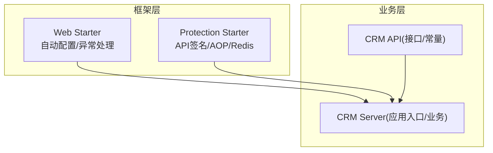
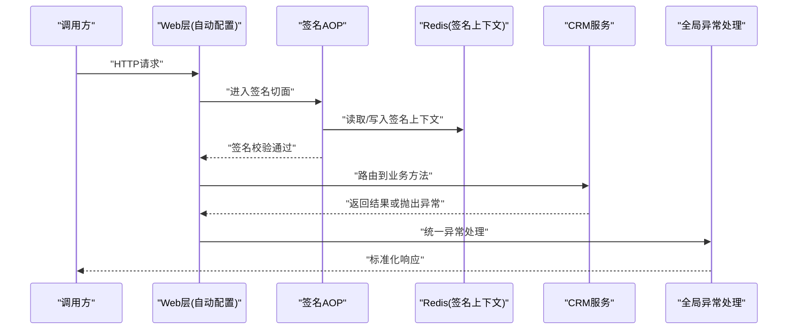
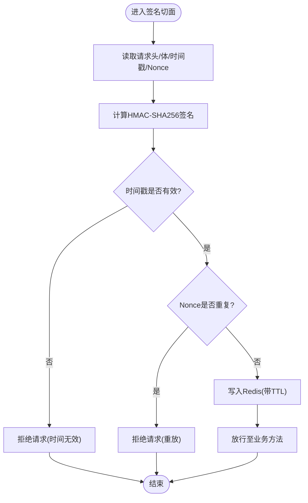
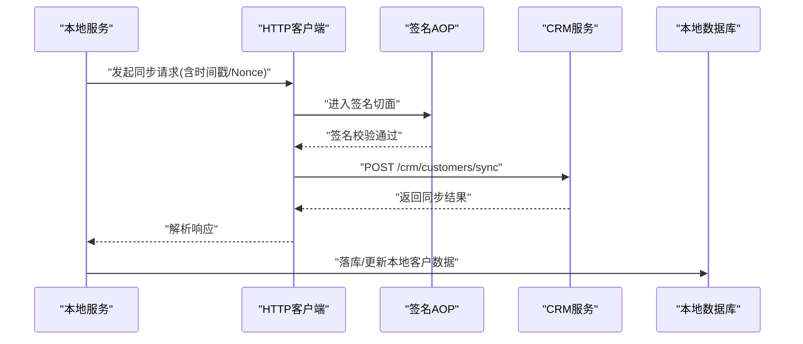
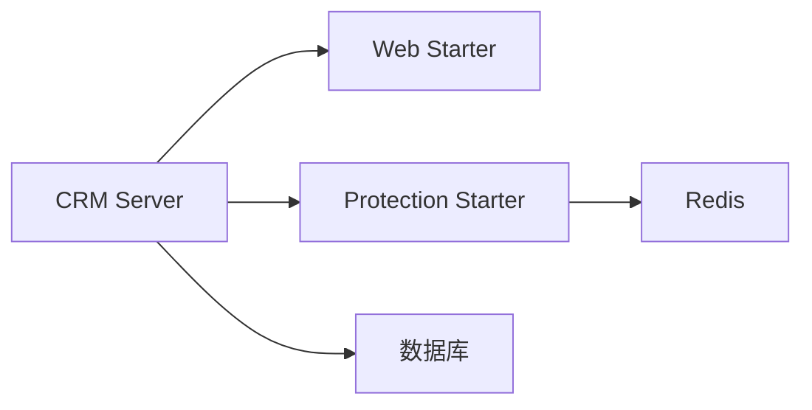

# REST API集成

<cite>
**本文引用的文件**
- [yudao-spring-boot-starter-web 自动配置](file://yudao-cloud/yudao-framework/yudao-spring-boot-starter-web/src/main/java/cn/iocoder/yudao/framework/web/config/YudaoWebAutoConfiguration.java)
- [Web属性配置](file://yudao-cloud/yudao-framework/yudao-spring-boot-starter-web/src/main/java/cn/iocoder/yudao/framework/web/config/WebProperties.java)
- [全局异常处理器](file://yudao-cloud/yudao-framework/yudao-spring-boot-starter-web/src/main/java/cn/iocoder/yudao/framework/web/core/handler/GlobalExceptionHandler.java)
- [API签名自动配置](file://yudao-cloud/yudao-framework/yudao-spring-boot-starter-protection/src/main/java/cn/iocoder/yudao/framework/signature/config/YudaoApiSignatureAutoConfiguration.java)
- [API签名注解](file://yudao-cloud/yudao-framework/yudao-spring-boot-starter-protection/src/main/java/cn/iocoder/yudao/framework/signature/core/annotation/ApiSignature.java)
- [API签名切面](file://yudao-cloud/yudao-framework/yudao-spring-boot-starter-protection/src/main/java/cn/iocoder/yudao/framework/signature/core/aop/ApiSignatureAspect.java)
- [API签名Redis DAO](file://yudao-cloud/yudao-framework/yudao-spring-boot-starter-protection/src/main/java/cn/iocoder/yudao/framework/signature/core/redis/ApiSignatureRedisDAO.java)
- [CRM模块POM](file://yudao-cloud/yudao-module-crm/pom.xml)
- [CRM服务端POM](file://yudao-cloud/yudao-module-crm/yudao-module-crm-server/pom.xml)
- [CRM应用入口](file://yudao-cloud/yudao-module-crm/yudao-module-crm-server/src/main/java/cn/iocoder/yudao/module/crm/CrmServerApplication.java)
- [CRM业务错误码常量](file://yudao-cloud/yudao-module-crm/yudao-module-crm-api/src/main/java/cn/iocoder/yudao/module/crm/enums/ErrorCodeConstants.java)
</cite>

## 目录
1. [简介](#简介)
2. [项目结构](#项目结构)
3. [核心组件](#核心组件)
4. [架构总览](#架构总览)
5. [详细组件分析](#详细组件分析)
6. [依赖关系分析](#依赖关系分析)
7. [性能考虑](#性能考虑)
8. [故障排查指南](#故障排查指南)
9. [结论](#结论)
10. [附录](#附录)

## 简介
本文件面向REST API集成的工程化实践，聚焦以下目标：
- HTTP客户端的配置与使用：连接池、超时、SSL证书管理。
- 请求签名机制：HMAC-SHA256、时间戳校验与防重放。
- 重试机制：指数退避、熔断器与降级处理。
- 错误处理最佳实践：异常分类、错误码映射与日志记录。
- CRM系统对接示例：外部API调用与客户数据同步流程。

说明：本项目采用模块化架构，HTTP能力由Web Starter提供基础支撑；安全与签名由Protection Starter提供；CRM模块作为业务接入点。下文将结合源码位置进行系统化阐述。

## 项目结构
- yudao-framework
  - yudao-spring-boot-starter-web：提供Web层自动装配、全局异常处理、过滤器等。
  - yudao-spring-boot-starter-protection：提供API签名（注解+AOP+Redis）能力。
- yudao-module-crm
  - yudao-module-crm-api：对外API定义与枚举常量。
  - yudao-module-crm-server：CRM服务实现与应用入口。

图表来源
- [yudao-spring-boot-starter-web 自动配置](file://yudao-cloud/yudao-framework/yudao-spring-boot-starter-web/src/main/java/cn/iocoder/yudao/framework/web/config/YudaoWebAutoConfiguration.java)
- [API签名自动配置](file://yudao-cloud/yudao-framework/yudao-spring-boot-starter-protection/src/main/java/cn/iocoder/yudao/framework/signature/config/YudaoApiSignatureAutoConfiguration.java)
- [CRM应用入口](file://yudao-cloud/yudao-module-crm/yudao-module-crm-server/src/main/java/cn/iocoder/yudao/module/crm/CrmServerApplication.java)

章节来源
- [yudao-spring-boot-starter-web 自动配置](file://yudao-cloud/yudao-framework/yudao-spring-boot-starter-web/src/main/java/cn/iocoder/yudao/framework/web/config/YudaoWebAutoConfiguration.java)
- [Web属性配置](file://yudao-cloud/yudao-framework/yudao-spring-boot-starter-web/src/main/java/cn/iocoder/yudao/framework/web/config/WebProperties.java)
- [API签名自动配置](file://yudao-cloud/yudao-framework/yudao-spring-boot-starter-protection/src/main/java/cn/iocoder/yudao/framework/signature/config/YudaoApiSignatureAutoConfiguration.java)
- [CRM应用入口](file://yudao-cloud/yudao-module-crm/yudao-module-crm-server/src/main/java/cn/iocoder/yudao/module/crm/CrmServerApplication.java)

## 核心组件
- Web层自动配置与属性
  - 通过自动配置类完成Web相关能力的装配，便于统一接入。
  - 属性类集中管理Web相关配置项，便于扩展与覆盖。
- 全局异常处理
  - 统一捕获并转换异常为标准化响应，便于前端一致处理。
- API签名与安全
  - 基于注解声明需要签名的接口，AOP在入参出参阶段执行签名计算与校验。
  - 使用Redis存储签名上下文，支持时间窗口与防重放策略。
- CRM模块
  - 以独立服务形式暴露能力，并通过API模块共享契约与错误码。

章节来源
- [yudao-spring-boot-starter-web 自动配置](file://yudao-cloud/yudao-framework/yudao-spring-boot-starter-web/src/main/java/cn/iocoder/yudao/framework/web/config/YudaoWebAutoConfiguration.java)
- [Web属性配置](file://yudao-cloud/yudao-framework/yudao-spring-boot-starter-web/src/main/java/cn/iocoder/yudao/framework/web/config/WebProperties.java)
- [全局异常处理器](file://yudao-cloud/yudao-framework/yudao-spring-boot-starter-web/src/main/java/cn/iocoder/yudao/framework/web/core/handler/GlobalExceptionHandler.java)
- [API签名自动配置](file://yudao-cloud/yudao-framework/yudao-spring-boot-starter-protection/src/main/java/cn/iocoder/yudao/framework/signature/config/YudaoApiSignatureAutoConfiguration.java)
- [API签名注解](file://yudao-cloud/yudao-framework/yudao-spring-boot-starter-protection/src/main/java/cn/iocoder/yudao/framework/signature/core/annotation/ApiSignature.java)
- [API签名切面](file://yudao-cloud/yudao-framework/yudao-spring-boot-starter-protection/src/main/java/cn/iocoder/yudao/framework/signature/core/aop/ApiSignatureAspect.java)
- [API签名Redis DAO](file://yudao-cloud/yudao-framework/yudao-spring-boot-starter-protection/src/main/java/cn/iocoder/yudao/framework/signature/core/redis/ApiSignatureRedisDAO.java)
- [CRM应用入口](file://yudao-cloud/yudao-module-crm/yudao-module-crm-server/src/main/java/cn/iocoder/yudao/module/crm/CrmServerApplication.java)

## 架构总览
下图展示从调用方到CRM服务的请求路径，以及签名与异常处理的介入点。

图表来源
- [yudao-spring-boot-starter-web 自动配置](file://yudao-cloud/yudao-framework/yudao-spring-boot-starter-web/src/main/java/cn/iocoder/yudao/framework/web/config/YudaoWebAutoConfiguration.java)
- [API签名切面](file://yudao-cloud/yudao-framework/yudao-spring-boot-starter-protection/src/main/java/cn/iocoder/yudao/framework/signature/core/aop/ApiSignatureAspect.java)
- [API签名Redis DAO](file://yudao-cloud/yudao-framework/yudao-spring-boot-starter-protection/src/main/java/cn/iocoder/yudao/framework/signature/core/redis/ApiSignatureRedisDAO.java)
- [全局异常处理器](file://yudao-cloud/yudao-framework/yudao-spring-boot-starter-web/src/main/java/cn/iocoder/yudao/framework/web/core/handler/GlobalExceptionHandler.java)

## 详细组件分析

### HTTP客户端配置与使用（连接池、超时、SSL）
- 连接池与超时
  - 建议在Web Starter的属性配置中集中管理HTTP客户端参数（如连接池大小、最大空闲连接、连接超时、读超时），以便在多环境快速切换。
  - 若使用Spring RestTemplate或WebClient，可通过自动配置注入的Bean进行统一设置，避免散落的硬编码。
- SSL证书管理
  - 对于HTTPS调用，建议通过配置指定信任库与密钥库，或在启动参数中传入JVM级别的SSL参数，确保生产环境可审计、可回滚。
- 使用建议
  - 将HTTP客户端封装为领域服务，屏蔽底层差异，对外暴露统一的“调用外部API”方法，便于后续加入重试、熔断与监控。

章节来源
- [Web属性配置](file://yudao-cloud/yudao-framework/yudao-spring-boot-starter-web/src/main/java/cn/iocoder/yudao/framework/web/config/WebProperties.java)
- [yudao-spring-boot-starter-web 自动配置](file://yudao-cloud/yudao-framework/yudao-spring-boot-starter-web/src/main/java/cn/iocoder/yudao/framework/web/config/YudaoWebAutoConfiguration.java)

### 请求签名机制（HMAC-SHA256、时间戳、防重放）
- 设计要点
  - 使用HMAC-SHA256对关键请求体与头进行签名，保证完整性与不可抵赖性。
  - 引入时间戳字段，服务端校验时间窗口，防止过期请求。
  - 利用Redis记录已使用的nonce或请求指纹，实现防重放。
- 实现位置
  - 注解用于声明需要签名的接口。
  - AOP在方法前后执行签名计算与校验。
  - Redis DAO负责签名上下文的存取与过期控制。
- 流程图

图表来源
- [API签名注解](file://yudao-cloud/yudao-framework/yudao-spring-boot-starter-protection/src/main/java/cn/iocoder/yudao/framework/signature/core/annotation/ApiSignature.java)
- [API签名切面](file://yudao-cloud/yudao-framework/yudao-spring-boot-starter-protection/src/main/java/cn/iocoder/yudao/framework/signature/core/aop/ApiSignatureAspect.java)
- [API签名Redis DAO](file://yudao-cloud/yudao-framework/yudao-spring-boot-starter-protection/src/main/java/cn/iocoder/yudao/framework/signature/core/redis/ApiSignatureRedisDAO.java)

章节来源
- [API签名自动配置](file://yudao-cloud/yudao-framework/yudao-spring-boot-starter-protection/src/main/java/cn/iocoder/yudao/framework/signature/config/YudaoApiSignatureAutoConfiguration.java)
- [API签名注解](file://yudao-cloud/yudao-framework/yudao-spring-boot-starter-protection/src/main/java/cn/iocoder/yudao/framework/signature/core/annotation/ApiSignature.java)
- [API签名切面](file://yudao-cloud/yudao-framework/yudao-spring-boot-starter-protection/src/main/java/cn/iocoder/yudao/framework/signature/core/aop/ApiSignatureAspect.java)
- [API签名Redis DAO](file://yudao-cloud/yudao-framework/yudao-spring-boot-starter-protection/src/main/java/cn/iocoder/yudao/framework/signature/core/redis/ApiSignatureRedisDAO.java)

### 重试机制（指数退避、熔断器、降级）
- 指数退避
  - 对网络抖动或瞬时失败，采用指数退避+随机抖动策略，降低雪崩风险。
  - 建议限制最大重试次数与总耗时，避免长时间阻塞。
- 熔断器
  - 当下游错误率超过阈值时快速失败，避免级联故障。
  - 半开状态允许少量探测流量，恢复后关闭熔断。
- 降级
  - 在熔断或超时情况下返回缓存数据或默认值，保障核心链路可用。
- 建议落地方式
  - 在封装的HTTP调用服务中统一实现重试与熔断逻辑，业务侧无感知。
  - 结合指标与告警，动态调整阈值与超时。

[本节为通用设计建议，不直接分析具体文件]

### 错误处理最佳实践（异常分类、错误码映射、日志）
- 异常分类
  - 区分业务异常、参数校验异常、网络异常与系统异常，分别处理。
- 错误码映射
  - 使用统一的错误码常量（如CRM模块的错误码常量）进行对外暴露，内部异常转换为标准响应。
- 日志记录
  - 关键路径记录结构化日志（请求ID、用户ID、耗时、上游错误信息），便于追踪与排障。
- 统一出口
  - 通过全局异常处理器收敛所有异常，输出一致的JSON结构与HTTP状态码。

章节来源
- [全局异常处理器](file://yudao-cloud/yudao-framework/yudao-spring-boot-starter-web/src/main/java/cn/iocoder/yudao/framework/web/core/handler/GlobalExceptionHandler.java)
- [CRM业务错误码常量](file://yudao-cloud/yudao-module-crm/yudao-module-crm-api/src/main/java/cn/iocoder/yudao/module/crm/enums/ErrorCodeConstants.java)

### CRM系统对接示例（客户数据同步）
- 场景描述
  - CRM服务作为外部系统，提供客户数据的增删改查接口。本地系统通过HTTP调用CRM API完成数据同步。
- 调用流程（序列图）

图表来源
- [API签名切面](file://yudao-cloud/yudao-framework/yudao-spring-boot-starter-protection/src/main/java/cn/iocoder/yudao/framework/signature/core/aop/ApiSignatureAspect.java)
- [CRM应用入口](file://yudao-cloud/yudao-module-crm/yudao-module-crm-server/src/main/java/cn/iocoder/yudao/module/crm/CrmServerApplication.java)

- 实施要点
  - 在本地服务中封装“CRM客户同步”方法，统一处理重试、熔断与降级。
  - 使用Web层的HTTP客户端配置，设置合理的连接池与超时。
  - 通过签名AOP对CRM调用进行鉴权与防重放。
  - 将CRM返回的错误码映射为本地业务错误码，便于上层统一处理。

章节来源
- [CRM模块POM](file://yudao-cloud/yudao-module-crm/pom.xml)
- [CRM服务端POM](file://yudao-cloud/yudao-module-crm/yudao-module-crm-server/pom.xml)
- [CRM应用入口](file://yudao-cloud/yudao-module-crm/yudao-module-crm-server/src/main/java/cn/iocoder/yudao/module/crm/CrmServerApplication.java)

## 依赖关系分析
- 模块耦合
  - CRM Server依赖Web Starter提供的Web能力与Protection Starter的签名能力。
  - CRM API仅暴露契约与错误码，保持低耦合。
- 外部依赖
  - Redis用于签名上下文与防重放。
  - 数据库用于持久化CRM相关数据。

图表来源
- [CRM应用入口](file://yudao-cloud/yudao-module-crm/yudao-module-crm-server/src/main/java/cn/iocoder/yudao/module/crm/CrmServerApplication.java)
- [yudao-spring-boot-starter-web 自动配置](file://yudao-cloud/yudao-framework/yudao-spring-boot-starter-web/src/main/java/cn/iocoder/yudao/framework/web/config/YudaoWebAutoConfiguration.java)
- [API签名自动配置](file://yudao-cloud/yudao-framework/yudao-spring-boot-starter-protection/src/main/java/cn/iocoder/yudao/framework/signature/config/YudaoApiSignatureAutoConfiguration.java)

章节来源
- [CRM模块POM](file://yudao-cloud/yudao-module-crm/pom.xml)
- [CRM服务端POM](file://yudao-cloud/yudao-module-crm/yudao-module-crm-server/pom.xml)

## 性能考虑
- 连接池调优
  - 根据并发量与下游QPS调整最大连接数与队列长度，避免资源耗尽。
- 超时与重试
  - 合理设置读/写超时，配合指数退避重试，减少尾部延迟影响。
- 缓存与降级
  - 对热点数据做缓存，降低下游压力；在异常时启用降级策略。
- 监控与观测
  - 记录关键指标（成功率、耗时、错误分布），结合告警快速定位问题。

[本节为通用性能建议，不直接分析具体文件]

## 故障排查指南
- 常见问题
  - 签名失败：检查时间戳是否漂移、Nonce是否重复、密钥是否正确。
  - 连接超时：检查连接池配置、下游响应时间与网络状况。
  - 熔断触发：查看错误率与阈值，必要时临时放宽或扩容下游。
- 定位步骤
  - 通过全局异常处理器的日志定位异常类型与堆栈。
  - 检查Redis中的签名上下文是否存在与过期情况。
  - 核对CRM模块错误码与上游返回是否一致。
- 建议
  - 增加请求链路ID，贯穿上下游日志。
  - 对关键接口增加慢查询与错误率告警。

章节来源
- [全局异常处理器](file://yudao-cloud/yudao-framework/yudao-spring-boot-starter-web/src/main/java/cn/iocoder/yudao/framework/web/core/handler/GlobalExceptionHandler.java)
- [API签名Redis DAO](file://yudao-cloud/yudao-framework/yudao-spring-boot-starter-protection/src/main/java/cn/iocoder/yudao/framework/signature/core/redis/ApiSignatureRedisDAO.java)
- [CRM业务错误码常量](file://yudao-cloud/yudao-module-crm/yudao-module-crm-api/src/main/java/cn/iocoder/yudao/module/crm/enums/ErrorCodeConstants.java)

## 结论
本方案通过Web Starter与Protection Starter的组合，提供了标准化的HTTP接入与请求签名能力；结合重试、熔断与降级的通用策略，可在复杂外部依赖环境下保持稳定交付。CRM对接示例展示了从调用到落库的完整闭环，便于在实际项目中复用与扩展。

## 附录
- 配置清单建议
  - HTTP客户端：连接池大小、最大空闲连接、连接超时、读超时。
  - 签名：时间窗口、Nonce有效期、密钥轮换策略。
  - 重试：最大次数、初始退避、最大退避、抖动因子。
  - 熔断：错误率阈值、滑动窗口、半开探测次数。
- 参考文件
  - [Web属性配置](file://yudao-cloud/yudao-framework/yudao-spring-boot-starter-web/src/main/java/cn/iocoder/yudao/framework/web/config/WebProperties.java)
  - [API签名注解](file://yudao-cloud/yudao-framework/yudao-spring-boot-starter-protection/src/main/java/cn/iocoder/yudao/framework/signature/core/annotation/ApiSignature.java)
  - [API签名切面](file://yudao-cloud/yudao-framework/yudao-spring-boot-starter-protection/src/main/java/cn/iocoder/yudao/framework/signature/core/aop/ApiSignatureAspect.java)
  - [CRM业务错误码常量](file://yudao-cloud/yudao-module-crm/yudao-module-crm-api/src/main/java/cn/iocoder/yudao/module/crm/enums/ErrorCodeConstants.java)