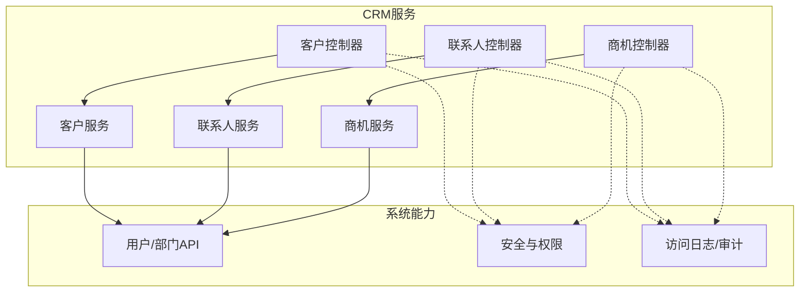
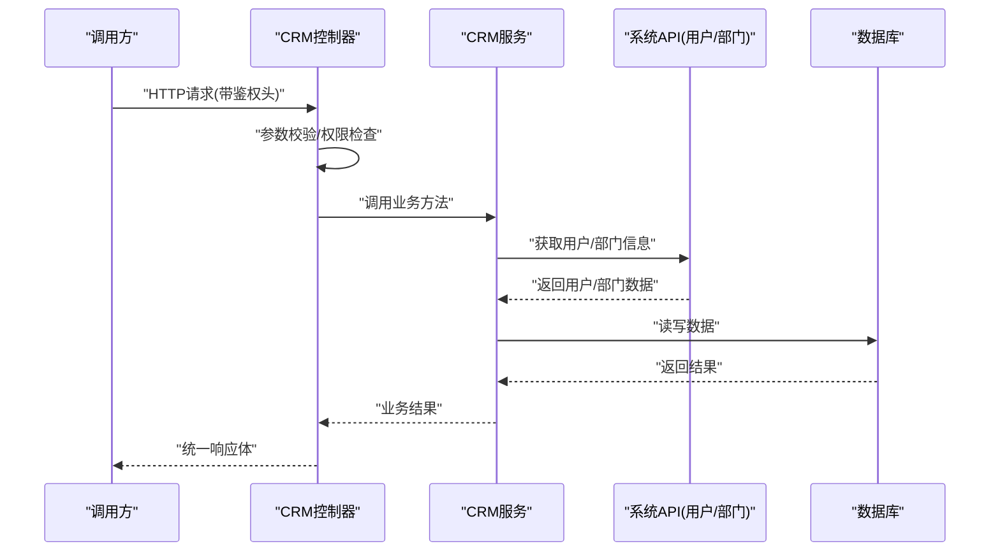
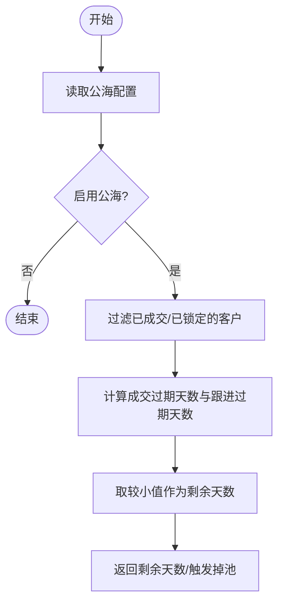
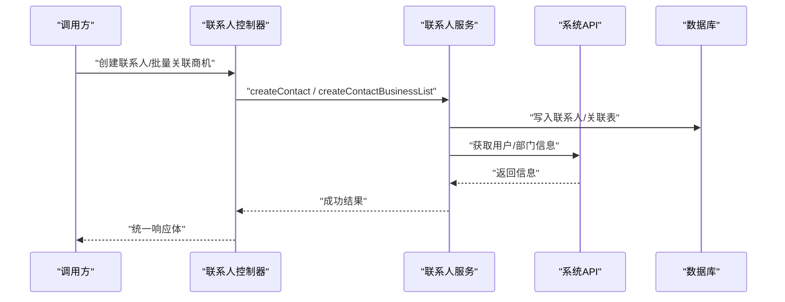
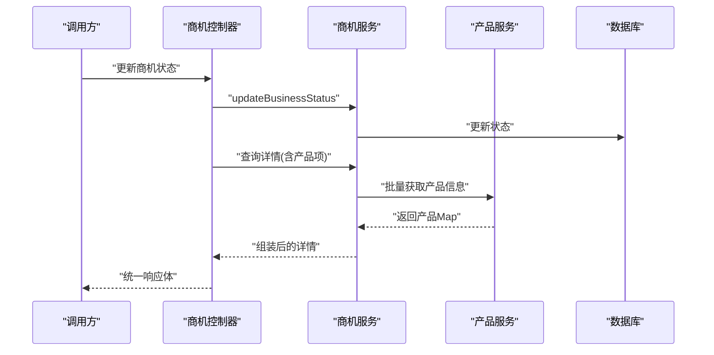
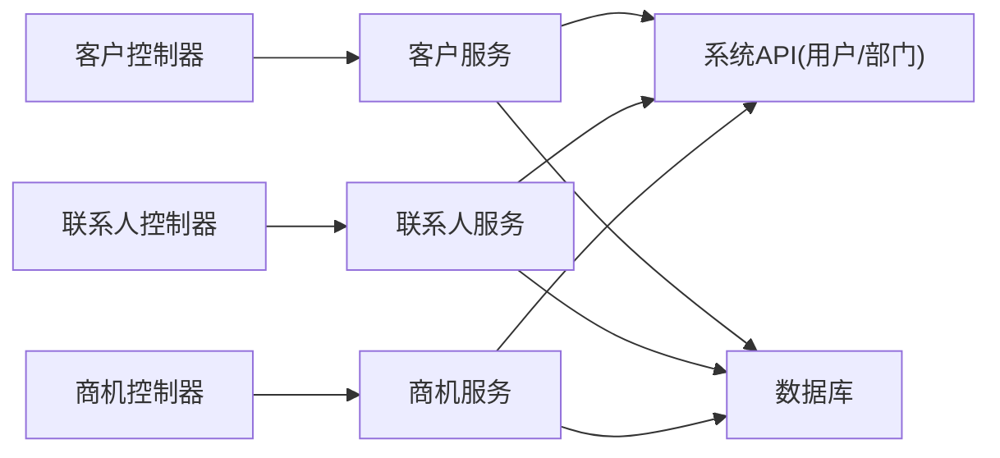
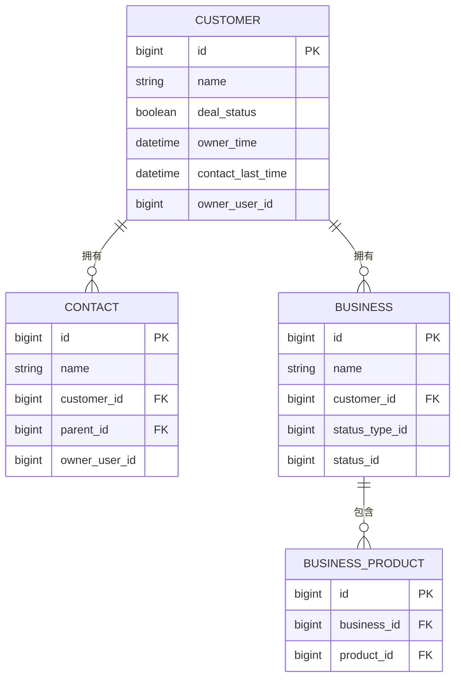

# CRM系统集成

<cite>
**本文引用的文件**
- [ApiConstants.java](file://yudao-cloud/yudao-module-crm/yudao-module-crm-api/src/main/java/cn/iocoder/yudao/module/crm/enums/ApiConstants.java)
- [CrmCustomerController.java](file://yudao-cloud/yudao-module-crm/yudao-module-crm-server/src/main/java/cn/iocoder/yudao/module/crm/controller/admin/customer/CrmCustomerController.java)
- [CrmContactController.java](file://yudao-cloud/yudao-module-crm/yudao-module-crm-server/src/main/java/cn/iocoder/yudao/module/crm/controller/admin/contact/CrmContactController.java)
- [CrmBusinessController.java](file://yudao-cloud/yudao-module-crm/yudao-module-crm-server/src/main/java/cn/iocoder/yudao/module/crm/controller/admin/business/CrmBusinessController.java)
- [CrmCustomerService.java](file://yudao-cloud/yudao-module-crm/yudao-module-crm-server/src/main/java/cn/iocoder/yudao/module/crm/service/customer/CrmCustomerService.java)
- [CrmContactService.java](file://yudao-cloud/yudao-module-crm/yudao-module-crm-server/src/main/java/cn/iocoder/yudao/module/crm/service/contact/CrmContactService.java)
</cite>

## 目录
1. [简介](#简介)
2. [项目结构](#项目结构)
3. [核心组件](#核心组件)
4. [架构总览](#架构总览)
5. [详细组件分析](#详细组件分析)
6. [依赖关系分析](#依赖关系分析)
7. [性能考虑](#性能考虑)
8. [故障排查指南](#故障排查指南)
9. [结论](#结论)
10. [附录](#附录)

## 简介
本文件面向“CRM系统集成”的开发者与实施人员，系统性地说明CRM模块的整体架构、数据流向与关键业务流程。重点覆盖：
- 客户数据同步机制（含公海池、自动掉池）
- 联系人信息管理与关联
- 业务（商机）状态更新策略
- CRM API调用方式（认证授权、数据格式转换、错误处理）
- 集成示例（查询客户、创建联系人、同步业务记录）
- 数据冲突解决与增量同步策略
- 配置模板与排障要点

## 项目结构
CRM能力以微服务形式提供，对外暴露REST接口，内部通过服务层组织业务逻辑，并依赖系统域的用户/部门等基础能力。主要目录与职责：
- yudao-module-crm-api：定义API常量、枚举、错误码等跨模块共享契约
- yudao-module-crm-server：实现控制器、服务、数据访问、定时任务等
- 控制器按领域划分：客户、联系人、商机、合同、回款、统计等
- 服务层封装CRUD、权限校验、数据拼装、流程编排
- 数据访问层基于MyBatis与数据库持久化
- 框架层提供安全、日志、Excel导入导出、分页、通用结果封装等

图表来源
- [CrmCustomerController.java:49-316](file://yudao-cloud/yudao-module-crm/yudao-module-crm-server/src/main/java/cn/iocoder/yudao/module/crm/controller/admin/customer/CrmCustomerController.java#L49-L316)
- [CrmContactController.java:48-237](file://yudao-cloud/yudao-module-crm/yudao-module-crm-server/src/main/java/cn/iocoder/yudao/module/crm/controller/admin/contact/CrmContactController.java#L48-L237)
- [CrmBusinessController.java:50-242](file://yudao-cloud/yudao-module-crm/yudao-module-crm-server/src/main/java/cn/iocoder/yudao/module/crm/controller/admin/business/CrmBusinessController.java#L50-L242)

章节来源
- [CrmCustomerController.java:49-316](file://yudao-cloud/yudao-module-crm/yudao-module-crm-server/src/main/java/cn/iocoder/yudao/module/crm/controller/admin/customer/CrmCustomerController.java#L49-L316)
- [CrmContactController.java:48-237](file://yudao-cloud/yudao-module-crm/yudao-module-crm-server/src/main/java/cn/iocoder/yudao/module/crm/controller/admin/contact/CrmContactController.java#L48-L237)
- [CrmBusinessController.java:50-242](file://yudao-cloud/yudao-module-crm/yudao-module-crm-server/src/main/java/cn/iocoder/yudao/module/crm/controller/admin/business/CrmBusinessController.java#L50-L242)

## 核心组件
- 客户管理：创建/更新/删除/分页/详情/转移/锁定解锁/公海池操作/导入导出
- 联系人管理：创建/更新/删除/分页/详情/转移/按客户或商机查询/批量关联商机
- 商机管理：创建/更新/删除/分页/详情/状态更新/按客户或联系人查询/产品项聚合/转移
- 公共能力：统一返回体、分页、权限控制、访问日志、Excel工具、区域格式化、用户/部门信息填充

章节来源
- [CrmCustomerController.java:65-316](file://yudao-cloud/yudao-module-crm/yudao-module-crm-server/src/main/java/cn/iocoder/yudao/module/crm/controller/admin/customer/CrmCustomerController.java#L65-L316)
- [CrmContactController.java:67-237](file://yudao-cloud/yudao-module-crm/yudao-module-crm-server/src/main/java/cn/iocoder/yudao/module/crm/controller/admin/contact/CrmContactController.java#L67-L237)
- [CrmBusinessController.java:72-242](file://yudao-cloud/yudao-module-crm/yudao-module-crm-server/src/main/java/cn/iocoder/yudao/module/crm/controller/admin/business/CrmBusinessController.java#L72-L242)

## 架构总览
CRM服务采用分层架构：
- 接入层：Spring MVC控制器，负责参数校验、权限拦截、日志记录、响应封装
- 业务层：Service接口与实现，封装领域规则、数据拼装、事务边界
- 数据层：DAO/Mapper与DO对象，完成持久化
- 外部依赖：系统域的AdminUserApi/DeptApi用于用户与部门信息；Excel工具用于导入导出；安全框架进行鉴权

图表来源
- [CrmCustomerController.java:65-130](file://yudao-cloud/yudao-module-crm/yudao-module-crm-server/src/main/java/cn/iocoder/yudao/module/crm/controller/admin/customer/CrmCustomerController.java#L65-L130)
- [CrmContactController.java:67-134](file://yudao-cloud/yudao-module-crm/yudao-module-crm-server/src/main/java/cn/iocoder/yudao/module/crm/controller/admin/contact/CrmContactController.java#L67-L134)
- [CrmBusinessController.java:72-167](file://yudao-cloud/yudao-module-crm/yudao-module-crm-server/src/main/java/cn/iocoder/yudao/module/crm/controller/admin/business/CrmBusinessController.java#L72-L167)

## 详细组件分析

### 客户数据同步与公海机制
- 同步入口：控制器提供创建、更新、导入、转移、锁定解锁、放入公海、领取公海、分配公海等接口
- 数据拼装：在控制器中批量拉取用户/部门信息，填充到VO后返回，减少N+1查询
- 公海策略：支持计算距离进入公海的天数，依据成交状态与跟进时间判断是否进入公海；提供自动掉池能力（服务接口）
- 权限控制：所有写操作均使用注解式权限校验

图表来源
- [CrmCustomerController.java:190-222](file://yudao-cloud/yudao-module-crm/yudao-module-crm-server/src/main/java/cn/iocoder/yudao/module/crm/controller/admin/customer/CrmCustomerController.java#L190-L222)
- [CrmCustomerService.java:175-196](file://yudao-cloud/yudao-module-crm/yudao-module-crm-server/src/main/java/cn/iocoder/yudao/module/crm/service/customer/CrmCustomerService.java#L175-L196)

章节来源
- [CrmCustomerController.java:65-316](file://yudao-cloud/yudao-module-crm/yudao-module-crm-server/src/main/java/cn/iocoder/yudao/module/crm/controller/admin/customer/CrmCustomerController.java#L65-L316)
- [CrmCustomerService.java:23-196](file://yudao-cloud/yudao-module-crm/yudao-module-crm-server/src/main/java/cn/iocoder/yudao/module/crm/service/customer/CrmCustomerService.java#L23-L196)

### 联系人信息管理
- 基本能力：创建、更新、删除、分页、详情、转移
- 关联能力：按客户或商机维度查询联系人；批量建立/删除联系人与商机的关联
- 数据拼装：批量拉取客户、用户/部门、父联系人信息，填充到VO

图表来源
- [CrmContactController.java:67-219](file://yudao-cloud/yudao-module-crm/yudao-module-crm-server/src/main/java/cn/iocoder/yudao/module/crm/controller/admin/contact/CrmContactController.java#L67-L219)
- [CrmContactService.java:26-181](file://yudao-cloud/yudao-module-crm/yudao-module-crm-server/src/main/java/cn/iocoder/yudao/module/crm/service/contact/CrmContactService.java#L26-L181)

章节来源
- [CrmContactController.java:67-237](file://yudao-cloud/yudao-module-crm/yudao-module-crm-server/src/main/java/cn/iocoder/yudao/module/crm/controller/admin/contact/CrmContactController.java#L67-L237)
- [CrmContactService.java:26-181](file://yudao-cloud/yudao-module-crm/yudao-module-crm-server/src/main/java/cn/iocoder/yudao/module/crm/service/contact/CrmContactService.java#L26-L181)

### 业务（商机）状态更新策略
- 状态维护：提供更新商机状态的接口，结合状态类型与具体状态名称拼装返回
- 产品项聚合：根据商机ID查询产品项，再批量拉取产品信息，填充产品名称、编号、单位
- 权限与日志：写操作受权限保护，导出操作记录访问日志

图表来源
- [CrmBusinessController.java:72-127](file://yudao-cloud/yudao-module-crm/yudao-module-crm-server/src/main/java/cn/iocoder/yudao/module/crm/controller/admin/business/CrmBusinessController.java#L72-L127)
- [CrmBusinessController.java:161-198](file://yudao-cloud/yudao-module-crm/yudao-module-crm-server/src/main/java/cn/iocoder/yudao/module/crm/controller/admin/business/CrmBusinessController.java#L161-L198)

章节来源
- [CrmBusinessController.java:72-242](file://yudao-cloud/yudao-module-crm/yudao-module-crm-server/src/main/java/cn/iocoder/yudao/module/crm/controller/admin/business/CrmBusinessController.java#L72-L242)

### CRM API调用方式（认证、数据格式、错误处理）
- 认证授权：控制器方法使用注解式权限校验，需携带有效的身份令牌与相应权限标识
- 数据格式：统一使用CommonResult包装返回；分页使用PageResult；请求体使用VO对象，支持JSR303校验
- 错误处理：框架层统一异常处理与错误码；部分场景抛出业务异常（如客户不存在）
- 服务名与版本：通过API常量定义服务名、前缀与版本，便于网关路由与服务发现

章节来源
- [CrmCustomerController.java:65-130](file://yudao-cloud/yudao-module-crm/yudao-module-crm-server/src/main/java/cn/iocoder/yudao/module/crm/controller/admin/customer/CrmCustomerController.java#L65-L130)
- [CrmContactController.java:67-134](file://yudao-cloud/yudao-module-crm/yudao-module-crm-server/src/main/java/cn/iocoder/yudao/module/crm/controller/admin/contact/CrmContactController.java#L67-L134)
- [CrmBusinessController.java:72-167](file://yudao-cloud/yudao-module-crm/yudao-module-crm-server/src/main/java/cn/iocoder/yudao/module/crm/controller/admin/business/CrmBusinessController.java#L72-L167)
- [ApiConstants.java:10-23](file://yudao-cloud/yudao-module-crm/yudao-module-crm-api/src/main/java/cn/iocoder/yudao/module/crm/enums/ApiConstants.java#L10-L23)

### 集成示例（代码片段路径）
- 查询客户详情
  - 路径参考：[CrmCustomerController.java:101-110](file://yudao-cloud/yudao-module-crm/yudao-module-crm-server/src/main/java/cn/iocoder/yudao/module/crm/controller/admin/customer/CrmCustomerController.java#L101-L110)
- 创建联系人
  - 路径参考：[CrmContactController.java:67-72](file://yudao-cloud/yudao-module-crm/yudao-module-crm-server/src/main/java/cn/iocoder/yudao/module/crm/controller/admin/contact/CrmContactController.java#L67-L72)
- 同步业务记录（更新商机状态）
  - 路径参考：[CrmBusinessController.java:87-93](file://yudao-cloud/yudao-module-crm/yudao-module-crm-server/src/main/java/cn/iocoder/yudao/module/crm/controller/admin/business/CrmBusinessController.java#L87-L93)

章节来源
- [CrmCustomerController.java:101-110](file://yudao-cloud/yudao-module-crm/yudao-module-crm-server/src/main/java/cn/iocoder/yudao/module/crm/controller/admin/customer/CrmCustomerController.java#L101-L110)
- [CrmContactController.java:67-72](file://yudao-cloud/yudao-module-crm/yudao-module-crm-server/src/main/java/cn/iocoder/yudao/module/crm/controller/admin/contact/CrmContactController.java#L67-L72)
- [CrmBusinessController.java:87-93](file://yudao-cloud/yudao-module-crm/yudao-module-crm-server/src/main/java/cn/iocoder/yudao/module/crm/controller/admin/business/CrmBusinessController.java#L87-L93)

## 依赖关系分析
- 控制器依赖服务层，服务层依赖系统域API（用户/部门），以及数据库持久化
- 控制器间无直接耦合，通过服务层解耦
- Excel导入导出依赖框架Excel工具
- 权限与安全由框架层提供，控制器通过注解声明所需权限

图表来源
- [CrmCustomerController.java:55-64](file://yudao-cloud/yudao-module-crm/yudao-module-crm-server/src/main/java/cn/iocoder/yudao/module/crm/controller/admin/customer/CrmCustomerController.java#L55-L64)
- [CrmContactController.java:55-65](file://yudao-cloud/yudao-module-crm/yudao-module-crm-server/src/main/java/cn/iocoder/yudao/module/crm/controller/admin/contact/CrmContactController.java#L55-L65)
- [CrmBusinessController.java:56-70](file://yudao-cloud/yudao-module-crm/yudao-module-crm-server/src/main/java/cn/iocoder/yudao/module/crm/controller/admin/business/CrmBusinessController.java#L56-L70)

章节来源
- [CrmCustomerController.java:55-64](file://yudao-cloud/yudao-module-crm/yudao-module-crm-server/src/main/java/cn/iocoder/yudao/module/crm/controller/admin/customer/CrmCustomerController.java#L55-L64)
- [CrmContactController.java:55-65](file://yudao-cloud/yudao-module-crm/yudao-module-crm-server/src/main/java/cn/iocoder/yudao/module/crm/controller/admin/contact/CrmContactController.java#L55-L65)
- [CrmBusinessController.java:56-70](file://yudao-cloud/yudao-module-crm/yudao-module-crm-server/src/main/java/cn/iocoder/yudao/module/crm/controller/admin/business/CrmBusinessController.java#L56-L70)

## 性能考虑
- 批量数据填充：控制器中对用户、部门、客户、产品等信息采用批量查询并构建Map，避免N+1问题
- 分页与导出：分页查询限制返回规模；导出时关闭分页一次性拉取，注意大数据量下的内存与超时
- 公海计算：仅在必要时计算进入公海天数，并对已成交/已锁定数据进行过滤，降低无效计算
- 缓存建议：对字典、产品类目、区域信息等可考虑引入缓存（当前未在本文件中体现）

章节来源
- [CrmCustomerController.java:132-157](file://yudao-cloud/yudao-module-crm/yudao-module-crm-server/src/main/java/cn/iocoder/yudao/module/crm/controller/admin/customer/CrmCustomerController.java#L132-L157)
- [CrmContactController.java:163-192](file://yudao-cloud/yudao-module-crm/yudao-module-crm-server/src/main/java/cn/iocoder/yudao/module/crm/controller/admin/contact/CrmContactController.java#L163-L192)
- [CrmBusinessController.java:200-232](file://yudao-cloud/yudao-module-crm/yudao-module-crm-server/src/main/java/cn/iocoder/yudao/module/crm/controller/admin/business/CrmBusinessController.java#L200-L232)

## 故障排查指南
- 权限问题：确认调用方已具备对应权限标识（如crm:customer:create），否则会被安全框架拒绝
- 参数校验失败：检查请求体字段是否符合VO约束，关注服务端返回的错误信息
- 数据不存在：例如商机/客户不存在会抛出业务异常，需核对ID与数据可见性
- 导入导出异常：检查文件格式与列映射，确保模板字段一致；大数据导出注意超时与内存
- 公海相关：确认公海配置是否启用，检查客户是否处于已成交/已锁定状态，影响进入公海逻辑

章节来源
- [CrmCustomerController.java:65-130](file://yudao-cloud/yudao-module-crm/yudao-module-crm-server/src/main/java/cn/iocoder/yudao/module/crm/controller/admin/customer/CrmCustomerController.java#L65-L130)
- [CrmContactController.java:67-134](file://yudao-cloud/yudao-module-crm/yudao-module-crm-server/src/main/java/cn/iocoder/yudao/module/crm/controller/admin/contact/CrmContactController.java#L67-L134)
- [CrmBusinessController.java:72-167](file://yudao-cloud/yudao-module-crm/yudao-module-crm-server/src/main/java/cn/iocoder/yudao/module/crm/controller/admin/business/CrmBusinessController.java#L72-L167)

## 结论
本CRM模块提供了完整的客户、联系人、商机管理能力，并通过统一的控制器与服务层设计，实现了清晰的职责分离与良好的扩展性。结合权限控制、访问日志、Excel导入导出与公海机制，能够满足企业级CRM集成的常见需求。建议在集成过程中重点关注权限配置、数据拼装性能与公海策略配置，以确保稳定高效的对接。

## 附录

### 数据模型概览（概念图）

[此图为概念示意，不直接映射具体源码文件]

### 配置模板与最佳实践
- 服务名与前缀：在服务端通过API常量定义服务名与前缀，便于网关路由与服务发现
- 权限标识：为每个写操作配置最小权限集合，遵循最小可用原则
- 导入导出：使用标准模板，严格校验字段；大数据导出建议异步化
- 公海策略：合理设置进入公海的阈值，定期执行自动掉池任务，保持数据健康度

章节来源
- [ApiConstants.java:10-23](file://yudao-cloud/yudao-module-crm/yudao-module-crm-api/src/main/java/cn/iocoder/yudao/module/crm/enums/ApiConstants.java#L10-L23)
- [CrmCustomerController.java:190-222](file://yudao-cloud/yudao-module-crm/yudao-module-crm-server/src/main/java/cn/iocoder/yudao/module/crm/controller/admin/customer/CrmCustomerController.java#L190-L222)
- [CrmCustomerService.java:175-196](file://yudao-cloud/yudao-module-crm/yudao-module-crm-server/src/main/java/cn/iocoder/yudao/module/crm/service/customer/CrmCustomerService.java#L175-L196)