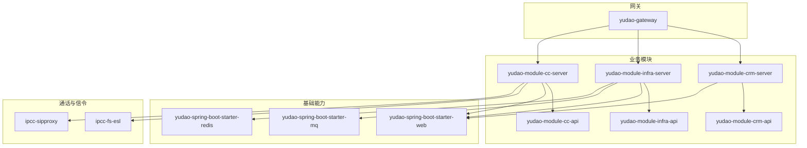
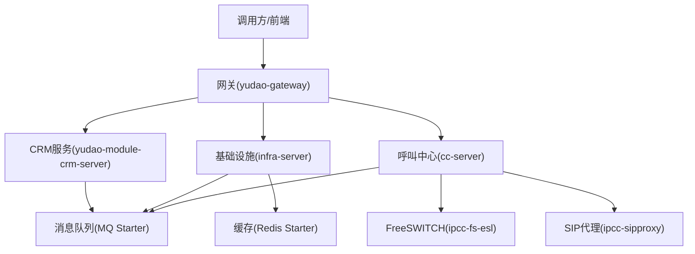
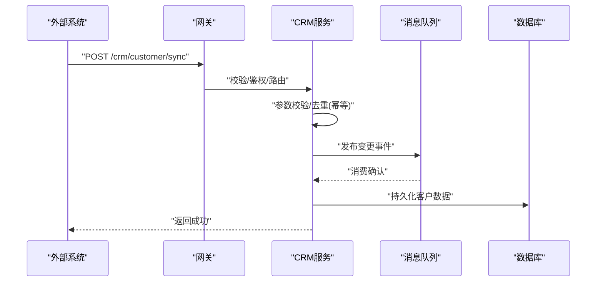
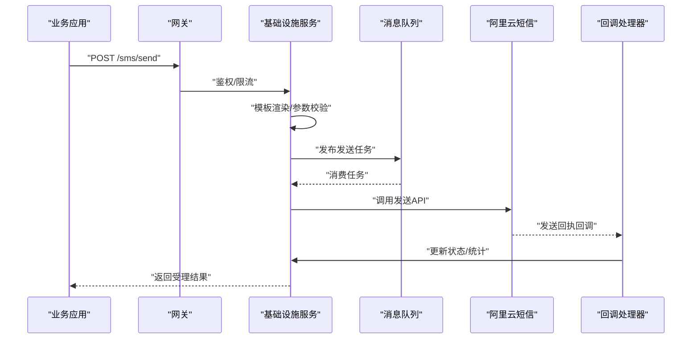
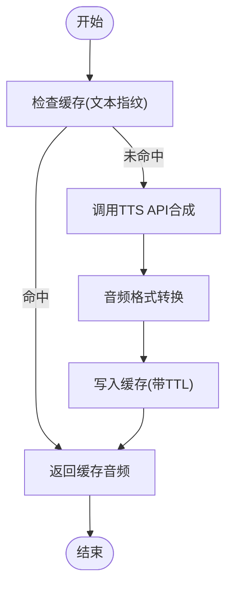
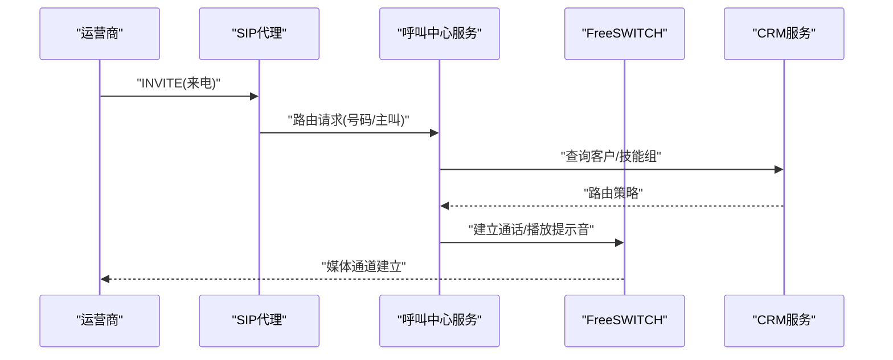
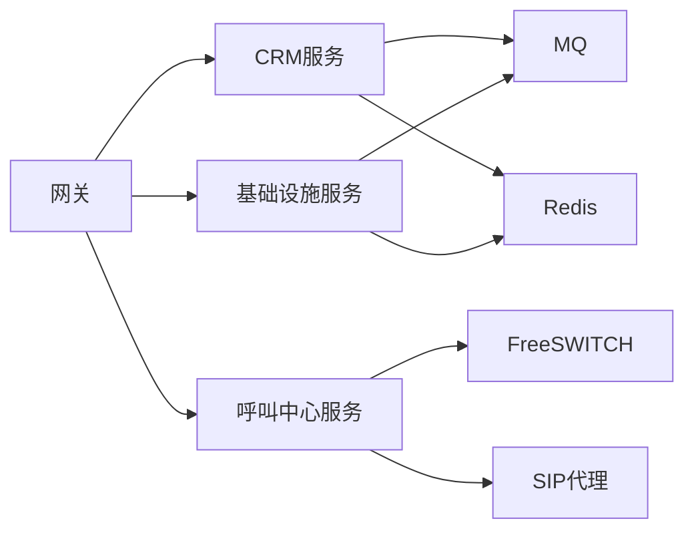

# 外部服务集成

<cite>
**本文引用的文件**
- [yudao-module-crm-api/pom.xml](file://yudao-cloud/yudao-module-crm/yudao-module-crm-api/pom.xml)
- [yudao-module-crm-server/pom.xml](file://yudao-cloud/yudao-module-crm/yudao-module-crm-server/pom.xml)
- [yudao-module-infra-api/pom.xml](file://yudao-cloud/yudao-module-infra/yudao-module-infra-api/pom.xml)
- [yudao-module-infra-server/pom.xml](file://yudao-cloud/yudao-module-infra/yudao-module-infra-server/pom.xml)
- [yudao-module-cc-api/pom.xml](file://yudao-cloud/yudao-module-cc/yudao-module-cc-api/pom.xml)
- [yudao-module-cc-server/pom.xml](file://yudao-cloud/yudao-module-cc/yudao-module-cc-server/pom.xml)
- [ipcc-fs-esl/pom.xml](file://yudao-cloud/yudao-module-cc/ipcc-fs-esl/pom.xml)
- [ipcc-sipproxy/pom.xml](file://yudao-cloud/yudao-module-cc/ipcc-sipproxy/pom.xml)
- [yudao-gateway/pom.xml](file://yudao-cloud/yudao-gateway/pom.xml)
- [yudao-framework/yudao-spring-boot-starter-web/pom.xml](file://yudao-cloud/yudao-framework/yudao-spring-boot-starter-web/pom.xml)
- [yudao-framework/yudao-spring-boot-starter-mq/pom.xml](file://yudao-cloud/yudao-framework/yudao-spring-boot-starter-mq/pom.xml)
- [yudao-framework/yudao-spring-boot-starter-redis/pom.xml](file://yudao-cloud/yudao-framework/yudao-spring-boot-starter-redis/pom.xml)
- [script/docker/docker-compose.yml](file://yudao-cloud/script/docker/docker-compose.yml)
</cite>

## 目录
1. [简介](#简介)
2. [项目结构](#项目结构)
3. [核心组件](#核心组件)
4. [架构总览](#架构总览)
5. [详细组件分析](#详细组件分析)
6. [依赖分析](#依赖分析)
7. [性能考虑](#性能考虑)
8. [故障排查指南](#故障排查指南)
9. [结论](#结论)
10. [附录](#附录)

## 简介
本文件面向“外部服务集成”的开发者与实施工程师，围绕以下目标提供可落地的方案与参考：
- CRM系统对接：客户数据同步、联系人管理、业务状态更新
- 短信服务集成：阿里云短信SDK配置、模板管理与发送状态回调
- 语音合成服务接入：TTS API调用、音频格式转换与缓存策略
- 第三方网关集成：SIP Trunk配置、运营商对接与故障转移机制
- 集成示例与配置模板：帮助快速落地各类外部服务对接

说明：本文基于仓库中的模块划分与依赖关系进行架构级说明，并结合通用实践给出可操作的集成步骤。若需具体类名或方法签名，请结合对应模块源码定位。

## 项目结构
本项目采用多模块微服务架构，关键模块如下：
- yudao-module-crm：CRM领域能力（API/Server）
- yudao-module-infra：基础设施能力（API/Server），通常承载第三方服务适配层（如短信、TTS等）
- yudao-module-cc：呼叫中心能力（API/Server），包含FreeSWITCH ESL客户端与SIP Proxy
- yudao-gateway：统一网关入口
- yudao-framework：通用Starter（Web、MQ、Redis等）
- script/docker：容器编排脚本

图表来源
- [yudao-gateway/pom.xml](file://yudao-cloud/yudao-gateway/pom.xml)
- [yudao-module-crm-api/pom.xml](file://yudao-cloud/yudao-module-crm/yudao-module-crm-api/pom.xml)
- [yudao-module-crm-server/pom.xml](file://yudao-cloud/yudao-module-crm/yudao-module-crm-server/pom.xml)
- [yudao-module-infra-api/pom.xml](file://yudao-cloud/yudao-module-infra/yudao-module-infra-api/pom.xml)
- [yudao-module-infra-server/pom.xml](file://yudao-cloud/yudao-module-infra/yudao-module-infra-server/pom.xml)
- [yudao-module-cc-api/pom.xml](file://yudao-cloud/yudao-module-cc/yudao-module-cc-api/pom.xml)
- [yudao-module-cc-server/pom.xml](file://yudao-cloud/yudao-module-cc/yudao-module-cc-server/pom.xml)
- [yudao-framework/yudao-spring-boot-starter-web/pom.xml](file://yudao-cloud/yudao-framework/yudao-spring-boot-starter-web/pom.xml)
- [yudao-framework/yudao-spring-boot-starter-mq/pom.xml](file://yudao-cloud/yudao-framework/yudao-spring-boot-starter-mq/pom.xml)
- [yudao-framework/yudao-spring-boot-starter-redis/pom.xml](file://yudao-cloud/yudao-framework/yudao-spring-boot-starter-redis/pom.xml)
- [ipcc-fs-esl/pom.xml](file://yudao-cloud/yudao-module-cc/ipcc-fs-esl/pom.xml)
- [ipcc-sipproxy/pom.xml](file://yudao-cloud/yudao-module-cc/ipcc-sipproxy/pom.xml)

章节来源
- [yudao-gateway/pom.xml](file://yudao-cloud/yudao-gateway/pom.xml)
- [yudao-module-crm-api/pom.xml](file://yudao-cloud/yudao-module-crm/yudao-module-crm-api/pom.xml)
- [yudao-module-crm-server/pom.xml](file://yudao-cloud/yudao-module-crm/yudao-module-crm-server/pom.xml)
- [yudao-module-infra-api/pom.xml](file://yudao-cloud/yudao-module-infra/yudao-module-infra-api/pom.xml)
- [yudao-module-infra-server/pom.xml](file://yudao-cloud/yudao-module-infra/yudao-module-infra-server/pom.xml)
- [yudao-module-cc-api/pom.xml](file://yudao-cloud/yudao-module-cc/yudao-module-cc-api/pom.xml)
- [yudao-module-cc-server/pom.xml](file://yudao-cloud/yudao-module-cc/yudao-module-cc-server/pom.xml)
- [yudao-framework/yudao-spring-boot-starter-web/pom.xml](file://yudao-cloud/yudao-framework/yudao-spring-boot-starter-web/pom.xml)
- [yudao-framework/yudao-spring-boot-starter-mq/pom.xml](file://yudao-cloud/yudao-framework/yudao-spring-boot-starter-mq/pom.xml)
- [yudao-framework/yudao-spring-boot-starter-redis/pom.xml](file://yudao-cloud/yudao-framework/yudao-spring-boot-starter-redis/pom.xml)
- [ipcc-fs-esl/pom.xml](file://yudao-cloud/yudao-module-cc/ipcc-fs-esl/pom.xml)
- [ipcc-sipproxy/pom.xml](file://yudao-cloud/yudao-module-cc/ipcc-sipproxy/pom.xml)

## 核心组件
- CRM模块（yudao-module-crm）：对外暴露客户、联系人、商机等业务接口；内部通过API/Server分层解耦，便于与外部系统集成。
- 基础设施模块（yudao-module-infra）：集中封装第三方服务适配（短信、TTS、存储、消息队列等），为上层业务提供稳定能力。
- 呼叫中心模块（yudao-module-cc）：封装FreeSWITCH ESL与SIP Proxy，提供呼叫控制、媒体流处理与信令路由能力。
- 网关（yudao-gateway）：统一入口，负责鉴权、限流、路由转发。
- 通用Starter：Web、MQ、Redis等能力复用，降低重复建设成本。

章节来源
- [yudao-module-crm-api/pom.xml](file://yudao-cloud/yudao-module-crm/yudao-module-crm-api/pom.xml)
- [yudao-module-crm-server/pom.xml](file://yudao-cloud/yudao-module-crm/yudao-module-crm-server/pom.xml)
- [yudao-module-infra-api/pom.xml](file://yudao-cloud/yudao-module-infra/yudao-module-infra-api/pom.xml)
- [yudao-module-infra-server/pom.xml](file://yudao-cloud/yudao-module-infra/yudao-module-infra-server/pom.xml)
- [yudao-module-cc-api/pom.xml](file://yudao-cloud/yudao-module-cc/yudao-module-cc-api/pom.xml)
- [yudao-module-cc-server/pom.xml](file://yudao-cloud/yudao-module-cc/yudao-module-cc-server/pom.xml)
- [yudao-gateway/pom.xml](file://yudao-cloud/yudao-gateway/pom.xml)
- [yudao-framework/yudao-spring-boot-starter-web/pom.xml](file://yudao-cloud/yudao-framework/yudao-spring-boot-starter-web/pom.xml)
- [yudao-framework/yudao-spring-boot-starter-mq/pom.xml](file://yudao-cloud/yudao-framework/yudao-spring-boot-starter-mq/pom.xml)
- [yudao-framework/yudao-spring-boot-starter-redis/pom.xml](file://yudao-cloud/yudao-framework/yudao-spring-boot-starter-redis/pom.xml)

## 架构总览
下图展示外部服务集成的总体交互：前端/调用方经网关进入各业务模块；CRM与CC作为业务域，infra作为第三方能力聚合层；MQ用于异步解耦，Redis用于热点缓存；SIP/FS用于通话链路。

图表来源
- [yudao-gateway/pom.xml](file://yudao-cloud/yudao-gateway/pom.xml)
- [yudao-module-crm-server/pom.xml](file://yudao-cloud/yudao-module-crm/yudao-module-crm-server/pom.xml)
- [yudao-module-infra-server/pom.xml](file://yudao-cloud/yudao-module-infra/yudao-module-infra-server/pom.xml)
- [yudao-module-cc-server/pom.xml](file://yudao-cloud/yudao-module-cc/yudao-module-cc-server/pom.xml)
- [yudao-framework/yudao-spring-boot-starter-mq/pom.xml](file://yudao-cloud/yudao-framework/yudao-spring-boot-starter-mq/pom.xml)
- [yudao-framework/yudao-spring-boot-starter-redis/pom.xml](file://yudao-cloud/yudao-framework/yudao-spring-boot-starter-redis/pom.xml)
- [ipcc-fs-esl/pom.xml](file://yudao-cloud/yudao-module-cc/ipcc-fs-esl/pom.xml)
- [ipcc-sipproxy/pom.xml](file://yudao-cloud/yudao-module-cc/ipcc-sipproxy/pom.xml)

## 详细组件分析

### CRM系统对接方案
- 目标
  - 客户数据同步：增量/全量拉取或推送，支持幂等与冲突解决
  - 联系人管理：创建、更新、查询、关联到客户/商机
  - 业务状态更新：商机阶段、跟进记录、工单状态等事件驱动更新
- 推荐实现
  - 在CRM Server中定义标准DTO与枚举，对外暴露REST接口
  - 使用MQ将外部变更事件入队，消费者按序处理并落库
  - 使用Redis缓存热点客户/联系人信息，设置合理过期时间
  - 引入幂等键（如外部ID+操作类型）避免重复处理
- 典型流程（以“外部系统推送客户变更”为例）

图表来源
- [yudao-module-crm-server/pom.xml](file://yudao-cloud/yudao-module-crm/yudao-module-crm-server/pom.xml)
- [yudao-framework/yudao-spring-boot-starter-mq/pom.xml](file://yudao-cloud/yudao-framework/yudao-spring-boot-starter-mq/pom.xml)

章节来源
- [yudao-module-crm-api/pom.xml](file://yudao-cloud/yudao-module-crm/yudao-module-crm-api/pom.xml)
- [yudao-module-crm-server/pom.xml](file://yudao-cloud/yudao-module-crm/yudao-module-crm-server/pom.xml)
- [yudao-framework/yudao-spring-boot-starter-mq/pom.xml](file://yudao-cloud/yudao-framework/yudao-spring-boot-starter-mq/pom.xml)

### 短信服务集成（阿里云）
- 目标
  - 配置阿里云短信SDK（AccessKey、Endpoint、模板ID、签名）
  - 模板管理：模板申请、版本控制、灰度发布
  - 发送状态回调：接收回执、失败重试、统计上报
- 推荐实现
  - 在infra-server中封装短信发送器，屏蔽厂商差异
  - 使用MQ异步发送，提升吞吐与稳定性
  - 使用Redis维护发送频率限制与去重
  - 回调接口统一收敛，写入审计日志与指标
- 典型流程（以“批量发送验证码”为例）

图表来源
- [yudao-module-infra-server/pom.xml](file://yudao-cloud/yudao-module-infra/yudao-module-infra-server/pom.xml)
- [yudao-framework/yudao-spring-boot-starter-mq/pom.xml](file://yudao-cloud/yudao-framework/yudao-spring-boot-starter-mq/pom.xml)

章节来源
- [yudao-module-infra-api/pom.xml](file://yudao-cloud/yudao-module-infra/yudao-module-infra-api/pom.xml)
- [yudao-module-infra-server/pom.xml](file://yudao-cloud/yudao-module-infra/yudao-module-infra-server/pom.xml)
- [yudao-framework/yudao-spring-boot-starter-mq/pom.xml](file://yudao-cloud/yudao-framework/yudao-spring-boot-starter-mq/pom.xml)

### 语音合成服务接入（TTS）
- 目标
  - TTS API调用：文本转语音，支持多音色/语速/音量
  - 音频格式转换：PCM/WAV/MP3等格式互转，适配不同终端
  - 缓存策略：按文本指纹缓存音频，减少重复合成
- 推荐实现
  - infra-server提供TTS服务抽象，支持多厂商扩展
  - 使用Redis缓存音频片段，设置合理的TTL与容量上限
  - 对长文本分片合成，合并后输出；必要时流式传输
  - 对敏感内容做脱敏与合规检查
- 典型流程（以“生成IVR提示音”为例）

图表来源
- [yudao-module-infra-server/pom.xml](file://yudao-cloud/yudao-module-infra/yudao-module-infra-server/pom.xml)
- [yudao-framework/yudao-spring-boot-starter-redis/pom.xml](file://yudao-cloud/yudao-framework/yudao-spring-boot-starter-redis/pom.xml)

章节来源
- [yudao-module-infra-api/pom.xml](file://yudao-cloud/yudao-module-infra/yudao-module-infra-api/pom.xml)
- [yudao-module-infra-server/pom.xml](file://yudao-cloud/yudao-module-infra/yudao-module-infra-server/pom.xml)
- [yudao-framework/yudao-spring-boot-starter-redis/pom.xml](file://yudao-cloud/yudao-framework/yudao-spring-boot-starter-redis/pom.xml)

### 第三方网关集成（SIP Trunk/运营商）
- 目标
  - SIP Trunk配置：注册、认证、编解码、媒体端口
  - 运营商对接：号码映射、路由策略、计费字段
  - 故障转移：主备线路切换、降级策略、告警
- 推荐实现
  - 通过ipcc-sipproxy集中管理SIP中继与路由规则
  - 通过ipcc-fs-esl与FreeSWITCH交互，完成呼叫控制与媒体桥接
  - 在cc-server中实现路由决策与容灾逻辑（健康检查、权重、超时）
  - 使用MQ记录信令事件，便于追踪与排障
- 典型流程（呼入路由）

图表来源
- [ipcc-sipproxy/pom.xml](file://yudao-cloud/yudao-module-cc/ipcc-sipproxy/pom.xml)
- [yudao-module-cc-server/pom.xml](file://yudao-cloud/yudao-module-cc/yudao-module-cc-server/pom.xml)
- [ipcc-fs-esl/pom.xml](file://yudao-cloud/yudao-module-cc/ipcc-fs-esl/pom.xml)
- [yudao-module-crm-server/pom.xml](file://yudao-cloud/yudao-module-crm/yudao-module-crm-server/pom.xml)

章节来源
- [yudao-module-cc-api/pom.xml](file://yudao-cloud/yudao-module-cc/yudao-module-cc-api/pom.xml)
- [yudao-module-cc-server/pom.xml](file://yudao-cloud/yudao-module-cc/yudao-module-cc-server/pom.xml)
- [ipcc-sipproxy/pom.xml](file://yudao-cloud/yudao-module-cc/ipcc-sipproxy/pom.xml)
- [ipcc-fs-esl/pom.xml](file://yudao-cloud/yudao-module-cc/ipcc-fs-esl/pom.xml)

## 依赖分析
- 模块内聚与耦合
  - CRM与CC聚焦业务与通话，infra聚合第三方能力，职责清晰
  - 通过MQ与Redis解耦，降低直接依赖强度
- 外部依赖
  - 网关统一入口，简化跨模块调用
  - FreeSWITCH与SIP Proxy承担信令与媒体面
- 潜在风险
  - 第三方服务不可用时的降级与重试策略需完善
  - 大流量场景下MQ积压与Redis内存占用需监控

图表来源
- [yudao-module-crm-server/pom.xml](file://yudao-cloud/yudao-module-crm/yudao-module-crm-server/pom.xml)
- [yudao-module-infra-server/pom.xml](file://yudao-cloud/yudao-module-infra/yudao-module-infra-server/pom.xml)
- [yudao-module-cc-server/pom.xml](file://yudao-cloud/yudao-module-cc/yudao-module-cc-server/pom.xml)
- [yudao-gateway/pom.xml](file://yudao-cloud/yudao-gateway/pom.xml)
- [yudao-framework/yudao-spring-boot-starter-mq/pom.xml](file://yudao-cloud/yudao-framework/yudao-spring-boot-starter-mq/pom.xml)
- [yudao-framework/yudao-spring-boot-starter-redis/pom.xml](file://yudao-cloud/yudao-framework/yudao-spring-boot-starter-redis/pom.xml)
- [ipcc-fs-esl/pom.xml](file://yudao-cloud/yudao-module-cc/ipcc-fs-esl/pom.xml)
- [ipcc-sipproxy/pom.xml](file://yudao-cloud/yudao-module-cc/ipcc-sipproxy/pom.xml)

章节来源
- [yudao-module-crm-api/pom.xml](file://yudao-cloud/yudao-module-crm/yudao-module-crm-api/pom.xml)
- [yudao-module-crm-server/pom.xml](file://yudao-cloud/yudao-module-crm/yudao-module-crm-server/pom.xml)
- [yudao-module-infra-api/pom.xml](file://yudao-cloud/yudao-module-infra/yudao-module-infra-api/pom.xml)
- [yudao-module-infra-server/pom.xml](file://yudao-cloud/yudao-module-infra/yudao-module-infra-server/pom.xml)
- [yudao-module-cc-api/pom.xml](file://yudao-cloud/yudao-module-cc/yudao-module-cc-api/pom.xml)
- [yudao-module-cc-server/pom.xml](file://yudao-cloud/yudao-module-cc/yudao-module-cc-server/pom.xml)
- [yudao-gateway/pom.xml](file://yudao-cloud/yudao-gateway/pom.xml)
- [yudao-framework/yudao-spring-boot-starter-mq/pom.xml](file://yudao-cloud/yudao-framework/yudao-spring-boot-starter-mq/pom.xml)
- [yudao-framework/yudao-spring-boot-starter-redis/pom.xml](file://yudao-cloud/yudao-framework/yudao-spring-boot-starter-redis/pom.xml)
- [ipcc-fs-esl/pom.xml](file://yudao-cloud/yudao-module-cc/ipcc-fs-esl/pom.xml)
- [ipcc-sipproxy/pom.xml](file://yudao-cloud/yudao-module-cc/ipcc-sipproxy/pom.xml)

## 性能考虑
- 并发与吞吐
  - 使用MQ削峰填谷，合理分区与消费者数量
  - 对TTS与短信发送进行批量化与连接池优化
- 缓存与存储
  - Redis缓存热点数据，注意TTL与淘汰策略
  - 数据库读写分离与索引优化
- 可靠性
  - 重试与退避策略，死信队列与人工介入
  - 网关限流与熔断保护下游服务
- 资源与监控
  - CPU/内存/网络监控，慢查询与GC观察
  - 链路追踪与关键指标埋点

[本节为通用指导，不直接分析具体文件]

## 故障排查指南
- 常见问题定位
  - 网关4xx/5xx：检查鉴权、路由、后端健康状态
  - MQ积压：检查消费者是否异常、重试次数、死信队列
  - Redis异常：检查连接数、内存、超时配置
  - SIP/FS问题：检查注册状态、编解码协商、媒体端口连通性
- 建议手段
  - 统一日志规范与TraceId贯穿调用链
  - 关键路径增加指标与告警（成功率、延迟、错误码分布）
  - 建立回滚与降级预案（如短信切备用通道、TTS本地兜底）

[本节为通用指导，不直接分析具体文件]

## 结论
本方案基于现有模块划分，提供了CRM对接、短信/TTS集成、SIP网关对接的整体架构与实践建议。通过网关统一入口、MQ异步解耦、Redis缓存加速以及SIP/FS的通话能力，能够支撑高可用、可扩展的外部服务集成。建议在实施过程中完善监控、告警与容灾策略，确保生产稳定性。

[本节为总结性内容，不直接分析具体文件]

## 附录
- 部署与环境
  - 使用docker-compose编排服务，便于本地联调与演示
  - 环境变量与密钥管理建议使用配置中心或密钥管理服务
- 配置模板要点
  - 短信：AccessKey/Secret、Endpoint、模板ID、签名
  - TTS：供应商配置、音色/语速、缓存策略
  - SIP：Trunk地址、认证、编解码、媒体端口、路由规则
- 示例代码指引
  - CRM：参考CRM Server对外接口与消费者实现
  - 短信：参考infra-server中的短信发送器与回调处理器
  - TTS：参考infra-server中的TTS适配器与缓存逻辑
  - SIP：参考cc-server与ipcc-sipproxy/ipcc-fs-esl的集成方式

章节来源
- [script/docker/docker-compose.yml](file://yudao-cloud/script/docker/docker-compose.yml)
- [yudao-module-crm-server/pom.xml](file://yudao-cloud/yudao-module-crm/yudao-module-crm-server/pom.xml)
- [yudao-module-infra-server/pom.xml](file://yudao-cloud/yudao-module-infra/yudao-module-infra-server/pom.xml)
- [yudao-module-cc-server/pom.xml](file://yudao-cloud/yudao-module-cc/yudao-module-cc-server/pom.xml)
- [ipcc-sipproxy/pom.xml](file://yudao-cloud/yudao-module-cc/ipcc-sipproxy/pom.xml)
- [ipcc-fs-esl/pom.xml](file://yudao-cloud/yudao-module-cc/ipcc-fs-esl/pom.xml)