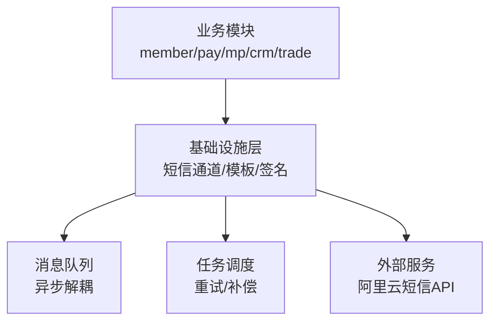
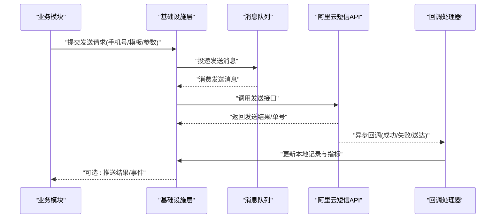
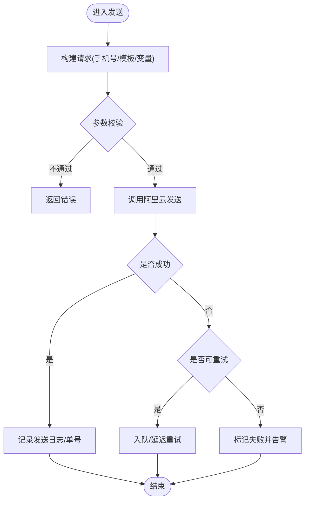
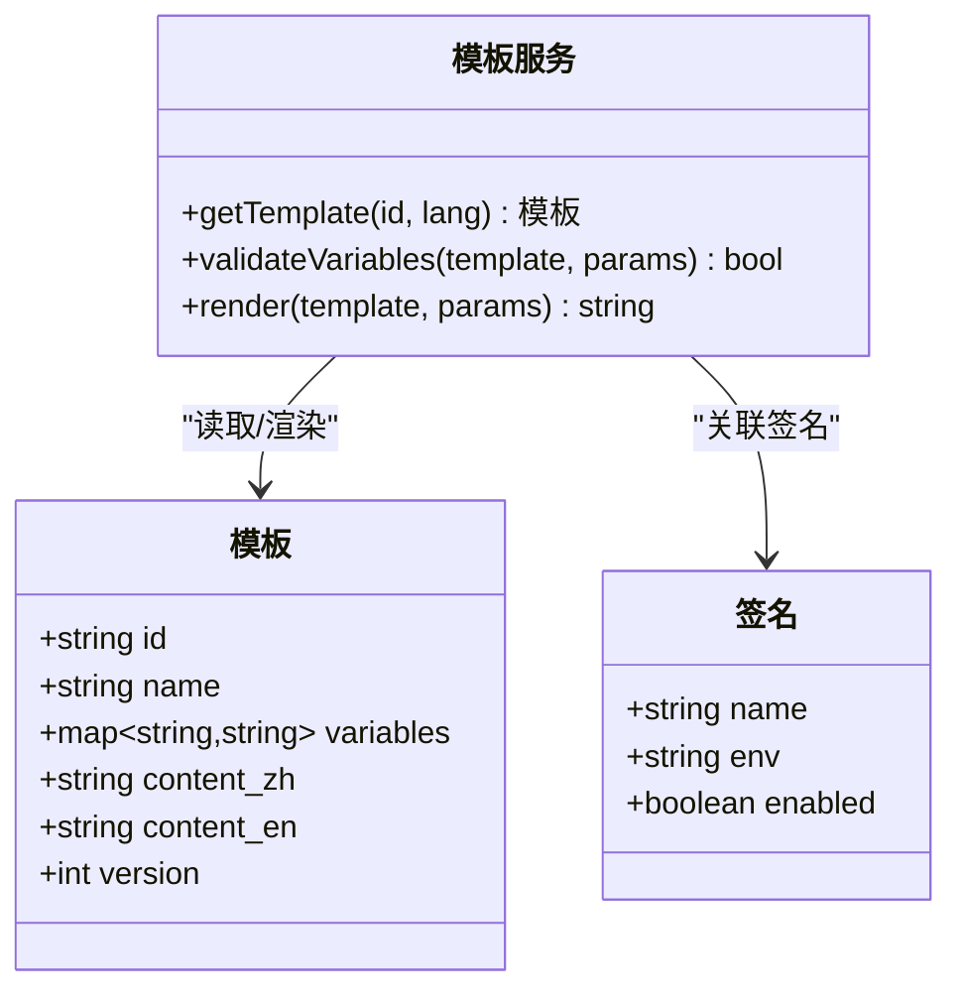
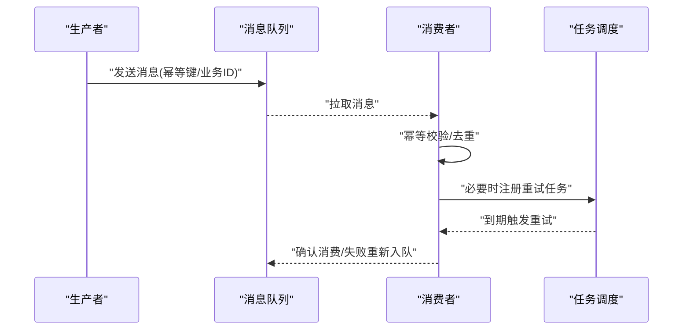
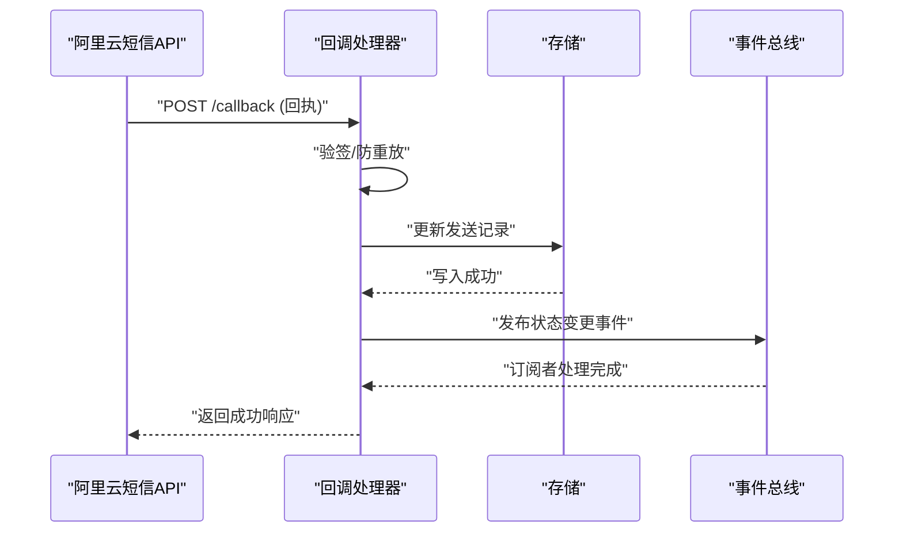
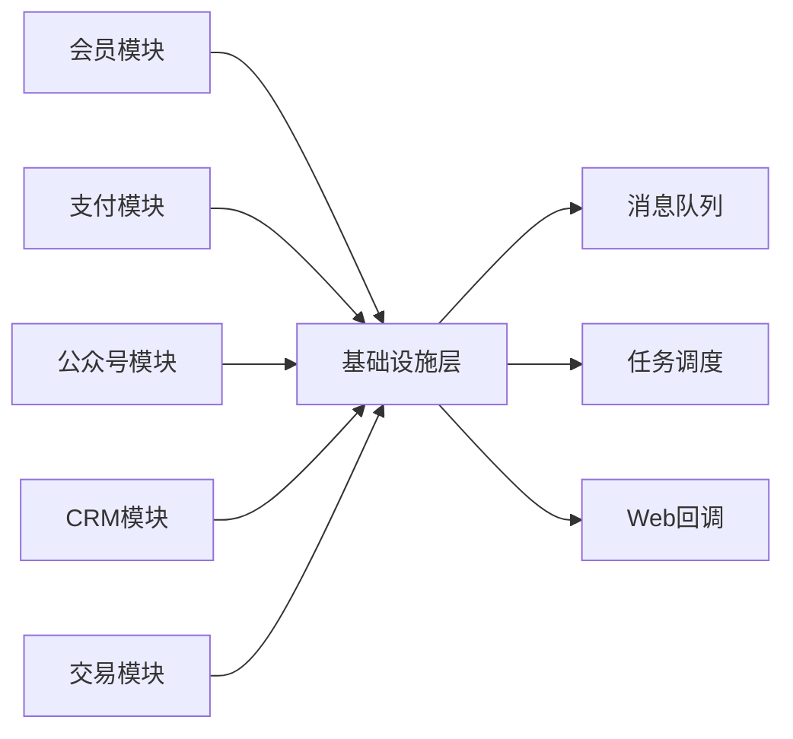

# 短信服务集成

<cite>
**本文引用的文件**
- [yudao-module-infra-server/pom.xml](file://yudao-cloud/yudao-module-infra/yudao-module-infra-server/pom.xml)
- [yudao-module-system-server/pom.xml](file://yudao-cloud/yudao-module-system/yudao-module-system-server/pom.xml)
- [yudao-framework/yudao-spring-boot-starter-mq/pom.xml](file://yudao-cloud/yudao-framework/yudao-spring-boot-starter-mq/pom.xml)
- [yudao-framework/yudao-spring-boot-starter-job/pom.xml](file://yudao-cloud/yudao-framework/yudao-spring-boot-starter-job/pom.xml)
- [yudao-framework/yudao-spring-boot-starter-web/pom.xml](file://yudao-cloud/yudao-framework/yudao-spring-boot-starter-web/pom.xml)
- [yudao-module-member-server/pom.xml](file://yudao-cloud/yudao-module-member/yudao-module-member-server/pom.xml)
- [yudao-module-pay-server/pom.xml](file://yudao-cloud/yudao-module-pay/yudao-module-pay-server/pom.xml)
- [yudao-module-mp-server/pom.xml](file://yudao-cloud/yudao-module-mp/yudao-module-mp-server/pom.xml)
- [yudao-module-crm-server/pom.xml](file://yudao-cloud/yudao-module-crm/yudao-module-crm-server/pom.xml)
- [yudao-module-trade-server/pom.xml](file://yudao-cloud/yudao-module-mall/yudao-module-trade/yudao-module-trade-server/pom.xml)
</cite>

## 目录
1. [简介](#简介)
2. [项目结构](#项目结构)
3. [核心组件](#核心组件)
4. [架构总览](#架构总览)
5. [详细组件分析](#详细组件分析)
6. [依赖分析](#依赖分析)
7. [性能考虑](#性能考虑)
8. [故障排查指南](#故障排查指南)
9. [结论](#结论)
10. [附录](#附录)

## 简介
本文件面向在该项目中集成阿里云短信服务的开发者，提供从配置到发送、回调处理与运维优化的完整实践指南。文档基于仓库中的模块结构与依赖关系，梳理出短信能力在系统中的位置与调用链路，并给出可落地的实现建议与最佳实践。

## 项目结构
本项目采用多模块微服务架构，短信相关能力通常由基础设施层或业务模块共同协作完成：
- 基础设施层（infra）：负责第三方通道接入、消息队列、任务调度等通用能力。
- 系统层（system）：提供租户、字典、模板管理等基础能力，可用于短信模板与签名管理。
- 业务模块（member/pay/mp/crm/trade 等）：作为短信的调用方，触发验证码、支付通知、营销触达等场景。
- 框架启动器（starter）：提供 Web、MQ、Job 等能力，支撑异步化与可靠性保障。

图表来源
- [yudao-module-infra-server/pom.xml](file://yudao-cloud/yudao-module-infra/yudao-module-infra-server/pom.xml)
- [yudao-framework/yudao-spring-boot-starter-mq/pom.xml](file://yudao-cloud/yudao-framework/yudao-spring-boot-starter-mq/pom.xml)
- [yudao-framework/yudao-spring-boot-starter-job/pom.xml](file://yudao-cloud/yudao-framework/yudao-spring-boot-starter-job/pom.xml)

章节来源
- [yudao-module-infra-server/pom.xml](file://yudao-cloud/yudao-module-infra/yudao-module-infra-server/pom.xml)
- [yudao-module-system-server/pom.xml](file://yudao-cloud/yudao-module-system/yudao-module-system-server/pom.xml)
- [yudao-framework/yudao-spring-boot-starter-mq/pom.xml](file://yudao-cloud/yudao-framework/yudao-spring-boot-starter-mq/pom.xml)
- [yudao-framework/yudao-spring-boot-starter-job/pom.xml](file://yudao-cloud/yudao-framework/yudao-spring-boot-starter-job/pom.xml)

## 核心组件
- 短信通道适配层：封装阿里云短信SDK，统一对外暴露发送接口，屏蔽厂商差异。
- 模板与签名管理：集中维护模板ID、变量规则、签名名称，支持多租户与国际化。
- 消息队列与任务调度：将发送请求入队，结合定时任务实现失败重试与状态回写。
- 回调处理器：接收并解析阿里云返回的发送状态，更新本地记录并触发下游事件。
- 业务调用点：各业务模块通过统一接口发起短信发送，如验证码、通知、营销。

章节来源
- [yudao-module-infra-server/pom.xml](file://yudao-cloud/yudao-module-infra/yudao-module-infra-server/pom.xml)
- [yudao-module-system-server/pom.xml](file://yudao-cloud/yudao-module-system/yudao-module-system-server/pom.xml)
- [yudao-framework/yudao-spring-boot-starter-mq/pom.xml](file://yudao-cloud/yudao-framework/yudao-spring-boot-starter-mq/pom.xml)
- [yudao-framework/yudao-spring-boot-starter-job/pom.xml](file://yudao-cloud/yudao-framework/yudao-spring-boot-starter-job/pom.xml)

## 架构总览
下图展示一次短信发送的典型流程：业务模块发起请求，经基础设施层构建消息并投递至队列；消费者拉取后调用阿里云短信API；最终回调处理器根据回执更新状态并通知业务。

图表来源
- [yudao-module-infra-server/pom.xml](file://yudao-cloud/yudao-module-infra/yudao-module-infra-server/pom.xml)
- [yudao-framework/yudao-spring-boot-starter-mq/pom.xml](file://yudao-cloud/yudao-framework/yudao-spring-boot-starter-mq/pom.xml)
- [yudao-framework/yudao-spring-boot-starter-job/pom.xml](file://yudao-cloud/yudao-framework/yudao-spring-boot-starter-job/pom.xml)

## 详细组件分析

### 短信通道适配层
- 职责：封装阿里云短信SDK，统一配置AccessKey、签名、模板ID，并提供发送、查询、回调处理等能力。
- 关键点：
  - AccessKey与密钥管理：通过配置中心或环境变量注入，避免硬编码。
  - 签名与模板：按租户/环境隔离，支持多模板与变量替换。
  - 错误码映射：将阿里云错误码映射为内部异常类型，便于上层统一处理。
  - 限流与熔断：对上游进行速率控制，防止触发平台限流。

图表来源
- [yudao-module-infra-server/pom.xml](file://yudao-cloud/yudao-module-infra/yudao-module-infra-server/pom.xml)

章节来源
- [yudao-module-infra-server/pom.xml](file://yudao-cloud/yudao-module-infra/yudao-module-infra-server/pom.xml)

### 模板与签名管理
- 模板管理：
  - 模板ID与变量：集中维护，支持版本化与灰度发布。
  - 变量替换：在发送前进行占位符替换与校验，确保必填项齐全。
  - 国际化：按语言维度维护模板内容，发送时根据用户偏好选择。
- 签名管理：
  - 签名名称与环境隔离：不同环境使用不同签名，避免混用。
  - 合规检查：对敏感词与长度进行预检，降低拒审率。

图表来源
- [yudao-module-system-server/pom.xml](file://yudao-cloud/yudao-module-system/yudao-module-system-server/pom.xml)

章节来源
- [yudao-module-system-server/pom.xml](file://yudao-cloud/yudao-module-system/yudao-module-system-server/pom.xml)

### 消息队列与任务调度
- 消息队列：
  - 发送请求入队：将发送任务持久化，保证至少一次投递。
  - 消费者幂等：基于唯一键去重，避免重复发送。
- 任务调度：
  - 失败重试：按指数退避策略重试，设置最大次数与超时。
  - 死信处理：超过重试上限的消息进入死信队列，人工介入或二次补偿。

图表来源
- [yudao-framework/yudao-spring-boot-starter-mq/pom.xml](file://yudao-cloud/yudao-framework/yudao-spring-boot-starter-mq/pom.xml)
- [yudao-framework/yudao-spring-boot-starter-job/pom.xml](file://yudao-cloud/yudao-framework/yudao-spring-boot-starter-job/pom.xml)

章节来源
- [yudao-framework/yudao-spring-boot-starter-mq/pom.xml](file://yudao-cloud/yudao-framework/yudao-spring-boot-starter-mq/pom.xml)
- [yudao-framework/yudao-spring-boot-starter-job/pom.xml](file://yudao-cloud/yudao-framework/yudao-spring-boot-starter-job/pom.xml)

### 回调处理器
- 回调入口：接收阿里云发送状态回调，解析回执数据。
- 状态更新：根据回执更新本地发送记录（成功/失败/送达）。
- 事件通知：触发下游事件（如会员积分、订单状态变更）。
- 异常处理：对非法回调、签名校验失败等情况进行拦截与告警。

图表来源
- [yudao-framework/yudao-spring-boot-starter-web/pom.xml](file://yudao-cloud/yudao-framework/yudao-spring-boot-starter-web/pom.xml)

章节来源
- [yudao-framework/yudao-spring-boot-starter-web/pom.xml](file://yudao-cloud/yudao-framework/yudao-spring-boot-starter-web/pom.xml)

### 业务场景示例
- 验证码短信：
  - 触发点：登录、注册、重置密码。
  - 要点：频率限制、有效期校验、防刷。
- 通知短信：
  - 触发点：订单状态、物流通知、审批结果。
  - 要点：模板变量丰富、送达确认。
- 营销短信：
  - 触发点：活动推广、优惠券发放。
  - 要点：合规文案、退订机制、频次控制。

章节来源
- [yudao-module-member-server/pom.xml](file://yudao-cloud/yudao-module-member/yudao-module-member-server/pom.xml)
- [yudao-module-pay-server/pom.xml](file://yudao-cloud/yudao-module-pay/yudao-module-pay-server/pom.xml)
- [yudao-module-mp-server/pom.xml](file://yudao-cloud/yudao-module-mp/yudao-module-mp-server/pom.xml)
- [yudao-module-crm-server/pom.xml](file://yudao-cloud/yudao-module-crm/yudao-module-crm-server/pom.xml)
- [yudao-module-trade-server/pom.xml](file://yudao-cloud/yudao-module-mall/yudao-module-trade/yudao-module-trade-server/pom.xml)

## 依赖分析
短信能力依赖以下框架与模块：
- 基础设施层：提供通道适配与模板/签名管理能力。
- 框架启动器：Web用于回调入口，MQ用于异步解耦，Job用于重试与补偿。
- 业务模块：作为调用方，定义发送时机与业务语义。

图表来源
- [yudao-module-infra-server/pom.xml](file://yudao-cloud/yudao-module-infra/yudao-module-infra-server/pom.xml)
- [yudao-framework/yudao-spring-boot-starter-mq/pom.xml](file://yudao-cloud/yudao-framework/yudao-spring-boot-starter-mq/pom.xml)
- [yudao-framework/yudao-spring-boot-starter-job/pom.xml](file://yudao-cloud/yudao-framework/yudao-spring-boot-starter-job/pom.xml)
- [yudao-framework/yudao-spring-boot-starter-web/pom.xml](file://yudao-cloud/yudao-framework/yudao-spring-boot-starter-web/pom.xml)
- [yudao-module-member-server/pom.xml](file://yudao-cloud/yudao-module-member/yudao-module-member-server/pom.xml)
- [yudao-module-pay-server/pom.xml](file://yudao-cloud/yudao-module-pay/yudao-module-pay-server/pom.xml)
- [yudao-module-mp-server/pom.xml](file://yudao-cloud/yudao-module-mp/yudao-module-mp-server/pom.xml)
- [yudao-module-crm-server/pom.xml](file://yudao-cloud/yudao-module-crm/yudao-module-crm-server/pom.xml)
- [yudao-module-trade-server/pom.xml](file://yudao-cloud/yudao-module-mall/yudao-module-trade/yudao-module-trade-server/pom.xml)

章节来源
- [yudao-module-infra-server/pom.xml](file://yudao-cloud/yudao-module-infra/yudao-module-infra-server/pom.xml)
- [yudao-framework/yudao-spring-boot-starter-mq/pom.xml](file://yudao-cloud/yudao-framework/yudao-spring-boot-starter-mq/pom.xml)
- [yudao-framework/yudao-spring-boot-starter-job/pom.xml](file://yudao-cloud/yudao-framework/yudao-spring-boot-starter-job/pom.xml)
- [yudao-framework/yudao-spring-boot-starter-web/pom.xml](file://yudao-cloud/yudao-framework/yudao-spring-boot-starter-web/pom.xml)
- [yudao-module-member-server/pom.xml](file://yudao-cloud/yudao-module-member/yudao-module-member-server/pom.xml)
- [yudao-module-pay-server/pom.xml](file://yudao-cloud/yudao-module-pay/yudao-module-pay-server/pom.xml)
- [yudao-module-mp-server/pom.xml](file://yudao-cloud/yudao-module-mp/yudao-module-mp-server/pom.xml)
- [yudao-module-crm-server/pom.xml](file://yudao-cloud/yudao-module-crm/yudao-module-crm-server/pom.xml)
- [yudao-module-trade-server/pom.xml](file://yudao-cloud/yudao-module-mall/yudao-module-trade/yudao-module-trade-server/pom.xml)

## 性能考虑
- 并发与吞吐：
  - 使用线程池与批量发送提升吞吐，注意与上游限流的平衡。
  - 合理设置连接池大小与超时时间，避免资源耗尽。
- 缓存与预热：
  - 模板与签名信息缓存，减少远程获取开销。
  - 热点号码与黑名单缓存，快速拒绝无效请求。
- 降级与熔断：
  - 当上游不可用时，启用降级策略（如延迟发送或转其他通道）。
  - 监控关键指标（成功率、延迟、错误码分布），及时告警。
- 幂等与去重：
  - 基于业务ID与时间窗口的去重，避免重复发送。
  - 消费者侧幂等处理，确保多次投递不影响结果。

[本节为通用性能指导，无需特定文件引用]

## 故障排查指南
- 常见问题定位：
  - 配置问题：AccessKey、签名、模板ID是否正确且与环境匹配。
  - 参数问题：手机号格式、模板变量缺失或超长。
  - 限流问题：触发平台限流，需调整频率或申请配额。
  - 回调问题：验签失败、重复回调、网络超时。
- 排查步骤：
  - 查看发送日志与回执，确认单号与错误码。
  - 检查队列堆积与消费者健康状态。
  - 核对模板内容与变量映射，验证渲染结果。
  - 复现最小用例，逐步缩小问题范围。
- 恢复策略：
  - 临时切换备用通道或降级策略。
  - 清理死信队列，人工补偿失败消息。
  - 修复配置后，回放历史失败任务。

章节来源
- [yudao-module-infra-server/pom.xml](file://yudao-cloud/yudao-module-infra/yudao-module-infra-server/pom.xml)
- [yudao-framework/yudao-spring-boot-starter-mq/pom.xml](file://yudao-cloud/yudao-framework/yudao-spring-boot-starter-mq/pom.xml)
- [yudao-framework/yudao-spring-boot-starter-job/pom.xml](file://yudao-cloud/yudao-framework/yudao-spring-boot-starter-job/pom.xml)
- [yudao-framework/yudao-spring-boot-starter-web/pom.xml](file://yudao-cloud/yudao-framework/yudao-spring-boot-starter-web/pom.xml)

## 结论
通过在基础设施层统一封装阿里云短信SDK，并结合消息队列与任务调度，可在项目中构建高可靠、可扩展的短信服务能力。配合完善的模板与签名管理、回调处理与监控告警，能够覆盖验证码、通知、营销等多类场景，满足生产环境的稳定性与性能要求。

[本节为总结性内容，无需特定文件引用]

## 附录
- 配置清单建议：
  - AccessKey/Secret：通过配置中心或环境变量注入。
  - 签名名称：按环境隔离，避免误用。
  - 模板ID与变量：集中维护，支持版本化与灰度。
  - 队列与任务：合理设置分区、重试次数与超时。
- 安全与合规：
  - 敏感信息加密存储与传输。
  - 文案合规审查，避免违规内容。
  - 用户退订与频次控制，符合监管要求。

[本节为补充说明，无需特定文件引用]