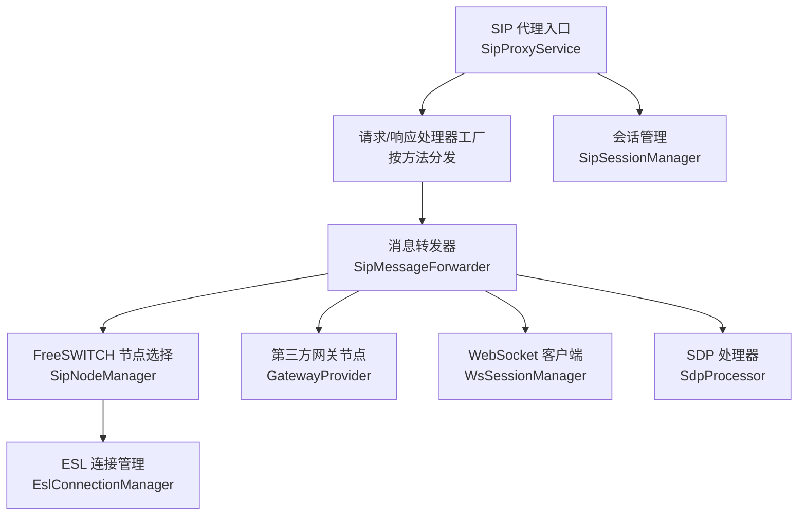
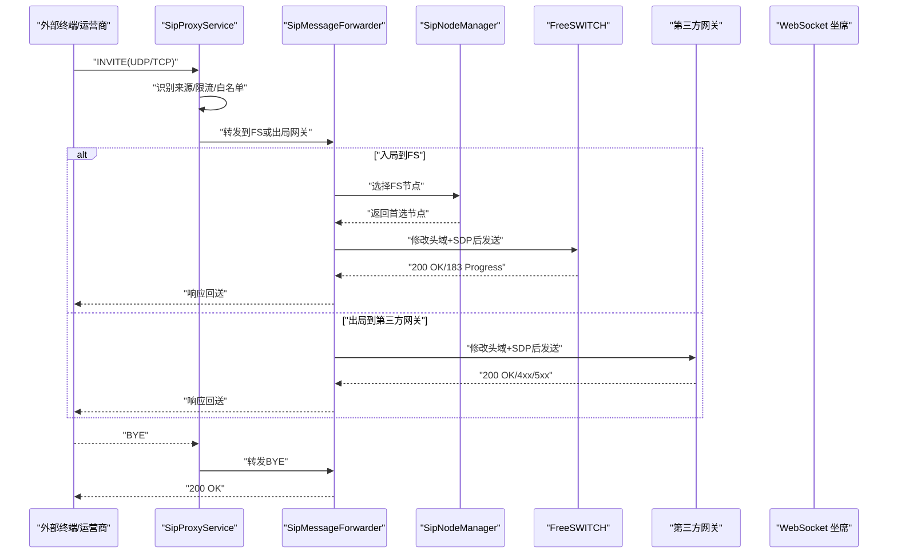
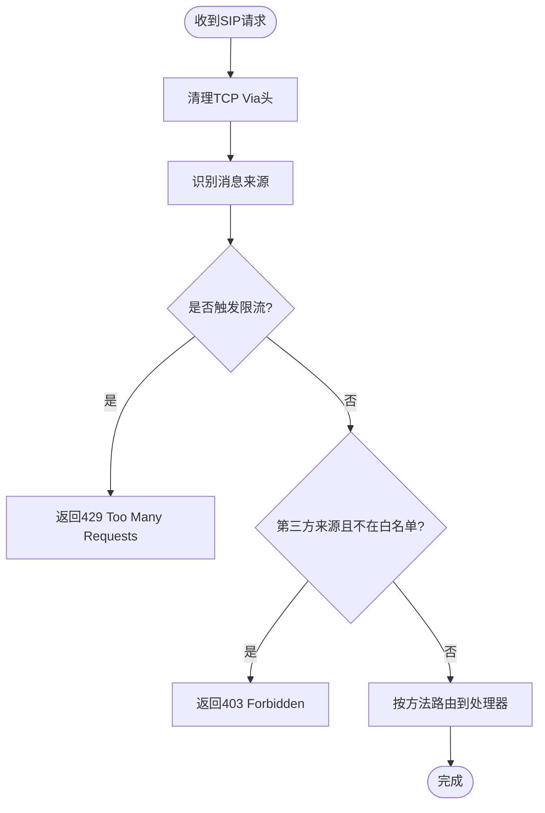
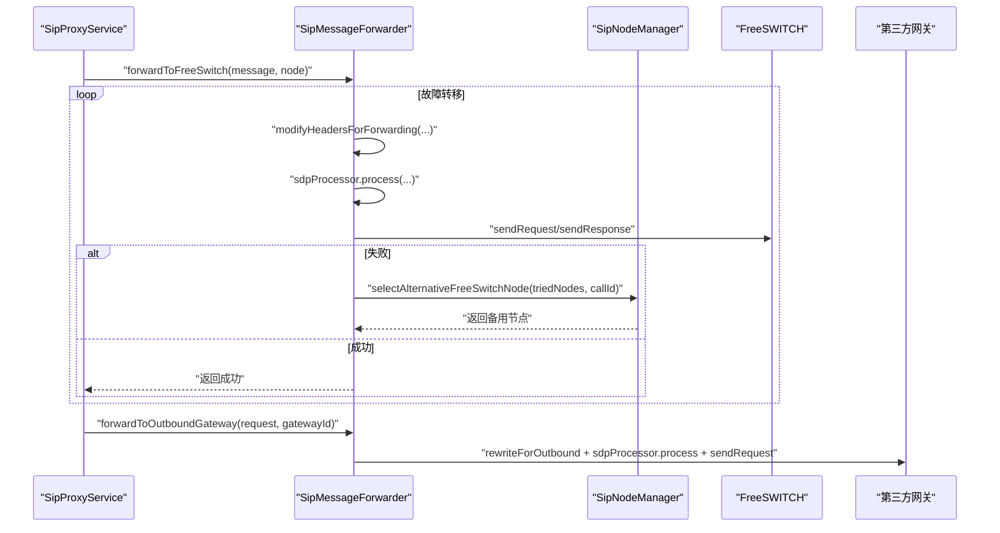
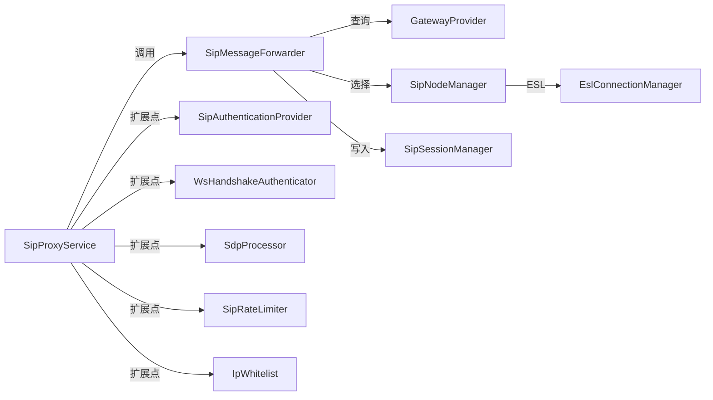

# 第三方网关集成

<cite>
**本文引用的文件**
- [README.md](file://yudao-cloud/yudao-module-cc/ipcc-sipproxy/README.md)
- [SipProxyService.java](file://yudao-cloud/yudao-module-cc/ipcc-sipproxy/src/main/java/cn/ipcc/sipproxy/core/SipProxyService.java)
- [SipMessageForwarder.java](file://yudao-cloud/yudao-module-cc/ipcc-sipproxy/src/main/java/cn/ipcc/sipproxy/core/forwarder/SipMessageForwarder.java)
- [DefaultGatewayProvider.java](file://yudao-cloud/yudao-module-cc/ipcc-sipproxy/src/main/java/cn/ipcc/sipproxy/defaults/gateway/DefaultGatewayProvider.java)
- [EslConnectionManager.java](file://yudao-cloud/yudao-module-cc/ipcc-fs-esl/src/main/java/cn/ipcc/fs/esl/EslConnectionManager.java)
- [README.md](file://yudao-cloud/yudao-module-cc/ipcc-fs-esl/README.md)
</cite>

## 目录
1. [简介](#简介)
2. [项目结构](#项目结构)
3. [核心组件](#核心组件)
4. [架构总览](#架构总览)
5. [详细组件分析](#详细组件分析)
6. [依赖关系分析](#依赖关系分析)
7. [性能与容量规划](#性能与容量规划)
8. [监控与告警](#监控与告警)
9. [故障排查指南](#故障排查指南)
10. [结论](#结论)
11. [附录：配置示例与最佳实践](#附录：配置示例与最佳实践)

## 简介
本文件面向“第三方网关集成”的运维与实施人员，围绕 SIP Trunk 对接、SIP 信令处理、媒体流协商、多网关负载均衡与故障转移、呼叫路由策略、监控告警与排障调优进行系统化说明。文档基于仓库中的 SIP 代理模块（B2BUA）与 FreeSWITCH ESL 客户端库的实际实现，给出可操作的流程、图示与参考路径，帮助快速落地并稳定运行。

## 项目结构
本项目中与第三方网关集成相关的核心由两部分组成：
- SIP 代理服务（B2BUA）：负责 SIP 接入、会话管理、消息转发、SDP 处理、认证鉴权、集群广播等。
- FreeSWITCH ESL 客户端：负责与 FS 建立高可靠连接、事件路由、分布式监听权协调与指标采集。

图表来源
- [SipProxyService.java:112-185](file://yudao-cloud/yudao-module-cc/ipcc-sipproxy/src/main/java/cn/ipcc/sipproxy/core/SipProxyService.java#L112-L185)
- [SipMessageForwarder.java:102-155](file://yudao-cloud/yudao-module-cc/ipcc-sipproxy/src/main/java/cn/ipcc/sipproxy/core/forwarder/SipMessageForwarder.java#L102-L155)
- [EslConnectionManager.java:47-139](file://yudao-cloud/yudao-module-cc/ipcc-fs-esl/src/main/java/cn/ipcc/fs/esl/EslConnectionManager.java#L47-L139)

章节来源
- [README.md:72-127](file://yudao-cloud/yudao-module-cc/ipcc-sipproxy/README.md#L72-L127)
- [README.md:50-98](file://yudao-cloud/yudao-module-cc/ipcc-fs-esl/README.md#L50-L98)

## 核心组件
- SIP 代理主服务：初始化 JAIN-SIP 协议栈、统一入口处理 UDP/TCP/WSS 消息、事务生命周期回调。
- 消息转发器：将 INVITE/BYE/OPTIONS/REGISTER 等消息转发到 FS、第三方网关或 WebSocket 客户端；支持头域改写、SDP 处理、故障转移。
- 网关提供者：查询启用的第三方网关信息，支持默认 H2 seed 数据表回退。
- ESL 连接管理器：维护多个 FS 节点连接、自动重连、健康检查、随机选择可用节点、批量命令发送。
- 会话管理：以 Call-ID 为键维护 SessionInfo，记录 FS 节点、第三方节点、传输协议、WS 端 Contact 等上下文。

章节来源
- [SipProxyService.java:37-116](file://yudao-cloud/yudao-module-cc/ipcc-sipproxy/src/main/java/cn/ipcc/sipproxy/core/SipProxyService.java#L37-L116)
- [SipMessageForwarder.java:41-87](file://yudao-cloud/yudao-module-cc/ipcc-sipproxy/src/main/java/cn/ipcc/sipproxy/core/forwarder/SipMessageForwarder.java#L41-L87)
- [DefaultGatewayProvider.java:14-32](file://yudao-cloud/yudao-module-cc/ipcc-sipproxy/src/main/java/cn/ipcc/sipproxy/defaults/gateway/DefaultGatewayProvider.java#L14-L32)
- [EslConnectionManager.java:19-45](file://yudao-cloud/yudao-module-cc/ipcc-fs-esl/src/main/java/cn/ipcc/fs/esl/EslConnectionManager.java#L19-L45)

## 架构总览
SIP 代理采用五层架构：入口层 → 工厂层 → 处理器层 → 转发层 → 节点/会话管理层，辅以 WebSocket 接入、集群广播与扩展点 API。FS 侧通过 ESL 客户端提供事件驱动与异步控制能力。

图表来源
- [SipProxyService.java:344-387](file://yudao-cloud/yudao-module-cc/ipcc-sipproxy/src/main/java/cn/ipcc/sipproxy/core/SipProxyService.java#L344-L387)
- [SipMessageForwarder.java:102-155](file://yudao-cloud/yudao-module-cc/ipcc-sipproxy/src/main/java/cn/ipcc/sipproxy/core/forwarder/SipMessageForwarder.java#L102-L155)
- [SipMessageForwarder.java:203-240](file://yudao-cloud/yudao-module-cc/ipcc-sipproxy/src/main/java/cn/ipcc/sipproxy/core/forwarder/SipMessageForwarder.java#L203-L240)

## 详细组件分析

### SIP 代理主服务（SipProxyService）
- 职责：启动 JAIN-SIP 协议栈（UDP/TCP），注册 SipListener；处理 WebSocket 传入的 SIP 文本；按方法分发到处理器；处理超时、IO异常、事务终止、对话终止等事件。
- 关键点：
  - 禁用自动对话框管理，适配 B2BUA 场景。
  - 统一入口 processRequest/processResponse 中执行来源识别、限流、白名单校验与方法路由。
  - 清理 TCP Via 头，避免 NAT 参数影响路由。
  - WebSocket 会话关闭时清理注册映射。

图表来源
- [SipProxyService.java:214-256](file://yudao-cloud/yudao-module-cc/ipcc-sipproxy/src/main/java/cn/ipcc/sipproxy/core/SipProxyService.java#L214-L256)
- [SipProxyService.java:344-387](file://yudao-cloud/yudao-module-cc/ipcc-sipproxy/src/main/java/cn/ipcc/sipproxy/core/SipProxyService.java#L344-L387)

章节来源
- [SipProxyService.java:112-185](file://yudao-cloud/yudao-module-cc/ipcc-sipproxy/src/main/java/cn/ipcc/sipproxy/core/SipProxyService.java#L112-L185)
- [SipProxyService.java:344-496](file://yudao-cloud/yudao-module-cc/ipcc-sipproxy/src/main/java/cn/ipcc/sipproxy/core/SipProxyService.java#L344-L496)

### 消息转发器（SipMessageForwarder）
- 职责：统一转发到 FS、第三方网关或 WebSocket 客户端；修改 Contact/Via/Request-URI；处理 SDP（ICE 候选替换、编解码过滤等）；支持 FS 故障转移。
- 关键点：
  - 转发到 FS：优先使用首选节点，失败则循环尝试备用节点，直到成功或耗尽。
  - 转发到第三方网关：根据 SessionInfo 选择 UDP/TCP，必要时进行 407 鉴权重发。
  - 转发到 WebSocket：修正 Request-URI 与 Contact，替换 SDP 中的媒体地址为公网 IP，确保 ICE/DTLS-SRTP 握手成功。
  - 头域改写：统一替换 Contact/Via，保留分支号，设置 rPort。

图表来源
- [SipMessageForwarder.java:102-155](file://yudao-cloud/yudao-module-cc/ipcc-sipproxy/src/main/java/cn/ipcc/sipproxy/core/forwarder/SipMessageForwarder.java#L102-L155)
- [SipMessageForwarder.java:203-240](file://yudao-cloud/yudao-module-cc/ipcc-sipproxy/src/main/java/cn/ipcc/sipproxy/core/forwarder/SipMessageForwarder.java#L203-L240)
- [SipMessageForwarder.java:558-629](file://yudao-cloud/yudao-module-cc/ipcc-sipproxy/src/main/java/cn/ipcc/sipproxy/core/forwarder/SipMessageForwarder.java#L558-L629)

章节来源
- [SipMessageForwarder.java:262-358](file://yudao-cloud/yudao-module-cc/ipcc-sipproxy/src/main/java/cn/ipcc/sipproxy/core/forwarder/SipMessageForwarder.java#L262-L358)
- [SipMessageForwarder.java:391-550](file://yudao-cloud/yudao-module-cc/ipcc-sipproxy/src/main/java/cn/ipcc/sipproxy/core/forwarder/SipMessageForwarder.java#L391-L550)

### 网关提供者（DefaultGatewayProvider）
- 职责：查询启用状态的第三方网关信息，支持按 ID 或 address:port 查询；当父程序未提供数据源时降级为空结果，保证 sipproxy 不中断。
- 关键点：
  - 默认实现读取内置 H2 seed 表 sip_gateway，status=0 表示启用。
  - 字段映射兼容 BIGINT→String 及可空整数字段。

章节来源
- [DefaultGatewayProvider.java:14-32](file://yudao-cloud/yudao-module-cc/ipcc-sipproxy/src/main/java/cn/ipcc/sipproxy/defaults/gateway/DefaultGatewayProvider.java#L14-L32)
- [DefaultGatewayProvider.java:44-111](file://yudao-cloud/yudao-module-cc/ipcc-sipproxy/src/main/java/cn/ipcc/sipproxy/defaults/gateway/DefaultGatewayProvider.java#L44-L111)
- [DefaultGatewayProvider.java:126-145](file://yudao-cloud/yudao-module-cc/ipcc-sipproxy/src/main/java/cn/ipcc/sipproxy/defaults/gateway/DefaultGatewayProvider.java#L126-L145)

### ESL 连接管理器（EslConnectionManager）
- 职责：管理多个 FS 节点连接、自动重连、健康检查、随机选择可用节点、批量 bgapi 命令发送、优雅关闭。
- 关键点：
  - 对账式同步节点列表，动态增删节点。
  - 向所有节点广播 bgapi，或向指定节点发送同步/异步命令。
  - 健康检查失败阈值触发重连，指数退避。

章节来源
- [EslConnectionManager.java:47-139](file://yudao-cloud/yudao-module-cc/ipcc-fs-esl/src/main/java/cn/ipcc/fs/esl/EslConnectionManager.java#L47-L139)
- [EslConnectionManager.java:141-205](file://yudao-cloud/yudao-module-cc/ipcc-fs-esl/src/main/java/cn/ipcc/fs/esl/EslConnectionManager.java#L141-L205)
- [README.md:153-179](file://yudao-cloud/yudao-module-cc/ipcc-fs-esl/README.md#L153-L179)

## 依赖关系分析
- 松耦合设计：sipproxy 通过 13 个扩展点接口与父程序解耦，默认实现保证独立可运行。
- 关键依赖：
  - JAIN-SIP 协议栈用于 SIP 收发。
  - Redis 用于会话与注册信息缓存（TTL 控制）。
  - 可选消息中间件（Redis/Kafka/RabbitMQ/RocketMQ）用于集群广播。
  - FreeSWITCH ESL 客户端用于事件驱动与异步控制。

图表来源
- [README.md:201-218](file://yudao-cloud/yudao-module-cc/ipcc-sipproxy/README.md#L201-L218)
- [EslConnectionManager.java:19-45](file://yudao-cloud/yudao-module-cc/ipcc-fs-esl/src/main/java/cn/ipcc/fs/esl/EslConnectionManager.java#L19-L45)

章节来源
- [README.md:201-218](file://yudao-cloud/yudao-module-cc/ipcc-sipproxy/README.md#L201-L218)
- [README.md:153-179](file://yudao-cloud/yudao-module-cc/ipcc-fs-esl/README.md#L153-L179)

## 性能与容量规划
- 并发与线程：
  - Netty worker 线程数、事件线程池大小与队列容量需结合峰值 QPS 调整。
  - 事件执行策略 CHANNEL_HASH 保证同通道事件顺序，适合高吞吐场景。
- 连接与健康：
  - 健康检查间隔与失败阈值决定故障发现速度；指数退避避免雪崩。
  - 最大帧大小与头部行数限制防止 OOM 与放大攻击。
- 会话与缓存：
  - 会话 TTL 与注册 TTL 需匹配业务通话时长与注册周期，避免过早清理。
  - 集群广播类型（local/redis/mq）根据部署规模选择。

章节来源
- [README.md:153-179](file://yudao-cloud/yudao-module-cc/ipcc-fs-esl/README.md#L153-L179)
- [README.md:183-199](file://yudao-cloud/yudao-module-cc/ipcc-sipproxy/README.md#L183-L199)

## 监控与告警
- 指标采集：
  - ESL 连接、命令、事件、线程池四类指标，默认实现基于 LongAdder，可替换为 Micrometer。
  - SIP 代理日志覆盖请求/响应、转发、错误、超时、事务终止等关键路径。
- 告警建议：
  - 连接断开/重连频繁、健康检查连续失败、转发失败率上升、会话创建失败、407 鉴权失败次数突增。
  - 针对 WebSocket 僵尸会话清理与空闲超时，监控清理频率与残留会话数量。

章节来源
- [README.md:47-48](file://yudao-cloud/yudao-module-cc/ipcc-fs-esl/README.md#L47-L48)
- [README.md:249-258](file://yudao-cloud/yudao-module-cc/ipcc-fs-esl/README.md#L249-L258)
- [SipProxyService.java:441-496](file://yudao-cloud/yudao-module-cc/ipcc-sipproxy/src/main/java/cn/ipcc/sipproxy/core/SipProxyService.java#L441-L496)

## 故障排查指南
- 常见问题定位：
  - 无法注册/失联：检查 WebSocket 握手 token、心跳空闲超时、僵尸会话清理策略。
  - 呼叫不通：核对 Contact/Via/Request-URI 改写是否正确；确认 SDP 中媒体地址已替换为公网 IP；检查 ICE 候选完整性。
  - 第三方网关鉴权失败：关注 407 Proxy Authentication Required 的重发逻辑与凭据配置。
  - FS 不可用：查看 ESL 连接状态、健康检查失败阈值、重连策略与节点选择。
- 排查步骤建议：
  - 从入口日志开始，追踪 processRequest → 来源识别 → 限流/白名单 → 处理器 → 转发器 → 目标节点。
  - 在转发器中检查 modifyHeadersForForwarding 与 sdpProcessor 的处理结果。
  - 在 ESL 侧检查连接事件、命令响应与 BACKGROUND_JOB 事件。

章节来源
- [SipProxyService.java:344-387](file://yudao-cloud/yudao-module-cc/ipcc-sipproxy/src/main/java/cn/ipcc/sipproxy/core/SipProxyService.java#L344-L387)
- [SipMessageForwarder.java:262-358](file://yudao-cloud/yudao-module-cc/ipcc-sipproxy/src/main/java/cn/ipcc/sipproxy/core/forwarder/SipMessageForwarder.java#L262-L358)
- [SipMessageForwarder.java:391-550](file://yudao-cloud/yudao-module-cc/ipcc-sipproxy/src/main/java/cn/ipcc/sipproxy/core/forwarder/SipMessageForwarder.java#L391-L550)
- [EslConnectionManager.java:47-139](file://yudao-cloud/yudao-module-cc/ipcc-fs-esl/src/main/java/cn/ipcc/fs/esl/EslConnectionManager.java#L47-L139)

## 结论
该方案通过 B2BUA 的 SIP 代理与 ESL 客户端组合，实现了高可用的第三方网关集成能力：统一的信令接入与转发、灵活的 SDP 处理、健壮的 FS 故障转移与 ESL 连接管理、可扩展的网关查询与鉴权机制。配合合理的监控告警与排障流程，可在多运营商环境下稳定承载呼叫业务。

## 附录：配置示例与最佳实践
- SIP 代理最小配置要点：
  - 启用模块、实例标识、SIP 端口与公网 IP、WebSocket 路径与鉴权、集群广播类型、会话 TTL 与注册 TTL。
- ESL 客户端配置要点：
  - FS 节点列表、分布式协调开关与组名、健康检查间隔与失败阈值、事件线程池与队列容量、重连策略。
- 最佳实践：
  - 使用扩展点覆盖默认实现，将网关查询、鉴权、SDP 处理、限流与白名单纳入企业级管控。
  - 合理设置会话与注册 TTL，避免误杀活跃会话或长期占用资源。
  - 在多运营商场景下，结合 OutboundGatewayRewriter 进行差异化头域改写与号码规则适配。
  - 持续观察指标与日志，及时调优线程池、队列与重连策略，保障高峰期的稳定性。

章节来源
- [README.md:183-199](file://yudao-cloud/yudao-module-cc/ipcc-sipproxy/README.md#L183-L199)
- [README.md:153-179](file://yudao-cloud/yudao-module-cc/ipcc-fs-esl/README.md#L153-L179)
- [README.md:201-218](file://yudao-cloud/yudao-module-cc/ipcc-sipproxy/README.md#L201-L218)