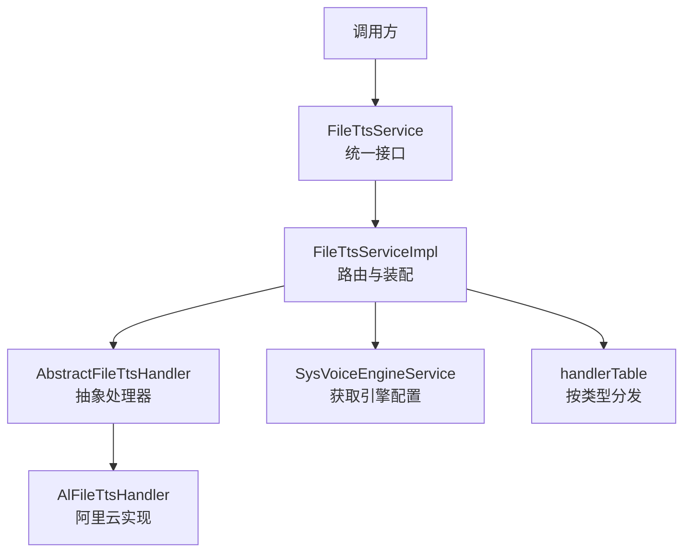
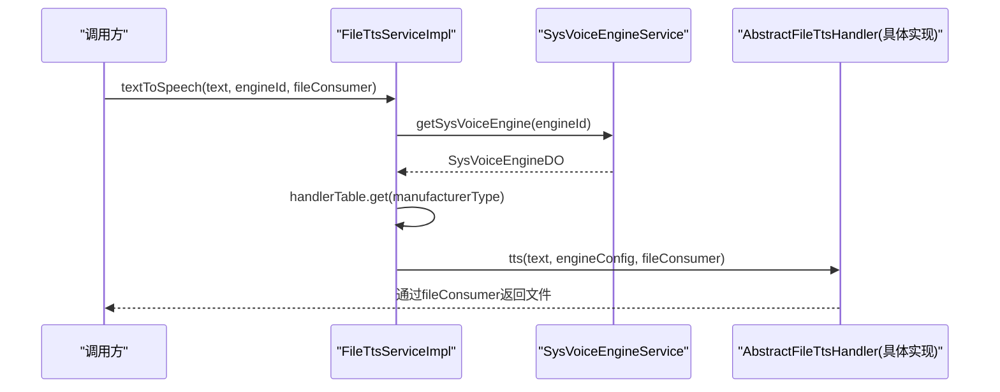
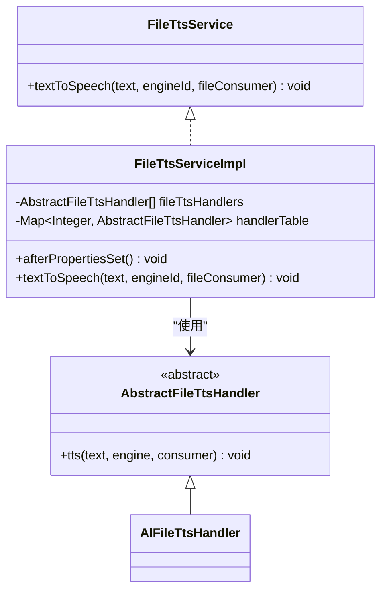
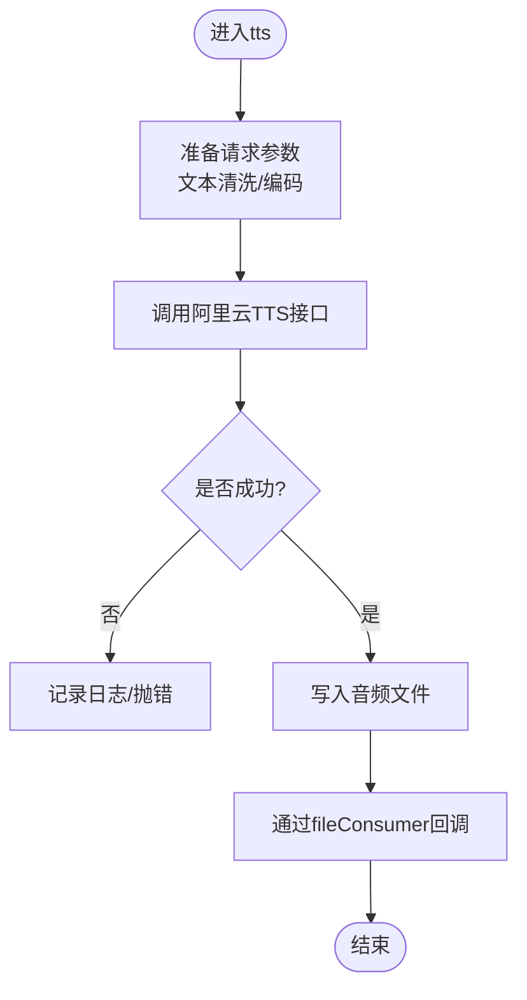
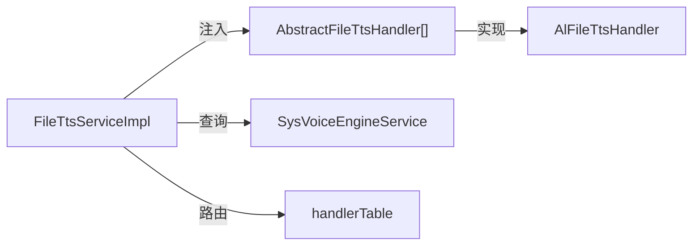

# 语音合成服务集成

<cite>
**本文引用的文件**
- [FileTtsService.java](file://yudao-cloud/yudao-module-cc/yudao-module-cc-server/src/main/java/cn/iocoder/yudao/module/cc/tts/FileTtsService.java)
- [FileTtsServiceImpl.java](file://yudao-cloud/yudao-module-cc/yudao-module-cc-server/src/main/java/cn/iocoder/yudao/module/cc/tts/FileTtsServiceImpl.java)
- [AbstractFileTtsHandler.java](file://yudao-cloud/yudao-module-cc/yudao-module-cc-server/src/main/java/cn/iocoder/yudao/module/cc/tts/handler/AbstractFileTtsHandler.java)
- [AlFileTtsHandler.java](file://yudao-cloud/yudao-module-cc/yudao-module-cc-server/src/main/java/cn/iocoder/yudao/module/cc/tts/handler/AlFileTtsHandler.java)
- [SysVoiceTtsTypeConstants.java](file://yudao-cloud/yudao-module-cc/yudao-module-cc-api/src/main/java/cn/iocoder/yudao/module/cc/enums/SysVoiceTtsTypeConstants.java)
- [SysVoiceTtsTypeEnum.java](file://yudao-cloud/yudao-module-cc/yudao-module-cc-api/src/main/java/cn/iocoder/yudao/module/cc/enums/SysVoiceTtsTypeEnum.java)
- [AudioNameConstant.java](file://yudao-cloud/yudao-module-cc/yudao-module-cc-server/src/main/java/cn/iocoder/yudao/module/cc/esl/constant/AudioNameConstant.java)
</cite>

## 目录
1. [简介](#简介)
2. [项目结构](#项目结构)
3. [核心组件](#核心组件)
4. [架构总览](#架构总览)
5. [详细组件分析](#详细组件分析)
6. [依赖关系分析](#依赖关系分析)
7. [性能与缓存](#性能与缓存)
8. [错误处理与降级](#错误处理与降级)
9. [API调用指南](#api调用指南)
10. [音频格式转换机制](#音频格式转换机制)
11. [故障排查](#故障排查)
12. [结论](#结论)

## 简介
本文件面向语音合成（TTS）服务的集成与使用，聚焦于当前仓库中已实现的“文件型TTS”能力：通过统一的接口将文本转换为音频文件，并支持按引擎类型路由到具体实现。当前工程已内置阿里云TTS的扩展点，并提供可扩展的处理器注册机制，便于后续接入更多厂商（如腾讯云等）。文档同时给出调用流程、参数说明、音频流处理建议、格式转换思路、缓存与并发优化策略以及错误处理与降级方案，帮助快速完成端到端集成。

## 项目结构
TTS相关代码集中在呼叫中心模块（CC）的tts包内，采用“统一接口 + 多处理器”的设计：
- 接口层：定义文本转文件的统一入口
- 实现层：根据引擎类型选择具体处理器
- 处理器层：各厂商的具体实现（示例为阿里云）
- 枚举与常量：用于标识引擎类型与音频名称规范

图表来源
- [FileTtsService.java:1-22](file://yudao-cloud/yudao-module-cc/yudao-module-cc-server/src/main/java/cn/iocoder/yudao/module/cc/tts/FileTtsService.java#L1-L22)
- [FileTtsServiceImpl.java:20-65](file://yudao-cloud/yudao-module-cc/yudao-module-cc-server/src/main/java/cn/iocoder/yudao/module/cc/tts/FileTtsServiceImpl.java#L20-L65)
- [AbstractFileTtsHandler.java](file://yudao-cloud/yudao-module-cc/yudao-module-cc-server/src/main/java/cn/iocoder/yudao/module/cc/tts/handler/AbstractFileTtsHandler.java)
- [AlFileTtsHandler.java](file://yudao-cloud/yudao-module-cc/yudao-module-cc-server/src/main/java/cn/iocoder/yudao/module/cc/tts/handler/AlFileTtsHandler.java)

章节来源
- [FileTtsService.java:1-22](file://yudao-cloud/yudao-module-cc/yudao-module-cc-server/src/main/java/cn/iocoder/yudao/module/cc/tts/FileTtsService.java#L1-L22)
- [FileTtsServiceImpl.java:20-65](file://yudao-cloud/yudao-module-cc/yudao-module-cc-server/src/main/java/cn/iocoder/yudao/module/cc/tts/FileTtsServiceImpl.java#L20-L65)

## 核心组件
- FileTtsService：对外暴露的文本转文件接口，接收文本、引擎ID和文件消费者回调。
- FileTtsServiceImpl：负责加载引擎配置、按制造商类型分派到对应处理器，并在初始化时扫描并注册所有处理器。
- AbstractFileTtsHandler：抽象处理器基类，定义统一的tts方法签名，供具体厂商实现。
- AlFileTtsHandler：阿里云TTS的具体实现（占位或已实现），遵循抽象处理器约定。
- SysVoiceTtsTypeEnum / SysVoiceTtsTypeConstants：引擎类型常量与枚举，用于标识不同TTS厂商。
- AudioNameConstant：音频命名规范常量，用于生成或识别音频文件名。

章节来源
- [FileTtsService.java:1-22](file://yudao-cloud/yudao-module-cc/yudao-module-cc-server/src/main/java/cn/iocoder/yudao/module/cc/tts/FileTtsService.java#L1-L22)
- [FileTtsServiceImpl.java:20-65](file://yudao-cloud/yudao-module-cc/yudao-module-cc-server/src/main/java/cn/iocoder/yudao/module/cc/tts/FileTtsServiceImpl.java#L20-L65)
- [AbstractFileTtsHandler.java](file://yudao-cloud/yudao-module-cc/yudao-module-cc-server/src/main/java/cn/iocoder/yudao/module/cc/tts/handler/AbstractFileTtsHandler.java)
- [AlFileTtsHandler.java](file://yudao-cloud/yudao-module-cc/yudao-module-cc-server/src/main/java/cn/iocoder/yudao/module/cc/tts/handler/AlFileTtsHandler.java)
- [SysVoiceTtsTypeEnum.java:1-31](file://yudao-cloud/yudao-module-cc/yudao-module-cc-api/src/main/java/cn/iocoder/yudao/module/cc/enums/SysVoiceTtsTypeEnum.java#L1-L31)
- [SysVoiceTtsTypeConstants.java:1-17](file://yudao-cloud/yudao-module-cc/yudao-module-cc-api/src/main/java/cn/iocoder/yudao/module/cc/enums/SysVoiceTtsTypeConstants.java#L1-L17)
- [AudioNameConstant.java](file://yudao-cloud/yudao-module-cc/yudao-module-cc-server/src/main/java/cn/iocoder/yudao/module/cc/esl/constant/AudioNameConstant.java)

## 架构总览
整体采用“工厂+策略”模式：
- 启动期：FileTtsServiceImpl在初始化时扫描所有AbstractFileTtsHandler子类，读取其@FileTtsType注解，构建“类型->处理器”的映射表。
- 运行期：调用textToSpeech时，先根据engineId查询引擎配置，再按manufacturerType从映射表中找到处理器，执行tts并将生成的文件交给Consumer<File>消费。

图表来源
- [FileTtsServiceImpl.java:39-48](file://yudao-cloud/yudao-module-cc/yudao-module-cc-server/src/main/java/cn/iocoder/yudao/module/cc/tts/FileTtsServiceImpl.java#L39-L48)
- [FileTTServiceImpl.java:53-62](file://yudao-cloud/yudao-module-cc/yudao-module-cc-server/src/main/java/cn/iocoder/yudao/module/cc/tts/FileTtsServiceImpl.java#L53-L62)

## 详细组件分析

### 统一接口与实现
- FileTtsService.textToSpeech：接受文本、引擎ID与文件消费者回调。
- FileTtsServiceImpl：
  - 注入处理器列表，构建类型到处理器的映射表。
  - 根据engineId获取引擎配置，按manufacturerType路由到处理器。
  - 若未找到处理器，抛出非法参数异常，便于上层感知配置缺失。

图表来源
- [FileTtsService.java:1-22](file://yudao-cloud/yudao-module-cc/yudao-module-cc-server/src/main/java/cn/iocoder/yudao/module/cc/tts/FileTtsService.java#L1-L22)
- [FileTtsServiceImpl.java:20-65](file://yudao-cloud/yudao-module-cc/yudao-module-cc-server/src/main/java/cn/iocoder/yudao/module/cc/tts/FileTtsServiceImpl.java#L20-L65)
- [AbstractFileTtsHandler.java](file://yudao-cloud/yudao-module-cc/yudao-module-cc-server/src/main/java/cn/iocoder/yudao/module/cc/tts/handler/AbstractFileTtsHandler.java)
- [AlFileTtsHandler.java](file://yudao-cloud/yudao-module-cc/yudao-module-cc-server/src/main/java/cn/iocoder/yudao/module/cc/tts/handler/AlFileTtsHandler.java)

章节来源
- [FileTtsService.java:1-22](file://yudao-cloud/yudao-module-cc/yudao-module-cc-server/src/main/java/cn/iocoder/yudao/module/cc/tts/FileTtsService.java#L1-L22)
- [FileTtsServiceImpl.java:20-65](file://yudao-cloud/yudao-module-cc/yudao-module-cc-server/src/main/java/cn/iocoder/yudao/module/cc/tts/FileTtsServiceImpl.java#L20-L65)

### 处理器抽象与阿里云实现
- AbstractFileTtsHandler：定义统一的tts方法，包含文本、引擎配置与文件消费者。
- AlFileTtsHandler：继承抽象处理器，实现阿里云TTS的具体逻辑（例如调用SDK、拼装请求、处理响应并写入文件）。

图表来源
- [AbstractFileTtsHandler.java](file://yudao-cloud/yudao-module-cc/yudao-module-cc-server/src/main/java/cn/iocoder/yudao/module/cc/tts/handler/AbstractFileTtsHandler.java)
- [AlFileTtsHandler.java](file://yudao-cloud/yudao-module-cc/yudao-module-cc-server/src/main/java/cn/iocoder/yudao/module/cc/tts/handler/AlFileTtsHandler.java)

章节来源
- [AbstractFileTtsHandler.java](file://yudao-cloud/yudao-module-cc/yudao-module-cc-server/src/main/java/cn/iocoder/yudao/module/cc/tts/handler/AbstractFileTtsHandler.java)
- [AlFileTtsHandler.java](file://yudao-cloud/yudao-module-cc/yudao-module-cc-server/src/main/java/cn/iocoder/yudao/module/cc/tts/handler/AlFileTtsHandler.java)

### 引擎类型与常量
- SysVoiceTtsTypeEnum：定义引擎类型枚举（示例包含阿里云）。
- SysVoiceTtsTypeConstants：提供整型常量（示例包含阿里云常量值）。
- 这些类型用于在运行时匹配处理器，也用于数据库或配置中的引擎标识。

章节来源
- [SysVoiceTtsTypeEnum.java:1-31](file://yudao-cloud/yudao-module-cc/yudao-module-cc-api/src/main/java/cn/iocoder/yudao/module/cc/enums/SysVoiceTtsTypeEnum.java#L1-L31)
- [SysVoiceTtsTypeConstants.java:1-17](file://yudao-cloud/yudao-module-cc/yudao-module-cc-api/src/main/java/cn/iocoder/yudao/module/cc/enums/SysVoiceTtsTypeConstants.java#L1-L17)

## 依赖关系分析
- FileTtsServiceImpl依赖：
  - 处理器列表（自动发现并注册）
  - 引擎服务（根据engineId获取配置）
  - 类型映射表（按manufacturerType路由）
- 处理器依赖：
  - 具体TTS SDK或HTTP客户端（由具体实现决定）
  - 文件系统或对象存储（用于落盘或上传）

图表来源
- [FileTtsServiceImpl.java:20-65](file://yudao-cloud/yudao-module-cc/yudao-module-cc-server/src/main/java/cn/iocoder/yudao/module/cc/tts/FileTtsServiceImpl.java#L20-L65)

章节来源
- [FileTtsServiceImpl.java:20-65](file://yudao-cloud/yudao-module-cc/yudao-module-cc-server/src/main/java/cn/iocoder/yudao/module/cc/tts/FileTtsServiceImpl.java#L20-L65)

## 性能与缓存
- 热点缓存：对高频文本可基于“文本哈希 + 引擎ID + 语音参数”生成缓存键，优先命中本地缓存或分布式缓存，避免重复调用云端TTS。
- 并发优化：
  - 使用线程池异步发起TTS请求，结合背压控制防止雪崩。
  - 文件写入采用缓冲流，减少IO次数；大文件考虑分块写入与断点续传。
- 连接复用：对HTTP/TTS客户端启用连接池与超时控制，提升吞吐。
- 限流与熔断：对上游TTS服务进行限流与熔断保护，避免级联故障。

[本节为通用指导，不直接分析具体文件]

## 错误处理与降级
- 配置缺失：当未找到对应处理器时抛出非法参数异常，便于快速定位配置问题。
- 网络异常：捕获并记录详细错误信息，支持重试与退避策略。
- 降级策略：
  - 云端不可用时，回退到本地预置音频或离线TTS引擎。
  - 失败时返回兜底音频或提示音，保证业务连续性。
- 监控告警：记录关键指标（成功率、延迟、QPS），设置阈值告警。

章节来源
- [FileTtsServiceImpl.java:39-48](file://yudao-cloud/yudao-module-cc/yudao-module-cc-server/src/main/java/cn/iocoder/yudao/module/cc/tts/FileTtsServiceImpl.java#L39-L48)

## API调用指南
- 输入参数：
  - text：待合成的文本（建议做基础清洗与长度限制）
  - engineId：引擎ID（需预先在系统中配置）
  - fileConsumer：文件回调，用于接收生成的音频文件路径或字节流
- 调用流程：
  1) 校验文本与engineId有效性
  2) 调用FileTtsService.textToSpeech
  3) 在fileConsumer中处理音频文件（播放、上传、转码等）
- 实时播放建议：
  - 若需低延迟播放，可在处理器内部实现流式输出，边生成边推送至播放器（如WebRTC/RTMP），或通过WebSocket逐步下发音频片段。
  - 对于长文本，建议分段合成与拼接，降低首包延迟。

章节来源
- [FileTtsService.java:1-22](file://yudao-cloud/yudao-module-cc/yudao-module-cc-server/src/main/java/cn/iocoder/yudao/module/cc/tts/FileTtsService.java#L1-L22)
- [FileTtsServiceImpl.java:39-48](file://yudao-cloud/yudao-module-cc/yudao-module-cc-server/src/main/java/cn/iocoder/yudao/module/cc/tts/FileTtsServiceImpl.java#L39-L48)

## 音频格式转换机制
- 支持的格式：
  - 常见格式包括MP3、WAV、PCM等，具体以各TTS厂商SDK返回为准。
- 转换策略：
  - 若需要统一格式，可在文件回调后通过FFmpeg或Java库进行转码（如MP3→WAV/PCM）。
  - 对于实时场景，建议使用原生流式格式（如PCM）以减少转码开销。
- 命名规范：
  - 参考AudioNameConstant中的命名规则，确保文件命名一致性与可追溯性。

章节来源
- [AudioNameConstant.java](file://yudao-cloud/yudao-module-cc/yudao-module-cc-server/src/main/java/cn/iocoder/yudao/module/cc/esl/constant/AudioNameConstant.java)

## 故障排查
- 常见问题：
  - 未找到处理器：检查engineId对应的manufacturerType是否正确，确认处理器已正确标注@FileTtsType并完成注册。
  - 文本过长或非法字符：在调用前进行清洗与截断。
  - 网络超时或限流：调整超时与重试策略，关注上游服务状态。
- 日志与追踪：
  - 记录关键步骤日志（请求参数、响应状态、耗时）。
  - 结合链路追踪工具定位瓶颈。

章节来源
- [FileTtsServiceImpl.java:39-48](file://yudao-cloud/yudao-module-cc/yudao-module-cc-server/src/main/java/cn/iocoder/yudao/module/cc/tts/FileTtsServiceImpl.java#L39-L48)

## 结论
本仓库提供了可扩展的文件型TTS框架，已内置阿里云TTS的扩展点，并通过统一接口与处理器注册机制，便于接入更多厂商。结合缓存、并发、限流与降级策略，可有效提升语音服务的稳定性与性能。建议在业务侧完善文本预处理、音频格式统一与实时播放链路，以满足多样化场景需求。