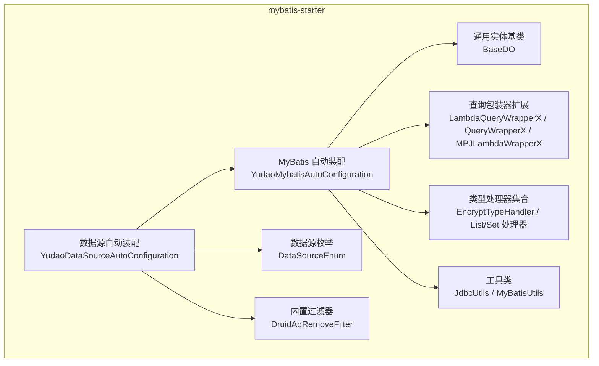
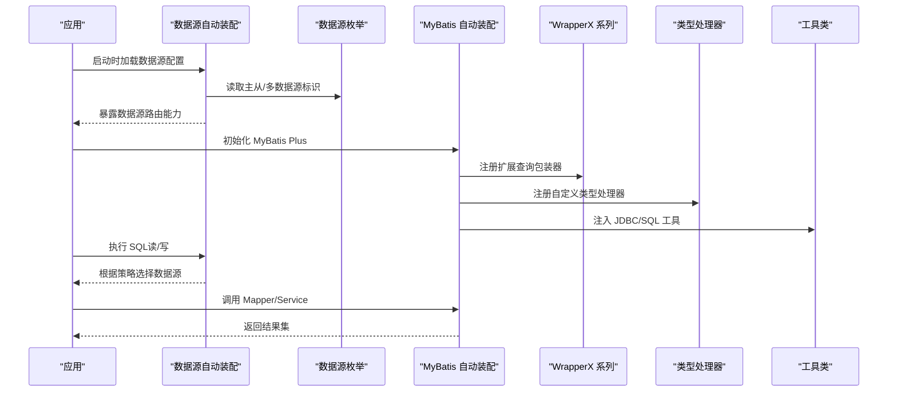
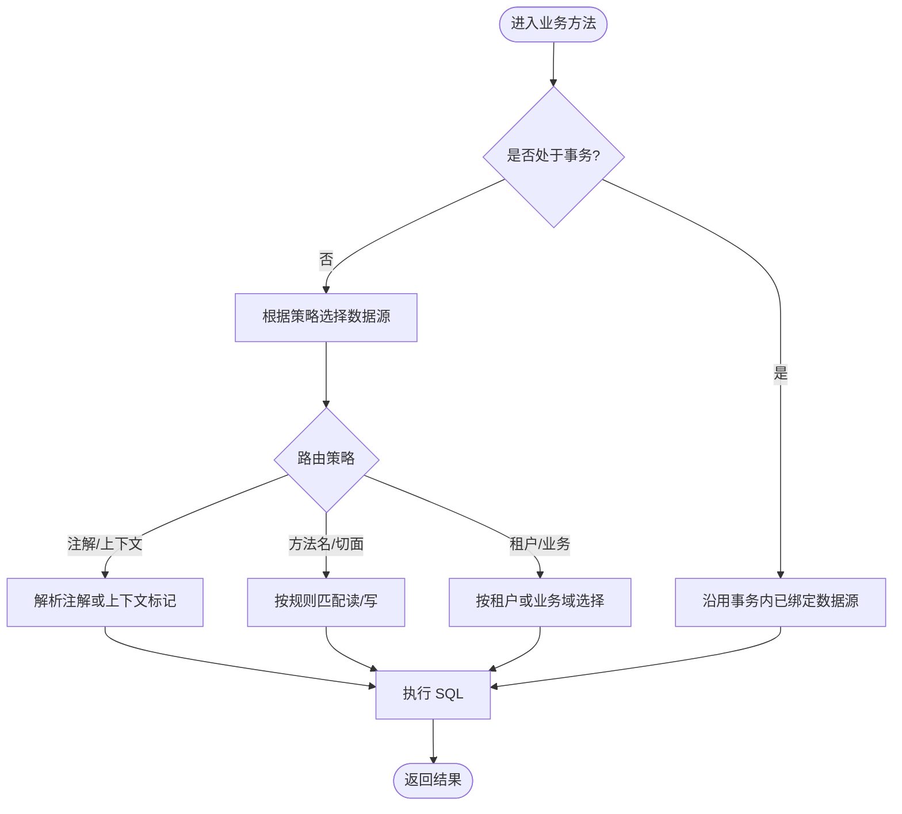
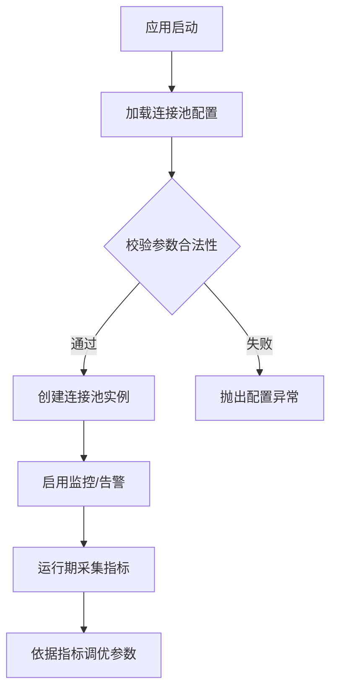
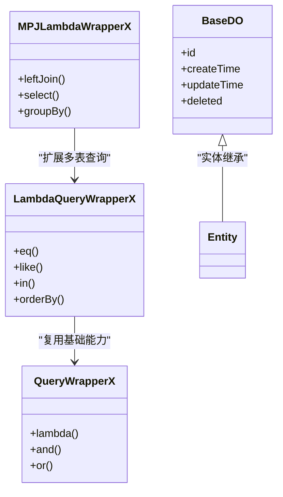
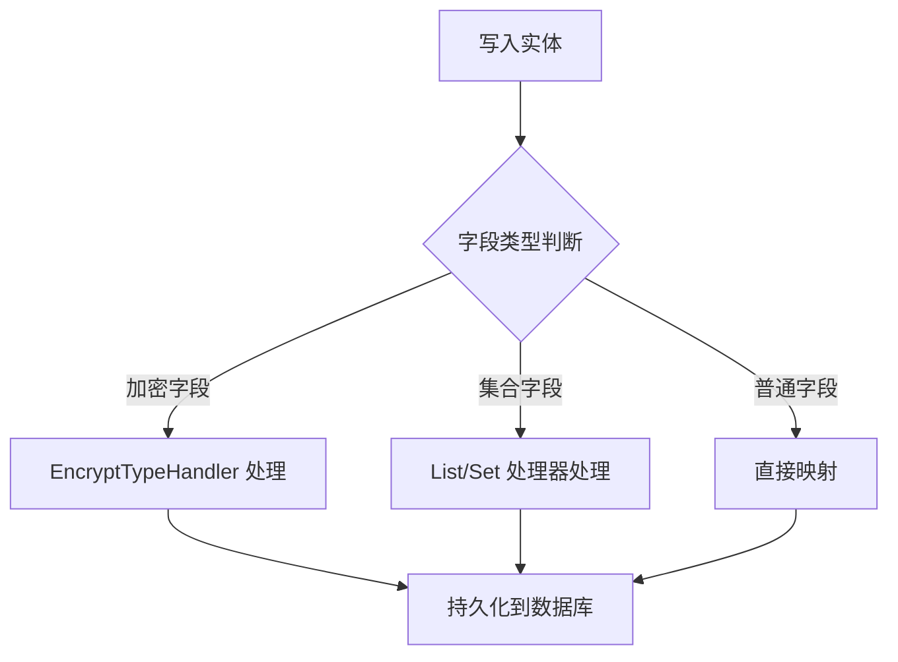
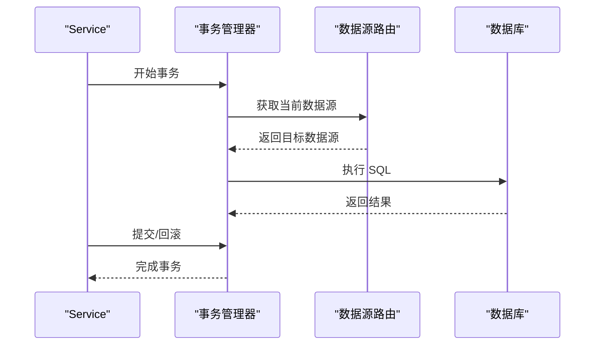
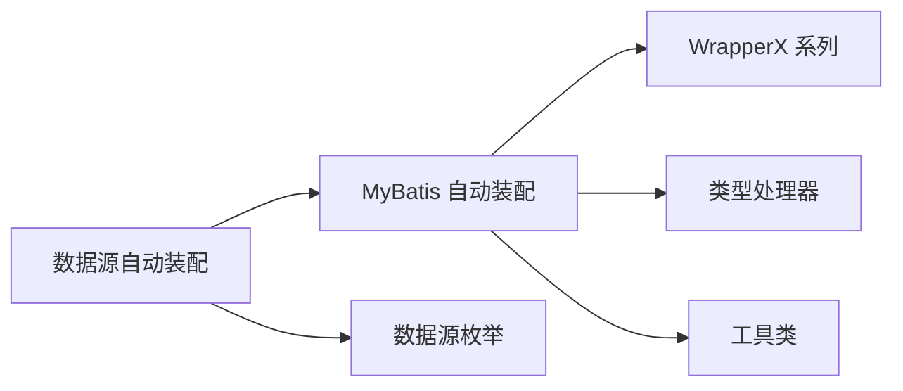

# 数据库集成

<cite>
**本文引用的文件**
- [YudaoDataSourceAutoConfiguration.java](file://yudao-cloud/yudao-framework/yudao-spring-boot-starter-mybatis/src/main/java/cn/iocoder/yudao/framework/datasource/config/YudaoDataSourceAutoConfiguration.java)
- [DataSourceEnum.java](file://yudao-cloud/yudao-framework/yudao-spring-boot-starter-mybatis/src/main/java/cn/iocoder/yudao/framework/datasource/core/enums/DataSourceEnum.java)
- [DruidAdRemoveFilter.java](file://yudao-cloud/yudao-framework/yudao-spring-boot-starter-mybatis/src/main/java/cn/iocoder/yudao/framework/datasource/core/filter/DruidAdRemoveFilter.java)
- [YudaoMybatisAutoConfiguration.java](file://yudao-cloud/yudao-framework/yudao-spring-boot-starter-mybatis/src/main/java/cn/iocoder/yudao/framework/mybatis/config/YudaoMybatisAutoConfiguration.java)
- [BaseDO.java](file://yudao-cloud/yudao-framework/yudao-spring-boot-starter-mybatis/src/main/java/cn/iocoder/yudao/framework/mybatis/core/dataobject/BaseDO.java)
- [DbTypeEnum.java](file://yudao-cloud/yudao-framework/yudao-spring-boot-starter-mybatis/src/main/java/cn/iocoder/yudao/framework/mybatis/core/enums/DbTypeEnum.java)
- [DefaultDBFieldHandler.java](file://yudao-cloud/yudao-framework/yudao-spring-boot-starter-mybatis/src/main/java/cn/iocoder/yudao/framework/mybatis/core/handler/DefaultDBFieldHandler.java)
- [BaseMapperX.java](file://yudao-cloud/yudao-framework/yudao-spring-boot-starter-mybatis/src/main/java/cn/iocoder/yudao/framework/mybatis/core/mapper/BaseMapperX.java)
- [LambdaQueryWrapperX.java](file://yudao-cloud/yudao-framework/yudao-spring-boot-starter-mybatis/src/main/java/cn/iocoder/yudao/framework/mybatis/core/query/LambdaQueryWrapperX.java)
- [MPJLambdaWrapperX.java](file://yudao-cloud/yudao-framework/yudao-spring-boot-starter-mybatis/src/main/java/cn/iocoder/yudao/framework/mybatis/core/query/MPJLambdaWrapperX.java)
- [QueryWrapperX.java](file://yudao-cloud/yudao-framework/yudao-spring-boot-starter-mybatis/src/main/java/cn/iocoder/yudao/framework/mybatis/core/query/QueryWrapperX.java)
- [EncryptTypeHandler.java](file://yudao-cloud/yudao-framework/yudao-spring-boot-starter-mybatis/src/main/java/cn/iocoder/yudao/framework/mybatis/core/type/EncryptTypeHandler.java)
- [IntegerListTypeHandler.java](file://yudao-cloud/yudao-framework/yudao-spring-boot-starter-mybatis/src/main/java/cn/iocoder/yudao/framework/mybatis/core/type/IntegerListTypeHandler.java)
- [LongListTypeHandler.java](file://yudao-cloud/yudao-framework/yudao-spring-boot-starter-mybatis/src/main/java/cn/iocoder/yudao/framework/mybatis/core/type/LongListTypeHandler.java)
- [LongSetTypeHandler.java](file://yudao-cloud/yudao-framework/yudao-spring-boot-starter-mybatis/src/main/java/cn/iocoder/yudao/framework/mybatis/core/type/LongSetTypeHandler.java)
- [StringListTypeHandler.java](file://yudao-cloud/yudao-framework/yudao-spring-boot-starter-mybatis/src/main/java/cn/iocoder/yudao/framework/mybatis/core/type/StringListTypeHandler.java)
- [JdbcUtils.java](file://yudao-cloud/yudao-framework/yudao-spring-boot-starter-mybatis/src/main/java/cn/iocoder/yudao/framework/mybatis/core/util/JdbcUtils.java)
- [MyBatisUtils.java](file://yudao-cloud/yudao-framework/yudao-spring-boot-starter-mybatis/src/main/java/cn/iocoder/yudao/framework/mybatis/core/util/MyBatisUtils.java)
- [《芋道 Spring Boot MyBatis 入门》.md](file://yudao-cloud/yudao-framework/yudao-spring-boot-starter-mybatis/《芋道 Spring Boot MyBatis 入门》.md)
- [《芋道 Spring Boot 多数据源（读写分离）入门》.md](file://yudao-cloud/yudao-framework/yudao-spring-boot-starter-mybatis/《芋道 Spring Boot 多数据源（读写分离）入门》.md)
- [《芋道 Spring Boot 数据库连接池入门》.md](file://yudao-cloud/yudao-framework/yudao-spring-boot-starter-mybatis/《芋道 Spring Boot 数据库连接池入门》.md)
</cite>

## 目录
1. [简介](#简介)
2. [项目结构](#项目结构)
3. [核心组件](#核心组件)
4. [架构总览](#架构总览)
5. [详细组件分析](#详细组件分析)
6. [依赖关系分析](#依赖关系分析)
7. [性能考虑](#性能考虑)
8. [故障排查指南](#故障排查指南)
9. [结论](#结论)
10. [附录](#附录)

## 简介
本章节面向数据库集成，围绕多数据源配置与管理、主从库与读写分离、连接池调优、MyBatis Plus 使用、事务管理以及数据库迁移等主题，提供系统化说明与实践建议。文档基于框架中 mybatis starter 的源码与配套文档进行梳理，确保内容与实际实现一致，便于在项目中落地。

## 项目结构
本项目采用模块化设计，数据库相关能力集中在 yudao-spring-boot-starter-mybatis 模块中，主要包含：
- 数据源与多数据源自动装配
- MyBatis Plus 增强与类型处理器
- 工具类与通用基类
- 配套入门文档（多数据源、连接池、MyBatis）

图表来源
- [YudaoDataSourceAutoConfiguration.java](file://yudao-cloud/yudao-framework/yudao-spring-boot-starter-mybatis/src/main/java/cn/iocoder/yudao/framework/datasource/config/YudaoDataSourceAutoConfiguration.java)
- [DataSourceEnum.java](file://yudao-cloud/yudao-framework/yudao-spring-boot-starter-mybatis/src/main/java/cn/iocoder/yudao/framework/datasource/core/enums/DataSourceEnum.java)
- [YudaoMybatisAutoConfiguration.java](file://yudao-cloud/yudao-framework/yudao-spring-boot-starter-mybatis/src/main/java/cn/iocoder/yudao/framework/mybatis/config/YudaoMybatisAutoConfiguration.java)
- [BaseDO.java](file://yudao-cloud/yudao-framework/yudao-spring-boot-starter-mybatis/src/main/java/cn/iocoder/yudao/framework/mybatis/core/dataobject/BaseDO.java)
- [LambdaQueryWrapperX.java](file://yudao-cloud/yudao-framework/yudao-spring-boot-starter-mybatis/src/main/java/cn/iocoder/yudao/framework/mybatis/core/query/LambdaQueryWrapperX.java)
- [QueryWrapperX.java](file://yudao-cloud/yudao-framework/yudao-spring-boot-starter-mybatis/src/main/java/cn/iocoder/yudao/framework/mybatis/core/query/QueryWrapperX.java)
- [MPJLambdaWrapperX.java](file://yudao-cloud/yudao-framework/yudao-spring-boot-starter-mybatis/src/main/java/cn/iocoder/yudao/framework/mybatis/core/query/MPJLambdaWrapperX.java)
- [EncryptTypeHandler.java](file://yudao-cloud/yudao-framework/yudao-spring-boot-starter-mybatis/src/main/java/cn/iocoder/yudao/framework/mybatis/core/type/EncryptTypeHandler.java)
- [IntegerListTypeHandler.java](file://yudao-cloud/yudao-framework/yudao-spring-boot-starter-mybatis/src/main/java/cn/iocoder/yudao/framework/mybatis/core/type/IntegerListTypeHandler.java)
- [LongListTypeHandler.java](file://yudao-cloud/yudao-framework/yudao-spring-boot-starter-mybatis/src/main/java/cn/iocoder/yudao/framework/mybatis/core/type/LongListTypeHandler.java)
- [LongSetTypeHandler.java](file://yudao-cloud/yudao-framework/yudao-spring-boot-starter-mybatis/src/main/java/cn/iocoder/yudao/framework/mybatis/core/type/LongSetTypeHandler.java)
- [StringListTypeHandler.java](file://yudao-cloud/yudao-framework/yudao-spring-boot-starter-mybatis/src/main/java/cn/iocoder/yudao/framework/mybatis/core/type/StringListTypeHandler.java)
- [JdbcUtils.java](file://yudao-cloud/yudao-framework/yudao-spring-boot-starter-mybatis/src/main/java/cn/iocoder/yudao/framework/mybatis/core/util/JdbcUtils.java)
- [MyBatisUtils.java](file://yudao-cloud/yudao-framework/yudao-spring-boot-starter-mybatis/src/main/java/cn/iocoder/yudao/framework/mybatis/core/util/MyBatisUtils.java)
- [DruidAdRemoveFilter.java](file://yudao-cloud/yudao-framework/yudao-spring-boot-starter-mybatis/src/main/java/cn/iocoder/yudao/framework/datasource/core/filter/DruidAdRemoveFilter.java)

章节来源
- [YudaoDataSourceAutoConfiguration.java](file://yudao-cloud/yudao-framework/yudao-spring-boot-starter-mybatis/src/main/java/cn/iocoder/yudao/framework/datasource/config/YudaoDataSourceAutoConfiguration.java)
- [YudaoMybatisAutoConfiguration.java](file://yudao-cloud/yudao-framework/yudao-spring-boot-starter-mybatis/src/main/java/cn/iocoder/yudao/framework/mybatis/config/YudaoMybatisAutoConfiguration.java)

## 核心组件
- 数据源自动装配：负责注册数据源、多数据源路由与动态切换能力，结合枚举定义主从角色。
- MyBatis 自动装配：统一配置 MyBatis Plus、分页插件、类型处理器、字段处理器等。
- 通用基类与查询封装：BaseDO 提供公共审计字段；WrapperX 系列提供链式查询与分片友好能力。
- 类型处理器：支持加密字段、集合/数组映射等场景。
- 工具类：JdbcUtils/MyBatisUtils 提供常用 JDBC/SQL 辅助方法。
- 监控与过滤：DruidAdRemoveFilter 用于屏蔽 Druid 控制台广告等干扰。

章节来源
- [DataSourceEnum.java](file://yudao-cloud/yudao-framework/yudao-spring-boot-starter-mybatis/src/main/java/cn/iocoder/yudao/framework/datasource/core/enums/DataSourceEnum.java)
- [BaseDO.java](file://yudao-cloud/yudao-framework/yudao-spring-boot-starter-mybatis/src/main/java/cn/iocoder/yudao/framework/mybatis/core/dataobject/BaseDO.java)
- [LambdaQueryWrapperX.java](file://yudao-cloud/yudao-framework/yudao-spring-boot-starter-mybatis/src/main/java/cn/iocoder/yudao/framework/mybatis/core/query/LambdaQueryWrapperX.java)
- [QueryWrapperX.java](file://yudao-cloud/yudao-framework/yudao-spring-boot-starter-mybatis/src/main/java/cn/iocoder/yudao/framework/mybatis/core/query/QueryWrapperX.java)
- [MPJLambdaWrapperX.java](file://yudao-cloud/yudao-framework/yudao-spring-boot-starter-mybatis/src/main/java/cn/iocoder/yudao/framework/mybatis/core/query/MPJLambdaWrapperX.java)
- [EncryptTypeHandler.java](file://yudao-cloud/yudao-framework/yudao-spring-boot-starter-mybatis/src/main/java/cn/iocoder/yudao/framework/mybatis/core/type/EncryptTypeHandler.java)
- [IntegerListTypeHandler.java](file://yudao-cloud/yudao-framework/yudao-spring-boot-starter-mybatis/src/main/java/cn/iocoder/yudao/framework/mybatis/core/type/IntegerListTypeHandler.java)
- [LongListTypeHandler.java](file://yudao-cloud/yudao-framework/yudao-spring-boot-starter-mybatis/src/main/java/cn/iocoder/yudao/framework/mybatis/core/type/LongListTypeHandler.java)
- [LongSetTypeHandler.java](file://yudao-cloud/yudao-framework/yudao-spring-boot-starter-mybatis/src/main/java/cn/iocoder/yudao/framework/mybatis/core/type/LongSetTypeHandler.java)
- [StringListTypeHandler.java](file://yudao-cloud/yudao-framework/yudao-spring-boot-starter-mybatis/src/main/java/cn/iocoder/yudao/framework/mybatis/core/type/StringListTypeHandler.java)
- [JdbcUtils.java](file://yudao-cloud/yudao-framework/yudao-spring-boot-starter-mybatis/src/main/java/cn/iocoder/yudao/framework/mybatis/core/util/JdbcUtils.java)
- [MyBatisUtils.java](file://yudao-cloud/yudao-framework/yudao-spring-boot-starter-mybatis/src/main/java/cn/iocoder/yudao/framework/mybatis/core/util/MyBatisUtils.java)
- [DruidAdRemoveFilter.java](file://yudao-cloud/yudao-framework/yudao-spring-boot-starter-mybatis/src/main/java/cn/iocoder/yudao/framework/datasource/core/filter/DruidAdRemoveFilter.java)

## 架构总览
下图展示了数据源装配与 MyBatis 装配之间的协作关系，以及多数据源路由、类型处理与查询封装的交互路径。

图表来源
- [YudaoDataSourceAutoConfiguration.java](file://yudao-cloud/yudao-framework/yudao-spring-boot-starter-mybatis/src/main/java/cn/iocoder/yudao/framework/datasource/config/YudaoDataSourceAutoConfiguration.java)
- [DataSourceEnum.java](file://yudao-cloud/yudao-framework/yudao-spring-boot-starter-mybatis/src/main/java/cn/iocoder/yudao/framework/datasource/core/enums/DataSourceEnum.java)
- [YudaoMybatisAutoConfiguration.java](file://yudao-cloud/yudao-framework/yudao-spring-boot-starter-mybatis/src/main/java/cn/iocoder/yudao/framework/mybatis/config/YudaoMybatisAutoConfiguration.java)
- [LambdaQueryWrapperX.java](file://yudao-cloud/yudao-framework/yudao-spring-boot-starter-mybatis/src/main/java/cn/iocoder/yudao/framework/mybatis/core/query/LambdaQueryWrapperX.java)
- [QueryWrapperX.java](file://yudao-cloud/yudao-framework/yudao-spring-boot-starter-mybatis/src/main/java/cn/iocoder/yudao/framework/mybatis/core/query/QueryWrapperX.java)
- [MPJLambdaWrapperX.java](file://yudao-cloud/yudao-framework/yudao-spring-boot-starter-mybatis/src/main/java/cn/iocoder/yudao/framework/mybatis/core/query/MPJLambdaWrapperX.java)
- [EncryptTypeHandler.java](file://yudao-cloud/yudao-framework/yudao-spring-boot-starter-mybatis/src/main/java/cn/iocoder/yudao/framework/mybatis/core/type/EncryptTypeHandler.java)
- [JdbcUtils.java](file://yudao-cloud/yudao-framework/yudao-spring-boot-starter-mybatis/src/main/java/cn/iocoder/yudao/framework/mybatis/core/util/JdbcUtils.java)
- [MyBatisUtils.java](file://yudao-cloud/yudao-framework/yudao-spring-boot-starter-mybatis/src/main/java/cn/iocoder/yudao/framework/mybatis/core/util/MyBatisUtils.java)

## 详细组件分析

### 多数据源配置与管理（主从库、读写分离、路由策略）
- 数据源自动装配负责注册并暴露多数据源能力，结合 DataSourceEnum 对主从角色进行标识，便于后续路由。
- 典型路由策略包括：
  - 按注解或上下文标记选择数据源（如 @DataSource 或 ThreadLocal 标记）
  - 按方法名前缀（read/write）或切面规则进行读/写分流
  - 按租户/业务域维度选择不同数据源
- 建议在 Service 层通过声明式方式切换数据源，保证同一事务内数据源一致性。

图表来源
- [YudaoDataSourceAutoConfiguration.java](file://yudao-cloud/yudao-framework/yudao-spring-boot-starter-mybatis/src/main/java/cn/iocoder/yudao/framework/datasource/config/YudaoDataSourceAutoConfiguration.java)
- [DataSourceEnum.java](file://yudao-cloud/yudao-framework/yudao-spring-boot-starter-mybatis/src/main/java/cn/iocoder/yudao/framework/datasource/core/enums/DataSourceEnum.java)

章节来源
- [YudaoDataSourceAutoConfiguration.java](file://yudao-cloud/yudao-framework/yudao-spring-boot-starter-mybatis/src/main/java/cn/iocoder/yudao/framework/datasource/config/YudaoDataSourceAutoConfiguration.java)
- [DataSourceEnum.java](file://yudao-cloud/yudao-framework/yudao-spring-boot-starter-mybatis/src/main/java/cn/iocoder/yudao/framework/datasource/core/enums/DataSourceEnum.java)
- [《芋道 Spring Boot 多数据源（读写分离）入门》.md](file://yudao-cloud/yudao-framework/yudao-spring-boot-starter-mybatis/《芋道 Spring Boot 多数据源（读写分离）入门》.md)

### 连接池配置与调优（HikariCP/Druid、泄漏检测、监控）
- 连接池选型：starter 同时兼容常见连接池（如 HikariCP、Druid），可通过配置项切换与调优。
- 关键参数建议：
  - 最大连接数、最小空闲、连接超时、空闲超时、连接验证间隔
  - 开启泄漏检测阈值、慢查询日志、SQL 监控
- 监控与排障：
  - 启用 Druid 监控页面（必要时移除广告干扰）
  - 收集连接池指标（活跃连接、等待队列、错误率）
  - 结合应用监控（Actuator/Prometheus/Grafana）观察趋势

图表来源
- [DruidAdRemoveFilter.java](file://yudao-cloud/yudao-framework/yudao-spring-boot-starter-mybatis/src/main/java/cn/iocoder/yudao/framework/datasource/core/filter/DruidAdRemoveFilter.java)
- [《芋道 Spring Boot 数据库连接池入门》.md](file://yudao-cloud/yudao-framework/yudao-spring-boot-starter-mybatis/《芋道 Spring Boot 数据库连接池入门》.md)

章节来源
- [DruidAdRemoveFilter.java](file://yudao-cloud/yudao-framework/yudao-spring-boot-starter-mybatis/src/main/java/cn/iocoder/yudao/framework/datasource/core/filter/DruidAdRemoveFilter.java)
- [《芋道 Spring Boot 数据库连接池入门》.md](file://yudao-cloud/yudao-framework/yudao-spring-boot-starter-mybatis/《芋道 Spring Boot 数据库连接池入门》.md)

### MyBatis Plus 使用（实体映射、动态 SQL、分页优化）
- 实体映射：
  - 继承 BaseDO 获得公共审计字段（创建时间、更新时间等）
  - 使用 DbTypeEnum 适配不同数据库方言
- 动态 SQL：
  - 使用 WrapperX 系列构建条件查询，支持 Lambda 风格与链式 API
  - 复杂查询可借助 MPJLambdaWrapperX 进行多表关联拼装
- 分页优化：
  - 通过分页插件拦截 SQL 并改写为分页语句
  - 避免 SELECT *，仅选择必要字段，减少网络与内存开销
  - 合理使用索引与覆盖索引，避免深分页

图表来源
- [BaseDO.java](file://yudao-cloud/yudao-framework/yudao-spring-boot-starter-mybatis/src/main/java/cn/iocoder/yudao/framework/mybatis/core/dataobject/BaseDO.java)
- [LambdaQueryWrapperX.java](file://yudao-cloud/yudao-framework/yudao-spring-boot-starter-mybatis/src/main/java/cn/iocoder/yudao/framework/mybatis/core/query/LambdaQueryWrapperX.java)
- [QueryWrapperX.java](file://yudao-cloud/yudao-framework/yudao-spring-boot-starter-mybatis/src/main/java/cn/iocoder/yudao/framework/mybatis/core/query/QueryWrapperX.java)
- [MPJLambdaWrapperX.java](file://yudao-cloud/yudao-framework/yudao-spring-boot-starter-mybatis/src/main/java/cn/iocoder/yudao/framework/mybatis/core/query/MPJLambdaWrapperX.java)

章节来源
- [BaseDO.java](file://yudao-cloud/yudao-framework/yudao-spring-boot-starter-mybatis/src/main/java/cn/iocoder/yudao/framework/mybatis/core/dataobject/BaseDO.java)
- [LambdaQueryWrapperX.java](file://yudao-cloud/yudao-framework/yudao-spring-boot-starter-mybatis/src/main/java/cn/iocoder/yudao/framework/mybatis/core/query/LambdaQueryWrapperX.java)
- [QueryWrapperX.java](file://yudao-cloud/yudao-framework/yudao-spring-boot-starter-mybatis/src/main/java/cn/iocoder/yudao/framework/mybatis/core/query/QueryWrapperX.java)
- [MPJLambdaWrapperX.java](file://yudao-cloud/yudao-framework/yudao-spring-boot-starter-mybatis/src/main/java/cn/iocoder/yudao/framework/mybatis/core/query/MPJLambdaWrapperX.java)
- [《芋道 Spring Boot MyBatis 入门》.md](file://yudao-cloud/yudao-framework/yudao-spring-boot-starter-mybatis/《芋道 Spring Boot MyBatis 入门》.md)

### 类型处理器与字段处理
- 类型处理器：
  - EncryptTypeHandler 用于敏感字段加解密存储
  - IntegerListTypeHandler / LongListTypeHandler / StringListTypeHandler / LongSetTypeHandler 用于集合/数组与数据库列的转换
- 字段处理器：
  - DefaultDBFieldHandler 可用于自动填充或统一字段处理逻辑

图表来源
- [EncryptTypeHandler.java](file://yudao-cloud/yudao-framework/yudao-spring-boot-starter-mybatis/src/main/java/cn/iocoder/yudao/framework/mybatis/core/type/EncryptTypeHandler.java)
- [IntegerListTypeHandler.java](file://yudao-cloud/yudao-framework/yudao-spring-boot-starter-mybatis/src/main/java/cn/iocoder/yudao/framework/mybatis/core/type/IntegerListTypeHandler.java)
- [LongListTypeHandler.java](file://yudao-cloud/yudao-framework/yudao-spring-boot-starter-mybatis/src/main/java/cn/iocoder/yudao/framework/mybatis/core/type/LongListTypeHandler.java)
- [LongSetTypeHandler.java](file://yudao-cloud/yudao-framework/yudao-spring-boot-starter-mybatis/src/main/java/cn/iocoder/yudao/framework/mybatis/core/type/LongSetTypeHandler.java)
- [StringListTypeHandler.java](file://yudao-cloud/yudao-framework/yudao-spring-boot-starter-mybatis/src/main/java/cn/iocoder/yudao/framework/mybatis/core/type/StringListTypeHandler.java)
- [DefaultDBFieldHandler.java](file://yudao-cloud/yudao-framework/yudao-spring-boot-starter-mybatis/src/main/java/cn/iocoder/yudao/framework/mybatis/core/handler/DefaultDBFieldHandler.java)

章节来源
- [EncryptTypeHandler.java](file://yudao-cloud/yudao-framework/yudao-spring-boot-starter-mybatis/src/main/java/cn/iocoder/yudao/framework/mybatis/core/type/EncryptTypeHandler.java)
- [IntegerListTypeHandler.java](file://yudao-cloud/yudao-framework/yudao-spring-boot-starter-mybatis/src/main/java/cn/iocoder/yudao/framework/mybatis/core/type/IntegerListTypeHandler.java)
- [LongListTypeHandler.java](file://yudao-cloud/yudao-framework/yudao-spring-boot-starter-mybatis/src/main/java/cn/iocoder/yudao/framework/mybatis/core/type/LongListTypeHandler.java)
- [LongSetTypeHandler.java](file://yudao-cloud/yudao-framework/yudao-spring-boot-starter-mybatis/src/main/java/cn/iocoder/yudao/framework/mybatis/core/type/LongSetTypeHandler.java)
- [StringListTypeHandler.java](file://yudao-cloud/yudao-framework/yudao-spring-boot-starter-mybatis/src/main/java/cn/iocoder/yudao/framework/mybatis/core/type/StringListTypeHandler.java)
- [DefaultDBFieldHandler.java](file://yudao-cloud/yudao-framework/yudao-spring-boot-starter-mybatis/src/main/java/cn/iocoder/yudao/framework/mybatis/core/handler/DefaultDBFieldHandler.java)

### 事务管理方案（声明式、编程式、分布式）
- 声明式事务：
  - 在 Service 方法上使用事务注解，控制事务边界与传播行为
  - 在多数据源环境下，确保同一事务内数据源一致
- 编程式事务：
  - 通过模板或回调方式手动控制事务提交与回滚
  - 适用于复杂流程或需要细粒度控制的场景
- 分布式事务：
  - 跨服务/跨库场景可采用 TCC/SAGA/Seata 等方案
  - 注意幂等性与补偿机制的设计

图表来源
- [YudaoDataSourceAutoConfiguration.java](file://yudao-cloud/yudao-framework/yudao-spring-boot-starter-mybatis/src/main/java/cn/iocoder/yudao/framework/datasource/config/YudaoDataSourceAutoConfiguration.java)

章节来源
- [YudaoDataSourceAutoConfiguration.java](file://yudao-cloud/yudao-framework/yudao-spring-boot-starter-mybatis/src/main/java/cn/iocoder/yudao/framework/datasource/config/YudaoDataSourceAutoConfiguration.java)

### 数据库迁移工具（Flyway/Liquibase）
- 版本管理：
  - 使用 Flyway 或 Liquibase 管理 SQL 脚本版本，确保环境一致性
  - 脚本命名规范与迁移顺序需严格管控
- 回滚策略：
  - 制定可回滚的迁移脚本，避免破坏性变更
  - 灰度发布与回滚预案应纳入上线流程
- 实践建议：
  - 将迁移任务纳入 CI/CD 流水线
  - 生产环境迁移前进行预演与备份

[本节为概念性说明，不直接分析具体代码文件]

## 依赖关系分析
- 数据源装配与 MyBatis 装配存在耦合：数据源路由需在 MyBatis 执行前生效，以保证正确的数据源绑定。
- WrapperX 与类型处理器由 MyBatis 装配统一注册，形成“查询构建—类型转换—SQL 执行”的链路。
- 工具类被广泛复用，降低重复代码与维护成本。

图表来源
- [YudaoDataSourceAutoConfiguration.java](file://yudao-cloud/yudao-framework/yudao-spring-boot-starter-mybatis/src/main/java/cn/iocoder/yudao/framework/datasource/config/YudaoDataSourceAutoConfiguration.java)
- [YudaoMybatisAutoConfiguration.java](file://yudao-cloud/yudao-framework/yudao-spring-boot-starter-mybatis/src/main/java/cn/iocoder/yudao/framework/mybatis/config/YudaoMybatisAutoConfiguration.java)
- [DataSourceEnum.java](file://yudao-cloud/yudao-framework/yudao-spring-boot-starter-mybatis/src/main/java/cn/iocoder/yudao/framework/datasource/core/enums/DataSourceEnum.java)

章节来源
- [YudaoDataSourceAutoConfiguration.java](file://yudao-cloud/yudao-framework/yudao-spring-boot-starter-mybatis/src/main/java/cn/iocoder/yudao/framework/datasource/config/YudaoDataSourceAutoConfiguration.java)
- [YudaoMybatisAutoConfiguration.java](file://yudao-cloud/yudao-framework/yudao-spring-boot-starter-mybatis/src/main/java/cn/iocoder/yudao/framework/mybatis/config/YudaoMybatisAutoConfiguration.java)
- [DataSourceEnum.java](file://yudao-cloud/yudao-framework/yudao-spring-boot-starter-mybatis/src/main/java/cn/iocoder/yudao/framework/datasource/core/enums/DataSourceEnum.java)

## 性能考虑
- 连接池：
  - 合理设置最大连接数与超时，避免连接耗尽与长事务占用
  - 开启慢查询与泄漏检测，及时定位瓶颈
- SQL 与索引：
  - 避免全表扫描，利用覆盖索引与合适索引提升查询效率
  - 分页查询限制深度，必要时采用游标或延迟关联
- 缓存与异步：
  - 热点数据引入缓存，减轻数据库压力
  - 非关键路径异步化处理，缩短响应时间

[本节为通用性能建议，不直接分析具体代码文件]

## 故障排查指南
- 连接池问题：
  - 检查连接泄漏阈值与慢查询日志
  - 监控连接池指标，关注等待队列与错误率
- 多数据源路由异常：
  - 确认事务内数据源一致性，避免混用
  - 检查路由策略与上下文标记是否正确设置
- MyBatis 查询问题：
  - 使用 WrapperX 构建条件时注意空值与特殊字符处理
  - 分页查询避免 SELECT *，减少数据传输量
- 类型转换异常：
  - 核对实体字段与数据库列类型映射
  - 检查自定义类型处理器是否生效

章节来源
- [DruidAdRemoveFilter.java](file://yudao-cloud/yudao-framework/yudao-spring-boot-starter-mybatis/src/main/java/cn/iocoder/yudao/framework/datasource/core/filter/DruidAdRemoveFilter.java)
- [JdbcUtils.java](file://yudao-cloud/yudao-framework/yudao-spring-boot-starter-mybatis/src/main/java/cn/iocoder/yudao/framework/mybatis/core/util/JdbcUtils.java)
- [MyBatisUtils.java](file://yudao-cloud/yudao-framework/yudao-spring-boot-starter-mybatis/src/main/java/cn/iocoder/yudao/framework/mybatis/core/util/MyBatisUtils.java)

## 结论
本仓库通过 mybatis starter 提供了完善的多数据源、MyBatis Plus 增强、类型处理与工具能力。结合合理的连接池调优、事务管理与迁移策略，可在保证一致性的前提下提升系统性能与可维护性。建议在生产环境中持续监控与迭代优化。

[本节为总结性内容，不直接分析具体代码文件]

## 附录
- 参考文档：
  - 《芋道 Spring Boot MyBatis 入门》
  - 《芋道 Spring Boot 多数据源（读写分离）入门》
  - 《芋道 Spring Boot 数据库连接池入门》

章节来源
- [《芋道 Spring Boot MyBatis 入门》.md](file://yudao-cloud/yudao-framework/yudao-spring-boot-starter-mybatis/《芋道 Spring Boot MyBatis 入门》.md)
- [《芋道 Spring Boot 多数据源（读写分离）入门》.md](file://yudao-cloud/yudao-framework/yudao-spring-boot-starter-mybatis/《芋道 Spring Boot 多数据源（读写分离）入门》.md)
- [《芋道 Spring Boot 数据库连接池入门》.md](file://yudao-cloud/yudao-framework/yudao-spring-boot-starter-mybatis/《芋道 Spring Boot 数据库连接池入门》.md)