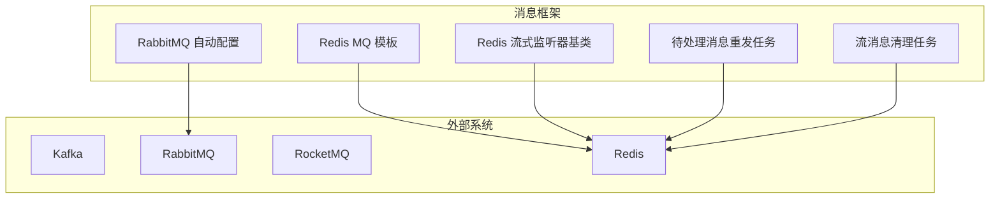
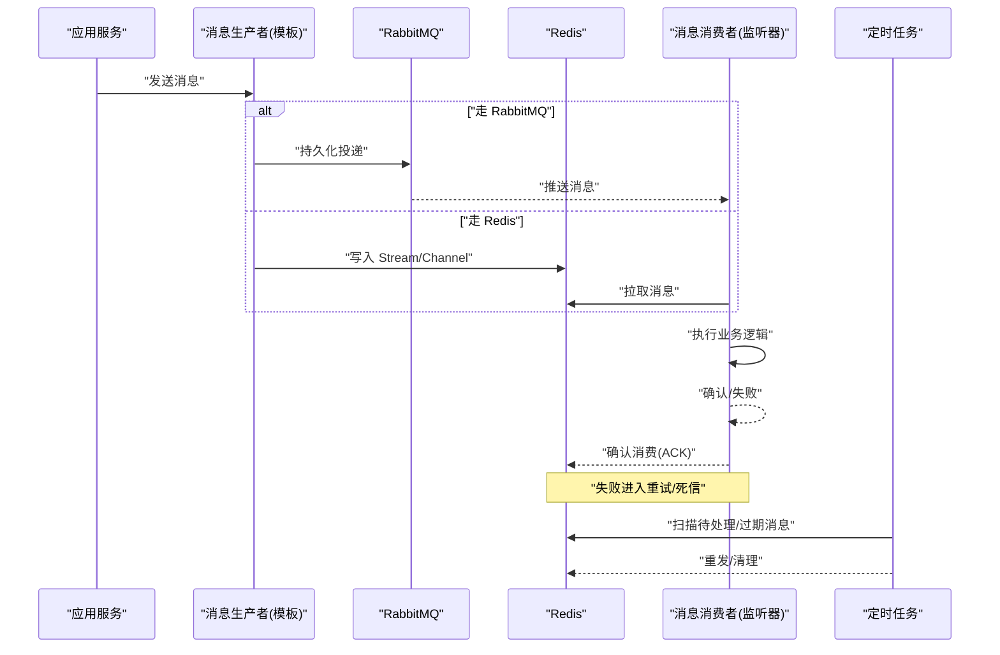
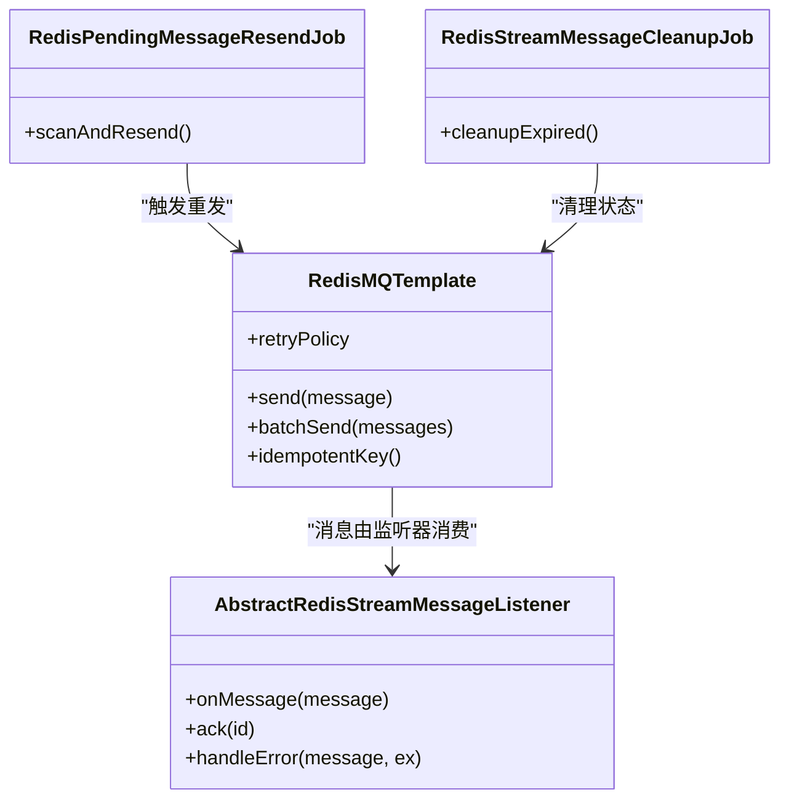
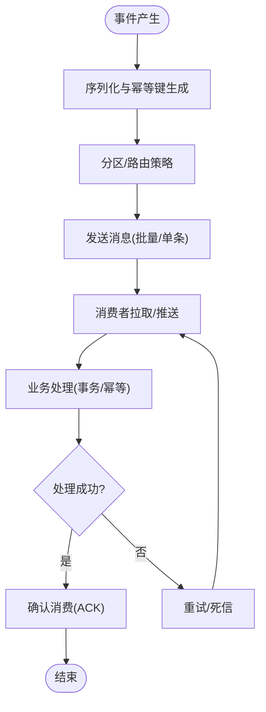
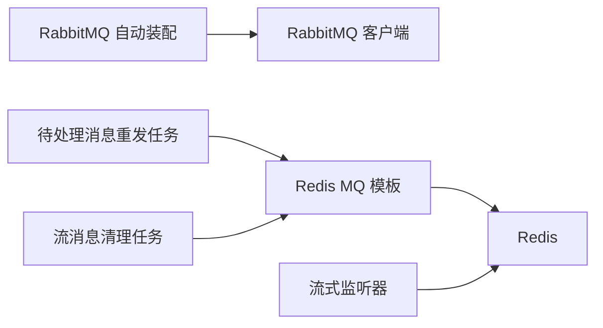

# 消息队列集成

<cite>
**本文引用的文件**
- [yudao-spring-boot-starter-mq/pom.xml](file://yudao-cloud/yudao-framework/yudao-spring-boot-starter-mq/pom.xml)
- [YudaoRabbitMQAutoConfiguration.java](file://yudao-cloud/yudao-framework/yudao-spring-boot-starter-mq/src/main/java/cn/iocoder/yudao/framework/mq/rabbitmq/config/YudaoRabbitMQAutoConfiguration.java)
- [RedisMQTemplate.java](file://yudao-cloud/yudao-framework/yudao-spring-boot-starter-mq/src/main/java/cn/iocoder/yudao/framework/mq/redis/core/RedisMQTemplate.java)
- [AbstractRedisMessage.java](file://yudao-cloud/yudao-framework/yudao-spring-boot-starter-mq/src/main/java/cn/iocoder/yudao/framework/mq/redis/core/message/AbstractRedisMessage.java)
- [AbstractRedisStreamMessageListener.java](file://yudao-cloud/yudao-framework/yudao-spring-boot-starter-mq/src/main/java/cn/iocoder/yudao/framework/mq/redis/stream/AbstractRedisStreamMessageListener.java)
- [RedisPendingMessageResendJob.java](file://yudao-cloud/yudao-framework/yudao-spring-boot-starter-mq/src/main/java/cn/iocoder/yudao/framework/mq/redis/job/RedisPendingMessageResendJob.java)
- [RedisStreamMessageCleanupJob.java](file://yudao-cloud/yudao-framework/yudao-spring-boot-starter-mq/src/main/java/cn/iocoder/yudao/framework/mq/redis/job/RedisStreamMessageCleanupJob.java)
- [YudaoRedisMQProducerAutoConfiguration.java](file://yudao-cloud/yudao-framework/yudao-spring-boot-starter-mq/src/main/java/cn/iocoder/yudao/framework/mq/redis/config/YudaoRedisMQProducerAutoConfiguration.java)
- [YudaoRedisMQConsumerAutoConfiguration.java](file://yudao-cloud/yudao-framework/yudao-spring-boot-starter-mq/src/main/java/cn/iocoder/yudao/framework/mq/redis/config/YudaoRedisMQConsumerAutoConfiguration.java)
- [《芋道 Spring Boot 消息队列 Kafka 入门》.md](file://yudao-cloud/yudao-framework/yudao-spring-boot-starter-mq/《芋道 Spring Boot 消息队列 Kafka 入门》.md)
- [《芋道 Spring Boot 消息队列 RabbitMQ 入门》.md](file://yudao-cloud/yudao-framework/yudao-spring-boot-starter-mq/《芋道 Spring Boot 消息队列 RabbitMQ 入门》.md)
- [《芋道 Spring Boot 消息队列 RocketMQ 入门》.md](file://yudao-cloud/yudao-framework/yudao-spring-boot-starter-mq/《芋道 Spring Boot 消息队列 RocketMQ 入门》.md)
</cite>

## 目录
1. [简介](#简介)
2. [项目结构](#项目结构)
3. [核心组件](#核心组件)
4. [架构总览](#架构总览)
5. [详细组件分析](#详细组件分析)
6. [依赖关系分析](#依赖关系分析)
7. [性能考量](#性能考量)
8. [故障排查指南](#故障排查指南)
9. [结论](#结论)
10. [附录](#附录)

## 简介
本文件面向消息队列集成，覆盖 Kafka、RabbitMQ、RocketMQ 的接入与使用要点，并结合仓库中已有的 Redis MQ 实现，给出生产与消费的设计模式、可靠性保障方案（ACK、重试、死信、幂等）以及典型业务场景的消息流转说明。文档以“可配置、可扩展、可观测”为目标，帮助读者在统一抽象下快速落地多后端消息中间件。

## 项目结构
本项目将消息能力封装为 Spring Boot Starter，提供：
- RabbitMQ 自动装配入口
- Redis 作为消息存储与投递的模板与监听器基类
- 任务调度用于待处理消息重发与清理
- 官方入门文档指引 Kafka/RocketMQ 的使用方式

图表来源
- [YudaoRabbitMQAutoConfiguration.java:1-200](file://yudao-cloud/yudao-framework/yudao-spring-boot-starter-mq/src/main/java/cn/iocoder/yudao/framework/mq/rabbitmq/config/YudaoRabbitMQAutoConfiguration.java#L1-L200)
- [RedisMQTemplate.java:1-200](file://yudao-cloud/yudao-framework/yudao-spring-boot-starter-mq/src/main/java/cn/iocoder/yudao/framework/mq/redis/core/RedisMQTemplate.java#L1-L200)
- [AbstractRedisStreamMessageListener.java:1-200](file://yudao-cloud/yudao-framework/yudao-spring-boot-starter-mq/src/main/java/cn/iocoder/yudao/framework/mq/redis/stream/AbstractRedisStreamMessageListener.java#L1-L200)
- [RedisPendingMessageResendJob.java:1-200](file://yudao-cloud/yudao-framework/yudao-spring-boot-starter-mq/src/main/java/cn/iocoder/yudao/framework/mq/redis/job/RedisPendingMessageResendJob.java#L1-L200)
- [RedisStreamMessageCleanupJob.java:1-200](file://yudao-cloud/yudao-framework/yudao-spring-boot-starter-mq/src/main/java/cn/iocoder/yudao/framework/mq/redis/job/RedisStreamMessageCleanupJob.java#L1-L200)

章节来源
- [yudao-spring-boot-starter-mq/pom.xml:1-200](file://yudao-cloud/yudao-framework/yudao-spring-boot-starter-mq/pom.xml#L1-L200)

## 核心组件
- RabbitMQ 自动装配：提供连接、交换机、队列、路由键等能力的自动装配入口，便于通过配置启用 RabbitMQ 支持。
- Redis MQ 模板：统一的发送/接收抽象，基于 Redis Stream/Channel 实现消息发布与订阅，屏蔽底层细节。
- 流式监听器基类：定义消息监听生命周期，支持批量拉取、确认、重试与错误处理钩子。
- 任务调度：
  - 待处理消息重发：周期性扫描未确认或失败消息并重新投递。
  - 流消息清理：定期清理过期或已消费的消息，控制存储增长。
- 生产者/消费者自动装配：分别暴露模板与监听器装配点，便于按需启用。

章节来源
- [YudaoRabbitMQAutoConfiguration.java:1-200](file://yudao-cloud/yudao-framework/yudao-spring-boot-starter-mq/src/main/java/cn/iocoder/yudao/framework/mq/rabbitmq/config/YudaoRabbitMQAutoConfiguration.java#L1-L200)
- [RedisMQTemplate.java:1-200](file://yudao-cloud/yudao-framework/yudao-spring-boot-starter-mq/src/main/java/cn/iocoder/yudao/framework/mq/redis/core/RedisMQTemplate.java#L1-L200)
- [AbstractRedisStreamMessageListener.java:1-200](file://yudao-cloud/yudao-framework/yudao-spring-boot-starter-mq/src/main/java/cn/iocoder/yudao/framework/mq/redis/stream/AbstractRedisStreamMessageListener.java#L1-L200)
- [RedisPendingMessageResendJob.java:1-200](file://yudao-cloud/yudao-framework/yudao-spring-boot-starter-mq/src/main/java/cn/iocoder/yudao/framework/mq/redis/job/RedisPendingMessageResendJob.java#L1-L200)
- [RedisStreamMessageCleanupJob.java:1-200](file://yudao-cloud/yudao-framework/yudao-spring-boot-starter-mq/src/main/java/cn/iocoder/yudao/framework/mq/redis/job/RedisStreamMessageCleanupJob.java#L1-L200)
- [YudaoRedisMQProducerAutoConfiguration.java:1-200](file://yudao-cloud/yudao-framework/yudao-spring-boot-starter-mq/src/main/java/cn/iocoder/yudao/framework/mq/redis/config/YudaoRedisMQProducerAutoConfiguration.java#L1-L200)
- [YudaoRedisMQConsumerAutoConfiguration.java:1-200](file://yudao-cloud/yudao-framework/yudao-spring-boot-starter-mq/src/main/java/cn/iocoder/yudao/framework/mq/redis/config/YudaoRedisMQConsumerAutoConfiguration.java#L1-L200)

## 架构总览
下图展示消息从生产者到消费者的整体流程，涵盖 Redis 与 RabbitMQ 两条路径，并体现可靠性机制（重试、清理、确认）。

图表来源
- [YudaoRabbitMQAutoConfiguration.java:1-200](file://yudao-cloud/yudao-framework/yudao-spring-boot-starter-mq/src/main/java/cn/iocoder/yudao/framework/mq/rabbitmq/config/YudaoRabbitMQAutoConfiguration.java#L1-L200)
- [RedisMQTemplate.java:1-200](file://yudao-cloud/yudao-framework/yudao-spring-boot-starter-mq/src/main/java/cn/iocoder/yudao/framework/mq/redis/core/RedisMQTemplate.java#L1-L200)
- [AbstractRedisStreamMessageListener.java:1-200](file://yudao-cloud/yudao-framework/yudao-spring-boot-starter-mq/src/main/java/cn/iocoder/yudao/framework/mq/redis/stream/AbstractRedisStreamMessageListener.java#L1-L200)
- [RedisPendingMessageResendJob.java:1-200](file://yudao-cloud/yudao-framework/yudao-spring-boot-starter-mq/src/main/java/cn/iocoder/yudao/framework/mq/redis/job/RedisPendingMessageResendJob.java#L1-L200)
- [RedisStreamMessageCleanupJob.java:1-200](file://yudao-cloud/yudao-framework/yudao-spring-boot-starter-mq/src/main/java/cn/iocoder/yudao/framework/mq/redis/job/RedisStreamMessageCleanupJob.java#L1-L200)

## 详细组件分析

### RabbitMQ 自动装配
- 职责：根据配置创建连接工厂、交换机、队列、路由绑定及模板；暴露标准 API 供业务调用。
- 关键能力：连接参数、集群地址、TLS、认证、重试策略、限流与并发。
- 扩展点：自定义转换器、拦截器、异常处理器。

章节来源
- [YudaoRabbitMQAutoConfiguration.java:1-200](file://yudao-cloud/yudao-framework/yudao-spring-boot-starter-mq/src/main/java/cn/iocoder/yudao/framework/mq/rabbitmq/config/YudaoRabbitMQAutoConfiguration.java#L1-L200)
- [《芋道 Spring Boot 消息队列 RabbitMQ 入门》.md:1-200](file://yudao-cloud/yudao-framework/yudao-spring-boot-starter-mq/《芋道 Spring Boot 消息队列 RabbitMQ 入门》.md#L1-L200)

### Redis MQ 模板与监听器
- 模板：统一封装消息发送、批量发送、延迟发送、重试与幂等键生成。
- 监听器：基于 Redis Stream 的拉取模型，支持批量消费、确认、失败重试与死信分流。
- 任务：
  - 待处理消息重发：按策略回投未确认或失败消息。
  - 流消息清理：删除已确认或过期的条目，避免内存膨胀。

图表来源
- [RedisMQTemplate.java:1-200](file://yudao-cloud/yudao-framework/yudao-spring-boot-starter-mq/src/main/java/cn/iocoder/yudao/framework/mq/redis/core/RedisMQTemplate.java#L1-L200)
- [AbstractRedisStreamMessageListener.java:1-200](file://yudao-cloud/yudao-framework/yudao-spring-boot-starter-mq/src/main/java/cn/iocoder/yudao/framework/mq/redis/stream/AbstractRedisStreamMessageListener.java#L1-L200)
- [RedisPendingMessageResendJob.java:1-200](file://yudao-cloud/yudao-framework/yudao-spring-boot-starter-mq/src/main/java/cn/iocoder/yudao/framework/mq/redis/job/RedisPendingMessageResendJob.java#L1-L200)
- [RedisStreamMessageCleanupJob.java:1-200](file://yudao-cloud/yudao-framework/yudao-spring-boot-starter-mq/src/main/java/cn/iocoder/yudao/framework/mq/redis/job/RedisStreamMessageCleanupJob.java#L1-L200)

章节来源
- [RedisMQTemplate.java:1-200](file://yudao-cloud/yudao-framework/yudao-spring-boot-starter-mq/src/main/java/cn/iocoder/yudao/framework/mq/redis/core/RedisMQTemplate.java#L1-L200)
- [AbstractRedisMessage.java:1-200](file://yudao-cloud/yudao-framework/yudao-spring-boot-starter-mq/src/main/java/cn/iocoder/yudao/framework/mq/redis/core/message/AbstractRedisMessage.java#L1-L200)
- [AbstractRedisStreamMessageListener.java:1-200](file://yudao-cloud/yudao-framework/yudao-spring-boot-starter-mq/src/main/java/cn/iocoder/yudao/framework/mq/redis/stream/AbstractRedisStreamMessageListener.java#L1-L200)
- [RedisPendingMessageResendJob.java:1-200](file://yudao-cloud/yudao-framework/yudao-spring-boot-starter-mq/src/main/java/cn/iocoder/yudao/framework/mq/redis/job/RedisPendingMessageResendJob.java#L1-L200)
- [RedisStreamMessageCleanupJob.java:1-200](file://yudao-cloud/yudao-framework/yudao-spring-boot-starter-mq/src/main/java/cn/iocoder/yudao/framework/mq/redis/job/RedisStreamMessageCleanupJob.java#L1-L200)

### 消息生产者设计
- 序列化：统一对象到字节/字符串的转换，支持 JSON、Protobuf 等扩展。
- 分区策略：
  - Kafka：按业务键哈希分区，保证顺序性与负载均衡。
  - RabbitMQ：通过路由键与交换机类型（直连/扇出/主题）实现定向分发。
  - RocketMQ：按消息 Key 选择队列，兼顾顺序与吞吐。
- 批量发送：合并小消息为批次，降低网络开销；配合 ACK 与重试确保可靠。
- 幂等：为每条消息生成唯一 ID，消费者侧去重。

章节来源
- [《芋道 Spring Boot 消息队列 Kafka 入门》.md:1-200](file://yudao-cloud/yudao-framework/yudao-spring-boot-starter-mq/《芋道 Spring Boot 消息队列 Kafka 入门》.md#L1-L200)
- [《芋道 Spring Boot 消息队列 RabbitMQ 入门》.md:1-200](file://yudao-cloud/yudao-framework/yudao-spring-boot-starter-mq/《芋道 Spring Boot 消息队列 RabbitMQ 入门》.md#L1-L200)
- [《芋道 Spring Boot 消息队列 RocketMQ 入门》.md:1-200](file://yudao-cloud/yudao-framework/yudao-spring-boot-starter-mq/《芋道 Spring Boot 消息队列 RocketMQ 入门》.md#L1-L200)
- [RedisMQTemplate.java:1-200](file://yudao-cloud/yudao-framework/yudao-spring-boot-starter-mq/src/main/java/cn/iocoder/yudao/framework/mq/redis/core/RedisMQTemplate.java#L1-L200)

### 消息消费者设计
- 监听器模式：继承基类实现 onMessage，集中处理业务逻辑与异常。
- 并发消费：
  - Kafka：多线程并行消费不同分区。
  - RabbitMQ：预取数量与并发通道控制。
  - RocketMQ：消费者线程池与拉取并发。
- 事务处理：
  - 本地事务与消息提交一致性：先写库再发消息，或使用事务消息。
  - 失败补偿：结合重试与死信队列进行最终一致。

章节来源
- [AbstractRedisStreamMessageListener.java:1-200](file://yudao-cloud/yudao-framework/yudao-spring-boot-starter-mq/src/main/java/cn/iocoder/yudao/framework/mq/redis/stream/AbstractRedisStreamMessageListener.java#L1-L200)
- [《芋道 Spring Boot 消息队列 Kafka 入门》.md:1-200](file://yudao-cloud/yudao-framework/yudao-spring-boot-starter-mq/《芋道 Spring Boot 消息队列 Kafka 入门》.md#L1-L200)
- [《芋道 Spring Boot 消息队列 RabbitMQ 入门》.md:1-200](file://yudao-cloud/yudao-framework/yudao-spring-boot-starter-mq/《芋道 Spring Boot 消息队列 RabbitMQ 入门》.md#L1-L200)
- [《芋道 Spring Boot 消息队列 RocketMQ 入门》.md:1-200](file://yudao-cloud/yudao-framework/yudao-spring-boot-starter-mq/《芋道 Spring Boot 消息队列 RocketMQ 入门》.md#L1-L200)

### 可靠性保证方案
- ACK 机制：
  - Kafka：手动提交偏移量，成功再 ack。
  - RabbitMQ：手动确认，失败重回队列或进死信。
  - RocketMQ：消费成功后再确认。
- 重试与退避：指数退避、最大重试次数、死信队列分流。
- 重复消息处理：消费者幂等设计（基于唯一 ID 去重）。
- 监控与告警：记录发送/消费成功率、延迟、堆积量。

章节来源
- [RedisPendingMessageResendJob.java:1-200](file://yudao-cloud/yudao-framework/yudao-spring-boot-starter-mq/src/main/java/cn/iocoder/yudao/framework/mq/redis/job/RedisPendingMessageResendJob.java#L1-L200)
- [《芋道 Spring Boot 消息队列 Kafka 入门》.md:1-200](file://yudao-cloud/yudao-framework/yudao-spring-boot-starter-mq/《芋道 Spring Boot 消息队列 Kafka 入门》.md#L1-L200)
- [《芋道 Spring Boot 消息队列 RabbitMQ 入门》.md:1-200](file://yudao-cloud/yudao-framework/yudao-spring-boot-starter-mq/《芋道 Spring Boot 消息队列 RabbitMQ 入门》.md#L1-L200)
- [《芋道 Spring Boot 消息队列 RocketMQ 入门》.md:1-200](file://yudao-cloud/yudao-framework/yudao-spring-boot-starter-mq/《芋道 Spring Boot 消息队列 RocketMQ 入门》.md#L1-L200)

### 典型业务场景
- 呼叫事件通知：主叫/被叫状态变更事件通过消息广播，前端实时刷新。
- 通话录音上传：录音完成事件触发异步上传，失败重试与分片续传。
- 监控指标上报：高频指标聚合后批量上报，削峰填谷。

图表来源
- [RedisMQTemplate.java:1-200](file://yudao-cloud/yudao-framework/yudao-spring-boot-starter-mq/src/main/java/cn/iocoder/yudao/framework/mq/redis/core/RedisMQTemplate.java#L1-L200)
- [AbstractRedisStreamMessageListener.java:1-200](file://yudao-cloud/yudao-framework/yudao-spring-boot-starter-mq/src/main/java/cn/iocoder/yudao/framework/mq/redis/stream/AbstractRedisStreamMessageListener.java#L1-L200)
- [RedisPendingMessageResendJob.java:1-200](file://yudao-cloud/yudao-framework/yudao-spring-boot-starter-mq/src/main/java/cn/iocoder/yudao/framework/mq/redis/job/RedisPendingMessageResendJob.java#L1-L200)

## 依赖关系分析
- 模块内依赖：
  - 自动装配依赖模板与监听器基类。
  - 任务依赖模板提供的状态查询与重发接口。
- 外部依赖：
  - RabbitMQ：连接工厂、AMQP 客户端。
  - Redis：Stream/Channel、Lua 脚本（可选）、连接池。
  - Kafka/RocketMQ：通过官方 SDK 接入（参考入门文档）。

图表来源
- [YudaoRabbitMQAutoConfiguration.java:1-200](file://yudao-cloud/yudao-framework/yudao-spring-boot-starter-mq/src/main/java/cn/iocoder/yudao/framework/mq/rabbitmq/config/YudaoRabbitMQAutoConfiguration.java#L1-L200)
- [RedisMQTemplate.java:1-200](file://yudao-cloud/yudao-framework/yudao-spring-boot-starter-mq/src/main/java/cn/iocoder/yudao/framework/mq/redis/core/RedisMQTemplate.java#L1-L200)
- [AbstractRedisStreamMessageListener.java:1-200](file://yudao-cloud/yudao-framework/yudao-spring-boot-starter-mq/src/main/java/cn/iocoder/yudao/framework/mq/redis/stream/AbstractRedisStreamMessageListener.java#L1-L200)
- [RedisPendingMessageResendJob.java:1-200](file://yudao-cloud/yudao-framework/yudao-spring-boot-starter-mq/src/main/java/cn/iocoder/yudao/framework/mq/redis/job/RedisPendingMessageResendJob.java#L1-L200)
- [RedisStreamMessageCleanupJob.java:1-200](file://yudao-cloud/yudao-framework/yudao-spring-boot-starter-mq/src/main/java/cn/iocoder/yudao/framework/mq/redis/job/RedisStreamMessageCleanupJob.java#L1-L200)

章节来源
- [yudao-spring-boot-starter-mq/pom.xml:1-200](file://yudao-cloud/yudao-framework/yudao-spring-boot-starter-mq/pom.xml#L1-L200)

## 性能考量
- 生产者
  - 批量发送：减少网络往返，提高吞吐。
  - 压缩与序列化：选择高效序列化格式，必要时启用压缩。
  - 分区/路由：合理设置分区键，避免热点分区。
- 消费者
  - 并发度：根据 CPU 与 IO 调整线程数与预取大小。
  - 批处理消费：一次拉取多条消息，减少上下文切换。
  - 幂等与去重：基于唯一 ID 与缓存/数据库去重。
- 可靠性
  - 重试策略：指数退避、最大重试次数、死信队列。
  - 监控：采集延迟、堆积、失败率，及时告警。

[本节为通用指导，不直接分析具体文件]

## 故障排查指南
- 常见问题
  - 无法连接：检查网络、认证、TLS 配置。
  - 消息丢失：确认持久化、ACK 提交时机与重试策略。
  - 重复消费：确认消费者幂等与去重逻辑。
  - 堆积严重：提升消费者并发、优化处理逻辑、扩容节点。
- 定位方法
  - 查看发送/消费日志与指标。
  - 检查死信队列与重试计数。
  - 使用工具查看队列深度与消费者组状态。

章节来源
- [RedisPendingMessageResendJob.java:1-200](file://yudao-cloud/yudao-framework/yudao-spring-boot-starter-mq/src/main/java/cn/iocoder/yudao/framework/mq/redis/job/RedisPendingMessageResendJob.java#L1-L200)
- [RedisStreamMessageCleanupJob.java:1-200](file://yudao-cloud/yudao-framework/yudao-spring-boot-starter-mq/src/main/java/cn/iocoder/yudao/framework/mq/redis/job/RedisStreamMessageCleanupJob.java#L1-L200)
- [《芋道 Spring Boot 消息队列 Kafka 入门》.md:1-200](file://yudao-cloud/yudao-framework/yudao-spring-boot-starter-mq/《芋道 Spring Boot 消息队列 Kafka 入门》.md#L1-L200)
- [《芋道 Spring Boot 消息队列 RabbitMQ 入门》.md:1-200](file://yudao-cloud/yudao-framework/yudao-spring-boot-starter-mq/《芋道 Spring Boot 消息队列 RabbitMQ 入门》.md#L1-L200)
- [《芋道 Spring Boot 消息队列 RocketMQ 入门》.md:1-200](file://yudao-cloud/yudao-framework/yudao-spring-boot-starter-mq/《芋道 Spring Boot 消息队列 RocketMQ 入门》.md#L1-L200)

## 结论
本框架以统一抽象整合多种消息中间件，提供可靠的发送与消费能力，并通过任务调度与监听器基类简化开发。建议在生产环境：
- 明确分区/路由策略，避免热点与倾斜。
- 开启幂等与重试，完善死信与监控。
- 针对高吞吐场景采用批量与压缩，合理调优并发与缓冲。

[本节为总结性内容，不直接分析具体文件]

## 附录
- 配置项建议
  - 连接参数：主机、端口、用户名、密码、TLS、超时。
  - 集群配置：多节点地址、故障转移、健康检查。
  - 负载均衡：分区键、路由规则、消费者分组。
- 最佳实践
  - 消息体尽量小且稳定，版本兼容需考虑向后兼容。
  - 严格区分测试/预发/生产环境配置。
  - 建立完善的监控与告警体系。

[本节为补充信息，不直接分析具体文件]