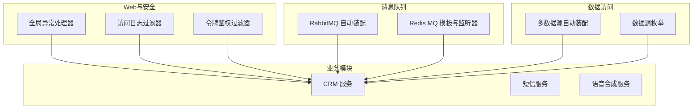
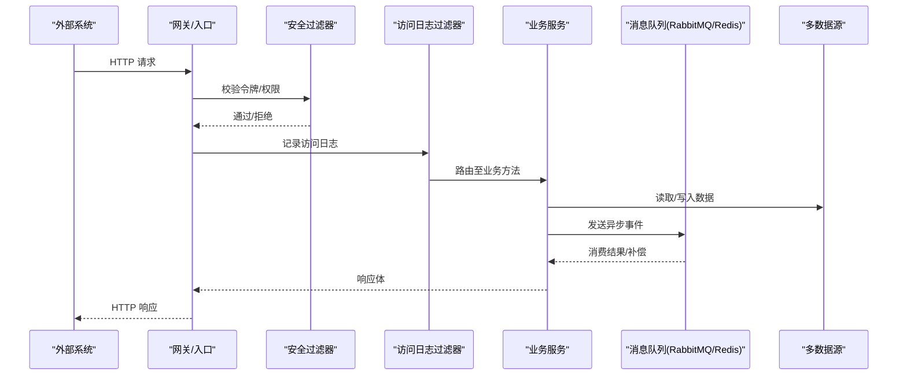
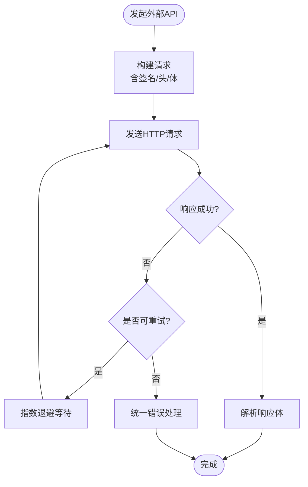
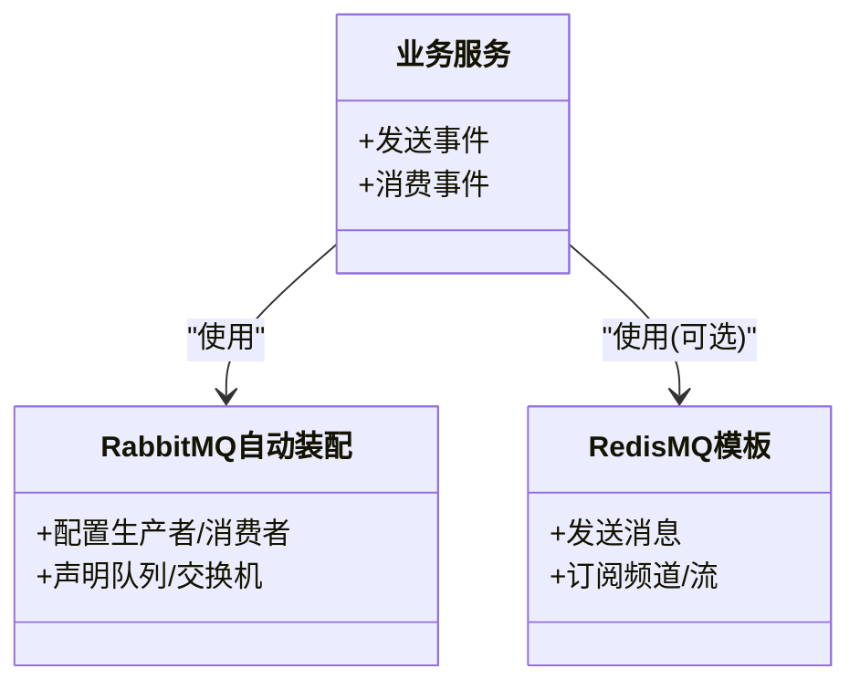
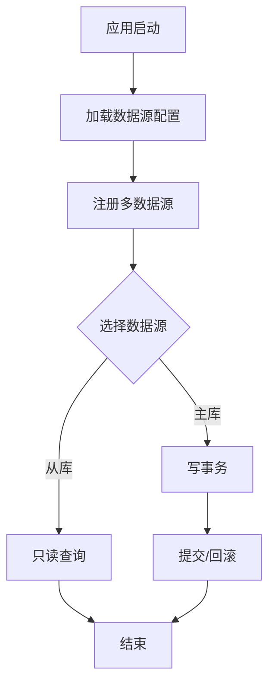
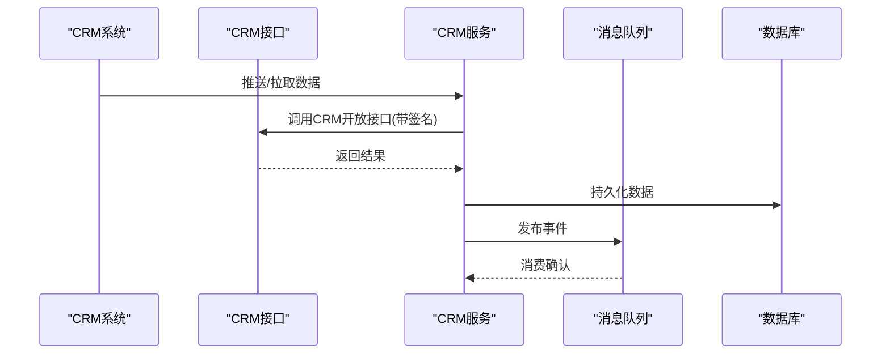
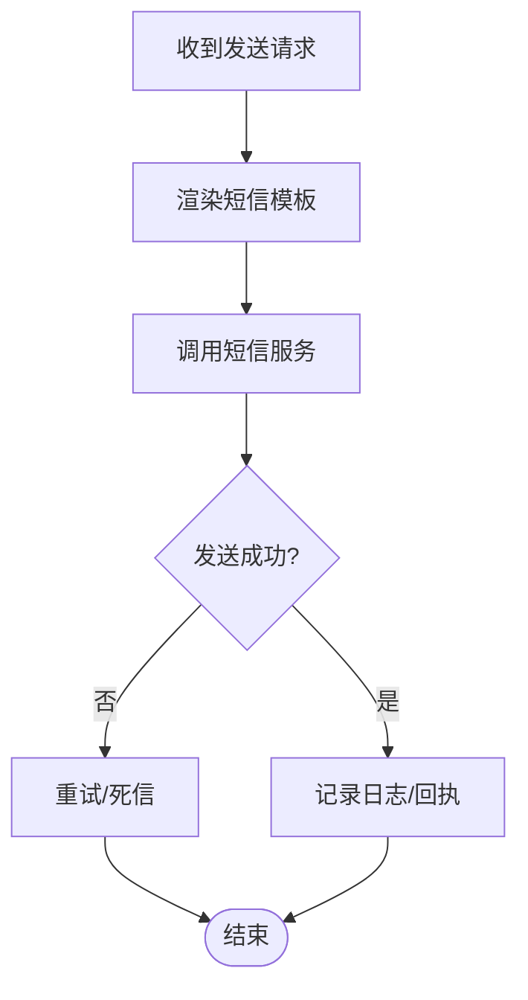
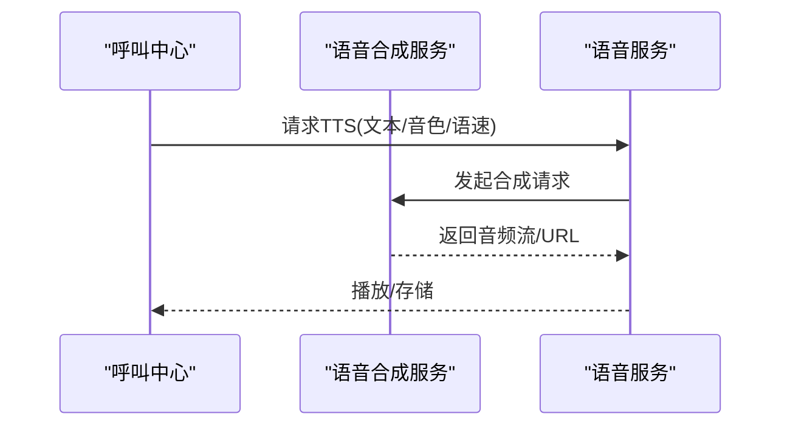
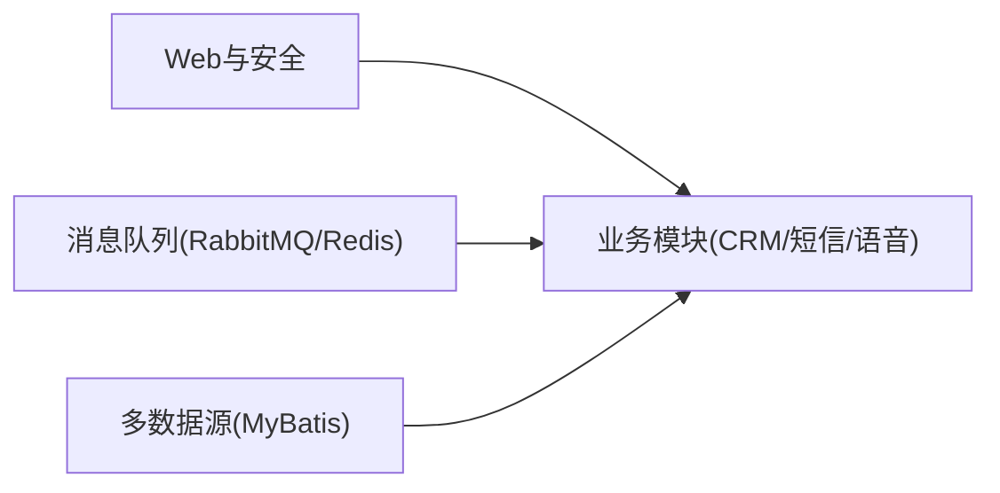

# 第三方系统集成

<cite>
**本文引用的文件**
- [yudao-spring-boot-starter-mq: YudaoRabbitMQAutoConfiguration.java](file://yudao-cloud/yudao-framework/yudao-spring-boot-starter-mq/src/main/java/cn/iocoder/yudao/framework/mq/rabbitmq/config/YudaoRabbitMQAutoConfiguration.java)
- [yudao-spring-boot-starter-mq: RedisMQTemplate.java](file://yudao-cloud/yudao-framework/yudao-spring-boot-starter-mq/src/main/java/cn/iocoder/yudao/framework/mq/redis/core/RedisMQTemplate.java)
- [yudao-spring-boot-starter-mq: RedisStreamMessageListener.java](file://yudao-cloud/yudao-framework/yudao-spring-boot-starter-mq/src/main/java/cn/iocoder/yudao/framework/mq/redis/core/stream/AbstractRedisStreamMessageListener.java)
- [yudao-spring-boot-starter-mq: RedisChannelMessageListener.java](file://yudao-cloud/yudao-framework/yudao-spring-boot-starter-mq/src/main/java/cn/iocoder/yudao/framework/mq/redis/core/pubsub/AbstractRedisChannelMessageListener.java)
- [yudao-spring-boot-starter-mybatis: YudaoDataSourceAutoConfiguration.java](file://yudao-cloud/yudao-framework/yudao-spring-boot-starter-mybatis/src/main/java/cn/iocoder/yudao/framework/datasource/config/YudaoDataSourceAutoConfiguration.java)
- [yudao-spring-boot-starter-mybatis: DataSourceEnum.java](file://yudao-cloud/yudao-framework/yudao-spring-boot-starter-mybatis/src/main/java/cn/iocoder/yudao/framework/datasource/core/enums/DataSourceEnum.java)
- [yudao-spring-boot-starter-web: GlobalExceptionHandler.java](file://yudao-cloud/yudao-framework/yudao-spring-boot-starter-web/src/main/java/cn/iocoder/yudao/framework/web/core/handler/GlobalExceptionHandler.java)
- [yudao-spring-boot-starter-web: ApiAccessLogFilter.java](file://yudao-cloud/yudao-framework/yudao-spring-boot-starter-web/src/main/java/cn/iocoder/yudao/framework/apilog/core/filter/ApiAccessLogFilter.java)
- [yudao-spring-boot-starter-security: TokenAuthenticationFilter.java](file://yudao-cloud/yudao-framework/yudao-spring-boot-starter-security/src/main/java/cn/iocoder/yudao/framework/security/core/filter/TokenAuthenticationFilter.java)
- [yudao-spring-boot-starter-security: SecurityProperties.java](file://yudao-cloud/yudao-framework/yudao-spring-boot-starter-security/src/main/java/cn/iocoder/yudao/framework/security/config/SecurityProperties.java)
- [yudao-module-crm-server: 业务服务示例（CRM）](file://yudao-cloud/yudao-module-crm/yudao-module-crm-server/src/main/java/cn/iocoder/yudao/module/crm/service)
- [yudao-module-infra-server: 短信服务集成（示例）](file://yudao-cloud/yudao-module-infra/yudao-module-infra-server/src/main/java/cn/iocoder/yudao/module/infra/service)
- [yudao-module-cc-server: 语音合成服务接入（示例）](file://yudao-cloud/yudao-module-cc/yudao-module-cc-server/src/main/java/cn/iocoder/yudao/module/cc/service)
</cite>

## 目录
1. [简介](#简介)
2. [项目结构](#项目结构)
3. [核心组件](#核心组件)
4. [架构总览](#架构总览)
5. [详细组件分析](#详细组件分析)
6. [依赖关系分析](#依赖关系分析)
7. [性能考虑](#性能考虑)
8. [故障排查指南](#故障排查指南)
9. [结论](#结论)
10. [附录](#附录)

## 简介
本文件面向第三方系统集成的工程化实践，围绕以下目标提供可落地的方案与实现指引：
- REST API 集成：HTTP 客户端配置、请求签名、重试机制、错误处理
- 消息队列集成：Kafka、RabbitMQ、RocketMQ 的配置与使用（以 RabbitMQ 自动装配为切入点，并给出 Kafka/RocketMQ 的落地建议）
- 数据库连接：多数据源管理、连接池配置、事务管理
- 典型集成示例：CRM 对接、短信服务集成、语音合成服务接入
- 安全认证、日志记录、监控告警、故障转移

## 项目结构
本项目采用模块化分层架构，框架层通过 Spring Boot Starter 提供通用能力，业务模块按需引入。与第三方集成相关的关键位置如下：
- Web 与安全：统一异常处理、访问日志、鉴权过滤器
- 消息队列：RabbitMQ 自动装配、基于 Redis 的消息模板与监听器（可作为本地/轻量替代或补充）
- 数据访问：多数据源自动装配与枚举定义
- 业务模块：CRM、基础设施（短信）、呼叫中心（语音合成）等示例

图表来源
- [yudao-spring-boot-starter-web: GlobalExceptionHandler.java](file://yudao-cloud/yudao-framework/yudao-spring-boot-starter-web/src/main/java/cn/iocoder/yudao/framework/web/core/handler/GlobalExceptionHandler.java)
- [yudao-spring-boot-starter-web: ApiAccessLogFilter.java](file://yudao-cloud/yudao-framework/yudao-spring-boot-starter-web/src/main/java/cn/iocoder/yudao/framework/apilog/core/filter/ApiAccessLogFilter.java)
- [yudao-spring-boot-starter-security: TokenAuthenticationFilter.java](file://yudao-cloud/yudao-framework/yudao-spring-boot-starter-security/src/main/java/cn/iocoder/yudao/framework/security/core/filter/TokenAuthenticationFilter.java)
- [yudao-spring-boot-starter-mq: YudaoRabbitMQAutoConfiguration.java](file://yudao-cloud/yudao-framework/yudao-spring-boot-starter-mq/src/main/java/cn/iocoder/yudao/framework/mq/rabbitmq/config/YudaoRabbitMQAutoConfiguration.java)
- [yudao-spring-boot-starter-mq: RedisMQTemplate.java](file://yudao-cloud/yudao-framework/yudao-spring-boot-starter-mq/src/main/java/cn/iocoder/yudao/framework/mq/redis/core/RedisMQTemplate.java)
- [yudao-spring-boot-starter-mybatis: YudaoDataSourceAutoConfiguration.java](file://yudao-cloud/yudao-framework/yudao-spring-boot-starter-mybatis/src/main/java/cn/iocoder/yudao/framework/datasource/config/YudaoDataSourceAutoConfiguration.java)
- [yudao-spring-boot-starter-mybatis: DataSourceEnum.java](file://yudao-cloud/yudao-framework/yudao-spring-boot-starter-mybatis/src/main/java/cn/iocoder/yudao/framework/datasource/core/enums/DataSourceEnum.java)

章节来源
- [yudao-spring-boot-starter-web: GlobalExceptionHandler.java](file://yudao-cloud/yudao-framework/yudao-spring-boot-starter-web/src/main/java/cn/iocoder/yudao/framework/web/core/handler/GlobalExceptionHandler.java)
- [yudao-spring-boot-starter-web: ApiAccessLogFilter.java](file://yudao-cloud/yudao-framework/yudao-spring-boot-starter-web/src/main/java/cn/iocoder/yudao/framework/apilog/core/filter/ApiAccessLogFilter.java)
- [yudao-spring-boot-starter-security: TokenAuthenticationFilter.java](file://yudao-cloud/yudao-framework/yudao-spring-boot-starter-security/src/main/java/cn/iocoder/yudao/framework/security/core/filter/TokenAuthenticationFilter.java)
- [yudao-spring-boot-starter-mq: YudaoRabbitMQAutoConfiguration.java](file://yudao-cloud/yudao-framework/yudao-spring-boot-starter-mq/src/main/java/cn/iocoder/yudao/framework/mq/rabbitmq/config/YudaoRabbitMQAutoConfiguration.java)
- [yudao-spring-boot-starter-mq: RedisMQTemplate.java](file://yudao-cloud/yudao-framework/yudao-spring-boot-starter-mq/src/main/java/cn/iocoder/yudao/framework/mq/redis/core/RedisMQTemplate.java)
- [yudao-spring-boot-starter-mybatis: YudaoDataSourceAutoConfiguration.java](file://yudao-cloud/yudao-framework/yudao-spring-boot-starter-mybatis/src/main/java/cn/iocoder/yudao/framework/datasource/config/YudaoDataSourceAutoConfiguration.java)
- [yudao-spring-boot-starter-mybatis: DataSourceEnum.java](file://yudao-cloud/yudao-framework/yudao-spring-boot-starter-mybatis/src/main/java/cn/iocoder/yudao/framework/datasource/core/enums/DataSourceEnum.java)

## 核心组件
- 统一异常处理：集中捕获并标准化返回体，便于上游网关/调用方统一处理
- 访问日志：对入站请求进行结构化记录，包含方法、路径、耗时、状态码等
- 安全鉴权：基于令牌的过滤器链，支持跨进程上下文传递
- 消息队列：RabbitMQ 自动装配；同时提供基于 Redis 的消息模板与监听器，便于本地开发或降级
- 多数据源：自动装配与数据源枚举，支撑读写分离或多租户场景

章节来源
- [yudao-spring-boot-starter-web: GlobalExceptionHandler.java](file://yudao-cloud/yudao-framework/yudao-spring-boot-starter-web/src/main/java/cn/iocoder/yudao/framework/web/core/handler/GlobalExceptionHandler.java)
- [yudao-spring-boot-starter-web: ApiAccessLogFilter.java](file://yudao-cloud/yudao-framework/yudao-spring-boot-starter-web/src/main/java/cn/iocoder/yudao/framework/apilog/core/filter/ApiAccessLogFilter.java)
- [yudao-spring-boot-starter-security: TokenAuthenticationFilter.java](file://yudao-cloud/yudao-framework/yudao-spring-boot-starter-security/src/main/java/cn/iocoder/yudao/framework/security/core/filter/TokenAuthenticationFilter.java)
- [yudao-spring-boot-starter-mq: YudaoRabbitMQAutoConfiguration.java](file://yudao-cloud/yudao-framework/yudao-spring-boot-starter-mq/src/main/java/cn/iocoder/yudao/framework/mq/rabbitmq/config/YudaoRabbitMQAutoConfiguration.java)
- [yudao-spring-boot-starter-mq: RedisMQTemplate.java](file://yudao-cloud/yudao-framework/yudao-spring-boot-starter-mq/src/main/java/cn/iocoder/yudao/framework/mq/redis/core/RedisMQTemplate.java)
- [yudao-spring-boot-starter-mybatis: YudaoDataSourceAutoConfiguration.java](file://yudao-cloud/yudao-framework/yudao-spring-boot-starter-mybatis/src/main/java/cn/iocoder/yudao/framework/datasource/config/YudaoDataSourceAutoConfiguration.java)
- [yudao-spring-boot-starter-mybatis: DataSourceEnum.java](file://yudao-cloud/yudao-framework/yudao-spring-boot-starter-mybatis/src/main/java/cn/iocoder/yudao/framework/datasource/core/enums/DataSourceEnum.java)

## 架构总览
下图展示了从外部系统到内部服务的典型调用链路，涵盖安全、日志、消息与数据访问等横切关注点。

图表来源
- [yudao-spring-boot-starter-security: TokenAuthenticationFilter.java](file://yudao-cloud/yudao-framework/yudao-spring-boot-starter-security/src/main/java/cn/iocoder/yudao/framework/security/core/filter/TokenAuthenticationFilter.java)
- [yudao-spring-boot-starter-web: ApiAccessLogFilter.java](file://yudao-cloud/yudao-framework/yudao-spring-boot-starter-web/src/main/java/cn/iocoder/yudao/framework/apilog/core/filter/ApiAccessLogFilter.java)
- [yudao-spring-boot-starter-mq: YudaoRabbitMQAutoConfiguration.java](file://yudao-cloud/yudao-framework/yudao-spring-boot-starter-mq/src/main/java/cn/iocoder/yudao/framework/mq/rabbitmq/config/YudaoRabbitMQAutoConfiguration.java)
- [yudao-spring-boot-starter-mybatis: YudaoDataSourceAutoConfiguration.java](file://yudao-cloud/yudao-framework/yudao-spring-boot-starter-mybatis/src/main/java/cn/iocoder/yudao/framework/datasource/config/YudaoDataSourceAutoConfiguration.java)

## 详细组件分析

### REST API 集成（HTTP 客户端、签名、重试、错误处理）
- HTTP 客户端配置
  - 建议在业务模块中封装统一的 HTTP 客户端，设置超时、连接池大小、重试策略
  - 结合网关/代理进行限流与熔断
- 请求签名
  - 在过滤器或拦截器中注入签名逻辑，确保时间戳、随机数、签名算法一致
  - 将签名参数纳入访问日志，便于审计与排障
- 重试机制
  - 针对幂等接口启用指数退避重试；非幂等接口谨慎重试
  - 结合消息队列做最终一致性补偿
- 错误处理
  - 利用全局异常处理器统一包装错误码与消息
  - 对外暴露标准错误格式，便于调用方解析

章节来源
- [yudao-spring-boot-starter-web: GlobalExceptionHandler.java](file://yudao-cloud/yudao-framework/yudao-spring-boot-starter-web/src/main/java/cn/iocoder/yudao/framework/web/core/handler/GlobalExceptionHandler.java)
- [yudao-spring-boot-starter-web: ApiAccessLogFilter.java](file://yudao-cloud/yudao-framework/yudao-spring-boot-starter-web/src/main/java/cn/iocoder/yudao/framework/apilog/core/filter/ApiAccessLogFilter.java)

### 消息队列集成（Kafka、RabbitMQ、RocketMQ）
- RabbitMQ
  - 通过自动装配类快速启用生产者/消费者能力
  - 结合业务服务进行解耦与削峰填谷
- Kafka/RocketMQ
  - 在本仓库中未直接发现对应自动装配类，建议参考 RabbitMQ 模式，引入各自官方 Starter 并复用统一的发送/消费抽象
  - 保证消息幂等、顺序性、死信队列与重试策略
- Redis 消息（本地/降级）
  - 提供 Redis MQ 模板与监听器，适用于开发调试或作为 MQ 不可用时的降级通道

图表来源
- [yudao-spring-boot-starter-mq: YudaoRabbitMQAutoConfiguration.java](file://yudao-cloud/yudao-framework/yudao-spring-boot-starter-mq/src/main/java/cn/iocoder/yudao/framework/mq/rabbitmq/config/YudaoRabbitMQAutoConfiguration.java)
- [yudao-spring-boot-starter-mq: RedisMQTemplate.java](file://yudao-cloud/yudao-framework/yudao-spring-boot-starter-mq/src/main/java/cn/iocoder/yudao/framework/mq/redis/core/RedisMQTemplate.java)

章节来源
- [yudao-spring-boot-starter-mq: YudaoRabbitMQAutoConfiguration.java](file://yudao-cloud/yudao-framework/yudao-spring-boot-starter-mq/src/main/java/cn/iocoder/yudao/framework/mq/rabbitmq/config/YudaoRabbitMQAutoConfiguration.java)
- [yudao-spring-boot-starter-mq: RedisMQTemplate.java](file://yudao-cloud/yudao-framework/yudao-spring-boot-starter-mq/src/main/java/cn/iocoder/yudao/framework/mq/redis/core/RedisMQTemplate.java)
- [yudao-spring-boot-starter-mq: AbstractRedisStreamMessageListener.java](file://yudao-cloud/yudao-framework/yudao-spring-boot-starter-mq/src/main/java/cn/iocoder/yudao/framework/mq/redis/core/stream/AbstractRedisStreamMessageListener.java)
- [yudao-spring-boot-starter-mq: AbstractRedisChannelMessageListener.java](file://yudao-cloud/yudao-framework/yudao-spring-boot-starter-mq/src/main/java/cn/iocoder/yudao/framework/mq/redis/core/pubsub/AbstractRedisChannelMessageListener.java)

### 数据库连接（多数据源、连接池、事务）
- 多数据源
  - 通过自动装配类注册多个数据源，配合枚举标识主从/业务库
  - 在 DAO/Service 层按数据源切换或使用注解路由
- 连接池
  - 合理配置最大连接数、空闲回收、超时时间，避免连接泄漏
- 事务
  - 在 Service 层使用声明式事务，控制粒度与传播行为
  - 跨数据源事务建议使用分布式事务或最终一致性方案

图表来源
- [yudao-spring-boot-starter-mybatis: YudaoDataSourceAutoConfiguration.java](file://yudao-cloud/yudao-framework/yudao-spring-boot-starter-mybatis/src/main/java/cn/iocoder/yudao/framework/datasource/config/YudaoDataSourceAutoConfiguration.java)
- [yudao-spring-boot-starter-mybatis: DataSourceEnum.java](file://yudao-cloud/yudao-framework/yudao-spring-boot-starter-mybatis/src/main/java/cn/iocoder/yudao/framework/datasource/core/enums/DataSourceEnum.java)

章节来源
- [yudao-spring-boot-starter-mybatis: YudaoDataSourceAutoConfiguration.java](file://yudao-cloud/yudao-framework/yudao-spring-boot-starter-mybatis/src/main/java/cn/iocoder/yudao/framework/datasource/config/YudaoDataSourceAutoConfiguration.java)
- [yudao-spring-boot-starter-mybatis: DataSourceEnum.java](file://yudao-cloud/yudao-framework/yudao-spring-boot-starter-mybatis/src/main/java/cn/iocoder/yudao/framework/datasource/core/enums/DataSourceEnum.java)

### 安全认证、日志记录、监控告警、故障转移
- 安全认证
  - 基于令牌的过滤器链，支持跨线程上下文传递
  - 可通过配置项调整白名单、过期策略等
- 日志记录
  - 访问日志过滤器记录关键请求信息，便于追踪与审计
- 监控告警
  - 结合 Actuator/指标采集，对错误率、延迟、队列积压等进行监控
- 故障转移
  - 对下游依赖增加熔断/降级策略，结合消息队列实现最终一致性

章节来源
- [yudao-spring-boot-starter-security: TokenAuthenticationFilter.java](file://yudao-cloud/yudao-framework/yudao-spring-boot-starter-security/src/main/java/cn/iocoder/yudao/framework/security/core/filter/TokenAuthenticationFilter.java)
- [yudao-spring-boot-starter-security: SecurityProperties.java](file://yudao-cloud/yudao-framework/yudao-spring-boot-starter-security/src/main/java/cn/iocoder/yudao/framework/security/config/SecurityProperties.java)
- [yudao-spring-boot-starter-web: ApiAccessLogFilter.java](file://yudao-cloud/yudao-framework/yudao-spring-boot-starter-web/src/main/java/cn/iocoder/yudao/framework/apilog/core/filter/ApiAccessLogFilter.java)

### 集成示例

#### CRM 系统对接
- 目标：同步客户/线索/合同等数据，或触发营销自动化流程
- 要点：
  - 使用统一 HTTP 客户端调用 CRM 开放接口，携带签名与鉴权头
  - 失败时进入重试队列，成功后通过消息驱动后续流程
  - 数据变更落库后，发布领域事件供其他服务订阅

章节来源
- [yudao-module-crm-server: 业务服务示例（CRM）](file://yudao-cloud/yudao-module-crm/yudao-module-crm-server/src/main/java/cn/iocoder/yudao/module/crm/service)

#### 短信服务集成
- 目标：发送验证码、通知、营销短信
- 要点：
  - 封装短信 SDK 或 HTTP 客户端，统一模板渲染与发送
  - 发送失败走重试与死信队列，保障送达率
  - 记录发送日志与回执回调

章节来源
- [yudao-module-infra-server: 短信服务集成（示例）](file://yudao-cloud/yudao-module-infra/yudao-module-infra-server/src/main/java/cn/iocoder/yudao/module/infra/service)

#### 语音合成服务接入
- 目标：将文本转为语音，用于 IVR、外呼等场景
- 要点：
  - 调用语音合成 API，处理音频流下载与缓存
  - 失败重试与降级（如切换供应商）
  - 与呼叫中心流程编排联动

章节来源
- [yudao-module-cc-server: 语音合成服务接入（示例）](file://yudao-cloud/yudao-module-cc/yudao-module-cc-server/src/main/java/cn/iocoder/yudao/module/cc/service)

## 依赖关系分析
- 模块耦合
  - Web 与安全为横切基础，被所有业务模块依赖
  - 消息与数据访问为横向能力，业务模块按需引入
- 外部依赖
  - RabbitMQ 自动装配提供开箱即用能力
  - Redis MQ 作为本地/降级通道
  - 多数据源自动装配简化配置

图表来源
- [yudao-spring-boot-starter-web: GlobalExceptionHandler.java](file://yudao-cloud/yudao-framework/yudao-spring-boot-starter-web/src/main/java/cn/iocoder/yudao/framework/web/core/handler/GlobalExceptionHandler.java)
- [yudao-spring-boot-starter-mq: YudaoRabbitMQAutoConfiguration.java](file://yudao-cloud/yudao-framework/yudao-spring-boot-starter-mq/src/main/java/cn/iocoder/yudao/framework/mq/rabbitmq/config/YudaoRabbitMQAutoConfiguration.java)
- [yudao-spring-boot-starter-mybatis: YudaoDataSourceAutoConfiguration.java](file://yudao-cloud/yudao-framework/yudao-spring-boot-starter-mybatis/src/main/java/cn/iocoder/yudao/framework/datasource/config/YudaoDataSourceAutoConfiguration.java)

章节来源
- [yudao-spring-boot-starter-web: GlobalExceptionHandler.java](file://yudao-cloud/yudao-framework/yudao-spring-boot-starter-web/src/main/java/cn/iocoder/yudao/framework/web/core/handler/GlobalExceptionHandler.java)
- [yudao-spring-boot-starter-mq: YudaoRabbitMQAutoConfiguration.java](file://yudao-cloud/yudao-framework/yudao-spring-boot-starter-mq/src/main/java/cn/iocoder/yudao/framework/mq/rabbitmq/config/YudaoRabbitMQAutoConfiguration.java)
- [yudao-spring-boot-starter-mybatis: YudaoDataSourceAutoConfiguration.java](file://yudao-cloud/yudao-framework/yudao-spring-boot-starter-mybatis/src/main/java/cn/iocoder/yudao/framework/datasource/config/YudaoDataSourceAutoConfiguration.java)

## 性能考虑
- HTTP 客户端
  - 合理设置连接池大小与超时，避免资源耗尽
  - 对大对象传输启用压缩与分片
- 消息队列
  - 批量发送与消费，减少网络往返
  - 合理分区与并发度，避免热点与背压
- 数据库
  - 连接池参数根据负载调优，避免频繁创建销毁
  - 读写分离与缓存命中，降低数据库压力
- 监控
  - 采集关键指标（QPS、延迟、错误率、队列长度），设置阈值告警

[本节为通用指导，不直接引用具体文件]

## 故障排查指南
- 常见问题定位
  - 统一异常处理器输出标准化错误，便于快速定位
  - 访问日志记录请求全链路信息，辅助问题复现
  - 消息消费失败查看重试次数与死信队列
- 排查步骤
  - 检查安全过滤器是否放行
  - 核对签名与鉴权头是否正确
  - 验证消息队列连通性与消费者状态
  - 检查数据源连接池与慢查询

章节来源
- [yudao-spring-boot-starter-web: GlobalExceptionHandler.java](file://yudao-cloud/yudao-framework/yudao-spring-boot-starter-web/src/main/java/cn/iocoder/yudao/framework/web/core/handler/GlobalExceptionHandler.java)
- [yudao-spring-boot-starter-web: ApiAccessLogFilter.java](file://yudao-cloud/yudao-framework/yudao-spring-boot-starter-web/src/main/java/cn/iocoder/yudao/framework/apilog/core/filter/ApiAccessLogFilter.java)
- [yudao-spring-boot-starter-security: TokenAuthenticationFilter.java](file://yudao-cloud/yudao-framework/yudao-spring-boot-starter-security/src/main/java/cn/iocoder/yudao/framework/security/core/filter/TokenAuthenticationFilter.java)

## 结论
本方案基于框架层的通用能力，提供了 REST API、消息队列、数据库连接与典型业务集成的完整路径。通过统一的安全、日志与异常处理，结合消息与多数据源能力，可实现高可用、可扩展的第三方系统集成。建议在生产环境完善监控告警与演练，持续优化性能与稳定性。

## 附录
- 配置建议
  - 安全：令牌有效期、白名单、跨域策略
  - 消息：重试次数、死信队列、消费者并发
  - 数据源：连接池大小、超时、隔离策略
- 最佳实践
  - 幂等设计、最终一致性、可观测性优先
  - 灰度发布与回滚预案

[本节为通用指导，不直接引用具体文件]