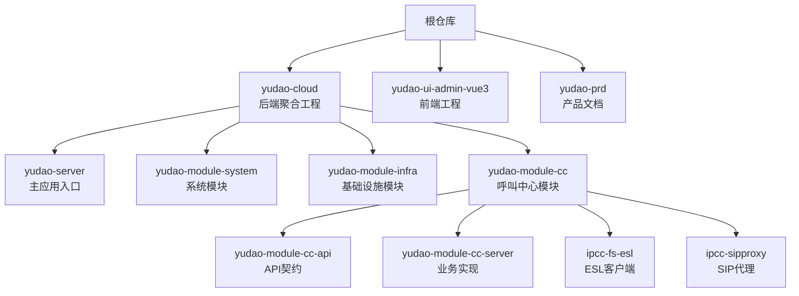
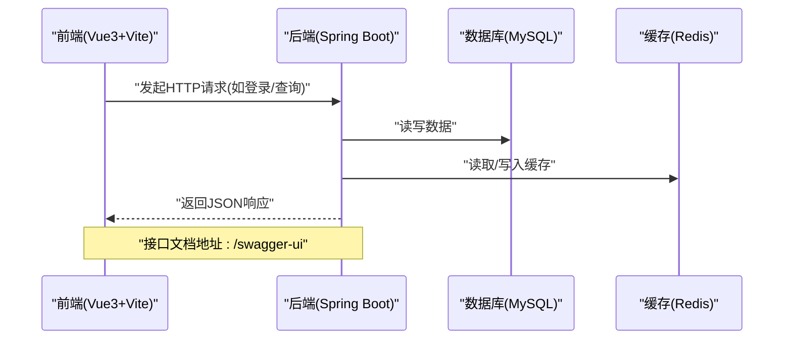
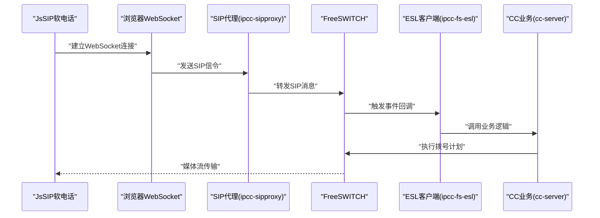

# 快速开始

<cite>
**本文引用的文件**
- [AGENTS.md](file://AGENTS.md)
- [README.md](file://README.md)
- [.gitmodules](file://.gitmodules)
- [yudao-cloud/pom.xml](file://yudao-cloud/pom.xml)
- [yudao-ui-admin-vue3/package.json](file://yudao-ui-admin-vue3/package.json)
- [yudao-ui-admin-vue3/vite.config.ts](file://yudao-ui-admin-vue3/vite.config.ts)
- [yudao-cloud/yudao-server/src/main/resources/application.yaml](file://yudao-cloud/yudao-server/src/main/resources/application.yaml)
- [yudao-cloud/yudao-server/src/main/resources/application-local.yaml](file://yudao-cloud/yudao-server/src/main/resources/application-local.yaml)
</cite>

## 更新摘要
**变更内容**
- 从AGENTS.md迁移了完整的项目结构、构建命令和服务启动流程
- 更新了技术栈版本信息（Java 17 + Spring Boot 3.5、Vue 3.5 + Vite 8）
- 增强了呼叫中心模块的详细架构说明
- 补充了完整的后端和前端构建命令
- 添加了详细的故障排查指南和关键约束说明

## 目录
1. [简介](#简介)
2. [项目结构](#项目结构)
3. [环境准备](#环境准备)
4. [Git子模块初始化](#git子模块初始化)
5. [IDE配置](#ide配置)
6. [后端环境搭建](#后端环境搭建)
7. [前端环境搭建](#前端环境搭建)
8. [服务启动与验证](#服务启动与验证)
9. [架构总览](#架构总览)
10. [呼叫链路详解](#呼叫链路详解)
11. [IVR流程引擎](#ivr流程引擎)
12. [关键约束与陷阱](#关键约束与陷阱)
13. [开发与验证](#开发与验证)
14. [故障排查指南](#故障排查指南)
15. [结论](#结论)

## 简介
本指南面向首次接触IPCC呼叫中心系统的新用户，提供从零到运行的完整步骤：包括环境准备、Git子模块初始化、IDE配置（IntelliJ IDEA Multi-Project Workspace插件）、前后端开发环境搭建与启动、常见问题的解决方案。目标是让你在最短时间内成功运行项目并开展开发工作。

本项目是基于yudao-cloud二次开发的呼叫中心系统，由三个独立Git仓库（git submodule）组成，各自独立提交与分支。

## 项目结构
本项目采用"后端单体聚合工程 + 前端独立工程"的布局：

| 目录 | 说明 | 技术栈 |
|---|---|---|
| `yudao-cloud/` | 后端微服务（含自定义呼叫中心模块 `yudao-module-cc`） | Java 17 + Spring Boot 3.5 + Maven 多模块 |
| `yudao-ui-admin-vue3/` | 管理后台前端 | Vue 3.5 + TypeScript + Vite 8 + Element Plus + pnpm |
| `yudao-prd/` | 产品需求文档静态站点（纯 HTML，无构建） | Vue 3 CDN + Element Plus |



**章节来源**
- [AGENTS.md:5-15](file://AGENTS.md#L5-L15)
- [.gitmodules:1-12](file://.gitmodules#L1-L12)
- [yudao-cloud/pom.xml:10-33](file://yudao-cloud/pom.xml#L10-L33)

## 环境准备
### 必需软件
- **Java 17**：后端开发环境
- **Maven 3.x**：后端构建工具
- **Node.js >= 20.19.0**：前端开发环境
- **pnpm >= 8.6.0**：前端包管理器
- **MySQL**：数据库服务
- **Redis**：缓存服务

### 可选软件
- **IntelliJ IDEA**：推荐的后端IDE
- **VS Code**：推荐的前端编辑器

## Git子模块初始化
克隆仓库后，需拉取子模块：

```bash
# 克隆主仓库
git clone <repository-url>
cd ipcc

# 初始化并更新子模块
git submodule update --init --recursive
```

**注意**：子模块内已有更详细的AGENTS.md，进入对应目录工作前先阅读：
- `yudao-prd/AGENTS.md`
- `yudao-cloud/yudao-module-cc/ipcc-fs-esl/AGENTS.md`
- `yudao-cloud/yudao-module-cc/ipcc-sipproxy/AGENTS.md`

**章节来源**
- [AGENTS.md:7-15](file://AGENTS.md#L7-L15)
- [README.md:9-15](file://README.md#L9-L15)

## IDE配置
### IntelliJ IDEA配置
1. **安装插件**：Multi-Project Workspace
2. **打开项目**：使用IDEA打开根仓库，IDE将识别为多项目工作区
3. **同时编辑**：可同时打开前后端代码进行AI协同开发

### VS Code配置
推荐使用以下扩展：
- Vue Language Features (Volar)
- ESLint
- Prettier
- EditorConfig for VS Code

**章节来源**
- [AGENTS.md:83](file://AGENTS.md#L83)
- [README.md:17-23](file://README.md#L17-L23)

## 后端环境搭建
### 技术栈版本
- **Java 17**
- **Spring Boot 3.5.15**
- **Maven多模块架构**

### 构建与编译
```bash
# 全量构建（按依赖顺序 api → fs-esl → sipproxy → server）
cd yudao-cloud && mvn clean install -DskipTests

# 单模块编译（-am 连带依赖模块）
mvn -pl yudao-module-cc/yudao-module-cc-server -am compile

# 运行测试（JUnit 5 + Mockito，surefire 3.5）
mvn test

# 单个测试类（在目标模块目录下执行）
cd yudao-module-cc/yudao-module-cc-server && mvn test -Dtest=FlowConditionEvaluatorTest
```

### 核心模块说明
- **yudao-server**：聚合启动容器（dev环境端口48080，spring.profiles.active=dev）
- **yudao-module-cc**：呼叫中心核心模块，包含四个子模块：
  - `yudao-module-cc-api`：API契约、常量与枚举
  - `yudao-module-cc-server`：呼叫中心业务（坐席、外呼、IVR、录音、TTS/ASR、WebSocket总线），独立启动端口48089
  - `ipcc-fs-esl`：Netty重写的FreeSWITCH ESL客户端组件（传输层，不含业务）
  - `ipcc-sipproxy`：SIP over WebSocket B2BUA代理组件（13个扩展点接口与父程序解耦）

**章节来源**
- [AGENTS.md:17-67](file://AGENTS.md#L17-L67)
- [yudao-cloud/pom.xml:39-53](file://yudao-cloud/pom.xml#L39-L53)

## 前端环境搭建
### 技术栈版本
- **Vue 3.5.34**
- **TypeScript 6.0.3**
- **Vite 8.1.4**
- **Element Plus 2.13.7**
- **pnpm 8.6.0+**

### 安装与构建
```bash
# 进入前端目录
cd yudao-ui-admin-vue3

# 安装依赖
pnpm install

# 本地开发（--mode env.local，默认端口80，Vite热更新）
pnpm dev

# 生产构建（另有 build:dev / build:test / build:stage / build:local）
pnpm build:prod

# TypeScript类型检查
pnpm ts:check

# 代码检查（eslint + stylelint + prettier）
pnpm lint
```

### 环境配置
前端通过`.env` + `.env.{mode}`注入环境变量：
- `.env.local`指向`http://localhost:48080`
- 生产环境`VITE_BASE_URL`指向`https://cc.wenmoqi.top`
- WebSocket走`wss://cc.wenmoqi.top/cc/ws`与`/sipproxy/ws`（nginx WSS代理）

**章节来源**
- [AGENTS.md:34-46](file://AGENTS.md#L34-L46)
- [AGENTS.md:68-72](file://AGENTS.md#L68-L72)
- [yudao-ui-admin-vue3/package.json:7-29](file://yudao-ui-admin-vue3/package.json#L7-L29)
- [yudao-ui-admin-vue3/.env.local:1-41](file://yudao-ui-admin-vue3/.env.local#L1-L41)

## 服务启动与验证
### 后端启动
1. 确保MySQL和Redis服务已启动
2. 修改配置文件中的数据库连接信息（application-local.yaml）
3. 在IDEA中运行yudao-server主类或通过Maven命令启动
4. 访问Swagger文档：`http://localhost:48080/swagger-ui`

### 前端启动
1. 确保后端服务已启动
2. 在前端目录执行`pnpm dev`
3. 访问前端页面：`http://localhost:80`

### 服务验证
- 后端健康检查：`http://localhost:48080/actuator/health`
- 前端页面功能测试
- WebSocket连接验证

**章节来源**
- [yudao-cloud/yudao-server/src/main/resources/application-local.yaml:1-2](file://yudao-cloud/yudao-server/src/main/resources/application-local.yaml#L1-L2)
- [yudao-ui-admin-vue3/vite.config.ts:31-47](file://yudao-ui-admin-vue3/vite.config.ts#L31-L47)

## 架构总览
下图展示了从前端到后端的请求路径以及关键配置点：



**图表来源**
- [yudao-cloud/yudao-server/src/main/resources/application.yaml:56-69](file://yudao-cloud/yudao-server/src/main/resources/application.yaml#L56-L69)
- [yudao-cloud/yudao-server/src/main/resources/application-local.yaml:1-2](file://yudao-cloud/yudao-server/src/main/resources/application-local.yaml#L1-L2)
- [yudao-ui-admin-vue3/vite.config.ts:31-47](file://yudao-ui-admin-vue3/vite.config.ts#L31-L47)

## 呼叫链路详解
呼叫链路涉及多个组件的协作：



**图表来源**
- [AGENTS.md:60-63](file://AGENTS.md#L60-L63)

**章节来源**
- [AGENTS.md:60-63](file://AGENTS.md#L60-L63)

## IVR流程引擎
`cc-server`的`ivr/`包实现状态机驱动的IVR流程引擎：
- `handler/node/`下每个节点类型一个处理器（start / condition / playback / receive / transfer / end / hangup / satisfaction / method）
- 节点间通过`dto/`流转输出值
- 流程状态持久化到Redis（`config/` + `properties/`）

**章节来源**
- [AGENTS.md:64-67](file://AGENTS.md#L64-L67)

## 关键约束与陷阱
### 软电话心跳
- SIP代理WebSocket空闲超时`sipproxy.heartbeat.idle-timeout=90s`
- JsSIP客户端OPTIONS心跳间隔必须小于该值（`SoftPhone.vue`中`KEEP_ALIVE_INTERVAL=30s`）
- 修改任一侧需联动验证，否则坐席注册后会被僵尸会话清理，导致来话失败

### fs-esl约束
- 仅支持Inbound模式
- 事件订阅与命令必须异步（Netty IO线程内阻塞`.get()`会死锁）
- API命令必须带`api`前缀，bgapi是平级独立命令

### WebSocket sender-type一致性
- `cc.websocket.sender-type`必须与`yudao.websocket.sender-type`一致
- 否则分布式环境下CC消息无法跨节点投递

### 编译要求
- 根pom已配置Lombok + MapStruct注解处理器与`-parameters`编译参数
- JAIN-SIP版本必须统一为1.2.1.4，避免跨版本AbstractMethodError

### 提交注意
- 三个子仓库各自独立提交推送，需在对应目录内执行git操作

**章节来源**
- [AGENTS.md:73-79](file://AGENTS.md#L73-L79)

## 开发与验证
### IDE工作空间
- 需安装Multi-Project Workspace插件以同时打开前后端
- 项目加载异常时删除`.idea`下除`jb-workspace.xml`外的文件后重开

### 功能验证
- 需求实现后必须启动本地服务验证
- 前端页面通过浏览器真实操作验证
- 接口/命令真实运行验证
- 发现问题立即修复并重新验证

### 调试技巧
- 本地调试优先使用ij-debugger技能获取运行时证据（变量值、调用栈、线程状态）
- 技能失效时降级原生能力

### 代码规范
- 新增/修改代码时同步维护注释
- 方法级用语言标准文档注释（含功能、入参、返回、异常）
- 业务逻辑标注需求背景、预期结果、核心处理逻辑

**章节来源**
- [AGENTS.md:81-86](file://AGENTS.md#L81-L86)

## 故障排查指南
### 项目名称显示异常
- 检查各子模块分支是否一致且正确
- 确认.gitmodules配置正确

### npm/pnpm命令无法识别
- 确认Node.js与pnpm版本满足要求
- 在IDEA中将package.json设置为JSON格式识别

### 后端启动失败
- 检查数据库与Redis连接配置是否正确
- 确认端口未被占用
- 查看日志文件定位具体错误

### 前端无法访问后端API
- 检查后端是否已启动且端口正确
- 确认跨域设置与前端请求地址一致
- 验证.env.local中的VITE_BASE_URL配置

### 呼叫功能异常
- 检查FreeSWITCH服务是否正常运行
- 验证SIP代理配置和网络连通性
- 查看WebSocket连接状态和心跳机制

**章节来源**
- [AGENTS.md:83-86](file://AGENTS.md#L83-L86)
- [README.md:23-28](file://README.md#L23-L28)

## 结论
通过以上步骤，你可以快速完成IPCC呼叫中心系统的本地环境搭建与运行。建议初次使用时先关注后端启动与接口文档，再逐步熟悉前端开发与联调流程。遇到问题时，优先检查环境与配置项，必要时参考本文的故障排查部分。

本系统提供了完整的呼叫中心解决方案，包括实时通信、IVR流程、坐席管理等核心功能。通过合理的架构设计和模块化组织，确保了系统的可扩展性和可维护性。