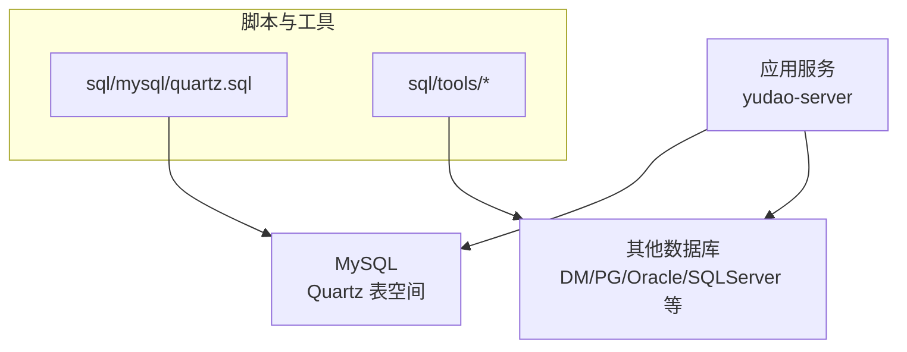
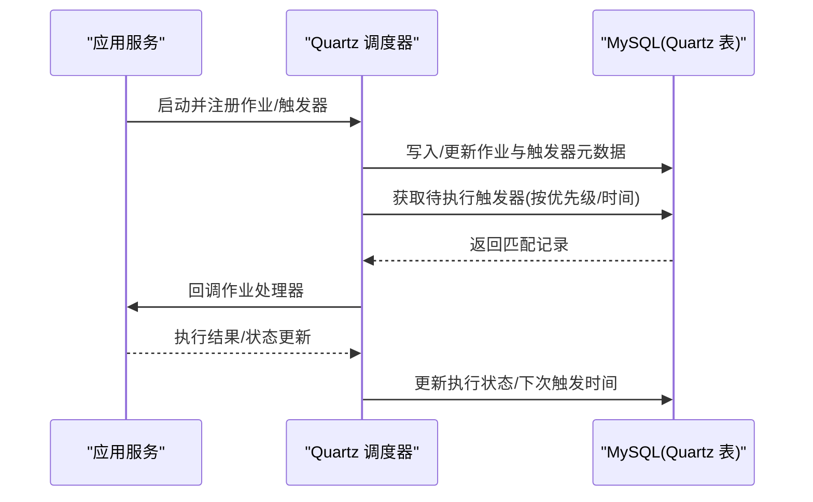
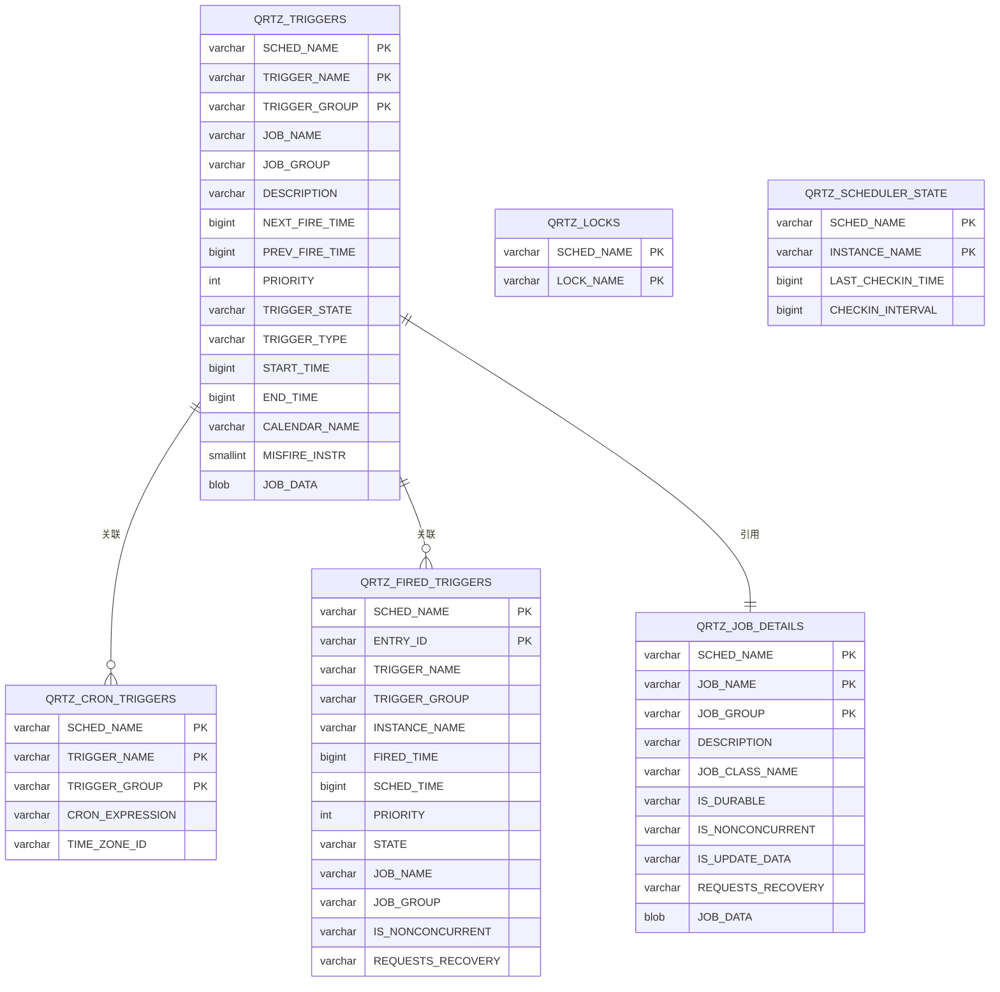
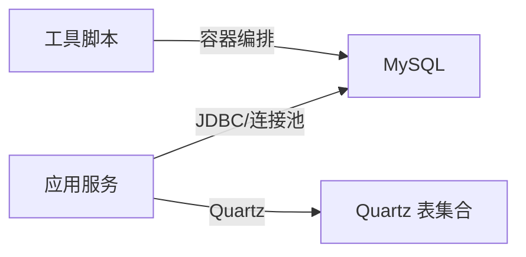

# 数据库架构

<cite>
**本文引用的文件**
- [yudao-cloud/sql/mysql/quartz.sql](file://yudao-cloud/sql/mysql/quartz.sql)
- [yudao-cloud/yudao-server/src/main/resources/application.yaml](file://yudao-cloud/yudao-server/src/main/resources/application.yaml)
- [yudao-cloud/yudao-server/src/main/resources/application-dev.yaml](file://yudao-cloud/yudao-server/src/main/resources/application-dev.yaml)
- [yudao-cloud/yudao-server/src/main/resources/application-local.yaml](file://yudao-cloud/yudao-server/src/main/resources/application-local.yaml)
- [yudao-cloud/sql/tools/README.md](file://yudao-cloud/sql/tools/README.md)
- [yudao-cloud/sql/tools/docker-compose.yaml](file://yudao-cloud/sql/tools/docker-compose.yaml)
</cite>

## 目录
1. [简介](#简介)
2. [项目结构](#项目结构)
3. [核心组件](#核心组件)
4. [架构总览](#架构总览)
5. [详细组件分析](#详细组件分析)
6. [依赖关系分析](#依赖关系分析)
7. [性能考虑](#性能考虑)
8. [故障排查指南](#故障排查指南)
9. [结论](#结论)
10. [附录](#附录)

## 简介
本文件面向本项目中的数据库架构，结合仓库中已有的 SQL 与配置资源，梳理整体设计思路、命名规范、字符集与排序规则、索引策略、定时任务表结构与使用方式，并给出可落地的性能优化建议、备份恢复方案与监控指标。由于当前仓库未包含业务库的 DDL，本文对分库分表、视图/存储过程/触发器等内容以“通用最佳实践 + 在本项目中的落地建议”形式呈现，确保与实际代码保持一致且不臆造实现细节。

## 项目结构
- 数据库脚本集中位于 sql 目录，按数据库类型分目录管理；其中 MySQL 子目录包含 Quartz 调度所需的建表与初始化数据脚本。
- 应用服务启动配置位于 yudao-server 模块的 resources 下，包含多环境配置文件（本地、开发等），用于连接数据库与中间件。
- 工具脚本位于 sql/tools，提供跨数据库环境的辅助能力说明与容器编排示例。

图表来源
- [yudao-cloud/sql/mysql/quartz.sql:1-285](file://yudao-cloud/sql/mysql/quartz.sql#L1-L285)
- [yudao-cloud/sql/tools/README.md](file://yudao-cloud/sql/tools/README.md)
- [yudao-cloud/sql/tools/docker-compose.yaml](file://yudao-cloud/sql/tools/docker-compose.yaml)

章节来源
- [yudao-cloud/sql/mysql/quartz.sql:1-285](file://yudao-cloud/sql/mysql/quartz.sql#L1-L285)
- [yudao-cloud/yudao-server/src/main/resources/application.yaml](file://yudao-cloud/yudao-server/src/main/resources/application.yaml)
- [yudao-cloud/yudao-server/src/main/resources/application-dev.yaml](file://yudao-cloud/yudao-server/src/main/resources/application-dev.yaml)
- [yudao-cloud/yudao-server/src/main/resources/application-local.yaml](file://yudao-cloud/yudao-server/src/main/resources/application-local.yaml)
- [yudao-cloud/sql/tools/README.md](file://yudao-cloud/sql/tools/README.md)
- [yudao-cloud/sql/tools/docker-compose.yaml](file://yudao-cloud/sql/tools/docker-compose.yaml)

## 核心组件
- 定时任务持久化：基于 Quartz 的 MySQL 表集合，包括作业详情、触发器、日历、锁、调度状态等，用于分布式环境下任务的可靠执行与协调。
- 多环境配置：通过 application.yaml 及环境变体文件管理数据库连接、驱动、连接池等参数，便于在不同环境中切换与调优。
- 工具与脚本：提供跨数据库兼容说明与容器化编排示例，支撑快速搭建与迁移。

章节来源
- [yudao-cloud/sql/mysql/quartz.sql:1-285](file://yudao-cloud/sql/mysql/quartz.sql#L1-L285)
- [yudao-cloud/yudao-server/src/main/resources/application.yaml](file://yudao-cloud/yudao-server/src/main/resources/application.yaml)
- [yudao-cloud/yudao-server/src/main/resources/application-dev.yaml](file://yudao-cloud/yudao-server/src/main/resources/application-dev.yaml)
- [yudao-cloud/yudao-server/src/main/resources/application-local.yaml](file://yudao-cloud/yudao-server/src/main/resources/application-local.yaml)
- [yudao-cloud/sql/tools/README.md](file://yudao-cloud/sql/tools/README.md)
- [yudao-cloud/sql/tools/docker-compose.yaml](file://yudao-cloud/sql/tools/docker-compose.yaml)

## 架构总览
下图展示应用服务与数据库之间的交互关系，重点体现 Quartz 在 MySQL 中的持久化与调度流程。

图表来源
- [yudao-cloud/sql/mysql/quartz.sql:112-136](file://yudao-cloud/sql/mysql/quartz.sql#L112-L136)
- [yudao-cloud/sql/mysql/quartz.sql:240-282](file://yudao-cloud/sql/mysql/quartz.sql#L240-L282)

## 详细组件分析

### Quartz 表结构与索引设计
- 表集合
  - 作业详情：QRTZ_JOB_DETAILS
  - 触发器：QRTZ_TRIGGERS
  - Cron 触发器：QRTZ_CRON_TRIGGERS
  - 已触发记录：QRTZ_FIRED_TRIGGERS
  - 锁与状态：QRTZ_LOCKS、QRTZ_SCHEDULER_STATE
  - 其他：QRTZ_BLOB_TRIGGERS、QRTZ_CALENDARS、QRTZ_SIMPLE_TRIGGERS、QRTZ_SIMPROP_TRIGGERS、QRTZ_PAUSED_TRIGGER_GRPS
- 索引策略
  - 主键均为复合主键，保证唯一性与定位效率。
  - 针对高频查询字段建立 BTREE 索引，如触发器组、作业组、下次触发时间、实例名等，以提升调度器扫描与筛选性能。
  - 外键约束维护触发器与作业之间的引用完整性。

图表来源
- [yudao-cloud/sql/mysql/quartz.sql:20-32](file://yudao-cloud/sql/mysql/quartz.sql#L20-L32)
- [yudao-cloud/sql/mysql/quartz.sql:40-49](file://yudao-cloud/sql/mysql/quartz.sql#L40-L49)
- [yudao-cloud/sql/mysql/quartz.sql:57-76](file://yudao-cloud/sql/mysql/quartz.sql#L57-L76)
- [yudao-cloud/sql/mysql/quartz.sql:78-103](file://yudao-cloud/sql/mysql/quartz.sql#L78-L103)
- [yudao-cloud/sql/mysql/quartz.sql:112-136](file://yudao-cloud/sql/mysql/quartz.sql#L112-L136)
- [yudao-cloud/sql/mysql/quartz.sql:138-153](file://yudao-cloud/sql/mysql/quartz.sql#L138-L153)
- [yudao-cloud/sql/mysql/quartz.sql:171-188](file://yudao-cloud/sql/mysql/quartz.sql#L171-L188)
- [yudao-cloud/sql/mysql/quartz.sql:190-203](file://yudao-cloud/sql/mysql/quartz.sql#L190-L203)
- [yudao-cloud/sql/mysql/quartz.sql:211-232](file://yudao-cloud/sql/mysql/quartz.sql#L211-L232)
- [yudao-cloud/sql/mysql/quartz.sql:240-282](file://yudao-cloud/sql/mysql/quartz.sql#L240-L282)

章节来源
- [yudao-cloud/sql/mysql/quartz.sql:1-285](file://yudao-cloud/sql/mysql/quartz.sql#L1-L285)

### 字符集与排序规则
- 统一采用 utf8mb4 字符集与 utf8mb4_unicode_ci 排序规则，确保多语言与表情符号的正确存储与比较。
- 所有相关表均显式指定引擎为 InnoDB，具备事务与行级锁特性，适合高并发场景。

章节来源
- [yudao-cloud/sql/mysql/quartz.sql:17-32](file://yudao-cloud/sql/mysql/quartz.sql#L17-L32)
- [yudao-cloud/sql/mysql/quartz.sql:40-49](file://yudao-cloud/sql/mysql/quartz.sql#L40-L49)
- [yudao-cloud/sql/mysql/quartz.sql:57-76](file://yudao-cloud/sql/mysql/quartz.sql#L57-L76)
- [yudao-cloud/sql/mysql/quartz.sql:78-103](file://yudao-cloud/sql/mysql/quartz.sql#L78-L103)
- [yudao-cloud/sql/mysql/quartz.sql:112-136](file://yudao-cloud/sql/mysql/quartz.sql#L112-L136)
- [yudao-cloud/sql/mysql/quartz.sql:138-153](file://yudao-cloud/sql/mysql/quartz.sql#L138-L153)
- [yudao-cloud/sql/mysql/quartz.sql:171-188](file://yudao-cloud/sql/mysql/quartz.sql#L171-L188)
- [yudao-cloud/sql/mysql/quartz.sql:190-203](file://yudao-cloud/sql/mysql/quartz.sql#L190-L203)
- [yudao-cloud/sql/mysql/quartz.sql:211-232](file://yudao-cloud/sql/mysql/quartz.sql#L211-L232)
- [yudao-cloud/sql/mysql/quartz.sql:240-282](file://yudao-cloud/sql/mysql/quartz.sql#L240-L282)

### 命名规范与编码标准
- 表名与列名采用大写下划线风格，符合 Quartz 官方约定，便于跨平台移植与维护。
- 所有字符串字段长度合理设置，避免过度分配或不足。
- 使用显式字符集与排序规则声明，减少隐式转换带来的性能损耗。

章节来源
- [yudao-cloud/sql/mysql/quartz.sql:20-32](file://yudao-cloud/sql/mysql/quartz.sql#L20-L32)
- [yudao-cloud/sql/mysql/quartz.sql:57-76](file://yudao-cloud/sql/mysql/quartz.sql#L57-L76)
- [yudao-cloud/sql/mysql/quartz.sql:240-282](file://yudao-cloud/sql/mysql/quartz.sql#L240-L282)

### 视图、存储过程与触发器
- 当前仓库未包含业务库的视图、存储过程与触发器定义。建议在后续业务建模中遵循以下原则：
  - 视图：仅用于只读报表与复杂查询封装，避免在视图中进行写操作。
  - 存储过程：将复杂批处理逻辑下沉至数据库层时，需评估可维护性与可测试性，优先在应用层实现。
  - 触发器：谨慎使用，避免隐藏的业务逻辑与性能陷阱；必要时用于审计或强一致性场景。

[本节为通用指导，不直接分析具体文件]

### 分库分表策略（建议）
- 现状：仓库未提供业务库 DDL，无法确认是否已实施分库分表。
- 建议：
  - 水平分表：按租户 ID、时间范围或业务域进行拆分，配合路由规则与全局 ID 生成策略。
  - 垂直分库：按领域拆分数据库，降低单库压力，提升隔离性。
  - 读写分离：在主从架构基础上，将读请求路由到从库，减轻主库负载。
  - 迁移与兼容性：利用 sql/tools 下的工具与文档，制定平滑迁移计划。

[本节为通用指导，不直接分析具体文件]

### 连接池与多数据源（建议）
- 通过 application.yaml 与环境变体文件配置数据库连接池参数（最大连接数、空闲超时、最小空闲等），根据实际负载调优。
- 在多数据源场景下，明确主从角色与读写分离策略，避免写请求误路由到从库。

章节来源
- [yudao-cloud/yudao-server/src/main/resources/application.yaml](file://yudao-cloud/yudao-server/src/main/resources/application.yaml)
- [yudao-cloud/yudao-server/src/main/resources/application-dev.yaml](file://yudao-cloud/yudao-server/src/main/resources/application-dev.yaml)
- [yudao-cloud/yudao-server/src/main/resources/application-local.yaml](file://yudao-cloud/yudao-server/src/main/resources/application-local.yaml)

## 依赖关系分析
- 应用服务依赖数据库驱动与连接池配置，通过环境变量或配置文件注入。
- Quartz 依赖 MySQL 提供的持久化表集合，确保调度信息在进程重启后仍可恢复。
- 工具脚本与容器编排支持快速搭建不同数据库环境，便于开发与测试。

图表来源
- [yudao-cloud/sql/mysql/quartz.sql:112-136](file://yudao-cloud/sql/mysql/quartz.sql#L112-L136)
- [yudao-cloud/sql/mysql/quartz.sql:240-282](file://yudao-cloud/sql/mysql/quartz.sql#L240-L282)
- [yudao-cloud/sql/tools/docker-compose.yaml](file://yudao-cloud/sql/tools/docker-compose.yaml)

章节来源
- [yudao-cloud/sql/mysql/quartz.sql:1-285](file://yudao-cloud/sql/mysql/quartz.sql#L1-L285)
- [yudao-cloud/sql/tools/docker-compose.yaml](file://yudao-cloud/sql/tools/docker-compose.yaml)

## 性能考虑
- 查询优化
  - 充分利用现有 BTREE 索引，避免全表扫描；对高频过滤条件建立合适索引。
  - 限制返回行数，分页查询时使用覆盖索引以减少回表。
  - 避免在 WHERE 中对索引列进行函数计算或隐式类型转换。
- 连接池配置
  - 根据 CPU 核数与 IO 能力调整最大连接数与队列长度，避免连接耗尽或过多上下文切换。
  - 设置合理的空闲回收与超时，防止连接泄漏。
- 缓存策略
  - 对热点字典与配置数据引入缓存层，降低数据库压力。
  - 对频繁读取且变更较少的报表数据，可采用物化视图或离线聚合表。
- 调度器优化
  - 合理设置 Quartz 的线程数与批大小，避免阻塞与争用。
  - 定期清理 QRTZ_FIRED_TRIGGERS 等日志表，控制增长。

[本节为通用指导，不直接分析具体文件]

## 故障排查指南
- 常见问题
  - 调度器无法启动：检查 Quartz 表是否存在、字符集与排序规则是否正确、外键约束是否生效。
  - 任务不执行：核对触发器状态、Cron 表达式与时区设置，查看 QRTZ_TRIGGERS 与 QRTZ_CRON_TRIGGERS。
  - 死锁与竞争：关注 QRTZ_LOCKS 与 QRTZ_SCHEDULER_STATE，确认实例心跳与锁释放正常。
- 诊断步骤
  - 查看应用日志与数据库慢查询日志，定位瓶颈。
  - 使用 EXPLAIN 分析慢查询，验证索引命中情况。
  - 通过容器编排工具快速重建环境，排除环境差异问题。

章节来源
- [yudao-cloud/sql/mysql/quartz.sql:138-153](file://yudao-cloud/sql/mysql/quartz.sql#L138-L153)
- [yudao-cloud/sql/mysql/quartz.sql:171-188](file://yudao-cloud/sql/mysql/quartz.sql#L171-L188)
- [yudao-cloud/sql/tools/docker-compose.yaml](file://yudao-cloud/sql/tools/docker-compose.yaml)

## 结论
本项目在数据库层面提供了标准化的 Quartz 持久化脚本，采用 utf8mb4 与 InnoDB 引擎，具备良好的国际化与事务支持。结合多环境配置与工具脚本，可快速搭建与运维数据库。对于业务库的分库分表、视图/存储过程/触发器以及更深入的优化策略，建议依据业务规模与演进路径逐步落地，并通过监控与压测持续验证效果。

[本节为总结性内容，不直接分析具体文件]

## 附录
- 备份与恢复建议
  - 全量备份：定期导出完整数据库快照，保留历史版本。
  - 增量备份：开启二进制日志，结合时间点恢复策略。
  - 异地容灾：将备份同步至异地存储，确保灾难恢复能力。
- 监控指标
  - 连接池：活跃连接数、等待队列长度、连接创建/销毁速率。
  - 查询性能：慢查询数量、平均响应时间、索引命中率。
  - 调度器：触发器执行成功率、失败重试次数、锁等待时长。

[本节为通用指导，不直接分析具体文件]