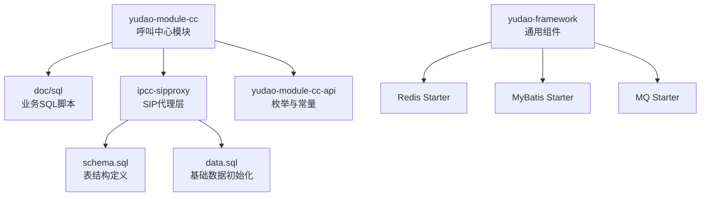
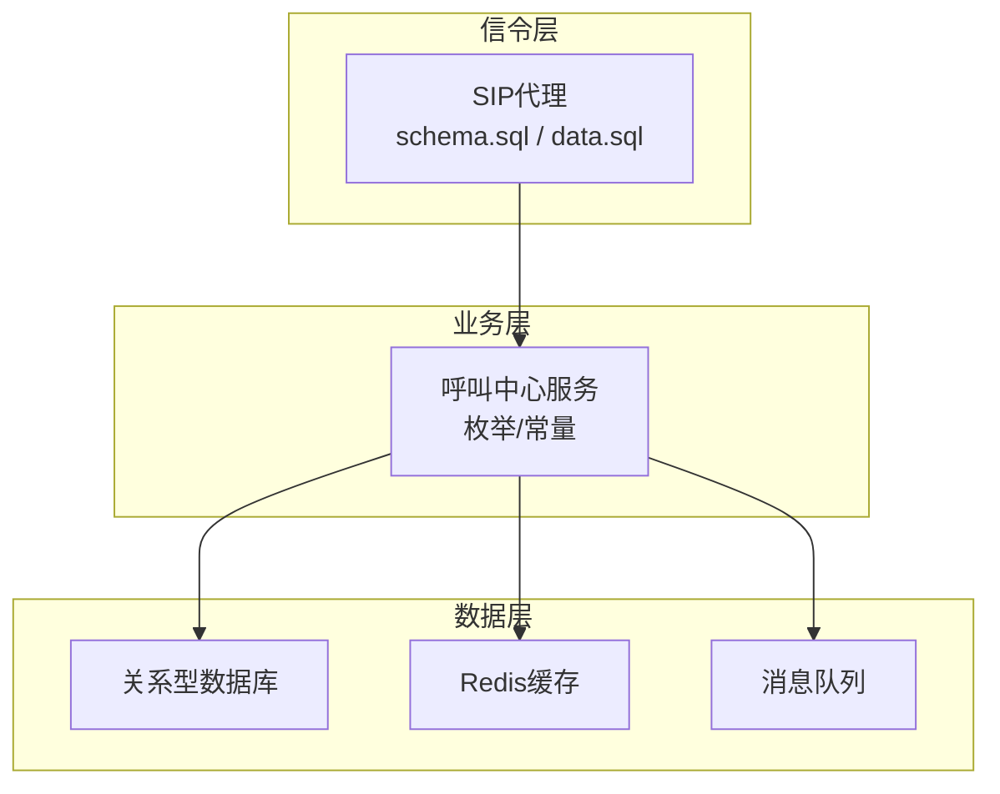
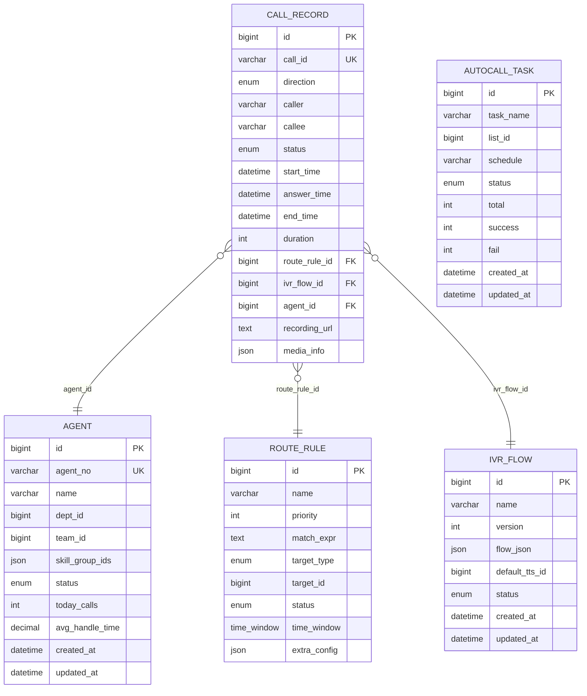
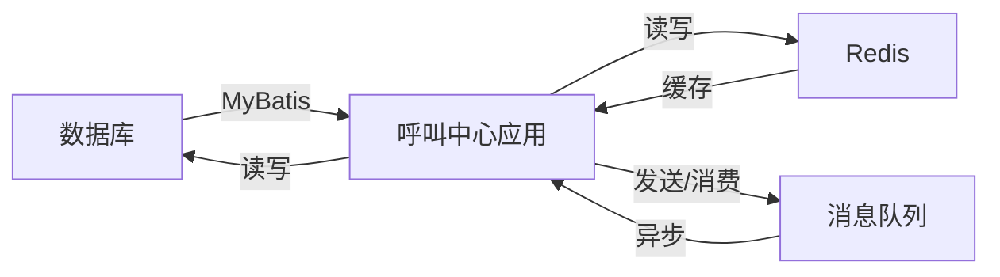

# 数据库设计

<cite>
**本文引用的文件**
- [yudao-module-cc/doc/sql/autocall_task.sql](file://yudao-cloud/yudao-module-cc/doc/sql/autocall_task.sql)
- [yudao-module-cc/doc/sql/系统数据初始化.sql](file://yudao-cloud/yudao-module-cc/doc/sql/系统数据初始化.sql)
- [yudao-module-cc/ipcc-sipproxy/src/main/resources/schema.sql](file://yudao-cloud/yudao-module-cc/ipcc-sipproxy/src/main/resources/schema.sql)
- [yudao-module-cc/ipcc-sipproxy/src/main/resources/data.sql](file://yudao-cloud/yudao-module-cc/ipcc-sipproxy/src/main/resources/data.sql)
- [yudao-module-cc/yudao-module-cc-api/src/main/java/cn/iocoder/yudao/module/cc/enums/CallRouteStatusEnum.java](file://yudao-cloud/yudao-module-cc/yudao-module-cc-api/src/main/java/cn/iocoder/yudao/module/cc/enums/CallRouteStatusEnum.java)
- [yudao-module-cc/yudao-module-cc-api/src/main/java/cn/iocoder/yudao/module/cc/enums/SysVoiceTypeEnum.java](file://yudao-cloud/yudao-module-cc/yudao-module-cc-api/src/main/java/cn/iocoder/yudao/module/cc/enums/SysVoiceTypeEnum.java)
- [yudao-module-cc/yudao-module-cc-api/src/main/java/cn/iocoder/yudao/module/cc/enums/SysVoiceTtsTypeEnum.java](file://yudao-cloud/yudao-module-cc/yudao-module-cc-api/src/main/java/cn/iocoder/yudao/module/cc/enums/SysVoiceTtsTypeEnum.java)
- [yudao-module-cc/yudao-module-cc-api/src/main/java/cn/iocoder/yudao/module/cc/enums/ApiConstants.java](file://yudao-cloud/yudao-module-cc/yudao-module-cc-api/src/main/java/cn/iocoder/yudao/module/cc/enums/ApiConstants.java)
- [yudao-framework/yudao-spring-boot-starter-redis/pom.xml](file://yudao-cloud/yudao-framework/yudao-spring-boot-starter-redis/pom.xml)
- [yudao-framework/yudao-spring-boot-starter-mq/pom.xml](file://yudao-cloud/yudao-framework/yudao-spring-boot-starter-mq/pom.xml)
- [yudao-framework/yudao-spring-boot-starter-mybatis/pom.xml](file://yudao-cloud/yudao-framework/yudao-spring-boot-starter-mybatis/pom.xml)
</cite>

## 目录
1. [简介](#简介)
2. [项目结构](#项目结构)
3. [核心组件](#核心组件)
4. [架构总览](#架构总览)
5. [详细组件分析](#详细组件分析)
6. [依赖关系分析](#依赖关系分析)
7. [性能考虑](#性能考虑)
8. [故障排查指南](#故障排查指南)
9. [结论](#结论)
10. [附录](#附录)

## 简介
本文件面向呼叫中心系统的数据库设计，聚焦以下目标：
- 明确核心表结构（呼叫记录、坐席信息、路由规则、IVR流程）的字段定义、数据类型与约束。
- 说明实体关系、主外键设计与索引策略。
- 描述数据访问模式、缓存策略与性能考量。
- 规定数据生命周期、保留策略与归档方案。
- 提供数据迁移路径与版本管理建议。
- 覆盖数据安全、隐私要求与访问控制。
- 给出数据库优化与查询调优指导。

## 项目结构
本项目为多模块微服务架构，呼叫中心能力集中在 yudao-module-cc 及其子模块中。数据库相关资产主要位于：
- 业务脚本：yudao-module-cc/doc/sql
- SIP代理层DDL/DML：ipcc-sipproxy/src/main/resources
- 枚举常量：yudao-module-cc-api/src/main/java/.../enums
- 框架集成：yudao-framework 下的 Redis、MyBatis、MQ 等 starter 配置

图表来源
- [yudao-module-cc/doc/sql/autocall_task.sql](file://yudao-cloud/yudao-module-cc/doc/sql/autocall_task.sql)
- [yudao-module-cc/doc/sql/系统数据初始化.sql](file://yudao-cloud/yudao-module-cc/doc/sql/系统数据初始化.sql)
- [yudao-module-cc/ipcc-sipproxy/src/main/resources/schema.sql](file://yudao-cloud/yudao-module-cc/ipcc-sipproxy/src/main/resources/schema.sql)
- [yudao-module-cc/ipcc-sipproxy/src/main/resources/data.sql](file://yudao-cloud/yudao-module-cc/ipcc-sipproxy/src/main/resources/data.sql)
- [yudao-module-cc/yudao-module-cc-api/src/main/java/cn/iocoder/yudao/module/cc/enums/CallRouteStatusEnum.java](file://yudao-cloud/yudao-module-cc/yudao-module-cc-api/src/main/java/cn/iocoder/yudao/module/cc/enums/CallRouteStatusEnum.java)
- [yudao-framework/yudao-spring-boot-starter-redis/pom.xml](file://yudao-cloud/yudao-framework/yudao-spring-boot-starter-redis/pom.xml)
- [yudao-framework/yudao-spring-boot-starter-mq/pom.xml](file://yudao-cloud/yudao-framework/yudao-spring-boot-starter-mq/pom.xml)
- [yudao-framework/yudao-spring-boot-starter-mybatis/pom.xml](file://yudao-cloud/yudao-framework/yudao-spring-boot-starter-mybatis/pom.xml)

章节来源
- [yudao-module-cc/doc/sql/autocall_task.sql](file://yudao-cloud/yudao-module-cc/doc/sql/autocall_task.sql)
- [yudao-module-cc/doc/sql/系统数据初始化.sql](file://yudao-cloud/yudao-module-cc/doc/sql/系统数据初始化.sql)
- [yudao-module-cc/ipcc-sipproxy/src/main/resources/schema.sql](file://yudao-cloud/yudao-module-cc/ipcc-sipproxy/src/main/resources/schema.sql)
- [yudao-module-cc/ipcc-sipproxy/src/main/resources/data.sql](file://yudao-cloud/yudao-module-cc/ipcc-sipproxy/src/main/resources/data.sql)

## 核心组件
围绕呼叫中心的核心数据域包括：
- 呼叫记录：记录呼入/呼出、通话时长、状态、媒体信息等。
- 坐席信息：坐席账号、技能组、在线状态、统计指标等。
- 路由规则：基于号码、时间、技能组等条件的路由策略。
- IVR流程：按键菜单、语音提示、转接逻辑等流程节点。

上述实体在工程中的体现：
- 表结构与基础数据：见 ipcc-sipproxy 的 schema.sql 与 data.sql，以及 doc/sql 下的业务脚本。
- 枚举与常量：CallRouteStatusEnum、SysVoiceTypeEnum、SysVoiceTtsTypeEnum、ApiConstants 等用于统一状态与类型。

章节来源
- [yudao-module-cc/ipcc-sipproxy/src/main/resources/schema.sql](file://yudao-cloud/yudao-module-cc/ipcc-sipproxy/src/main/resources/schema.sql)
- [yudao-module-cc/ipcc-sipproxy/src/main/resources/data.sql](file://yudao-cloud/yudao-module-cc/ipcc-sipproxy/src/main/resources/data.sql)
- [yudao-module-cc/doc/sql/autocall_task.sql](file://yudao-cloud/yudao-module-cc/doc/sql/autocall_task.sql)
- [yudao-module-cc/doc/sql/系统数据初始化.sql](file://yudao-cloud/yudao-module-cc/doc/sql/系统数据初始化.sql)
- [yudao-module-cc/yudao-module-cc-api/src/main/java/cn/iocoder/yudao/module/cc/enums/CallRouteStatusEnum.java](file://yudao-cloud/yudao-module-cc/yudao-module-cc-api/src/main/java/cn/iocoder/yudao/module/cc/enums/CallRouteStatusEnum.java)
- [yudao-module-cc/yudao-module-cc-api/src/main/java/cn/iocoder/yudao/module/cc/enums/SysVoiceTypeEnum.java](file://yudao-cloud/yudao-module-cc/yudao-module-cc-api/src/main/java/cn/iocoder/yudao/module/cc/enums/SysVoiceTypeEnum.java)
- [yudao-module-cc/yudao-module-cc-api/src/main/java/cn/iocoder/yudao/module/cc/enums/SysVoiceTtsTypeEnum.java](file://yudao-cloud/yudao-module-cc/yudao-module-cc-api/src/main/java/cn/iocoder/yudao/module/cc/enums/SysVoiceTtsTypeEnum.java)
- [yudao-module-cc/yudao-module-cc-api/src/main/java/cn/iocoder/yudao/module/cc/enums/ApiConstants.java](file://yudao-cloud/yudao-module-cc/yudao-module-cc-api/src/main/java/cn/iocoder/yudao/module/cc/enums/ApiConstants.java)

## 架构总览
呼叫中心的数据流涉及信令、媒体与业务系统三层：
- 信令层：SIP代理负责注册、路由、转发与事件采集。
- 业务层：呼叫中心服务处理路由、IVR、坐席调度与报表。
- 数据层：关系型数据库持久化核心实体；Redis 做热点缓存；消息队列用于异步解耦。

图表来源
- [yudao-module-cc/ipcc-sipproxy/src/main/resources/schema.sql](file://yudao-cloud/yudao-module-cc/ipcc-sipproxy/src/main/resources/schema.sql)
- [yudao-module-cc/ipcc-sipproxy/src/main/resources/data.sql](file://yudao-cloud/yudao-module-cc/ipcc-sipproxy/src/main/resources/data.sql)
- [yudao-module-cc/yudao-module-cc-api/src/main/java/cn/iocoder/yudao/module/cc/enums/CallRouteStatusEnum.java](file://yudao-cloud/yudao-module-cc/yudao-module-cc-api/src/main/java/cn/iocoder/yudao/module/cc/enums/CallRouteStatusEnum.java)
- [yudao-framework/yudao-spring-boot-starter-redis/pom.xml](file://yudao-cloud/yudao-framework/yudao-spring-boot-starter-redis/pom.xml)
- [yudao-framework/yudao-spring-boot-starter-mq/pom.xml](file://yudao-cloud/yudao-framework/yudao-spring-boot-starter-mq/pom.xml)

## 详细组件分析

### 呼叫记录表（call_record）
- 作用：记录每次通话的关键元数据，用于审计、质检与报表。
- 关键字段（示例）：
  - 主键：id（自增或UUID）
  - 呼叫标识：call_id（唯一）
  - 方向：direction（呼入/呼出）
  - 主被叫：caller、callee
  - 状态：status（接通、失败、忙线等，参考 CallRouteStatusEnum）
  - 时间戳：start_time、answer_time、end_time
  - 时长：duration（秒）
  - 路由信息：route_rule_id、ivr_flow_id
  - 坐席：agent_id
  - 媒体：recording_url、media_info
  - 扩展：tags、remark
- 约束与索引：
  - 唯一约束：call_id
  - 常用查询索引：idx_start_time、idx_callee、idx_caller、idx_status、idx_agent_id
  - 复合索引：(start_time, status)、(callee, start_time)
- 数据生命周期：
  - 热数据（近30天）：在线库
  - 温数据（30-180天）：归档库或分区表
  - 冷数据（>180天）：对象存储+元数据索引
- 访问模式：
  - 写入：高吞吐追加写，批量落盘
  - 读取：按时间范围+条件过滤的分页查询
- 性能要点：
  - 分区表按月份或季度
  - 大字段（如录音URL）单独表或对象存储
  - 读写分离与只读副本

章节来源
- [yudao-module-cc/ipcc-sipproxy/src/main/resources/schema.sql](file://yudao-cloud/yudao-module-cc/ipcc-sipproxy/src/main/resources/schema.sql)
- [yudao-module-cc/yudao-module-cc-api/src/main/java/cn/iocoder/yudao/module/cc/enums/CallRouteStatusEnum.java](file://yudao-cloud/yudao-module-cc/yudao-module-cc-api/src/main/java/cn/iocoder/yudao/module/cc/enums/CallRouteStatusEnum.java)

### 坐席信息表（agent）
- 作用：管理坐席账号、技能组、状态与绩效指标。
- 关键字段（示例）：
  - 主键：id
  - 编号：agent_no（唯一）
  - 姓名：name
  - 部门/团队：dept_id、team_id
  - 技能组：skill_group_ids（JSON或关联表）
  - 状态：status（在线、离线、小休等）
  - 统计：today_calls、avg_handle_time
  - 时间戳：created_at、updated_at
- 约束与索引：
  - 唯一约束：agent_no
  - 索引：idx_dept_id、idx_skill_group、idx_status
- 访问模式：
  - 高频读：排队与路由时读取
  - 低频写：状态变更、绩效更新
- 性能要点：
  - 状态变更走事件驱动，避免频繁全表更新
  - 统计指标采用增量聚合

章节来源
- [yudao-module-cc/ipcc-sipproxy/src/main/resources/schema.sql](file://yudao-cloud/yudao-module-cc/ipcc-sipproxy/src/main/resources/schema.sql)
- [yudao-module-cc/ipcc-sipproxy/src/main/resources/data.sql](file://yudao-cloud/yudao-module-cc/ipcc-sipproxy/src/main/resources/data.sql)

### 路由规则表（route_rule）
- 作用：定义来电路由策略，如号码匹配、时间段、技能组优先级、溢出策略等。
- 关键字段（示例）：
  - 主键：id
  - 名称：name
  - 优先级：priority
  - 匹配条件：match_expr（正则/前缀/区间）
  - 目标：target_type（技能组/分机/IVR）、target_id
  - 状态：status（启用/禁用）
  - 时间窗：time_window（开始/结束）
  - 扩展：extra_config（JSON）
- 约束与索引：
  - 索引：idx_priority、idx_status、idx_target_id
  - 唯一性：同一优先级内条件不冲突校验
- 访问模式：
  - 读多写少：路由决策时顺序匹配
  - 热规则缓存至Redis
- 性能要点：
  - 规则引擎与DB解耦，规则变更通过消息通知刷新缓存

章节来源
- [yudao-module-cc/ipcc-sipproxy/src/main/resources/schema.sql](file://yudao-cloud/yudao-module-cc/ipcc-sipproxy/src/main/resources/schema.sql)
- [yudao-module-cc/yudao-module-cc-api/src/main/java/cn/iocoder/yudao/module/cc/enums/CallRouteStatusEnum.java](file://yudao-cloud/yudao-module-cc/yudao-module-cc-api/src/main/java/cn/iocoder/yudao/module/cc/enums/CallRouteStatusEnum.java)

### IVR流程表（ivr_flow）
- 作用：定义IVR菜单、语音提示、按键分支、转接目标等。
- 关键字段（示例）：
  - 主键：id
  - 名称：name
  - 版本：version
  - 内容：flow_json（节点图/流程定义）
  - 默认语音：default_tts_id（参考 SysVoiceTtsTypeEnum）
  - 状态：status（草稿/发布/下线）
  - 时间戳：created_at、updated_at
- 约束与索引：
  - 唯一性：name + version
  - 索引：idx_status、idx_default_tts_id
- 访问模式：
  - 读多写少：运行时加载流程到内存/缓存
  - 变更需灰度发布与回滚机制
- 性能要点：
  - 流程解析结果缓存，减少重复解析
  - 大JSON分片存储，按需加载

章节来源
- [yudao-module-cc/ipcc-sipproxy/src/main/resources/schema.sql](file://yudao-cloud/yudao-module-cc/ipcc-sipproxy/src/main/resources/schema.sql)
- [yudao-module-cc/yudao-module-cc-api/src/main/java/cn/iocoder/yudao/module/cc/enums/SysVoiceTtsTypeEnum.java](file://yudao-cloud/yudao-module-cc/yudao-module-cc-api/src/main/java/cn/iocoder/yudao/module/cc/enums/SysVoiceTtsTypeEnum.java)

### 自动外呼任务表（autocall_task）
- 作用：管理自动外呼任务、拨号列表、执行计划与结果。
- 关键字段（示例）：
  - 主键：id
  - 任务名：task_name
  - 拨号列表：list_id
  - 计划：cron/schedule
  - 状态：status
  - 统计：total、success、fail
  - 时间戳：created_at、updated_at
- 约束与索引：
  - 索引：idx_status、idx_created_at
- 访问模式：
  - 定时任务触发，批量写入与更新
- 性能要点：
  - 分批提交，避免长事务
  - 失败重试与死信队列

章节来源
- [yudao-module-cc/doc/sql/autocall_task.sql](file://yudao-cloud/yudao-module-cc/doc/sql/autocall_task.sql)

### 系统数据初始化
- 作用：初始化字典、角色、权限、默认IVR语音、默认路由等基础数据。
- 内容：包含枚举值、默认配置、演示数据等。
- 注意事项：
  - 环境隔离：开发/测试/生产使用不同初始化脚本
  - 幂等执行：支持重复运行不报错

章节来源
- [yudao-module-cc/doc/sql/系统数据初始化.sql](file://yudao-cloud/yudao-module-cc/doc/sql/系统数据初始化.sql)

### 实体关系与ER图

图表来源
- [yudao-module-cc/ipcc-sipproxy/src/main/resources/schema.sql](file://yudao-cloud/yudao-module-cc/ipcc-sipproxy/src/main/resources/schema.sql)

## 依赖关系分析
- 数据库访问：通过 MyBatis Starter 进行ORM映射与SQL执行。
- 缓存：Redis Starter 提供分布式缓存能力，用于热点数据（路由规则、IVR流程、坐席状态）。
- 消息：MQ Starter 用于异步解耦（如路由变更通知、外呼任务派发）。
- 枚举与常量：统一状态码与类型，降低耦合。

图表来源
- [yudao-framework/yudao-spring-boot-starter-mybatis/pom.xml](file://yudao-cloud/yudao-framework/yudao-spring-boot-starter-mybatis/pom.xml)
- [yudao-framework/yudao-spring-boot-starter-redis/pom.xml](file://yudao-cloud/yudao-framework/yudao-spring-boot-starter-redis/pom.xml)
- [yudao-framework/yudao-spring-boot-starter-mq/pom.xml](file://yudao-cloud/yudao-framework/yudao-spring-boot-starter-mq/pom.xml)

章节来源
- [yudao-framework/yudao-spring-boot-starter-mybatis/pom.xml](file://yudao-cloud/yudao-framework/yudao-spring-boot-starter-mybatis/pom.xml)
- [yudao-framework/yudao-spring-boot-starter-redis/pom.xml](file://yudao-cloud/yudao-framework/yudao-spring-boot-starter-redis/pom.xml)
- [yudao-framework/yudao-spring-boot-starter-mq/pom.xml](file://yudao-cloud/yudao-framework/yudao-spring-boot-starter-mq/pom.xml)

## 性能考虑
- 表设计
  - 大字段拆分：录音URL、媒体信息单独表或对象存储
  - 分区与分表：按时间维度对呼叫记录进行分区
  - 合理索引：覆盖常用查询，避免过度索引影响写入
- 查询优化
  - 分页查询使用游标或基于索引的范围扫描
  - 避免SELECT *，仅取必要字段
  - 复杂统计使用物化视图或预聚合表
- 缓存策略
  - 路由规则、IVR流程、坐席状态缓存至Redis
  - 缓存失效：基于版本号或事件通知
  - 防穿透/击穿：布隆过滤器与互斥锁
- 写入优化
  - 批量插入与事务合并
  - 异步落盘：先写缓存/队列，再异步持久化
- 监控与诊断
  - 慢查询日志与执行计划分析
  - 连接池与线程池参数调优
  - 容量规划与扩容预案

[本节为通用性能建议，不直接分析具体文件]

## 故障排查指南
- 常见问题
  - 路由不生效：检查规则优先级、匹配条件、缓存是否同步
  - 呼叫记录缺失：确认事件采集链路、消息队列消费、写入幂等
  - IVR流程异常：验证流程JSON结构、语音资源可用性
- 定位步骤
  - 查看错误日志与告警
  - 核对数据库约束与索引
  - 检查缓存一致性与过期策略
  - 复现最小场景并抓包分析
- 恢复策略
  - 快速回滚：版本化部署与快照
  - 数据修复：补偿脚本与幂等重放
  - 降级方案：关闭非核心功能，保障主流程

[本节为通用排障建议，不直接分析具体文件]

## 结论
本数据库设计围绕呼叫中心核心域构建，明确了呼叫记录、坐席信息、路由规则与IVR流程的表结构、关系与索引策略。结合Redis与MQ实现高性能与高可用，配合分区与归档策略满足长期数据留存需求。建议在实施过程中严格遵循版本化迁移、安全合规与性能调优的最佳实践。

[本节为总结性内容，不直接分析具体文件]

## 附录

### 数据生命周期与归档
- 热数据：近30天在线库，强一致性
- 温数据：30-180天归档库，可压缩存储
- 冷数据：>180天对象存储，元数据索引
- 归档策略：按月分区，定期清理与压缩
- 保留策略：依据法规与业务需求设定，支持一键导出

[本节为通用策略建议，不直接分析具体文件]

### 数据迁移与版本管理
- 迁移工具：Flyway/Liquibase
- 命名规范：V{version}__{description}.sql
- 回滚策略：反向脚本与快照对比
- 环境隔离：dev/test/prod独立库与脚本集
- 灰度发布：双写与切换开关

[本节为通用迁移建议，不直接分析具体文件]

### 数据安全与访问控制
- 传输加密：TLS/SSL
- 存储加密：敏感字段加密、磁盘加密
- 访问控制：最小权限原则、RBAC
- 审计日志：操作留痕与不可篡改
- 隐私合规：脱敏展示、数据最小化

[本节为通用安全建议，不直接分析具体文件]

### 查询性能调优指导
- 索引设计：单列与复合索引，覆盖查询
- 查询改写：避免函数包裹索引列、使用EXPLAIN分析
- 连接池：合理设置最大连接数与超时
- 缓存命中：热点数据优先缓存
- 批处理：批量写入与更新

[本节为通用调优建议，不直接分析具体文件]