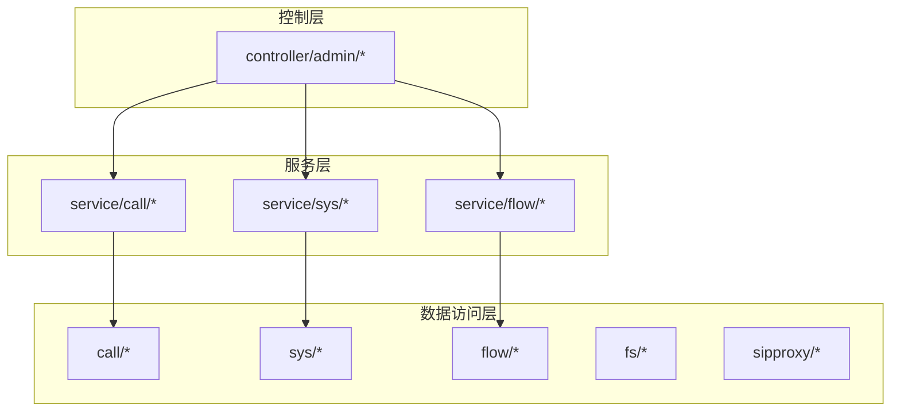
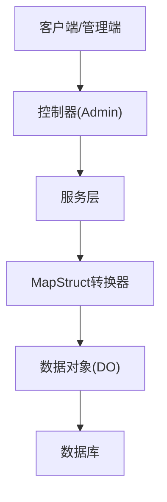
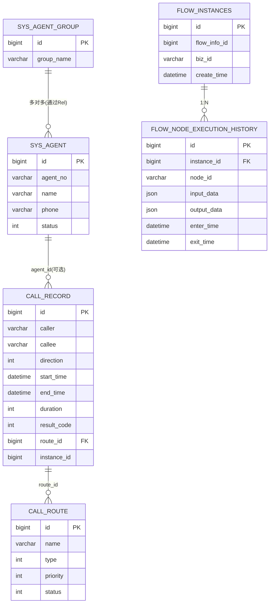

# 数据模型

<cite>
**本文引用的文件**
- [CallRecordDO.java](file://yudao-cloud/yudao-module-cc/yudao-module-cc-server/src/main/java/cn/iocoder/yudao/module/cc/dal/dataobject/call/CallRecordDO.java)
- [SysAgentDO.java](file://yudao-cloud/yudao-module-cc/yudao-module-cc-server/src/main/java/cn/iocoder/yudao/module/cc/dal/dataobject/sys/SysAgentDO.java)
- [CallRouteDO.java](file://yudao-cloud/yudao-module-cc/yudao-module-cc-server/src/main/java/cn/iocoder/yudao/module/cc/dal/dataobject/call/CallRouteDO.java)
- [FlowInfoDO.java](file://yudao-cloud/yudao-module-cc/yudao-module-cc-server/src/main/java/cn/iocoder/yudao/module/cc/dal/dataobject/flow/FlowInfoDO.java)
- [FlowInstancesDO.java](file://yudao-cloud/yudao-module-cc/yudao-module-cc-server/src/main/java/cn/iocoder/yudao/module/cc/dal/dataobject/flow/FlowInstancesDO.java)
- [FlowNodeExecutionHistoryDO.java](file://yudao-cloud/yudao-module-cc/yudao-module-cc-server/src/main/java/cn/iocoder/yudao/module/cc/dal/dataobject/flow/FlowNodeExecutionHistoryDO.java)
- [SysAgentConvert.java](file://yudao-cloud/yudao-module-cc/yudao-module-cc-server/src/main/java/cn/iocoder/yudao/module/cc/convert/SysAgentConvert.java)
- [CallDisplayDO.java](file://yudao-cloud/yudao-module-cc/yudao-module-cc-server/src/main/java/cn/iocoder/yudao/module/cc/dal/dataobject/call/CallDisplayDO.java)
- [CallDisplayPoolDO.java](file://yudao-cloud/yudao-module-cc/yudao-module-cc-server/src/main/java/cn/iocoder/yudao/module/cc/dal/dataobject/call/CallDisplayPoolDO.java)
- [CallDisplayPoolRelDO.java](file://yudao-cloud/yudao-module-cc/yudao-module-cc-server/src/main/java/cn/iocoder/yudao/module/cc/dal/dataobject/call/CallDisplayPoolRelDO.java)
- [SysAgentGroupDO.java](file://yudao-cloud/yudao-module-cc/yudao-module-cc-server/src/main/java/cn/iocoder/yudao/module/cc/dal/dataobject/call/SysAgentGroupDO.java)
- [SysAgentGroupRelDO.java](file://yudao-cloud/yudao-module-cc/yudao-module-cc-server/src/main/java/cn/iocoder/yudao/module/cc/dal/dataobject/call/SysAgentGroupRelDO.java)
- [FsCdrDO.java](file://yudao-cloud/yudao-module-cc/yudao-module-cc-server/src/main/java/cn/iocoder/yudao/module/cc/dal/dataobject/fs/FsCdrDO.java)
- [FsConfigDO.java](file://yudao-cloud/yudao-module-cc/yudao-module-cc-server/src/main/java/cn/iocoder/yudao/module/cc/dal/dataobject/fs/FsConfigDO.java)
- [FsDialplanDO.java](file://yudao-cloud/yudao-module-cc/yudao-module-cc-server/src/main/java/cn/iocoder/yudao/module/cc/dal/dataobject/fs/FsDialplanDO.java)
- [SipProxyGatewayDO.java](file://yudao-cloud/yudao-module-cc/yudao-module-cc-server/src/main/java/cn/iocoder/yudao/module/cc/dal/dataobject/sipproxy/SipProxyGatewayDO.java)
- [SysVoiceEngineDO.java](file://yudao-cloud/yudao-module-cc/yudao-module-cc-server/src/main/java/cn/iocoder/yudao/module/cc/dal/dataobject/sys/SysVoiceEngineDO.java)
- [SysVoiceFileDO.java](file://yudao-cloud/yudao-module-cc/yudao-module-cc-server/src/main/java/cn/iocoder/yudao/module/cc/dal/dataobject/sys/SysVoiceFileDO.java)
- [CallRouteStatusEnum.java](file://yudao-cloud/yudao-module-cc/yudao-module-cc-api/src/main/java/cn/iocoder/yudao/module/cc/enums/CallRouteStatusEnum.java)
</cite>

## 目录
1. [简介](#简介)
2. [项目结构](#项目结构)
3. [核心组件](#核心组件)
4. [架构总览](#架构总览)
5. [详细组件分析](#详细组件分析)
6. [依赖关系分析](#依赖关系分析)
7. [性能考虑](#性能考虑)
8. [故障排查指南](#故障排查指南)
9. [结论](#结论)
10. [附录](#附录)

## 简介
本章节面向数据模型，聚焦呼叫中心模块中的核心实体与映射关系，覆盖以下目标：
- 说明 Entity 实体类设计（CallRecord、SysAgent、CallRoute、FlowNode 等）的属性定义、注解配置与表映射。
- 解释 MyBatis Plus 的常用注解使用方式（如 @TableName、@TableId、@TableField 等）。
- 文档化 DTO/VO 与实体的转换关系（以 MapStruct 为主）。
- 说明数据验证注解的使用规范（如 @NotNull、@Size、@Pattern 等）。
- 描述实体继承关系与多态设计思路。
- 提供实体创建、更新、删除的操作示例（以接口调用形式呈现）。

## 项目结构
本项目采用模块化分层组织，数据模型集中在 cc 模块的 dal/dataobject 目录下，按业务域划分：
- call：通话相关实体（CallRecord、CallRoute、CallDisplay 系列等）
- sys：系统基础实体（SysAgent、语音引擎/文件等）
- flow：流程编排与执行历史（FlowInfo、FlowInstances、FlowNodeExecutionHistory）
- fs：FreeSWITCH 相关配置与 CDR
- sipproxy：SIP 代理网关配置



图表来源
- [CallRecordDO.java](file://yudao-cloud/yudao-module-cc/yudao-module-cc-server/src/main/java/cn/iocoder/yudao/module/cc/dal/dataobject/call/CallRecordDO.java)
- [SysAgentDO.java](file://yudao-cloud/yudao-module-cc/yudao-module-cc-server/src/main/java/cn/iocoder/yudao/module/cc/dal/dataobject/sys/SysAgentDO.java)
- [CallRouteDO.java](file://yudao-cloud/yudao-module-cc/yudao-module-cc-server/src/main/java/cn/iocoder/yudao/module/cc/dal/dataobject/call/CallRouteDO.java)
- [FlowInfoDO.java](file://yudao-cloud/yudao-module-cc/yudao-module-cc-server/src/main/java/cn/iocoder/yudao/module/cc/dal/dataobject/flow/FlowInfoDO.java)

章节来源
- [CallRecordDO.java](file://yudao-cloud/yudao-module-cc/yudao-module-cc-server/src/main/java/cn/iocoder/yudao/module/cc/dal/dataobject/call/CallRecordDO.java)
- [SysAgentDO.java](file://yudao-cloud/yudao-module-cc/yudao-module-cc-server/src/main/java/cn/iocoder/yudao/module/cc/dal/dataobject/sys/SysAgentDO.java)
- [CallRouteDO.java](file://yudao-cloud/yudao-module-cc/yudao-module-cc-server/src/main/java/cn/iocoder/yudao/module/cc/dal/dataobject/call/CallRouteDO.java)
- [FlowInfoDO.java](file://yudao-cloud/yudao-module-cc/yudao-module-cc-server/src/main/java/cn/iocoder/yudao/module/cc/dal/dataobject/flow/FlowInfoDO.java)

## 核心组件
本节对核心实体进行概览性说明，重点包括：
- 表名映射与主键策略
- 字段命名与数据库列映射
- 枚举与状态字段的约定
- 关联关系（一对一、一对多、多对多）

章节来源
- [CallRecordDO.java](file://yudao-cloud/yudao-module-cc/yudao-module-cc-server/src/main/java/cn/iocoder/yudao/module/cc/dal/dataobject/call/CallRecordDO.java)
- [SysAgentDO.java](file://yudao-cloud/yudao-module-cc/yudao-module-cc-server/src/main/java/cn/iocoder/yudao/module/cc/dal/dataobject/sys/SysAgentDO.java)
- [CallRouteDO.java](file://yudao-cloud/yudao-module-cc/yudao-module-cc-server/src/main/java/cn/iocoder/yudao/module/cc/dal/dataobject/call/CallRouteDO.java)
- [FlowInfoDO.java](file://yudao-cloud/yudao-module-cc/yudao-module-cc-server/src/main/java/cn/iocoder/yudao/module/cc/dal/dataobject/flow/FlowInfoDO.java)
- [FlowInstancesDO.java](file://yudao-cloud/yudao-module-cc/yudao-module-cc-server/src/main/java/cn/iocoder/yudao/module/cc/dal/dataobject/flow/FlowInstancesDO.java)
- [FlowNodeExecutionHistoryDO.java](file://yudao-cloud/yudao-module-cc/yudao-module-cc-server/src/main/java/cn/iocoder/yudao/module/cc/dal/dataobject/flow/FlowNodeExecutionHistoryDO.java)

## 架构总览
下图展示数据模型在系统中的位置与交互：控制层通过服务层操作数据对象，数据对象通过 MyBatis Plus 与数据库交互；DTO/VO 负责跨层数据传输与展示。



图表来源
- [SysAgentConvert.java](file://yudao-cloud/yudao-module-cc/yudao-module-cc-server/src/main/java/cn/iocoder/yudao/module/cc/convert/SysAgentConvert.java)
- [SysAgentDO.java](file://yudao-cloud/yudao-module-cc/yudao-module-cc-server/src/main/java/cn/iocoder/yudao/module/cc/dal/dataobject/sys/SysAgentDO.java)

## 详细组件分析

### CallRecord（通话记录）
- 职责：持久化每次通话的关键信息，用于统计、审计与回溯。
- 关键属性（示例）：通话标识、主被叫号码、方向、开始/结束时间、时长、结果码、路由ID、IVR节点执行信息等。
- 注解与映射：
  - 表名映射：通过 @TableName 指定表名。
  - 主键：通过 @TableId 指定主键字段及生成策略（如自增或雪花）。
  - 字段映射：通过 @TableField 指定列名、是否填充、是否逻辑删除等。
- 关联关系：
  - 与 CallRoute：通过外键或字段关联，表示本次通话走哪条路由。
  - 与 FlowInstances：可能通过流程实例ID关联，便于追踪 IVR 执行上下文。
- 查询与索引建议：
  - 按开始时间、主被叫号码建立复合索引，提升报表查询效率。
  - 对结果码、路由ID建立单列索引，支持快速过滤。

章节来源
- [CallRecordDO.java](file://yudao-cloud/yudao-module-cc/yudao-module-cc-server/src/main/java/cn/iocoder/yudao/module/cc/dal/dataobject/call/CallRecordDO.java)

### SysAgent（坐席）
- 职责：管理坐席账号、状态、分组、联系方式等。
- 关键属性（示例）：坐席编号、姓名、手机号、在线状态、所属组、分机号、扩展参数等。
- 注解与映射：
  - @TableName：映射到坐席表。
  - @TableId：主键策略。
  - @TableField：字段映射与自动填充（如创建人、更新时间）。
- 关联关系：
  - 与 SysAgentGroup：通过中间表实现多对多分组。
  - 与 CallRecord：一对多，一个坐席可有多条通话记录。
- 校验建议：
  - 坐席编号唯一性校验。
  - 手机号格式校验（@Pattern）。
  - 必填项校验（@NotNull、@NotBlank）。

章节来源
- [SysAgentDO.java](file://yudao-cloud/yudao-module-cc/yudao-module-cc-server/src/main/java/cn/iocoder/yudao/module/cc/dal/dataobject/sys/SysAgentDO.java)
- [SysAgentGroupDO.java](file://yudao-cloud/yudao-module-cc/yudao-module-cc-server/src/main/java/cn/iocoder/yudao/module/cc/dal/dataobject/call/SysAgentGroupDO.java)
- [SysAgentGroupRelDO.java](file://yudao-cloud/yudao-module-cc/yudao-module-cc-server/src/main/java/cn/iocoder/yudao/module/cc/dal/dataobject/call/SysAgentGroupRelDO.java)

### CallRoute（呼叫路由）
- 职责：定义来电/去电的路由规则，如优先级、匹配条件、目标组/坐席、超时策略等。
- 关键属性（示例）：路由名称、类型、优先级、匹配表达式、目标组ID、状态、备注等。
- 注解与映射：
  - @TableName：映射到路由表。
  - @TableId：主键策略。
  - @TableField：字段映射，状态字段常配合枚举。
- 枚举与状态：
  - 使用 CallRouteStatusEnum 表达启用/停用等状态。
- 关联关系：
  - 与 SysAgentGroup：路由目标通常指向一组坐席。
  - 与 CallRecord：一次通话命中一条路由。

章节来源
- [CallRouteDO.java](file://yudao-cloud/yudao-module-cc/yudao-module-cc-server/src/main/java/cn/iocoder/yudao/module/cc/dal/dataobject/call/CallRouteDO.java)
- [CallRouteStatusEnum.java](file://yudao-cloud/yudao-module-cc/yudao-module-cc-api/src/main/java/cn/iocoder/yudao/module/cc/enums/CallRouteStatusEnum.java)

### FlowNode（流程节点）
- 职责：描述 IVR/流程编排中的节点定义与执行历史。
- 关键实体：
  - FlowInfo：流程定义元信息（名称、版本、JSON 定义等）。
  - FlowInstances：流程实例（与某次通话或任务绑定）。
  - FlowNodeExecutionHistory：节点执行历史（进入/退出时间、输入输出、异常信息等）。
- 注解与映射：
  - @TableName/@TableId/@TableField：标准映射。
  - JSON 字段可使用 @TableField(typeHandler = ...) 或框架提供的 JSON 处理器。
- 关联关系：
  - FlowInfo 1:N FlowInstances
  - FlowInstances 1:N FlowNodeExecutionHistory

章节来源
- [FlowInfoDO.java](file://yudao-cloud/yudao-module-cc/yudao-module-cc-server/src/main/java/cn/iocoder/yudao/module/cc/dal/dataobject/flow/FlowInfoDO.java)
- [FlowInstancesDO.java](file://yudao-cloud/yudao-module-cc/yudao-module-cc-server/src/main/java/cn/iocoder/yudao/module/cc/dal/dataobject/flow/FlowInstancesDO.java)
- [FlowNodeExecutionHistoryDO.java](file://yudao-cloud/yudao-module-cc/yudao-module-cc-server/src/main/java/cn/iocoder/yudao/module/cc/dal/dataobject/flow/FlowNodeExecutionHistoryDO.java)

### 其他重要实体（辅助与集成）
- CallDisplay/CallDisplayPool/CallDisplayPoolRel：号码显示与号码池管理，支持多对多关系。
- FsCdr/FsConfig/FsDialplan：FreeSWITCH 侧的 CDR、配置与拨号计划。
- SipProxyGateway：SIP 代理网关配置。
- SysVoiceEngine/SysVoiceFile：语音引擎与语音文件管理。

章节来源
- [CallDisplayDO.java](file://yudao-cloud/yudao-module-cc/yudao-module-cc-server/src/main/java/cn/iocoder/yudao/module/cc/dal/dataobject/call/CallDisplayDO.java)
- [CallDisplayPoolDO.java](file://yudao-cloud/yudao-module-cc/yudao-module-cc-server/src/main/java/cn/iocoder/yudao/module/cc/dal/dataobject/call/CallDisplayPoolDO.java)
- [CallDisplayPoolRelDO.java](file://yudao-cloud/yudao-module-cc/yudao-module-cc-server/src/main/java/cn/iocoder/yudao/module/cc/dal/dataobject/call/CallDisplayPoolRelDO.java)
- [FsCdrDO.java](file://yudao-cloud/yudao-module-cc/yudao-module-cc-server/src/main/java/cn/iocoder/yudao/module/cc/dal/dataobject/fs/FsCdrDO.java)
- [FsConfigDO.java](file://yudao-cloud/yudao-module-cc/yudao-module-cc-server/src/main/java/cn/iocoder/yudao/module/cc/dal/dataobject/fs/FsConfigDO.java)
- [FsDialplanDO.java](file://yudao-cloud/yudao-module-cc/yudao-module-cc-server/src/main/java/cn/iocoder/yudao/module/cc/dal/dataobject/fs/FsDialplanDO.java)
- [SipProxyGatewayDO.java](file://yudao-cloud/yudao-module-cc/yudao-module-cc-server/src/main/java/cn/iocoder/yudao/module/cc/dal/dataobject/sipproxy/SipProxyGatewayDO.java)
- [SysVoiceEngineDO.java](file://yudao-cloud/yudao-module-cc/yudao-module-cc-server/src/main/java/cn/iocoder/yudao/module/cc/dal/dataobject/sys/SysVoiceEngineDO.java)
- [SysVoiceFileDO.java](file://yudao-cloud/yudao-module-cc/yudao-module-cc-server/src/main/java/cn/iocoder/yudao/module/cc/dal/dataobject/sys/SysVoiceFileDO.java)

## 依赖关系分析
- 实体间关系
  - 坐席与分组：多对多（SysAgent <-> SysAgentGroup via Rel）
  - 路由与分组：一对多（CallRoute -> SysAgentGroup）
  - 通话与路由：多对一（CallRecord -> CallRoute）
  - 流程实例与节点历史：一对多（FlowInstances -> FlowNodeExecutionHistory）
- 外部依赖
  - FreeSWITCH：通过 FsCdr/FsConfig/FsDialplan 映射 FS 侧数据。
  - SIP Proxy：通过 SipProxyGateway 管理网关配置。
- 转换层依赖
  - MapStruct 转换器将 DO 与 DTO/VO 解耦，便于前后端契约稳定。

```mermaid
classDiagram
class CallRecordDO
class CallRouteDO
class SysAgentDO
class SysAgentGroupDO
class FlowInstancesDO
class FlowNodeExecutionHistoryDO
CallRecordDO --> CallRouteDO : "关联路由"
CallRecordDO --> FlowInstancesDO : "可选关联"
SysAgentDO --> SysAgentGroupDO : "多对多(通过Rel)"
FlowInstancesDO --> FlowNodeExecutionHistoryDO : "1 : N"
```

图表来源
- [CallRecordDO.java](file://yudao-cloud/yudao-module-cc/yudao-module-cc-server/src/main/java/cn/iocoder/yudao/module/cc/dal/dataobject/call/CallRecordDO.java)
- [CallRouteDO.java](file://yudao-cloud/yudao-module-cc/yudao-module-cc-server/src/main/java/cn/iocoder/yudao/module/cc/dal/dataobject/call/CallRouteDO.java)
- [SysAgentDO.java](file://yudao-cloud/yudao-module-cc/yudao-module-cc-server/src/main/java/cn/iocoder/yudao/module/cc/dal/dataobject/sys/SysAgentDO.java)
- [SysAgentGroupDO.java](file://yudao-cloud/yudao-module-cc/yudao-module-cc-server/src/main/java/cn/iocoder/yudao/module/cc/dal/dataobject/call/SysAgentGroupDO.java)
- [FlowInstancesDO.java](file://yudao-cloud/yudao-module-cc/yudao-module-cc-server/src/main/java/cn/iocoder/yudao/module/cc/dal/dataobject/flow/FlowInstancesDO.java)
- [FlowNodeExecutionHistoryDO.java](file://yudao-cloud/yudao-module-cc/yudao-module-cc-server/src/main/java/cn/iocoder/yudao/module/cc/dal/dataobject/flow/FlowNodeExecutionHistoryDO.java)

章节来源
- [CallRecordDO.java](file://yudao-cloud/yudao-module-cc/yudao-module-cc-server/src/main/java/cn/iocoder/yudao/module/cc/dal/dataobject/call/CallRecordDO.java)
- [SysAgentDO.java](file://yudao-cloud/yudao-module-cc/yudao-module-cc-server/src/main/java/cn/iocoder/yudao/module/cc/dal/dataobject/sys/SysAgentDO.java)
- [CallRouteDO.java](file://yudao-cloud/yudao-module-cc/yudao-module-cc-server/src/main/java/cn/iocoder/yudao/module/cc/dal/dataobject/call/CallRouteDO.java)
- [FlowInstancesDO.java](file://yudao-cloud/yudao-module-cc/yudao-module-cc-server/src/main/java/cn/iocoder/yudao/module/cc/dal/dataobject/flow/FlowInstancesDO.java)
- [FlowNodeExecutionHistoryDO.java](file://yudao-cloud/yudao-module-cc/yudao-module-cc-server/src/main/java/cn/iocoder/yudao/module/cc/dal/dataobject/flow/FlowNodeExecutionHistoryDO.java)

## 性能考虑
- 索引设计
  - 通话记录：按时间范围、主被叫号码、结果码建立合适索引。
  - 路由：按优先级、类型、状态建立索引，加速匹配。
  - 流程历史：按实例ID、节点ID、时间戳建立索引。
- 读写分离与缓存
  - 读多写少场景（如路由配置、坐席列表）可引入缓存。
  - 通话记录写入量大，建议分库分表或归档策略。
- 批量操作
  - 大批量导入/导出使用批量插入/分页查询，避免一次性加载过多数据。
- 连接池与事务
  - 合理设置连接池大小与超时，避免长事务阻塞。

[本节为通用指导，不直接分析具体文件]

## 故障排查指南
- 常见错误
  - 主键冲突：检查 @TableId 策略与数据库自增/序列配置。
  - 字段映射不一致：核对 @TableField 的列名与数据库一致。
  - 枚举值非法：确保传入值在枚举范围内。
  - 校验失败：前端/后端统一使用 @NotNull、@Size、@Pattern 等约束。
- 定位方法
  - 查看日志中 SQL 与参数，确认实际执行的语句。
  - 检查事务边界与回滚点，避免部分更新导致数据不一致。
  - 对慢查询使用 EXPLAIN 分析执行计划。

[本节为通用指导，不直接分析具体文件]

## 结论
- 数据模型围绕通话、坐席、路由、流程四大核心领域展开，层次清晰、职责明确。
- 通过 MyBatis Plus 注解完成表映射与字段控制，结合枚举与校验注解提升健壮性。
- 借助 MapStruct 实现 DO/DTO/VO 的解耦转换，保障前后端契约稳定。
- 建议在大数据量场景下完善索引、缓存与归档策略，保障系统性能与稳定性。

[本节为总结性内容，不直接分析具体文件]

## 附录

### MyBatis Plus 注解使用要点
- @TableName：声明实体对应的表名。
- @TableId：声明主键字段及生成策略（AUTO、INPUT、ASSIGN_ID 等）。
- @TableField：声明字段映射、是否填充、是否逻辑删除、是否忽略等。
- 结合全局策略：可在配置中统一设置驼峰转下划线、默认填充、逻辑删除等。

[本节为通用指导，不直接分析具体文件]

### 数据验证注解使用建议
- @NotNull/@NotBlank：必填字段校验。
- @Size/@Length：字符串长度限制。
- @Pattern：正则校验（如手机号、邮箱）。
- @Email/@Digits：特定格式校验。
- 建议在 DTO 层集中声明校验规则，在服务层统一处理。

[本节为通用指导，不直接分析具体文件]

### 实体继承与多态设计
- 公共基类：可将通用字段（如 id、创建时间、更新时间、创建人、更新人、逻辑删除标记）抽取至基类，减少重复。
- 多态策略：对于不同业务类型的实体，可通过“类型+扩展字段”的方式实现轻量多态，或使用继承+鉴别器（需评估复杂度与维护成本）。

[本节为通用指导，不直接分析具体文件]

### 实体 CRUD 操作示例（接口调用）
- 创建
  - 路径：POST /admin/cc/call-record/create
  - 请求体：包含必要字段（主被叫、方向、路由ID等），服务端校验并落库。
- 更新
  - 路径：PUT /admin/cc/call-record/update
  - 请求体：包含 ID 与待更新字段，服务端校验后更新。
- 删除
  - 路径：DELETE /admin/cc/call-record/delete
  - 请求体：包含 ID 列表，服务端执行逻辑删除或物理删除（依策略）。

[本节为通用指导，不直接分析具体文件]

### 实体关系图（ER）


图表来源
- [CallRecordDO.java](file://yudao-cloud/yudao-module-cc/yudao-module-cc-server/src/main/java/cn/iocoder/yudao/module/cc/dal/dataobject/call/CallRecordDO.java)
- [CallRouteDO.java](file://yudao-cloud/yudao-module-cc/yudao-module-cc-server/src/main/java/cn/iocoder/yudao/module/cc/dal/dataobject/call/CallRouteDO.java)
- [SysAgentDO.java](file://yudao-cloud/yudao-module-cc/yudao-module-cc-server/src/main/java/cn/iocoder/yudao/module/cc/dal/dataobject/sys/SysAgentDO.java)
- [SysAgentGroupDO.java](file://yudao-cloud/yudao-module-cc/yudao-module-cc-server/src/main/java/cn/iocoder/yudao/module/cc/dal/dataobject/call/SysAgentGroupDO.java)
- [FlowInstancesDO.java](file://yudao-cloud/yudao-module-cc/yudao-module-cc-server/src/main/java/cn/iocoder/yudao/module/cc/dal/dataobject/flow/FlowInstancesDO.java)
- [FlowNodeExecutionHistoryDO.java](file://yudao-cloud/yudao-module-cc/yudao-module-cc-server/src/main/java/cn/iocoder/yudao/module/cc/dal/dataobject/flow/FlowNodeExecutionHistoryDO.java)