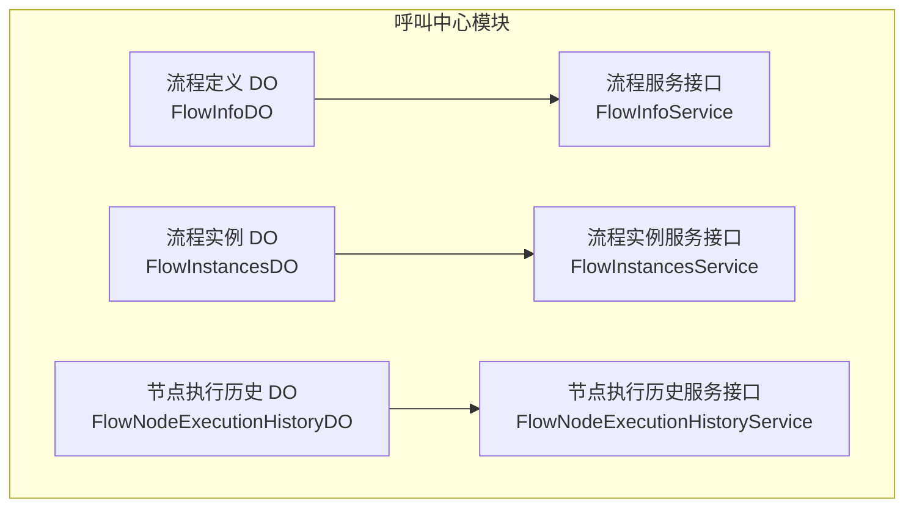
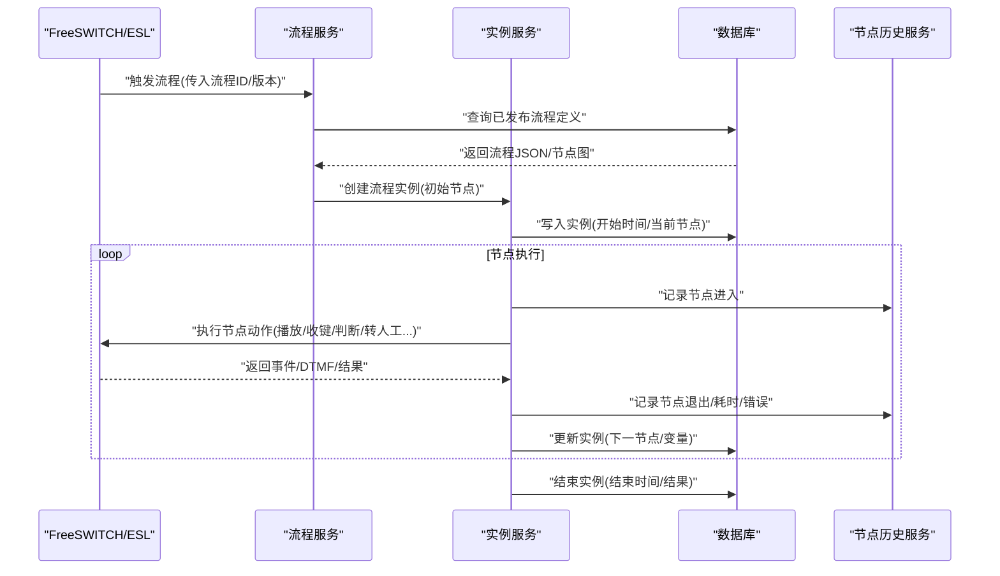
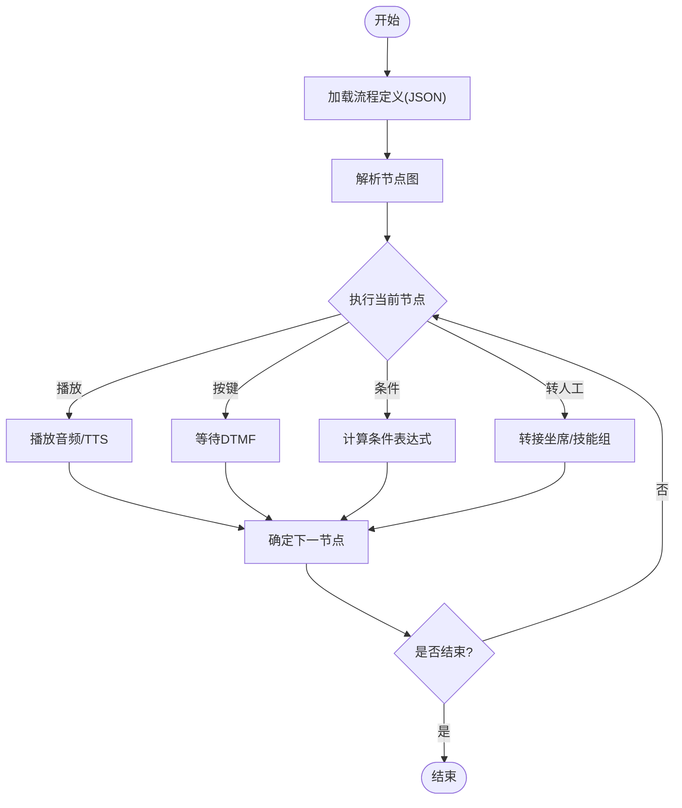
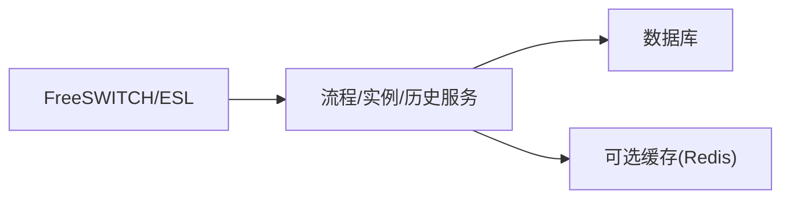

# IVR流程表

<cite>
**本文引用的文件**
- [autocall_task.sql](file://yudao-cloud/yudao-module-cc/doc/sql/autocall_task.sql)
- [系统数据初始化.sql](file://yudao-cloud/yudao-module-cc/doc/sql/系统数据初始化.sql)
- [FlowInfoDO.java](file://yudao-cloud/yudao-module-cc/yudao-module-cc-server/src/main/java/cn/iocoder/yudao/module/cc/dal/dataobject/flow/FlowInfoDO.java)
- [FlowInstancesDO.java](file://yudao-cloud/yudao-module-cc/yudao-module-cc-server/src/main/java/cn/iocoder/yudao/module/cc/dal/dataobject/flow/FlowInstancesDO.java)
- [FlowNodeExecutionHistoryDO.java](file://yudao-cloud/yudao-module-cc/yudao-module-cc-server/src/main/java/cn/iocoder/yudao/module/cc/dal/dataobject/flow/FlowNodeExecutionHistoryDO.java)
- [FlowInfoService.java](file://yudao-cloud/yudao-module-cc/yudao-module-cc-server/src/main/java/cn/iocoder/yudao/module/cc/service/flow/FlowInfoService.java)
- [FlowInfoServiceImpl.java](file://yudao-cloud/yudao-module-cc/yudao-module-cc-server/src/main/java/cn/iocoder/yudao/module/cc/service/flow/FlowInfoServiceImpl.java)
- [FlowInstancesService.java](file://yudao-cloud/yudao-module-cc/yudao-module-cc-server/src/main/java/cn/iocoder/yudao/module/cc/service/flow/FlowInstancesService.java)
- [FlowInstancesServiceImpl.java](file://yudao-cloud/yudao-module-cc/yudao-module-cc-server/src/main/java/cn/iocoder/yudao/module/cc/service/flow/FlowInstancesServiceImpl.java)
- [FlowNodeExecutionHistoryService.java](file://yudao-cloud/yudao-module-cc/yudao-module-cc-server/src/main/java/cn/iocoder/yudao/module/cc/service/flow/FlowNodeExecutionHistoryService.java)
- [FlowNodeExecutionHistoryServiceImpl.java](file://yudao-cloud/yudao-module-cc/yudao-module-cc-server/src/main/java/cn/iocoder/yudao/module/cc/service/flow/FlowNodeExecutionHistoryServiceImpl.java)
</cite>

## 目录
1. [简介](#简介)
2. [项目结构](#项目结构)
3. [核心组件](#核心组件)
4. [架构总览](#架构总览)
5. [详细组件分析](#详细组件分析)
6. [依赖关系分析](#依赖关系分析)
7. [性能考量](#性能考量)
8. [故障排查指南](#故障排查指南)
9. [结论](#结论)
10. [附录](#附录)

## 简介
本文件围绕IVR（交互式语音应答）流程的数据库建模与执行机制，系统化说明“流程定义表”和“流程节点表”的结构设计、字段含义、版本管理与发布机制，以及执行引擎的数据读取方式与节点跳转逻辑。文档同时给出流程设计的数据库建模最佳实践与性能优化建议，帮助读者在呼叫中心系统中正确设计与落地IVR流程。

## 项目结构
本项目中，IVR相关能力集中在呼叫中心模块（yudao-module-cc），其中：
- 数据对象（DO）位于 flow 包下，用于持久化流程定义、实例与执行历史。
- 服务层（service/flow）提供流程的创建、查询、发布与执行等能力。
- SQL脚本包含自动外呼任务及系统字典初始化，体现IVR流程与外呼任务的关联关系。

图表来源
- [FlowInfoDO.java](file://yudao-cloud/yudao-module-cc/yudao-module-cc-server/src/main/java/cn/iocoder/yudao/module/cc/dal/dataobject/flow/FlowInfoDO.java)
- [FlowInstancesDO.java](file://yudao-cloud/yudao-module-cc/yudao-module-cc-server/src/main/java/cn/iocoder/yudao/module/cc/dal/dataobject/flow/FlowInstancesDO.java)
- [FlowNodeExecutionHistoryDO.java](file://yudao-cloud/yudao-module-cc/yudao-module-cc-server/src/main/java/cn/iocoder/yudao/module/cc/dal/dataobject/flow/FlowNodeExecutionHistoryDO.java)
- [FlowInfoService.java](file://yudao-cloud/yudao-module-cc/yudao-module-cc-server/src/main/java/cn/iocoder/yudao/module/cc/service/flow/FlowInfoService.java)
- [FlowInstancesService.java](file://yudao-cloud/yudao-module-cc/yudao-module-cc-server/src/main/java/cn/iocoder/yudao/module/cc/service/flow/FlowInstancesService.java)
- [FlowNodeExecutionHistoryService.java](file://yudao-cloud/yudao-module-cc/yudao-module-cc-server/src/main/java/cn/iocoder/yudao/module/cc/service/flow/FlowNodeExecutionHistoryService.java)

章节来源
- [autocall_task.sql:1-101](file://yudao-cloud/yudao-module-cc/doc/sql/autocall_task.sql#L1-L101)
- [系统数据初始化.sql:1-203](file://yudao-cloud/yudao-module-cc/doc/sql/系统数据初始化.sql#L1-L203)

## 核心组件
- 流程定义实体（FlowInfoDO）：承载IVR流程的基本信息、版本、状态、JSON描述等元数据，是流程的“蓝图”。
- 流程实例实体（FlowInstancesDO）：承载一次通话或一次外呼触发的具体流程运行上下文，包括当前节点、变量、起止时间等。
- 节点执行历史实体（FlowNodeExecutionHistoryDO）：记录每个节点的进入、退出、耗时、错误等信息，用于排障与审计。
- 流程服务（FlowInfoService/Impl）：负责流程定义的CRUD、版本管理、发布与回滚。
- 实例服务（FlowInstancesService/Impl）：负责流程实例的创建、推进、挂起、恢复与结束。
- 节点历史服务（FlowNodeExecutionHistoryService/Impl）：负责节点执行历史的写入与查询。

章节来源
- [FlowInfoDO.java](file://yudao-cloud/yudao-module-cc/yudao-module-cc-server/src/main/java/cn/iocoder/yudao/module/cc/dal/dataobject/flow/FlowInfoDO.java)
- [FlowInstancesDO.java](file://yudao-cloud/yudao-module-cc/yudao-module-cc-server/src/main/java/cn/iocoder/yudao/module/cc/dal/dataobject/flow/FlowInstancesDO.java)
- [FlowNodeExecutionHistoryDO.java](file://yudao-cloud/yudao-module-cc/yudao-module-cc-server/src/main/java/cn/iocoder/yudao/module/cc/dal/dataobject/flow/FlowNodeExecutionHistoryDO.java)
- [FlowInfoService.java](file://yudao-cloud/yudao-module-cc/yudao-module-cc-server/src/main/java/cn/iocoder/yudao/module/cc/service/flow/FlowInfoService.java)
- [FlowInfoServiceImpl.java](file://yudao-cloud/yudao-module-cc/yudao-module-cc-server/src/main/java/cn/iocoder/yudao/module/cc/service/flow/FlowInfoServiceImpl.java)
- [FlowInstancesService.java](file://yudao-cloud/yudao-module-cc/yudao-module-cc-server/src/main/java/cn/iocoder/yudao/module/cc/service/flow/FlowInstancesService.java)
- [FlowInstancesServiceImpl.java](file://yudao-cloud/yudao-module-cc/yudao-module-cc-server/src/main/java/cn/iocoder/yudao/module/cc/service/flow/FlowInstancesServiceImpl.java)
- [FlowNodeExecutionHistoryService.java](file://yudao-cloud/yudao-module-cc/yudao-module-cc-server/src/main/java/cn/iocoder/yudao/module/cc/service/flow/FlowNodeExecutionHistoryService.java)
- [FlowNodeExecutionHistoryServiceImpl.java](file://yudao-cloud/yudao-module-cc/yudao-module-cc-server/src/main/java/cn/iocoder/yudao/module/cc/service/flow/FlowNodeExecutionHistoryServiceImpl.java)

## 架构总览
IVR流程的执行通常由呼叫事件触发，系统根据“已发布的流程版本”加载流程定义，创建流程实例，按节点类型驱动播放、按键收集、条件判断、转人工等操作，并将每一步执行结果写入历史表。

图表来源
- [FlowInfoService.java](file://yudao-cloud/yudao-module-cc/yudao-module-cc-server/src/main/java/cn/iocoder/yudao/module/cc/service/flow/FlowInfoService.java)
- [FlowInstancesService.java](file://yudao-cloud/yudao-module-cc/yudao-module-cc-server/src/main/java/cn/iocoder/yudao/module/cc/service/flow/FlowInstancesService.java)
- [FlowNodeExecutionHistoryService.java](file://yudao-cloud/yudao-module-cc/yudao-module-cc-server/src/main/java/cn/iocoder/yudao/module/cc/service/flow/FlowNodeExecutionHistoryService.java)

## 详细组件分析

### 流程定义表（FlowInfoDO）
- 职责：存储IVR流程的元数据与版本信息，包括流程名称、编码、版本、状态、JSON描述、创建/更新时间等。
- 关键字段（概念性说明）：
  - 主键：流程唯一标识
  - 流程编码：业务可读的唯一码
  - 版本号：支持同一流程多版本并存
  - 状态：草稿/已发布/已下线等
  - 流程定义：以JSON形式描述节点集合与连接关系
  - 审计字段：创建者、创建时间、更新者、更新时间、租户、删除标记
- 设计要点：
  - 版本隔离：通过版本号区分不同迭代，避免影响线上运行实例。
  - 发布控制：仅“已发布”版本可被实例引用。
  - 扩展性：JSON结构便于新增节点类型与属性。

章节来源
- [FlowInfoDO.java](file://yudao-cloud/yudao-module-cc/yudao-module-cc-server/src/main/java/cn/iocoder/yudao/module/cc/dal/dataobject/flow/FlowInfoDO.java)
- [FlowInfoService.java](file://yudao-cloud/yudao-module-cc/yudao-module-cc-server/src/main/java/cn/iocoder/yudao/module/cc/service/flow/FlowInfoService.java)
- [FlowInfoServiceImpl.java](file://yudao-cloud/yudao-module-cc/yudao-module-cc-server/src/main/java/cn/iocoder/yudao/module/cc/service/flow/FlowInfoServiceImpl.java)

### 流程节点表（FlowInstancesDO）
- 职责：表示一次具体的流程运行上下文，跟踪当前节点、输入输出变量、起止时间、结果等。
- 关键字段（概念性说明）：
  - 主键：实例唯一标识
  - 流程ID/版本：关联到哪个流程的哪个版本
  - 当前节点：正在执行的节点ID
  - 变量集：运行时变量（如来电号码、按键序列、业务参数）
  - 时间戳：开始时间、结束时间
  - 结果：成功/失败/挂断原因等
- 设计要点：
  - 并发安全：同一实例的推进需加锁或基于乐观锁。
  - 可观测性：结合节点历史实现全链路追踪。

章节来源
- [FlowInstancesDO.java](file://yudao-cloud/yudao-module-cc/yudao-module-cc-server/src/main/java/cn/iocoder/yudao/module/cc/dal/dataobject/flow/FlowInstancesDO.java)
- [FlowInstancesService.java](file://yudao-cloud/yudao-module-cc/yudao-module-cc-server/src/main/java/cn/iocoder/yudao/module/cc/service/flow/FlowInstancesService.java)
- [FlowInstancesServiceImpl.java](file://yudao-cloud/yudao-module-cc/yudao-module-cc-server/src/main/java/cn/iocoder/yudao/module/cc/service/flow/FlowInstancesServiceImpl.java)

### 节点执行历史表（FlowNodeExecutionHistoryDO）
- 职责：记录每个节点的进入/退出、耗时、错误堆栈、关键日志，用于问题定位与SLA统计。
- 关键字段（概念性说明）：
  - 主键：历史记录唯一标识
  - 实例ID：归属的流程实例
  - 节点ID/类型：执行了哪个节点
  - 时间：进入时间、退出时间、耗时
  - 状态：成功/失败
  - 错误信息：异常消息或错误码
- 设计要点：
  - 异步落库：避免阻塞节点执行主路径。
  - 索引优化：按实例ID、节点ID、时间范围查询。

章节来源
- [FlowNodeExecutionHistoryDO.java](file://yudao-cloud/yudao-module-cc/yudao-module-cc-server/src/main/java/cn/iocoder/yudao/module/cc/dal/dataobject/flow/FlowNodeExecutionHistoryDO.java)
- [FlowNodeExecutionHistoryService.java](file://yudao-cloud/yudao-module-cc/yudao-module-cc-server/src/main/java/cn/iocoder/yudao/module/cc/service/flow/FlowNodeExecutionHistoryService.java)
- [FlowNodeExecutionHistoryServiceImpl.java](file://yudao-cloud/yudao-module-cc/yudao-module-cc-server/src/main/java/cn/iocoder/yudao/module/cc/service/flow/FlowNodeExecutionHistoryServiceImpl.java)

### 节点类型与字段定义（概念性说明）
- 播放节点：用于播放音频或TTS文本，字段通常包含音频资源ID、音量、语言、是否打断等。
- 按键接收节点：等待用户DTMF按键，字段包含超时时间、允许按键集合、默认分支等。
- 条件判断节点：基于变量进行分支跳转，字段包含表达式、真/假分支目标节点等。
- 转人工节点：将通话转接至坐席或技能组，字段包含坐席组ID、溢出策略、等待音等。
- 其他常见节点：录音、外部API调用、队列等待、结束等。

说明：以上为通用IVR节点类型的字段约定，实际字段以各节点在流程JSON中的配置为准。

### 流程版本管理与发布机制
- 版本模型：同一流程可存在多个版本，通过版本号区分；实例绑定具体版本，确保变更不影响在线通话。
- 发布流程：编辑草稿 -> 校验 -> 发布为“已发布”版本 -> 新实例优先使用最新已发布版本。
- 回滚策略：支持将旧版本重新设为“已发布”，使新实例回退到稳定版本。
- 一致性保障：发布时进行语法/连通性校验，避免无效流程上线。

章节来源
- [FlowInfoService.java](file://yudao-cloud/yudao-module-cc/yudao-module-cc-server/src/main/java/cn/iocoder/yudao/module/cc/service/flow/FlowInfoService.java)
- [FlowInfoServiceImpl.java](file://yudao-cloud/yudao-module-cc/yudao-module-cc-server/src/main/java/cn/iocoder/yudao/module/cc/service/flow/FlowInfoServiceImpl.java)

### 执行引擎的数据读取与节点跳转逻辑
- 数据读取：
  - 启动时根据“流程ID+版本”从数据库加载流程定义（JSON）。
  - 解析JSON构建节点图，缓存热点流程以提升性能。
- 节点跳转：
  - 播放节点：播放完成后跳转到下一个节点。
  - 按键接收节点：根据DTMF匹配分支，超时走默认分支。
  - 条件判断节点：计算表达式，选择真/假分支。
  - 转人工节点：调用路由/坐席分配，成功后进入人工会话，否则回退或结束。
- 异常处理：
  - 节点执行失败写入历史并尝试重试或走错误分支。
  - 全局超时保护，防止死循环或长时间占用通道。

图表来源
- [FlowInfoService.java](file://yudao-cloud/yudao-module-cc/yudao-module-cc-server/src/main/java/cn/iocoder/yudao/module/cc/service/flow/FlowInfoService.java)
- [FlowInstancesService.java](file://yudao-cloud/yudao-module-cc/yudao-module-cc-server/src/main/java/cn/iocoder/yudao/module/cc/service/flow/FlowInstancesService.java)
- [FlowNodeExecutionHistoryService.java](file://yudao-cloud/yudao-module-cc/yudao-module-cc-server/src/main/java/cn/iocoder/yudao/module/cc/service/flow/FlowNodeExecutionHistoryService.java)

### 与自动外呼任务的关联
- 自动外呼任务表中包含“IVR流程ID”字段，表明外呼任务可指定要执行的IVR流程。
- 外呼任务执行时，系统根据任务配置的IVR流程ID创建流程实例，并在通话过程中驱动节点执行。
- 外呼任务记录表保存每次呼叫的状态、DTMF收集结果等，便于统计与分析。

章节来源
- [autocall_task.sql:1-101](file://yudao-cloud/yudao-module-cc/doc/sql/autocall_task.sql#L1-L101)

## 依赖关系分析
- 服务层依赖：
  - 流程服务依赖流程定义DO与服务实现，负责版本与发布。
  - 实例服务依赖实例DO与服务实现，负责运行期推进。
  - 节点历史服务依赖历史DO与服务实现，负责审计与排障。
- 外部依赖：
  - FreeSWITCH/ESL：负责媒体流、DTMF事件、通话控制。
  - 数据库：持久化流程定义、实例与历史。
  - 可选：Redis缓存热点流程定义，降低DB压力。

图表来源
- [FlowInfoService.java](file://yudao-cloud/yudao-module-cc/yudao-module-cc-server/src/main/java/cn/iocoder/yudao/module/cc/service/flow/FlowInfoService.java)
- [FlowInstancesService.java](file://yudao-cloud/yudao-module-cc/yudao-module-cc-server/src/main/java/cn/iocoder/yudao/module/cc/service/flow/FlowInstancesService.java)
- [FlowNodeExecutionHistoryService.java](file://yudao-cloud/yudao-module-cc/yudao-module-cc-server/src/main/java/cn/iocoder/yudao/module/cc/service/flow/FlowNodeExecutionHistoryService.java)

## 性能考量
- 流程定义缓存：对高频访问的已发布流程进行内存缓存，减少DB读取。
- 批量写入历史：节点历史采用批处理写入，降低IO开销。
- 索引优化：为实例ID、节点ID、时间范围建立合适索引，提升查询效率。
- 超时与限流：为按键等待、外部调用设置超时，避免通道长期占用。
- 分库分表：当实例与历史数据量巨大时，考虑按租户或时间分片。

## 故障排查指南
- 常见问题：
  - 流程未生效：检查是否为“已发布”版本，且实例绑定了该版本。
  - 节点卡住：查看节点历史中的进入/退出时间与错误信息，确认外部依赖（如TTS/ASR/网关）是否正常。
  - 按键无响应：核对按键接收节点的超时与允许按键集合配置。
  - 转人工失败：检查坐席组/技能组配置与路由规则。
- 定位方法：
  - 通过实例ID查询节点历史，定位失败节点与错误堆栈。
  - 结合外呼任务记录与通话记录，交叉验证DTMF收集与通话时长。

章节来源
- [FlowNodeExecutionHistoryService.java](file://yudao-cloud/yudao-module-cc/yudao-module-cc-server/src/main/java/cn/iocoder/yudao/module/cc/service/flow/FlowNodeExecutionHistoryService.java)
- [FlowNodeExecutionHistoryServiceImpl.java](file://yudao-cloud/yudao-module-cc/yudao-module-cc-server/src/main/java/cn/iocoder/yudao/module/cc/service/flow/FlowNodeExecutionHistoryServiceImpl.java)
- [autocall_task.sql:1-101](file://yudao-cloud/yudao-module-cc/doc/sql/autocall_task.sql#L1-L101)

## 结论
通过对流程定义、实例与执行历史的三层建模，配合版本管理与发布机制，IVR流程具备高内聚、低耦合、可追溯、易扩展的特点。结合合理的缓存、索引与超时策略，可在高并发场景下保持稳定的执行性能。建议在实施中严格遵循版本隔离、发布校验与全链路审计的最佳实践。

## 附录
- 数据库建模最佳实践
  - 明确主键与唯一约束，避免重复数据。
  - 使用JSON存储流程定义，保持灵活性与向后兼容。
  - 为常用查询维度建立复合索引（如租户+流程ID+版本）。
  - 历史表按时间分区或分表，便于归档与清理。
- 性能优化建议
  - 热点流程定义缓存（本地/分布式）。
  - 节点历史异步落库与批处理。
  - 合理设置按键超时与重试次数。
  - 对外部依赖（TTS/ASR/网关）增加熔断与降级策略。