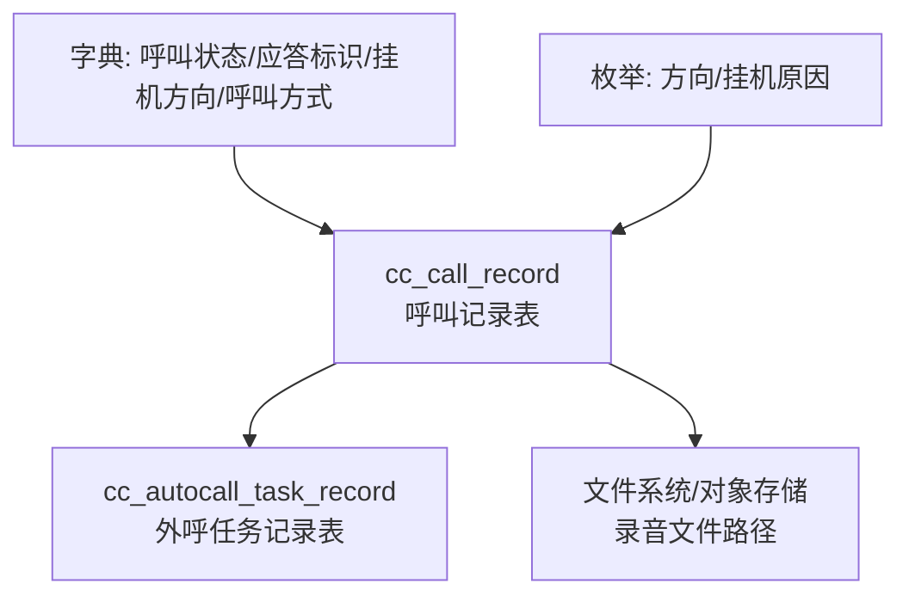
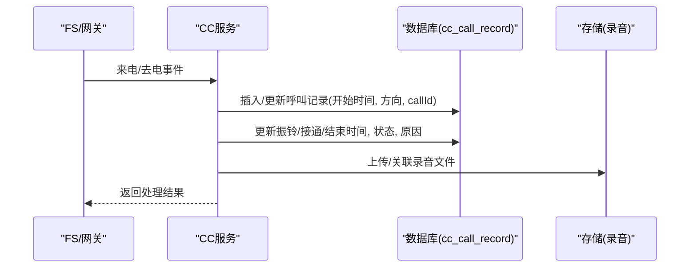
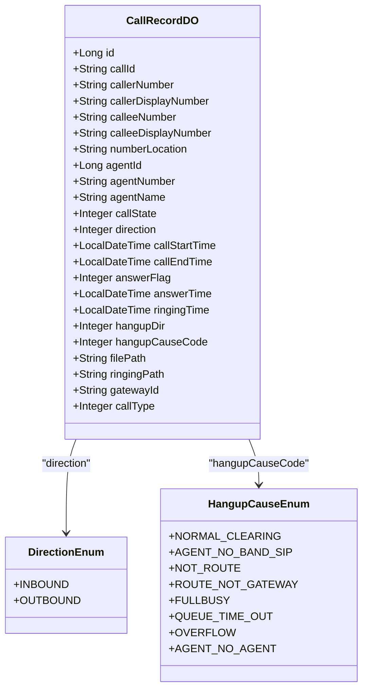

# 呼叫记录表

<cite>
**本文引用的文件**
- [CallRecordDO.java](file://yudao-cloud/yudao-module-cc/yudao-module-cc-server/src/main/java/cn/iocoder/yudao/module/cc/dal/dataobject/call/CallRecordDO.java)
- [HangupCauseEnum.java](file://yudao-cloud/yudao-module-cc/yudao-module-cc-server/src/main/java/cn/iocoder/yudao/module/cc/esl/enums/HangupCauseEnum.java)
- [DirectionEnum.java](file://yudao-cloud/yudao-module-cc/yudao-module-cc-server/src/main/java/cn/iocoder/yudao/module/cc/esl/enums/DirectionEnum.java)
- [系统数据初始化.sql](file://yudao-cloud/yudao-module-cc/doc/sql/系统数据初始化.sql)
- [autocall_task.sql](file://yudao-cloud/yudao-module-cc/doc/sql/autocall_task.sql)
</cite>

## 目录
1. [简介](#简介)
2. [项目结构](#项目结构)
3. [核心组件](#核心组件)
4. [架构总览](#架构总览)
5. [详细组件分析](#详细组件分析)
6. [依赖关系分析](#依赖关系分析)
7. [性能考虑](#性能考虑)
8. [故障排查指南](#故障排查指南)
9. [结论](#结论)
10. [附录](#附录)

## 简介
本文件为呼叫中心模块中的“呼叫记录表”（表名：cc_call_record）提供完整、可操作的技术与业务文档。内容涵盖字段定义、数据类型与取值范围、通话状态枚举与业务规则、索引设计与查询优化策略、常用查询示例，以及与录音文件的关联与存储策略说明。该表用于持久化每次通话的核心元数据，支撑通话回放、质检、统计分析与运营报表等场景。

## 项目结构
- 数据模型定义位于 cc 模块的 DO 层，对应数据库表 cc_call_record。
- 通话方向、挂机原因等枚举位于 ESL 事件处理相关枚举中，供写入与展示使用。
- 字典数据在系统初始化脚本中维护，包含“呼叫状态”“应答标识”“挂机方向”“呼叫方式”等字典项，用于统一展示与权限控制。
- 自动外呼任务记录表通过 call_id 与呼叫记录建立关联，便于从任务维度回溯具体通话。

图表来源
- [CallRecordDO.java:16-120](file://yudao-cloud/yudao-module-cc/yudao-module-cc-server/src/main/java/cn/iocoder/yudao/module/cc/dal/dataobject/call/CallRecordDO.java#L16-L120)
- [autocall_task.sql:43-66](file://yudao-cloud/yudao-module-cc/doc/sql/autocall_task.sql#L43-L66)
- [系统数据初始化.sql:123-146](file://yudao-cloud/yudao-module-cc/doc/sql/系统数据初始化.sql#L123-L146)

章节来源
- [CallRecordDO.java:16-120](file://yudao-cloud/yudao-module-cc/yudao-module-cc-server/src/main/java/cn/iocoder/yudao/module/cc/dal/dataobject/call/CallRecordDO.java#L16-L120)
- [系统数据初始化.sql:123-146](file://yudao-cloud/yudao-module-cc/doc/sql/系统数据初始化.sql#L123-L146)
- [autocall_task.sql:43-66](file://yudao-cloud/yudao-module-cc/doc/sql/autocall_task.sql#L43-L66)

## 核心组件
- 呼叫记录实体：对应表 cc_call_record，承载一次通话的关键信息，包括主叫/被叫号码及显号、坐席信息、时间轴、状态、录音路径等。
- 通话方向枚举：区分呼入/呼出，影响路由与计费策略。
- 挂机原因枚举：描述挂断来源与失败原因，便于问题定位与质量分析。
- 字典数据：统一维护“呼叫状态”“应答标识”“挂机方向”“呼叫方式”等字典项，保证前后端一致展示。

章节来源
- [CallRecordDO.java:26-120](file://yudao-cloud/yudao-module-cc/yudao-module-cc-server/src/main/java/cn/iocoder/yudao/module/cc/dal/dataobject/call/CallRecordDO.java#L26-L120)
- [DirectionEnum.java:15-46](file://yudao-cloud/yudao-module-cc/yudao-module-cc-server/src/main/java/cn/iocoder/yudao/module/cc/esl/enums/DirectionEnum.java#L15-L46)
- [HangupCauseEnum.java:13-27](file://yudao-cloud/yudao-module-cc/yudao-module-cc-server/src/main/java/cn/iocoder/yudao/module/cc/esl/enums/HangupCauseEnum.java#L13-L27)
- [系统数据初始化.sql:123-146](file://yudao-cloud/yudao-module-cc/doc/sql/系统数据初始化.sql#L123-L146)

## 架构总览
呼叫记录的生命周期大致如下：
- 通话发起或接入时，系统生成唯一 callId，并落库初始记录（含方向、开始时间等）。
- 通话过程中，根据事件更新振铃时间、接通时间、应答标识、挂机方向、挂机原因、结束时间、时长等。
- 通话结束后，若启用录音，将录音文件地址写入 filePath；如需振铃音，写入 ringingPath。
- 自动外呼任务记录通过 call_id 与本次通话关联，支持按任务维度回溯。

图表来源
- [CallRecordDO.java:26-120](file://yudao-cloud/yudao-module-cc/yudao-module-cc-server/src/main/java/cn/iocoder/yudao/module/cc/dal/dataobject/call/CallRecordDO.java#L26-L120)
- [autocall_task.sql:43-66](file://yudao-cloud/yudao-module-cc/doc/sql/autocall_task.sql#L43-L66)

## 详细组件分析

### 表结构与字段定义（cc_call_record）
- id：主键，自增整数。
- callId：呼叫唯一ID，贯穿全链路，用于关联录音、任务记录等。
- callerNumber：主叫号码。
- callerDisplayNumber：主叫显号（对外显示的主叫号码）。
- calleeNumber：被叫号码。
- calleeDisplayNumber：被叫显号（对外显示的被叫号码）。
- numberLocation：号码归属地（可选，用于展示与统计）。
- agentId：坐席ID（内部用户/分机标识）。
- agentNumber：坐席号码（SIP/分机号）。
- agentName：坐席名称（便于展示）。
- callState：呼叫状态（字典：成功/失败）。
- direction：呼叫方式（字典：呼入/呼出）。
- callStartTime：呼叫开始时间。
- callEndTime：呼叫结束时间。
- answerFlag：应答标识（字典：接通/未接组合态）。
- answerTime：呼叫接通时间。
- ringingTime：振铃时间。
- hangupDir：挂机方向（字典：主叫/被叫/系统）。
- hangupCauseCode：挂机原因（枚举值，见下文）。
- filePath：录音文件地址（相对或绝对路径/URL）。
- ringingPath：振铃文件地址（可选）。
- gatewayId：网关ID（出局呼叫使用的网关标识）。
- callType：呼叫类型（IVR/出局/内部/三方会议/双向出局/转接/自动外呼）。

字段业务含义与取值范围要点
- 时间字段均为 datetime/timestamp 类型，需保证顺序：ringingTime ≤ answerTime ≤ callEndTime，callStartTime ≤ ringingTime。
- 通话时长可由 answerTime - callStartTime（已接通）或 callEndTime - callStartTime（整体）计算，建议同时保存 duration 字段以便快速统计。
- 状态与方向类字段优先使用字典统一管理，避免硬编码。

章节来源
- [CallRecordDO.java:26-120](file://yudao-cloud/yudao-module-cc/yudao-module-cc-server/src/main/java/cn/iocoder/yudao/module/cc/dal/dataobject/call/CallRecordDO.java#L26-L120)
- [系统数据初始化.sql:123-146](file://yudao-cloud/yudao-module-cc/doc/sql/系统数据初始化.sql#L123-L146)

### 通话状态与业务规则
- 呼叫状态（callState）：来自字典“cc_call_state”，常见取值：
  - 成功：表示通话完成且满足成功判定（如已接通或达到业务成功标准）。
  - 失败：表示未达成成功标准（如未接通、超时、拒绝等）。
- 应答标识（answerFlag）：来自字典“cc_call_answer_flag”，用于细粒度表达接通情况：
  - 接通：双方均接通。
  - 坐席未接用户未接：双方均未接通。
  - 坐席接通用户未接通：仅坐席侧接通。
  - 用户接通坐席未接通：仅用户侧接通。
- 挂机方向（hangupDir）：来自字典“cc_call_hangup_dir”，用于分析谁先挂机：
  - 主叫挂机、被叫挂机、系统挂机。
- 呼叫方式（direction）：来自字典“cc_call_direction”，区分呼入/呼出。

业务规则建议
- 当 answerFlag=接通 时，callState 通常为成功；否则根据业务策略判定失败。
- 当 hangupDir=系统挂机 时，结合 hangupCauseCode 进一步归因（如排队超时、溢出、路由异常等）。
- 对于自动外呼场景，可通过 callType=自动外呼 与 autocall_task_record 关联进行任务级统计。

章节来源
- [系统数据初始化.sql:123-146](file://yudao-cloud/yudao-module-cc/doc/sql/系统数据初始化.sql#L123-L146)
- [CallRecordDO.java:68-102](file://yudao-cloud/yudao-module-cc/yudao-module-cc-server/src/main/java/cn/iocoder/yudao/module/cc/dal/dataobject/call/CallRecordDO.java#L68-L102)

### 枚举与字典映射
- 方向枚举（DirectionEnum）：呼入/呼出，用于写入 direction 字段。
- 挂机原因枚举（HangupCauseEnum）：用于 hangupCauseCode，覆盖常见失败场景（如全忙、排队超时、溢出、未配置路由等）。
- 字典项：呼叫状态、应答标识、挂机方向、呼叫方式等由系统字典维护，确保多端一致。

章节来源
- [DirectionEnum.java:15-46](file://yudao-cloud/yudao-module-cc/yudao-module-cc-server/src/main/java/cn/iocoder/yudao/module/cc/esl/enums/DirectionEnum.java#L15-L46)
- [HangupCauseEnum.java:13-27](file://yudao-cloud/yudao-module-cc/yudao-module-cc-server/src/main/java/cn/iocoder/yudao/module/cc/esl/enums/HangupCauseEnum.java#L13-L27)
- [系统数据初始化.sql:123-146](file://yudao-cloud/yudao-module-cc/doc/sql/系统数据初始化.sql#L123-L146)

### 索引设计与查询优化
基于常见查询场景，建议在数据库层设计如下索引（若尚未创建）：
- 时间范围查询优化
  - 单列索引：idx_call_start_time(callStartTime)
  - 复合索引：idx_tenant_time(tenant_id, callStartTime)
  - 复合索引：idx_time_range(callStartTime, callEndTime)
- 坐席统计查询优化
  - 复合索引：idx_agent(agentId, callStartTime)
  - 复合索引：idx_agent_state(agentId, callState)
- 号码检索优化
  - 单列索引：idx_caller_number(callerNumber)
  - 单列索引：idx_callee_number(calleeNumber)
- 录音与任务关联
  - 单列索引：idx_file_path(filePath) 用于录音文件检索
  - 单列索引：idx_call_id(callId) 用于与任务记录关联

查询优化建议
- 分页查询尽量使用 callStartTime 作为游标排序键，避免深分页。
- 统计类查询（按坐席、按日/月）优先走 (tenant_id, callStartTime) 或 (agentId, callStartTime) 复合索引。
- 对大表定期执行 ANALYZE/统计信息更新，确保优化器选择正确计划。

章节来源
- [CallRecordDO.java:26-120](file://yudao-cloud/yudao-module-cc/yudao-module-cc-server/src/main/java/cn/iocoder/yudao/module/cc/dal/dataobject/call/CallRecordDO.java#L26-L120)

### 常用查询示例
以下为典型查询思路（以 SQL 伪代码形式描述，实际实现请结合 ORM/SQL 框架）：
- 通话记录分页查询（按时间倒序）
  - 条件：tenant_id = ? AND callStartTime BETWEEN ? AND ?
  - 排序：ORDER BY callStartTime DESC
  - 分页：LIMIT ?, ?
- 坐席通话统计（按日）
  - 分组：DATE(callStartTime), agentId
  - 聚合：COUNT(*) 总通话数，SUM(CASE WHEN callState=成功 THEN 1 ELSE 0 END) 成功数，AVG(answerTime - callStartTime) 平均通话时长
- 号码检索
  - 条件：callerNumber LIKE '%?%' OR calleeNumber LIKE '%?%'
  - 排序：callStartTime DESC
- 录音回放列表
  - 条件：filePath IS NOT NULL AND tenant_id = ?
  - 排序：callStartTime DESC

章节来源
- [CallRecordDO.java:26-120](file://yudao-cloud/yudao-module-cc/yudao-module-cc-server/src/main/java/cn/iocoder/yudao/module/cc/dal/dataobject/call/CallRecordDO.java#L26-L120)

### 录音文件关联与存储策略
- 关联关系
  - 通过 filePath 字段指向录音文件路径或 URL。
  - 自动外呼任务记录表通过 call_id 与呼叫记录关联，便于按任务维度查看录音。
- 存储策略建议
  - 文件命名规范：{tenantId}/{yyyyMMdd}/{callId}.wav|mp3，便于分区归档与清理。
  - 生命周期管理：按日期或大小策略归档冷数据，保留期可配置。
  - 访问控制：通过鉴权接口下载，禁止直链暴露敏感录音。
  - 备份与容灾：异地备份、校验和校验，保障可恢复性。
  - 性能优化：CDN 加速播放，流式传输降低首开延迟。

章节来源
- [CallRecordDO.java:104-110](file://yudao-cloud/yudao-module-cc/yudao-module-cc-server/src/main/java/cn/iocoder/yudao/module/cc/dal/dataobject/call/CallRecordDO.java#L104-L110)
- [autocall_task.sql:43-66](file://yudao-cloud/yudao-module-cc/doc/sql/autocall_task.sql#L43-L66)

## 依赖关系分析
- 数据模型依赖：CallRecordDO 映射到 cc_call_record 表。
- 枚举与字典：DirectionEnum、HangupCauseEnum 与系统字典共同约束字段取值。
- 外部关联：cc_autocall_task_record 通过 call_id 与呼叫记录关联，形成任务-通话一对多的追溯关系。

图表来源
- [CallRecordDO.java:26-120](file://yudao-cloud/yudao-module-cc/yudao-module-cc-server/src/main/java/cn/iocoder/yudao/module/cc/dal/dataobject/call/CallRecordDO.java#L26-L120)
- [DirectionEnum.java:15-46](file://yudao-cloud/yudao-module-cc/yudao-module-cc-server/src/main/java/cn/iocoder/yudao/module/cc/esl/enums/DirectionEnum.java#L15-L46)
- [HangupCauseEnum.java:13-27](file://yudao-cloud/yudao-module-cc/yudao-module-cc-server/src/main/java/cn/iocoder/yudao/module/cc/esl/enums/HangupCauseEnum.java#L13-L27)

章节来源
- [CallRecordDO.java:26-120](file://yudao-cloud/yudao-module-cc/yudao-module-cc-server/src/main/java/cn/iocoder/yudao/module/cc/dal/dataobject/call/CallRecordDO.java#L26-L120)
- [DirectionEnum.java:15-46](file://yudao-cloud/yudao-module-cc/yudao-module-cc-server/src/main/java/cn/iocoder/yudao/module/cc/esl/enums/DirectionEnum.java#L15-L46)
- [HangupCauseEnum.java:13-27](file://yudao-cloud/yudao-module-cc/yudao-module-cc-server/src/main/java/cn/iocoder/yudao/module/cc/esl/enums/HangupCauseEnum.java#L13-L27)

## 性能考虑
- 索引策略：为高频过滤与排序字段建立合适索引，避免全表扫描。
- 分页策略：使用基于时间的游标分页，减少深分页开销。
- 统计查询：预聚合或物化视图（如按日/坐席的指标），降低实时计算压力。
- 录音访问：采用 CDN 与流式传输，减少源站负载。
- 数据归档：历史数据按时间分表或归档至低成本存储，提升热表性能。

## 故障排查指南
- 通话状态异常
  - 检查 answerFlag 与 callState 的一致性，确认是否满足成功判定逻辑。
  - 核对 hangupDir 与 hangupCauseCode 的组合，定位是主叫/被叫/系统侧问题。
- 录音缺失
  - 核查 filePath 是否为空，确认录音流程是否触发。
  - 检查存储路径权限与网络连通性，验证文件是否存在。
- 任务关联异常
  - 确认 autocall_task_record.call_id 是否正确写入，并与 cc_call_record.callId 一致。
- 查询缓慢
  - 检查是否命中预期索引，必要时添加或调整索引。
  - 评估 SQL 是否产生临时表/文件排序，优化 WHERE/ORDER BY。

章节来源
- [HangupCauseEnum.java:13-27](file://yudao-cloud/yudao-module-cc/yudao-module-cc-server/src/main/java/cn/iocoder/yudao/module/cc/esl/enums/HangupCauseEnum.java#L13-L27)
- [CallRecordDO.java:68-110](file://yudao-cloud/yudao-module-cc/yudao-module-cc-server/src/main/java/cn/iocoder/yudao/module/cc/dal/dataobject/call/CallRecordDO.java#L68-L110)
- [autocall_task.sql:43-66](file://yudao-cloud/yudao-module-cc/doc/sql/autocall_task.sql#L43-L66)

## 结论
cc_call_record 是呼叫中心通话数据的基石表，承载了通话全生命周期的关键信息。通过合理的字段设计、统一的枚举与字典管理、完善的索引与查询策略，以及稳健的录音存储方案，能够有效支撑通话回放、质检、统计分析与运营决策。建议在生产环境持续监控慢查询与存储容量，适时进行归档与扩容。

## 附录
- 字典参考：呼叫状态、应答标识、挂机方向、呼叫方式等字典项由系统初始化脚本维护，确保多端一致。
- 任务关联：自动外呼任务记录表通过 call_id 与呼叫记录关联，便于任务级回溯与统计。

章节来源
- [系统数据初始化.sql:123-146](file://yudao-cloud/yudao-module-cc/doc/sql/系统数据初始化.sql#L123-L146)
- [autocall_task.sql:43-66](file://yudao-cloud/yudao-module-cc/doc/sql/autocall_task.sql#L43-L66)