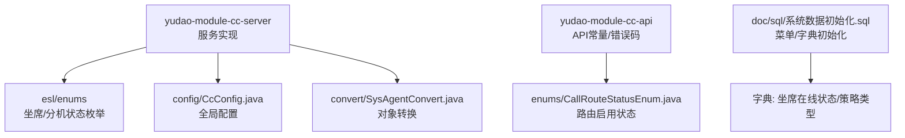
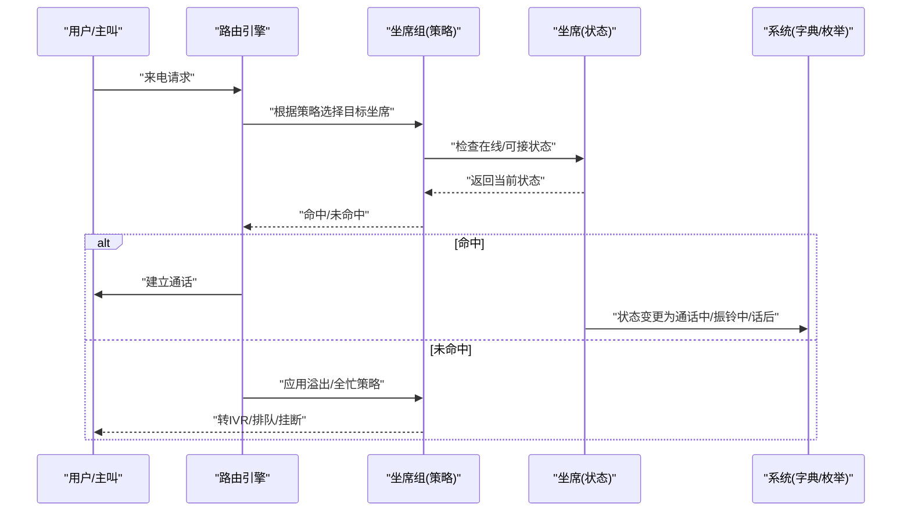
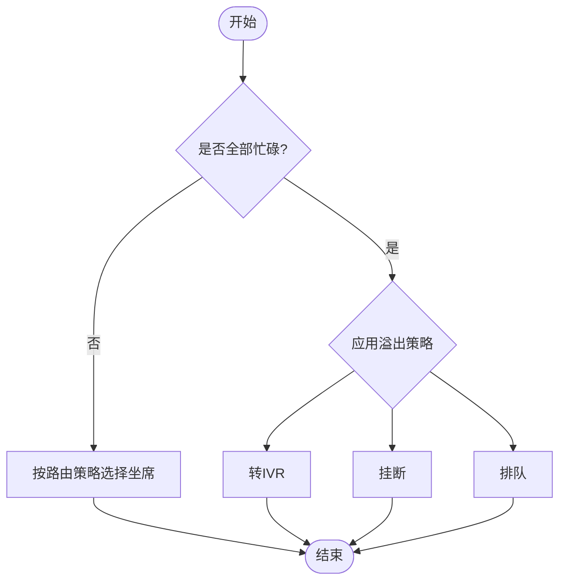
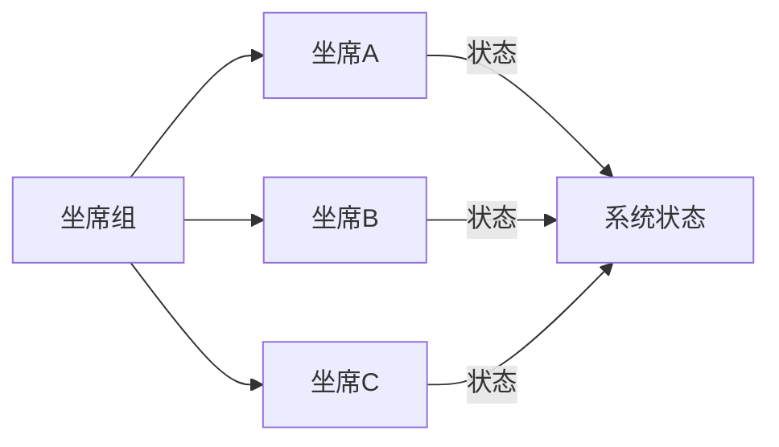
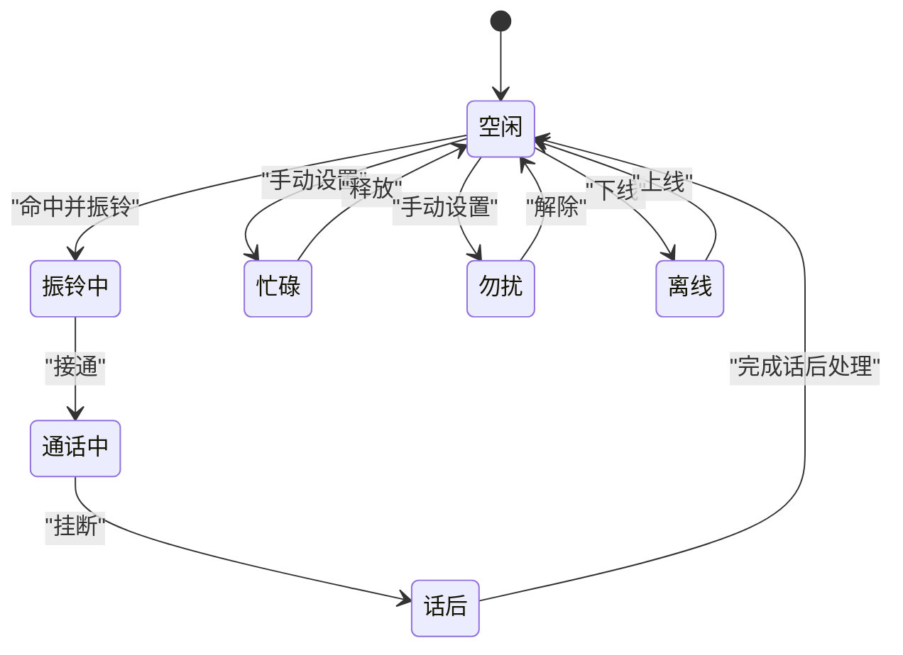
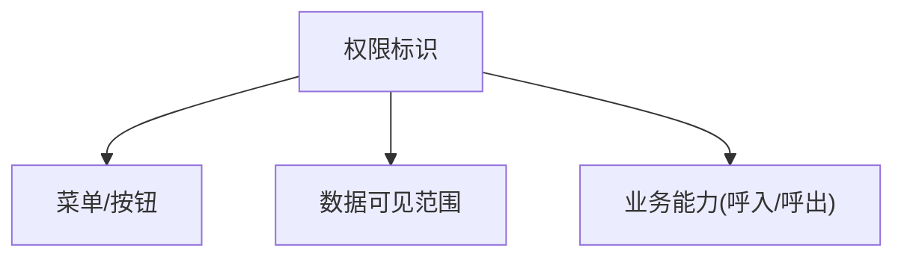
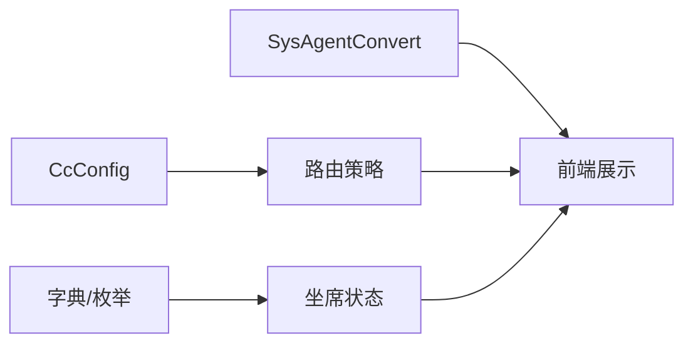

# 坐席相关表

<cite>
**本文引用的文件**
- [系统数据初始化.sql](file://yudao-cloud/yudao-module-cc/doc/sql/系统数据初始化.sql)
- [SysAgentConvert.java](file://yudao-cloud/yudao-module-cc/yudao-module-cc-server/src/main/java/cn/iocoder/yudao/module/cc/convert/SysAgentConvert.java)
- [AgentStateEnum.java](file://yudao-cloud/yudao-module-cc/yudao-module-cc-server/src/main/java/cn/iocoder/yudao/module/cc/esl/enums/AgentStateEnum.java)
- [SipAgentStatusEnum.java](file://yudao-cloud/yudao-module-cc/yudao-module-cc-server/src/main/java/cn/iocoder/yudao/module/cc/esl/enums/SipAgentStatusEnum.java)
- [CallRouteStatusEnum.java](file://yudao-cloud/yudao-module-cc/yudao-module-cc-api/src/main/java/cn/iocoder/yudao/module/cc/enums/CallRouteStatusEnum.java)
- [CcConfig.java](file://yudao-cloud/yudao-module-cc/yudao-module-cc-server/src/main/java/cn/iocoder/yudao/module/cc/config/CcConfig.java)
</cite>

## 目录
1. [简介](#简介)
2. [项目结构](#项目结构)
3. [核心组件](#核心组件)
4. [架构总览](#架构总览)
5. [详细组件分析](#详细组件分析)
6. [依赖关系分析](#依赖关系分析)
7. [性能考虑](#性能考虑)
8. [故障排查指南](#故障排查指南)
9. [结论](#结论)
10. [附录](#附录)

## 简介
本文件围绕呼叫中心模块中的“坐席”与“坐席组”进行系统化文档化，重点覆盖以下方面：
- 坐席信息表（cc_sys_agent）字段说明：基本信息、状态管理、权限控制等。
- 坐席组表（cc_sys_agent_group）配置项：溢出策略、全忙策略、路由策略等。
- 坐席与坐席组的关联关系及状态变化业务规则。
- 坐席权限控制与角色分配机制。
- 坐席管理与监控的常用查询模式。

## 项目结构
呼叫中心模块位于 yudao-module-cc 下，包含 API 与 Server 两个子模块；数据库字典与菜单初始化脚本位于 doc/sql 中；枚举定义位于 esl/enums 与 module/cc/enums；配置类位于 config 包。

图表来源
- [系统数据初始化.sql:1-203](file://yudao-cloud/yudao-module-cc/doc/sql/系统数据初始化.sql#L1-L203)
- [AgentStateEnum.java](file://yudao-cloud/yudao-module-cc/yudao-module-cc-server/src/main/java/cn/iocoder/yudao/module/cc/esl/enums/AgentStateEnum.java)
- [SipAgentStatusEnum.java](file://yudao-cloud/yudao-module-cc/yudao-module-cc-server/src/main/java/cn/iocoder/yudao/module/cc/esl/enums/SipAgentStatusEnum.java)
- [CallRouteStatusEnum.java](file://yudao-cloud/yudao-module-cc/yudao-module-cc-api/src/main/java/cn/iocoder/yudao/module/cc/enums/CallRouteStatusEnum.java)
- [CcConfig.java](file://yudao-cloud/yudao-module-cc/yudao-module-cc-server/src/main/java/cn/iocoder/yudao/module/cc/config/CcConfig.java)
- [SysAgentConvert.java](file://yudao-cloud/yudao-module-cc/yudao-module-cc-server/src/main/java/cn/iocoder/yudao/module/cc/convert/SysAgentConvert.java)

章节来源
- [系统数据初始化.sql:1-203](file://yudao-cloud/yudao-module-cc/doc/sql/系统数据初始化.sql#L1-L203)

## 核心组件
- 坐席信息表（cc_sys_agent）
  - 基本信息：姓名、工号、分机号、联系方式等。
  - 状态管理：在线状态、通话状态、话后处理状态等。
  - 权限控制：是否可用、是否允许呼出/呼入、可见范围等。
- 坐席组表（cc_sys_agent_group）
  - 溢出策略：当所有坐席忙碌时如何处理（转IVR、挂机、排队等）。
  - 全忙策略：当全部坐席不可用时如何处理（挂断、排队、转语音等）。
  - 路由策略：选择坐席的策略（随机、轮询、最长空闲时间、当天最少应答次数、最长话后时长等）。
- 字典与枚举
  - 坐席在线状态字典：空闲、忙碌、勿扰、离线、通话中、振铃中、话后。
  - 坐席组策略字典：溢出策略、全忙策略、策略类型。
  - 路由启用状态枚举：启用/未启用。

章节来源
- [系统数据初始化.sql:123-203](file://yudao-cloud/yudao-module-cc/doc/sql/系统数据初始化.sql#L123-L203)
- [CallRouteStatusEnum.java](file://yudao-cloud/yudao-module-cc/yudao-module-cc-api/src/main/java/cn/iocoder/yudao/module/cc/enums/CallRouteStatusEnum.java)

## 架构总览
坐席与坐席组在呼叫中心路由与调度中扮演关键角色：
- 坐席作为最终承接呼叫的资源，其状态由前端或软电话驱动更新，并通过ESL事件同步到系统。
- 坐席组定义路由策略与兜底行为，决定来电如何分配到具体坐席或进入兜底流程。
- 路由启用状态控制策略是否生效。
- 配置中心提供全局参数，影响坐席行为与路由策略。

图表来源
- [系统数据初始化.sql:123-203](file://yudao-cloud/yudao-module-cc/doc/sql/系统数据初始化.sql#L123-L203)
- [AgentStateEnum.java](file://yudao-cloud/yudao-module-cc/yudao-module-cc-server/src/main/java/cn/iocoder/yudao/module/cc/esl/enums/AgentStateEnum.java)
- [SipAgentStatusEnum.java](file://yudao-cloud/yudao-module-cc/yudao-module-cc-server/src/main/java/cn/iocoder/yudao/module/cc/esl/enums/SipAgentStatusEnum.java)
- [CallRouteStatusEnum.java](file://yudao-cloud/yudao-module-cc/yudao-module-cc-api/src/main/java/cn/iocoder/yudao/module/cc/enums/CallRouteStatusEnum.java)

## 详细组件分析

### 坐席信息表（cc_sys_agent）
- 基本信息字段
  - 姓名：用于标识坐席人员。
  - 工号：唯一标识，便于跨系统对接。
  - 分机号：SIP分机号码，用于注册与路由。
  - 联系方式：手机号/邮箱等，用于通知与审计。
- 状态管理字段
  - 在线状态：来自字典“cc_sys_agent_online_status”，包括空闲、忙碌、勿扰、离线、通话中、振铃中、话后。
  - 通话状态：结合ESL事件与分机状态枚举，反映实时通话阶段。
  - 话后处理：用于统计与质检，如整理记录、录音归档等。
- 权限控制字段
  - 可用性：是否允许被路由选中。
  - 呼入/呼出权限：限制坐席的业务能力。
  - 可见范围：按部门/租户隔离数据。

图表来源
- [系统数据初始化.sql:123-203](file://yudao-cloud/yudao-module-cc/doc/sql/系统数据初始化.sql#L123-L203)
- [AgentStateEnum.java](file://yudao-cloud/yudao-module-cc/yudao-module-cc-server/src/main/java/cn/iocoder/yudao/module/cc/esl/enums/AgentStateEnum.java)
- [SipAgentStatusEnum.java](file://yudao-cloud/yudao-module-cc/yudao-module-cc-server/src/main/java/cn/iocoder/yudao/module/cc/esl/enums/SipAgentStatusEnum.java)

章节来源
- [系统数据初始化.sql:123-203](file://yudao-cloud/yudao-module-cc/doc/sql/系统数据初始化.sql#L123-L203)
- [AgentStateEnum.java](file://yudao-cloud/yudao-module-cc/yudao-module-cc-server/src/main/java/cn/iocoder/yudao/module/cc/esl/enums/AgentStateEnum.java)
- [SipAgentStatusEnum.java](file://yudao-cloud/yudao-module-cc/yudao-module-cc-server/src/main/java/cn/iocoder/yudao/module/cc/esl/enums/SipAgentStatusEnum.java)

### 坐席组表（cc_sys_agent_group）
- 溢出策略
  - 选项：转IVR、挂机、排队等，由字典“cc_sys_agent_group_overflow_type”定义。
- 全忙策略
  - 选项：挂断、排队、转语音等，由字典“cc_sys_agent_group_full_busy_type”定义。
- 路由策略
  - 选项：随机、轮询、最长空闲时间、当天最少应答次数、最长话后时长，由字典“cc_sys_agent_group_strategy_type”定义。
- 启用状态
  - 通过“cc_call_route_status”控制策略是否生效。

图表来源
- [系统数据初始化.sql:123-203](file://yudao-cloud/yudao-module-cc/doc/sql/系统数据初始化.sql#L123-L203)

章节来源
- [系统数据初始化.sql:123-203](file://yudao-cloud/yudao-module-cc/doc/sql/系统数据初始化.sql#L123-L203)

### 坐席与坐席组的关联关系
- 多对一：多个坐席可归属于同一坐席组，参与该组的路由策略。
- 路由命中：当来电匹配到某坐席组时，依据策略从组内选择合适坐席。
- 状态联动：坐席状态变化会影响路由命中结果；若组内无可用坐席，则触发溢出/全忙策略。

图表来源
- [系统数据初始化.sql:123-203](file://yudao-cloud/yudao-module-cc/doc/sql/系统数据初始化.sql#L123-L203)

### 坐席状态变化的业务规则
- 空闲：可被路由选中。
- 振铃中：已命中但未接通。
- 通话中：已接通，不可再被路由选中。
- 话后：通话结束后的整理阶段，通常不参与新路由。
- 忙碌/勿扰：主动或被动不可用。
- 离线：不接收任何路由。

图表来源
- [系统数据初始化.sql:123-203](file://yudao-cloud/yudao-module-cc/doc/sql/系统数据初始化.sql#L123-L203)
- [AgentStateEnum.java](file://yudao-cloud/yudao-module-cc/yudao-module-cc-server/src/main/java/cn/iocoder/yudao/module/cc/esl/enums/AgentStateEnum.java)

### 坐席权限控制与角色分配机制
- 菜单与按钮权限
  - 坐席管理、坐席组管理等菜单与操作按钮通过权限标识控制访问。
- 数据权限
  - 通过可见范围、部门/租户隔离，限制坐席数据的查看与编辑。
- 业务能力权限
  - 通过呼入/呼出权限控制坐席可执行的操作。

图表来源
- [系统数据初始化.sql:1-203](file://yudao-cloud/yudao-module-cc/doc/sql/系统数据初始化.sql#L1-L203)

章节来源
- [系统数据初始化.sql:1-203](file://yudao-cloud/yudao-module-cc/doc/sql/系统数据初始化.sql#L1-L203)

## 依赖关系分析
- 字典与枚举依赖
  - 坐席在线状态、坐席组策略、路由启用状态等由字典与枚举统一管理，确保一致性。
- 配置依赖
  - CcConfig 提供全局配置项，影响坐席行为与路由策略。
- 转换依赖
  - SysAgentConvert 负责对象转换，保证前后端数据结构一致。

图表来源
- [CcConfig.java](file://yudao-cloud/yudao-module-cc/yudao-module-cc-server/src/main/java/cn/iocoder/yudao/module/cc/config/CcConfig.java)
- [系统数据初始化.sql:123-203](file://yudao-cloud/yudao-module-cc/doc/sql/系统数据初始化.sql#L123-L203)
- [SysAgentConvert.java](file://yudao-cloud/yudao-module-cc/yudao-module-cc-server/src/main/java/cn/iocoder/yudao/module/cc/convert/SysAgentConvert.java)

章节来源
- [CcConfig.java](file://yudao-cloud/yudao-module-cc/yudao-module-cc-server/src/main/java/cn/iocoder/yudao/module/cc/config/CcConfig.java)
- [系统数据初始化.sql:123-203](file://yudao-cloud/yudao-module-cc/doc/sql/系统数据初始化.sql#L123-L203)
- [SysAgentConvert.java](file://yudao-cloud/yudao-module-cc/yudao-module-cc-server/src/main/java/cn/iocoder/yudao/module/cc/convert/SysAgentConvert.java)

## 性能考虑
- 路由策略选择应尽量避免高开销计算，优先使用轻量级策略（随机、轮询），复杂策略（最长空闲时间、最少应答次数）需配合缓存与索引优化。
- 坐席状态变更频繁，建议采用内存缓存+异步持久化的方式降低数据库压力。
- 批量操作（如批量修改坐席状态）应分批提交，避免长事务。

[本节为通用指导，无需特定文件引用]

## 故障排查指南
- 坐席无法被路由选中
  - 检查在线状态是否为空闲或振铃中。
  - 检查可用性、呼入权限是否开启。
  - 检查所属坐席组是否启用且策略有效。
- 路由命中但无响应
  - 检查分机注册状态与网络连通性。
  - 检查溢出/全忙策略是否正确配置。
- 状态不同步
  - 检查ESL事件是否正常上报。
  - 检查系统状态与分机状态的一致性。

章节来源
- [系统数据初始化.sql:123-203](file://yudao-cloud/yudao-module-cc/doc/sql/系统数据初始化.sql#L123-L203)
- [AgentStateEnum.java](file://yudao-cloud/yudao-module-cc/yudao-module-cc-server/src/main/java/cn/iocoder/yudao/module/cc/esl/enums/AgentStateEnum.java)
- [SipAgentStatusEnum.java](file://yudao-cloud/yudao-module-cc/yudao-module-cc-server/src/main/java/cn/iocoder/yudao/module/cc/esl/enums/SipAgentStatusEnum.java)

## 结论
本文件系统化梳理了坐席与坐席组的数据模型、状态流转、策略配置与权限控制，提供了架构图与流程图帮助理解。实际使用中应结合字典与枚举保持一致性，并通过合理配置与监控保障呼叫中心的高效稳定运行。

[本节为总结，无需特定文件引用]

## 附录
- 常用查询模式
  - 查询某坐席组内可用坐席：筛选在线状态为空闲/振铃中，且可用性开启。
  - 查询历史通话中各坐席的应答率：按坐席分组统计接通次数与总尝试次数。
  - 监控实时状态：按坐席组聚合在线、通话中、话后数量，评估负载。
  - 策略效果分析：对比不同策略下的平均等待时长与接通率。

[本节为通用指导，无需特定文件引用]