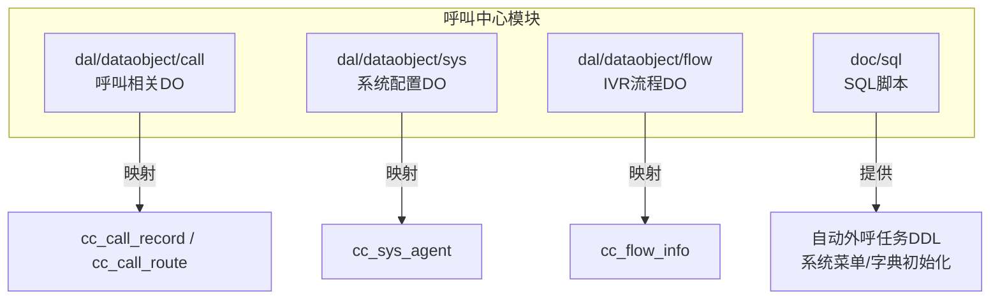
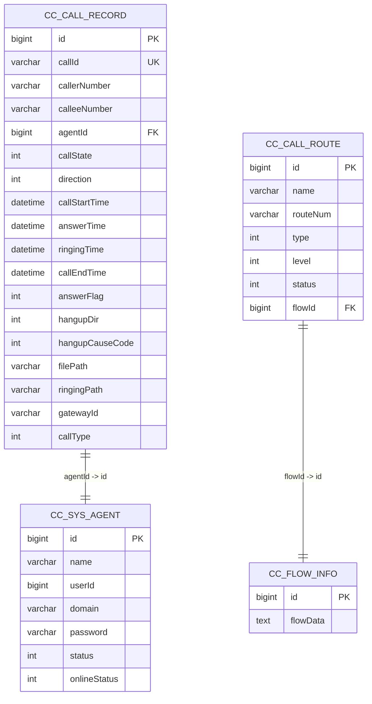
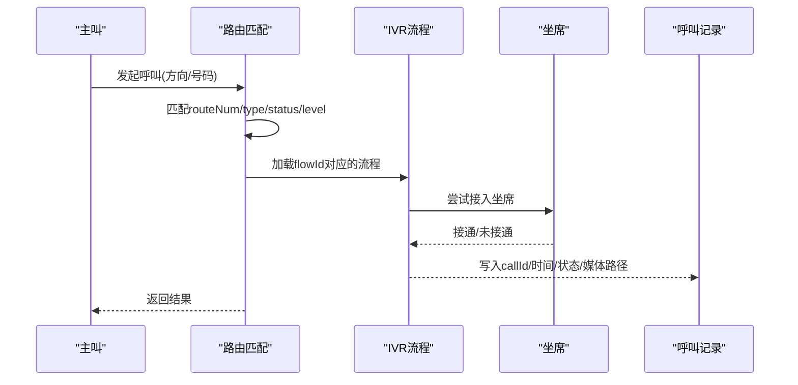

# 核心表结构

<cite>
**本文引用的文件**
- [CallRecordDO.java](file://yudao-cloud/yudao-module-cc/yudao-module-cc-server/src/main/java/cn/iocoder/yudao/module/cc/dal/dataobject/call/CallRecordDO.java)
- [SysAgentDO.java](file://yudao-cloud/yudao-module-cc/yudao-module-cc-server/src/main/java/cn/iocoder/yudao/module/cc/dal/dataobject/sys/SysAgentDO.java)
- [CallRouteDO.java](file://yudao-cloud/yudao-module-cc/yudao-module-cc-server/src/main/java/cn/iocoder/yudao/module/cc/dal/dataobject/call/CallRouteDO.java)
- [FlowInfoDO.java](file://yudao-cloud/yudao-module-cc/yudao-module-cc-server/src/main/java/cn/iocoder/yudao/module/cc/dal/dataobject/flow/FlowInfoDO.java)
- [autocall_task.sql](file://yudao-cloud/yudao-module-cc/doc/sql/autocall_task.sql)
- [系统数据初始化.sql](file://yudao-cloud/yudao-module-cc/doc/sql/系统数据初始化.sql)
</cite>

## 目录
1. [简介](#简介)
2. [项目结构](#项目结构)
3. [核心组件](#核心组件)
4. [架构总览](#架构总览)
5. [详细组件分析](#详细组件分析)
6. [依赖关系分析](#依赖关系分析)
7. [性能考虑](#性能考虑)
8. [故障排查指南](#故障排查指南)
9. [结论](#结论)
10. [附录](#附录)

## 简介
本文件聚焦呼叫中心模块的核心业务表结构，围绕以下四张核心表进行详细说明：
- 呼叫记录表（cc_call_record）
- 坐席信息表（cc_sys_agent）
- 路由规则表（cc_call_route）
- IVR流程表（cc_flow_info，对应文档中的 cc_flow）

内容涵盖字段定义、数据类型与约束、业务含义与取值范围、索引与唯一性约束、主外键关系、实体关系模型、建表语句示例、常用查询模式以及数据完整性与业务规则验证要点。

## 项目结构
本项目采用多模块架构，呼叫中心能力集中在 yudao-module-cc 模块中。核心表的数据对象（DO）位于 dal/dataobject 下，按功能域分目录组织；SQL脚本位于 doc/sql 目录，包含自动外呼任务相关DDL及系统菜单/字典初始化脚本。

图表来源
- [CallRecordDO.java:1-121](file://yudao-cloud/yudao-module-cc/yudao-module-cc-server/src/main/java/cn/iocoder/yudao/module/cc/dal/dataobject/call/CallRecordDO.java#L1-L121)
- [SysAgentDO.java:1-29](file://yudao-cloud/yudao-module-cc/yudao-module-cc-server/src/main/java/cn/iocoder/yudao/module/cc/dal/dataobject/sys/SysAgentDO.java#L1-L29)
- [CallRouteDO.java:1-56](file://yudao-cloud/yudao-module-cc/yudao-module-cc-server/src/main/java/cn/iocoder/yudao/module/cc/dal/dataobject/call/CallRouteDO.java#L1-L56)
- [FlowInfoDO.java:1-35](file://yudao-cloud/yudao-module-cc/yudao-module-cc-server/src/main/java/cn/iocoder/yudao/module/cc/dal/dataobject/flow/FlowInfoDO.java#L1-L35)
- [autocall_task.sql:1-101](file://yudao-cloud/yudao-module-cc/doc/sql/autocall_task.sql#L1-L101)
- [系统数据初始化.sql:1-203](file://yudao-cloud/yudao-module-cc/doc/sql/系统数据初始化.sql#L1-L203)

章节来源
- [CallRecordDO.java:1-121](file://yudao-cloud/yudao-module-cc/yudao-module-cc-server/src/main/java/cn/iocoder/yudao/module/cc/dal/dataobject/call/CallRecordDO.java#L1-L121)
- [SysAgentDO.java:1-29](file://yudao-cloud/yudao-module-cc/yudao-module-cc-server/src/main/java/cn/iocoder/yudao/module/cc/dal/dataobject/sys/SysAgentDO.java#L1-L29)
- [CallRouteDO.java:1-56](file://yudao-cloud/yudao-module-cc/yudao-module-cc-server/src/main/java/cn/iocoder/yudao/module/cc/dal/dataobject/call/CallRouteDO.java#L1-L56)
- [FlowInfoDO.java:1-35](file://yudao-cloud/yudao-module-cc/yudao-module-cc-server/src/main/java/cn/iocoder/yudao/module/cc/dal/dataobject/flow/FlowInfoDO.java#L1-L35)
- [autocall_task.sql:1-101](file://yudao-cloud/yudao-module-cc/doc/sql/autocall_task.sql#L1-L101)
- [系统数据初始化.sql:1-203](file://yudao-cloud/yudao-module-cc/doc/sql/系统数据初始化.sql#L1-L203)

## 核心组件
本节对四张核心表的字段、类型、约束与业务含义进行说明，并给出索引与关联关系建议。

- 呼叫记录表（cc_call_record）
  - 主键：id（自增）
  - 关键字段：callId（呼叫唯一ID）、callerNumber/calleeNumber（主被叫号码）、agentId/agentNumber/agentName（坐席信息）、callState（呼叫状态）、direction（呼叫方向）、answerFlag（应答标识）、hangupDir/hangupCauseCode（挂机方向与原因）、filePath/ringingPath（录音/振铃路径）、gatewayId（网关ID）、callType（呼叫类型）
  - 时间字段：callStartTime/answerTime/ringingTime/callEndTime
  - 通用字段：继承租户基类（tenant_id、创建者/时间、更新者/时间、逻辑删除等）
  - 索引建议：idx_call_id(callId)、idx_direction(direction)、idx_state(callState)、idx_agent(agentId)、idx_time_range(callStartTime, callEndTime)
  - 业务含义：完整记录一次通话的起止、路由、坐席、媒体资源与结果

- 坐席信息表（cc_sys_agent）
  - 主键：id（自增）
  - 关键字段：name（名称）、userId（用户ID）、domain（SIP域）、password（密码）、status（启用状态）、onlineStatus（在线状态）
  - 通用字段：继承租户基类
  - 索引建议：idx_user(userId)、idx_domain(domain)
  - 业务含义：管理SIP坐席账号、登录信息与在线状态

- 路由规则表（cc_call_route）
  - 主键：id（自增）
  - 关键字段：name（路由名称）、routeNum（匹配号码/前缀）、type（呼入/呼出）、level（优先级）、status（启用状态）、flowId（关联IVR流程ID）
  - 通用字段：继承租户基类
  - 索引建议：idx_type_status(type, status)、idx_route_num(routeNum)、idx_flow(flowId)
  - 业务含义：根据号码与方向匹配到具体IVR流程或出局策略

- IVR流程表（cc_flow_info，即 cc_flow）
  - 主键：id（自增）
  - 关键字段：flowData（流程定义JSON/XML）
  - 通用字段：继承租户基类
  - 索引建议：无特殊索引需求
  - 业务含义：存储IVR流程定义，供路由与执行引擎使用

章节来源
- [CallRecordDO.java:1-121](file://yudao-cloud/yudao-module-cc/yudao-module-cc-server/src/main/java/cn/iocoder/yudao/module/cc/dal/dataobject/call/CallRecordDO.java#L1-L121)
- [SysAgentDO.java:1-29](file://yudao-cloud/yudao-module-cc/yudao-module-cc-server/src/main/java/cn/iocoder/yudao/module/cc/dal/dataobject/sys/SysAgentDO.java#L1-L29)
- [CallRouteDO.java:1-56](file://yudao-cloud/yudao-module-cc/yudao-module-cc-server/src/main/java/cn/iocoder/yudao/module/cc/dal/dataobject/call/CallRouteDO.java#L1-L56)
- [FlowInfoDO.java:1-35](file://yudao-cloud/yudao-module-cc/yudao-module-cc-server/src/main/java/cn/iocoder/yudao/module/cc/dal/dataobject/flow/FlowInfoDO.java#L1-L35)

## 架构总览
下图展示核心表之间的关联关系与典型调用链路：路由匹配到IVR流程，呼叫过程中落库呼叫记录，坐席参与通话。

图表来源
- [CallRecordDO.java:1-121](file://yudao-cloud/yudao-module-cc/yudao-module-cc-server/src/main/java/cn/iocoder/yudao/module/cc/dal/dataobject/call/CallRecordDO.java#L1-L121)
- [SysAgentDO.java:1-29](file://yudao-cloud/yudao-module-cc/yudao-module-cc-server/src/main/java/cn/iocoder/yudao/module/cc/dal/dataobject/sys/SysAgentDO.java#L1-L29)
- [CallRouteDO.java:1-56](file://yudao-cloud/yudao-module-cc/yudao-module-cc-server/src/main/java/cn/iocoder/yudao/module/cc/dal/dataobject/call/CallRouteDO.java#L1-L56)
- [FlowInfoDO.java:1-35](file://yudao-cloud/yudao-module-cc/yudao-module-cc-server/src/main/java/cn/iocoder/yudao/module/cc/dal/dataobject/flow/FlowInfoDO.java#L1-L35)

## 详细组件分析

### 呼叫记录表（cc_call_record）
- 字段与业务含义
  - id：主键
  - callId：呼叫唯一标识，用于跨系统追踪
  - callerNumber/calleeNumber：主被叫号码
  - callerDisplayNumber/calleeDisplayNumber：显号（来电显示）
  - numberLocation：归属地
  - agentId/agentNumber/agentName：坐席关联与展示信息
  - callState：呼叫结果（成功/失败）
  - direction：呼入/呼出
  - callStartTime/answerTime/ringingTime/callEndTime：关键时间点
  - answerFlag：应答情况（接通/部分接通等）
  - hangupDir/hangupCauseCode：挂机方向与原因码
  - filePath/ringingPath：录音与振铃文件路径
  - gatewayId：出局网关标识
  - callType：呼叫类型（IVR/出局/内部/三方/双向/转接/自动外呼）
- 约束与索引
  - 主键：id
  - 唯一性：建议为 callId 建立唯一索引，避免重复落库
  - 查询优化：按 direction、callState、agentId、时间范围建立复合索引
- 数据完整性
  - 必填校验：callId、callerNumber、calleeNumber、direction、callStartTime、callEndTime
  - 枚举校验：direction、callState、answerFlag、hangupDir、callType 需符合字典定义
- 常用查询模式
  - 按时间段统计呼入呼出量
  - 按坐席维度统计通话时长与成功率
  - 按网关/呼叫类型分析路由效果

章节来源
- [CallRecordDO.java:1-121](file://yudao-cloud/yudao-module-cc/yudao-module-cc-server/src/main/java/cn/iocoder/yudao/module/cc/dal/dataobject/call/CallRecordDO.java#L1-L121)
- [系统数据初始化.sql:123-203](file://yudao-cloud/yudao-module-cc/doc/sql/系统数据初始化.sql#L123-L203)

### 坐席信息表（cc_sys_agent）
- 字段与业务含义
  - id：主键
  - name：坐席名称
  - userId：关联系统用户
  - domain：SIP域
  - password：密码
  - status：启用状态
  - onlineStatus：在线状态（空闲/忙碌/离线等）
- 约束与索引
  - 主键：id
  - 唯一性：建议对 (domain, name) 或 userId 建立唯一约束，防止重复账号
  - 查询优化：按 userId、domain 建立索引
- 数据完整性
  - 必填校验：name、domain、password、status
  - 枚举校验：onlineStatus 需符合字典定义
- 常用查询模式
  - 按用户查询坐席信息
  - 统计各状态坐席数量

章节来源
- [SysAgentDO.java:1-29](file://yudao-cloud/yudao-module-cc/yudao-module-cc-server/src/main/java/cn/iocoder/yudao/module/cc/dal/dataobject/sys/SysAgentDO.java#L1-L29)
- [系统数据初始化.sql:123-203](file://yudao-cloud/yudao-module-cc/doc/sql/系统数据初始化.sql#L123-L203)

### 路由规则表（cc_call_route）
- 字段与业务含义
  - id：主键
  - name：路由名称
  - routeNum：匹配号码或前缀
  - type：呼入/呼出
  - level：优先级（数字越大越优先）
  - status：启用状态
  - flowId：关联IVR流程ID
- 约束与索引
  - 主键：id
  - 唯一性：建议对 (type, routeNum, status) 建立唯一约束，避免冲突
  - 查询优化：按 type、status、routeNum 建立复合索引
- 数据完整性
  - 必填校验：name、routeNum、type、level、status、flowId
  - 枚举校验：type、status 需符合字典定义
- 常用查询模式
  - 按号码前缀与方向匹配路由
  - 按优先级选择最优路由

章节来源
- [CallRouteDO.java:1-56](file://yudao-cloud/yudao-module-cc/yudao-module-cc-server/src/main/java/cn/iocoder/yudao/module/cc/dal/dataobject/call/CallRouteDO.java#L1-L56)
- [系统数据初始化.sql:123-203](file://yudao-cloud/yudao-module-cc/doc/sql/系统数据初始化.sql#L123-L203)

### IVR流程表（cc_flow_info，即 cc_flow）
- 字段与业务含义
  - id：主键
  - flowData：流程定义（JSON/XML），描述节点、条件、动作等
- 约束与索引
  - 主键：id
  - 唯一性：可按流程版本或名称增加唯一约束（若存在）
- 数据完整性
  - 必填校验：flowData 非空且格式合法
- 常用查询模式
  - 按流程ID获取流程定义
  - 导出/导入流程配置

章节来源
- [FlowInfoDO.java:1-35](file://yudao-cloud/yudao-module-cc/yudao-module-cc-server/src/main/java/cn/iocoder/yudao/module/cc/dal/dataobject/flow/FlowInfoDO.java#L1-L35)

## 依赖关系分析
核心表间的依赖关系如下：
- cc_call_record.agentId -> cc_sys_agent.id
- cc_call_route.flowId -> cc_flow_info.id
- 路由匹配流程：根据 direction、routeNum、status、level 选择 flowId，再执行对应IVR流程
- 通话过程：在路由与IVR执行过程中写入 cc_call_record，关联坐席与流程

图表来源
- [CallRouteDO.java:1-56](file://yudao-cloud/yudao-module-cc/yudao-module-cc-server/src/main/java/cn/iocoder/yudao/module/cc/dal/dataobject/call/CallRouteDO.java#L1-L56)
- [FlowInfoDO.java:1-35](file://yudao-cloud/yudao-module-cc/yudao-module-cc-server/src/main/java/cn/iocoder/yudao/module/cc/dal/dataobject/flow/FlowInfoDO.java#L1-L35)
- [CallRecordDO.java:1-121](file://yudao-cloud/yudao-module-cc/yudao-module-cc-server/src/main/java/cn/iocoder/yudao/module/cc/dal/dataobject/call/CallRecordDO.java#L1-L121)
- [SysAgentDO.java:1-29](file://yudao-cloud/yudao-module-cc/yudao-module-cc-server/src/main/java/cn/iocoder/yudao/module/cc/dal/dataobject/sys/SysAgentDO.java#L1-L29)

## 性能考虑
- 索引设计
  - 呼叫记录表：针对高频查询建立复合索引，如 (direction, callStartTime, callEndTime)、(agentId, callState)
  - 路由表：(type, status, routeNum) 复合索引提升匹配效率
  - 坐席位：(userId, domain) 唯一索引避免重复
- 分区与归档
  - 呼叫记录表按时间分区（月/季度），历史数据归档至冷存储
- 缓存策略
  - 路由规则可缓存至内存/Redis，减少数据库压力
- 批量写入
  - 通话事件落库采用批量插入，降低事务开销

[本节为通用指导，不直接分析具体文件]

## 故障排查指南
- 常见问题定位
  - 路由未命中：检查 routeNum 前缀、type、status、level 配置是否正确
  - 呼叫记录缺失：确认 callId 是否生成、ESL事件是否上报、写入逻辑是否异常
  - 坐席状态异常：核对 onlineStatus 字典值与前端展示一致性
- 日志与监控
  - 关注路由匹配日志、IVR执行日志、ESL事件处理日志
  - 监控数据库慢查询，优化热点查询
- 数据一致性
  - 校验 callId 唯一性，避免重复记录
  - 校验枚举字段取值范围，防止脏数据

章节来源
- [系统数据初始化.sql:123-203](file://yudao-cloud/yudao-module-cc/doc/sql/系统数据初始化.sql#L123-L203)

## 结论
通过对四张核心表的字段、约束、索引与关联关系的梳理，形成了清晰的实体关系模型与查询优化策略。结合字典定义与业务规则，可在保证数据完整性的同时提升系统性能与可维护性。建议在实施中严格遵循索引设计与数据校验规范，并对历史数据进行合理归档。

[本节为总结性内容，不直接分析具体文件]

## 附录

### 建表语句示例（参考）
- 自动外呼任务相关DDL参考：见 [autocall_task.sql:11-66](file://yudao-cloud/yudao-module-cc/doc/sql/autocall_task.sql#L11-L66)
- 系统菜单与字典初始化参考：见 [系统数据初始化.sql:1-203](file://yudao-cloud/yudao-module-cc/doc/sql/系统数据初始化.sql#L1-L203)

章节来源
- [autocall_task.sql:11-66](file://yudao-cloud/yudao-module-cc/doc/sql/autocall_task.sql#L11-L66)
- [系统数据初始化.sql:1-203](file://yudao-cloud/yudao-module-cc/doc/sql/系统数据初始化.sql#L1-L203)

### 常用查询模式（示例）
- 按时间段统计呼入呼出量
  - 思路：SELECT COUNT(*) FROM cc_call_record WHERE direction = ? AND callStartTime BETWEEN ? AND ?
- 按坐席维度统计通话时长与成功率
  - 思路：SELECT agentId, AVG(duration), SUM(CASE WHEN callState=1 THEN 1 ELSE 0 END)/COUNT(*) FROM cc_call_record GROUP BY agentId
- 按网关/呼叫类型分析路由效果
  - 思路：SELECT gatewayId, callType, COUNT(*) FROM cc_call_record GROUP BY gatewayId, callType

[本节为通用指导，不直接分析具体文件]