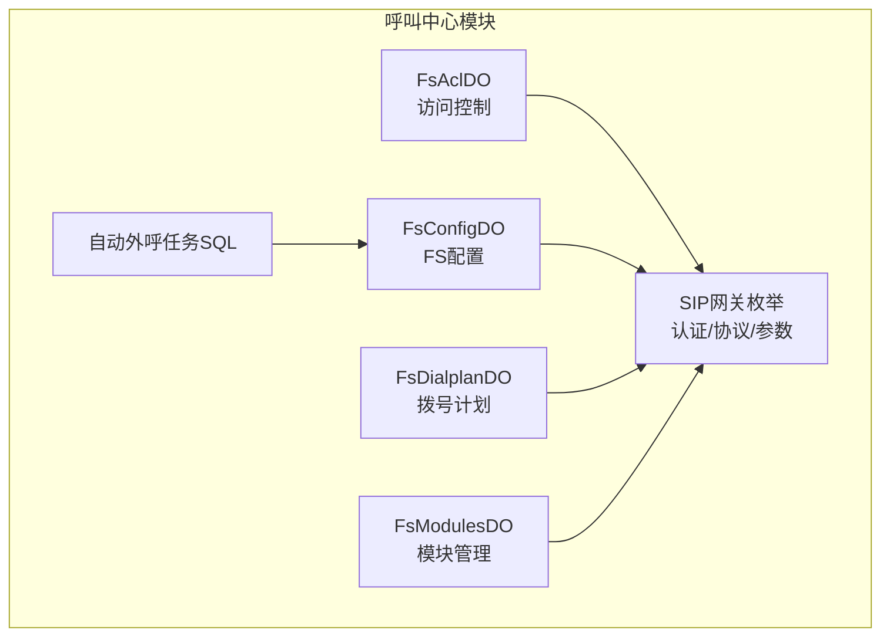
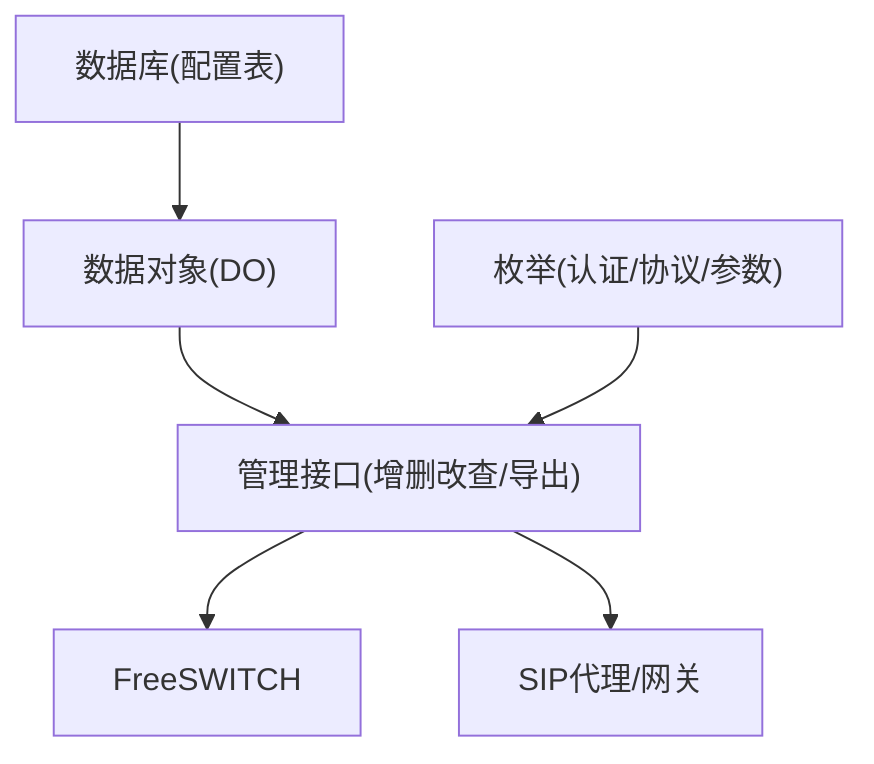
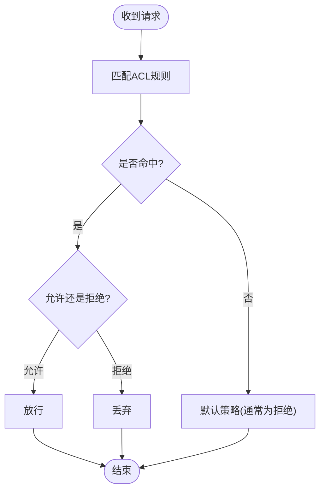
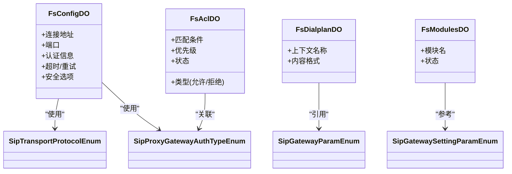

# 系统配置表

<cite>
**本文引用的文件**
- [系统数据初始化.sql](file://yudao-cloud/yudao-module-cc/doc/sql/系统数据初始化.sql)
- [FsAclDO.java](file://yudao-cloud/yudao-module-cc/yudao-module-cc-server/src/main/java/cn/iocoder/yudao/module/cc/dal/dataobject/fs/FsAclDO.java)
- [FsConfigDO.java](file://yudao-cloud/yudao-module-cc/yudao-module-cc-server/src/main/java/cn/iocoder/yudao/module/cc/dal/dataobject/fs/FsConfigDO.java)
- [FsDialplanDO.java](file://yudao-cloud/yudao-module-cc/yudao-module-cc-server/src/main/java/cn/iocoder/yudao/module/cc/dal/dataobject/fs/FsDialplanDO.java)
- [FsModulesDO.java](file://yudao-cloud/yudao-module-cc/yudao-module-cc-server/src/main/java/cn/iocoder/yudao/module/cc/dal/dataobject/fs/FsModulesDO.java)
- [SipProxyGatewayAuthTypeEnum.java](file://yudao-cloud/yudao-module-cc/yudao-module-cc-server/src/main/java/cn/iocoder/yudao/module/cc/enums/SipProxyGatewayAuthTypeEnum.java)
- [SipTransportProtocolEnum.java](file://yudao-cloud/yudao-module-cc/yudao-module-cc-server/src/main/java/cn/iocoder/yudao/module/cc/enums/SipTransportProtocolEnum.java)
- [SipGatewayParamEnum.java](file://yudao-cloud/yudao-module-cc/yudao-module-cc-server/src/main/java/cn/iocoder/yudao/module/cc/enums/SipGatewayParamEnum.java)
- [SipGatewaySettingParamEnum.java](file://yudao-cloud/yudao-module-cc/yudao-module-cc-server/src/main/java/cn/iocoder/yudao/module/cc/enums/SipGatewaySettingParamEnum.java)
- [autocall_task.sql](file://yudao-cloud/yudao-module-cc/doc/sql/autocall_task.sql)
</cite>

## 目录
1. [简介](#简介)
2. [项目结构](#项目结构)
3. [核心组件](#核心组件)
4. [架构总览](#架构总览)
5. [详细组件分析](#详细组件分析)
6. [依赖关系分析](#依赖关系分析)
7. [性能考虑](#性能考虑)
8. [故障排查指南](#故障排查指南)
9. [结论](#结论)
10. [附录](#附录)

## 简介
本文件围绕系统配置相关的数据表与实体，提供面向运维与开发的权威说明。重点覆盖：
- FreeSWITCH 配置表（FsConfig）
- 访问控制列表表（FsAcl）
- 网关配置表（SIP 网关相关枚举与参数）
- 拨号计划与模块管理（FsDialplan、FsModules）
并详细说明各配置项含义、取值范围、匹配逻辑、健康检查机制、热更新与版本管理策略，以及备份恢复与批量导入导出能力。

## 项目结构
本项目在呼叫中心模块中集中管理与 FreeSWITCH 及 SIP 代理相关的配置与运行时数据。关键位置如下：
- 数据库初始化脚本：定义菜单、字典与部分业务表
- 数据对象（DO）：映射 FreeSWITCH 与 SIP 相关配置表
- 枚举：统一网关认证方式、传输协议、参数键等
- 自动外呼任务：独立 SQL 脚本定义任务与记录表

图表来源
- [FsAclDO.java](file://yudao-cloud/yudao-module-cc/yudao-module-cc-server/src/main/java/cn/iocoder/yudao/module/cc/dal/dataobject/fs/FsAclDO.java)
- [FsConfigDO.java](file://yudao-cloud/yudao-module-cc/yudao-module-cc-server/src/main/java/cn/iocoder/yudao/module/cc/dal/dataobject/fs/FsConfigDO.java)
- [FsDialplanDO.java](file://yudao-cloud/yudao-module-cc/yudao-module-cc-server/src/main/java/cn/iocoder/yudao/module/cc/dal/dataobject/fs/FsDialplanDO.java)
- [FsModulesDO.java](file://yudao-cloud/yudao-module-cc/yudao-module-cc-server/src/main/java/cn/iocoder/yudao/module/cc/dal/dataobject/fs/FsModulesDO.java)
- [SipProxyGatewayAuthTypeEnum.java](file://yudao-cloud/yudao-module-cc/yudao-module-cc-server/src/main/java/cn/iocoder/yudao/module/cc/enums/SipProxyGatewayAuthTypeEnum.java)
- [SipTransportProtocolEnum.java](file://yudao-cloud/yudao-module-cc/yudao-module-cc-server/src/main/java/cn/iocoder/yudao/module/cc/enums/SipTransportProtocolEnum.java)
- [autocall_task.sql](file://yudao-cloud/yudao-module-cc/doc/sql/autocall_task.sql)

章节来源
- [系统数据初始化.sql:1-203](file://yudao-cloud/yudao-module-cc/doc/sql/系统数据初始化.sql#L1-L203)
- [autocall_task.sql:1-101](file://yudao-cloud/yudao-module-cc/doc/sql/autocall_task.sql#L1-L101)

## 核心组件
- 访问控制列表（FsAcl）：用于限制或允许特定来源的访问，支持“允许/拒绝”类型，配合上下文与规则进行匹配。
- FreeSWITCH 配置（FsConfig）：维护 FS 实例的连接地址、端口、认证信息等基础连接参数。
- 拨号计划（FsDialplan）：描述路由上下文与内容格式（XML/JSON），支撑呼叫路由与流程编排。
- 模块管理（FsModules）：管理 FreeSWITCH 模块加载与状态，便于启用/禁用功能模块。
- SIP 网关参数与枚举：统一网关认证方式、传输协议、参数键，确保跨模块一致性。

章节来源
- [FsAclDO.java](file://yudao-cloud/yudao-module-cc/yudao-module-cc-server/src/main/java/cn/iocoder/yudao/module/cc/dal/dataobject/fs/FsAclDO.java)
- [FsConfigDO.java](file://yudao-cloud/yudao-module-cc/yudao-module-cc-server/src/main/java/cn/iocoder/yudao/module/cc/dal/dataobject/fs/FsConfigDO.java)
- [FsDialplanDO.java](file://yudao-cloud/yudao-module-cc/yudao-module-cc-server/src/main/java/cn/iocoder/yudao/module/cc/dal/dataobject/fs/FsDialplanDO.java)
- [FsModulesDO.java](file://yudao-cloud/yudao-module-cc/yudao-module-cc-server/src/main/java/cn/iocoder/yudao/module/cc/dal/dataobject/fs/FsModulesDO.java)
- [SipProxyGatewayAuthTypeEnum.java](file://yudao-cloud/yudao-module-cc/yudao-module-cc-server/src/main/java/cn/iocoder/yudao/module/cc/enums/SipProxyGatewayAuthTypeEnum.java)
- [SipTransportProtocolEnum.java](file://yudao-cloud/yudao-module-cc/yudao-module-cc-server/src/main/java/cn/iocoder/yudao/module/cc/enums/SipTransportProtocolEnum.java)
- [SipGatewayParamEnum.java](file://yudao-cloud/yudao-module-cc/yudao-module-cc-server/src/main/java/cn/iocoder/yudao/module/cc/enums/SipGatewayParamEnum.java)
- [SipGatewaySettingParamEnum.java](file://yudao-cloud/yudao-module-cc/yudao-module-cc-server/src/main/java/cn/iocoder/yudao/module/cc/enums/SipGatewaySettingParamEnum.java)

## 架构总览
下图展示配置数据从持久化到运行时生效的关键路径，包括 FS 配置、ACL、拨号计划与 SIP 网关参数的协同工作。

图表来源
- [FsConfigDO.java](file://yudao-cloud/yudao-module-cc/yudao-module-cc-server/src/main/java/cn/iocoder/yudao/module/cc/dal/dataobject/fs/FsConfigDO.java)
- [FsAclDO.java](file://yudao-cloud/yudao-module-cc/yudao-module-cc-server/src/main/java/cn/iocoder/yudao/module/cc/dal/dataobject/fs/FsAclDO.java)
- [FsDialplanDO.java](file://yudao-cloud/yudao-module-cc/yudao-module-cc-server/src/main/java/cn/iocoder/yudao/module/cc/dal/dataobject/fs/FsDialplanDO.java)
- [SipProxyGatewayAuthTypeEnum.java](file://yudao-cloud/yudao-module-cc/yudao-module-cc-server/src/main/java/cn/iocoder/yudao/module/cc/enums/SipProxyGatewayAuthTypeEnum.java)
- [SipTransportProtocolEnum.java](file://yudao-cloud/yudao-module-cc/yudao-module-cc-server/src/main/java/cn/iocoder/yudao/module/cc/enums/SipTransportProtocolEnum.java)

## 详细组件分析

### FreeSWITCH 配置表（FsConfig）
- 用途：存储 FreeSWITCH 实例的连接信息与管理参数，如服务器地址、端口、认证凭据等。
- 关键字段建议（基于常见实现模式）：
  - 服务器地址：SIP/ESL 服务主机名或 IP
  - 端口：SIP 注册端口或 ESL 管理端口
  - 认证信息：用户名/密码或令牌
  - 超时与重试：连接超时、重连间隔
  - 安全选项：TLS/SSL 开关、证书路径
- 取值范围与约束：
  - 端口需在合法范围内（如 SIP 常用 5060/5061，ESL 常用 8021）
  - 认证信息需加密存储或受权限保护
  - 地址支持域名与 IPv4/IPv6
- 使用场景：
  - 创建/更新 FS 连接池
  - 拨号前校验连通性
  - 事件订阅与监控

章节来源
- [FsConfigDO.java](file://yudao-cloud/yudao-module-cc/yudao-module-cc-server/src/main/java/cn/iocoder/yudao/module/cc/dal/dataobject/fs/FsConfigDO.java)

### 访问控制列表表（FsAcl）
- 用途：定义允许或拒绝的来源访问规则，常用于限制 SIP 注册、媒体流或管理接口的来源。
- 规则字段建议：
  - 类型：允许/拒绝
  - 匹配条件：源网段、IP、用户域、上下文
  - 优先级：多条规则时的匹配顺序
  - 状态：启用/停用
- 匹配逻辑：
  - 自上而下或按优先级排序匹配
  - 命中后执行允许或拒绝动作
  - 未命中时走默认策略（通常拒绝）
- 典型用法：
  - 仅允许内网网段注册
  - 拒绝已知恶意来源
  - 按上下文隔离不同租户

图表来源
- [FsAclDO.java](file://yudao-cloud/yudao-module-cc/yudao-module-cc-server/src/main/java/cn/iocoder/yudao/module/cc/dal/dataobject/fs/FsAclDO.java)
- [系统数据初始化.sql:145-201](file://yudao-cloud/yudao-module-cc/doc/sql/系统数据初始化.sql#L145-L201)

章节来源
- [FsAclDO.java](file://yudao-cloud/yudao-module-cc/yudao-module-cc-server/src/main/java/cn/iocoder/yudao/module/cc/dal/dataobject/fs/FsAclDO.java)
- [系统数据初始化.sql:145-201](file://yudao-cloud/yudao-module-cc/doc/sql/系统数据初始化.sql#L145-L201)

### 网关配置表（SIP 网关）
- 用途：管理 SIP 网关连接参数与行为，包括认证方式、传输协议、主叫号码处理等。
- 关键枚举与参数：
  - 认证方式：基本认证、摘要认证、无认证等（见 SipProxyGatewayAuthTypeEnum）
  - 传输协议：UDP/TCP/TLS 等（见 SipTransportProtocolEnum）
  - 参数键：网关级通用参数键集合（见 SipGatewayParamEnum）
  - 设置参数：具体可配置的参数项（见 SipGatewaySettingParamEnum）
- 健康检查机制：
  - 周期性探测：心跳/注册状态/信令可达性
  - 失败判定：连续失败阈值、超时时间
  - 恢复策略：自动重试、切换备用网关、告警通知
- 配置项示例（概念性）：
  - 远端地址与端口
  - 认证凭据
  - 传输协议与安全选项
  - 主叫号码转换规则
  - 会话超时与保持时长

章节来源
- [SipProxyGatewayAuthTypeEnum.java](file://yudao-cloud/yudao-module-cc/yudao-module-cc-server/src/main/java/cn/iocoder/yudao/module/cc/enums/SipProxyGatewayAuthTypeEnum.java)
- [SipTransportProtocolEnum.java](file://yudao-cloud/yudao-module-cc/yudao-module-cc-server/src/main/java/cn/iocoder/yudao/module/cc/enums/SipTransportProtocolEnum.java)
- [SipGatewayParamEnum.java](file://yudao-cloud/yudao-module-cc/yudao-module-cc-server/src/main/java/cn/iocoder/yudao/module/cc/enums/SipGatewayParamEnum.java)
- [SipGatewaySettingParamEnum.java](file://yudao-cloud/yudao-module-cc/yudao-module-cc-server/src/main/java/cn/iocoder/yudao/module/cc/enums/SipGatewaySettingParamEnum.java)

### 拨号计划与模块管理（FsDialplan、FsModules）
- 拨号计划（FsDialplan）：
  - 上下文名称：如 default/public，决定路由作用域
  - 内容格式：XML/JSON，描述路由规则与动作
  - 关联关系：与网关、ACL、IVR 流程联动
- 模块管理（FsModules）：
  - 模块清单：语音合成、录音、转码等
  - 状态：已加载/未加载/加载失败
  - 生命周期：按需加载、动态卸载

章节来源
- [FsDialplanDO.java](file://yudao-cloud/yudao-module-cc/yudao-module-cc-server/src/main/java/cn/iocoder/yudao/module/cc/dal/dataobject/fs/FsDialplanDO.java)
- [FsModulesDO.java](file://yudao-cloud/yudao-module-cc/yudao-module-cc-server/src/main/java/cn/iocoder/yudao/module/cc/dal/dataobject/fs/FsModulesDO.java)
- [系统数据初始化.sql:192-197](file://yudao-cloud/yudao-module-cc/doc/sql/系统数据初始化.sql#L192-L197)

### 自动外呼任务（补充）
- 任务表：存储外呼任务配置（目标号码、IVR 流程、网关选择、主叫号码、优先级等）
- 记录表：记录每次外呼的执行结果（接通状态、时长、挂断原因等）
- 与配置的关系：通过网关 ID 或号码路由选择出口；IVR 流程由拨号计划驱动

章节来源
- [autocall_task.sql:1-101](file://yudao-cloud/yudao-module-cc/doc/sql/autocall_task.sql#L1-L101)

## 依赖关系分析
- 配置表与枚举：
  - FsConfig 依赖传输协议与认证方式枚举，保证参数合法性
  - FsAcl 依赖 ACL 类型字典，统一允许/拒绝语义
  - FsDialplan 依赖上下文名称与内容格式字典
- 运行时依赖：
  - 管理接口读取 DO 与枚举，生成 FS/SIP 配置下发
  - 健康检查模块依赖网关枚举中的参数键与设置项

图表来源
- [FsConfigDO.java](file://yudao-cloud/yudao-module-cc/yudao-module-cc-server/src/main/java/cn/iocoder/yudao/module/cc/dal/dataobject/fs/FsConfigDO.java)
- [FsAclDO.java](file://yudao-cloud/yudao-module-cc/yudao-module-cc-server/src/main/java/cn/iocoder/yudao/module/cc/dal/dataobject/fs/FsAclDO.java)
- [FsDialplanDO.java](file://yudao-cloud/yudao-module-cc/yudao-module-cc-server/src/main/java/cn/iocoder/yudao/module/cc/dal/dataobject/fs/FsDialplanDO.java)
- [FsModulesDO.java](file://yudao-cloud/yudao-module-cc/yudao-module-cc-server/src/main/java/cn/iocoder/yudao/module/cc/dal/dataobject/fs/FsModulesDO.java)
- [SipProxyGatewayAuthTypeEnum.java](file://yudao-cloud/yudao-module-cc/yudao-module-cc-server/src/main/java/cn/iocoder/yudao/module/cc/enums/SipProxyGatewayAuthTypeEnum.java)
- [SipTransportProtocolEnum.java](file://yudao-cloud/yudao-module-cc/yudao-module-cc-server/src/main/java/cn/iocoder/yudao/module/cc/enums/SipTransportProtocolEnum.java)
- [SipGatewayParamEnum.java](file://yudao-cloud/yudao-module-cc/yudao-module-cc-server/src/main/java/cn/iocoder/yudao/module/cc/enums/SipGatewayParamEnum.java)
- [SipGatewaySettingParamEnum.java](file://yudao-cloud/yudao-module-cc/yudao-module-cc-server/src/main/java/cn/iocoder/yudao/module/cc/enums/SipGatewaySettingParamEnum.java)

## 性能考虑
- 配置缓存：将 FS 配置、ACL、拨号计划热点数据缓存至内存，减少数据库压力
- 批量操作：导入导出采用分批处理，避免大事务锁表
- 健康检查：合理设置探测频率与阈值，避免风暴式探测
- 索引优化：为高频查询字段建立索引（如租户ID、状态、更新时间）

## 故障排查指南
- 连接失败：
  - 检查 FsConfig 的地址与端口是否正确
  - 验证认证信息与网络可达性
  - 查看健康检查日志与失败原因
- ACL 误拦截：
  - 核对规则优先级与匹配条件
  - 临时放宽规则定位问题
  - 结合上下文与来源信息进行排查
- 网关异常：
  - 确认传输协议与安全选项
  - 检查认证方式与凭据
  - 观察连续失败次数与恢复策略
- 拨号计划不生效：
  - 校验上下文名称与内容格式
  - 确认模块加载状态
  - 逐步缩小匹配范围定位冲突

章节来源
- [系统数据初始化.sql:145-201](file://yudao-cloud/yudao-module-cc/doc/sql/系统数据初始化.sql#L145-L201)
- [FsConfigDO.java](file://yudao-cloud/yudao-module-cc/yudao-module-cc-server/src/main/java/cn/iocoder/yudao/module/cc/dal/dataobject/fs/FsConfigDO.java)
- [FsAclDO.java](file://yudao-cloud/yudao-module-cc/yudao-module-cc-server/src/main/java/cn/iocoder/yudao/module/cc/dal/dataobject/fs/FsAclDO.java)
- [FsDialplanDO.java](file://yudao-cloud/yudao-module-cc/yudao-module-cc-server/src/main/java/cn/iocoder/yudao/module/cc/dal/dataobject/fs/FsDialplanDO.java)
- [FsModulesDO.java](file://yudao-cloud/yudao-module-cc/yudao-module-cc-server/src/main/java/cn/iocoder/yudao/module/cc/dal/dataobject/fs/FsModulesDO.java)

## 结论
本系统通过统一的配置表与枚举体系，实现了 FreeSWITCH 与 SIP 网关的可控、可观测与可运维。借助 ACL 规则、拨号计划与模块管理，能够灵活构建呼叫路由与接入策略；结合健康检查与缓存机制，保障高可用与高性能。建议在变更流程中引入版本管理与审批，确保配置变更的安全性与可回滚。

## 附录

### 配置项字典与取值范围（节选）
- 传输协议：UDP、TCP、TLS（依据 SipTransportProtocolEnum）
- 认证方式：基本、摘要、无认证（依据 SipProxyGatewayAuthTypeEnum）
- 拨号计划上下文：default、public（依据系统数据初始化）
- 拨号计划内容格式：xml、json（依据系统数据初始化）
- ACL 类型：allow、deny（依据系统数据初始化）

章节来源
- [系统数据初始化.sql:188-201](file://yudao-cloud/yudao-module-cc/doc/sql/系统数据初始化.sql#L188-L201)
- [SipTransportProtocolEnum.java](file://yudao-cloud/yudao-module-cc/yudao-module-cc-server/src/main/java/cn/iocoder/yudao/module/cc/enums/SipTransportProtocolEnum.java)
- [SipProxyGatewayAuthTypeEnum.java](file://yudao-cloud/yudao-module-cc/yudao-module-cc-server/src/main/java/cn/iocoder/yudao/module/cc/enums/SipProxyGatewayAuthTypeEnum.java)

### 热更新机制与版本管理策略（建议）
- 热更新：
  - 配置变更后即时刷新内存缓存
  - 向 FS/SIP 下发增量配置，避免全量重启
  - 灰度发布：先小范围生效，再全量推广
- 版本管理：
  - 每次变更生成版本号与快照
  - 支持一键回滚至上一版本
  - 审计日志记录变更人、时间与内容

[本节为通用实践建议，不直接分析具体文件]

### 备份恢复与批量导入导出（建议）
- 备份恢复：
  - 定期导出配置表与字典数据
  - 恢复时校验完整性与兼容性
  - 支持按环境（开发/测试/生产）隔离
- 批量导入导出：
  - 提供模板下载与校验
  - 支持分片上传与进度跟踪
  - 失败重试与错误报告

[本节为通用实践建议，不直接分析具体文件]