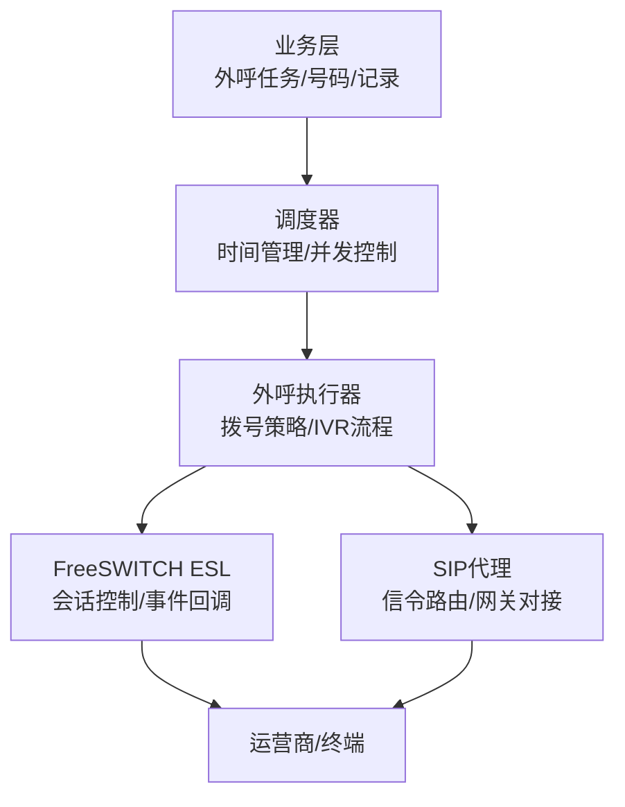
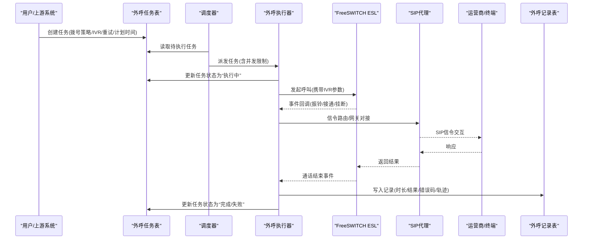
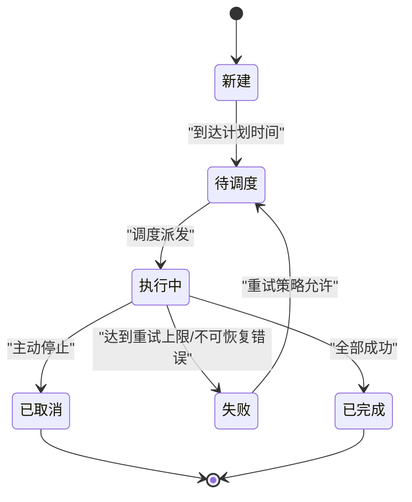
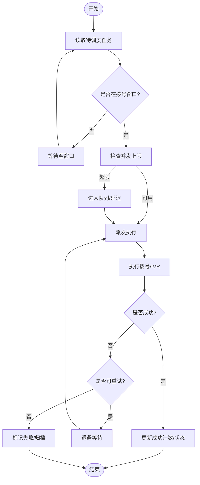

# 自动外呼表

<cite>
**本文引用的文件**
- [autocall_task.sql](file://yudao-module-cc/doc/sql/autocall_task.sql)
- [系统数据初始化.sql](file://yudao-module-cc/doc/sql/系统数据初始化.sql)
- [fs-esl-client组件架构设计.md](file://yudao-module-cc/ipcc-fs-esl/fs-esl-client组件架构设计.md)
- [sipproxy组件架构设计.md](file://yudao-module-cc/ipcc-sipproxy/sipproxy组件架构设计.md)
- [CallRouteStatusEnum.java](file://yudao-module-cc/yudao-module-cc-api/src/main/java/cn/iocoder/yudao/module/cc/enums/CallRouteStatusEnum.java)
- [ErrorCodeConstants.java](file://yudao-module-cc/yudao-module-cc-api/src/main/java/cn/iocoder/yudao/module/cc/enums/ErrorCodeConstants.java)
- [SysVoiceTypeEnum.java](file://yudao-module-cc/yudao-module-cc-api/src/main/java/cn/iocoder/yudao/module/cc/enums/SysVoiceTypeEnum.java)
- [SysVoiceTtsTypeEnum.java](file://yudao-module-cc/yudao-module-cc-api/src/main/java/cn/iocoder/yudao/module/cc/enums/SysVoiceTtsTypeEnum.java)
</cite>

## 目录
1. [简介](#简介)
2. [项目结构](#项目结构)
3. [核心组件](#核心组件)
4. [架构总览](#架构总览)
5. [详细组件分析](#详细组件分析)
6. [依赖关系分析](#依赖关系分析)
7. [性能考虑](#性能考虑)
8. [故障排查指南](#故障排查指南)
9. [结论](#结论)
10. [附录](#附录)

## 简介
本文件围绕“自动外呼”相关数据模型与运行机制，系统化说明外呼任务表、外呼号码表、外呼记录表的字段含义、状态流转、调度时间管理与并发控制策略，并给出批量导入导出能力建议与数据统计查询模式。文档同时结合语音通道（FreeSWITCH ESL）与SIP代理的组件设计，解释外呼在通话侧的关键节点与异常处理要点。

## 项目结构
与自动外呼相关的核心资料集中在呼叫中心模块中：
- SQL脚本定义了外呼任务、外呼号码、外呼记录等表结构与初始数据
- 枚举定义涵盖路由状态、错误码、语音类型与TTS类型，用于统一状态与配置语义
- FreeSWITCH ESL客户端与SIP代理组件提供底层呼叫控制与信令转发能力



图表来源
- [fs-esl-client组件架构设计.md](file://yudao-module-cc/ipcc-fs-esl/fs-esl-client组件架构设计.md)
- [sipproxy组件架构设计.md](file://yudao-module-cc/ipcc-sipproxy/sipproxy组件架构设计.md)

章节来源
- [autocall_task.sql](file://yudao-module-cc/doc/sql/autocall_task.sql)
- [系统数据初始化.sql](file://yudao-module-cc/doc/sql/系统数据初始化.sql)

## 核心组件
- 外呼任务表：承载一次外呼任务的配置与生命周期信息，包括拨号策略、IVR流程、重试次数、目标号码集合、计划执行时间、当前状态等
- 外呼号码表：管理被叫号码及其归属的任务、优先级、去重标记、黑名单/白名单状态、最近拨打时间与结果
- 外呼记录表：记录每次实际拨号的完整过程，包括主叫/被叫、通道ID、开始/结束时间、通话时长、最终结果、错误码、IVR节点轨迹等
- 调度器：基于时间规则（如定时任务或延迟队列）触发任务，按并发上限与退避策略分片派发
- 执行器：根据拨号策略选择号码、加载IVR流程、发起呼叫并维护会话上下文
- 通道组件：通过FreeSWITCH ESL进行媒体与控制面交互，通过SIP代理完成信令路由与网关对接

章节来源
- [autocall_task.sql](file://yudao-module-cc/doc/sql/autocall_task.sql)
- [系统数据初始化.sql](file://yudao-module-cc/doc/sql/系统数据初始化.sql)
- [fs-esl-client组件架构设计.md](file://yudao-module-cc/ipcc-fs-esl/fs-esl-client组件架构设计.md)
- [sipproxy组件架构设计.md](file://yudao-module-cc/ipcc-sipproxy/sipproxy组件架构设计.md)

## 架构总览
外呼整体流程从任务创建到通话完成，涉及“任务—调度—执行—通道—结果回写”的闭环。



图表来源
- [fs-esl-client组件架构设计.md](file://yudao-module-cc/ipcc-fs-esl/fs-esl-client组件架构设计.md)
- [sipproxy组件架构设计.md](file://yudao-module-cc/ipcc-sipproxy/sipproxy组件架构设计.md)

## 详细组件分析

### 外呼任务表
- 作用：描述一次外呼的完整配置与执行上下文
- 关键字段（概念性说明）：
  - 任务标识、名称、描述
  - 拨号策略：并发上限、间隔、时间段、号码池选择策略
  - IVR流程：流程标识、入口节点、变量注入
  - 重试策略：最大重试次数、退避间隔、失败条件
  - 目标范围：号码列表/分组、优先级、去重标记
  - 计划执行：创建时间、计划开始/结束时间、下次触发时间
  - 运行态：当前状态、已拨数量、成功数量、失败数量、错误摘要
- 状态流转（示例）：
  - 新建 → 待调度 → 执行中 → 已完成/已取消/失败
  - 失败可进入重试分支，达到上限后归档



图表来源
- [autocall_task.sql](file://yudao-module-cc/doc/sql/autocall_task.sql)

章节来源
- [autocall_task.sql](file://yudao-module-cc/doc/sql/autocall_task.sql)

### 外呼号码表
- 作用：管理被叫号码及其与任务的关联、拨打历史与约束
- 关键字段（概念性说明）：
  - 号码、国家/地区、运营商、标签
  - 所属任务、优先级、去重键
  - 最近拨打时间、最近结果、累计拨打次数
  - 黑名单/白名单、合规校验标记
- 管理方式：
  - 支持批量导入/导出（CSV/Excel），包含校验与去重
  - 支持按任务维度隔离与权限控制
  - 支持动态加入/移除号码池

章节来源
- [autocall_task.sql](file://yudao-module-cc/doc/sql/autocall_task.sql)

### 外呼记录表
- 作用：记录每次实际拨号的完整过程，便于审计与分析
- 关键字段（概念性说明）：
  - 记录标识、任务ID、号码、主叫/被叫
  - 通道ID、开始时间、结束时间、通话时长
  - 结果（接通/未接/忙/拒接/超时/失败）、错误码
  - IVR轨迹（节点序列、按键输入、停留时长）
  - 资源使用（网关/中继、媒体服务器）
- 查询模式（示例）：
  - 按任务/号码/时间段聚合统计接通率、平均时长、失败原因分布
  - 按IVR节点漏斗分析流失率
  - 按网关/时段对比成功率与延迟

章节来源
- [autocall_task.sql](file://yudao-module-cc/doc/sql/autocall_task.sql)

### 调度与并发控制
- 时间管理：
  - 基于计划时间或周期表达式触发任务
  - 支持时区、窗口期（仅在工作时段内拨号）
  - 支持延迟队列与重试退避（指数退避/抖动）
- 并发控制：
  - 任务级并发上限（每任务最大并行数）
  - 全局并发上限（系统级防过载）
  - 号码级冷却时间（避免短时间内重复拨打）
  - 背压机制（当通道或网关拥塞时降速）



图表来源
- [autocall_task.sql](file://yudao-module-cc/doc/sql/autocall_task.sql)

### 异常处理与状态机
- 常见异常：
  - 网络/网关不可达、SIP注册失败、媒体协商失败
  - 号码无效、合规拦截、频率限制
  - IVR流程缺失、节点跳转失败
- 处理策略：
  - 分级错误码（参考错误码常量）
  - 可恢复错误走重试；不可恢复直接失败
  - 关键路径埋点与告警（通道事件、超时、错误率阈值）
- 状态一致性：
  - 任务状态与记录结果强一致
  - 失败分支需幂等更新，避免重复计费或重复通知

章节来源
- [ErrorCodeConstants.java](file://yudao-module-cc/yudao-module-cc-api/src/main/java/cn/iocoder/yudao/module/cc/enums/ErrorCodeConstants.java)
- [CallRouteStatusEnum.java](file://yudao-module-cc/yudao-module-cc-api/src/main/java/cn/iocoder/yudao/module/cc/enums/CallRouteStatusEnum.java)

### 批量导入导出
- 导入：
  - 支持模板下载、字段校验、去重合并、冲突提示
  - 事务性写入，失败行回滚或单独落库错误日志
- 导出：
  - 支持按任务/时间段/结果筛选导出
  - 分页流式输出，避免大文件内存溢出

章节来源
- [autocall_task.sql](file://yudao-module-cc/doc/sql/autocall_task.sql)

### 数据统计与分析
- 指标：
  - 接通率、平均通话时长、失败原因TOPN、IVR节点转化率
  - 时段热度、号码池效率、网关负载
- 查询模式：
  - 聚合统计：GROUP BY 任务/号码/时段/网关
  - 漏斗分析：IVR节点序列计数与流失率
  - 趋势分析：日/周/月同比环比

章节来源
- [autocall_task.sql](file://yudao-module-cc/doc/sql/autocall_task.sql)

## 依赖关系分析
- 外部依赖：
  - FreeSWITCH ESL：会话控制、事件回调、媒体控制
  - SIP代理：信令路由、网关对接、拓扑隐藏
- 内部依赖：
  - 枚举：统一状态与错误码，保证跨模块一致性
  - 配置：拨号策略、IVR流程、重试策略集中管理

```mermaid
graph LR
Task["外呼任务表"] --> Exec["外呼执行器"]
Num["外呼号码表"] --> Exec
Rec["外呼记录表"] <- --> Exec
Exec --> ESL["FreeSWITCH ESL"]
Exec --> SIP["SIP代理"]
Enum["枚举(状态/错误码/语音类型)"] --> Exec
```

图表来源
- [fs-esl-client组件架构设计.md](file://yudao-module-cc/ipcc-fs-esl/fs-esl-client组件架构设计.md)
- [sipproxy组件架构设计.md](file://yudao-module-cc/ipcc-sipproxy/sipproxy组件架构设计.md)
- [CallRouteStatusEnum.java](file://yudao-module-cc/yudao-module-cc-api/src/main/java/cn/iocoder/yudao/module/cc/enums/CallRouteStatusEnum.java)
- [ErrorCodeConstants.java](file://yudao-module-cc/yudao-module-cc-api/src/main/java/cn/iocoder/yudao/module/cc/enums/ErrorCodeConstants.java)

章节来源
- [fs-esl-client组件架构设计.md](file://yudao-module-cc/ipcc-fs-esl/fs-esl-client组件架构设计.md)
- [sipproxy组件架构设计.md](file://yudao-module-cc/ipcc-sipproxy/sipproxy组件架构设计.md)
- [CallRouteStatusEnum.java](file://yudao-module-cc/yudao-module-cc-api/src/main/java/cn/iocoder/yudao/module/cc/enums/CallRouteStatusEnum.java)
- [ErrorCodeConstants.java](file://yudao-module-cc/yudao-module-cc-api/src/main/java/cn/iocoder/yudao/module/cc/enums/ErrorCodeConstants.java)

## 性能考虑
- 数据库层面：
  - 对高频查询字段建立索引（任务状态、计划时间、号码、结果）
  - 记录表分区（按日期/任务）提升查询与归档效率
- 调度与执行：
  - 合理设置并发上限与冷却时间，避免号码风暴
  - 使用延迟队列与批处理减少频繁DB写入
- 通道与网关：
  - 监控SIP注册与媒体协商耗时，及时扩容或切换网关
  - 对IVR流程进行缓存，减少启动开销
- 存储与IO：
  - 导入导出采用流式读写，避免OOM
  - 大表定期归档与冷热分离

## 故障排查指南
- 常见问题定位：
  - 任务长时间不执行：检查计划时间、时区、调度器健康度
  - 拨号失败率高：核对号码有效性、网关状态、SIP注册
  - 通话中断：查看ESL事件、媒体协商失败、超时
  - IVR异常：检查流程配置、节点跳转、变量注入
- 工具与建议：
  - 利用错误码枚举快速归类问题
  - 结合外呼记录表的IVR轨迹与错误码定位根因
  - 对关键路径增加监控与告警（错误率、延迟、并发）

章节来源
- [ErrorCodeConstants.java](file://yudao-module-cc/yudao-module-cc-api/src/main/java/cn/iocoder/yudao/module/cc/enums/ErrorCodeConstants.java)
- [CallRouteStatusEnum.java](file://yudao-module-cc/yudao-module-cc-api/src/main/java/cn/iocoder/yudao/module/cc/enums/CallRouteStatusEnum.java)

## 结论
通过明确的外呼任务、号码、记录三表设计与严格的调度并发控制，配合FreeSWITCH ESL与SIP代理的通道能力，可实现高可靠、可观测、可扩展的自动外呼体系。建议在实施中重视状态一致性、异常分级与可观测性建设，并通过批量导入导出与统计分析提升运营效率。

## 附录
- 语音类型与TTS类型：
  - 系统语音类型与TTS类型枚举用于统一音色与合成策略配置
  - 可在IVR流程中按需选择以提升用户体验

章节来源
- [SysVoiceTypeEnum.java](file://yudao-module-cc/yudao-module-cc-api/src/main/java/cn/iocoder/yudao/module/cc/enums/SysVoiceTypeEnum.java)
- [SysVoiceTtsTypeEnum.java](file://yudao-module-cc/yudao-module-cc-api/src/main/java/cn/iocoder/yudao/module/cc/enums/SysVoiceTtsTypeEnum.java)