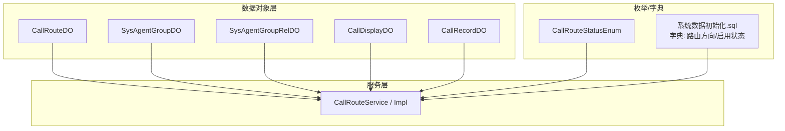
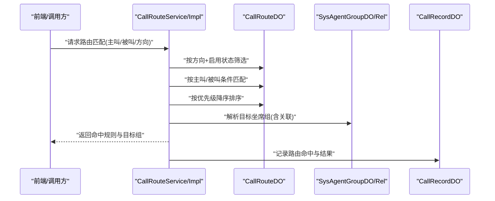
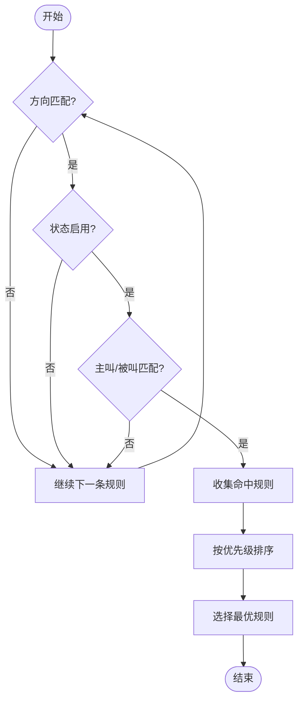
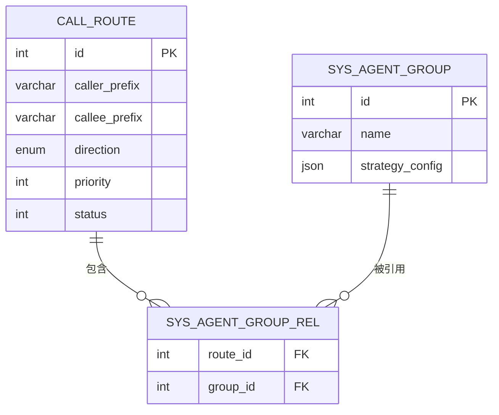
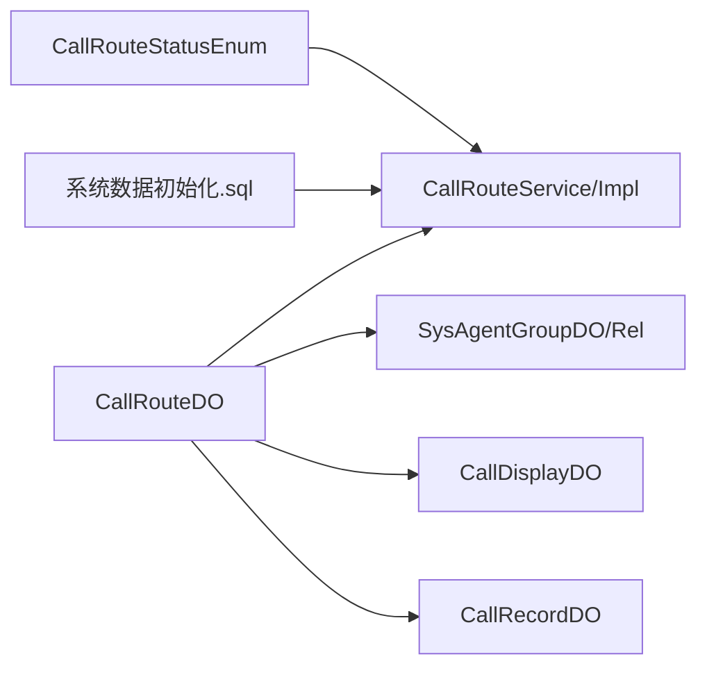

# 路由规则表

<cite>
**本文引用的文件**
- [CallRouteDO.java](file://yudao-cloud/yudao-module-cc/yudao-module-cc-server/src/main/java/cn/iocoder/yudao/module/cc/dal/dataobject/call/CallRouteDO.java)
- [CallRouteService.java](file://yudao-cloud/yudao-module-cc/yudao-module-cc-server/src/main/java/cn/iocoder/yudao/module/cc/service/call/CallRouteService.java)
- [CallRouteServiceImpl.java](file://yudao-cloud/yudao-module-cc/yudao-module-cc-server/src/main/java/cn/iocoder/yudao/module/cc/service/call/CallRouteServiceImpl.java)
- [SysAgentGroupDO.java](file://yudao-cloud/yudao-module-cc/yudao-module-cc-server/src/main/java/cn/iocoder/yudao/module/cc/dal/dataobject/call/SysAgentGroupDO.java)
- [SysAgentGroupRelDO.java](file://yudao-cloud/yudao-module-cc/yudao-module-cc-server/src/main/java/cn/iocoder/yudao/module/cc/dal/dataobject/call/SysAgentGroupRelDO.java)
- [CallDisplayDO.java](file://yudao-cloud/yudao-module-cc/yudao-module-cc-server/src/main/java/cn/iocoder/yudao/module/cc/dal/dataobject/call/CallDisplayDO.java)
- [CallRecordDO.java](file://yudao-cloud/yudao-module-cc/yudao-module-cc-server/src/main/java/cn/iocoder/yudao/module/cc/dal/dataobject/call/CallRecordDO.java)
- [系统数据初始化.sql](file://yudao-cloud/yudao-module-cc/doc/sql/系统数据初始化.sql)
- [CallRouteStatusEnum.java](file://yudao-cloud/yudao-module-cc/yudao-module-cc-api/src/main/java/cn/iocoder/yudao/module/cc/enums/CallRouteStatusEnum.java)
</cite>

## 目录
1. [简介](#简介)
2. [项目结构](#项目结构)
3. [核心组件](#核心组件)
4. [架构总览](#架构总览)
5. [详细组件分析](#详细组件分析)
6. [依赖关系分析](#依赖关系分析)
7. [性能考虑](#性能考虑)
8. [故障排查指南](#故障排查指南)
9. [结论](#结论)
10. [附录](#附录)

## 简介
本文件围绕呼叫中心模块中的“路由规则表”（对应实体为 CallRoute）进行系统化文档化，覆盖字段定义、匹配与优先级计算、状态管理、策略配置、呼入/呼出差异、CRUD 示例以及冲突检测与解决机制。同时给出与坐席组、号码显示、呼叫记录等周边实体的关联说明，帮助读者快速理解并正确使用该能力。

## 项目结构
与路由规则相关的关键代码位于 CC 模块的 call 子域：
- 数据对象层：CallRouteDO、SysAgentGroupDO、SysAgentGroupRelDO、CallDisplayDO、CallRecordDO
- 服务层：CallRouteService / CallRouteServiceImpl
- 枚举与字典：CallRouteStatusEnum、系统数据初始化中定义的字典项（路由方向、启用状态等）

图表来源
- [CallRouteDO.java](file://yudao-cloud/yudao-module-cc/yudao-module-cc-server/src/main/java/cn/iocoder/yudao/module/cc/dal/dataobject/call/CallRouteDO.java)
- [SysAgentGroupDO.java](file://yudao-cloud/yudao-module-cc/yudao-module-cc-server/src/main/java/cn/iocoder/yudao/module/cc/dal/dataobject/call/SysAgentGroupDO.java)
- [SysAgentGroupRelDO.java](file://yudao-cloud/yudao-module-cc/yudao-module-cc-server/src/main/java/cn/iocoder/yudao/module/cc/dal/dataobject/call/SysAgentGroupRelDO.java)
- [CallDisplayDO.java](file://yudao-cloud/yudao-module-cc/yudao-module-cc-server/src/main/java/cn/iocoder/yudao/module/cc/dal/dataobject/call/CallDisplayDO.java)
- [CallRecordDO.java](file://yudao-cloud/yudao-module-cc/yudao-module-cc-server/src/main/java/cn/iocoder/yudao/module/cc/dal/dataobject/call/CallRecordDO.java)
- [CallRouteService.java](file://yudao-cloud/yudao-module-cc/yudao-module-cc-server/src/main/java/cn/iocoder/yudao/module/cc/service/call/CallRouteService.java)
- [CallRouteServiceImpl.java](file://yudao-cloud/yudao-module-cc/yudao-module-cc-server/src/main/java/cn/iocoder/yudao/module/cc/service/call/CallRouteServiceImpl.java)
- [系统数据初始化.sql](file://yudao-cloud/yudao-module-cc/doc/sql/系统数据初始化.sql)

章节来源
- [CallRouteDO.java](file://yudao-cloud/yudao-module-cc/yudao-module-cc-server/src/main/java/cn/iocoder/yudao/module/cc/dal/dataobject/call/CallRouteDO.java)
- [CallRouteService.java](file://yudao-cloud/yudao-module-cc/yudao-module-cc-server/src/main/java/cn/iocoder/yudao/module/cc/service/call/CallRouteService.java)
- [CallRouteServiceImpl.java](file://yudao-cloud/yudao-module-cc/yudao-module-cc-server/src/main/java/cn/iocoder/yudao/module/cc/service/call/CallRouteServiceImpl.java)
- [系统数据初始化.sql](file://yudao-cloud/yudao-module-cc/doc/sql/系统数据初始化.sql)

## 核心组件
- 路由规则实体（CallRouteDO）：承载主叫/被叫匹配条件、路由方向、优先级、目标坐席组、状态等核心信息。
- 坐席组实体（SysAgentGroupDO）：作为路由的目标分组，承载组策略与溢出/全忙策略等。
- 坐席组关联（SysAgentGroupRelDO）：用于将路由规则与一个或多个坐席组建立关联。
- 号码显示（CallDisplayDO）：可参与主叫/被叫匹配或显号策略。
- 呼叫记录（CallRecordDO）：记录路由命中结果及通话过程指标。
- 路由服务（CallRouteService/Impl）：提供路由规则的查询、匹配、排序、创建、更新、删除等操作。
- 枚举与字典：
  - 路由启用状态：启用/未启用（字典类型：cc_call_route_status）
  - 路由方向：呼入/呼出（字典类型：cc_call_route_direction_type）

章节来源
- [CallRouteDO.java](file://yudao-cloud/yudao-module-cc/yudao-module-cc-server/src/main/java/cn/iocoder/yudao/module/cc/dal/dataobject/call/CallRouteDO.java)
- [SysAgentGroupDO.java](file://yudao-cloud/yudao-module-cc/yudao-module-cc-server/src/main/java/cn/iocoder/yudao/module/cc/dal/dataobject/call/SysAgentGroupDO.java)
- [SysAgentGroupRelDO.java](file://yudao-cloud/yudao-module-cc/yudao-module-cc-server/src/main/java/cn/iocoder/yudao/module/cc/dal/dataobject/call/SysAgentGroupRelDO.java)
- [CallDisplayDO.java](file://yudao-cloud/yudao-module-cc/yudao-module-cc-server/src/main/java/cn/iocoder/yudao/module/cc/dal/dataobject/call/CallDisplayDO.java)
- [CallRecordDO.java](file://yudao-cloud/yudao-module-cc/yudao-module-cc-server/src/main/java/cn/iocoder/yudao/module/cc/dal/dataobject/call/CallRecordDO.java)
- [CallRouteService.java](file://yudao-cloud/yudao-module-cc/yudao-module-cc-server/src/main/java/cn/iocoder/yudao/module/cc/service/call/CallRouteService.java)
- [CallRouteServiceImpl.java](file://yudao-cloud/yudao-module-cc/yudao-module-cc-server/src/main/java/cn/iocoder/yudao/module/cc/service/call/CallRouteServiceImpl.java)
- [系统数据初始化.sql](file://yudao-cloud/yudao-module-cc/doc/sql/系统数据初始化.sql)

## 架构总览
路由匹配与服务调用时序如下：

图表来源
- [CallRouteService.java](file://yudao-cloud/yudao-module-cc/yudao-module-cc-server/src/main/java/cn/iocoder/yudao/module/cc/service/call/CallRouteService.java)
- [CallRouteServiceImpl.java](file://yudao-cloud/yudao-module-cc/yudao-module-cc-server/src/main/java/cn/iocoder/yudao/module/cc/service/call/CallRouteServiceImpl.java)
- [CallRouteDO.java](file://yudao-cloud/yudao-module-cc/yudao-module-cc-server/src/main/java/cn/iocoder/yudao/module/cc/dal/dataobject/call/CallRouteDO.java)
- [SysAgentGroupDO.java](file://yudao-cloud/yudao-module-cc/yudao-module-cc-server/src/main/java/cn/iocoder/yudao/module/cc/dal/dataobject/call/SysAgentGroupDO.java)
- [SysAgentGroupRelDO.java](file://yudao-cloud/yudao-module-cc/yudao-module-cc-server/src/main/java/cn/iocoder/yudao/module/cc/dal/dataobject/call/SysAgentGroupRelDO.java)
- [CallRecordDO.java](file://yudao-cloud/yudao-module-cc/yudao-module-cc-server/src/main/java/cn/iocoder/yudao/module/cc/dal/dataobject/call/CallRecordDO.java)

## 详细组件分析

### 路由规则实体（CallRouteDO）字段说明
- 主叫号码/主叫前缀：用于匹配来话的主叫号码或前缀段，支持精确或前缀匹配。
- 被叫号码/被叫前缀：用于匹配去话的被叫号码或前缀段。
- 路由方向：呼入/呼出，决定该规则适用的呼叫方向。
- 优先级：数值越小优先级越高（或反之，以实现为准），用于在多条规则命中时确定最终选择。
- 目标坐席组：通过关联表指向一个或多个坐席组，作为路由落点。
- 状态：启用/未启用，仅启用状态的规则参与匹配。
- 其他扩展字段：如时间窗口、节假日、号码池、显号策略等，可根据业务需要扩展。

章节来源
- [CallRouteDO.java](file://yudao-cloud/yudao-module-cc/yudao-module-cc-server/src/main/java/cn/iocoder/yudao/module/cc/dal/dataobject/call/CallRouteDO.java)
- [系统数据初始化.sql](file://yudao-cloud/yudao-module-cc/doc/sql/系统数据初始化.sql)

### 路由匹配与优先级计算
- 匹配流程：
  1) 根据呼叫方向（呼入/呼出）过滤规则；
  2) 仅对“启用”的规则进行匹配；
  3) 基于主叫/被叫条件进行匹配（精确或前缀）；
  4) 若多条规则命中，按优先级排序选出最高优先的一条；
  5) 解析目标坐席组并返回。
- 优先级计算：
  - 通常采用“数值越小优先级越高”的策略，或在相同优先级下结合时间/负载等次级条件。
  - 建议在创建/更新时校验优先级唯一性或冲突提示。

图表来源
- [CallRouteServiceImpl.java](file://yudao-cloud/yudao-module-cc/yudao-module-cc-server/src/main/java/cn/iocoder/yudao/module/cc/service/call/CallRouteServiceImpl.java)
- [CallRouteDO.java](file://yudao-cloud/yudao-module-cc/yudao-module-cc-server/src/main/java/cn/iocoder/yudao/module/cc/dal/dataobject/call/CallRouteDO.java)

章节来源
- [CallRouteServiceImpl.java](file://yudao-cloud/yudao-module-cc/yudao-module-cc-server/src/main/java/cn/iocoder/yudao/module/cc/service/call/CallRouteServiceImpl.java)
- [CallRouteDO.java](file://yudao-cloud/yudao-module-cc/yudao-module-cc-server/src/main/java/cn/iocoder/yudao/module/cc/dal/dataobject/call/CallRouteDO.java)

### 路由状态管理（启用/禁用）
- 启用：参与匹配与调度。
- 未启用：不参与匹配，便于灰度发布或临时下线。
- 建议：
  - 批量启停时增加事务与审计日志；
  - 变更生效需考虑缓存刷新与热更新。

章节来源
- [系统数据初始化.sql](file://yudao-cloud/yudao-module-cc/doc/sql/系统数据初始化.sql)
- [CallRouteStatusEnum.java](file://yudao-cloud/yudao-module-cc/yudao-module-cc-api/src/main/java/cn/iocoder/yudao/module/cc/enums/CallRouteStatusEnum.java)

### 路由策略配置（呼入 vs 呼出）
- 呼入路由：根据主叫号码/前缀匹配，将来电路由到指定坐席组。
- 呼出路由：根据被叫号码/前缀匹配，将外呼路由到指定坐席组或网关。
- 策略要点：
  - 明确方向字段，避免跨方向误配；
  - 针对高频号码段设置更具体的规则，提高命中率；
  - 结合时间窗口与节假日策略，实现差异化路由。

章节来源
- [系统数据初始化.sql](file://yudao-cloud/yudao-module-cc/doc/sql/系统数据初始化.sql)
- [CallRouteDO.java](file://yudao-cloud/yudao-module-cc/yudao-module-cc-server/src/main/java/cn/iocoder/yudao/module/cc/dal/dataobject/call/CallRouteDO.java)

### 与坐席组的关联
- 路由规则通过关联表指向一个或多个坐席组，支持多目标组与负载均衡。
- 坐席组可配置溢出策略、全忙策略、分配策略等，影响实际分派行为。

图表来源
- [CallRouteDO.java](file://yudao-cloud/yudao-module-cc/yudao-module-cc-server/src/main/java/cn/iocoder/yudao/module/cc/dal/dataobject/call/CallRouteDO.java)
- [SysAgentGroupDO.java](file://yudao-cloud/yudao-module-cc/yudao-module-cc-server/src/main/java/cn/iocoder/yudao/module/cc/dal/dataobject/call/SysAgentGroupDO.java)
- [SysAgentGroupRelDO.java](file://yudao-cloud/yudao-module-cc/yudao-module-cc-server/src/main/java/cn/iocoder/yudao/module/cc/dal/dataobject/call/SysAgentGroupRelDO.java)

章节来源
- [SysAgentGroupDO.java](file://yudao-cloud/yudao-module-cc/yudao-module-cc-server/src/main/java/cn/iocoder/yudao/module/cc/dal/dataobject/call/SysAgentGroupDO.java)
- [SysAgentGroupRelDO.java](file://yudao-cloud/yudao-module-cc/yudao-module-cc-server/src/main/java/cn/iocoder/yudao/module/cc/dal/dataobject/call/SysAgentGroupRelDO.java)

### 与号码显示和呼叫记录的关联
- 号码显示（CallDisplayDO）：可用于主叫/被叫显号控制或号码池管理，配合路由规则实现更精细的号码策略。
- 呼叫记录（CallRecordDO）：记录每次路由命中结果、目标组、时长、状态等，用于分析与回溯。

章节来源
- [CallDisplayDO.java](file://yudao-cloud/yudao-module-cc/yudao-module-cc-server/src/main/java/cn/iocoder/yudao/module/cc/dal/dataobject/call/CallDisplayDO.java)
- [CallRecordDO.java](file://yudao-cloud/yudao-module-cc/yudao-module-cc-server/src/main/java/cn/iocoder/yudao/module/cc/dal/dataobject/call/CallRecordDO.java)

### CRUD 操作示例（概念性）
以下示例描述典型操作语义，具体接口名称与参数以实际 API 为准：
- 创建路由规则：
  - 输入：方向、主叫/被叫条件、优先级、目标坐席组、状态等；
  - 校验：方向合法性、优先级范围、目标组存在性、冲突检测；
  - 输出：新建规则ID。
- 查询路由规则：
  - 支持按方向、状态、主叫/被叫前缀、优先级等条件分页查询。
- 更新路由规则：
  - 支持修改匹配条件、优先级、目标组、状态；
  - 变更时触发冲突检测与缓存刷新。
- 删除路由规则：
  - 软删除或物理删除，删除前检查是否被引用。

章节来源
- [CallRouteService.java](file://yudao-cloud/yudao-module-cc/yudao-module-cc-server/src/main/java/cn/iocoder/yudao/module/cc/service/call/CallRouteService.java)
- [CallRouteServiceImpl.java](file://yudao-cloud/yudao-module-cc/yudao-module-cc-server/src/main/java/cn/iocoder/yudao/module/cc/service/call/CallRouteServiceImpl.java)

### 冲突检测与解决机制
- 冲突场景：
  - 同一方向下，多条规则对相同主叫/被叫前缀命中且优先级相同；
  - 宽泛规则与精确规则并存导致意外命中；
  - 目标组不可用或无可用坐席时的回退路径缺失。
- 检测策略：
  - 在保存/更新时进行规则重叠检测，提示潜在冲突；
  - 对相同优先级的命中规则进行合并或强制唯一性约束；
  - 引入“兜底规则”确保任何呼叫都能路由到默认组。
- 解决建议：
  - 细化匹配条件，减少歧义；
  - 合理设置优先级，确保关键业务优先；
  - 为每个方向至少保留一条兜底规则；
  - 定期巡检与告警，发现异常命中及时修正。

章节来源
- [CallRouteServiceImpl.java](file://yudao-cloud/yudao-module-cc/yudao-module-cc-server/src/main/java/cn/iocoder/yudao/module/cc/service/call/CallRouteServiceImpl.java)
- [CallRouteDO.java](file://yudao-cloud/yudao-module-cc/yudao-module-cc-server/src/main/java/cn/iocoder/yudao/module/cc/dal/dataobject/call/CallRouteDO.java)

## 依赖关系分析
- 内聚性：CallRouteDO 聚焦于规则本身，服务层负责匹配与排序，职责清晰。
- 耦合点：
  - 与 SysAgentGroupDO/Rel 的关联用于目标分发；
  - 与 CallDisplayDO 的协同用于号码策略；
  - 与 CallRecordDO 的记录用于审计与分析。
- 外部依赖：
  - 字典与枚举提供统一的状态与方向值域；
  - 数据库索引与查询优化影响匹配性能。

图表来源
- [CallRouteDO.java](file://yudao-cloud/yudao-module-cc/yudao-module-cc-server/src/main/java/cn/iocoder/yudao/module/cc/dal/dataobject/call/CallRouteDO.java)
- [CallRouteService.java](file://yudao-cloud/yudao-module-cc/yudao-module-cc-server/src/main/java/cn/iocoder/yudao/module/cc/service/call/CallRouteService.java)
- [CallRouteServiceImpl.java](file://yudao-cloud/yudao-module-cc/yudao-module-cc-server/src/main/java/cn/iocoder/yudao/module/cc/service/call/CallRouteServiceImpl.java)
- [SysAgentGroupDO.java](file://yudao-cloud/yudao-module-cc/yudao-module-cc-server/src/main/java/cn/iocoder/yudao/module/cc/dal/dataobject/call/SysAgentGroupDO.java)
- [SysAgentGroupRelDO.java](file://yudao-cloud/yudao-module-cc/yudao-module-cc-server/src/main/java/cn/iocoder/yudao/module/cc/dal/dataobject/call/SysAgentGroupRelDO.java)
- [CallDisplayDO.java](file://yudao-cloud/yudao-module-cc/yudao-module-cc-server/src/main/java/cn/iocoder/yudao/module/cc/dal/dataobject/call/CallDisplayDO.java)
- [CallRecordDO.java](file://yudao-cloud/yudao-module-cc/yudao-module-cc-server/src/main/java/cn/iocoder/yudao/module/cc/dal/dataobject/call/CallRecordDO.java)
- [CallRouteStatusEnum.java](file://yudao-cloud/yudao-module-cc/yudao-module-cc-api/src/main/java/cn/iocoder/yudao/module/cc/enums/CallRouteStatusEnum.java)
- [系统数据初始化.sql](file://yudao-cloud/yudao-module-cc/doc/sql/系统数据初始化.sql)

章节来源
- [CallRouteServiceImpl.java](file://yudao-cloud/yudao-module-cc/yudao-module-cc-server/src/main/java/cn/iocoder/yudao/module/cc/service/call/CallRouteServiceImpl.java)
- [CallRouteDO.java](file://yudao-cloud/yudao-module-cc/yudao-module-cc-server/src/main/java/cn/iocoder/yudao/module/cc/dal/dataobject/call/CallRouteDO.java)

## 性能考虑
- 索引设计：
  - 为方向、状态、主叫/被叫前缀建立复合索引，加速筛选；
  - 为优先级建立索引，提升排序效率。
- 查询优化：
  - 先按方向+状态过滤，再按前缀匹配，最后按优先级排序；
  - 限制命中规则集大小，避免全表扫描。
- 缓存策略：
  - 热点规则（如常用前缀）可缓存至内存，降低数据库压力；
  - 规则变更时主动失效缓存。
- 批处理与异步：
  - 批量启停或导入导出使用异步任务；
  - 呼叫记录写入采用异步落库，避免阻塞主流程。

[本节为通用性能建议，不直接分析具体文件]

## 故障排查指南
- 常见问题：
  - 规则未命中：检查方向、状态、主叫/被叫条件是否正确；
  - 命中错误规则：检查优先级与规则粒度，是否存在宽泛规则覆盖；
  - 目标组不可用：检查组成员在线状态与溢出/全忙策略；
  - 性能问题：检查索引、缓存命中率与慢查询。
- 定位方法：
  - 查看呼叫记录（CallRecordDO）中的路由命中详情；
  - 核对字典值与枚举值是否一致；
  - 使用监控与日志追踪匹配流程。

章节来源
- [CallRecordDO.java](file://yudao-cloud/yudao-module-cc/yudao-module-cc-server/src/main/java/cn/iocoder/yudao/module/cc/dal/dataobject/call/CallRecordDO.java)
- [系统数据初始化.sql](file://yudao-cloud/yudao-module-cc/doc/sql/系统数据初始化.sql)

## 结论
路由规则表（CallRoute）是呼叫中心的核心能力之一，通过明确的方向、匹配条件、优先级与目标坐席组，支撑灵活的呼入/呼出路由策略。结合状态管理、冲突检测与性能优化，可实现高可用、可扩展的呼叫路由体系。建议在生产环境中持续巡检规则质量，完善兜底策略与监控告警，保障业务稳定性。

[本节为总结性内容，不直接分析具体文件]

## 附录
- 字典参考：
  - 路由启用状态：启用/未启用（cc_call_route_status）
  - 路由方向：呼入/呼出（cc_call_route_direction_type）
- 相关实体：
  - 坐席组（SysAgentGroupDO）：承载组策略与溢出/全忙策略；
  - 号码显示（CallDisplayDO）：辅助号码策略；
  - 呼叫记录（CallRecordDO）：审计与分析依据。

章节来源
- [系统数据初始化.sql](file://yudao-cloud/yudao-module-cc/doc/sql/系统数据初始化.sql)
- [SysAgentGroupDO.java](file://yudao-cloud/yudao-module-cc/yudao-module-cc-server/src/main/java/cn/iocoder/yudao/module/cc/dal/dataobject/call/SysAgentGroupDO.java)
- [CallDisplayDO.java](file://yudao-cloud/yudao-module-cc/yudao-module-cc-server/src/main/java/cn/iocoder/yudao/module/cc/dal/dataobject/call/CallDisplayDO.java)
- [CallRecordDO.java](file://yudao-cloud/yudao-module-cc/yudao-module-cc-server/src/main/java/cn/iocoder/yudao/module/cc/dal/dataobject/call/CallRecordDO.java)