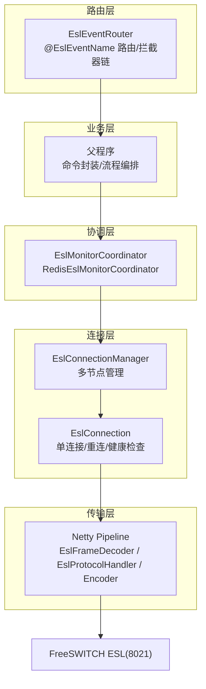
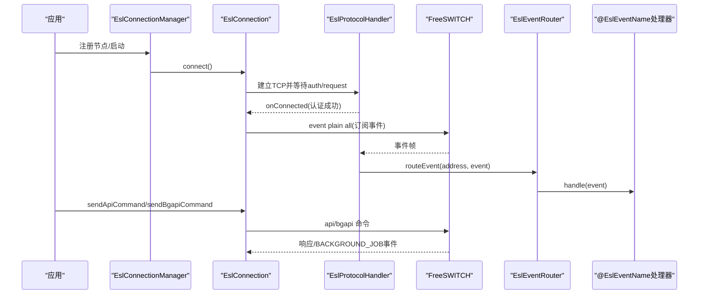
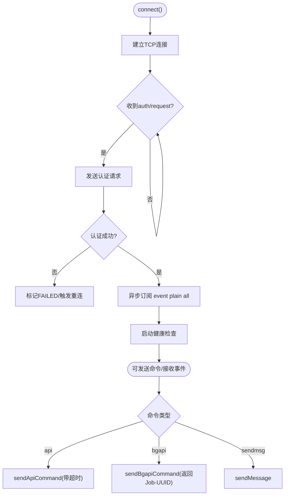
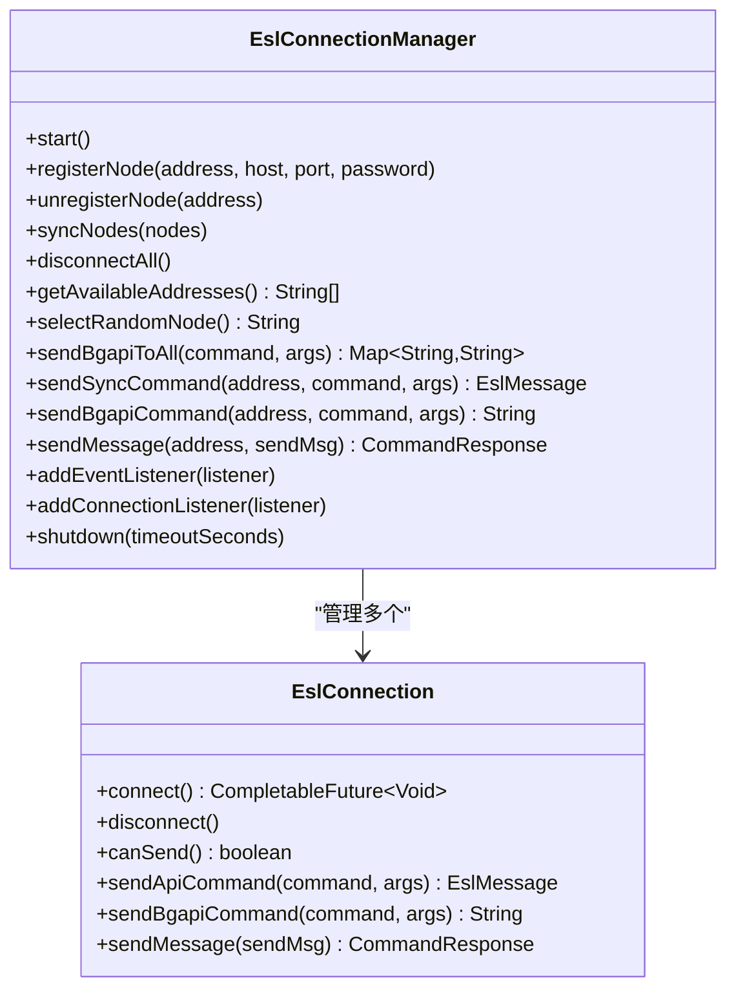
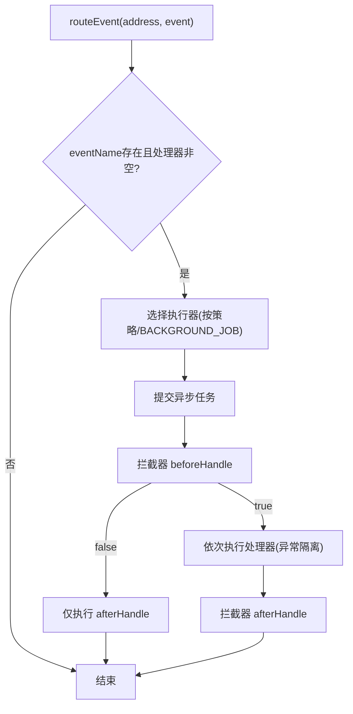
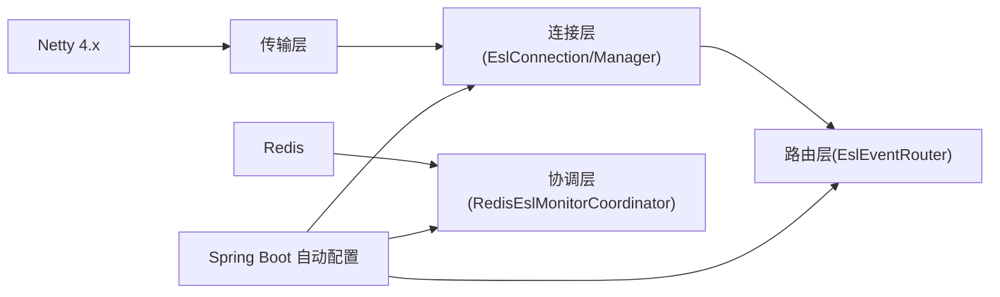

# FreeSWITCH集成架构

<cite>
**本文引用的文件**
- [README.md](file://yudao-cloud/yudao-module-cc/ipcc-fs-esl/README.md)
- [fs-esl-client组件架构设计.md](file://yudao-cloud/yudao-module-cc/ipcc-fs-esl/fs-esl-client组件架构设计.md)
- [EslConnection.java](file://yudao-cloud/yudao-module-cc/ipcc-fs-esl/src/main/java/cn/ipcc/fs/esl/EslConnection.java)
- [EslConnectionManager.java](file://yudao-cloud/yudao-module-cc/ipcc-fs-esl/src/main/java/cn/ipcc/fs/esl/EslConnectionManager.java)
- [EslEventRouter.java](file://yudao-cloud/yudao-module-cc/ipcc-fs-esl/src/main/java/cn/ipcc/fs/esl/router/EslEventRouter.java)
- [RedisEslMonitorCoordinator.java](file://yudao-cloud/yudao-module-cc/ipcc-fs-esl/src/main/java/cn/ipcc/fs/esl/coordinator/redis/RedisEslMonitorCoordinator.java)
- [ExampleJavaApplication.java](file://yudao-cloud/yudao-module-cc/ipcc-fs-esl/example/example-java/src/main/java/cn/ipcc/fs/esl/example/ExampleJavaApplication.java)
- [freeswitch部署脚本1.py](file://yudao-cloud/yudao-module-cc/doc/freeswitch服务/freeswitch部署脚本1.py)
</cite>

## 目录
1. [简介](#简介)
2. [项目结构](#项目结构)
3. [核心组件](#核心组件)
4. [架构总览](#架构总览)
5. [详细组件分析](#详细组件分析)
6. [依赖关系分析](#依赖关系分析)
7. [性能考量](#性能考量)
8. [故障排查指南](#故障排查指南)
9. [结论](#结论)
10. [附录](#附录)

## 简介
本文件面向IPCC呼叫中心系统的FreeSWITCH集成，聚焦ESL（Event Socket Library）客户端在Java侧的实现与架构。内容涵盖连接管理、事件订阅、命令发送、事件驱动模型、异步处理模式；详细说明EslConnectionManager的连接池管理、心跳检测、故障恢复；梳理ESL事件分类、处理流程与状态同步机制；并给出FreeSWITCH配置要点、拨号计划集成、媒体流控制的关键实现建议，以及事件监听器开发示例与调试技巧。

## 项目结构
该模块采用分层架构：传输层（Netty）、连接管理层（单连接与多节点管理）、事件路由层（注解驱动路由与拦截器链）、分布式协调层（基于Redis的监听权竞争），并提供Spring Boot自动配置与可观测性扩展点。



图表来源
- [fs-esl-client组件架构设计.md:114-191](file://yudao-cloud/yudao-module-cc/ipcc-fs-esl/fs-esl-client组件架构设计.md#L114-L191)
- [README.md:50-98](file://yudao-cloud/yudao-module-cc/ipcc-fs-esl/README.md#L50-L98)

章节来源
- [README.md:50-98](file://yudao-cloud/yudao-module-cc/ipcc-fs-esl/README.md#L50-L98)
- [fs-esl-client组件架构设计.md:114-191](file://yudao-cloud/yudao-module-cc/ipcc-fs-esl/fs-esl-client组件架构设计.md#L114-L191)

## 核心组件
- EslConnection：单连接客户端，负责TCP连接、认证握手、事件订阅、命令发送（api/bgapi/sendmsg）、自动重连与健康检查。
- EslConnectionManager：多节点管理器，提供节点注册/移除、对账式同步、随机选择可用节点、批量bgapi广播等能力。
- EslEventRouter：事件路由器，扫描@EslEventName处理器，按策略（CHANNEL_HASH/SINGLE_THREAD/FULL_CONCURRENT）分发事件，支持拦截器链与BACKGROUND_JOB独立线程池。
- RedisEslMonitorCoordinator：基于Redis的分布式监听权协调，实现锁获取、续期、释放与切换回调。
- Spring自动配置：自动装配连接管理器、路由器、协调器与指标拦截器，暴露统一配置前缀。

章节来源
- [EslConnection.java:32-167](file://yudao-cloud/yudao-module-cc/ipcc-fs-esl/src/main/java/cn/ipcc/fs/esl/EslConnection.java#L32-L167)
- [EslConnectionManager.java:19-113](file://yudao-cloud/yudao-module-cc/ipcc-fs-esl/src/main/java/cn/ipcc/fs/esl/EslConnectionManager.java#L19-L113)
- [EslEventRouter.java:14-74](file://yudao-cloud/yudao-module-cc/ipcc-fs-esl/src/main/java/cn/ipcc/fs/esl/router/EslEventRouter.java#L14-L74)
- [RedisEslMonitorCoordinator.java:16-75](file://yudao-cloud/yudao-module-cc/ipcc-fs-esl/src/main/java/cn/ipcc/fs/esl/coordinator/redis/RedisEslMonitorCoordinator.java#L16-L75)
- [README.md:153-179](file://yudao-cloud/yudao-module-cc/ipcc-fs-esl/README.md#L153-L179)

## 架构总览
系统通过Netty建立与FreeSWITCH的ESL Inbound连接，完成认证后订阅事件；事件经路由器按策略分发给处理器；多实例间通过Redis协调监听权，避免重复处理；连接层提供健康检查与指数退避重连，保障高可用。



图表来源
- [EslConnection.java:102-139](file://yudao-cloud/yudao-module-cc/ipcc-fs-esl/src/main/java/cn/ipcc/fs/esl/EslConnection.java#L102-L139)
- [EslConnection.java:409-445](file://yudao-cloud/yudao-module-cc/ipcc-fs-esl/src/main/java/cn/ipcc/fs/esl/EslConnection.java#L409-L445)
- [EslEventRouter.java:106-153](file://yudao-cloud/yudao-module-cc/ipcc-fs-esl/src/main/java/cn/ipcc/fs/esl/router/EslEventRouter.java#L106-L153)

## 详细组件分析

### EslConnection（单连接客户端）
- 连接生命周期：DISCONNECTED → CONNECTING → CONNECTED → AUTHENTICATED；异常时进入RECONNECTING或FAILED。
- 认证与事件订阅：认证成功后异步订阅“event plain all”，并启动健康检查。
- 命令发送：
  - sendApiCommand：自动添加“api ”前缀，带超时控制。
  - sendBgapiCommand：独立bgapi命令，返回Job-UUID，实际结果通过BACKGROUND_JOB事件异步返回。
  - sendMessage：sendmsg操作指定通道。
- 自动重连：指数退避+随机抖动，达到最大重试次数后停止。
- 健康检查：定时发送status命令，连续失败阈值触发重连。



图表来源
- [EslConnection.java:102-139](file://yudao-cloud/yudao-module-cc/ipcc-fs-esl/src/main/java/cn/ipcc/fs/esl/EslConnection.java#L102-L139)
- [EslConnection.java:179-269](file://yudao-cloud/yudao-module-cc/ipcc-fs-esl/src/main/java/cn/ipcc/fs/esl/EslConnection.java#L179-L269)
- [EslConnection.java:296-374](file://yudao-cloud/yudao-module-cc/ipcc-fs-esl/src/main/java/cn/ipcc/fs/esl/EslConnection.java#L296-L374)
- [EslConnection.java:409-445](file://yudao-cloud/yudao-module-cc/ipcc-fs-esl/src/main/java/cn/ipcc/fs/esl/EslConnection.java#L409-L445)

章节来源
- [EslConnection.java:32-167](file://yudao-cloud/yudao-module-cc/ipcc-fs-esl/src/main/java/cn/ipcc/fs/esl/EslConnection.java#L32-L167)
- [EslConnection.java:179-269](file://yudao-cloud/yudao-module-cc/ipcc-fs-esl/src/main/java/cn/ipcc/fs/esl/EslConnection.java#L179-L269)
- [EslConnection.java:296-374](file://yudao-cloud/yudao-module-cc/ipcc-fs-esl/src/main/java/cn/ipcc/fs/esl/EslConnection.java#L296-L374)
- [EslConnection.java:409-445](file://yudao-cloud/yudao-module-cc/ipcc-fs-esl/src/main/java/cn/ipcc/fs/esl/EslConnection.java#L409-L445)

### EslConnectionManager（多节点管理器）
- 节点管理：registerNode/unregisterNode，支持syncNodes对账式重载。
- 节点选择：selectRandomNode从可用节点中随机挑选。
- 批量操作：sendBgapiToAll向所有节点广播bgapi命令。
- 事件与连接监听：addEventListener/addConnectionListener对所有节点生效。
- 优雅关闭：shutdown断开所有连接并释放资源。



图表来源
- [EslConnectionManager.java:47-113](file://yudao-cloud/yudao-module-cc/ipcc-fs-esl/src/main/java/cn/ipcc/fs/esl/EslConnectionManager.java#L47-L113)
- [EslConnectionManager.java:141-205](file://yudao-cloud/yudao-module-cc/ipcc-fs-esl/src/main/java/cn/ipcc/fs/esl/EslConnectionManager.java#L141-L205)
- [EslConnection.java:102-167](file://yudao-cloud/yudao-module-cc/ipcc-fs-esl/src/main/java/cn/ipcc/fs/esl/EslConnection.java#L102-L167)

章节来源
- [EslConnectionManager.java:19-113](file://yudao-cloud/yudao-module-cc/ipcc-fs-esl/src/main/java/cn/ipcc/fs/esl/EslConnectionManager.java#L19-L113)
- [EslConnectionManager.java:141-205](file://yudao-cloud/yudao-module-cc/ipcc-fs-esl/src/main/java/cn/ipcc/fs/esl/EslConnectionManager.java#L141-L205)

### EslEventRouter（事件路由与拦截器链）
- 处理器注册：启动时扫描@EslEventName处理器，建立事件名到处理器列表映射。
- 执行策略：
  - CHANNEL_HASH：按Unique-ID哈希分配到固定单线程池，保证同通道事件顺序。
  - SINGLE_THREAD：全量单线程，低并发场景。
  - FULL_CONCURRENT：全并发线程池。
- BACKGROUND_JOB：独立线程池，避免与普通事件互相阻塞。
- 拦截器链：beforeHandle/afterHandle在同一任务内执行，确保ThreadLocal上下文透传与资源清理。



图表来源
- [EslEventRouter.java:106-153](file://yudao-cloud/yudao-module-cc/ipcc-fs-esl/src/main/java/cn/ipcc/fs/esl/router/EslEventRouter.java#L106-L153)
- [EslEventRouter.java:155-186](file://yudao-cloud/yudao-module-cc/ipcc-fs-esl/src/main/java/cn/ipcc/fs/esl/router/EslEventRouter.java#L155-L186)

章节来源
- [EslEventRouter.java:14-74](file://yudao-cloud/yudao-module-cc/ipcc-fs-esl/src/main/java/cn/ipcc/fs/esl/router/EslEventRouter.java#L14-L74)
- [EslEventRouter.java:106-153](file://yudao-cloud/yudao-module-cc/ipcc-fs-esl/src/main/java/cn/ipcc/fs/esl/router/EslEventRouter.java#L106-L153)
- [EslEventRouter.java:155-186](file://yudao-cloud/yudao-module-cc/ipcc-fs-esl/src/main/java/cn/ipcc/fs/esl/router/EslEventRouter.java#L155-L186)

### RedisEslMonitorCoordinator（分布式监听权协调）
- 竞争机制：SET NX EX获取锁，维护statusKey记录持权实例。
- 续期与释放：定时续期，失败则释放监听权；停止时主动删除键。
- 回调：onAcquire/onLose通知上层进行连接/断连等操作。

```mermaid
sequenceDiagram
participant Inst as "实例A"
participant Redis as "Redis"
participant InstB as "实例B"
loop 每间隔
Inst->>Redis : SET lock IF NOT EXISTS (NX EX)
alt 获取成功
Redis-->>Inst : OK
Inst->>Redis : set status=instanceId (EX)
Inst-->>Inst : onAcquire()
else 未获取
Redis-->>Inst : nil
Inst-->>Inst : 继续尝试
end
end
Note over Inst,Redis : 持权实例定时expire续期; 续期失败则release
```

图表来源
- [RedisEslMonitorCoordinator.java:77-115](file://yudao-cloud/yudao-module-cc/ipcc-fs-esl/src/main/java/cn/ipcc/fs/esl/coordinator/redis/RedisEslMonitorCoordinator.java#L77-L115)
- [RedisEslMonitorCoordinator.java:117-147](file://yudao-cloud/yudao-module-cc/ipcc-fs-esl/src/main/java/cn/ipcc/fs/esl/coordinator/redis/RedisEslMonitorCoordinator.java#L117-L147)

章节来源
- [RedisEslMonitorCoordinator.java:16-75](file://yudao-cloud/yudao-module-cc/ipcc-fs-esl/src/main/java/cn/ipcc/fs/esl/coordinator/redis/RedisEslMonitorCoordinator.java#L16-L75)
- [RedisEslMonitorCoordinator.java:77-147](file://yudao-cloud/yudao-module-cc/ipcc-fs-esl/src/main/java/cn/ipcc/fs/esl/coordinator/redis/RedisEslMonitorCoordinator.java#L77-L147)

### FreeSWITCH配置与集成要点
- ESL端口与ACL：启用ESL监听端口，配置ACL允许Java应用连接。
- mod_xml_curl：将动态配置（dialplan/configuration/phrases）转发至Java后端URL，解决启动阻塞问题可通过临时mock后端快速响应。
- 拨号计划集成：由Java后端通过mod_xml_curl下发DIALPLAN，实现动态路由与IVR。
- 媒体流控制：SIP端口范围与RTP端口范围需开放；如需TLS，注意证书与端口配置。

章节来源
- [freeswitch部署脚本1.py:33-80](file://yudao-cloud/yudao-module-cc/doc/freeswitch服务/freeswitch部署脚本1.py#L33-L80)
- [freeswitch部署脚本1.py:717-800](file://yudao-cloud/yudao-module-cc/doc/freeswitch服务/freeswitch部署脚本1.py#L717-L800)

### 事件监听器开发与调试
- 事件处理器：实现EslEventHandler并标注@EslEventName，使用@Order控制多处理器顺序。
- 事件拦截器：实现EslEventInterceptor，用于监控、链路追踪、过滤等。
- 连接生命周期回调：实现EslConnectionListener感知连接建立/断开/认证成功/失败等。
- 监听权变化回调：实现EslMonitorListener在获取/失去监听权时执行逻辑。
- 示例工程：参考example-java启动类，结合自动配置快速集成。

章节来源
- [README.md:185-262](file://yudao-cloud/yudao-module-cc/ipcc-fs-esl/README.md#L185-L262)
- [ExampleJavaApplication.java:7-20](file://yudao-cloud/yudao-module-cc/ipcc-fs-esl/example/example-java/src/main/java/cn/ipcc/fs/esl/example/ExampleJavaApplication.java#L7-L20)

## 依赖关系分析
- 传输层依赖Netty 4.x，提供高性能I/O与Pipeline编解码。
- 连接层依赖传输层，向上暴露命令发送与连接管理API。
- 路由层依赖连接层的事件流，提供注解驱动的事件分发与拦截器链。
- 协调层依赖Redis，提供分布式监听权竞争与切换回调。
- Spring自动配置聚合上述组件，提供统一Bean装配与配置绑定。



图表来源
- [fs-esl-client组件架构设计.md:114-191](file://yudao-cloud/yudao-module-cc/ipcc-fs-esl/fs-esl-client组件架构设计.md#L114-L191)
- [README.md:50-98](file://yudao-cloud/yudao-module-cc/ipcc-fs-esl/README.md#L50-L98)

章节来源
- [fs-esl-client组件架构设计.md:114-191](file://yudao-cloud/yudao-module-cc/ipcc-fs-esl/fs-esl-client组件架构设计.md#L114-L191)
- [README.md:50-98](file://yudao-cloud/yudao-module-cc/ipcc-fs-esl/README.md#L50-L98)

## 性能考量
- 事件执行策略：
  - CHANNEL_HASH：推荐，保证同通道事件顺序，降低乱序风险。
  - SINGLE_THREAD：适合低并发，简单可靠。
  - FULL_CONCURRENT：无关联事件的高吞吐场景。
- 线程池与队列：可配置事件线程池大小、队列容量与拒绝策略，避免背压导致丢事件。
- 健康检查与重连：合理设置健康检查间隔与失败阈值，配合指数退避重连，减少抖动影响。
- 命令超时：为同步命令设置超时，防止线程永久阻塞。
- 大帧防护：限制最大帧大小与消息头行数，防止OOM与放大攻击。

章节来源
- [EslEventRouter.java:43-74](file://yudao-cloud/yudao-module-cc/ipcc-fs-esl/src/main/java/cn/ipcc/fs/esl/router/EslEventRouter.java#L43-L74)
- [EslConnection.java:296-374](file://yudao-cloud/yudao-module-cc/ipcc-fs-esl/src/main/java/cn/ipcc/fs/esl/EslConnection.java#L296-L374)
- [README.md:153-179](file://yudao-cloud/yudao-module-cc/ipcc-fs-esl/README.md#L153-L179)

## 故障排查指南
- 连接问题：
  - 检查ESL端口与ACL是否放行Java应用地址。
  - 查看连接状态机与日志，确认认证是否成功。
  - 若频繁重连，检查网络抖动与FS负载。
- 命令超时：
  - 调整command-timeout-seconds，避免长耗时命令被截断。
  - 优先使用bgapi发送长时间运行命令，通过BACKGROUND_JOB事件获取结果。
- 事件丢失或乱序：
  - 使用CHANNEL_HASH策略保证同通道顺序。
  - 检查事件线程池容量与拒绝策略，必要时扩容。
- 分布式协调异常：
  - 检查Redis连通性与锁过期时间，确保续期成功。
  - 观察监听权切换回调，确认连接/断连逻辑正确。
- FreeSWITCH配置：
  - 确认mod_xml_curl已加载且gateway-url指向Java后端。
  - 验证dialplan/configuration/phrases绑定是否正确。

章节来源
- [EslConnection.java:179-269](file://yudao-cloud/yudao-module-cc/ipcc-fs-esl/src/main/java/cn/ipcc/fs/esl/EslConnection.java#L179-L269)
- [EslEventRouter.java:106-153](file://yudao-cloud/yudao-module-cc/ipcc-fs-esl/src/main/java/cn/ipcc/fs/esl/router/EslEventRouter.java#L106-L153)
- [RedisEslMonitorCoordinator.java:77-147](file://yudao-cloud/yudao-module-cc/ipcc-fs-esl/src/main/java/cn/ipcc/fs/esl/coordinator/redis/RedisEslMonitorCoordinator.java#L77-L147)
- [freeswitch部署脚本1.py:717-800](file://yudao-cloud/yudao-module-cc/doc/freeswitch服务/freeswitch部署脚本1.py#L717-L800)

## 结论
本架构以Netty为基础构建高可靠的ESL客户端，通过分层设计清晰分离传输、连接、路由与协调职责；提供完善的连接管理、事件路由与分布式协调能力，满足呼叫中心对高可用、可扩展与可观测性的要求。结合FreeSWITCH的mod_xml_curl与拨号计划动态下发，可实现灵活的呼叫控制与媒体流管理。

## 附录
- 快速开始与配置：参见README中的最小配置与完整配置项说明。
- 示例工程：参考example-java，演示全部扩展接口的合理实现与真实FS连接验证。

章节来源
- [README.md:102-179](file://yudao-cloud/yudao-module-cc/ipcc-fs-esl/README.md#L102-L179)
- [ExampleJavaApplication.java:7-20](file://yudao-cloud/yudao-module-cc/ipcc-fs-esl/example/example-java/src/main/java/cn/ipcc/fs/esl/example/ExampleJavaApplication.java#L7-L20)